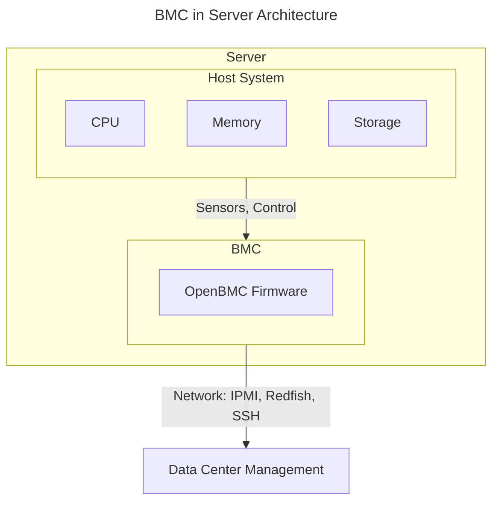
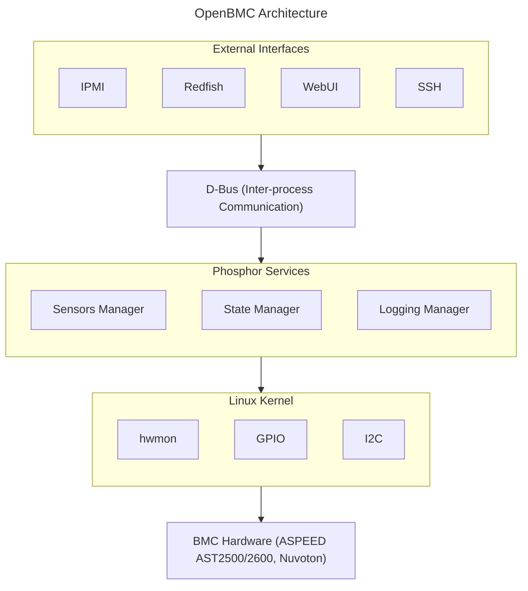
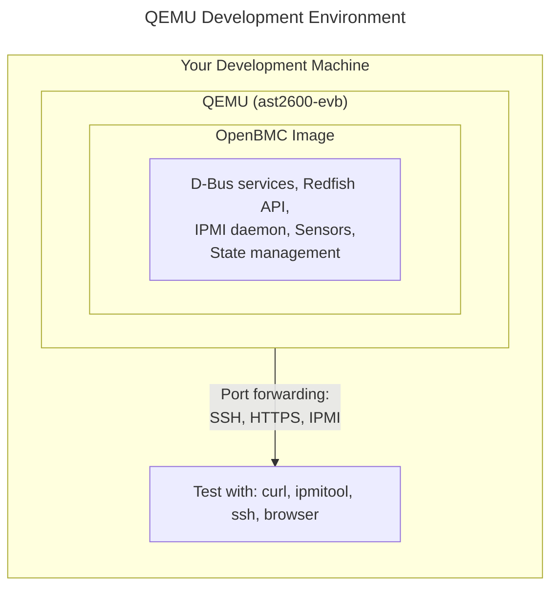

# Introduction to OpenBMC
{: .no_toc }

Learn what OpenBMC is and why it's transforming server management.
{: .fs-6 .fw-300 }

## Table of Contents
{: .no_toc .text-delta }

1. TOC
{:toc}

---

## What is a BMC?

A **Baseboard Management Controller (BMC)** is a specialized microcontroller embedded on server motherboards. It provides **out-of-band management**, meaning it can monitor and control the server even when the main system is powered off or unresponsive.

### BMC Capabilities

- **Remote Power Control**: Power on/off, reset the server remotely
- **Hardware Monitoring**: Track temperatures, voltages, fan speeds
- **Console Access**: Serial-over-LAN for OS-independent access
- **Firmware Updates**: Update BIOS and other firmware remotely
- **Event Logging**: Record hardware events and errors
- **KVM**: Remote keyboard, video, mouse access
- **Virtual Media**: Mount remote images for OS installation



<details>
<summary>ASCII-art version (for comparison)</summary>

```
┌─────────────────────────────────────────────────────────────┐
│                        Server                               │
│  ┌───────────────────────────────────────────────────────┐  │
│  │                   Host System                         │  │
│  │    ┌─────────┐  ┌─────────┐  ┌─────────┐              │  │
│  │    │   CPU   │  │ Memory  │  │ Storage │              │  │
│  │    └─────────┘  └─────────┘  └─────────┘              │  │
│  └───────────────────────────────────────────────────────┘  │
│                           │                                 │
│                           │ (Sensors, Control)              │
│                           ▼                                 │
│  ┌───────────────────────────────────────────────────────┐  │
│  │                        BMC                            │  │
│  │   ┌──────────────────────────────────────────────┐    │  │
│  │   │              OpenBMC Firmware                │    │  │
│  │   └──────────────────────────────────────────────┘    │  │
│  └───────────────────────────────────────────────────────┘  │
│                           │                                 │
│                           │ (Network: IPMI, Redfish, SSH)   │
│                           ▼                                 │
└─────────────────────────────────────────────────────────────┘
                            │
                            ▼
                  ┌─────────────────┐
                  │ Data Center     │
                  │ Management      │
                  └─────────────────┘
```

</details>

---

## What is OpenBMC?

**OpenBMC** is a Linux distribution designed specifically for BMC firmware. It's:

- **Open Source**: Apache 2.0 licensed, community-driven
- **Linux-Based**: Built on Yocto/Poky embedded Linux
- **Standards-Compliant**: Supports IPMI, Redfish, and modern protocols
- **Modular**: Component-based architecture via D-Bus

### Who Uses OpenBMC?

OpenBMC is used by major technology companies including:

- Facebook/Meta
- Google
- Microsoft
- IBM
- Intel
- Rackspace
- LinkedIn

### Why OpenBMC?

| Proprietary BMC | OpenBMC |
|-----------------|---------|
| Closed source, vendor lock-in | Open source, community-driven |
| Fixed feature set | Customizable to your needs |
| Security through obscurity | Auditable code, rapid patches |
| Vendor-specific interfaces | Standard interfaces (Redfish) |
| Limited extensibility | Fully extensible architecture |

---

## OpenBMC Architecture Overview

OpenBMC uses a modern, service-oriented architecture:



<details>
<summary>ASCII-art version (for comparison)</summary>

```
┌─────────────────────────────────────────────────────────────┐
│                    External Interfaces                      │
│   ┌──────────┐  ┌──────────┐  ┌──────────┐  ┌──────────┐    │
│   │   IPMI   │  │ Redfish  │  │  WebUI   │  │   SSH    │    │
│   └──────────┘  └──────────┘  └──────────┘  └──────────┘    │
├─────────────────────────────────────────────────────────────┤
│                        D-Bus                                │
│            (Inter-process Communication)                    │
├─────────────────────────────────────────────────────────────┤
│                    Phosphor Services                        │
│   ┌────────────┐ ┌────────────┐ ┌────────────┐              │
│   │  Sensors   │ │   State    │ │  Logging   │  ...         │
│   │  Manager   │ │  Manager   │ │  Manager   │              │
│   └────────────┘ └────────────┘ └────────────┘              │
├─────────────────────────────────────────────────────────────┤
│                    Linux Kernel                             │
│   ┌────────────┐ ┌────────────┐ ┌────────────┐              │
│   │   hwmon    │ │   GPIO     │ │    I2C     │  ...         │
│   └────────────┘ └────────────┘ └────────────┘              │
├─────────────────────────────────────────────────────────────┤
│                    BMC Hardware                             │
│              (ASPEED AST2500/2600, Nuvoton)                 │
└─────────────────────────────────────────────────────────────┘
```

</details>

### Key Components

- **D-Bus**: Central communication bus connecting all services
- **Phosphor Services**: Modular daemons for specific functions
- **bmcweb**: HTTP server for Redfish and WebUI
- **ipmid**: IPMI command processing
- **systemd**: Service management

---

## Development Environment

### QEMU: The Standard Development Platform

OpenBMC development does **not require physical BMC hardware**. QEMU emulation is the standard development environment used by professional OpenBMC developers at major companies.



<details>
<summary>ASCII-art version (for comparison)</summary>

```
┌─────────────────────────────────────────────────────────────┐
│                  Your Development Machine                    │
│                                                             │
│   ┌─────────────────────────────────────────────────────┐   │
│   │                   QEMU (ast2600-evb)                │   │
│   │  ┌───────────────────────────────────────────────┐  │   │
│   │  │              OpenBMC Image                    │  │   │
│   │  │                                               │  │   │
│   │  │  • Full D-Bus services                       │  │   │
│   │  │  • Redfish API (bmcweb)                      │  │   │
│   │  │  • IPMI daemon                               │  │   │
│   │  │  • Sensor management                         │  │   │
│   │  │  • State management                          │  │   │
│   │  │  • All phosphor-* services                   │  │   │
│   │  └───────────────────────────────────────────────┘  │   │
│   └─────────────────────────────────────────────────────┘   │
│                            │                                 │
│              Port forwarding: SSH, HTTPS, IPMI              │
│                            ▼                                 │
│   ┌─────────────────────────────────────────────────────┐   │
│   │  Test with: curl, ipmitool, ssh, browser           │   │
│   └─────────────────────────────────────────────────────┘   │
└─────────────────────────────────────────────────────────────┘
```

</details>

### What You Can Learn with QEMU

| Topic | QEMU Support | Notes |
|-------|--------------|-------|
| OpenBMC architecture | ✅ Full | All services run identically |
| D-Bus communication | ✅ Full | Same as real hardware |
| Redfish API development | ✅ Full | Complete API available |
| IPMI commands | ✅ Full | ipmitool works |
| Yocto/BitBake builds | ✅ Full | Standard workflow |
| Service development | ✅ Full | Code, build, test cycle |
| Sensor configuration | ✅ Simulated | Values are synthetic |
| Fan control logic | ✅ Simulated | PID algorithms work |

{: .note }
Physical BMC hardware (ASPEED AST2600 EVB ~$500+) is only needed for hardware bring-up tasks like eSPI debugging, PECI communication, or real sensor calibration. These are specialized topics not required for learning OpenBMC software development.

---

## Getting Started Path

Ready to start? Here's your learning path:

1. **[Environment Setup]()** - Set up development tools
2. **[First Build]()** - Build and run in QEMU
3. **[OpenBMC Overview]()** - Deep dive into architecture
4. **[D-Bus Guide]()** - Master the communication layer

---

## Resources

- [OpenBMC GitHub Organization](https://github.com/openbmc)
- [OpenBMC Mailing List](https://lists.ozlabs.org/listinfo/openbmc)
- [OpenBMC Discord](https://discord.gg/openbmc)
- [Redfish Specification](https://www.dmtf.org/standards/redfish)
- [IPMI Specification](https://www.intel.com/content/www/us/en/products/docs/servers/ipmi/ipmi-home.html)
