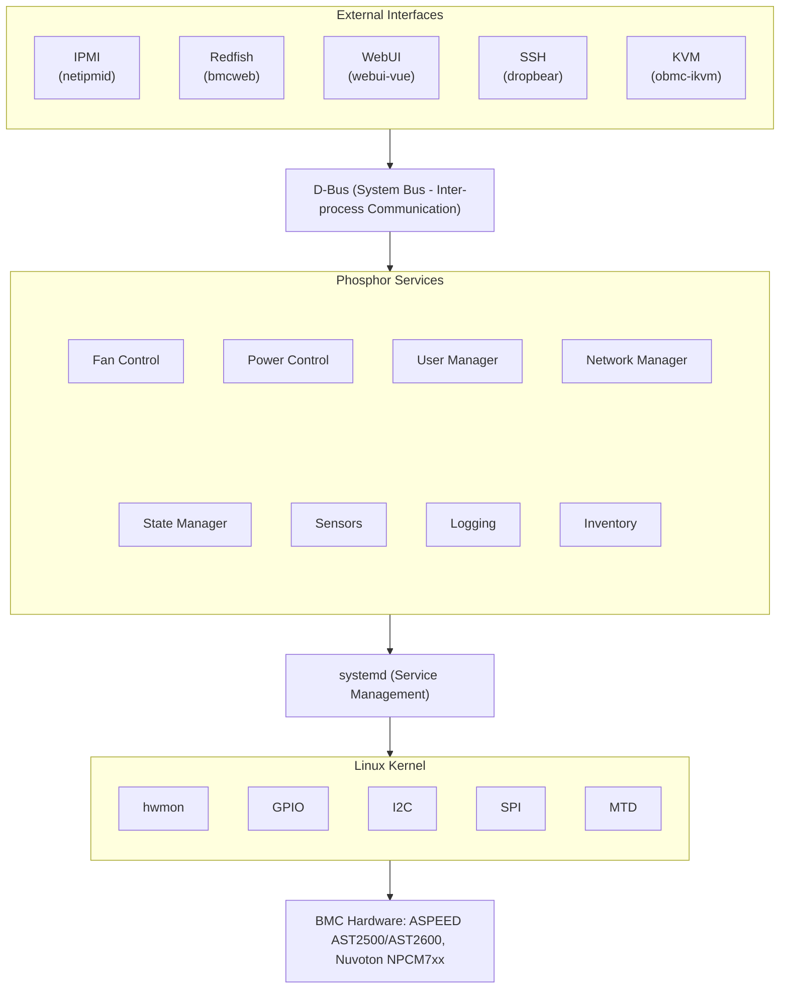
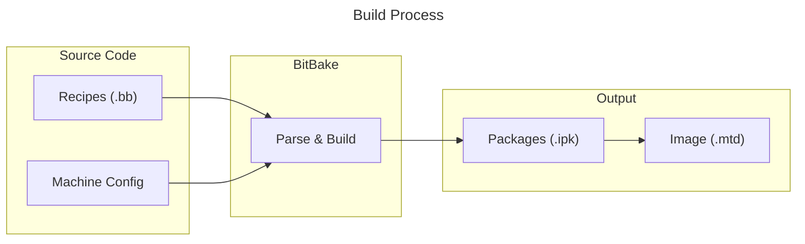
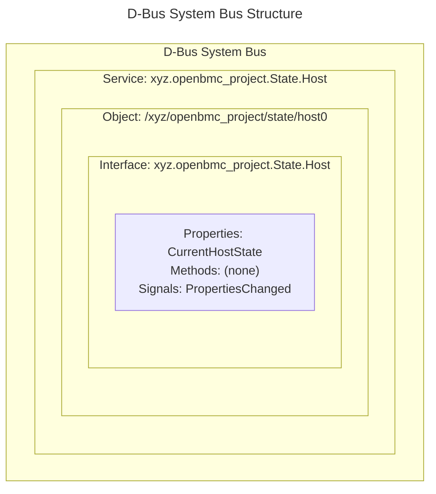

# OpenBMC Overview
{: .no_toc }

Deep dive into OpenBMC architecture, build system, and project organization.
{: .fs-6 .fw-300 }

## Table of Contents
{: .no_toc .text-delta }

1. TOC
{:toc}

---

## Architecture Overview

OpenBMC follows a modular, service-oriented architecture built on Linux.

### High-Level Architecture



<details markdown="1">
<summary>ASCII-art version (for comparison)</summary>

```
┌────────────────────────────────────────────────────────────────────────┐
│                         External Interfaces                            │
│  ┌───────────┐ ┌───────────┐ ┌───────────┐ ┌───────────┐ ┌───────────┐ │
│  │   IPMI    │ │  Redfish  │ │   WebUI   │ │    SSH    │ │    KVM    │ │
│  │ (netipmid)│ │ (bmcweb)  │ │(webui-vue)│ │ (dropbear)│ │(obmc-ikvm)│ │
│  └─────┬─────┘ └─────┬─────┘ └─────┬─────┘ └─────┬─────┘ └─────┬─────┘ │
│        │             │             │             │             │       │
├────────┴─────────────┴─────────────┴─────────────┴─────────────┴───────┤
│                              D-Bus                                     │
│                   (System Bus - Inter-process Communication)           │
├────────────────────────────────────────────────────────────────────────┤
│                         Phosphor Services                              │
│  ┌──────────────┐ ┌──────────────┐ ┌──────────────┐ ┌──────────────┐   │
│  │    State     │ │   Sensors    │ │   Logging    │ │   Inventory  │   │
│  │   Manager    │ │   (dbus-     │ │  (phosphor-  │ │   Manager    │   │
│  │              │ │   sensors)   │ │   logging)   │ │              │   │
│  └──────────────┘ └──────────────┘ └──────────────┘ └──────────────┘   │
│  ┌──────────────┐ ┌──────────────┐ ┌──────────────┐ ┌──────────────┐   │
│  │     Fan      │ │    Power     │ │     User     │ │   Network    │   │
│  │   Control    │ │   Control    │ │   Manager    │ │   Manager    │   │
│  └──────────────┘ └──────────────┘ └──────────────┘ └──────────────┘   │
├────────────────────────────────────────────────────────────────────────┤
│                            systemd                                     │
│                    (Service Management)                                │
├────────────────────────────────────────────────────────────────────────┤
│                          Linux Kernel                                  │
│  ┌─────────┐ ┌─────────┐ ┌─────────┐ ┌─────────┐ ┌─────────┐           │
│  │  hwmon  │ │  GPIO   │ │   I2C   │ │   SPI   │ │  MTD    │  ...      │
│  └─────────┘ └─────────┘ └─────────┘ └─────────┘ └─────────┘           │
├────────────────────────────────────────────────────────────────────────┤
│                         BMC Hardware                                   │
│              ASPEED AST2500/AST2600, Nuvoton NPCM7xx                   │
└────────────────────────────────────────────────────────────────────────┘
```

</details>

### Key Architectural Principles

1. **D-Bus as Central Nervous System**
   - All services communicate via D-Bus
   - Enables loose coupling and dynamic discovery
   - Provides introspection and debugging capabilities

2. **Modular Services**
   - Each function is a separate daemon
   - Services can be replaced or customized independently
   - Failures are isolated

3. **Configuration-Driven**
   - Hardware configuration via JSON (Entity Manager)
   - Service behavior via configuration files
   - Build-time options via Yocto/meson

4. **Standard Interfaces**
   - Redfish for modern management
   - IPMI for legacy compatibility
   - Standard Linux interfaces (hwmon, GPIO)

---

## Project Organization

### Repository Structure

The OpenBMC project spans multiple repositories:

```
github.com/openbmc/
├── openbmc/                  # Main integration repository
├── phosphor-*/               # Core services
│   ├── phosphor-state-manager/
│   ├── phosphor-logging/
│   ├── phosphor-dbus-interfaces/
│   └── ...
├── bmcweb/                   # HTTP/Redfish server
├── dbus-sensors/             # Sensor daemons
├── entity-manager/           # Hardware discovery
├── meta-phosphor/            # Yocto layer
├── docs/                     # Documentation
└── ...
```

### Key Repositories

| Repository | Purpose |
|------------|---------|
| `openbmc/openbmc` | Main build integration, machine configs |
| `phosphor-dbus-interfaces` | D-Bus interface definitions (YAML) |
| `phosphor-state-manager` | BMC/Chassis/Host state control |
| `phosphor-logging` | Event logging |
| `dbus-sensors` | Sensor monitoring daemons |
| `bmcweb` | HTTP server, Redfish, WebUI backend |
| `entity-manager` | Hardware discovery and configuration |
| `phosphor-pid-control` | Thermal/fan control |

### Meta-Layer Structure

OpenBMC uses Yocto layers:

```
openbmc/
├── meta-phosphor/           # Core OpenBMC layer
│   ├── recipes-phosphor/    # Phosphor service recipes
│   └── classes/             # BitBake classes
├── meta-openpower/          # OpenPOWER-specific
├── meta-ibm/                # IBM machines
├── meta-google/             # Google machines
├── meta-facebook/           # Facebook/Meta machines
├── meta-aspeed/             # ASPEED SoC support
└── meta-<vendor>/           # Your machine layer
```

---

## Build System

OpenBMC uses [Yocto Project](https://www.yoctoproject.org/) for building.

### Yocto Concepts

| Concept | Description |
|---------|-------------|
| **Recipe (.bb)** | Build instructions for a package |
| **Layer** | Collection of related recipes |
| **Machine** | Target hardware configuration |
| **Image** | Complete firmware image recipe |
| **BitBake** | Build tool that processes recipes |

### Build Workflow



<details markdown="1">
<summary>ASCII-art version (click to expand)</summary>

```
┌──────────────────────────────────────────────────────────────────┐
│                         Build Process                            │
├──────────────────────────────────────────────────────────────────┤
│                                                                  │
│   Source Code          BitBake              Output               │
│   ┌─────────┐         ┌─────────┐         ┌─────────┐            │
│   │ Recipes │────────▶│  Parse  │────────▶│ Packages│            │
│   │ (.bb)   │         │ & Build │         │ (.ipk)  │            │
│   └─────────┘         └─────────┘         └─────────┘            │
│                            │                    │                │
│   ┌─────────┐              │              ┌─────────┐            │
│   │ Machine │──────────────┘              │  Image  │            │
│   │ Config  │                             │ (.mtd)  │            │
│   └─────────┘                             └─────────┘            │
│                                                                  │
└──────────────────────────────────────────────────────────────────┘
```

</details>

### Key BitBake Commands

```bash
# Initialize environment for a machine
. setup <machine>

# Build complete image
bitbake obmc-phosphor-image

# Build single package
bitbake phosphor-logging

# Clean and rebuild
bitbake -c clean phosphor-logging
bitbake phosphor-logging

# Generate SDK
bitbake obmc-phosphor-image -c populate_sdk

# List available machines
ls meta-*/meta-*/conf/machine/*.conf

# Check recipe dependencies
bitbake -g phosphor-logging
```

### Build Directory Structure

```
build/
├── conf/
│   ├── local.conf         # Build configuration
│   └── bblayers.conf      # Active layers
├── tmp/
│   ├── work/              # Package build directories
│   ├── deploy/
│   │   ├── images/        # Final images
│   │   ├── ipk/           # Package files
│   │   └── sdk/           # SDK installers
│   └── sstate-cache/      # Build cache
└── downloads/             # Source tarballs
```

---

## D-Bus Architecture

D-Bus is the backbone of OpenBMC communication.

### D-Bus Concepts



<details markdown="1">
<summary>ASCII-art version (click to expand)</summary>

```
┌─────────────────────────────────────────────────────────────────┐
│                        D-Bus System Bus                         │
│  ┌────────────────────────────────────────────────────────────┐ │
│  │                    Service (Well-known name)               │ │
│  │              xyz.openbmc_project.State.Host                │ │
│  │  ┌──────────────────────────────────────────────────────┐  │ │
│  │  │              Object (Path)                           │  │ │
│  │  │    /xyz/openbmc_project/state/host0                  │  │ │
│  │  │  ┌────────────────────────────────────────────────┐  │  │ │
│  │  │  │           Interface                            │  │  │ │
│  │  │  │  xyz.openbmc_project.State.Host                │  │  │ │
│  │  │  │  ┌────────────────────────────────────────┐    │  │  │ │
│  │  │  │  │ Properties: CurrentHostState           │    │  │  │ │
│  │  │  │  │ Methods: (none)                        │    │  │  │ │
│  │  │  │  │ Signals: PropertiesChanged             │    │  │  │ │
│  │  │  │  └────────────────────────────────────────┘    │  │  │ │
│  │  │  └────────────────────────────────────────────────┘  │  │ │
│  │  └──────────────────────────────────────────────────────┘  │ │
│  └────────────────────────────────────────────────────────────┘ │
└─────────────────────────────────────────────────────────────────┘
```

</details>

### Common D-Bus Tools

```bash
# List all services
busctl list

# Show objects for a service
busctl tree xyz.openbmc_project.State.Host

# Inspect an object
busctl introspect xyz.openbmc_project.State.Host \
    /xyz/openbmc_project/state/host0

# Get a property
busctl get-property xyz.openbmc_project.State.Host \
    /xyz/openbmc_project/state/host0 \
    xyz.openbmc_project.State.Host CurrentHostState

# Call a method
busctl call xyz.openbmc_project.State.Host \
    /xyz/openbmc_project/state/host0 \
    xyz.openbmc_project.State.Host \
    MethodName <signature> <arguments>
```

---

## Service Management

OpenBMC uses systemd for service management.

### Key systemd Commands

```bash
# List OpenBMC services
systemctl list-units 'xyz.openbmc_project.*'

# Check service status
systemctl status xyz.openbmc_project.State.Host.service

# View service logs
journalctl -u xyz.openbmc_project.State.Host.service -f

# Restart a service
systemctl restart xyz.openbmc_project.State.Host.service

# Check boot time
systemd-analyze
systemd-analyze blame
```

### Service Dependencies

Services declare dependencies via systemd units:

```ini
# Example: /lib/systemd/system/xyz.openbmc_project.Example.service
[Unit]
Description=Example Service
After=xyz.openbmc_project.ObjectMapper.service
Requires=xyz.openbmc_project.ObjectMapper.service

[Service]
ExecStart=/usr/bin/example-daemon

[Install]
WantedBy=multi-user.target
```

---

## Community and Contribution

### Getting Help

| Resource | URL |
|----------|-----|
| Mailing List | [lists.ozlabs.org/listinfo/openbmc](https://lists.ozlabs.org/listinfo/openbmc) |
| Discord | [discord.gg/openbmc](https://discord.gg/openbmc) |
| Documentation | [github.com/openbmc/docs](https://github.com/openbmc/docs) |

### Contributing

OpenBMC uses **Gerrit** for code review:

1. Clone with commit-msg hook:
   ```bash
   git clone ssh://openbmc.gerrit/openbmc/phosphor-logging
   scp -p openbmc.gerrit:hooks/commit-msg .git/hooks/
   ```

2. Create feature branch
3. Make changes, commit with Change-Id
4. Push for review:
   ```bash
   git push origin HEAD:refs/for/master
   ```

5. Address review feedback
6. Merge when approved

### Coding Standards

- C++: Follow [OpenBMC C++ style guide](https://github.com/openbmc/docs/blob/master/cpp-style-and-conventions.md)
- Python: PEP 8
- Commit messages: Conventional format with Change-Id

---

## Next Steps

Continue learning:
- **[D-Bus Guide]()** - Master D-Bus communication
- **[State Manager]()** - Understand system state control

---

## References

- [OpenBMC GitHub](https://github.com/openbmc)
- [Yocto Project Documentation](https://docs.yoctoproject.org/)
- [D-Bus Specification](https://dbus.freedesktop.org/doc/dbus-specification.html)
- [systemd Documentation](https://systemd.io/)

---

{: .note }
**Tested on**: OpenBMC master branch, QEMU romulus
