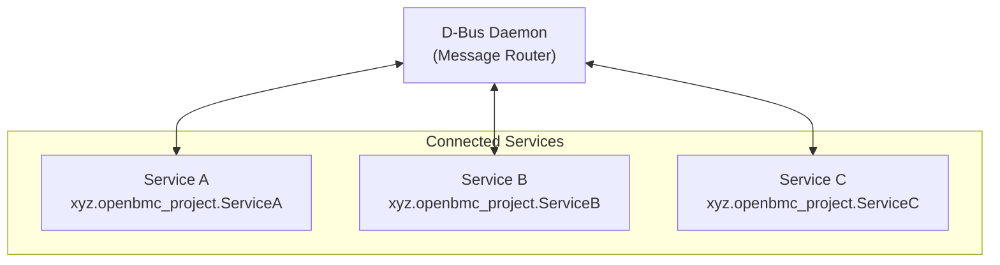
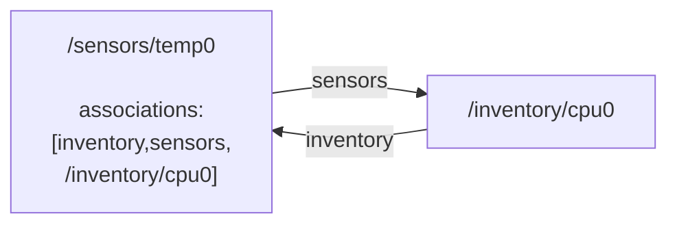

# D-Bus Guide
{: .no_toc }

Master D-Bus communication in OpenBMC.
{: .fs-6 .fw-300 }

## Table of Contents
{: .no_toc .text-delta }

1. TOC
{:toc}

---

## Overview

D-Bus is the central communication system in OpenBMC. All services expose their functionality through D-Bus, enabling:

- **Loose coupling**: Services don't need to know about each other's implementation
- **Discovery**: Services can be found dynamically at runtime
- **Introspection**: Interfaces can be explored without documentation
- **Language agnostic**: Any language with D-Bus bindings can participate

---

## D-Bus Concepts

### Core Components



<details markdown="1">
<summary>ASCII-art version (for comparison)</summary>

```
┌─────────────────────────────────────────────────────────────────┐
│                         D-Bus Daemon                            │
│                    (Message Router)                             │
└─────────────────────────────────────────────────────────────────┘
         │                    │                    │
         ▼                    ▼                    ▼
┌─────────────────┐  ┌─────────────────┐  ┌─────────────────┐
│    Service A    │  │    Service B    │  │    Service C    │
│                 │  │                 │  │                 │
│ Well-known name │  │ Well-known name │  │ Well-known name │
│ xyz.openbmc_    │  │ xyz.openbmc_    │  │ xyz.openbmc_    │
│ project.ServiceA│  │ project.ServiceB│  │ project.ServiceC│
└─────────────────┘  └─────────────────┘  └─────────────────┘
```

</details>

### Terminology

| Term | Description | Example |
|------|-------------|---------|
| **Bus** | Communication channel | System bus (shared by all) |
| **Service** | Application connected to bus | `xyz.openbmc_project.State.Host` |
| **Object** | Resource exposed by service | `/xyz/openbmc_project/state/host0` |
| **Interface** | Contract defining methods/properties | `xyz.openbmc_project.State.Host` |
| **Property** | Data exposed by object | `CurrentHostState` |
| **Method** | Action that can be invoked | `Reboot()` |
| **Signal** | Broadcast notification | `PropertiesChanged` |

### Naming Conventions

OpenBMC uses consistent naming:

```
Service:   xyz.openbmc_project.<Category>.<Name>
Object:    /xyz/openbmc_project/<category>/<name>
Interface: xyz.openbmc_project.<Category>.<Name>
```

Examples:
- `xyz.openbmc_project.State.Host` - Host state service
- `/xyz/openbmc_project/state/host0` - Host 0 state object
- `xyz.openbmc_project.Sensor.Value` - Sensor value interface

---

## Using busctl

`busctl` is the primary tool for D-Bus interaction.

### List Services

```bash
# List all services
busctl list

# Filter OpenBMC services
busctl list | grep xyz.openbmc_project
```

### Explore Objects

```bash
# Show object tree for a service
busctl tree xyz.openbmc_project.State.Host

# Example output:
# └─/xyz
#   └─/xyz/openbmc_project
#     └─/xyz/openbmc_project/state
#       └─/xyz/openbmc_project/state/host0
```

### Introspect Objects

```bash
# Show interfaces, methods, properties, signals
busctl introspect xyz.openbmc_project.State.Host \
    /xyz/openbmc_project/state/host0

# Example output:
# NAME                                TYPE      SIGNATURE RESULT/VALUE
# xyz.openbmc_project.State.Host      interface -         -
# .CurrentHostState                   property  s         "xyz.openbmc_project..."
# .RequestedHostTransition            property  s         "xyz.openbmc_project..."
```

### Read Properties

```bash
# Get a single property
busctl get-property xyz.openbmc_project.State.Host \
    /xyz/openbmc_project/state/host0 \
    xyz.openbmc_project.State.Host \
    CurrentHostState

# Output: s "xyz.openbmc_project.State.Host.HostState.Off"
```

### Set Properties

```bash
# Set a property (request host power on)
busctl set-property xyz.openbmc_project.State.Host \
    /xyz/openbmc_project/state/host0 \
    xyz.openbmc_project.State.Host \
    RequestedHostTransition s \
    "xyz.openbmc_project.State.Host.Transition.On"
```

### Call Methods

```bash
# Call a method
busctl call xyz.openbmc_project.ObjectMapper \
    /xyz/openbmc_project/object_mapper \
    xyz.openbmc_project.ObjectMapper \
    GetSubTree sias "/" 0 1 "xyz.openbmc_project.Sensor.Value"
```

### Monitor Signals

```bash
# Watch for property changes
busctl monitor xyz.openbmc_project.State.Host

# Watch all D-Bus traffic (verbose)
dbus-monitor --system
```

---

## phosphor-dbus-interfaces

Interface definitions live in the `phosphor-dbus-interfaces` repository.

### YAML Format

Interfaces are defined in YAML:

```yaml
# xyz/openbmc_project/Example/MyInterface.interface.yaml
description: >
    Example interface demonstrating YAML format.

properties:
    - name: MyProperty
      type: string
      description: An example string property.

    - name: MyValue
      type: int32
      description: An example integer property.

methods:
    - name: DoSomething
      description: Performs an action.
      parameters:
          - name: Input
            type: string
            description: Input parameter.
      returns:
          - name: Result
            type: boolean
            description: Success or failure.

signals:
    - name: SomethingHappened
      description: Emitted when something happens.
      properties:
          - name: What
            type: string
```

### Type Signatures

D-Bus uses type signatures:

| Signature | Type | C++ Type |
|-----------|------|----------|
| `s` | String | `std::string` |
| `b` | Boolean | `bool` |
| `i` | Int32 | `int32_t` |
| `u` | Uint32 | `uint32_t` |
| `x` | Int64 | `int64_t` |
| `t` | Uint64 | `uint64_t` |
| `d` | Double | `double` |
| `o` | Object path | `sdbusplus::message::object_path` |
| `a` | Array | `std::vector<T>` |
| `(...)` | Struct | `std::tuple<...>` |
| `a{sv}` | Dict | `std::map<std::string, std::variant<...>>` |

---

## sdbusplus Library

`sdbusplus` is the C++ library for D-Bus in OpenBMC.

{: .note }
> **Source Reference**: [sdbusplus](https://github.com/openbmc/sdbusplus)
> - Bus API: [include/sdbusplus/bus.hpp](https://github.com/openbmc/sdbusplus/blob/master/include/sdbusplus/bus.hpp)
> - Examples: [example/](https://github.com/openbmc/sdbusplus/tree/master/example)

### Creating a D-Bus Client

```cpp
#include <sdbusplus/bus.hpp>
#include <iostream>

int main()
{
    // Connect to system bus
    auto bus = sdbusplus::bus::new_default();

    // Create method call
    auto method = bus.new_method_call(
        "xyz.openbmc_project.State.Host",           // Service
        "/xyz/openbmc_project/state/host0",         // Object
        "org.freedesktop.DBus.Properties",          // Interface
        "Get"                                        // Method
    );

    // Add arguments
    method.append("xyz.openbmc_project.State.Host", // Interface
                  "CurrentHostState");               // Property

    // Call and get reply
    auto reply = bus.call(method);

    // Extract result
    std::variant<std::string> value;
    reply.read(value);

    std::cout << "Host state: " << std::get<std::string>(value) << "\n";

    return 0;
}
```

### Creating a D-Bus Server

```cpp
#include <sdbusplus/bus.hpp>
#include <sdbusplus/server.hpp>
#include <xyz/openbmc_project/Example/MyInterface/server.hpp>

// Generated server binding
using MyInterfaceInherit = sdbusplus::server::object_t<
    sdbusplus::xyz::openbmc_project::Example::server::MyInterface>;

class MyService : public MyInterfaceInherit
{
  public:
    MyService(sdbusplus::bus_t& bus, const char* path) :
        MyInterfaceInherit(bus, path)
    {
        // Initialize properties
        myProperty("initial value");
    }

    // Property getter/setter are auto-generated

    // Implement methods
    bool doSomething(std::string input) override
    {
        std::cout << "doSomething called with: " << input << "\n";
        return true;
    }
};

int main()
{
    auto bus = sdbusplus::bus::new_default();

    // Request well-known name
    bus.request_name("xyz.openbmc_project.Example");

    // Create server object
    MyService myService(bus, "/xyz/openbmc_project/example");

    // Process D-Bus events
    while (true)
    {
        bus.process_discard();
        bus.wait();
    }

    return 0;
}
```

### Async with sdbusplus and Boost.Asio

```cpp
#include <sdbusplus/asio/connection.hpp>
#include <sdbusplus/asio/object_server.hpp>
#include <boost/asio.hpp>

int main()
{
    boost::asio::io_context io;
    auto conn = std::make_shared<sdbusplus::asio::connection>(io);

    conn->request_name("xyz.openbmc_project.Example");

    sdbusplus::asio::object_server server(conn);

    auto iface = server.add_interface(
        "/xyz/openbmc_project/example",
        "xyz.openbmc_project.Example.MyInterface"
    );

    // Add property
    std::string myValue = "hello";
    iface->register_property("MyProperty", myValue,
        // Setter
        [](const std::string& newValue, std::string& value) {
            value = newValue;
            return true;
        }
    );

    iface->initialize();

    io.run();
    return 0;
}
```

---

## phosphor-objmgr (Object Mapper)

The Object Mapper tracks all D-Bus objects and their interfaces.

### Query Objects by Interface

```bash
# Find all objects implementing Sensor.Value
busctl call xyz.openbmc_project.ObjectMapper \
    /xyz/openbmc_project/object_mapper \
    xyz.openbmc_project.ObjectMapper \
    GetSubTree sias "/" 0 1 "xyz.openbmc_project.Sensor.Value"
```

### Get Service for Object

```bash
# Find which service owns an object
busctl call xyz.openbmc_project.ObjectMapper \
    /xyz/openbmc_project/object_mapper \
    xyz.openbmc_project.ObjectMapper \
    GetObject sas "/xyz/openbmc_project/state/host0" 0
```

### Using mapper CLI

```bash
# List objects with interface
mapper get-subtree / xyz.openbmc_project.Sensor.Value

# Get service for object
mapper get-service /xyz/openbmc_project/state/host0
```

---

## D-Bus Associations

Associations link related objects together.

### Association Structure



<details markdown="1">
<summary>ASCII-art version (click to expand)</summary>

```
┌─────────────────────┐           ┌─────────────────────┐
│  /sensors/temp0     │──────────▶│  /inventory/cpu0    │
│                     │  sensors  │                     │
│  associations:      │◀──────────│                     │
│  [inventory,sensors,│  inventory│                     │
│   /inventory/cpu0]  │           │                     │
└─────────────────────┘           └─────────────────────┘
```

</details>

### Query Associations

```bash
# Get associations for an object
busctl introspect xyz.openbmc_project.ObjectMapper \
    /xyz/openbmc_project/sensors/temperature/cpu0

# Look for 'associations' property and endpoints
```

---

## Troubleshooting

### Common Issues

**Service not found:**
```bash
# Check if service is running
systemctl status xyz.openbmc_project.ServiceName

# Check service logs
journalctl -u xyz.openbmc_project.ServiceName
```

**Permission denied:**
```bash
# Check D-Bus policy
cat /usr/share/dbus-1/system.d/xyz.openbmc_project.*.conf
```

**Property type mismatch:**
```bash
# Verify property type with introspect
busctl introspect <service> <object> | grep <property>
```

### Debug Commands

```bash
# Verbose D-Bus monitoring
dbus-monitor --system "interface='xyz.openbmc_project.State.Host'"

# Check Object Mapper health
busctl tree xyz.openbmc_project.ObjectMapper

# List all interfaces on an object
busctl introspect <service> <object> | grep interface
```

---

## Next Steps

- **[State Manager Guide]()** - Learn about system state control
- **[D-Bus Sensors Guide]()** - Understand sensor implementation

---

## Examples

Working examples are available in the [examples/dbus](https://github.com/MichaelTien8901/openbmc-guide-tutorial/tree/master/examples/dbus) directory:

- `client/` - D-Bus client examples
- `server/` - D-Bus server/service examples
- `async/` - Asynchronous D-Bus programming

---

## References

- [phosphor-dbus-interfaces](https://github.com/openbmc/phosphor-dbus-interfaces)
- [sdbusplus](https://github.com/openbmc/sdbusplus)
- [phosphor-objmgr](https://github.com/openbmc/phosphor-objmgr)
- [D-Bus Specification](https://dbus.freedesktop.org/doc/dbus-specification.html)

---

## Deep Dive

This section provides detailed technical information for developers who want to understand D-Bus internals in OpenBMC.

### D-Bus Message Flow Architecture

```
┌─────────────────────────────────────────────────────────────────────────────┐
│                        D-Bus Message Flow in OpenBMC                        │
├─────────────────────────────────────────────────────────────────────────────┤
│                                                                             │
│  Client Application (e.g., bmcweb)                                          │
│  ┌────────────────────────────────────────────────────────────────────┐     │
│  │  sdbusplus::bus::new_default()                                     │     │
│  │         │                                                          │     │
│  │         v                                                          │     │
│  │  bus.new_method_call(service, object, interface, method)           │     │
│  │         │                                                          │     │
│  │         v                                                          │     │
│  │  method.append(arg1, arg2, ...)  // Serialize arguments            │     │
│  │         │                                                          │     │
│  │         v                                                          │     │
│  │  bus.call(method)  ─────────────────────────────────────────┐      │     │
│  │         │                                     Wait for reply │      │     │
│  └─────────│─────────────────────────────────────────────────────────┘     │
│            │                                                   │            │
│            v                                                   │            │
│  ┌─────────────────────────────────────────────────────────────────────┐   │
│  │                     dbus-daemon (dbus-broker)                       │   │
│  │                                                                     │   │
│  │  1. Receive message from client socket                              │   │
│  │  2. Validate message format and permissions (policy)                │   │
│  │  3. Match destination service name to unique name (:1.XX)           │   │
│  │  4. Route message to destination socket                             │   │
│  │  5. Wait for reply from service                                     │   │
│  │  6. Route reply back to client                                      │   │
│  │                                                                     │   │
│  │  Name Registry:                                                     │   │
│  │  ┌───────────────────────────────────────────────────────────────┐  │   │
│  │  │  :1.15 = xyz.openbmc_project.State.Host                       │  │   │
│  │  │  :1.23 = xyz.openbmc_project.ObjectMapper                     │  │   │
│  │  │  :1.42 = xyz.openbmc_project.Sensor.Manager                   │  │   │
│  │  │  :1.58 = xyz.openbmc_project.Logging                          │  │   │
│  │  └───────────────────────────────────────────────────────────────┘  │   │
│  └─────────────────────────────────────────────────────────────────────┘   │
│            │                                                   ^            │
│            v                                                   │            │
│  ┌─────────────────────────────────────────────────────────────────────┐   │
│  │                   Service (e.g., phosphor-state-manager)            │   │
│  │                                                                     │   │
│  │  Event Loop (sd-event / boost::asio)                                │   │
│  │         │                                                           │   │
│  │         v                                                           │   │
│  │  Message Dispatch: match destination object path                    │   │
│  │         │                                                           │   │
│  │         v                                                           │   │
│  │  Interface Lookup: find registered interface handler                │   │
│  │         │                                                           │   │
│  │         v                                                           │   │
│  │  Method/Property Handler: execute callback                          │   │
│  │         │                                                           │   │
│  │         v                                                           │   │
│  │  Serialize reply and send ───────────────────────────────────┘      │   │
│  └─────────────────────────────────────────────────────────────────────┘   │
│                                                                             │
└─────────────────────────────────────────────────────────────────────────────┘
```

### Object Mapper Internals

The Object Mapper maintains a real-time view of all D-Bus objects:

```
┌─────────────────────────────────────────────────────────────────────────────┐
│                      Object Mapper Data Structures                          │
├─────────────────────────────────────────────────────────────────────────────┤
│                                                                             │
│  Interface-to-Objects Map:                                                  │
│  ┌────────────────────────────────────────────────────────────────────────┐ │
│  │  xyz.openbmc_project.Sensor.Value:                                     │ │
│  │    - /xyz/openbmc_project/sensors/temperature/ambient                  │ │
│  │    - /xyz/openbmc_project/sensors/temperature/cpu0                     │ │
│  │    - /xyz/openbmc_project/sensors/fan_tach/fan0                        │ │
│  │                                                                        │ │
│  │  xyz.openbmc_project.State.Host:                                       │ │
│  │    - /xyz/openbmc_project/state/host0                                  │ │
│  │                                                                        │ │
│  │  xyz.openbmc_project.Inventory.Item:                                   │ │
│  │    - /xyz/openbmc_project/inventory/system/chassis/motherboard         │ │
│  │    - /xyz/openbmc_project/inventory/system/chassis/motherboard/cpu0    │ │
│  └────────────────────────────────────────────────────────────────────────┘ │
│                                                                             │
│  Object-to-Services Map:                                                    │
│  ┌────────────────────────────────────────────────────────────────────────┐ │
│  │  /xyz/openbmc_project/sensors/temperature/cpu0:                        │ │
│  │    - xyz.openbmc_project.HwmonTempSensor                               │ │
│  │        Interfaces: [xyz.openbmc_project.Sensor.Value,                  │ │
│  │                     xyz.openbmc_project.Sensor.Threshold.Warning,      │ │
│  │                     xyz.openbmc_project.Sensor.Threshold.Critical,     │ │
│  │                     xyz.openbmc_project.Association.Definitions]       │ │
│  └────────────────────────────────────────────────────────────────────────┘ │
│                                                                             │
│  Association Endpoints:                                                     │
│  ┌────────────────────────────────────────────────────────────────────────┐ │
│  │  /xyz/openbmc_project/sensors/temperature/cpu0:                        │ │
│  │    inventory (forward) -> /xyz/openbmc_project/inventory/.../cpu0      │ │
│  │                                                                        │ │
│  │  /xyz/openbmc_project/inventory/.../cpu0:                              │ │
│  │    sensors (reverse) -> /xyz/openbmc_project/sensors/temperature/cpu0  │ │
│  └────────────────────────────────────────────────────────────────────────┘ │
│                                                                             │
│  Update Mechanism:                                                          │
│  ┌────────────────────────────────────────────────────────────────────────┐ │
│  │  1. Subscribe to org.freedesktop.DBus.ObjectManager signals            │ │
│  │  2. Subscribe to NameOwnerChanged for service tracking                 │ │
│  │  3. On InterfacesAdded: update maps, create association endpoints      │ │
│  │  4. On InterfacesRemoved: clean up maps, remove endpoints              │ │
│  │  5. On NameOwnerChanged: handle service start/stop                     │ │
│  └────────────────────────────────────────────────────────────────────────┘ │
│                                                                             │
└─────────────────────────────────────────────────────────────────────────────┘
```

### sdbusplus Code Generation Pipeline

```
┌─────────────────────────────────────────────────────────────────────────────┐
│                     sdbusplus Interface Generation                          │
├─────────────────────────────────────────────────────────────────────────────┤
│                                                                             │
│  Input: YAML Interface Definition                                           │
│  ┌────────────────────────────────────────────────────────────────────────┐ │
│  │  # xyz/openbmc_project/Sensor/Value.interface.yaml                     │ │
│  │  description: Sensor value interface                                   │ │
│  │  properties:                                                           │ │
│  │    - name: Value                                                       │ │
│  │      type: double                                                      │ │
│  │    - name: Unit                                                        │ │
│  │      type: string                                                      │ │
│  │  signals:                                                              │ │
│  │    - name: ValueChanged                                                │ │
│  │      properties:                                                       │ │
│  │        - name: Value                                                   │ │
│  │          type: double                                                  │ │
│  └────────────────────────────────────────────────────────────────────────┘ │
│                              │                                              │
│                              v                                              │
│  ┌────────────────────────────────────────────────────────────────────────┐ │
│  │                    sdbus++ Code Generator                              │ │
│  │                                                                        │ │
│  │  python3 -m sdbusplus generate-cpp                                     │ │
│  │    --tool sdbus++                                                      │ │
│  │    --output-dir generated/                                             │ │
│  │    xyz/openbmc_project/Sensor/Value                                    │ │
│  └────────────────────────────────────────────────────────────────────────┘ │
│                              │                                              │
│                              v                                              │
│  Generated Output Files:                                                    │
│  ┌────────────────────────────────────────────────────────────────────────┐ │
│  │                                                                        │ │
│  │  server.hpp - Server-side implementation base class                    │ │
│  │  ┌──────────────────────────────────────────────────────────────────┐  │ │
│  │  │  namespace sdbusplus::xyz::openbmc_project::Sensor::server {     │  │ │
│  │  │  class Value {                                                   │  │ │
│  │  │    public:                                                       │  │ │
│  │  │      double value() const;          // Property getter           │  │ │
│  │  │      double value(double val);      // Property setter           │  │ │
│  │  │      std::string unit() const;                                   │  │ │
│  │  │      void valueChanged(double val); // Signal emitter            │  │ │
│  │  │  };                                                              │  │ │
│  │  │  }                                                               │  │ │
│  │  └──────────────────────────────────────────────────────────────────┘  │ │
│  │                                                                        │ │
│  │  client.hpp - Client-side proxy class                                  │ │
│  │  ┌──────────────────────────────────────────────────────────────────┐  │ │
│  │  │  class Value {                                                   │  │ │
│  │  │    public:                                                       │  │ │
│  │  │      auto value();     // Async property read                    │  │ │
│  │  │      auto value(double); // Async property write                 │  │ │
│  │  │  };                                                              │  │ │
│  │  └──────────────────────────────────────────────────────────────────┘  │ │
│  │                                                                        │ │
│  │  common.hpp - Shared type definitions, enums, errors                   │ │
│  │                                                                        │ │
│  └────────────────────────────────────────────────────────────────────────┘ │
│                                                                             │
└─────────────────────────────────────────────────────────────────────────────┘
```

### D-Bus Policy Configuration

```
┌─────────────────────────────────────────────────────────────────────────────┐
│                      D-Bus Security Policy                                  │
├─────────────────────────────────────────────────────────────────────────────┤
│                                                                             │
│  Policy File Location: /usr/share/dbus-1/system.d/                          │
│                                                                             │
│  Policy Evaluation Order:                                                   │
│  ┌────────────────────────────────────────────────────────────────────────┐ │
│  │  1. Check <deny> rules (most specific first)                           │ │
│  │  2. Check <allow> rules (most specific first)                          │ │
│  │  3. Default action (usually deny)                                      │ │
│  │                                                                        │ │
│  │  Specificity: user > group > context > default                         │ │
│  └────────────────────────────────────────────────────────────────────────┘ │
│                                                                             │
│  Example Policy: xyz.openbmc_project.State.Host.conf                        │
│  ┌────────────────────────────────────────────────────────────────────────┐ │
│  │  <busconfig>                                                           │ │
│  │    <!-- Allow root to own the service name -->                         │ │
│  │    <policy user="root">                                                │ │
│  │      <allow own="xyz.openbmc_project.State.Host"/>                     │ │
│  │    </policy>                                                           │ │
│  │                                                                        │ │
│  │    <!-- Allow anyone to call methods and read properties -->           │ │
│  │    <policy context="default">                                          │ │
│  │      <allow send_destination="xyz.openbmc_project.State.Host"/>        │ │
│  │      <allow receive_sender="xyz.openbmc_project.State.Host"/>          │ │
│  │    </policy>                                                           │ │
│  │                                                                        │ │
│  │    <!-- Restrict property writes to specific users -->                 │ │
│  │    <policy group="admin">                                              │ │
│  │      <allow send_destination="xyz.openbmc_project.State.Host"          │ │
│  │             send_interface="org.freedesktop.DBus.Properties"           │ │
│  │             send_member="Set"/>                                        │ │
│  │    </policy>                                                           │ │
│  │  </busconfig>                                                          │ │
│  └────────────────────────────────────────────────────────────────────────┘ │
│                                                                             │
│  Common Policy Patterns:                                                    │
│  ┌────────────────────────────────────────────────────────────────────────┐ │
│  │  Pattern              │ Use Case                                       │ │
│  │  ─────────────────────┼─────────────────────────────────────────────── │ │
│  │  own="service.name"   │ Allow process to claim well-known name         │ │
│  │  send_destination     │ Allow sending messages to service              │ │
│  │  send_interface       │ Restrict to specific D-Bus interface           │ │
│  │  send_member          │ Restrict to specific method/property           │ │
│  │  receive_sender       │ Allow receiving signals from service           │ │
│  └────────────────────────────────────────────────────────────────────────┘ │
│                                                                             │
└─────────────────────────────────────────────────────────────────────────────┘
```

### D-Bus Type System Internals

```
┌─────────────────────────────────────────────────────────────────────────────┐
│                      D-Bus Type Serialization                               │
├─────────────────────────────────────────────────────────────────────────────┤
│                                                                             │
│  Wire Format Example: Sensor Reading Message                                │
│                                                                             │
│  Method Call: Get("xyz.openbmc_project.Sensor.Value", "Value")              │
│                                                                             │
│  ┌────────────────────────────────────────────────────────────────────────┐ │
│  │  Message Header (fixed format):                                        │ │
│  │  ┌──────────┬──────────┬──────────┬──────────┬──────────────────────┐  │ │
│  │  │ Endian   │ Type     │ Flags    │ Version  │ Body Length          │  │ │
│  │  │ 'l'      │ 0x01     │ 0x00     │ 0x01     │ 52                   │  │ │
│  │  │ (little) │ (method) │          │          │                      │  │ │
│  │  └──────────┴──────────┴──────────┴──────────┴──────────────────────┘  │ │
│  │                                                                        │ │
│  │  Header Fields (variable):                                             │ │
│  │  ┌──────────────────────────────────────────────────────────────────┐  │ │
│  │  │  PATH:        /xyz/openbmc_project/sensors/temperature/cpu0     │  │ │
│  │  │  INTERFACE:   org.freedesktop.DBus.Properties                   │  │ │
│  │  │  MEMBER:      Get                                               │  │ │
│  │  │  DESTINATION: xyz.openbmc_project.HwmonTempSensor               │  │ │
│  │  │  SIGNATURE:   ss                                                │  │ │
│  │  └──────────────────────────────────────────────────────────────────┘  │ │
│  │                                                                        │ │
│  │  Body (marshalled arguments):                                          │ │
│  │  ┌──────────────────────────────────────────────────────────────────┐  │ │
│  │  │  String: "xyz.openbmc_project.Sensor.Value" (32 bytes + NUL)    │  │ │
│  │  │  String: "Value" (5 bytes + NUL)                                │  │ │
│  │  └──────────────────────────────────────────────────────────────────┘  │ │
│  └────────────────────────────────────────────────────────────────────────┘ │
│                                                                             │
│  Reply Message: Variant containing double                                   │
│  ┌────────────────────────────────────────────────────────────────────────┐ │
│  │  SIGNATURE: v (variant)                                                │ │
│  │                                                                        │ │
│  │  Body:                                                                 │ │
│  │  ┌──────────────────────────────────────────────────────────────────┐  │ │
│  │  │  Variant signature: "d" (1 byte + NUL)                          │  │ │
│  │  │  Padding: 5 bytes (align double to 8)                           │  │ │
│  │  │  Double value: 45.5 (8 bytes, IEEE 754)                         │  │ │
│  │  └──────────────────────────────────────────────────────────────────┘  │ │
│  └────────────────────────────────────────────────────────────────────────┘ │
│                                                                             │
│  Alignment Rules:                                                           │
│  ┌────────────────────────────────────────────────────────────────────────┐ │
│  │  Type      │ Alignment │ Size                                          │ │
│  │  ──────────┼───────────┼───────────────────────────────────────────── │ │
│  │  BYTE      │ 1         │ 1                                             │ │
│  │  INT16     │ 2         │ 2                                             │ │
│  │  INT32     │ 4         │ 4                                             │ │
│  │  INT64     │ 8         │ 8                                             │ │
│  │  DOUBLE    │ 8         │ 8                                             │ │
│  │  STRING    │ 4         │ 4 (length) + data + NUL                       │ │
│  │  ARRAY     │ 4         │ 4 (length) + elements (aligned)               │ │
│  │  STRUCT    │ 8         │ sum of members (each aligned)                 │ │
│  │  VARIANT   │ 1         │ signature + value                             │ │
│  │  DICT      │ 8         │ array of struct{key, value}                   │ │
│  └────────────────────────────────────────────────────────────────────────┘ │
│                                                                             │
└─────────────────────────────────────────────────────────────────────────────┘
```

### PropertiesChanged Signal Mechanism

```
┌─────────────────────────────────────────────────────────────────────────────┐
│                   PropertiesChanged Signal Flow                             │
├─────────────────────────────────────────────────────────────────────────────┤
│                                                                             │
│  Sensor Service                        Subscriber (bmcweb, ipmid)           │
│  ┌──────────────────────────────┐     ┌──────────────────────────────────┐  │
│  │                              │     │                                  │  │
│  │  // Update property value    │     │  // Subscribe to changes         │  │
│  │  sensorValue(newReading);    │     │  bus.add_match(                  │  │
│  │         │                    │     │    "type='signal',"              │  │
│  │         v                    │     │    "interface='org.freedesktop." │  │
│  │  // sdbusplus auto-emits:    │     │      "DBus.Properties',"         │  │
│  │  PropertiesChanged(          │     │    "member='PropertiesChanged'," │  │
│  │    "xyz.openbmc_project."    │     │    "arg0='xyz.openbmc_project."  │  │
│  │      "Sensor.Value",         │     │      "Sensor.Value'"             │  │
│  │    {"Value": variant(45.5)}, │     │  );                              │  │
│  │    []                        │     │         │                        │  │
│  │  );                          │     │         v                        │  │
│  │         │                    │     │  // Callback invoked             │  │
│  └─────────│────────────────────┘     │  handlePropertyChange(msg) {     │  │
│            │                          │    auto [iface, changed, inv] =  │  │
│            │                          │      msg.unpack<...>();          │  │
│            │                          │    double val =                  │  │
│            │                          │      std::get<double>(           │  │
│            │                          │        changed.at("Value"));     │  │
│            │                          │    // Update cache, emit SSE     │  │
│            v                          │  }                               │  │
│  ┌──────────────────────────────┐     │                                  │  │
│  │       dbus-daemon            │     └──────────────────────────────────┘  │
│  │                              │                    ^                      │
│  │  Match rules table:          │                    │                      │
│  │  ┌────────────────────────┐  │                    │                      │
│  │  │ :1.23 matches:         │  │                    │                      │
│  │  │   PropertiesChanged    │──│────────────────────┘                      │
│  │  │   on Sensor.Value      │  │                                           │
│  │  └────────────────────────┘  │                                           │
│  │                              │                                           │
│  └──────────────────────────────┘                                           │
│                                                                             │
│  Signal Contents:                                                           │
│  ┌────────────────────────────────────────────────────────────────────────┐ │
│  │  Arg 0 (s):  Interface name that changed                               │ │
│  │  Arg 1 (a{sv}): Dictionary of changed properties and new values        │ │
│  │  Arg 2 (as): Array of invalidated property names (cache hints)         │ │
│  └────────────────────────────────────────────────────────────────────────┘ │
│                                                                             │
└─────────────────────────────────────────────────────────────────────────────┘
```

### Source Code References

| Component | Repository | Key Files |
|-----------|------------|-----------|
| sdbusplus library | [openbmc/sdbusplus](https://github.com/openbmc/sdbusplus) | `include/sdbusplus/bus.hpp`, `include/sdbusplus/message.hpp` |
| Interface definitions | [openbmc/phosphor-dbus-interfaces](https://github.com/openbmc/phosphor-dbus-interfaces) | `yaml/xyz/openbmc_project/**/*.interface.yaml` |
| Object Mapper | [openbmc/phosphor-objmgr](https://github.com/openbmc/phosphor-objmgr) | `src/main.cpp`, `src/associations.cpp` |
| sdbus++ generator | [openbmc/sdbusplus](https://github.com/openbmc/sdbusplus) | `tools/sdbusplus/`, `tools/sdbus++` |
| D-Bus policy files | [openbmc/openbmc](https://github.com/openbmc/openbmc) | `meta-phosphor/recipes-phosphor/dbus/` |
| Async connection | [openbmc/sdbusplus](https://github.com/openbmc/sdbusplus) | `include/sdbusplus/asio/connection.hpp` |

---

{: .note }
**Tested on**: OpenBMC master, QEMU romulus
