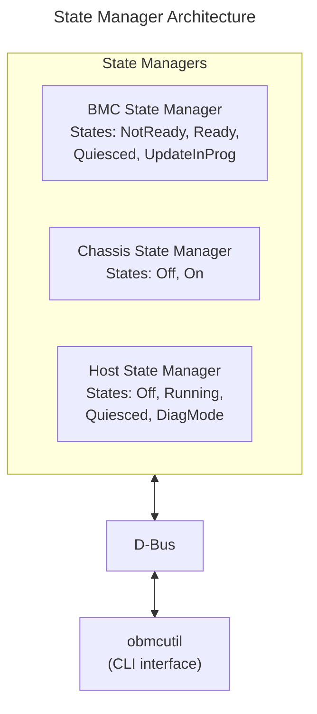
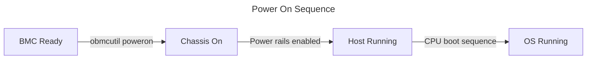
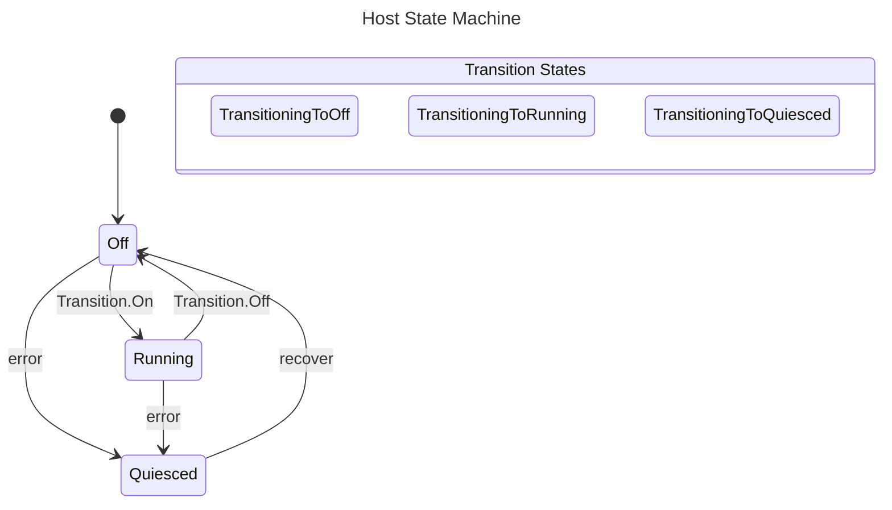

# State Manager Guide
{: .no_toc }

Control and monitor BMC, chassis, and host system states.
{: .fs-6 .fw-300 }

## Table of Contents
{: .no_toc .text-delta }

1. TOC
{:toc}

---

## Overview

The **phosphor-state-manager** controls the power state of the BMC, chassis, and host. It's the core component for:

- Powering on/off the server
- Rebooting the system
- Tracking system state
- Implementing power restore policies



<details markdown="1">
<summary>ASCII-art version (for comparison)</summary>

```
┌─────────────────────────────────────────────────────────────────┐
│                     State Manager Architecture                  │
├─────────────────────────────────────────────────────────────────┤
│                                                                 │
│  ┌──────────────────┐  ┌──────────────────┐  ┌────────────────┐ │
│  │   BMC State      │  │  Chassis State   │  │   Host State   │ │
│  │   Manager        │  │   Manager        │  │   Manager      │ │
│  │                  │  │                  │  │                │ │
│  │ States:          │  │ States:          │  │ States:        │ │
│  │ - NotReady       │  │ - Off            │  │ - Off          │ │
│  │ - Ready          │  │ - On             │  │ - Running      │ │
│  │ - Quiesced       │  │                  │  │ - Quiesced     │ │
│  │ - UpdateInProg   │  │                  │  │ - DiagMode     │ │
│  └──────────────────┘  └──────────────────┘  └────────────────┘ │
│           │                     │                    │          │
│           └─────────────────────┼────────────────────┘          │
│                                 │                               │
│                          ┌──────┴──────┐                        │
│                          │    D-Bus    │                        │
│                          └──────┬──────┘                        │
│                                 │                               │
│                     ┌───────────┴───────────┐                   │
│                     │      obmcutil         │                   │
│                     │   (CLI interface)     │                   │
│                     └───────────────────────┘                   │
└─────────────────────────────────────────────────────────────────┘
```

</details>

---

## Setup & Configuration

### Build-Time Configuration (Yocto)

Include state manager in your image:

```bitbake
# In your machine .conf or image recipe
IMAGE_INSTALL:append = " phosphor-state-manager"

# Include specific components
IMAGE_INSTALL:append = " \
    phosphor-state-manager-bmc \
    phosphor-state-manager-chassis \
    phosphor-state-manager-host \
    phosphor-state-manager-discover-system-state \
"
```

### Meson Build Options

```bash
meson setup build \
    -Dhost-gpios=enabled \
    -Dchassis-system-reset=enabled \
    -Dhost-state-options=enabled \
    -Dwarm-reboot=enabled
```

| Option | Default | Description |
|--------|---------|-------------|
| `host-gpios` | enabled | GPIO-based host state detection |
| `chassis-system-reset` | disabled | System reset support |
| `warm-reboot` | disabled | Warm reboot capability |
| `boot-count-max-allowed` | 3 | Max boot retry attempts |

### Runtime Enable/Disable

```bash
# Check state manager services
systemctl status xyz.openbmc_project.State.BMC
systemctl status xyz.openbmc_project.State.Chassis
systemctl status xyz.openbmc_project.State.Host

# Restart state manager services
systemctl restart xyz.openbmc_project.State.BMC
systemctl restart xyz.openbmc_project.State.Chassis
systemctl restart xyz.openbmc_project.State.Host

# View logs
journalctl -u xyz.openbmc_project.State.Host -f
```

### Power Restore Policy

Configure what happens after AC power loss:

```bash
# Get current policy
busctl get-property xyz.openbmc_project.Settings \
    /xyz/openbmc_project/control/host0/power_restore_policy \
    xyz.openbmc_project.Control.Power.RestorePolicy PowerRestorePolicy

# Set policy options:
# AlwaysOn  - Always power on after AC restore
# AlwaysOff - Stay off after AC restore
# Restore   - Return to previous state

busctl set-property xyz.openbmc_project.Settings \
    /xyz/openbmc_project/control/host0/power_restore_policy \
    xyz.openbmc_project.Control.Power.RestorePolicy PowerRestorePolicy s \
    "xyz.openbmc_project.Control.Power.RestorePolicy.Policy.Restore"
```

### Boot Options Configuration

```bash
# Get boot source override
busctl get-property xyz.openbmc_project.Settings \
    /xyz/openbmc_project/control/host0/boot \
    xyz.openbmc_project.Control.Boot.Source BootSource

# Set boot source (Network, Disk, ExternalMedia, Default)
busctl set-property xyz.openbmc_project.Settings \
    /xyz/openbmc_project/control/host0/boot \
    xyz.openbmc_project.Control.Boot.Source BootSource s \
    "xyz.openbmc_project.Control.Boot.Source.Sources.Network"

# Set boot mode (Regular, Safe, Setup)
busctl set-property xyz.openbmc_project.Settings \
    /xyz/openbmc_project/control/host0/boot \
    xyz.openbmc_project.Control.Boot.Mode BootMode s \
    "xyz.openbmc_project.Control.Boot.Mode.Modes.Setup"

# Enable/disable boot override
busctl set-property xyz.openbmc_project.Settings \
    /xyz/openbmc_project/control/host0/boot/one_time \
    xyz.openbmc_project.Object.Enable Enabled b true
```

### Auto-Reboot Configuration

```bash
# Get auto-reboot setting
busctl get-property xyz.openbmc_project.Settings \
    /xyz/openbmc_project/control/host0/auto_reboot \
    xyz.openbmc_project.Control.Boot.RebootPolicy AutoReboot

# Enable/disable auto-reboot
busctl set-property xyz.openbmc_project.Settings \
    /xyz/openbmc_project/control/host0/auto_reboot \
    xyz.openbmc_project.Control.Boot.RebootPolicy AutoReboot b true

# Set reboot attempts limit
busctl set-property xyz.openbmc_project.Settings \
    /xyz/openbmc_project/control/host0/auto_reboot \
    xyz.openbmc_project.Control.Boot.RebootAttempts AttemptsLeft u 3
```

### Watchdog Configuration

```bash
# Get watchdog status
busctl introspect xyz.openbmc_project.Watchdog \
    /xyz/openbmc_project/watchdog/host0

# Enable watchdog
busctl set-property xyz.openbmc_project.Watchdog \
    /xyz/openbmc_project/watchdog/host0 \
    xyz.openbmc_project.State.Watchdog Enabled b true

# Set watchdog timeout (milliseconds)
busctl set-property xyz.openbmc_project.Watchdog \
    /xyz/openbmc_project/watchdog/host0 \
    xyz.openbmc_project.State.Watchdog Interval t 300000

# Set watchdog action (None, HardReset, PowerOff, PowerCycle)
busctl set-property xyz.openbmc_project.Watchdog \
    /xyz/openbmc_project/watchdog/host0 \
    xyz.openbmc_project.State.Watchdog ExpireAction s \
    "xyz.openbmc_project.State.Watchdog.Action.PowerCycle"
```

### Via Redfish API

```bash
# Get system state
curl -k -u root:0penBmc \
    https://localhost/redfish/v1/Systems/system | jq '.PowerState, .BootProgress'

# Set boot override
curl -k -u root:0penBmc -X PATCH \
    -H "Content-Type: application/json" \
    -d '{
        "Boot": {
            "BootSourceOverrideTarget": "Pxe",
            "BootSourceOverrideEnabled": "Once"
        }
    }' \
    https://localhost/redfish/v1/Systems/system

# Set power restore policy
curl -k -u root:0penBmc -X PATCH \
    -H "Content-Type: application/json" \
    -d '{"PowerRestorePolicy": "AlwaysOn"}' \
    https://localhost/redfish/v1/Systems/system
```

---

## State Managers

### BMC State Manager

Controls the BMC firmware state.

**D-Bus Interface:** `xyz.openbmc_project.State.BMC`
**Object Path:** `/xyz/openbmc_project/state/bmc0`

| State | Description |
|-------|-------------|
| `NotReady` | BMC is booting, services not ready |
| `Ready` | BMC fully operational |
| `Quiesced` | BMC in error state, limited operation |
| `UpdateInProgress` | Firmware update in progress |

```bash
# Check BMC state
busctl get-property xyz.openbmc_project.State.BMC \
    /xyz/openbmc_project/state/bmc0 \
    xyz.openbmc_project.State.BMC CurrentBMCState
```

### Chassis State Manager

Controls chassis power (main power rails).

**D-Bus Interface:** `xyz.openbmc_project.State.Chassis`
**Object Path:** `/xyz/openbmc_project/state/chassis0`

| State | Description |
|-------|-------------|
| `Off` | Chassis power off (standby only) |
| `On` | Chassis power on |

| Transition | Description |
|------------|-------------|
| `Off` | Power off chassis |
| `On` | Power on chassis |

```bash
# Check chassis state
busctl get-property xyz.openbmc_project.State.Chassis \
    /xyz/openbmc_project/state/chassis0 \
    xyz.openbmc_project.State.Chassis CurrentPowerState

# Power on chassis
busctl set-property xyz.openbmc_project.State.Chassis \
    /xyz/openbmc_project/state/chassis0 \
    xyz.openbmc_project.State.Chassis RequestedPowerTransition s \
    "xyz.openbmc_project.State.Chassis.Transition.On"
```

### Host State Manager

Controls the host CPU/OS state.

**D-Bus Interface:** `xyz.openbmc_project.State.Host`
**Object Path:** `/xyz/openbmc_project/state/host0`

| State | Description |
|-------|-------------|
| `Off` | Host not running |
| `Running` | Host running (booted or booting) |
| `Quiesced` | Host in error state |
| `DiagnosticMode` | Host in diagnostic mode |

| Transition | Description |
|------------|-------------|
| `Off` | Graceful shutdown |
| `On` | Power on and boot |
| `Reboot` | Graceful reboot |
| `GracefulWarmReboot` | Warm reboot (no power cycle) |
| `ForceWarmReboot` | Forced warm reboot |

```bash
# Check host state
busctl get-property xyz.openbmc_project.State.Host \
    /xyz/openbmc_project/state/host0 \
    xyz.openbmc_project.State.Host CurrentHostState

# Power on host
busctl set-property xyz.openbmc_project.State.Host \
    /xyz/openbmc_project/state/host0 \
    xyz.openbmc_project.State.Host RequestedHostTransition s \
    "xyz.openbmc_project.State.Host.Transition.On"

# Graceful shutdown
busctl set-property xyz.openbmc_project.State.Host \
    /xyz/openbmc_project/state/host0 \
    xyz.openbmc_project.State.Host RequestedHostTransition s \
    "xyz.openbmc_project.State.Host.Transition.Off"
```

---

## obmcutil Command

`obmcutil` is the CLI for state management.

### Basic Commands

```bash
# Show all system states
obmcutil state

# Example output:
# CurrentBMCState     : xyz.openbmc_project.State.BMC.BMCState.Ready
# CurrentPowerState   : xyz.openbmc_project.State.Chassis.PowerState.Off
# CurrentHostState    : xyz.openbmc_project.State.Host.HostState.Off

# Power on
obmcutil poweron

# Power off (graceful)
obmcutil poweroff

# Chassis power on (without host boot)
obmcutil chassison

# Chassis power off
obmcutil chassisoff

# Reboot host
obmcutil reboot

# BMC reboot
obmcutil bmcreboot
```

### Status Commands

```bash
# Show boot progress
obmcutil bootprogress

# Show operating system status
obmcutil osstate

# Check if host is running
obmcutil hoststate
```

### Recovery Commands

```bash
# Recover from quiesced state
obmcutil recover

# Force immediate host off (emergency)
obmcutil chassiskill
```

### All obmcutil Commands

```bash
obmcutil --help

# Common commands:
#   state           - Show current states
#   poweron         - Power on host
#   poweroff        - Power off host (graceful)
#   chassison       - Chassis power on
#   chassisoff      - Chassis power off
#   bmcreboot       - Reboot BMC
#   reboot          - Reboot host
#   recover         - Recover from errors
#   status          - Same as 'state'
```

---

## State Transitions

### Power On Sequence



<details markdown="1">
<summary>ASCII-art version (for comparison)</summary>

```
┌─────────┐     ┌─────────┐     ┌─────────┐     ┌─────────┐
│  BMC    │     │ Chassis │     │  Host   │     │   OS    │
│  Ready  │────▶│   On    │────▶│ Running │────▶│ Running │
└─────────┘     └─────────┘     └─────────┘     └─────────┘
     │               │               │               │
     │  obmcutil     │  Power rails  │   CPU boot    │  OS boot
     │  poweron      │   enabled     │   sequence    │  complete
     ▼               ▼               ▼               ▼
```

</details>

### Power Off Sequence


<details markdown="1">
<summary>ASCII-art version (for comparison)</summary>

```
┌─────────┐     ┌─────────┐     ┌─────────┐
│   OS    │     │  Host   │     │ Chassis │
│Shutdown │────▶│   Off   │────▶│   Off   │
└─────────┘     └─────────┘     └─────────┘
     │               │               │
     │  ACPI/IPMI    │   Host off    │  Power rails
     │  shutdown     │   detected    │  disabled
     ▼               ▼               ▼
```

</details>

---

## Power Restore Policy

Configure what happens after AC power loss.

**D-Bus Interface:** `xyz.openbmc_project.Control.Power.RestorePolicy`
**Object Path:** `/xyz/openbmc_project/control/host0/power_restore_policy`

| Policy | Description |
|--------|-------------|
| `AlwaysOn` | Always power on after AC restore |
| `AlwaysOff` | Stay off after AC restore |
| `Restore` | Return to previous state |

```bash
# Get current policy
busctl get-property xyz.openbmc_project.Settings \
    /xyz/openbmc_project/control/host0/power_restore_policy \
    xyz.openbmc_project.Control.Power.RestorePolicy PowerRestorePolicy

# Set policy to always on
busctl set-property xyz.openbmc_project.Settings \
    /xyz/openbmc_project/control/host0/power_restore_policy \
    xyz.openbmc_project.Control.Power.RestorePolicy PowerRestorePolicy s \
    "xyz.openbmc_project.Control.Power.RestorePolicy.Policy.AlwaysOn"
```

---

## Boot Progress

Track host boot progress.

**D-Bus Interface:** `xyz.openbmc_project.State.Boot.Progress`
**Object Path:** `/xyz/openbmc_project/state/host0`

| Progress | Description |
|----------|-------------|
| `Unspecified` | Unknown state |
| `PrimaryProcInit` | Primary processor initialization |
| `MemoryInit` | Memory initialization |
| `PCIInit` | PCI initialization |
| `OSStart` | Operating system starting |
| `OSRunning` | Operating system running |

```bash
# Get boot progress
busctl get-property xyz.openbmc_project.State.Host \
    /xyz/openbmc_project/state/host0 \
    xyz.openbmc_project.State.Boot.Progress BootProgress
```

---

## Porting Guide

### GPIO Configuration

State manager uses GPIOs for power control. Configure in your machine layer:

```json
// Example: power-config.json
{
    "gpio_configs": [
        {
            "name": "power-button",
            "direction": "out",
            "polarity": "active_low"
        },
        {
            "name": "power-good",
            "direction": "in",
            "polarity": "active_high"
        }
    ]
}
```

### systemd Targets

Power transitions trigger systemd targets:

| Target | Triggered When |
|--------|----------------|
| `obmc-chassis-poweron@.target` | Chassis power on |
| `obmc-chassis-poweroff@.target` | Chassis power off |
| `obmc-host-start@.target` | Host power on |
| `obmc-host-stop@.target` | Host power off |
| `obmc-host-reboot@.target` | Host reboot |

Add custom services to these targets:

```ini
# /lib/systemd/system/my-power-hook.service
[Unit]
Description=Custom power on hook
After=obmc-chassis-poweron@0.target

[Service]
Type=oneshot
ExecStart=/usr/bin/my-power-on-script

[Install]
WantedBy=obmc-host-start@0.target
```

### Configuration Files

```bash
# Power button configuration
/usr/share/phosphor-state-manager/power-config.json

# Chassis configuration
/etc/default/obmc/phosphor-state-manager/chassis
```

---

## Troubleshooting

### Host won't power on

```bash
# Check chassis state first
obmcutil state

# Check for errors in state manager
journalctl -u xyz.openbmc_project.State.Host -f

# Verify power good signal
gpioget gpiochip0 <power-good-pin>
```

### Stuck in Quiesced state

```bash
# Check what caused quiesce
journalctl -u xyz.openbmc_project.State.Host | grep -i error

# Recover
obmcutil recover
```

### Power restore not working

```bash
# Verify policy is set
busctl get-property xyz.openbmc_project.Settings \
    /xyz/openbmc_project/control/host0/power_restore_policy \
    xyz.openbmc_project.Control.Power.RestorePolicy PowerRestorePolicy

# Check restore service
systemctl status phosphor-reset-host-recovery@0.service
```

---

## Deep Dive
{: .text-delta }

Advanced implementation details for state manager developers.

### State Machine Internals

The state managers implement finite state machines with well-defined transitions:



**Internal Transition States:**
- `TransitioningToOff` - shutdown in progress
- `TransitioningToRunning` - boot in progress
- `TransitioningToQuiesced` - error handling

<details markdown="1">
<summary>ASCII-art version (click to expand)</summary>

```
┌─────────────────────────────────────────────────────────────────────────┐
│                    Host State Machine                                   │
├─────────────────────────────────────────────────────────────────────────┤
│                                                                         │
│                            ┌───────────────┐                            │
│              ┌────────────▶│   Quiesced    │◀────────────┐              │
│              │             │  (error state)│             │              │
│              │             └───────────────┘             │              │
│              │                     │                     │              │
│              │ error               │ recover             │ error        │
│              │                     ▼                     │              │
│       ┌──────┴──────┐       ┌───────────────┐     ┌──────┴──────┐       │
│       │             │       │               │     │             │       │
│       │     Off     │◀──────│   Transition  │────▶│   Running   │       │
│       │             │       │    States     │     │             │       │
│       └──────┬──────┘       └───────────────┘     └──────┬──────┘       │
│              │                                           │              │
│              │              Transition.On                │              │
│              └───────────────────────────────────────────┘              │
│                             Transition.Off                              │
│                                                                         │
│   Internal Transition States:                                           │
│   ├── TransitioningToOff  (shutdown in progress)                        │
│   ├── TransitioningToRunning (boot in progress)                         │
│   └── TransitioningToQuiesced (error handling)                          │
│                                                                         │
└─────────────────────────────────────────────────────────────────────────┘
```

</details>

**State transition triggers:**

| Event | Source | Transition |
|-------|--------|------------|
| D-Bus RequestedHostTransition | User/Redfish | Off→Running, Running→Off |
| Power Good GPIO change | Hardware | Off→Running (assert), Running→Off (deassert) |
| Watchdog timeout | Watchdog service | Running→Quiesced |
| Boot failure (max retries) | Boot counter | Running→Quiesced |

**Source reference**: [host_state_manager.cpp](https://github.com/openbmc/phosphor-state-manager/blob/master/host_state_manager.cpp)

### GPIO Power Control Sequence

Power on/off involves precise GPIO sequencing:

```
┌─────────────────────────────────────────────────────────────────────────┐
│                    Power On GPIO Sequence                               │
├─────────────────────────────────────────────────────────────────────────┤
│                                                                         │
│   Time ──────────────────────────────────────────────────────────────▶  │
│                                                                         │
│   POWER_BTN    ───┐     ┌─────────────────────────────────────────────  │
│   (active low)    └─────┘ (100-500ms pulse)                             │
│                                                                         │
│   ATX_PS_ON    ─────────────────┐                                       │
│                                 └─────────────────────────────────────  │
│                                                                         │
│   POWER_GOOD   ─────────────────────────┐                               │
│                                         └─────────────────────────────  │
│                     │           │       │                               │
│                     │           │       └─ State → Running              │
│                     │           └─ Wait for power good (timeout: 10s)   │
│                     └─ Power button pulse sent                          │
│                                                                         │
│   Implementation (power-control):                                       │
│   1. Assert POWER_BTN GPIO low                                          │
│   2. Wait powerPulseTimeMs (default: 200ms)                             │
│   3. Deassert POWER_BTN GPIO high                                       │
│   4. Wait for POWER_GOOD assert (timeout: powerOkWatchdogTimeMs)        │
│   5. If timeout → retry or fail                                         │
│                                                                         │
└─────────────────────────────────────────────────────────────────────────┘
```

**Power off sequence (graceful):**

```
┌─────────────────────────────────────────────────────────────────────────┐
│                    Graceful Power Off Sequence                          │
├─────────────────────────────────────────────────────────────────────────┤
│                                                                         │
│   1. Send power button pulse (short press - ACPI S5 request)            │
│   2. Wait for OS to initiate shutdown (gracefulPowerOffWaitTime)        │
│   3. Wait for POWER_GOOD deassert                                       │
│   4. If timeout → force power off (long press)                          │
│                                                                         │
│   Force Power Off (chassiskill):                                        │
│   1. Assert POWER_BTN low for forcePowerOffTimeMs (4-10 seconds)        │
│   2. This bypasses ACPI, directly cuts power                            │
│                                                                         │
└─────────────────────────────────────────────────────────────────────────┘
```

**Source reference**: [power-control](https://github.com/openbmc/x86-power-control) or platform-specific GPIO control

### systemd Target Integration

State transitions trigger systemd targets for service orchestration:

```
┌─────────────────────────────────────────────────────────────────────────┐
│                    systemd Target Hierarchy                             │
├─────────────────────────────────────────────────────────────────────────┤
│                                                                         │
│   Power On Flow:                                                        │
│   ┌─────────────────────────────────────────────────────────────────┐   │
│   │ RequestedHostTransition = On                                    │   │
│   └────────────────────────────┬────────────────────────────────────┘   │
│                                │                                        │
│                                ▼                                        │
│   ┌─────────────────────────────────────────────────────────────────┐   │
│   │ obmc-chassis-poweron@0.target                                   │   │
│   │ ├── phosphor-psu-monitor.service                                │   │
│   │ ├── phosphor-fan-monitor.service                                │   │
│   │ └── (platform power sequencing services)                        │   │
│   └────────────────────────────┬────────────────────────────────────┘   │
│                                │ After=                                 │
│                                ▼                                        │
│   ┌─────────────────────────────────────────────────────────────────┐   │
│   │ obmc-host-startmin@0.target                                     │   │
│   │ ├── phosphor-host-state-manager.service                         │   │
│   │ └── (minimal host services)                                     │   │
│   └────────────────────────────┬────────────────────────────────────┘   │
│                                │ After=                                 │
│                                ▼                                        │
│   ┌─────────────────────────────────────────────────────────────────┐   │
│   │ obmc-host-start@0.target                                        │   │
│   │ ├── phosphor-watchdog.service                                   │   │
│   │ ├── phosphor-ipmi-host.service                                  │   │
│   │ └── (full host services)                                        │   │
│   └─────────────────────────────────────────────────────────────────┘   │
│                                                                         │
│   Power Off Flow:                                                       │
│   obmc-host-stop@0.target → obmc-chassis-poweroff@0.target              │
│                                                                         │
└─────────────────────────────────────────────────────────────────────────┘
```

**Adding platform-specific services:**

```ini
# /lib/systemd/system/platform-power-on.service
[Unit]
Description=Platform-specific power on sequence
After=obmc-chassis-poweron@0.target
Before=obmc-host-startmin@0.target

[Service]
Type=oneshot
ExecStart=/usr/bin/platform-power-sequence --on
RemainAfterExit=yes

[Install]
WantedBy=obmc-host-start@0.target
```

### Boot Count and Auto-Recovery

The boot counter tracks failed boot attempts and triggers recovery:

```
┌─────────────────────────────────────────────────────────────────────────┐
│                    Boot Counter Implementation                          │
├─────────────────────────────────────────────────────────────────────────┤
│                                                                         │
│   Boot Attempt Tracking:                                                │
│   ┌─────────────────────────────────────────────────────────────────┐   │
│   │ D-Bus: xyz.openbmc_project.State.Boot.Raw                       │   │
│   │ Path:  /xyz/openbmc_project/state/host0                         │   │
│   │ Properties:                                                     │   │
│   │   ├── BootRaw - Current boot count (persistent)                 │   │
│   │   └── AttemptsLeft - Remaining retries before quiesce           │   │
│   └─────────────────────────────────────────────────────────────────┘   │
│                                                                         │
│   Boot Flow:                                                            │
│   ┌──────────┐    ┌──────────┐    ┌──────────┐    ┌──────────┐          │
│   │ Power On │───▶│ Boot     │───▶│ Boot     │───▶│ Success  │          │
│   │          │    │ Count++  │    │ Watchdog │    │ Count=0  │          │
│   └──────────┘    └──────────┘    └────┬─────┘    └──────────┘          │
│                                        │                                │
│                                        │ Timeout                        │
│                                        ▼                                │
│                                   ┌──────────┐                          │
│                                   │ Check    │                          │
│                                   │ Attempts │                          │
│                                   └────┬─────┘                          │
│                                        │                                │
│                        ┌───────────────┴───────────────┐                │
│                        │                               │                │
│                        ▼                               ▼                │
│                   Attempts > 0                    Attempts = 0          │
│                   ┌──────────┐                    ┌──────────┐          │
│                   │ Reboot   │                    │ Quiesce  │          │
│                   │ (retry)  │                    │ (stop)   │          │
│                   └──────────┘                    └──────────┘          │
│                                                                         │
│   Configuration:                                                        │
│   └── BOOT_COUNT_MAX_ALLOWED (default: 3)                               │
│                                                                         │
└─────────────────────────────────────────────────────────────────────────┘
```

**Boot count reset conditions:**
- OS signals successful boot via IPMI
- Host reaches `OSRunning` boot progress
- Manual reset via `obmcutil recover`

### Power Restore Policy Implementation

```
┌─────────────────────────────────────────────────────────────────────────┐
│                    Power Restore Policy Flow                            │
├─────────────────────────────────────────────────────────────────────────┤
│                                                                         │
│   AC Power Restored:                                                    │
│   ┌─────────────────────────────────────────────────────────────────┐   │
│   │ BMC boots → discover-system-state.service runs                  │   │
│   └────────────────────────────┬────────────────────────────────────┘   │
│                                │                                        │
│                                ▼                                        │
│   ┌─────────────────────────────────────────────────────────────────┐   │
│   │ Read PowerRestorePolicy from D-Bus Settings                     │   │
│   └────────────────────────────┬────────────────────────────────────┘   │
│                                │                                        │
│            ┌───────────────────┼───────────────────┐                    │
│            │                   │                   │                    │
│            ▼                   ▼                   ▼                    │
│       ┌─────────┐        ┌──────────┐        ┌─────────┐                │
│       │AlwaysOn │        │ Restore  │        │AlwaysOff│                │
│       └────┬────┘        └────┬─────┘        └────┬────┘                │
│            │                  │                   │                     │
│            ▼                  ▼                   ▼                     │
│       Power On          Read last state      Stay Off                   │
│                         from persistent                                 │
│                         storage                                         │
│                              │                                          │
│                    ┌─────────┴─────────┐                                │
│                    │                   │                                │
│                    ▼                   ▼                                │
│               Was Running         Was Off                               │
│               ┌─────────┐        ┌─────────┐                            │
│               │Power On │        │Stay Off │                            │
│               └─────────┘        └─────────┘                            │
│                                                                         │
│   Persistent State Storage:                                             │
│   └── /var/lib/phosphor-state-manager/chassisStateX/POH (Power-On-Hours)│
│   └── /var/lib/phosphor-state-manager/hostStateX/state                  │
│                                                                         │
└─────────────────────────────────────────────────────────────────────────┘
```

**Source reference**: [discover_system_state.cpp](https://github.com/openbmc/phosphor-state-manager/blob/master/discover_system_state.cpp)

### Watchdog Integration

The host watchdog monitors for hangs during boot and runtime:

```
┌─────────────────────────────────────────────────────────────────────────┐
│                    Watchdog Interaction                                 │
├─────────────────────────────────────────────────────────────────────────┤
│                                                                         │
│   Host Boot:                                                            │
│   ┌─────────────────────────────────────────────────────────────────┐   │
│   │ 1. State Manager sets RequestedHostTransition = On              │   │
│   │ 2. Watchdog service starts with boot timeout (default: 5 min)   │   │
│   │ 3. Host BIOS/OS pokes watchdog via IPMI periodically            │   │
│   │ 4. On successful boot, OS disables watchdog or sets new timeout │   │
│   └─────────────────────────────────────────────────────────────────┘   │
│                                                                         │
│   Watchdog Expiry Actions:                                              │
│   ┌──────────────┬─────────────────────────────────────────────────┐    │
│   │ Action       │ Behavior                                        │    │
│   ├──────────────┼─────────────────────────────────────────────────┤    │
│   │ None         │ Log event only                                  │    │
│   │ HardReset    │ Reset host (reboot)                             │    │
│   │ PowerOff     │ Power off host                                  │    │
│   │ PowerCycle   │ Power off, wait, power on                       │    │
│   └──────────────┴─────────────────────────────────────────────────┘    │
│                                                                         │
│   D-Bus Watchdog Interface:                                             │
│   xyz.openbmc_project.State.Watchdog at /xyz/openbmc_project/watchdog/  │
│   ├── Enabled (bool)      - Watchdog active                             │
│   ├── Interval (uint64)   - Timeout in milliseconds                     │
│   ├── TimeRemaining       - Time until expiry                           │
│   └── ExpireAction        - Action on timeout                           │
│                                                                         │
└─────────────────────────────────────────────────────────────────────────┘
```

### Source Code Reference

Key implementation files in [phosphor-state-manager](https://github.com/openbmc/phosphor-state-manager):

| File | Description |
|------|-------------|
| `bmc_state_manager.cpp` | BMC state tracking |
| `chassis_state_manager.cpp` | Chassis power control |
| `host_state_manager.cpp` | Host state machine |
| `discover_system_state.cpp` | Power restore policy |
| `settings.cpp` | Persistent settings storage |
| `scheduled_host_transition.cpp` | Scheduled power on/off |

---

## Examples

Working examples are available in the [examples/power](https://github.com/MichaelTien8901/openbmc-guide-tutorial/tree/master/docs/examples/power) directory:

- `power-sequencer.sh` - Power sequencer control script
- `power-config.json` - Power supply configuration
- `psu-entity-manager.json` - PSU entity manager configuration
- `regulators-config.json` - Voltage regulator configuration

---

## References

- [phosphor-state-manager](https://github.com/openbmc/phosphor-state-manager)
- [State Management Design](https://github.com/openbmc/docs/blob/master/architecture/openbmc-systemd.md)
- [Power Control Interfaces](https://github.com/openbmc/phosphor-dbus-interfaces/tree/master/yaml/xyz/openbmc_project/State)

---

{: .note }
**Tested on**: OpenBMC master, QEMU romulus
