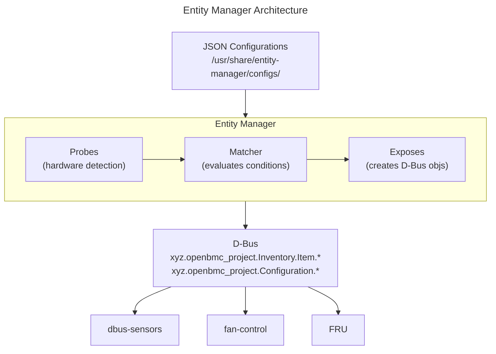

# Entity Manager Guide
{: .no_toc }

Configure hardware through JSON-based entity definitions and probes.
{: .fs-6 .fw-300 }

## Table of Contents
{: .no_toc .text-delta }

1. TOC
{:toc}

---

## Overview

**Entity Manager** is the configuration backbone of OpenBMC. It:

- Discovers hardware through **probes**
- Exposes hardware entities on **D-Bus**
- Configures sensors, fans, LEDs, and other components via **JSON**
- Replaces hardcoded YAML configurations with dynamic discovery



<details markdown="1">
<summary>ASCII-art version (for comparison)</summary>

```
┌─────────────────────────────────────────────────────────────────┐
│                    Entity Manager Architecture                  │
├─────────────────────────────────────────────────────────────────┤
│                                                                 │
│  ┌─────────────────────────────────────────────────────────────┐│
│  │                      JSON Configurations                    ││
│  │              /usr/share/entity-manager/configs/             ││
│  └──────────────────────────┬──────────────────────────────────┘│
│                             │                                   │
│  ┌──────────────────────────┴──────────────────────────────────┐│
│  │                      Entity Manager                         ││
│  │                                                             ││
│  │   ┌──────────────┐    ┌──────────────┐    ┌──────────────┐  ││
│  │   │    Probes    │───▶│   Matcher    │───▶│   Exposes    │  ││
│  │   │  (hardware   │    │ (evaluates   │    │ (creates     │  ││
│  │   │  detection)  │    │  conditions) │    │  D-Bus objs) │  ││
│  │   └──────────────┘    └──────────────┘    └──────────────┘  ││
│  │                                                             ││
│  └──────────────────────────┬──────────────────────────────────┘│
│                             │                                   │
│  ┌──────────────────────────┴──────────────────────────────────┐│
│  │                         D-Bus                               ││
│  │        xyz.openbmc_project.Inventory.Item.*                 ││
│  │        xyz.openbmc_project.Configuration.*                  ││
│  └──────────────────────────┬──────────────────────────────────┘│
│                             │                                   │
│        ┌────────────────────┼────────────────────┐              │
│        ▼                    ▼                    ▼              │
│  ┌────────────┐       ┌───────────┐       ┌───────────┐         │
│  │dbus-sensors│       │fan-control│       │   FRU     │         │
│  └────────────┘       └───────────┘       └───────────┘         │
└─────────────────────────────────────────────────────────────────┘
```

</details>

---

## Setup & Configuration

### Build-Time Configuration (Yocto)

Include Entity Manager in your image:

```bitbake
# In your machine .conf or image recipe
IMAGE_INSTALL:append = " entity-manager"

# Include FRU device support
IMAGE_INSTALL:append = " fru-device"
```

### Meson Build Options

```bash
meson setup build \
    -Dfru-device=enabled \
    -Dconfiguration-directory=/usr/share/entity-manager/configurations
```

| Option | Default | Description |
|--------|---------|-------------|
| `fru-device` | enabled | FRU EEPROM detection |
| `configuration-directory` | /usr/share/... | JSON config location |

### Runtime Enable/Disable

```bash
# Check Entity Manager status
systemctl status xyz.openbmc_project.EntityManager

# Restart to reload configurations
systemctl restart xyz.openbmc_project.EntityManager

# Disable Entity Manager (not recommended)
systemctl stop xyz.openbmc_project.EntityManager
systemctl disable xyz.openbmc_project.EntityManager

# Check FRU device service
systemctl status xyz.openbmc_project.FruDevice
```

### Configuration File Locations

```bash
# Primary configuration directory
/usr/share/entity-manager/configurations/

# Machine-specific overrides (higher priority)
/etc/entity-manager/configurations/

# Runtime configuration directory
/var/lib/entity-manager/
```

### Adding New Configurations

```bash
# Create a new configuration file
cat > /usr/share/entity-manager/configurations/my-board.json << 'EOF'
{
    "Name": "MyBoard",
    "Type": "Board",
    "Probe": "TRUE",
    "Exposes": [...]
}
EOF

# Reload Entity Manager
systemctl restart xyz.openbmc_project.EntityManager

# Verify configuration loaded
busctl tree xyz.openbmc_project.EntityManager | grep MyBoard
```

### Configuration Priority

When multiple configurations match:

1. `/etc/entity-manager/configurations/` (highest priority)
2. `/usr/share/entity-manager/configurations/`
3. Built-in defaults (lowest priority)

### Hot-Reload Configurations

Entity Manager monitors for file changes:

```bash
# Modify a configuration file
vim /usr/share/entity-manager/configurations/my-board.json

# Entity Manager automatically reloads (no restart needed)
# Or force reload
busctl call xyz.openbmc_project.EntityManager \
    /xyz/openbmc_project/EntityManager \
    xyz.openbmc_project.EntityManager Reload
```

### Disable Specific Configurations

To disable a configuration without deleting it:

```json
{
    "Name": "DisabledBoard",
    "Type": "Board",
    "Probe": "FALSE",
    "Exposes": [...]
}
```

Or move to a disabled directory:

```bash
mkdir -p /usr/share/entity-manager/configurations/disabled
mv my-board.json configurations/disabled/
systemctl restart xyz.openbmc_project.EntityManager
```

### D-Bus Configuration Interface

Query and manipulate configurations via D-Bus:

```bash
# List all configurations
busctl tree xyz.openbmc_project.EntityManager

# Get configuration properties
busctl introspect xyz.openbmc_project.EntityManager \
    /xyz/openbmc_project/inventory/system/board/MyBoard

# Check if entity is present
busctl get-property xyz.openbmc_project.EntityManager \
    /xyz/openbmc_project/inventory/system/board/MyBoard \
    xyz.openbmc_project.Inventory.Item Present
```

---

## JSON Configuration Structure

{: .note }
> **Source Reference**: [entity-manager](https://github.com/openbmc/entity-manager)
> - Configuration examples: [configurations/](https://github.com/openbmc/entity-manager/tree/master/configurations)
> - Schema documentation: [docs/](https://github.com/openbmc/entity-manager/tree/master/docs)

### Basic Structure

```json
{
    "Name": "MyBoard",
    "Type": "Board",
    "Probe": "TRUE",
    "Exposes": [
        {
            "Name": "Sensor1",
            "Type": "SensorType",
            ...
        }
    ]
}
```

### Key Fields

| Field | Required | Description |
|-------|----------|-------------|
| `Name` | Yes | Unique identifier for this entity |
| `Type` | Yes | Entity type (Board, Chassis, CPU, etc.) |
| `Probe` | Yes | Condition for when to load this config |
| `Exposes` | No | Array of components this entity exposes |
| `xyz.openbmc_project.*` | No | Additional D-Bus interfaces to implement |

---

## Probe System

Probes determine when a configuration should be applied.

### Simple Probes

```json
// Always apply
"Probe": "TRUE"

// Never apply (disabled)
"Probe": "FALSE"
```

### FRU Probes

Detect hardware by reading FRU EEPROM data:

```json
// Match specific board by FRU fields
"Probe": "xyz.openbmc_project.FruDevice({'PRODUCT_PRODUCT_NAME': 'MyBoard'})"

// Match by manufacturer
"Probe": "xyz.openbmc_project.FruDevice({'BOARD_MANUFACTURER': 'ACME'})"

// Match by part number
"Probe": "xyz.openbmc_project.FruDevice({'PRODUCT_PART_NUMBER': 'ABC-123'})"
```

### I2C Device Probes

Detect I2C devices:

```json
// Check if device responds at address
"Probe": "i2c({'bus': 1, 'address': 72})"

// With multiple addresses
"Probe": "i2c({'bus': 1, 'address': [72, 73]})"
```

### GPIO Probes

Detect by GPIO state:

```json
// Check GPIO value
"Probe": "gpio({'name': 'BOARD_ID0', 'value': 1})"
```

### Compound Probes

Combine conditions with AND/OR:

```json
// AND condition
"Probe": "AND(
    xyz.openbmc_project.FruDevice({'PRODUCT_PRODUCT_NAME': 'MyBoard'}),
    i2c({'bus': 1, 'address': 72})
)"

// OR condition
"Probe": "OR(
    xyz.openbmc_project.FruDevice({'PRODUCT_PRODUCT_NAME': 'BoardV1'}),
    xyz.openbmc_project.FruDevice({'PRODUCT_PRODUCT_NAME': 'BoardV2'})
)"
```

### Record-Based Probes

Use found records in expressions:

```json
{
    "Name": "$PRODUCT_PRODUCT_NAME",
    "Probe": "xyz.openbmc_project.FruDevice({'PRODUCT_MANUFACTURER': 'ACME'})",
    "Type": "Board",
    "Exposes": [
        {
            "Name": "$PRODUCT_PRODUCT_NAME Temp",
            "Bus": "$bus",
            "Address": "$address",
            "Type": "TMP75"
        }
    ]
}
```

---

## Exposes Section

The `Exposes` array defines components provided by this entity.

### Sensor Exposures

```json
{
    "Exposes": [
        {
            "Name": "CPU Temp",
            "Type": "TMP75",
            "Bus": 1,
            "Address": "0x48",
            "Thresholds": [
                {
                    "Direction": "greater than",
                    "Name": "upper critical",
                    "Severity": 1,
                    "Value": 95
                },
                {
                    "Direction": "greater than",
                    "Name": "upper warning",
                    "Severity": 0,
                    "Value": 85
                }
            ]
        },
        {
            "Name": "P12V",
            "Type": "ADC",
            "Index": 0,
            "ScaleFactor": 4.0,
            "PowerState": "On"
        }
    ]
}
```

### Fan Exposures

```json
{
    "Exposes": [
        {
            "Name": "Fan0",
            "Type": "AspeedFan",
            "Connector": {
                "Name": "Fan0",
                "Pwm": 0,
                "Tachs": [0]
            }
        },
        {
            "Name": "Fan1",
            "Type": "AspeedFan",
            "Connector": {
                "Name": "Fan1",
                "Pwm": 1,
                "Tachs": [1, 2]
            }
        }
    ]
}
```

### LED Exposures

```json
{
    "Exposes": [
        {
            "Name": "identify",
            "Type": "GPIO",
            "GpioLine": "ID_LED",
            "Polarity": "ActiveLow"
        }
    ]
}
```

### PSU Exposures

```json
{
    "Exposes": [
        {
            "Name": "PSU1",
            "Type": "pmbus",
            "Bus": 3,
            "Address": "0x58",
            "Labels": ["vin", "vout1", "iout1", "pin", "pout1", "temp1"]
        }
    ]
}
```

---

## FRU Configuration

### EEPROM Configuration

```json
{
    "Name": "System FRU",
    "Probe": "TRUE",
    "Type": "Board",
    "xyz.openbmc_project.Inventory.Decorator.Asset": {
        "Manufacturer": "$PRODUCT_MANUFACTURER",
        "Model": "$PRODUCT_PRODUCT_NAME",
        "PartNumber": "$PRODUCT_PART_NUMBER",
        "SerialNumber": "$PRODUCT_SERIAL_NUMBER"
    },
    "xyz.openbmc_project.Inventory.Item": {
        "Present": true,
        "PrettyName": "System Board"
    }
}
```

### FRU Device Definition

```json
{
    "Exposes": [
        {
            "Name": "System FRU",
            "Type": "EEPROM",
            "Bus": 0,
            "Address": "0x50",
            "Size": 256
        }
    ],
    "Name": "BaseBoard",
    "Probe": "TRUE",
    "Type": "Board"
}
```

---

## D-Bus Interface Implementation

Entity Manager can implement arbitrary D-Bus interfaces:

```json
{
    "Name": "MyBoard",
    "Probe": "TRUE",
    "Type": "Board",

    "xyz.openbmc_project.Inventory.Item": {
        "Present": true,
        "PrettyName": "Main Board"
    },

    "xyz.openbmc_project.Inventory.Decorator.Asset": {
        "Manufacturer": "ACME Corp",
        "Model": "Server-X",
        "PartNumber": "ABC-123",
        "SerialNumber": "SN-001"
    },

    "xyz.openbmc_project.Inventory.Decorator.Revision": {
        "Version": "1.0"
    }
}
```

---

## Configuration Files Location

```
/usr/share/entity-manager/configurations/
├── baseboard.json           # Main system board
├── psu.json                 # Power supplies
├── fans.json                # Fan configuration
├── cpu.json                 # CPU sensors
├── memory.json              # Memory configuration
└── add-ons/
    ├── riser1.json         # Add-on card
    └── gpu.json            # GPU configuration
```

---

## Complete Example

### Board with Sensors, Fans, and FRU

```json
{
    "Name": "MyServerBoard",
    "Type": "Board",
    "Probe": "xyz.openbmc_project.FruDevice({'PRODUCT_PRODUCT_NAME': 'MyServer'})",

    "xyz.openbmc_project.Inventory.Item": {
        "Present": true,
        "PrettyName": "Server Main Board"
    },

    "xyz.openbmc_project.Inventory.Decorator.Asset": {
        "Manufacturer": "$PRODUCT_MANUFACTURER",
        "Model": "$PRODUCT_PRODUCT_NAME",
        "PartNumber": "$PRODUCT_PART_NUMBER",
        "SerialNumber": "$PRODUCT_SERIAL_NUMBER"
    },

    "Exposes": [
        {
            "Name": "Inlet Temp",
            "Type": "TMP75",
            "Bus": "$bus",
            "Address": "0x48",
            "Thresholds": [
                {"Direction": "greater than", "Name": "upper critical", "Severity": 1, "Value": 45},
                {"Direction": "greater than", "Name": "upper warning", "Severity": 0, "Value": 40}
            ]
        },
        {
            "Name": "Outlet Temp",
            "Type": "TMP75",
            "Bus": "$bus",
            "Address": "0x49",
            "Thresholds": [
                {"Direction": "greater than", "Name": "upper critical", "Severity": 1, "Value": 55},
                {"Direction": "greater than", "Name": "upper warning", "Severity": 0, "Value": 50}
            ]
        },
        {
            "Name": "P12V",
            "Type": "ADC",
            "Index": 0,
            "ScaleFactor": 4.0,
            "Thresholds": [
                {"Direction": "greater than", "Name": "upper critical", "Severity": 1, "Value": 13.2},
                {"Direction": "less than", "Name": "lower critical", "Severity": 1, "Value": 10.8}
            ]
        },
        {
            "Name": "P3V3",
            "Type": "ADC",
            "Index": 1,
            "ScaleFactor": 1.0,
            "Thresholds": [
                {"Direction": "greater than", "Name": "upper critical", "Severity": 1, "Value": 3.6},
                {"Direction": "less than", "Name": "lower critical", "Severity": 1, "Value": 3.0}
            ]
        },
        {
            "Name": "Fan0",
            "Type": "AspeedFan",
            "Connector": {
                "Name": "Fan0",
                "Pwm": 0,
                "Tachs": [0]
            }
        },
        {
            "Name": "Fan1",
            "Type": "AspeedFan",
            "Connector": {
                "Name": "Fan1",
                "Pwm": 1,
                "Tachs": [1]
            }
        }
    ]
}
```

---

## D-Bus Interface

Entity Manager exposes configuration on D-Bus:

```bash
# List all configurations
busctl tree xyz.openbmc_project.EntityManager

# Introspect a configuration
busctl introspect xyz.openbmc_project.EntityManager \
    /xyz/openbmc_project/inventory/system/board/MyServerBoard

# Get configuration property
busctl get-property xyz.openbmc_project.EntityManager \
    /xyz/openbmc_project/inventory/system/board/MyServerBoard \
    xyz.openbmc_project.Inventory.Item Present
```

### Watching for Changes

```bash
# Monitor for new devices
busctl monitor xyz.openbmc_project.EntityManager

# Monitor object manager signals
dbus-monitor --system "type='signal',interface='org.freedesktop.DBus.ObjectManager'"
```

---

## Testing Configurations

### Validate JSON Syntax

```bash
# Check JSON is valid
python3 -m json.tool < myconfig.json > /dev/null

# Pretty print
python3 -m json.tool myconfig.json
```

### Test on Target

```bash
# Copy configuration to BMC
scp myconfig.json root@bmc:/usr/share/entity-manager/configurations/

# Restart Entity Manager
systemctl restart xyz.openbmc_project.EntityManager

# Check logs
journalctl -u xyz.openbmc_project.EntityManager -f

# Verify configuration loaded
busctl tree xyz.openbmc_project.EntityManager | grep MyBoard
```

### Debug Probe Evaluation

```bash
# Check FRU devices detected
busctl tree xyz.openbmc_project.FruDevice

# Get FRU properties
busctl introspect xyz.openbmc_project.FruDevice \
    /xyz/openbmc_project/FruDevice/device_0

# Check I2C bus
i2cdetect -y 1
```

---

## Troubleshooting

### Configuration Not Loading

```bash
# Check JSON syntax
python3 -m json.tool < config.json

# Check Entity Manager logs
journalctl -u xyz.openbmc_project.EntityManager | grep -i error

# Verify probe condition
# For FRU probes, check if FRU is detected
busctl call xyz.openbmc_project.FruDevice \
    /xyz/openbmc_project/FruDevice/device_0 \
    org.freedesktop.DBus.Properties GetAll s ""
```

### Sensors Not Appearing

```bash
# Check sensor daemon received configuration
journalctl -u xyz.openbmc_project.hwmontempsensor | grep -i config

# Verify D-Bus object exists
busctl tree xyz.openbmc_project.EntityManager | grep -i sensor

# Check I2C device exists
ls /sys/bus/i2c/devices/
```

### Probe Not Matching

```bash
# Debug FRU probe
busctl get-property xyz.openbmc_project.FruDevice \
    /xyz/openbmc_project/FruDevice/device_0 \
    xyz.openbmc_project.FruDevice PRODUCT_PRODUCT_NAME

# Check exact field name and value
# Field names are case-sensitive
```

---

## Best Practices

1. **Use probes** - Don't use `"Probe": "TRUE"` unless absolutely necessary
2. **Test JSON** - Validate syntax before deploying
3. **Use variables** - Leverage `$bus`, `$address` from probe records
4. **Document thresholds** - Explain why each threshold value was chosen
5. **Group logically** - Keep related sensors in the same config file
6. **Version control** - Track configuration changes in git

---

## Deep Dive
{: .text-delta }

Advanced implementation details for Entity Manager developers.

### Probe Evaluation Algorithm

Entity Manager evaluates probes in a specific order to determine which configurations to load:

```
┌─────────────────────────────────────────────────────────────────────────┐
│                     Probe Evaluation Flow                               │
├─────────────────────────────────────────────────────────────────────────┤
│                                                                         │
│   1. STARTUP                                                            │
│      ├── Load all JSON files from configuration directories             │
│      ├── Parse each configuration into memory                           │
│      └── Build dependency graph of probe conditions                     │
│                                                                         │
│   2. INITIAL PROBE EVALUATION                                           │
│      ├── Evaluate "TRUE" probes first (always match)                    │
│      ├── Query D-Bus for FruDevice objects                              │
│      ├── Query I2C bus for device presence                              │
│      ├── Query GPIO states                                              │
│      └── Evaluate compound probes (AND/OR)                              │
│                                                                         │
│   3. MATCH HANDLING                                                     │
│      ├── For each matching probe:                                       │
│      │   ├── Extract record values ($bus, $address, $FIELD)             │
│      │   ├── Substitute variables in Exposes section                    │
│      │   └── Create D-Bus objects for entity and children               │
│      └── Store matched configurations in active set                     │
│                                                                         │
│   4. CONTINUOUS MONITORING                                              │
│      ├── Watch for D-Bus signals (new FRU devices, etc.)                │
│      ├── Watch for file changes (inotify)                               │
│      └── Re-evaluate affected probes on changes                         │
│                                                                         │
└─────────────────────────────────────────────────────────────────────────┘
```

**Probe Evaluation Priority:**

| Priority | Probe Type | Evaluation Method |
|----------|------------|-------------------|
| 1 | `TRUE` / `FALSE` | Immediate (no D-Bus query) |
| 2 | `i2c()` | I2C device presence check |
| 3 | `gpio()` | GPIO line state query |
| 4 | `xyz.openbmc_project.FruDevice()` | D-Bus property match |
| 5 | `AND()` / `OR()` | Recursive evaluation |

**Source reference**: [EntityManager.cpp](https://github.com/openbmc/entity-manager/blob/master/src/EntityManager.cpp)

### Variable Substitution System

Entity Manager supports variable substitution using the `$` prefix:

```
┌─────────────────────────────────────────────────────────────────────────┐
│                    Variable Substitution                                │
├─────────────────────────────────────────────────────────────────────────┤
│                                                                         │
│   Source Variables (from matched probe record):                         │
│   ┌─────────────────────────────────────────────────────────────────┐   │
│   │  FruDevice match at /xyz/openbmc_project/FruDevice/device_0     │   │
│   │  ├── PRODUCT_PRODUCT_NAME = "MyServer"                          │   │
│   │  ├── PRODUCT_MANUFACTURER = "ACME"                              │   │
│   │  ├── PRODUCT_SERIAL_NUMBER = "SN12345"                          │   │
│   │  ├── bus = 1                                                    │   │
│   │  └── address = 80                                               │   │
│   └─────────────────────────────────────────────────────────────────┘   │
│                                                                         │
│   Configuration Template:                     After Substitution:       │
│   ┌─────────────────────────────┐            ┌─────────────────────┐    │
│   │ "Name": "$PRODUCT_PRODUCT   │     →      │ "Name": "MyServer"  │    │
│   │         _NAME"              │            │                     │    │
│   │ "Bus": "$bus"               │     →      │ "Bus": 1            │    │
│   │ "Address": "$address"       │     →      │ "Address": 80       │    │
│   └─────────────────────────────┘            └─────────────────────┘    │
│                                                                         │
│   Special Variables:                                                    │
│   ├── $bus      - I2C bus number from probe match                       │
│   ├── $address  - I2C device address from probe match                   │
│   ├── $index    - Array index when multiple matches                     │
│   └── $FIELD    - Any FRU field (PRODUCT_*, BOARD_*, CHASSIS_*)         │
│                                                                         │
└─────────────────────────────────────────────────────────────────────────┘
```

**Variable resolution order:**
1. Probe record properties (bus, address)
2. FRU field values (PRODUCT_*, BOARD_*)
3. Parent entity properties (inheritance)
4. Default values (if specified)

### Configuration Loading Sequence

```
┌─────────────────────────────────────────────────────────────────────────┐
│                    Configuration Loading Sequence                       │
├─────────────────────────────────────────────────────────────────────────┤
│                                                                         │
│   Time ──────────────────────────────────────────────────────────────▶  │
│                                                                         │
│   ┌─────────┐  ┌─────────┐  ┌─────────┐  ┌─────────┐  ┌─────────┐       │
│   │systemd  │  │FruDevice│  │ Entity  │  │ dbus-   │  │  PID    │       │
│   │ start   │  │ scans   │  │ Manager │  │ sensors │  │ control │       │
│   │         │  │ I2C bus │  │ probes  │  │ starts  │  │ starts  │       │
│   └────┬────┘  └────┬────┘  └────┬────┘  └────┬────┘  └────┬────┘       │
│        │            │            │            │            │            │
│        ▼            ▼            ▼            ▼            ▼            │
│   ┌─────────────────────────────────────────────────────────────────┐   │
│   │                        D-Bus Timeline                           │   │
│   ├─────────────────────────────────────────────────────────────────┤   │
│   │ t=0s    xyz.openbmc_project.EntityManager claims name           │   │
│   │ t=0.5s  xyz.openbmc_project.FruDevice claims name               │   │
│   │ t=1s    FruDevice emits InterfacesAdded for each EEPROM         │   │
│   │ t=1.5s  EntityManager receives signal, evaluates probes         │   │
│   │ t=2s    EntityManager creates D-Bus objects for matches         │   │
│   │ t=2.5s  dbus-sensors detects new Configuration objects          │   │
│   │ t=3s    Sensors appear on D-Bus                                 │   │
│   │ t=3.5s  phosphor-pid-control reads sensor configs               │   │
│   └─────────────────────────────────────────────────────────────────┘   │
│                                                                         │
└─────────────────────────────────────────────────────────────────────────┘
```

**Key dependencies:**
- `xyz.openbmc_project.FruDevice` must start before FRU probes work
- Entity Manager creates `xyz.openbmc_project.Configuration.*` objects
- Sensor daemons watch for Configuration objects via ObjectMapper

### D-Bus Object Creation

When a probe matches, Entity Manager creates D-Bus objects:

```
┌─────────────────────────────────────────────────────────────────────────┐
│                    D-Bus Object Hierarchy                               │
├─────────────────────────────────────────────────────────────────────────┤
│                                                                         │
│   Configuration JSON:                  D-Bus Objects Created:           │
│                                                                         │
│   {                                    /xyz/openbmc_project/            │
│     "Name": "MyBoard",                 └── inventory/                   │
│     "Type": "Board",                       └── system/                  │
│     ...                        ───▶            └── board/               │
│     "Exposes": [                                   └── MyBoard          │
│       {                                                ├── Decorator... │
│         "Name": "CPU_Temp",                            └── Item         │
│         "Type": "TMP75"                                                 │
│       }                                /xyz/openbmc_project/            │
│     ]                                  └── inventory/                   │
│   }                            ───▶        └── system/                  │
│                                                └── board/               │
│                                                    └── MyBoard/         │
│                                                        └── CPU_Temp     │
│                                                            └── TMP75    │
│                                                                         │
│   Object Path Construction:                                             │
│   ┌─────────────────────────────────────────────────────────────────┐   │
│   │ /xyz/openbmc_project/inventory/system/{Type}/{Name}/{Exposed}   │   │
│   └─────────────────────────────────────────────────────────────────┘   │
│                                                                         │
└─────────────────────────────────────────────────────────────────────────┘
```

**Interface mapping:**

| JSON Field | D-Bus Interface |
|------------|-----------------|
| `xyz.openbmc_project.Inventory.Item` | `xyz.openbmc_project.Inventory.Item` |
| `xyz.openbmc_project.Inventory.Decorator.Asset` | `xyz.openbmc_project.Inventory.Decorator.Asset` |
| `Type` in Exposes | `xyz.openbmc_project.Configuration.{Type}` |

### Hot-Reload Mechanism

Entity Manager uses inotify to detect configuration file changes:

```
┌─────────────────────────────────────────────────────────────────────────┐
│                    Hot-Reload Implementation                            │
├─────────────────────────────────────────────────────────────────────────┤
│                                                                         │
│   ┌─────────────────────────────────────────────────────────────────┐   │
│   │                     inotify Watches                             │   │
│   │   /usr/share/entity-manager/configurations/  ← IN_MODIFY        │   │
│   │   /etc/entity-manager/configurations/        ← IN_CREATE        │   │
│   │                                              ← IN_DELETE        │   │
│   └─────────────────────────────────────────────────────────────────┘   │
│                                                                         │
│   File Change Detection:                                                │
│   ┌──────────┐    ┌──────────┐    ┌──────────┐    ┌──────────┐          │
│   │ inotify  │───▶│ Parse    │───▶│ Compare  │───▶│ Update   │          │
│   │ event    │    │ new JSON │    │ with old │    │ D-Bus    │          │
│   └──────────┘    └──────────┘    └──────────┘    └──────────┘          │
│                                                                         │
│   Change Types:                                                         │
│   ├── New file: Evaluate probe, create objects if match                 │
│   ├── Modified: Re-evaluate probe, update or remove objects             │
│   └── Deleted: Remove associated D-Bus objects                          │
│                                                                         │
│   Debouncing:                                                           │
│   └── Multiple rapid changes are batched (100ms window)                 │
│                                                                         │
└─────────────────────────────────────────────────────────────────────────┘
```

**Note:** Hot-reload may not update all dependent services. Some sensor daemons require restart to pick up configuration changes.

### Probe Expression Parser

The probe expression parser supports a simple grammar:

```
┌─────────────────────────────────────────────────────────────────────────┐
│                    Probe Expression Grammar                             │
├─────────────────────────────────────────────────────────────────────────┤
│                                                                         │
│   probe      := "TRUE" | "FALSE" | func_call | compound                 │
│   compound   := "AND(" probe_list ")" | "OR(" probe_list ")"            │
│   probe_list := probe ("," probe)*                                      │
│   func_call  := func_name "(" params ")"                                │
│   func_name  := "i2c" | "gpio" | dbus_interface                         │
│   params     := json_object                                             │
│                                                                         │
│   Examples:                                                             │
│   ├── TRUE                                                              │
│   ├── i2c({'bus': 1, 'address': 72})                                    │
│   ├── xyz.openbmc_project.FruDevice({'PRODUCT_NAME': 'Board'})          │
│   ├── AND(i2c(...), gpio(...))                                          │
│   └── OR(FruDevice(...), FruDevice(...))                                │
│                                                                         │
│   Property Matching:                                                    │
│   ├── Exact match: {'FIELD': 'value'}                                   │
│   ├── Prefix match: {'FIELD': 'prefix*'}  (not supported)               │
│   └── Regex match: Not supported - use exact values                     │
│                                                                         │
└─────────────────────────────────────────────────────────────────────────┘
```

**Source reference**: [PerformProbe.cpp](https://github.com/openbmc/entity-manager/blob/master/src/PerformProbe.cpp)

### Source Code Reference

Key implementation files in [entity-manager](https://github.com/openbmc/entity-manager):

| File | Description |
|------|-------------|
| `src/EntityManager.cpp` | Main daemon, D-Bus object management |
| `src/PerformProbe.cpp` | Probe evaluation logic |
| `src/PerformScan.cpp` | I2C/GPIO scanning |
| `src/FruDevice.cpp` | FRU EEPROM reading |
| `src/Overlay.cpp` | Device tree overlay support |
| `src/Utils.cpp` | Variable substitution, JSON parsing |

---

## Examples

Working examples are available in the [examples/entity-manager](https://github.com/MichaelTien8901/openbmc-guide-tutorial/tree/master/examples/entity-manager) directory:

- `baseboard.json` - Baseboard configuration with probes
- `temperature-sensors.json` - Temperature sensor configuration
- `adc-sensors.json` - ADC sensor configuration
- `fans.json` - Fan configuration
- `psu.json` - Power supply configuration
- `fru-eeprom.json` - FRU EEPROM configuration

---

## Next Steps

For advanced Entity Manager topics including complex probing, FRU integration, and debugging:

- [Entity Manager Advanced]() - Regex probes, FruDevice, troubleshooting

## References

- [Entity Manager Repository](https://github.com/openbmc/entity-manager)
- [Entity Manager README](https://github.com/openbmc/entity-manager/blob/master/README.md)
- [Configuration Examples](https://github.com/openbmc/entity-manager/tree/master/configurations)
- [dbus-sensors Integration](https://github.com/openbmc/dbus-sensors)

---

{: .note }
**Tested on**: OpenBMC master, QEMU romulus
