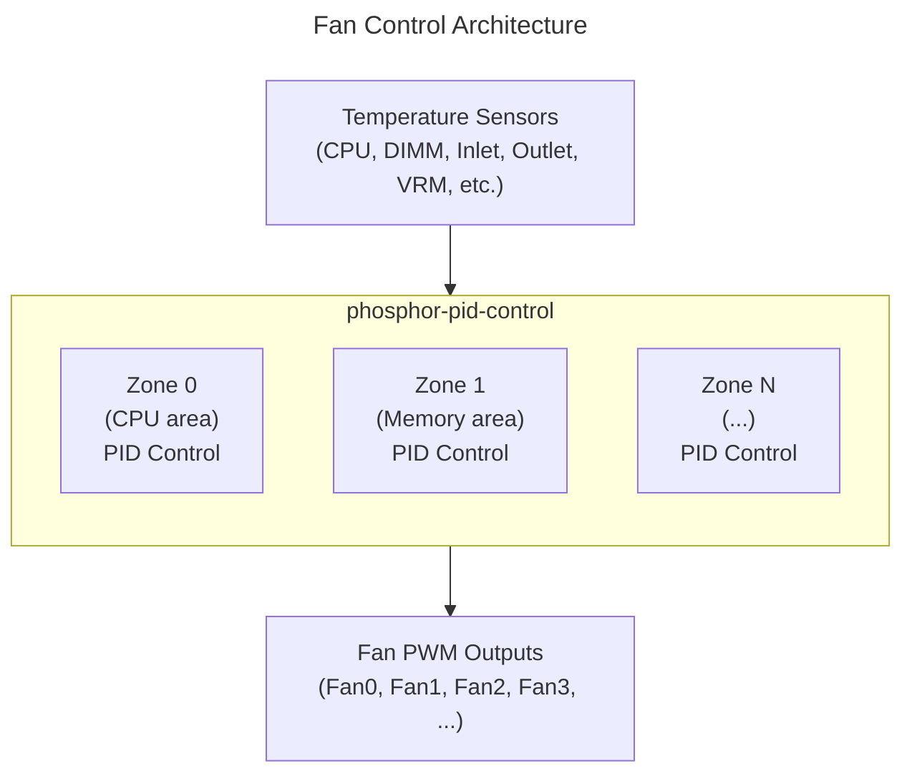

# Fan Control Guide
{: .no_toc }

Configure thermal management with phosphor-pid-control.
{: .fs-6 .fw-300 }

## Table of Contents
{: .no_toc .text-delta }

1. TOC
{:toc}

---

## Overview

**phosphor-pid-control** (swampd) is the thermal management daemon for OpenBMC. It uses PID (Proportional-Integral-Derivative) control to maintain optimal temperatures by adjusting fan speeds.



<details markdown="1">
<summary>ASCII-art version (for comparison)</summary>

```
┌─────────────────────────────────────────────────────────────────┐
│                   Fan Control Architecture                      │
├─────────────────────────────────────────────────────────────────┤
│                                                                 │
│  ┌─────────────────────────────────────────────────────────────┐│
│  │                  Temperature Sensors                        ││
│  │       (CPU, DIMM, Inlet, Outlet, VRM, etc.)                 ││
│  └──────────────────────────┬──────────────────────────────────┘│
│                             │                                   │
│  ┌──────────────────────────┴──────────────────────────────────┐│
│  │                  phosphor-pid-control                       ││
│  │                                                             ││
│  │   ┌──────────────┐    ┌──────────────┐    ┌──────────────┐  ││
│  │   │  Zone 0      │    │  Zone 1      │    │  Zone N      │  ││
│  │   │  (CPU area)  │    │ (Memory area)│    │  (...)       │  ││
│  │   │              │    │              │    │              │  ││
│  │   │ PID Control  │    │ PID Control  │    │ PID Control  │  ││
│  │   └──────┬───────┘    └──────┬───────┘    └──────┬───────┘  ││
│  │          │                   │                   │          ││
│  └──────────┼───────────────────┼───────────────────┼──────────┘│
│             │                   │                   │           │
│  ┌──────────┴───────────────────┴───────────────────┴──────────┐│
│  │                       Fan PWM Outputs                       ││
│  │              (Fan0, Fan1, Fan2, Fan3, ...)                  ││
│  └─────────────────────────────────────────────────────────────┘│
└─────────────────────────────────────────────────────────────────┘
```

</details>

---

## Key Concepts

### Zones

A **zone** is a thermal control region with:
- Input sensors (temperature, margin)
- Output fans (PWM control)
- PID controllers for each sensor
- A failsafe behavior

### PID Controller

The PID algorithm calculates fan speed based on:
- **Proportional (P)**: Immediate response to error
- **Integral (I)**: Accumulated error over time
- **Derivative (D)**: Rate of change (often disabled)

```
Output = Kp × error + Ki × ∫error dt + Kd × d(error)/dt
```

### Setpoint

The target temperature the PID tries to maintain. The controller increases fan speed when temperature exceeds setpoint.

---

## Setup & Enable/Disable

### Build-Time Configuration (Yocto)

Include fan control in your image:

```bitbake
# In your machine .conf or image recipe
IMAGE_INSTALL:append = " phosphor-pid-control"

# Or exclude it
IMAGE_INSTALL:remove = "phosphor-pid-control"
```

### Meson Build Options

```bash
meson setup build \
    -Dcontrol=enabled \
    -Dhost-interface=enabled \
    -Djson=enabled \
    -Dboot-time=enabled
```

| Option | Default | Description |
|--------|---------|-------------|
| `control` | enabled | Enable fan control daemon |
| `host-interface` | enabled | D-Bus interface for host control |
| `json` | enabled | JSON configuration support |
| `boot-time` | disabled | Log boot-time thermal data |

### Runtime Enable/Disable

```bash
# Check service status
systemctl status phosphor-pid-control

# Stop fan control (fans go to failsafe)
systemctl stop phosphor-pid-control

# Disable fan control permanently
systemctl disable phosphor-pid-control

# Re-enable and start
systemctl enable phosphor-pid-control
systemctl start phosphor-pid-control

# Restart after config change
systemctl restart phosphor-pid-control
```

### Manual vs Automatic Mode

Switch between manual and automatic fan control:

```bash
# Get current mode
busctl get-property xyz.openbmc_project.State.FanCtrl \
    /xyz/openbmc_project/control/thermal/0 \
    xyz.openbmc_project.Control.ThermalMode Current

# Switch to Manual mode (disable PID control)
busctl set-property xyz.openbmc_project.State.FanCtrl \
    /xyz/openbmc_project/control/thermal/0 \
    xyz.openbmc_project.Control.ThermalMode Current s "Manual"

# Switch back to Automatic mode (PID control)
busctl set-property xyz.openbmc_project.State.FanCtrl \
    /xyz/openbmc_project/control/thermal/0 \
    xyz.openbmc_project.Control.ThermalMode Current s "Default"
```

### Direct PWM Control (Manual Mode)

When in manual mode, control fans directly:

```bash
# Set fan to 50% (value 0-255, so 128 = ~50%)
echo 128 > /sys/class/hwmon/hwmon0/pwm1

# Or via D-Bus
busctl set-property xyz.openbmc_project.FanSensor \
    /xyz/openbmc_project/control/fanpwm/Fan0 \
    xyz.openbmc_project.Control.FanPwm Target t 128
```

---

## Configuration

Configuration is done via JSON files loaded by Entity Manager or directly in `/usr/share/swampd/`.

{: .note }
> **Source Reference**: [phosphor-pid-control](https://github.com/openbmc/phosphor-pid-control)
> - Configuration schema: [phosphor-pid-control/conf.hpp](https://github.com/openbmc/phosphor-pid-control/blob/master/conf.hpp)
> - Example configs: [phosphor-pid-control/test/](https://github.com/openbmc/phosphor-pid-control/tree/master/test)

### Zone Configuration

```json
{
    "zones": [
        {
            "id": 0,
            "minThermalOutput": 25.0,
            "failsafePercent": 100.0
        }
    ]
}
```

| Field | Description |
|-------|-------------|
| `id` | Zone identifier |
| `minThermalOutput` | Minimum PWM % when zone is active |
| `failsafePercent` | PWM % when failsafe triggers |

### PID Configuration

```json
{
    "pid": [
        {
            "name": "CPU Temp",
            "type": "temp",
            "inputs": ["CPU_Temp"],
            "setpoint": 80.0,
            "pid": {
                "samplePeriod": 1.0,
                "proportionalCoeff": 0.0,
                "integralCoeff": -0.2,
                "feedFwdOffsetCoeff": 0.0,
                "feedFwdGainCoeff": 0.0,
                "integralLimit_min": 0.0,
                "integralLimit_max": 100.0,
                "outLim_min": 25.0,
                "outLim_max": 100.0,
                "slewNeg": 0.0,
                "slewPos": 0.0
            }
        }
    ]
}
```

### PID Parameters

| Parameter | Description | Typical Range |
|-----------|-------------|---------------|
| `samplePeriod` | Control loop interval (seconds) | 0.1 - 1.0 |
| `proportionalCoeff` | P gain (often 0 for thermal) | 0.0 - 1.0 |
| `integralCoeff` | I gain (negative for cooling) | -0.5 to -0.1 |
| `feedFwdOffsetCoeff` | Feed-forward offset | 0.0 |
| `feedFwdGainCoeff` | Feed-forward gain | 0.0 |
| `integralLimit_min/max` | Integral windup limits | 0.0 - 100.0 |
| `outLim_min/max` | Output PWM limits | 0.0 - 100.0 |
| `slewNeg/slewPos` | Rate limits (0=unlimited) | 0.0 - 10.0 |

### Fan Configuration

```json
{
    "fans": [
        {
            "name": "Fan0",
            "zone": 0,
            "sensors": ["Fan0_Tach"],
            "output": "Fan0_PWM"
        },
        {
            "name": "Fan1",
            "zone": 0,
            "sensors": ["Fan1_Tach"],
            "output": "Fan1_PWM"
        }
    ]
}
```

---

## Complete Configuration Example

```json
{
    "version": "1.0",
    "zones": [
        {
            "id": 0,
            "minThermalOutput": 25.0,
            "failsafePercent": 100.0
        }
    ],
    "fans": [
        {
            "name": "Fan0",
            "zone": 0,
            "sensors": ["Fan0"],
            "output": "Fan0"
        },
        {
            "name": "Fan1",
            "zone": 0,
            "sensors": ["Fan1"],
            "output": "Fan1"
        },
        {
            "name": "Fan2",
            "zone": 0,
            "sensors": ["Fan2"],
            "output": "Fan2"
        },
        {
            "name": "Fan3",
            "zone": 0,
            "sensors": ["Fan3"],
            "output": "Fan3"
        }
    ],
    "pid": [
        {
            "name": "CPU Temp",
            "type": "temp",
            "inputs": ["CPU_Temp"],
            "setpoint": 80.0,
            "pid": {
                "samplePeriod": 1.0,
                "proportionalCoeff": 0.0,
                "integralCoeff": -0.2,
                "feedFwdOffsetCoeff": 0.0,
                "feedFwdGainCoeff": 0.0,
                "integralLimit_min": 0.0,
                "integralLimit_max": 100.0,
                "outLim_min": 25.0,
                "outLim_max": 100.0,
                "slewNeg": 0.0,
                "slewPos": 0.0
            }
        },
        {
            "name": "Inlet Temp",
            "type": "temp",
            "inputs": ["Inlet_Temp"],
            "setpoint": 35.0,
            "pid": {
                "samplePeriod": 1.0,
                "proportionalCoeff": 0.0,
                "integralCoeff": -0.3,
                "feedFwdOffsetCoeff": 0.0,
                "feedFwdGainCoeff": 0.0,
                "integralLimit_min": 0.0,
                "integralLimit_max": 100.0,
                "outLim_min": 25.0,
                "outLim_max": 100.0,
                "slewNeg": 0.0,
                "slewPos": 0.0
            }
        }
    ]
}
```

---

## Configuration Methods

phosphor-pid-control supports two ways to load its configuration:

| Method | Config Location | When to Use |
|--------|----------------|-------------|
| **Direct JSON** | `/usr/share/swampd/config.json` | Simple systems, single board, quick prototyping |
| **Entity Manager** | `/usr/share/entity-manager/configurations/*.json` | Multi-board support, dynamic hardware detection |

### Direct JSON

Place a `config.json` in `/usr/share/swampd/` (see [zone-config.json](https://github.com/MichaelTien8901/openbmc-guide-tutorial/tree/master/docs/examples/fan-control/zone-config.json) for a complete example). This file defines sensors, zones, and PIDs in a single flat structure.

The direct JSON format includes `sensors` (D-Bus paths for temperature and fan tach), `zones`, and `pid` arrays. phosphor-pid-control reads this file at startup.

### Entity Manager (Recommended)

Entity Manager is the preferred method for production systems. It separates hardware description from thermal policy and supports multiple board configurations.

**How it works:**

1. Entity Manager scans JSON files in `/usr/share/entity-manager/configurations/`
2. Each file has a `"Probe"` field that determines **when** the config applies (e.g., only when a specific board is detected via FRU data or GPIO)
3. When the probe matches, Entity Manager exposes the configuration on D-Bus
4. phosphor-pid-control reads its PID/zone config from D-Bus (not from the JSON file directly)

```
JSON file in configurations/     Entity Manager         phosphor-pid-control
┌──────────────────────┐     ┌──────────────────┐     ┌─────────────────┐
│ Probe: "board match" │────>│ Evaluates probe  │     │                 │
│ Exposes:             │     │ If match:        │     │ Reads PID config│
│   - Pid.Zone         │     │   publishes to   │────>│ from D-Bus      │
│   - Pid (temp)       │     │   D-Bus          │     │ Starts control  │
│   - Pid (fan)        │     │                  │     │ loop            │
└──────────────────────┘     └──────────────────┘     └─────────────────┘
```

## Entity Manager Integration

### Where to Put the JSON File

The Entity Manager configuration file goes in your machine layer:

```bash
# In your Yocto layer
meta-myplatform/
  recipes-phosphor/
    configuration/
      entity-manager/
        files/
          my-board-fan-control.json    # <-- your fan config
        entity-manager_%.bbappend

# bbappend to install the config
cat > entity-manager_%.bbappend << 'EOF'
FILESEXTRAPATHS:prepend := "${THISDIR}/files:"
SRC_URI += "file://my-board-fan-control.json"

do_install:append() {
    install -d ${D}${datadir}/entity-manager/configurations
    install -m 0444 ${WORKDIR}/my-board-fan-control.json \
        ${D}${datadir}/entity-manager/configurations/
}
EOF
```

On the BMC filesystem, the file ends up at:
```
/usr/share/entity-manager/configurations/my-board-fan-control.json
```

### The Probe Field

The `"Probe"` field tells Entity Manager **when** to activate this configuration. Common patterns:

```json
// Always active (useful for development/QEMU)
"Probe": "TRUE"

// Match a specific board by FRU product name
"Probe": "xyz.openbmc_project.FruDevice({'PRODUCT_PRODUCT_NAME': 'MyServer'})"

// Match by board ID GPIO
"Probe": "xyz.openbmc_project.Inventory.Decorator.Asset({'Model': 'X123'})"
```

### Complete Entity Manager Fan Config

A single JSON file defines the zone, thermal PIDs, and fan PIDs together. See [entity-manager-fan.json](https://github.com/MichaelTien8901/openbmc-guide-tutorial/tree/master/docs/examples/fan-control/entity-manager-fan.json) for the full working example.

The key `Exposes` entries:

**Zone definition** — sets minimum fan speed and failsafe behavior:

```json
{
    "Name": "Zone 0",
    "Type": "Pid.Zone",
    "MinThermalOutput": 25.0,
    "FailSafePercent": 100.0
}
```

**Thermal PID** (`Class: "temp"`) — controls fan speed based on temperature:

```json
{
    "Name": "CPU Thermal PID",
    "Type": "Pid",
    "Class": "temp",
    "Inputs": ["CPU_Temp"],
    "SetPoint": 80.0,
    "Zones": ["Zone 0"],
    "PIDGains": {
        "P": 0.0,
        "I": -0.2,
        "D": 0.0,
        "FF": 0.0,
        "ILimitMin": 0.0,
        "ILimitMax": 100.0,
        "OutLimitMin": 25.0,
        "OutLimitMax": 100.0,
        "SlewNeg": 5.0,
        "SlewPos": 10.0
    }
}
```

**Fan PID** (`Class: "fan"`) — converts zone PWM% to actual fan RPM using feed-forward:

```json
{
    "Name": "Fan0 PID",
    "Type": "Pid",
    "Class": "fan",
    "Inputs": ["Fan0"],
    "SetPoint": 7000.0,
    "Zones": ["Zone 0"],
    "PIDGains": {
        "P": 0.0,
        "I": 0.0,
        "D": 0.0,
        "FF": 1.0,
        "ILimitMin": 0.0,
        "ILimitMax": 100.0,
        "OutLimitMin": 0.0,
        "OutLimitMax": 100.0,
        "SlewNeg": 0.0,
        "SlewPos": 0.0
    }
}
```

{: .note }
> The `Class` field is critical: `"temp"` PIDs calculate desired fan speed from temperature readings; `"fan"` PIDs translate the zone's requested RPM into actual PWM output. A complete config needs **both** types.

### Verify on Running System

After deploying the config and rebooting:

```bash
# Check Entity Manager loaded the config
busctl tree xyz.openbmc_project.EntityManager | grep -i pid

# Check phosphor-pid-control is using the config
journalctl -u phosphor-pid-control | head -20

# Verify zones are active
busctl tree xyz.openbmc_project.State.FanCtrl
```

---

## D-Bus Interface

### Zone Control

```bash
# Check zone status
busctl tree xyz.openbmc_project.State.FanCtrl

# Get current zone mode
busctl get-property xyz.openbmc_project.State.FanCtrl \
    /xyz/openbmc_project/control/thermal/0 \
    xyz.openbmc_project.Control.ThermalMode Current

# Set manual mode
busctl set-property xyz.openbmc_project.State.FanCtrl \
    /xyz/openbmc_project/control/thermal/0 \
    xyz.openbmc_project.Control.ThermalMode Current s "Manual"
```

### Manual Fan Control

```bash
# When in Manual mode, set fan PWM directly
busctl set-property xyz.openbmc_project.FanSensor \
    /xyz/openbmc_project/control/fanpwm/Fan0 \
    xyz.openbmc_project.Control.FanPwm Target t 75
```

---

## PID Tuning

### Step 1: Baseline Measurements

```bash
# Record temperatures at fixed fan speeds
for pwm in 30 50 70 100; do
    echo "Testing at $pwm% PWM"
    # Set manual mode and fixed PWM
    # Record temperatures after stabilization (5-10 minutes)
done
```

### Step 2: Start Conservative

Begin with conservative PID values:

```json
{
    "proportionalCoeff": 0.0,
    "integralCoeff": -0.1,
    "outLim_min": 30.0,
    "outLim_max": 100.0
}
```

### Step 3: Tune Integral Gain

- **Too slow**: Increase `integralCoeff` magnitude (e.g., -0.1 → -0.2)
- **Oscillating**: Decrease `integralCoeff` magnitude
- **Not reaching setpoint**: Check `outLim_max` allows sufficient cooling

### Step 4: Add Rate Limiting

```json
{
    "slewNeg": 5.0,
    "slewPos": 10.0
}
```

- `slewPos`: Max PWM increase per second
- `slewNeg`: Max PWM decrease per second

### Step 5: Verify Failsafe

Test failsafe behavior:
1. Disconnect a temperature sensor
2. Verify fans go to `failsafePercent`
3. Reconnect and verify normal operation resumes

---

## Multiple Zones

For systems with multiple thermal zones:

```json
{
    "zones": [
        {
            "id": 0,
            "minThermalOutput": 25.0,
            "failsafePercent": 100.0
        },
        {
            "id": 1,
            "minThermalOutput": 30.0,
            "failsafePercent": 100.0
        }
    ],
    "fans": [
        {
            "name": "CPU_Fan",
            "zone": 0,
            "sensors": ["CPU_Fan"],
            "output": "CPU_Fan"
        },
        {
            "name": "Sys_Fan",
            "zone": 1,
            "sensors": ["Sys_Fan"],
            "output": "Sys_Fan"
        }
    ]
}
```

---

## Stepwise Control

For simple table-based control instead of PID:

```json
{
    "name": "Inlet Stepwise",
    "type": "stepwise",
    "inputs": ["Inlet_Temp"],
    "reading": {
        "positiveHysteresis": 2.0,
        "negativeHysteresis": 2.0
    },
    "output": {
        "0": 30,
        "25": 40,
        "30": 50,
        "35": 70,
        "40": 100
    }
}
```

The `output` map defines PWM percentage at each temperature threshold.

---

## Troubleshooting

### Fans at Maximum Speed

```bash
# Check if in failsafe
journalctl -u phosphor-pid-control | grep -i failsafe

# Verify sensors are responding
busctl tree xyz.openbmc_project.HwmonTempSensor

# Check PID controller status
journalctl -u phosphor-pid-control -f
```

### Fans Not Responding

```bash
# Verify PWM control works manually
echo 128 > /sys/class/hwmon/hwmon0/pwm1

# Check fan sensor service
systemctl status xyz.openbmc_project.fansensor

# Verify D-Bus fan objects exist
busctl tree xyz.openbmc_project.FanSensor
```

### Temperature Oscillating

Reduce integral gain or add slew rate limiting:

```json
{
    "integralCoeff": -0.1,
    "slewNeg": 3.0,
    "slewPos": 5.0
}
```

### Debug Logging

Enable verbose logging:

```bash
systemctl stop phosphor-pid-control
/usr/bin/swampd -d
```

---

## Deep Dive
{: .text-delta }

Advanced implementation details for thermal control developers.

### PID Mathematics

The PID controller in phosphor-pid-control uses discrete-time calculations:

```
┌──────────────────────────────────────────────────────────────────────────┐
│                    PID Control Loop (per sample period)                  │
├──────────────────────────────────────────────────────────────────────────┤
│                                                                          │
│   error = setpoint - current_temperature                                 │
│                                                                          │
│   ┌─────────────┐     ┌─────────────┐     ┌─────────────┐                │
│   │ Proportional│     │  Integral   │     │ Derivative  │                │
│   │             │     │             │     │             │                │
│   │  P = Kp × e │     │ I += Ki × e │     │ D = Kd × Δe │                │
│   │             │     │   × dt      │     │     / dt    │                │
│   └──────┬──────┘     └──────┬──────┘     └──────┬──────┘                │
│          │                   │                   │                       │
│          └───────────────────┼───────────────────┘                       │
│                              │                                           │
│                              ▼                                           │
│                    output = P + I + D + FF                               │
│                              │                                           │
│                              ▼                                           │
│                    output = clamp(output, outLim_min, outLim_max)        │
│                              │                                           │
│                              ▼                                           │
│                    output = apply_slew_rate(output, previous_output)     │
│                              │                                           │
│                              ▼                                           │
│                         Fan PWM %                                        │
└──────────────────────────────────────────────────────────────────────────┘
```

**Why negative integral coefficient?**

For cooling control, we want:
- Temperature **above** setpoint → **increase** fan speed
- `error = setpoint - temperature` is **negative** when too hot
- Negative `Ki` × negative `error` = **positive** output increase

```
Example:
  setpoint = 80°C, temperature = 85°C
  error = 80 - 85 = -5
  Ki = -0.2
  I contribution = -0.2 × -5 = +1.0  (increases PWM)
```

### Anti-Windup Implementation

**Integral windup** occurs when the integral term accumulates excessively during sustained error, causing overshoot when the system finally responds.

```
┌─────────────────────────────────────────────────────────────────────────┐
│                     Integral Windup Prevention                          │
├─────────────────────────────────────────────────────────────────────────┤
│                                                                         │
│   Without Anti-Windup:           With Anti-Windup:                      │
│                                                                         │
│   Integral                       Integral                               │
│      ▲                              ▲                                   │
│      │    ╱──────                   │    ╱──── integralLimit_max        │
│      │   ╱                          │   ╱                               │
│      │  ╱  (accumulates             │  ╱  (clamped at limit)            │
│      │ ╱    indefinitely)           │ ╱                                 │
│      │╱                             │╱                                  │
│   ───┼────────► time             ───┼────────► time                     │
│      │                              │                                   │
│                                                                         │
│   Code implementation (pid/ec/pid.cpp):                                 │
│                                                                         │
│   integral += Ki * error * dt;                                          │
│   integral = std::clamp(integral, integralLimit_min, integralLimit_max);│
│                                                                         │
└─────────────────────────────────────────────────────────────────────────┘
```

**Configuration guidelines:**
- `integralLimit_max`: Should match `outLim_max` (typically 100.0)
- `integralLimit_min`: Usually 0.0 for cooling-only systems

### Slew Rate Limiting

Slew rate limits prevent sudden fan speed changes that cause acoustic disturbance:

```
┌─────────────────────────────────────────────────────────────────────────┐
│                      Slew Rate Limiting                                 │
├─────────────────────────────────────────────────────────────────────────┤
│                                                                         │
│   PWM %                                                                 │
│    100 ┤                    ╭───────────── Target                       │
│        │                  ╱                                             │
│     80 ┤                ╱   ← slewPos limits ramp-up rate               │
│        │              ╱                                                 │
│     60 ┤            ╱                                                   │
│        │          ╱                                                     │
│     40 ┤        ╱                                                       │
│        │      ╱                                                         │
│     20 ┤────╱                                                           │
│        │                                                                │
│        └────────────────────────────────────────────────────► time      │
│                                                                         │
│   Algorithm:                                                            │
│                                                                         │
│   delta = new_output - previous_output;                                 │
│   if (delta > 0 && slewPos > 0) {                                       │
│       delta = min(delta, slewPos * samplePeriod);                       │
│   } else if (delta < 0 && slewNeg > 0) {                                │
│       delta = max(delta, -slewNeg * samplePeriod);                      │
│   }                                                                     │
│   output = previous_output + delta;                                     │
│                                                                         │
└─────────────────────────────────────────────────────────────────────────┘
```

**Example calculation:**
- Current PWM: 40%, Target: 80%
- `slewPos`: 10.0 (%/second)
- `samplePeriod`: 1.0 second
- Max change per cycle: 10% → Output: 50% (not 80%)
- After 4 cycles: 40% → 50% → 60% → 70% → 80%

### Failsafe Trigger Conditions

Failsafe mode sets all fans to `failsafePercent` (typically 100%) when:

```
┌─────────────────────────────────────────────────────────────────────────┐
│                     Failsafe Trigger Conditions                         │
├─────────────────────────────────────────────────────────────────────────┤
│                                                                         │
│   1. SENSOR TIMEOUT                                                     │
│      └─ Sensor value not updated within timeout period                  │
│      └─ Default: 2 × samplePeriod                                       │
│      └─ Check: sensor returns NaN or error on D-Bus read                │
│                                                                         │
│   2. SENSOR MISSING                                                     │
│      └─ Required input sensor not found on D-Bus                        │
│      └─ Occurs during startup or sensor service crash                   │
│                                                                         │
│   3. FAN FAILURE                                                        │
│      └─ Tachometer reads 0 RPM when PWM > minimum                       │
│      └─ Indicates stuck or disconnected fan                             │
│                                                                         │
│   4. THERMAL RUNAWAY                                                    │
│      └─ Temperature exceeds critical threshold                          │
│      └─ Fans cannot maintain setpoint at 100% PWM                       │
│                                                                         │
│   Recovery:                                                             │
│   └─ Automatic when all sensors return to normal                        │
│   └─ Requires valid readings for "recovery delay" period                │
│                                                                         │
└─────────────────────────────────────────────────────────────────────────┘
```

**Source reference**: [pid/zone.cpp](https://github.com/openbmc/phosphor-pid-control/blob/master/pid/zone.cpp)

### Control Loop Timing

```
┌─────────────────────────────────────────────────────────────────────────┐
│                    Control Loop Execution                               │
├─────────────────────────────────────────────────────────────────────────┤
│                                                                         │
│   ┌──────────┐    ┌──────────┐    ┌──────────┐    ┌──────────┐          │
│   │  t=0s    │    │  t=1s    │    │  t=2s    │    │  t=3s    │          │
│   └────┬─────┘    └────┬─────┘    └────┬─────┘    └────┬─────┘          │
│        │               │               │               │                │
│        ▼               ▼               ▼               ▼                │
│   ┌─────────┐     ┌─────────┐     ┌─────────┐     ┌─────────┐           │
│   │Read     │     │Read     │     │Read     │     │Read     │           │
│   │Sensors  │     │Sensors  │     │Sensors  │     │Sensors  │           │
│   └────┬────┘     └────┬────┘     └────┬────┘     └────┬────┘           │
│        │               │               │               │                │
│        ▼               ▼               ▼               ▼                │
│   ┌─────────┐     ┌─────────┐     ┌─────────┐     ┌─────────┐           │
│   │Run PID  │     │Run PID  │     │Run PID  │     │Run PID  │           │
│   │Calc     │     │Calc     │     │Calc     │     │Calc     │           │
│   └────┬────┘     └────┬────┘     └────┬────┘     └────┬────┘           │
│        │               │               │               │                │
│        ▼               ▼               ▼               ▼                │
│   ┌─────────┐     ┌─────────┐     ┌─────────┐     ┌─────────┐           │
│   │Write    │     │Write    │     │Write    │     │Write    │           │
│   │PWM      │     │PWM      │     │PWM      │     │PWM      │           │
│   └─────────┘     └─────────┘     └─────────┘     └─────────┘           │
│                                                                         │
│   samplePeriod = 1.0s (configurable per PID)                            │
│   Zones may have different sample periods                               │
│   Shorter period = faster response, more CPU usage                      │
│                                                                         │
└─────────────────────────────────────────────────────────────────────────┘
```

### Multi-Sensor Zone Arbitration

When multiple PID controllers exist in a zone, outputs are arbitrated:

```
┌─────────────────────────────────────────────────────────────────────────┐
│                    Multi-Sensor Arbitration                             │
├─────────────────────────────────────────────────────────────────────────┤
│                                                                         │
│   Zone 0 contains:                                                      │
│   ├── CPU_Temp PID    → output: 45%                                     │
│   ├── DIMM_Temp PID   → output: 60%                                     │
│   └── Inlet_Temp PID  → output: 35%                                     │
│                                                                         │
│   Arbitration: MAX(all outputs)                                         │
│   └── Final zone output: 60% (highest demand wins)                      │
│                                                                         │
│   All fans in zone receive this output:                                 │
│   ├── Fan0 PWM = 60%                                                    │
│   ├── Fan1 PWM = 60%                                                    │
│   └── Fan2 PWM = 60%                                                    │
│                                                                         │
│   Rationale: Prevents any component from overheating                    │
│   Trade-off: May over-cool some components                              │
│                                                                         │
└─────────────────────────────────────────────────────────────────────────┘
```

### Source Code Reference

Key implementation files in [phosphor-pid-control](https://github.com/openbmc/phosphor-pid-control):

| File | Description |
|------|-------------|
| `pid/ec/pid.cpp` | Core PID algorithm implementation |
| `pid/zone.cpp` | Zone management and failsafe logic |
| `pid/thermalcontroller.cpp` | Temperature PID controller |
| `pid/fancontroller.cpp` | Fan speed PID controller |
| `conf.hpp` | Configuration structures |
| `pid/builder.cpp` | Configuration parser |

---

## Examples

Working examples are available in the [examples/fan-control](https://github.com/MichaelTien8901/openbmc-guide-tutorial/tree/master/docs/examples/fan-control) directory:

- `zone-config.json` - Basic zone configuration
- `multi-zone-config.json` - Multi-zone setup
- `stepwise-config.json` - Stepwise fan control
- `entity-manager-fan.json` - Entity Manager fan configuration

---

## References

- [phosphor-pid-control](https://github.com/openbmc/phosphor-pid-control)
- [PID Control Documentation](https://github.com/openbmc/phosphor-pid-control/blob/master/README.md)
- [Entity Manager Fan Control](https://github.com/openbmc/entity-manager)

---

{: .note }
**Tested on**: OpenBMC master, QEMU romulus
