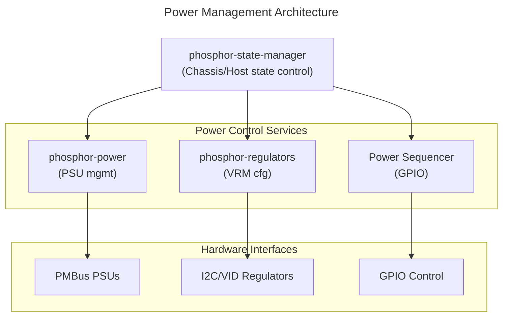

# Power Management Guide
{: .no_toc }

Configure power sequencing, PSU monitoring, and voltage regulators.
{: .fs-6 .fw-300 }

## Table of Contents
{: .no_toc .text-delta }

1. TOC
{:toc}

---

## Overview

OpenBMC power management includes several components:

- **phosphor-power**: PSU management, power supply monitoring
- **phosphor-regulators**: Voltage regulator configuration
- **Power sequencing**: GPIO-based power control
- **Power capping**: System power limiting



<details markdown="1">
<summary>ASCII-art version (for comparison)</summary>

```
┌─────────────────────────────────────────────────────────────────┐
│                   Power Management Architecture                 │
├─────────────────────────────────────────────────────────────────┤
│                                                                 │
│  ┌─────────────────────────────────────────────────────────────┐│
│  │                     phosphor-state-manager                  ││
│  │                (Chassis/Host state control)                 ││
│  └──────────────────────────┬──────────────────────────────────┘│
│                             │                                   │
│        ┌────────────────────┼────────────────────┐              │
│        ▼                    ▼                    ▼              │
│  ┌───────────┐       ┌───────────┐        ┌───────────┐         │
│  │phosphor-  │       │phosphor-  │        │ Power     │         │
│  │power      │       │regulators │        │ Sequencer │         │
│  │(PSU mgmt) │       │(VRM cfg)  │        │ (GPIO)    │         │
│  └─────┬─────┘       └─────┬─────┘        └─────┬─────┘         │
│        │                   │                    │               │
│        ▼                   ▼                    ▼               │
│  ┌───────────┐       ┌───────────┐        ┌───────────┐         │
│  │  PMBus    │       │  I2C/VID  │        │   GPIO    │         │
│  │  PSUs     │       │Regulators │        │  Control  │         │
│  └───────────┘       └───────────┘        └───────────┘         │
└─────────────────────────────────────────────────────────────────┘
```

</details>

---

## Setup & Configuration

### Build-Time Configuration (Yocto)

Include power management components:

```bitbake
# In your machine .conf or image recipe

# Core power management
IMAGE_INSTALL:append = " phosphor-power"

# Include specific components
IMAGE_INSTALL:append = " \
    phosphor-power-psu-monitor \
    phosphor-power-regulators \
    phosphor-power-sequencer \
    phosphor-power-utils \
"

# Exclude components you don't need
IMAGE_INSTALL:remove = "phosphor-power-regulators"
```

### Meson Build Options

```bash
# phosphor-power build options
meson setup build \
    -Dpsu-monitor=enabled \
    -Dregulators=enabled \
    -Dsequencer=enabled \
    -Dutils=enabled \
    -Dtests=disabled
```

| Option | Default | Description |
|--------|---------|-------------|
| `psu-monitor` | enabled | PSU monitoring daemon |
| `regulators` | enabled | Voltage regulator control |
| `sequencer` | enabled | Power sequencing |
| `utils` | enabled | Command-line utilities |

### Runtime Enable/Disable

```bash
# Check power services status
systemctl status phosphor-psu-monitor
systemctl status phosphor-regulators

# Disable PSU monitoring
systemctl stop phosphor-psu-monitor
systemctl disable phosphor-psu-monitor

# Enable regulators service
systemctl enable phosphor-regulators
systemctl start phosphor-regulators
```

### Configuration Files

```bash
# PSU configuration (Entity Manager)
/usr/share/entity-manager/configurations/psu.json

# Regulators configuration
/usr/share/phosphor-regulators/config.json

# Power sequencer configuration
/usr/share/phosphor-power-sequencer/config.json
```

### Power Restore Policy Configuration

```bash
# Get current policy
busctl get-property xyz.openbmc_project.Settings \
    /xyz/openbmc_project/control/host0/power_restore_policy \
    xyz.openbmc_project.Control.Power.RestorePolicy PowerRestorePolicy

# Set policy via D-Bus
# Options: AlwaysOn, AlwaysOff, Restore
busctl set-property xyz.openbmc_project.Settings \
    /xyz/openbmc_project/control/host0/power_restore_policy \
    xyz.openbmc_project.Control.Power.RestorePolicy PowerRestorePolicy s \
    "xyz.openbmc_project.Control.Power.RestorePolicy.Policy.AlwaysOn"

# Configure via Redfish
curl -k -u root:0penBmc -X PATCH \
    -H "Content-Type: application/json" \
    -d '{"PowerRestorePolicy": "AlwaysOn"}' \
    https://localhost/redfish/v1/Systems/system
```

### Power Capping Configuration

```bash
# Enable power capping
busctl set-property xyz.openbmc_project.Settings \
    /xyz/openbmc_project/control/host0/power_cap \
    xyz.openbmc_project.Control.Power.Cap PowerCapEnable b true

# Set power cap value (watts)
busctl set-property xyz.openbmc_project.Settings \
    /xyz/openbmc_project/control/host0/power_cap \
    xyz.openbmc_project.Control.Power.Cap PowerCap u 500

# Via Redfish
curl -k -u root:0penBmc -X PATCH \
    -H "Content-Type: application/json" \
    -d '{"PowerControl":[{"PowerLimit":{"LimitInWatts":500,"LimitException":"LogEventOnly"}}]}' \
    https://localhost/redfish/v1/Chassis/chassis/Power
```

### PSU Redundancy Configuration

```bash
# Get redundancy status
busctl get-property xyz.openbmc_project.Power.PSU \
    /xyz/openbmc_project/control/power_supply_redundancy \
    xyz.openbmc_project.Control.PowerSupplyRedundancy PowerSupplyRedundancyEnabled

# Enable redundancy monitoring
busctl set-property xyz.openbmc_project.Power.PSU \
    /xyz/openbmc_project/control/power_supply_redundancy \
    xyz.openbmc_project.Control.PowerSupplyRedundancy PowerSupplyRedundancyEnabled b true
```

### GPIO Configuration for Power Control

Define GPIO pins in your machine's device tree:

```dts
// Example device tree fragment
gpio-keys {
    compatible = "gpio-keys";

    power-button {
        label = "power-button";
        gpios = <&gpio0 ASPEED_GPIO(E, 0) GPIO_ACTIVE_LOW>;
        linux,code = <KEY_POWER>;
    };

    power-ok {
        label = "power-ok";
        gpios = <&gpio0 ASPEED_GPIO(E, 1) GPIO_ACTIVE_HIGH>;
        linux,code = <KEY_BATTERY>;
    };
};
```

Configure in JSON:

```json
{
    "gpio_configs": [
        {
            "name": "POWER_BUTTON",
            "direction": "out",
            "polarity": "active_low",
            "line": 32
        },
        {
            "name": "POWER_OK",
            "direction": "in",
            "polarity": "active_high",
            "line": 33
        }
    ]
}
```

---

## PSU Management (phosphor-power)

### PSU Monitoring

The `psu-monitor` service monitors PMBus power supplies for:

- Input/output voltage and current
- Temperature
- Fan speed
- Fault conditions

### D-Bus Interface

```bash
# List PSU inventory
busctl tree xyz.openbmc_project.Inventory.Manager | grep powersupply

# Get PSU properties
busctl introspect xyz.openbmc_project.Inventory.Manager \
    /xyz/openbmc_project/inventory/system/chassis/powersupply0

# Check PSU present
busctl get-property xyz.openbmc_project.Inventory.Manager \
    /xyz/openbmc_project/inventory/system/chassis/powersupply0 \
    xyz.openbmc_project.Inventory.Item Present
```

### Entity Manager PSU Configuration

```json
{
    "Name": "PSU0",
    "Type": "Board",
    "Probe": "xyz.openbmc_project.FruDevice({'PRODUCT_PRODUCT_NAME': 'PSU-1000W'})",

    "Exposes": [
        {
            "Name": "PSU0",
            "Type": "pmbus",
            "Bus": 3,
            "Address": "0x58",
            "Labels": [
                "vin",
                "vout1",
                "iout1",
                "pin",
                "pout1",
                "temp1",
                "temp2",
                "fan1"
            ]
        }
    ],

    "xyz.openbmc_project.Inventory.Item": {
        "Present": true,
        "PrettyName": "Power Supply 0"
    },

    "xyz.openbmc_project.Inventory.Decorator.Asset": {
        "Manufacturer": "$PRODUCT_MANUFACTURER",
        "Model": "$PRODUCT_PRODUCT_NAME",
        "SerialNumber": "$PRODUCT_SERIAL_NUMBER"
    }
}
```

### PSU Redundancy

Configure redundancy policy:

```bash
# Get current redundancy mode
busctl get-property xyz.openbmc_project.Power.PSU \
    /xyz/openbmc_project/control/power_supply_redundancy \
    xyz.openbmc_project.Control.PowerSupplyRedundancy PowerSupplyRedundancyEnabled

# Set redundancy mode
busctl set-property xyz.openbmc_project.Power.PSU \
    /xyz/openbmc_project/control/power_supply_redundancy \
    xyz.openbmc_project.Control.PowerSupplyRedundancy PowerSupplyRedundancyEnabled b true
```

---

## Voltage Regulators (phosphor-regulators)

### Overview

phosphor-regulators manages voltage regulators on the system:

- Configuration during power-on
- Voltage level monitoring
- Regulator fault detection

### JSON Configuration

Configuration file: `/usr/share/phosphor-regulators/config.json`

```json
{
    "rules": [
        {
            "id": "set_voltage_rule",
            "actions": [
                {
                    "pmbus_write_vout_command": {
                        "format": "linear",
                        "exponent": -8
                    }
                }
            ]
        }
    ],
    "chassis": [
        {
            "number": 1,
            "inventory_path": "/xyz/openbmc_project/inventory/system/chassis",
            "devices": [
                {
                    "id": "vdd_cpu0",
                    "is_regulator": true,
                    "fru": "/xyz/openbmc_project/inventory/system/chassis/motherboard/cpu0",
                    "i2c_interface": {
                        "bus": 1,
                        "address": "0x40"
                    },
                    "configuration": {
                        "volts": 1.0,
                        "rule_id": "set_voltage_rule"
                    },
                    "rails": [
                        {
                            "id": "vdd_cpu0",
                            "sensor_monitoring": {
                                "rule_id": "read_sensors_rule"
                            }
                        }
                    ]
                }
            ]
        }
    ]
}
```

### Configuration Sections

#### Rules

Reusable actions:

```json
{
    "rules": [
        {
            "id": "read_sensors_rule",
            "actions": [
                {
                    "pmbus_read_sensor": {
                        "type": "vout",
                        "command": "0x8B",
                        "format": "linear_16"
                    }
                },
                {
                    "pmbus_read_sensor": {
                        "type": "iout",
                        "command": "0x8C",
                        "format": "linear_11"
                    }
                },
                {
                    "pmbus_read_sensor": {
                        "type": "temperature",
                        "command": "0x8D",
                        "format": "linear_11"
                    }
                }
            ]
        }
    ]
}
```

#### Devices

Regulator definitions:

```json
{
    "id": "vdd_cpu0",
    "is_regulator": true,
    "fru": "/xyz/openbmc_project/inventory/system/chassis/motherboard/cpu0",
    "i2c_interface": {
        "bus": 1,
        "address": "0x40"
    },
    "presence_detection": {
        "rule_id": "detect_presence_rule"
    },
    "configuration": {
        "volts": 1.0,
        "rule_id": "set_voltage_rule"
    }
}
```

---

## Power Sequencing

### GPIO-Based Sequencing

Power sequencing is typically handled by systemd targets and GPIO control.

#### Device Tree GPIO Configuration

```dts
gpio-keys {
    compatible = "gpio-keys";

    power-good {
        label = "power-good";
        gpios = <&gpio0 ASPEED_GPIO(B, 2) GPIO_ACTIVE_HIGH>;
        linux,code = <KEY_POWER>;
    };
};

leds {
    compatible = "gpio-leds";

    power-button {
        gpios = <&gpio0 ASPEED_GPIO(D, 3) GPIO_ACTIVE_LOW>;
    };
};
```

#### Power Control Service

```ini
# /lib/systemd/system/power-control.service
[Unit]
Description=Power Control
After=xyz.openbmc_project.State.Chassis.service

[Service]
Type=oneshot
ExecStart=/usr/bin/power-control.sh on
RemainAfterExit=yes

[Install]
WantedBy=obmc-host-start@0.target
```

### Power Button Handling

```bash
# Monitor power button
journalctl -u xyz.openbmc_project.Chassis.Buttons -f

# Check button state
busctl introspect xyz.openbmc_project.Chassis.Buttons \
    /xyz/openbmc_project/chassis/buttons/power
```

---

## Power Capping

### Overview

Power capping limits total system power consumption.

### D-Bus Interface

```bash
# Get current power cap
busctl get-property xyz.openbmc_project.Settings \
    /xyz/openbmc_project/control/host0/power_cap \
    xyz.openbmc_project.Control.Power.Cap PowerCap

# Set power cap (watts)
busctl set-property xyz.openbmc_project.Settings \
    /xyz/openbmc_project/control/host0/power_cap \
    xyz.openbmc_project.Control.Power.Cap PowerCap u 500

# Enable power cap
busctl set-property xyz.openbmc_project.Settings \
    /xyz/openbmc_project/control/host0/power_cap \
    xyz.openbmc_project.Control.Power.Cap PowerCapEnable b true
```

### Via Redfish

```bash
# Get power limit
curl -k -u root:0penBmc \
    https://localhost/redfish/v1/Chassis/chassis/Power

# Set power limit
curl -k -u root:0penBmc -X PATCH \
    -H "Content-Type: application/json" \
    -d '{"PowerControl":[{"PowerLimit":{"LimitInWatts":500}}]}' \
    https://localhost/redfish/v1/Chassis/chassis/Power
```

---

## Power Restore Policy

Configure behavior after AC power loss.

```bash
# Get policy
busctl get-property xyz.openbmc_project.Settings \
    /xyz/openbmc_project/control/host0/power_restore_policy \
    xyz.openbmc_project.Control.Power.RestorePolicy PowerRestorePolicy

# Set to AlwaysOn
busctl set-property xyz.openbmc_project.Settings \
    /xyz/openbmc_project/control/host0/power_restore_policy \
    xyz.openbmc_project.Control.Power.RestorePolicy PowerRestorePolicy s \
    "xyz.openbmc_project.Control.Power.RestorePolicy.Policy.AlwaysOn"
```

| Policy | Description |
|--------|-------------|
| `AlwaysOn` | Power on after AC restore |
| `AlwaysOff` | Stay off after AC restore |
| `Restore` | Return to previous state |

---

## PSU Event Monitoring

### SEL Events

PSU events are logged to the System Event Log:

```bash
# View PSU-related events
ipmitool sel list | grep -i power

# Via Redfish
curl -k -u root:0penBmc \
    https://localhost/redfish/v1/Systems/system/LogServices/EventLog/Entries \
    | jq '.Members[] | select(.Message | contains("Power"))'
```

### Threshold Events

Configure PSU sensor thresholds for alerts:

```json
{
    "Exposes": [
        {
            "Name": "PSU0",
            "Type": "pmbus",
            "Bus": 3,
            "Address": "0x58",
            "Thresholds": [
                {
                    "Direction": "greater than",
                    "Label": "temp1",
                    "Name": "upper critical",
                    "Severity": 1,
                    "Value": 100
                },
                {
                    "Direction": "less than",
                    "Label": "vin",
                    "Name": "lower critical",
                    "Severity": 1,
                    "Value": 180
                }
            ]
        }
    ]
}
```

---

## Porting Considerations

### Required Configuration

1. **PSU I2C addresses**: Identify PMBus addresses
2. **GPIO mapping**: Power button, power good signals
3. **Sequencing requirements**: Timing constraints
4. **Redundancy mode**: N+1 or N+N configuration

### Device Tree Example

```dts
&i2c3 {
    status = "okay";

    psu0: psu@58 {
        compatible = "pmbus";
        reg = <0x58>;
    };

    psu1: psu@59 {
        compatible = "pmbus";
        reg = <0x59>;
    };
};
```

### Machine Layer Integration

```bitbake
# In your machine .conf
PREFERRED_PROVIDER_virtual/phosphor-power = "phosphor-power"

# Include power-related packages
IMAGE_INSTALL:append = " \
    phosphor-power \
    phosphor-regulators \
    "
```

---

## Troubleshooting

### PSU Not Detected

```bash
# Check I2C bus
i2cdetect -y 3

# Verify PMBus communication
i2cget -y 3 0x58 0x99 w  # Read MFR_ID

# Check Entity Manager logs
journalctl -u xyz.openbmc_project.EntityManager | grep -i psu
```

### Power On Failure

```bash
# Check power state
obmcutil state

# Check power good GPIO
gpioget gpiochip0 <power-good-pin>

# Check systemd targets
systemctl list-dependencies obmc-host-start@0.target
```

### PSU Fault

```bash
# Check PSU status
busctl get-property xyz.openbmc_project.PSUSensor \
    /xyz/openbmc_project/sensors/power/PSU0_Input_Power \
    xyz.openbmc_project.Sensor.Value Value

# Read PMBus status
i2cget -y 3 0x58 0x79 w  # STATUS_WORD
```

---

## Deep Dive
{: .text-delta }

Advanced implementation details for power management developers.

### PMBus Protocol Overview

PMBus is an I2C-based protocol for power supply communication:

```
┌─────────────────────────────────────────────────────────────────────────┐
│                    PMBus Communication                                  │
├─────────────────────────────────────────────────────────────────────────┤
│                                                                         │
│   BMC                                    PSU (PMBus Device)             │
│    │                                           │                        │
│    │  I2C Write: [Addr] [Cmd] [Data...]        │                        │
│    │──────────────────────────────────────────▶│                        │
│    │                                           │                        │
│    │  I2C Read: [Addr] [Cmd]                   │                        │
│    │──────────────────────────────────────────▶│                        │
│    │◀──────────────────────────────────────────│ [Data...]              │
│    │                                           │                        │
│                                                                         │
│   Common PMBus Commands:                                                │
│   ┌──────────┬────────┬─────────────────────────────────────────────┐   │
│   │ Command  │  Code  │ Description                                 │   │
│   ├──────────┼────────┼─────────────────────────────────────────────┤   │
│   │ PAGE     │  0x00  │ Select output page                          │   │
│   │ OPERATION│  0x01  │ Turn output on/off, margin                  │   │
│   │ ON_OFF   │  0x02  │ Soft on/off control                         │   │
│   │ CLEAR_FAULT│ 0x03 │ Clear all faults                            │   │
│   │ VOUT_MODE│  0x20  │ Voltage output mode/exponent                │   │
│   │ VOUT_CMD │  0x21  │ Commanded output voltage                    │   │
│   │ READ_VIN │  0x88  │ Input voltage                               │   │
│   │ READ_IIN │  0x89  │ Input current                               │   │
│   │ READ_VOUT│  0x8B  │ Output voltage                              │   │
│   │ READ_IOUT│  0x8C  │ Output current                              │   │
│   │ READ_TEMP│  0x8D  │ Temperature (various)                       │   │
│   │ READ_POUT│  0x96  │ Output power                                │   │
│   │ READ_PIN │  0x97  │ Input power                                 │   │
│   │ STATUS_WD│  0x79  │ Status word (all faults summary)            │   │
│   │ MFR_ID   │  0x99  │ Manufacturer ID                             │   │
│   │ MFR_MODEL│  0x9A  │ Manufacturer model                          │   │
│   └──────────┴────────┴─────────────────────────────────────────────┘   │
│                                                                         │
│   Linear11 Format (used for most readings):                             │
│   ┌─────────────────────────────────────────────────────────────────┐   │
│   │ 16-bit value: [YYYYYYYYYY XXXXX]                                │   │
│   │ Y = 11-bit mantissa (two's complement)                          │   │
│   │ X = 5-bit exponent (two's complement)                           │   │
│   │ Real value = Y × 2^X                                            │   │
│   │                                                                 │   │
│   │ Example: 0x0B20 = 0000101 10010 0000                            │   │
│   │   Y = 0x164 = 356, X = 0x00 = 0                                 │   │
│   │   Value = 356 × 2^0 = 356 (e.g., 35.6 Amps with scaling)        │   │
│   └─────────────────────────────────────────────────────────────────┘   │
│                                                                         │
└─────────────────────────────────────────────────────────────────────────┘
```

**Source reference**: [phosphor-power/tools/power-utils](https://github.com/openbmc/phosphor-power)

### Power Sequencing

Power sequencing ensures voltages come up in the correct order:

```
┌─────────────────────────────────────────────────────────────────────────┐
│                    Power Sequencing Timeline                            │
├─────────────────────────────────────────────────────────────────────────┤
│                                                                         │
│   Time ──────────────────────────────────────────────────────────────▶  │
│                                                                         │
│   STDBY_3V3 ─────────────────────────────────────────────────────────   │
│   (always on)                                                           │
│                                                                         │
│   ATX_PS_ON ───────────────────┐                                        │
│                                └─────────────────────────────────────   │
│                                │                                        │
│   P12V_MAIN ───────────────────┼──┐                                     │
│                                   └──────────────────────────────────   │
│                                   │                                     │
│   P3V3_MAIN ──────────────────────┼──┐                                  │
│                                      └───────────────────────────────   │
│                                      │                                  │
│   P1V8      ─────────────────────────┼──┐                               │
│                                         └────────────────────────────   │
│                                         │                               │
│   VCORE     ────────────────────────────┼──┐                            │
│   (VR output)                              └─────────────────────────   │
│                                            │                            │
│   POWER_GOOD ─────────────────────────────────┐                         │
│                                               └──────────────────────   │
│                                                                         │
│   Timing Constraints:                                                   │
│   ├── t1: PS_ON to 12V stable: < 500ms                                  │
│   ├── t2: 12V to 3.3V stable: 1-10ms                                    │
│   ├── t3: 3.3V to VR enable: 5-20ms                                     │
│   ├── t4: VR stable to POWER_GOOD: 10-100ms                             │
│   └── Total sequence time: typically 100-500ms                          │
│                                                                         │
└─────────────────────────────────────────────────────────────────────────┘
```

### Voltage Regulator (VR) Configuration

```
┌─────────────────────────────────────────────────────────────────────────┐
│                    Voltage Regulator Control                            │
├─────────────────────────────────────────────────────────────────────────┤
│                                                                         │
│   phosphor-regulators JSON Configuration:                               │
│   ┌─────────────────────────────────────────────────────────────────┐   │
│   │ {                                                               │   │
│   │   "chassis": [{                                                 │   │
│   │     "number": 1,                                                │   │
│   │     "devices": [{                                               │   │
│   │       "id": "vdd_cpu0",                                         │   │
│   │       "is_regulator": true,                                     │   │
│   │       "fru": "/system/chassis/motherboard/cpu0",                │   │
│   │       "i2c_interface": {                                        │   │
│   │         "bus": 5,                                               │   │
│   │         "address": "0x40"                                       │   │
│   │       },                                                        │   │
│   │       "configuration": {                                        │   │
│   │         "volts": 1.0,                                           │   │
│   │         "rule_id": "set_voltage_rule"                           │   │
│   │       },                                                        │   │
│   │       "rails": [{                                               │   │
│   │         "id": "vdd_cpu0_rail",                                  │   │
│   │         "sensor_monitoring": {                                  │   │
│   │           "rule_id": "read_sensors_rule"                        │   │
│   │         }                                                       │   │
│   │       }]                                                        │   │
│   │     }]                                                          │   │
│   │   }]                                                            │   │
│   │ }                                                               │   │
│   └─────────────────────────────────────────────────────────────────┘   │
│                                                                         │
│   VR Sensor Mapping:                                                    │
│   ┌─────────────────────────────────────────────────────────────────┐   │
│   │ D-Bus Path: /xyz/openbmc_project/sensors/voltage/VDD_CPU0       │   │
│   │ PMBus Cmd: READ_VOUT (0x8B)                                     │   │
│   │ Conversion: Linear16 with VOUT_MODE exponent                    │   │
│   └─────────────────────────────────────────────────────────────────┘   │
│                                                                         │
└─────────────────────────────────────────────────────────────────────────┘
```

### Power Capping Implementation

```
┌─────────────────────────────────────────────────────────────────────────┐
│                    Power Capping (DCMI)                                 │
├─────────────────────────────────────────────────────────────────────────┤
│                                                                         │
│   Power Cap Control Flow:                                               │
│   ┌────────────────┐    ┌────────────────┐    ┌────────────────┐        │
│   │  User sets     │───▶│  BMC enforces  │───▶│  Host CPU      │        │
│   │  power cap     │    │  via DCMI/OOB  │    │  throttles     │        │
│   │  (Redfish/IPMI)│    │                │    │                │        │
│   └────────────────┘    └────────────────┘    └────────────────┘        │
│                                                                         │
│   D-Bus Interface:                                                      │
│   Path: /xyz/openbmc_project/control/host0/power_cap                    │
│   Interface: xyz.openbmc_project.Control.Power.Cap                      │
│   ├── PowerCap (uint32) - Target power in watts                         │
│   ├── PowerCapEnable (bool) - Cap enforcement enabled                   │
│   └── ExceptionAction - Action on cap violation                         │
│                                                                         │
│   Implementation:                                                       │
│   ┌─────────────────────────────────────────────────────────────────┐   │
│   │ 1. Redfish PATCH to /redfish/v1/Chassis/chassis0/Power          │   │
│   │    { "PowerControl": [{ "PowerLimit": {"LimitInWatts": 500}}] } │   │
│   │                                                                 │   │
│   │ 2. bmcweb writes to D-Bus PowerCap property                     │   │
│   │                                                                 │   │
│   │ 3. phosphor-host-ipmid sends DCMI Set Power Limit to host       │   │
│   │                                                                 │   │
│   │ 4. Host BIOS/ME enforces cap via CPU P-state throttling         │   │
│   └─────────────────────────────────────────────────────────────────┘   │
│                                                                         │
└─────────────────────────────────────────────────────────────────────────┘
```

### Source Code Reference

Key implementation files:

| Repository | File/Directory | Description |
|------------|----------------|-------------|
| phosphor-power | `phosphor-power-supply/` | PSU monitoring daemon |
| phosphor-power | `phosphor-regulators/` | Voltage regulator control |
| phosphor-power | `power-sequencer/` | Power sequencing |
| x86-power-control | `src/power_control.cpp` | GPIO power control |
| phosphor-dbus-interfaces | `xyz/openbmc_project/Control/Power/` | Power interfaces |

---

## Examples

Working examples are available in the [examples/power](https://github.com/MichaelTien8901/openbmc-guide-tutorial/tree/master/examples/power) directory:

- `power-config.json` - Power configuration
- `regulators-config.json` - Voltage regulator configuration
- `psu-entity-manager.json` - PSU Entity Manager configuration
- `power-sequencer.sh` - Power sequencing script

---

## References

- [phosphor-power](https://github.com/openbmc/phosphor-power)
- [phosphor-regulators](https://github.com/openbmc/phosphor-regulators)
- [PMBus Specification](https://pmbus.org/)
- [x86-power-control](https://github.com/openbmc/x86-power-control) - Power control implementation for x86 servers
- [State Management Design](https://github.com/openbmc/docs/blob/master/designs/state-management-and-external-interfaces.md)

---

{: .note }
**Tested on**: OpenBMC master, QEMU romulus
