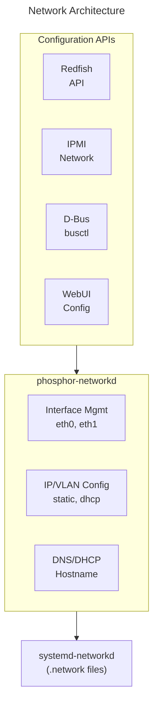
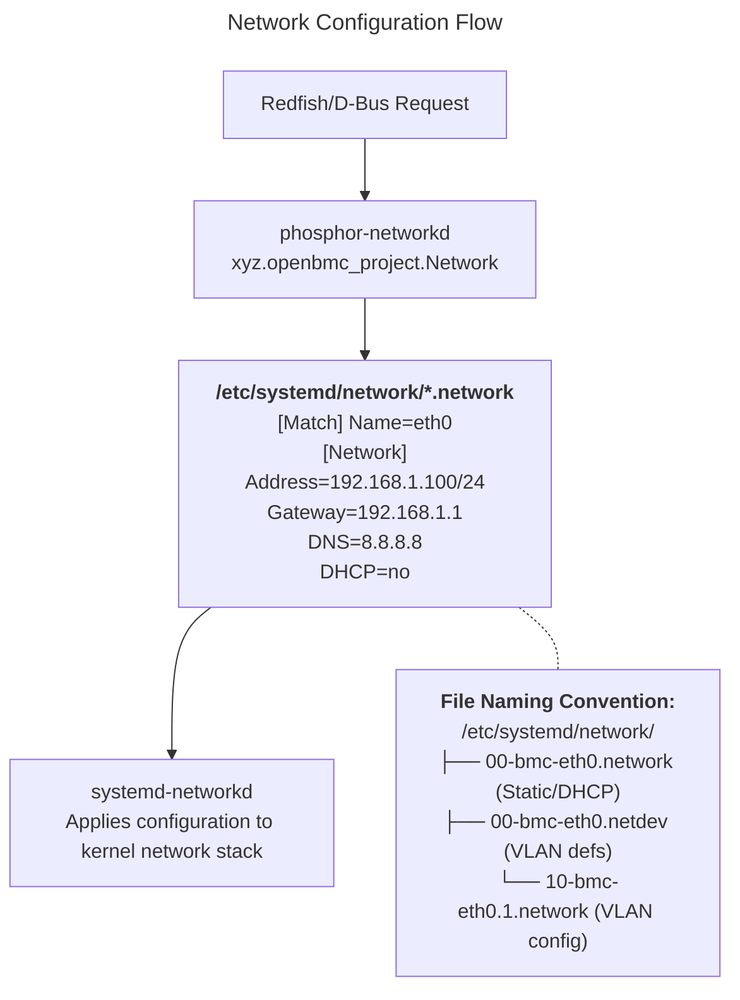
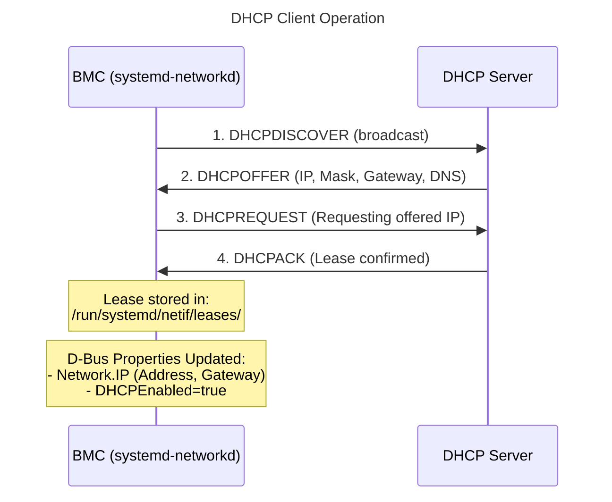
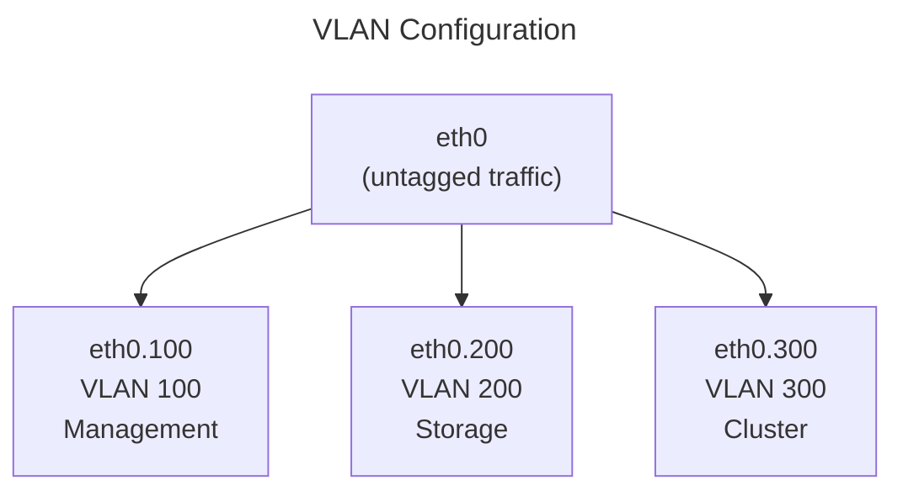
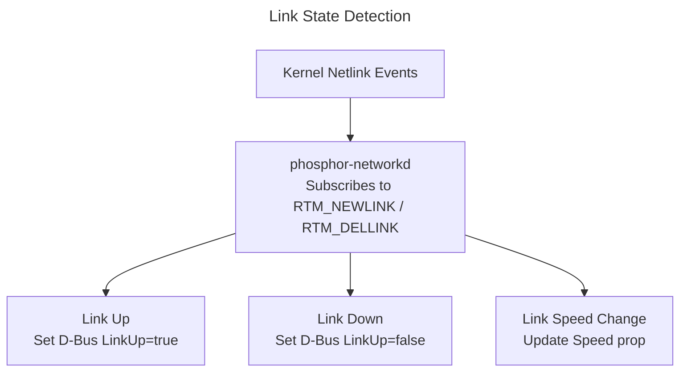

# Network Guide
{: .no_toc }

Configure BMC network settings using phosphor-networkd.
{: .fs-6 .fw-300 }

## Table of Contents
{: .no_toc .text-delta }

1. TOC
{:toc}

---

## Overview

**phosphor-networkd** manages BMC network configuration, providing D-Bus interfaces for IP configuration, VLAN, DNS, and network settings.



<details markdown="1">
<summary>ASCII-art version (for comparison)</summary>

```
┌─────────────────────────────────────────────────────────────────┐
│                   Network Architecture                          │
├─────────────────────────────────────────────────────────────────┤
│                                                                 │
│  ┌─────────────────────────────────────────────────────────────┐│
│  │                    Configuration APIs                       ││
│  │                                                             ││
│  │   ┌──────────┐  ┌──────────┐  ┌──────────┐  ┌──────────┐    ││
│  │   │ Redfish  │  │  IPMI    │  │  D-Bus   │  │  WebUI   │    ││
│  │   │ API      │  │ Network  │  │ busctl   │  │  Config  │    ││
│  │   └────┬─────┘  └────┬─────┘  └────┬─────┘  └────┬─────┘    ││
│  └────────┼─────────────┼─────────────┼─────────────┼──────────┘│
│           └─────────────┴──────┬──────┴─────────────┘           │
│                                │                                │
│  ┌─────────────────────────────┴───────────────────────────────┐│
│  │                   phosphor-networkd                         ││
│  │                                                             ││
│  │   ┌────────────────┐  ┌────────────────┐  ┌──────────────┐  ││
│  │   │ Interface Mgmt │  │ IP/VLAN Config │  │ DNS/DHCP     │  ││
│  │   │ eth0, eth1     │  │ static, dhcp   │  │ Hostname     │  ││
│  │   └────────────────┘  └────────────────┘  └──────────────┘  ││
│  └──────────────────────────┬──────────────────────────────────┘│
│                             │                                   │
│  ┌──────────────────────────┴──────────────────────────────────┐│
│  │                    systemd-networkd                         ││
│  │                  (.network files)                           ││
│  └─────────────────────────────────────────────────────────────┘│
└─────────────────────────────────────────────────────────────────┘
```

</details>

---

## Setup & Configuration

### Build-Time Configuration (Yocto)

```bitbake
# In your machine .conf or local.conf

# Include network management
IMAGE_INSTALL:append = " \
    phosphor-network \
"

# Configure Meson options
EXTRA_OEMESON:pn-phosphor-network = " \
    -Ddefault-link-local-autoconf=true \
    -Ddefault-ipv6-accept-ra=true \
"
```

### Meson Build Options

| Option | Default | Description |
|--------|---------|-------------|
| `default-link-local-autoconf` | true | Enable link-local IPv4 |
| `default-ipv6-accept-ra` | true | Accept IPv6 router advertisements |
| `sync-mac` | true | Sync MAC with hardware |
| `persist-mac` | false | Persist MAC across reboots |

### Configuration Files

phosphor-networkd translates D-Bus settings to systemd-networkd `.network` files.
Runtime configuration is persisted automatically. To bake default settings into
the image, deploy `.network` files via Yocto.

| Config File | Path | Description |
|-------------|------|-------------|
| Network config | `/etc/systemd/network/00-bmc-eth0.network` | Main BMC interface (DHCP or static) |
| VLAN netdev | `/etc/systemd/network/00-bmc-eth0.100.netdev` | VLAN device definition |
| VLAN config | `/etc/systemd/network/10-bmc-eth0.100.network` | VLAN interface config |
| Resolved config | `/etc/systemd/resolved.conf` | DNS resolver settings |

### Deploying Default Network Configuration via Yocto

To bake a default static IP or DHCP configuration into the image:

```bash
# meta-myplatform/recipes-phosphor/network/phosphor-network/
# └── files/
# │   └── 00-bmc-eth0.network
# └── phosphor-network_%.bbappend

cat > phosphor-network_%.bbappend << 'EOF'
FILESEXTRAPATHS:prepend := "${THISDIR}/files:"
SRC_URI += "file://00-bmc-eth0.network"

do_install:append() {
    install -d ${D}${sysconfdir}/systemd/network
    install -m 0644 ${WORKDIR}/00-bmc-eth0.network \
        ${D}${sysconfdir}/systemd/network/
}
EOF
```

Example `00-bmc-eth0.network` for DHCP:

```ini
[Match]
Name=eth0

[Network]
DHCP=ipv4
LinkLocalAddressing=yes
IPv6AcceptRA=true
```

Example for static IP:

```ini
[Match]
Name=eth0

[Network]
Address=192.168.1.100/24
Gateway=192.168.1.1
DNS=8.8.8.8
DNS=8.8.4.4
LinkLocalAddressing=no
```

{: .note }
Runtime changes via Redfish or D-Bus will overwrite these files. The Yocto-deployed
file serves as the factory default. After a factory reset (`/usr/share/phosphor-bmc-code-mgmt/scripts/factory-reset.sh`),
the image-baked config is restored.

### Runtime Configuration

```bash
# Check network service
systemctl status systemd-networkd
systemctl status phosphor-network

# View network configuration files
ls /etc/systemd/network/

# View current network state
networkctl status

# View active config for eth0
cat /etc/systemd/network/00-bmc-eth0.network
```

---

## IP Address Configuration

### View Current Configuration

```bash
# Via D-Bus
busctl tree xyz.openbmc_project.Network

# Get interface info
busctl introspect xyz.openbmc_project.Network \
    /xyz/openbmc_project/network/eth0

# Via ip command
ip addr show eth0
```

### Via Redfish

```bash
# Get ethernet interfaces
curl -k -u root:0penBmc \
    https://localhost/redfish/v1/Managers/bmc/EthernetInterfaces

# Get specific interface
curl -k -u root:0penBmc \
    https://localhost/redfish/v1/Managers/bmc/EthernetInterfaces/eth0
```

### Configure Static IP

```bash
# Via Redfish
curl -k -u root:0penBmc -X PATCH \
    -H "Content-Type: application/json" \
    -d '{
        "IPv4Addresses": [
            {
                "Address": "192.168.1.100",
                "SubnetMask": "255.255.255.0",
                "Gateway": "192.168.1.1",
                "AddressOrigin": "Static"
            }
        ]
    }' \
    https://localhost/redfish/v1/Managers/bmc/EthernetInterfaces/eth0

# Via D-Bus
busctl call xyz.openbmc_project.Network \
    /xyz/openbmc_project/network/eth0 \
    xyz.openbmc_project.Network.IP.Create \
    IP ssys \
    "xyz.openbmc_project.Network.IP.Protocol.IPv4" \
    "192.168.1.100" \
    24 \
    "192.168.1.1"
```

### Configure DHCP

```bash
# Enable DHCP via Redfish
curl -k -u root:0penBmc -X PATCH \
    -H "Content-Type: application/json" \
    -d '{"DHCPv4": {"DHCPEnabled": true}}' \
    https://localhost/redfish/v1/Managers/bmc/EthernetInterfaces/eth0

# Via D-Bus
busctl set-property xyz.openbmc_project.Network \
    /xyz/openbmc_project/network/eth0 \
    xyz.openbmc_project.Network.EthernetInterface \
    DHCPEnabled s "xyz.openbmc_project.Network.EthernetInterface.DHCPConf.v4"
```

### Delete IP Address

```bash
# Get IP address object path
busctl tree xyz.openbmc_project.Network | grep ipv4

# Delete via D-Bus
busctl call xyz.openbmc_project.Network \
    /xyz/openbmc_project/network/eth0/ipv4/abc123 \
    xyz.openbmc_project.Object.Delete \
    Delete
```

---

## IPv6 Configuration

### Enable IPv6

```bash
# Configure IPv6 static address
curl -k -u root:0penBmc -X PATCH \
    -H "Content-Type: application/json" \
    -d '{
        "IPv6Addresses": [
            {
                "Address": "2001:db8::100",
                "PrefixLength": 64,
                "AddressOrigin": "Static"
            }
        ]
    }' \
    https://localhost/redfish/v1/Managers/bmc/EthernetInterfaces/eth0
```

### Enable SLAAC

```bash
# Enable IPv6 router advertisement
curl -k -u root:0penBmc -X PATCH \
    -H "Content-Type: application/json" \
    -d '{"IPv6StaticAddresses": [], "StatelessAddressAutoConfig": {"IPv6AutoConfigEnabled": true}}' \
    https://localhost/redfish/v1/Managers/bmc/EthernetInterfaces/eth0
```

---

## VLAN Configuration

### Create VLAN

```bash
# Via Redfish
curl -k -u root:0penBmc -X POST \
    -H "Content-Type: application/json" \
    -d '{
        "VLANEnable": true,
        "VLANId": 100
    }' \
    https://localhost/redfish/v1/Managers/bmc/EthernetInterfaces/eth0/VLANs

# Via D-Bus
busctl call xyz.openbmc_project.Network \
    /xyz/openbmc_project/network \
    xyz.openbmc_project.Network.VLAN.Create \
    VLAN su "eth0" 100
```

### Configure VLAN IP

```bash
# Configure IP on VLAN interface
curl -k -u root:0penBmc -X PATCH \
    -H "Content-Type: application/json" \
    -d '{
        "IPv4Addresses": [
            {
                "Address": "10.0.100.10",
                "SubnetMask": "255.255.255.0",
                "Gateway": "10.0.100.1",
                "AddressOrigin": "Static"
            }
        ]
    }' \
    https://localhost/redfish/v1/Managers/bmc/EthernetInterfaces/eth0_100
```

### Delete VLAN

```bash
curl -k -u root:0penBmc -X DELETE \
    https://localhost/redfish/v1/Managers/bmc/EthernetInterfaces/eth0_100
```

---

## DNS Configuration

### Configure DNS Servers

```bash
# Via Redfish
curl -k -u root:0penBmc -X PATCH \
    -H "Content-Type: application/json" \
    -d '{
        "StaticNameServers": ["8.8.8.8", "8.8.4.4"]
    }' \
    https://localhost/redfish/v1/Managers/bmc/EthernetInterfaces/eth0

# Via D-Bus
busctl set-property xyz.openbmc_project.Network \
    /xyz/openbmc_project/network/eth0 \
    xyz.openbmc_project.Network.EthernetInterface \
    StaticNameServers as 2 "8.8.8.8" "8.8.4.4"
```

### View DNS Configuration

```bash
# Check current DNS
cat /etc/resolv.conf

# Via D-Bus
busctl get-property xyz.openbmc_project.Network \
    /xyz/openbmc_project/network/eth0 \
    xyz.openbmc_project.Network.EthernetInterface \
    Nameservers
```

---

## Hostname Configuration

### Set Hostname

```bash
# Via Redfish
curl -k -u root:0penBmc -X PATCH \
    -H "Content-Type: application/json" \
    -d '{"HostName": "my-bmc"}' \
    https://localhost/redfish/v1/Managers/bmc/NetworkProtocol

# Via D-Bus
busctl set-property xyz.openbmc_project.Network \
    /xyz/openbmc_project/network/config \
    xyz.openbmc_project.Network.SystemConfiguration \
    HostName s "my-bmc"
```

### Set Domain Name

```bash
busctl set-property xyz.openbmc_project.Network \
    /xyz/openbmc_project/network/config \
    xyz.openbmc_project.Network.SystemConfiguration \
    DefaultGateway s "192.168.1.1"
```

---

## MAC Address Configuration

### View MAC Address

```bash
# Via ip command
ip link show eth0

# Via D-Bus
busctl get-property xyz.openbmc_project.Network \
    /xyz/openbmc_project/network/eth0 \
    xyz.openbmc_project.Network.MACAddress \
    MACAddress
```

### Set MAC Address

```bash
# Via Redfish
curl -k -u root:0penBmc -X PATCH \
    -H "Content-Type: application/json" \
    -d '{"MACAddress": "AA:BB:CC:DD:EE:FF"}' \
    https://localhost/redfish/v1/Managers/bmc/EthernetInterfaces/eth0
```

---

## Network Protocol Configuration

### Enable/Disable Protocols

```bash
# Configure network protocols
curl -k -u root:0penBmc -X PATCH \
    -H "Content-Type: application/json" \
    -d '{
        "HTTPS": {"ProtocolEnabled": true, "Port": 443},
        "SSH": {"ProtocolEnabled": true, "Port": 22},
        "IPMI": {"ProtocolEnabled": true, "Port": 623}
    }' \
    https://localhost/redfish/v1/Managers/bmc/NetworkProtocol
```

---

## IPMI LAN Configuration

### View LAN Configuration

```bash
ipmitool lan print
```

### Configure LAN Channel

```bash
# Set static IP
ipmitool lan set 1 ipsrc static
ipmitool lan set 1 ipaddr 192.168.1.100
ipmitool lan set 1 netmask 255.255.255.0
ipmitool lan set 1 defgw ipaddr 192.168.1.1

# Enable DHCP
ipmitool lan set 1 ipsrc dhcp
```

---

## Troubleshooting

### No Network Connectivity

```bash
# Check interface status
ip link show eth0
networkctl status eth0

# Check for IP address
ip addr show eth0

# Check routing table
ip route

# Ping gateway
ping -c 3 192.168.1.1
```

### DHCP Not Working

```bash
# Check DHCP client
journalctl -u systemd-networkd | grep DHCP

# Force DHCP renewal
networkctl renew eth0
```

### DNS Resolution Issues

```bash
# Check DNS configuration
cat /etc/resolv.conf

# Test DNS resolution
nslookup example.com
```

### Configuration Not Persisting

```bash
# Check network configuration files
ls -la /etc/systemd/network/

# Verify phosphor-network service
systemctl status phosphor-network

# Check for errors
journalctl -u phosphor-network
```

---

## Configuration Persistence

Network configuration is stored in:

```bash
# systemd-networkd files
/etc/systemd/network/00-bmc-eth0.network

# Example content:
[Match]
Name=eth0

[Network]
Address=192.168.1.100/24
Gateway=192.168.1.1
DNS=8.8.8.8
```

---

## Deep Dive
{: .text-delta }

Advanced implementation details for network configuration developers.

### systemd-networkd Integration

phosphor-networkd translates D-Bus calls to systemd-networkd configuration:



<details markdown="1">
<summary>ASCII-art version (for comparison)</summary>

```
┌─────────────────────────────────────────────────────────────────────────┐
│                    Network Configuration Flow                           │
├─────────────────────────────────────────────────────────────────────────┤
│                                                                         │
│   Redfish/D-Bus Request                                                 │
│          │                                                              │
│          ▼                                                              │
│   ┌─────────────────────────────────────────────────────────────────┐   │
│   │                    phosphor-networkd                            │   │
│   │   xyz.openbmc_project.Network                                   │   │
│   └────────────────────────────┬────────────────────────────────────┘   │
│                                │                                        │
│                                ▼                                        │
│   ┌─────────────────────────────────────────────────────────────────┐   │
│   │               /etc/systemd/network/*.network                    │   │
│   │                                                                 │   │
│   │   [Match]                                                       │   │
│   │   Name=eth0                                                     │   │
│   │                                                                 │   │
│   │   [Network]                                                     │   │
│   │   Address=192.168.1.100/24                                      │   │
│   │   Gateway=192.168.1.1                                           │   │
│   │   DNS=8.8.8.8                                                   │   │
│   │   DHCP=no                                                       │   │
│   └────────────────────────────┬────────────────────────────────────┘   │
│                                │                                        │
│                                ▼                                        │
│   ┌─────────────────────────────────────────────────────────────────┐   │
│   │                    systemd-networkd                             │   │
│   │   Applies configuration to kernel network stack                 │   │
│   └─────────────────────────────────────────────────────────────────┘   │
│                                                                         │
│   File Naming Convention:                                               │
│   /etc/systemd/network/                                                 │
│   ├── 00-bmc-eth0.network      ← Static/DHCP config                     │
│   ├── 00-bmc-eth0.netdev       ← VLAN definitions                       │
│   └── 10-bmc-eth0.1.network    ← VLAN interface config                  │
│                                                                         │
└─────────────────────────────────────────────────────────────────────────┘
```

</details>

### DHCP Transaction Flow



**DHCP Options Handled:**
- Option 1: Subnet Mask
- Option 3: Router (Gateway)
- Option 6: DNS Servers
- Option 12: Hostname
- Option 15: Domain Name
- Option 42: NTP Servers

<details markdown="1">
<summary>ASCII-art version (for comparison)</summary>

```
┌─────────────────────────────────────────────────────────────────────────┐
│                    DHCP Client Operation                                │
├─────────────────────────────────────────────────────────────────────────┤
│                                                                         │
│   BMC (systemd-networkd)              DHCP Server                       │
│          │                                  │                           │
│          │  1. DHCPDISCOVER (broadcast)     │                           │
│          │─────────────────────────────────▶│                           │
│          │                                  │                           │
│          │  2. DHCPOFFER                    │                           │
│          │◀─────────────────────────────────│ IP, Mask, Gateway, DNS    │
│          │                                  │                           │
│          │  3. DHCPREQUEST                  │                           │
│          │─────────────────────────────────▶│ Requesting offered IP     │
│          │                                  │                           │
│          │  4. DHCPACK                      │                           │
│          │◀─────────────────────────────────│ Lease confirmed           │
│          │                                  │                           │
│                                                                         │
│   Lease stored in: /run/systemd/netif/leases/                           │
│                                                                         │
│   D-Bus Properties Updated:                                             │
│   ├── xyz.openbmc_project.Network.IP                                    │
│   │   └── Address, PrefixLength, Gateway, Origin=DHCP                   │
│   └── xyz.openbmc_project.Network.EthernetInterface                     │
│       └── DHCPEnabled=true                                              │
│                                                                         │
│   DHCP Options Handled:                                                 │
│   ├── Option 1: Subnet Mask                                             │
│   ├── Option 3: Router (Gateway)                                        │
│   ├── Option 6: DNS Servers                                             │
│   ├── Option 12: Hostname                                               │
│   ├── Option 15: Domain Name                                            │
│   └── Option 42: NTP Servers                                            │
│                                                                         │
└─────────────────────────────────────────────────────────────────────────┘
```

</details>

### VLAN Implementation



**VLAN .netdev file** (`/etc/systemd/network/00-eth0.100.netdev`):
```ini
[NetDev]
Name=eth0.100
Kind=vlan

[VLAN]
Id=100
```

**D-Bus VLAN Creation:**
```bash
busctl call xyz.openbmc_project.Network \
    /xyz/openbmc_project/network/eth0 \
    xyz.openbmc_project.Network.VLAN.Create \
    VLAN sq "eth0.100" 100
```

<details markdown="1">
<summary>ASCII-art version (for comparison)</summary>

```
┌─────────────────────────────────────────────────────────────────────────┐
│                    VLAN Configuration                                   │
├─────────────────────────────────────────────────────────────────────────┤
│                                                                         │
│   Physical Interface                                                    │
│   ┌─────────────────────────────────────────────────────────────────┐   │
│   │                          eth0                                   │   │
│   │                      (untagged traffic)                         │   │
│   └───────────────────────────┬─────────────────────────────────────┘   │
│                               │                                         │
│          ┌────────────────────┼────────────────────┐                    │
│          │                    │                    │                    │
│          ▼                    ▼                    ▼                    │
│   ┌────────────┐       ┌────────────┐       ┌────────────┐              │
│   │ eth0.100   │       │ eth0.200   │       │ eth0.300   │              │
│   │ VLAN 100   │       │ VLAN 200   │       │ VLAN 300   │              │
│   │ Management │       │ Storage    │       │ Cluster    │              │
│   └────────────┘       └────────────┘       └────────────┘              │
│                                                                         │
│   VLAN .netdev file (/etc/systemd/network/00-eth0.100.netdev):          │
│   ┌─────────────────────────────────────────────────────────────────┐   │
│   │ [NetDev]                                                        │   │
│   │ Name=eth0.100                                                   │   │
│   │ Kind=vlan                                                       │   │
│   │                                                                 │   │
│   │ [VLAN]                                                          │   │
│   │ Id=100                                                          │   │
│   └─────────────────────────────────────────────────────────────────┘   │
│                                                                         │
│   D-Bus VLAN Creation:                                                  │
│   busctl call xyz.openbmc_project.Network \                             │
│       /xyz/openbmc_project/network/eth0 \                               │
│       xyz.openbmc_project.Network.VLAN.Create \                         │
│       VLAN sq "eth0.100" 100                                            │
│                                                                         │
└─────────────────────────────────────────────────────────────────────────┘
```

</details>

### Link State Monitoring



**D-Bus Properties** (`/xyz/openbmc_project/network/eth0`):
- `LinkUp` (bool) - Physical link state
- `Speed` (uint32) - Link speed in Mbps
- `AutoNeg` (bool) - Auto-negotiation enabled
- `MTU` (uint32) - Maximum transmission unit

**Redfish Mapping:**
- `LinkUp` → `LinkStatus` ("LinkUp" / "LinkDown")
- `Speed` → `SpeedMbps`
- `AutoNeg` → `AutoNeg`

<details markdown="1">
<summary>ASCII-art version (for comparison)</summary>

```
┌─────────────────────────────────────────────────────────────────────────┐
│                    Link State Detection                                 │
├─────────────────────────────────────────────────────────────────────────┤
│                                                                         │
│   Kernel Netlink Events                                                 │
│          │                                                              │
│          ▼                                                              │
│   ┌─────────────────────────────────────────────────────────────────┐   │
│   │                    phosphor-networkd                            │   │
│   │   Subscribes to RTM_NEWLINK / RTM_DELLINK                       │   │
│   └────────────────────────────┬────────────────────────────────────┘   │
│                                │                                        │
│          ┌─────────────────────┼─────────────────────┐                  │
│          │                     │                     │                  │
│          ▼                     ▼                     ▼                  │
│   Link Up              Link Down             Link Speed Change          │
│   ┌────────────┐       ┌────────────┐       ┌────────────┐              │
│   │ Set D-Bus  │       │ Set D-Bus  │       │ Update     │              │
│   │ LinkUp=true│       │ LinkUp=    │       │ Speed prop │              │
│   │            │       │    false   │       │            │              │
│   └────────────┘       └────────────┘       └────────────┘              │
│                                                                         │
│   D-Bus Properties:                                                     │
│   /xyz/openbmc_project/network/eth0                                     │
│   ├── LinkUp (bool) - Physical link state                               │
│   ├── Speed (uint32) - Link speed in Mbps                               │
│   ├── AutoNeg (bool) - Auto-negotiation enabled                         │
│   └── MTU (uint32) - Maximum transmission unit                          │
│                                                                         │
│   Redfish Mapping:                                                      │
│   ├── LinkUp → LinkStatus ("LinkUp" / "LinkDown")                       │
│   ├── Speed → SpeedMbps                                                 │
│   └── AutoNeg → AutoNeg                                                 │
│                                                                         │
└─────────────────────────────────────────────────────────────────────────┘
```

</details>

### Source Code Reference

Key implementation files in [phosphor-networkd](https://github.com/openbmc/phosphor-networkd):

| File | Description |
|------|-------------|
| `src/network_manager.cpp` | Main network manager |
| `src/ethernet_interface.cpp` | Ethernet interface handling |
| `src/ipaddress.cpp` | IP address management |
| `src/vlan_interface.cpp` | VLAN interface creation |
| `src/dhcp_configuration.cpp` | DHCP client configuration |
| `src/dns_updater.cpp` | DNS resolver updates |

---

## Examples

Working examples are available in the [examples/network](https://github.com/MichaelTien8901/openbmc-guide-tutorial/tree/master/docs/examples/network) directory:

- `network-config.sh` - Network configuration script
- `vlan-setup.sh` - VLAN configuration script

---

## References

- [phosphor-networkd](https://github.com/openbmc/phosphor-networkd)
- [systemd-networkd](https://www.freedesktop.org/software/systemd/man/systemd-networkd.html)
- [Redfish EthernetInterface](https://redfish.dmtf.org/schemas/EthernetInterface.v1_8_0.json)

---

{: .note }
**Tested on**: OpenBMC master, QEMU romulus
