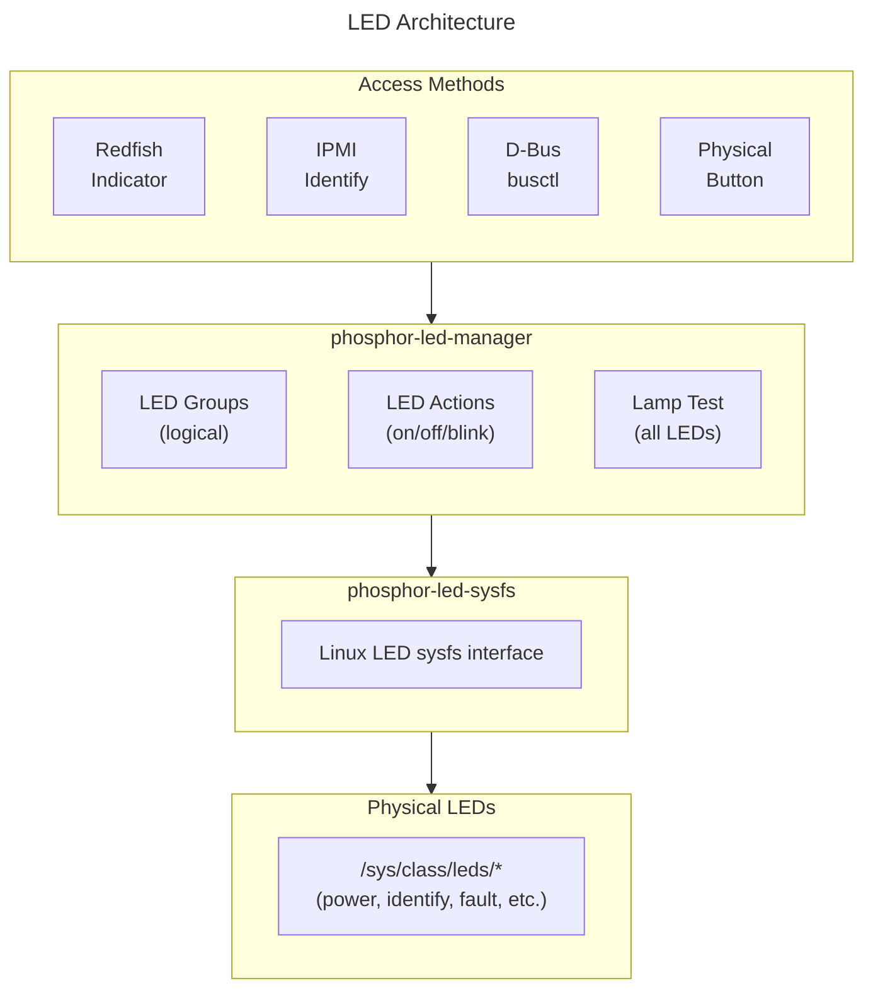

# LED Manager Guide
{: .no_toc }

Configure and control LEDs on OpenBMC.
{: .fs-6 .fw-300 }

## Table of Contents
{: .no_toc .text-delta }

1. TOC
{:toc}

---

## Overview

**phosphor-led-manager** provides LED control and group management, supporting identify, fault, and status LEDs through D-Bus interfaces.



<details markdown="1">
<summary>ASCII-art version (for comparison)</summary>

```
┌─────────────────────────────────────────────────────────────────┐
│                     LED Architecture                            │
├─────────────────────────────────────────────────────────────────┤
│                                                                 │
│  ┌─────────────────────────────────────────────────────────────┐│
│  │                    Access Methods                           ││
│  │                                                             ││
│  │   ┌──────────┐  ┌──────────┐  ┌──────────┐  ┌──────────┐    ││
│  │   │ Redfish  │  │  IPMI    │  │  D-Bus   │  │Physical  │    ││
│  │   │ Indicator│  │ Identify │  │ busctl   │  │ Button   │    ││
│  │   └────┬─────┘  └────┬─────┘  └────┬─────┘  └────┬─────┘    ││
│  └────────┼─────────────┼─────────────┼─────────────┼──────────┘│
│           └─────────────┴──────┬──────┴─────────────┘           │
│                                │                                │
│  ┌─────────────────────────────┴───────────────────────────────┐│
│  │                  phosphor-led-manager                       ││
│  │                                                             ││
│  │   ┌────────────────┐  ┌────────────────┐  ┌──────────────┐  ││
│  │   │   LED Groups   │  │  LED Actions   │  │  Lamp Test   │  ││
│  │   │ (logical)      │  │ (on/off/blink) │  │  (all LEDs)  │  ││
│  │   └────────────────┘  └────────────────┘  └──────────────┘  ││
│  └──────────────────────────┬──────────────────────────────────┘│
│                             │                                   │
│  ┌──────────────────────────┴──────────────────────────────────┐│
│  │                  phosphor-led-sysfs                         ││
│  │              (Linux LED sysfs interface)                    ││
│  └──────────────────────────┬──────────────────────────────────┘│
│                             │                                   │
│  ┌──────────────────────────┴──────────────────────────────────┐│
│  │                    Physical LEDs                            ││
│  │      /sys/class/leds/* (power, identify, fault, etc.)       ││
│  └─────────────────────────────────────────────────────────────┘│
└─────────────────────────────────────────────────────────────────┘
```

</details>

---

## Setup & Configuration

### Build-Time Configuration (Yocto)

```bitbake
# In your machine .conf or local.conf

# Include LED management
IMAGE_INSTALL:append = " \
    phosphor-led-manager \
    phosphor-led-sysfs \
"

# LED group configuration (JSON or YAML)
LED_MANAGER_LED_CONFIG = "led.yaml"
```

### Configuration Files and Paths

| Config File | Install Path | Format | Description |
|-------------|-------------|--------|-------------|
| LED groups (YAML) | `/usr/share/phosphor-led-manager/led.yaml` | YAML | Legacy: compiled into C++ at build time |
| LED groups (JSON) | `/usr/share/phosphor-led-manager/led.json` | JSON | Preferred: runtime-parsed at service startup |
| Entity Manager | `/usr/share/entity-manager/configurations/*.json` | EM JSON | Alternative: define LEDs via Entity Manager |

### Two Configuration Methods

phosphor-led-manager supports two approaches:

| | YAML Config (build-time) | JSON Config (runtime) |
|---|---|---|
| Config path | `/usr/share/phosphor-led-manager/led.yaml` | `/usr/share/phosphor-led-manager/led.json` |
| When parsed | At meson build time (generates C++ constexpr) | At service startup (runtime parsing) |
| Edit cycle | Rebuild image for changes | Replace file and restart service |
| Meson option | Default | `-Duse-json=enabled` |
| Recommended for | Production (smaller binary) | Development and rapid iteration |

### JSON Configuration (preferred for development)

```json
{
    "leds": [
        {
            "group": "/xyz/openbmc_project/led/groups/enclosure_identify",
            "members": [
                {
                    "name": "identify",
                    "action": "Blink",
                    "dutyOn": 50,
                    "period": 1000
                }
            ]
        },
        {
            "group": "/xyz/openbmc_project/led/groups/power_fault",
            "members": [
                {
                    "name": "power",
                    "action": "On",
                    "dutyOn": 100,
                    "period": 0
                }
            ]
        }
    ]
}
```

### YAML Configuration (legacy)

```yaml
# led.yaml - compiled into C++ at build time
bmc_booted:
    enclosure_identify:
        Action: 'Off'
        DutyOn: 50
        Period: 0

enclosure_identify:
    enclosure_identify:
        Action: 'Blink'
        DutyOn: 50
        Period: 1000

fault:
    power:
        Action: 'On'
        DutyOn: 100
        Period: 0
```

### Deploying LED Configuration via Yocto

#### Method 1: JSON Config (runtime)

```bash
# meta-myplatform/recipes-phosphor/leds/phosphor-led-manager/
# └── files/
# │   └── led.json
# └── phosphor-led-manager_%.bbappend

cat > phosphor-led-manager_%.bbappend << 'EOF'
FILESEXTRAPATHS:prepend := "${THISDIR}/files:"
SRC_URI += "file://led.json"

# Enable JSON parsing (instead of compiled YAML)
EXTRA_OEMESON:append = " -Duse-json=enabled"

do_install:append() {
    install -d ${D}${datadir}/phosphor-led-manager
    install -m 0644 ${WORKDIR}/led.json \
        ${D}${datadir}/phosphor-led-manager/
}
EOF
```

#### Method 2: YAML Config (build-time)

```bash
# meta-myplatform/recipes-phosphor/leds/phosphor-led-manager/
# └── files/
# │   └── led.yaml
# └── phosphor-led-manager_%.bbappend

cat > phosphor-led-manager_%.bbappend << 'EOF'
FILESEXTRAPATHS:prepend := "${THISDIR}/files:"
SRC_URI += "file://led.yaml"

# Tell the build system where to find your YAML
LED_MANAGER_LED_CONFIG = "${WORKDIR}/led.yaml"
EOF
```

### Verification

```bash
# Check LED manager service
systemctl status phosphor-led-manager

# View available physical LEDs
ls /sys/class/leds/

# Check LED D-Bus groups
busctl tree xyz.openbmc_project.LED.GroupManager

# Verify a specific group is defined
busctl introspect xyz.openbmc_project.LED.GroupManager \
    /xyz/openbmc_project/led/groups/enclosure_identify
```

---

## LED Actions

### Action Types

| Action | Description | Parameters |
|--------|-------------|------------|
| Off | LED off | None |
| On | LED on | None |
| Blink | Blinking | DutyOn (%), Period (ms) |

### Control LEDs via D-Bus

```bash
# Turn on identify LED
busctl set-property xyz.openbmc_project.LED.GroupManager \
    /xyz/openbmc_project/led/groups/enclosure_identify \
    xyz.openbmc_project.Led.Group \
    Asserted b true

# Turn off identify LED
busctl set-property xyz.openbmc_project.LED.GroupManager \
    /xyz/openbmc_project/led/groups/enclosure_identify \
    xyz.openbmc_project.Led.Group \
    Asserted b false
```

### Control via Redfish

```bash
# Get chassis indicator
curl -k -u root:0penBmc \
    https://localhost/redfish/v1/Chassis/chassis

# Turn on identify LED
curl -k -u root:0penBmc -X PATCH \
    -H "Content-Type: application/json" \
    -d '{"LocationIndicatorActive": true}' \
    https://localhost/redfish/v1/Chassis/chassis

# Turn off identify LED
curl -k -u root:0penBmc -X PATCH \
    -H "Content-Type: application/json" \
    -d '{"LocationIndicatorActive": false}' \
    https://localhost/redfish/v1/Chassis/chassis
```

### Control via IPMI

```bash
# Chassis identify on (continuous)
ipmitool -I lanplus -H bmc-ip -U root -P 0penBmc chassis identify

# Chassis identify on (15 seconds)
ipmitool -I lanplus -H bmc-ip -U root -P 0penBmc chassis identify 15

# Chassis identify off
ipmitool -I lanplus -H bmc-ip -U root -P 0penBmc chassis identify 0
```

---

## LED Groups

### Standard Groups

| Group | Purpose | Trigger |
|-------|---------|---------|
| `enclosure_identify` | Locate chassis | User request |
| `power_fault` | Power problem | PSU fault |
| `bmc_booted` | BMC ready | Boot complete |
| `cpu_fault` | CPU error | Hardware error |
| `memory_fault` | Memory error | DIMM fault |

### Create Custom Group

```yaml
# In led.yaml
my_custom_group:
    custom_led:
        Action: 'Blink'
        DutyOn: 50
        Period: 500
```

### Group Priorities

When multiple groups control the same LED, priority determines the action:

```yaml
# Higher priority takes precedence
# Priority: Blink > On > Off
```

---

## Lamp Test

Lamp test activates all LEDs to verify functionality.

### Trigger Lamp Test via D-Bus

```bash
# Start lamp test
busctl set-property xyz.openbmc_project.LED.GroupManager \
    /xyz/openbmc_project/led/groups/lamp_test \
    xyz.openbmc_project.Led.Group \
    Asserted b true

# Stop lamp test
busctl set-property xyz.openbmc_project.LED.GroupManager \
    /xyz/openbmc_project/led/groups/lamp_test \
    xyz.openbmc_project.Led.Group \
    Asserted b false
```

### Lamp Test Configuration

```yaml
lamp_test:
    identify:
        Action: 'On'
        DutyOn: 100
        Period: 0
    power:
        Action: 'On'
        DutyOn: 100
        Period: 0
    fault:
        Action: 'On'
        DutyOn: 100
        Period: 0
```

---

## sysfs LED Interface

### LED Sysfs Path

```bash
# View LED attributes
cat /sys/class/leds/identify/brightness
cat /sys/class/leds/identify/max_brightness
cat /sys/class/leds/identify/trigger

# Set LED directly
echo 255 > /sys/class/leds/identify/brightness
echo 0 > /sys/class/leds/identify/brightness
```

### Hardware Blink

```bash
# Use hardware blink if supported
cat /sys/class/leds/identify/trigger
# [none] timer heartbeat ...

echo timer > /sys/class/leds/identify/trigger
echo 500 > /sys/class/leds/identify/delay_on
echo 500 > /sys/class/leds/identify/delay_off
```

---

## Entity Manager Integration

Entity Manager can define physical LED-to-GPIO mappings, which phosphor-led-sysfs
uses to create the sysfs LED entries. This is an alternative to device tree
`gpio-leds` definitions.

**Install path**: `/usr/share/entity-manager/configurations/<board-name>.json`

```json
{
    "Name": "MyBoard LEDs",
    "Type": "Board",
    "Probe": "TRUE",

    "Exposes": [
        {
            "Name": "Identify LED",
            "Type": "led",
            "Polarity": "Active High",
            "GpioPin": "IDENTIFY_LED"
        },
        {
            "Name": "Fault LED",
            "Type": "led",
            "Polarity": "Active Low",
            "GpioPin": "FAULT_LED"
        }
    ]
}
```

Deploy via Yocto:

```bash
cat > entity-manager_%.bbappend << 'EOF'
FILESEXTRAPATHS:prepend := "${THISDIR}/files:"
SRC_URI += "file://my-board-leds.json"

do_install:append() {
    install -d ${D}${datadir}/entity-manager/configurations
    install -m 0444 ${WORKDIR}/my-board-leds.json \
        ${D}${datadir}/entity-manager/configurations/
}
EOF
```

{: .note }
Entity Manager LED definitions define the **physical LED hardware**. You still
need a `led.json` or `led.yaml` to define the **logical LED groups** (which
groups map to which physical LEDs with what actions).

---

## GPIO-Based LEDs

### Device Tree Configuration

```dts
leds {
    compatible = "gpio-leds";

    identify {
        label = "identify";
        gpios = <&gpio ASPEED_GPIO(A, 0) GPIO_ACTIVE_HIGH>;
        default-state = "off";
    };

    power {
        label = "power";
        gpios = <&gpio ASPEED_GPIO(A, 1) GPIO_ACTIVE_HIGH>;
        default-state = "on";
    };

    fault {
        label = "fault";
        gpios = <&gpio ASPEED_GPIO(A, 2) GPIO_ACTIVE_HIGH>;
        default-state = "off";
    };
};
```

---

## Troubleshooting

### LED Not Responding

```bash
# Check sysfs LED exists
ls /sys/class/leds/

# Check LED permissions
ls -la /sys/class/leds/identify/

# Check LED driver
cat /sys/class/leds/identify/trigger

# Direct control test
echo 255 > /sys/class/leds/identify/brightness
```

### Group Not Activating

```bash
# Check group exists
busctl tree xyz.openbmc_project.LED.GroupManager

# Check group properties
busctl introspect xyz.openbmc_project.LED.GroupManager \
    /xyz/openbmc_project/led/groups/enclosure_identify

# Check LED manager logs
journalctl -u phosphor-led-manager
```

### Wrong LED Behavior

```bash
# Verify configuration file
cat /usr/share/phosphor-led-manager/led.yaml

# Check priority conflicts
# Multiple groups may control same LED
```

---

## Configuration Example

### Complete LED Configuration

```yaml
# /usr/share/phosphor-led-manager/led.yaml

# Enclosure Identify (blue LED, blinking)
enclosure_identify:
    identify:
        Action: 'Blink'
        DutyOn: 50
        Period: 1000

# Power fault (red LED, on)
power_fault:
    fault:
        Action: 'On'
        DutyOn: 100
        Period: 0

# BMC ready (green LED, on)
bmc_booted:
    power:
        Action: 'On'
        DutyOn: 100
        Period: 0
    identify:
        Action: 'Off'
        DutyOn: 0
        Period: 0

# CPU fault (amber LED, blinking)
cpu_fault:
    fault:
        Action: 'Blink'
        DutyOn: 50
        Period: 500

# Lamp test (all LEDs on)
lamp_test:
    identify:
        Action: 'On'
        DutyOn: 100
        Period: 0
    power:
        Action: 'On'
        DutyOn: 100
        Period: 0
    fault:
        Action: 'On'
        DutyOn: 100
        Period: 0
```

---

## Deep Dive
{: .text-delta }

Advanced implementation details for LED management developers.

### LED Blinking Algorithm

The LED manager implements software-controlled blinking for LEDs:

```
┌─────────────────────────────────────────────────────────────────────────┐
│                    Blink Pattern Implementation                         │
├─────────────────────────────────────────────────────────────────────────┤
│                                                                         │
│   Blink Parameters:                                                     │
│   ├── Period: Total cycle time (e.g., 1000ms)                           │
│   └── DutyOn: Percentage of period LED is on (e.g., 50%)                │
│                                                                         │
│   Example: Period=1000ms, DutyOn=50%                                    │
│   ┌─────────────────────────────────────────────────────────────────┐   │
│   │                                                                 │   │
│   │   LED State                                                     │   │
│   │      ON  ─┐     ┌─────┐     ┌─────┐     ┌─────┐                 │   │
│   │           │     │     │     │     │     │     │                 │   │
│   │     OFF  ─┴─────┴─────┴─────┴─────┴─────┴─────┴─────────        │   │
│   │           │←  500ms  →│←  500ms  →│                             │   │
│   │           │←─────── 1000ms ──────→│                             │   │
│   │                                                                 │   │
│   └─────────────────────────────────────────────────────────────────┘   │
│                                                                         │
│   Implementation (timer-based):                                         │
│   ┌─────────────────────────────────────────────────────────────────┐   │
│   │ onTime = period * dutyOn / 100;                                 │   │
│   │ offTime = period - onTime;                                      │   │
│   │                                                                 │   │
│   │ while (blinking) {                                              │   │
│   │     setLED(ON);                                                 │   │
│   │     sleep(onTime);                                              │   │
│   │     setLED(OFF);                                                │   │
│   │     sleep(offTime);                                             │   │
│   │ }                                                               │   │
│   └─────────────────────────────────────────────────────────────────┘   │
│                                                                         │
│   Action Types:                                                         │
│   ├── On: LED constantly on (DutyOn=100, Period=0)                      │
│   ├── Off: LED constantly off                                           │
│   └── Blink: LED cycles per DutyOn/Period                               │
│                                                                         │
└─────────────────────────────────────────────────────────────────────────┘
```

### LED Group Priority Resolution

When multiple LED groups request different states, priority determines outcome:

```
┌─────────────────────────────────────────────────────────────────────────┐
│                    LED Group Priority                                   │
├─────────────────────────────────────────────────────────────────────────┤
│                                                                         │
│   Priority Levels (higher = more important):                            │
│   ┌────────┬─────────────────────┬───────────────────────────────────┐  │
│   │Priority│ Group               │ Description                       │  │
│   ├────────┼─────────────────────┼───────────────────────────────────┤  │
│   │   1    │ lamp_test           │ Override for manufacturing test   │  │
│   │   2    │ fault               │ Hardware fault indication         │  │
│   │   3    │ enclosure_identify  │ Chassis locate request            │  │
│   │   4    │ power               │ System power state                │  │
│   │   5    │ bmc_booted          │ BMC ready indication              │  │
│   └────────┴─────────────────────┴───────────────────────────────────┘  │
│                                                                         │
│   Resolution Example:                                                   │
│   ┌─────────────────────────────────────────────────────────────────┐   │
│   │ LED: "identify" (front panel blue LED)                          │   │
│   │                                                                 │   │
│   │ Group Requests:                                                 │   │
│   │ ├── bmc_booted:        Blink (Priority 5)                       │   │
│   │ ├── power:             On (Priority 4)                          │   │
│   │ └── enclosure_identify: Blink-fast (Priority 3)                 │   │
│   │                                                                 │   │
│   │ Resolution: enclosure_identify wins → LED blinks fast           │   │
│   │                                                                 │   │
│   │ If enclosure_identify deactivated:                              │   │
│   │ → power group now wins → LED on                                 │   │
│   └─────────────────────────────────────────────────────────────────┘   │
│                                                                         │
│   D-Bus Group Interface:                                                │
│   /xyz/openbmc_project/led/groups/<group-name>                          │
│   └── Asserted (bool) - Group active state                              │
│                                                                         │
└─────────────────────────────────────────────────────────────────────────┘
```

### Sysfs LED Interface

```
┌─────────────────────────────────────────────────────────────────────────┐
│                    Kernel LED Sysfs Interface                           │
├─────────────────────────────────────────────────────────────────────────┤
│                                                                         │
│   /sys/class/leds/<led-name>/                                           │
│   ├── brightness        # 0=off, max_brightness=full on                 │
│   ├── max_brightness    # Maximum brightness value (often 255)          │
│   ├── trigger           # Current trigger (none, timer, heartbeat)      │
│   ├── delay_on          # On time in ms (when trigger=timer)            │
│   └── delay_off         # Off time in ms (when trigger=timer)           │
│                                                                         │
│   phosphor-led-sysfs Mapping:                                           │
│   ┌─────────────────────────────────────────────────────────────────┐   │
│   │                                                                 │   │
│   │   D-Bus Action         Sysfs Operations                         │   │
│   │   ─────────────        ────────────────                         │   │
│   │   Action=On         →  echo max > brightness                    │   │
│   │                        echo none > trigger                      │   │
│   │                                                                 │   │
│   │   Action=Off        →  echo 0 > brightness                      │   │
│   │                        echo none > trigger                      │   │
│   │                                                                 │   │
│   │   Action=Blink      →  echo timer > trigger                     │   │
│   │                        echo <on_ms> > delay_on                  │   │
│   │                        echo <off_ms> > delay_off                │   │
│   │                                                                 │   │
│   └─────────────────────────────────────────────────────────────────┘   │
│                                                                         │
│   Device Tree LED Definition:                                           │
│   ┌─────────────────────────────────────────────────────────────────┐   │
│   │ leds {                                                          │   │
│   │     compatible = "gpio-leds";                                   │   │
│   │                                                                 │   │
│   │     identify {                                                  │   │
│   │         gpios = <&gpio0 10 GPIO_ACTIVE_HIGH>;                   │   │
│   │         default-state = "off";                                  │   │
│   │     };                                                          │   │
│   │                                                                 │   │
│   │     fault {                                                     │   │
│   │         gpios = <&gpio0 11 GPIO_ACTIVE_LOW>;                    │   │
│   │         default-state = "off";                                  │   │
│   │     };                                                          │   │
│   │ };                                                              │   │
│   └─────────────────────────────────────────────────────────────────┘   │
│                                                                         │
└─────────────────────────────────────────────────────────────────────────┘
```

### LED Configuration YAML

```
┌─────────────────────────────────────────────────────────────────────────┐
│                    LED Group Configuration                              │
├─────────────────────────────────────────────────────────────────────────┤
│                                                                         │
│   /usr/share/phosphor-led-manager/led.yaml:                             │
│   ┌─────────────────────────────────────────────────────────────────┐   │
│   │ bmc_booted:                                                     │   │
│   │     heartbeat:                                                  │   │
│   │         Action: 'Blink'                                         │   │
│   │         DutyOn: 50                                              │   │
│   │         Period: 1000                                            │   │
│   │         Priority: 'Blink'                                       │   │
│   │                                                                 │   │
│   │ enclosure_identify:                                             │   │
│   │     identify:                                                   │   │
│   │         Action: 'Blink'                                         │   │
│   │         DutyOn: 50                                              │   │
│   │         Period: 500                                             │   │
│   │         Priority: 'Blink'                                       │   │
│   │                                                                 │   │
│   │ power_on:                                                       │   │
│   │     power:                                                      │   │
│   │         Action: 'On'                                            │   │
│   │         DutyOn: 100                                             │   │
│   │         Period: 0                                               │   │
│   │         Priority: 'On'                                          │   │
│   └─────────────────────────────────────────────────────────────────┘   │
│                                                                         │
│   Generated Code (meson build):                                         │
│   YAML → C++ constexpr arrays (led-gen.hpp)                             │
│                                                                         │
└─────────────────────────────────────────────────────────────────────────┘
```

### Source Code Reference

Key implementation files in [phosphor-led-manager](https://github.com/openbmc/phosphor-led-manager):

| File | Description |
|------|-------------|
| `manager.cpp` | LED group state management |
| `group.cpp` | Individual group handling |
| `serialize.cpp` | State persistence |
| `lamptest.cpp` | Lamp test implementation |
| `json-parser.cpp` | JSON config parsing |

---

## Examples

Working examples are available in the [examples/led-manager](https://github.com/MichaelTien8901/openbmc-guide-tutorial/tree/master/docs/examples/led-manager) directory:

- `led-groups.json` - LED group definitions
- `led-config.yaml` - Physical LED to D-Bus mapping
- `identify-led.sh` - Script to control identify LED

---

## References

- [phosphor-led-manager](https://github.com/openbmc/phosphor-led-manager)
- [phosphor-led-sysfs](https://github.com/openbmc/phosphor-led-sysfs)
- [Linux LED sysfs](https://www.kernel.org/doc/html/latest/leds/leds-class.html)
- [Redfish LocationIndicatorActive](https://redfish.dmtf.org/schemas/Chassis.v1_18_0.json)

---

{: .note }
**Tested on**: OpenBMC master, QEMU romulus
