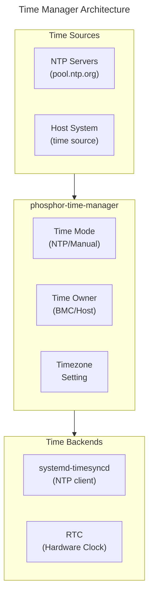

# Time Manager Guide
{: .no_toc }

Configure NTP, RTC, and timezone settings on OpenBMC.
{: .fs-6 .fw-300 }

## Table of Contents
{: .no_toc .text-delta }

1. TOC
{:toc}

---

## Overview

**phosphor-time-manager** handles time synchronization, timezone configuration, and BMC/host time ownership.



<details>
<summary>ASCII-art version (for comparison)</summary>

```
+-------------------------------------------------------------------+
|                   Time Manager Architecture                       |
+-------------------------------------------------------------------+
|                                                                   |
|  +-------------------+       +-------------------+                |
|  |   NTP Servers     |       |    Host System    |                |
|  |  (pool.ntp.org)   |       |   (time source)   |                |
|  +--------+----------+       +--------+----------+                |
|           |                           |                           |
|           v                           v                           |
|  +-----------------------------------------------------------+    |
|  |               phosphor-time-manager                       |    |
|  |                                                           |    |
|  |   +--------------+  +--------------+  +--------------+    |    |
|  |   |  Time Mode   |  |  Time Owner  |  |   Timezone   |    |    |
|  |   |  (NTP/Manual)|  |  (BMC/Host)  |  |   Setting    |    |    |
|  |   +--------------+  +--------------+  +--------------+    |    |
|  |                                                           |    |
|  +---------------------------+-------------------------------+    |
|                              |                                    |
|              +---------------+---------------+                    |
|              |                               |                    |
|              v                               v                    |
|  +-------------------+           +-------------------+            |
|  | systemd-timesyncd |           |       RTC         |            |
|  |   (NTP client)    |           | (Hardware Clock)  |            |
|  +-------------------+           +-------------------+            |
|                                                                   |
+-------------------------------------------------------------------+
```

</details>

---

## Setup & Configuration

### Build-Time Configuration

```bitbake
# Include time manager
IMAGE_INSTALL:append = " phosphor-time-manager"
```

### Time Modes

| Mode | Description |
|------|-------------|
| NTP | Synchronize via NTP servers |
| Manual | Set time manually |

---

## Configuring NTP

### Enable NTP

```bash
# Via Redfish
curl -k -u root:0penBmc -X PATCH \
    -H "Content-Type: application/json" \
    -d '{"NTP": {"ProtocolEnabled": true}}' \
    https://localhost/redfish/v1/Managers/bmc/NetworkProtocol

# Configure NTP servers
curl -k -u root:0penBmc -X PATCH \
    -H "Content-Type: application/json" \
    -d '{"NTP": {"NTPServers": ["pool.ntp.org", "time.google.com"]}}' \
    https://localhost/redfish/v1/Managers/bmc/NetworkProtocol
```

### Check NTP Status

```bash
# Check systemd-timesyncd
timedatectl status

# View NTP sync status
timedatectl show-timesync
```

---

## Setting Time Manually

```bash
# Via Redfish
curl -k -u root:0penBmc -X PATCH \
    -H "Content-Type: application/json" \
    -d '{"DateTime": "2024-01-15T10:30:00+00:00"}' \
    https://localhost/redfish/v1/Managers/bmc

# Via command line
timedatectl set-time "2024-01-15 10:30:00"
```

---

## Timezone Configuration

```bash
# List timezones
timedatectl list-timezones

# Set timezone
timedatectl set-timezone America/Los_Angeles

# Via D-Bus
busctl set-property xyz.openbmc_project.Time.Manager \
    /xyz/openbmc_project/time/bmc \
    xyz.openbmc_project.Time.EpochTime \
    Elapsed t $(date +%s%N)
```

---

## Time Ownership

BMC and Host can have separate time sources:

```bash
# Set BMC as time owner
busctl set-property xyz.openbmc_project.Time.Manager \
    /xyz/openbmc_project/time/owner \
    xyz.openbmc_project.Time.Owner \
    TimeOwner s "xyz.openbmc_project.Time.Owner.Owners.BMC"
```

---

## Deep Dive
{: .text-delta }

Advanced implementation details for time management developers.

### NTP Synchronization Architecture

```
┌────────────────────────────────────────────────────────────────────────────┐
│                     NTP Time Synchronization Flow                          │
├────────────────────────────────────────────────────────────────────────────┤
│                                                                            │
│  NTP SERVER                                                                │
│  ──────────                                                                │
│  pool.ntp.org (stratum 1-2 servers)                                        │
│        │                                                                   │
│        │ UDP 123                                                           │
│        v                                                                   │
│  ┌─────────────────────────────────────────────────────────────────────┐   │
│  │                    systemd-timesyncd                                │   │
│  │                                                                     │   │
│  │  NTP CLIENT MODE:                                                   │   │
│  │  ───────────────                                                    │   │
│  │                                                                     │   │
│  │  1. Send NTP request (mode 3, client)                               │   │
│  │     ┌────────────────────────────────────────────────────────────┐  │   │
│  │     │ LI=0  VN=4  Mode=3  Stratum=0  Poll=6  Precision=-20       │  │   │
│  │     │ Root Delay=0  Root Dispersion=0  Reference ID=0            │  │   │
│  │     │ Reference Timestamp=0  Originate Timestamp=T1              │  │   │
│  │     │ Receive Timestamp=0  Transmit Timestamp=T1                 │  │   │
│  │     └────────────────────────────────────────────────────────────┘  │   │
│  │                                                                     │   │
│  │  2. Receive NTP response (mode 4, server)                           │   │
│  │     ┌────────────────────────────────────────────────────────────┐  │   │
│  │     │ LI=0  VN=4  Mode=4  Stratum=2  Poll=6  Precision=-24       │  │   │
│  │     │ Reference Timestamp=server_sync_time                       │  │   │
│  │     │ Originate Timestamp=T1  (from client request)              │  │   │
│  │     │ Receive Timestamp=T2   (server received time)              │  │   │
│  │     │ Transmit Timestamp=T3  (server reply time)                 │  │   │
│  │     └────────────────────────────────────────────────────────────┘  │   │
│  │                                                                     │   │
│  │  3. Calculate offset and delay (at T4, receive time)                │   │
│  │     offset = ((T2 - T1) + (T3 - T4)) / 2                            │   │
│  │     delay  = (T4 - T1) - (T3 - T2)                                  │   │
│  │                                                                     │   │
│  │  4. Apply correction                                                │   │
│  │     - Small offset (<128ms): slew (gradual adjustment)              │   │
│  │     - Large offset: step (immediate correction)                     │   │
│  │                                                                     │   │
│  └────────────────────────────────────────────────────────────────────-┘   │
│        │                                                                   │
│        │ clock_settime() or adjtimex()                                     │
│        v                                                                   │
│  ┌─────────────────────────────────────────────────────────────────────┐   │
│  │                      Linux Kernel                                   │   │
│  │                                                                     │   │
│  │  System Clock (CLOCK_REALTIME)                                      │   │
│  │        │                                                            │   │
│  │        │ hwclock --systohc (on shutdown or periodically)            │   │
│  │        v                                                            │   │
│  │  Hardware RTC (/dev/rtc0)                                           │   │
│  │        │                                                            │   │
│  │        │ Battery-backed, persists across power cycles               │   │
│  │        v                                                            │   │
│  │  System Boot: hwclock --hctosys (RTC → System Clock)                │   │
│  └─────────────────────────────────────────────────────────────────────┘   │
│                                                                            │
└────────────────────────────────────────────────────────────────────────────┘
```

### BMC/Host Time Ownership Model

```
┌────────────────────────────────────────────────────────────────────────────┐
│                      Time Ownership State Machine                          │
├────────────────────────────────────────────────────────────────────────────┤
│                                                                            │
│  TIME OWNER STATES                                                         │
│  ─────────────────                                                         │
│                                                                            │
│  ┌─────────────────────────────────────────────────────────────────────┐   │
│  │  BMC Owner Mode                                                     │   │
│  │  ────────────────                                                   │   │
│  │                                                                     │   │
│  │  BMC is authoritative time source:                                  │   │
│  │    - BMC sets time from NTP or manual configuration                 │   │
│  │    - Host reads time from BMC via IPMI Get SEL Time                 │   │
│  │    - Host cannot modify BMC time                                    │   │
│  │                                                                     │   │
│  │  ┌─────────┐         ┌─────────┐         ┌─────────┐                │   │
│  │  │   NTP   │ ──────> │   BMC   │ ──────> │  Host   │                │   │
│  │  │ Server  │  sync   │  Clock  │  read   │  Clock  │                │   │
│  │  └─────────┘         └─────────┘         └─────────┘                │   │
│  └─────────────────────────────────────────────────────────────────────┘   │
│                                                                            │
│  ┌─────────────────────────────────────────────────────────────────────┐   │
│  │  Host Owner Mode                                                    │   │
│  │  ───────────────                                                    │   │
│  │                                                                     │   │
│  │  Host is authoritative time source:                                 │   │
│  │    - Host sets time via IPMI Set SEL Time                           │   │
│  │    - BMC accepts time from host                                     │   │
│  │    - BMC NTP is disabled or secondary                               │   │
│  │                                                                     │   │
│  │  ┌─────────┐         ┌─────────┐         ┌──────────┐               │   │
│  │  │  Host   │ ──────> │   BMC   │         │   NTP    │               │   │
│  │  │  Clock  │  IPMI   │  Clock  │         │(disabled)│               │   │
│  │  └─────────┘  set    └─────────┘         └──────────┘               │   │
│  └─────────────────────────────────────────────────────────────────────┘   │
│                                                                            │
│  ┌─────────────────────────────────────────────────────────────────────┐   │
│  │  Split Mode (Both)                                                  │   │
│  │  ─────────────────                                                  │   │
│  │                                                                     │   │
│  │  BMC and Host maintain separate times:                              │   │
│  │    - BMC time: NTP synchronized                                     │   │
│  │    - Host time: Set by BIOS/OS                                      │   │
│  │    - SEL timestamps use BMC time                                    │   │
│  │    - Host applications use host time                                │   │
│  │                                                                     │   │
│  │  ┌─────────┐         ┌─────────┐                                    │   │
│  │  │   NTP   │ ──────> │  BMC    │  (for SEL, BMC logs)               │   │
│  │  │ Server  │  sync   │  Clock  │                                    │   │
│  │  └─────────┘         └─────────┘                                    │   │
│  │                                                                     │   │
│  │  ┌─────────┐         ┌─────────┐                                    │   │
│  │  │  BIOS/  │ ──────> │  Host   │  (for OS, applications)            │   │
│  │  │   OS    │  set    │  Clock  │                                    │   │
│  │  └─────────┘         └─────────┘                                    │   │
│  └─────────────────────────────────────────────────────────────────────┘   │
│                                                                            │
│  D-BUS INTERFACE:                                                          │
│  ────────────────                                                          │
│                                                                            │
│  Object: /xyz/openbmc_project/time/owner                                   │
│  Interface: xyz.openbmc_project.Time.Owner                                 │
│                                                                            │
│  Property: TimeOwner (enum)                                                │
│    - xyz.openbmc_project.Time.Owner.Owners.BMC                             │
│    - xyz.openbmc_project.Time.Owner.Owners.Host                            │
│    - xyz.openbmc_project.Time.Owner.Owners.Both                            │
│    - xyz.openbmc_project.Time.Owner.Owners.Split                           │
│                                                                            │
└────────────────────────────────────────────────────────────────────────────┘
```

### RTC and System Clock Synchronization

```
┌────────────────────────────────────────────────────────────────────────────┐
│                    RTC Synchronization Details                             │
├────────────────────────────────────────────────────────────────────────────┤
│                                                                            │
│  HARDWARE RTC ACCESS                                                       │
│  ───────────────────                                                       │
│                                                                            │
│  /dev/rtc0 → Hardware real-time clock                                      │
│                                                                            │
│  ┌─────────────────────────────────────────────────────────────────────┐   │
│  │  RTC Registers (typical I2C or memory-mapped):                      │   │
│  │                                                                     │   │
│  │  ┌──────────┬──────────┬──────────┬──────────┬──────────┐           │   │
│  │  │ Seconds  │ Minutes  │  Hours   │  Day     │  Month   │           │   │
│  │  │ (0-59)   │ (0-59)   │ (0-23)   │ (1-31)   │ (1-12)   │           │   │
│  │  └──────────┴──────────┴──────────┴──────────┴──────────┘           │   │
│  │  ┌──────────┬──────────┬──────────────────────────────────┐         │   │
│  │  │  Year    │ Weekday  │ Control/Status Registers         │         │   │
│  │  │ (0-99)   │ (0-6)    │ (alarm, interrupt enable, etc.)  │         │   │
│  │  └──────────┴──────────┴──────────────────────────────────┘         │   │
│  └─────────────────────────────────────────────────────────────────────┘   │
│                                                                            │
│  BOOT SEQUENCE:                                                            │
│  ──────────────                                                            │
│                                                                            │
│  Power On                                                                  │
│      │                                                                     │
│      v                                                                     │
│  ┌────────────────────────────────────────────────────────────────────-┐   │
│  │  1. Kernel initializes with RTC time                                │   │
│  │     rtc_hctosys() → reads RTC, sets system clock                    │   │
│  │                                                                     │   │
│  │     CONFIG_RTC_HCTOSYS=y (kernel config)                            │   │
│  │     CONFIG_RTC_HCTOSYS_DEVICE="rtc0"                                │   │
│  └─────────────────────────────────────────────────────────────────────┘   │
│      │                                                                     │
│      v                                                                     │
│  ┌─────────────────────────────────────────────────────────────────────┐   │
│  │  2. systemd-timesyncd starts                                        │   │
│  │     - If NTP enabled: begins synchronization                        │   │
│  │     - Adjusts system clock based on NTP                             │   │
│  └─────────────────────────────────────────────────────────────────────┘   │
│      │                                                                     │
│      v                                                                     │
│  ┌─────────────────────────────────────────────────────────────────────┐   │
│  │  3. phosphor-time-manager starts                                    │   │
│  │     - Exposes D-Bus interfaces                                      │   │
│  │     - Handles owner mode                                            │   │
│  │     - Responds to time set requests                                 │   │
│  └─────────────────────────────────────────────────────────────────────┘   │
│                                                                            │
│  SHUTDOWN SEQUENCE:                                                        │
│  ──────────────────                                                        │
│                                                                            │
│  ┌─────────────────────────────────────────────────────────────────────┐   │
│  │  systemd-timedated or hwclock --systohc                             │   │
│  │  - Writes current system time to RTC                                │   │
│  │  - Ensures RTC has latest time for next boot                        │   │
│  │                                                                     │   │
│  │  hwclock --systohc --utc  (store as UTC)                            │   │
│  │  hwclock --systohc --localtime  (store as local time)               │   │
│  └─────────────────────────────────────────────────────────────────────┘   │
│                                                                            │
│  TIMEZONE HANDLING:                                                        │
│  ─────────────────                                                         │
│                                                                            │
│  BMC stores time in UTC internally:                                        │
│    System Clock: UTC (always)                                              │
│    RTC:          UTC (recommended) or Local Time                           │
│    Display:      Converted to configured timezone                          │
│                                                                            │
│  /etc/localtime → symlink to /usr/share/zoneinfo/<zone>                    │
│  TZ environment variable (fallback)                                        │
│                                                                            │
│  timedatectl set-timezone America/Los_Angeles                              │
│  → Updates /etc/localtime symlink                                          │
│  → Does NOT change stored time (UTC unchanged)                             │
│  → Changes how time is displayed                                           │
│                                                                            │
└────────────────────────────────────────────────────────────────────────────┘
```

### Source Code Reference

Key implementation files in [phosphor-time-manager](https://github.com/openbmc/phosphor-time-manager):

| File | Description |
|------|-------------|
| `bmc_epoch.cpp` | BMC time D-Bus object implementation |
| `host_epoch.cpp` | Host time D-Bus object implementation |
| `manager.cpp` | Time owner and sync mode management |
| `utils.cpp` | Utility functions for time operations |
| `settings.cpp` | Persistent settings handling |

---

## References

- [phosphor-time-manager](https://github.com/openbmc/phosphor-time-manager)
- [systemd-timesyncd](https://www.freedesktop.org/software/systemd/man/systemd-timesyncd.html)

---

{: .note }
**Tested on**: OpenBMC master, QEMU romulus
