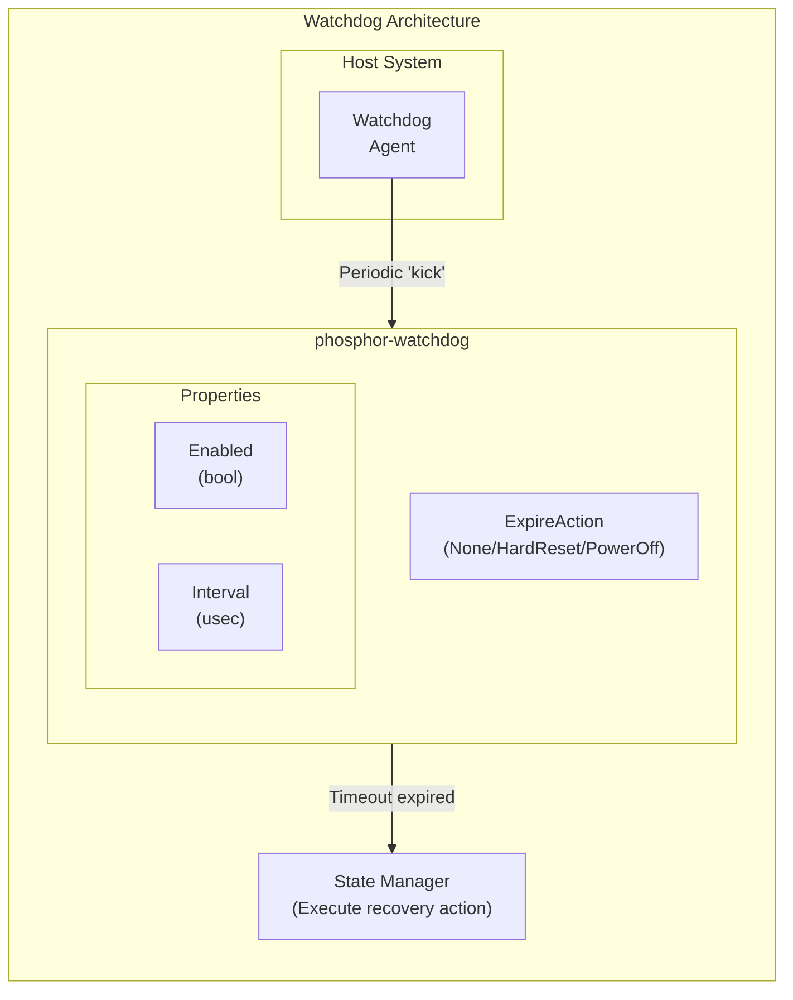
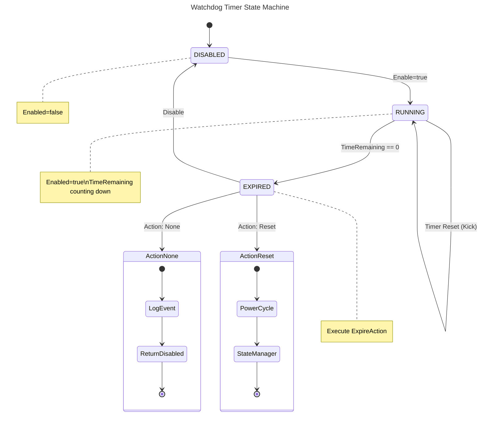

# Watchdog Guide
{: .no_toc }

Configure host watchdog timer on OpenBMC.
{: .fs-6 .fw-300 }

## Table of Contents
{: .no_toc .text-delta }

1. TOC
{:toc}

---

## Overview

**phosphor-watchdog** monitors host health and triggers recovery actions if the host becomes unresponsive.


---

## Setup & Configuration

### Build-Time Configuration

```bitbake
# Include watchdog
IMAGE_INSTALL:append = " phosphor-watchdog"

# Configure Meson options
EXTRA_OEMESON:pn-phosphor-watchdog = " \
    -Ddefault-action=HardReset \
    -Ddefault-timeout=300 \
"
```

### Expiration Actions

| Action | Description |
|--------|-------------|
| None | Log event only |
| HardReset | Force power cycle |
| PowerOff | Power off system |
| PowerCycle | Power off then on |

---

## Configuring Watchdog

### Via D-Bus

```bash
# Enable watchdog
busctl set-property xyz.openbmc_project.Watchdog \
    /xyz/openbmc_project/watchdog/host0 \
    xyz.openbmc_project.State.Watchdog \
    Enabled b true

# Set timeout (microseconds)
busctl set-property xyz.openbmc_project.Watchdog \
    /xyz/openbmc_project/watchdog/host0 \
    xyz.openbmc_project.State.Watchdog \
    Interval t 300000000

# Set expiration action
busctl set-property xyz.openbmc_project.Watchdog \
    /xyz/openbmc_project/watchdog/host0 \
    xyz.openbmc_project.State.Watchdog \
    ExpireAction s "xyz.openbmc_project.State.Watchdog.Action.HardReset"
```

### Via IPMI

```bash
# Get watchdog status
ipmitool mc watchdog get

# Set watchdog timeout
ipmitool mc watchdog set timeout 300

# Enable watchdog
ipmitool mc watchdog set action hard_reset

# Reset (kick) watchdog
ipmitool mc watchdog reset
```

### Via Redfish

```bash
# Configure watchdog via HostWatchdogTimer
curl -k -u root:0penBmc -X PATCH \
    -H "Content-Type: application/json" \
    -d '{
        "HostWatchdogTimer": {
            "FunctionEnabled": true,
            "TimeoutAction": "ResetSystem",
            "WarningAction": "None"
        }
    }' \
    https://localhost/redfish/v1/Systems/system
```

---

## Watchdog Operation

```
Host Boot → Watchdog Enabled → Host kicks watchdog periodically
                                    ↓
                            Timeout expires?
                                    ↓
                            Execute ExpireAction
```

---

## Troubleshooting

```bash
# Check watchdog service
systemctl status phosphor-watchdog@watchdog-host0

# View watchdog state
busctl introspect xyz.openbmc_project.Watchdog \
    /xyz/openbmc_project/watchdog/host0
```

---

## Deep Dive
{: .text-delta }

Advanced implementation details for watchdog timer developers.

### Watchdog Timer State Machine



**Timer Properties:**

| Property | Description |
|----------|-------------|
| `Interval` | Total countdown time (microseconds) |
| `TimeRemaining` | Current time left (decrements each tick) |
| `Enabled` | Whether timer is active |
| `ExpireAction` | What to do on timeout (None, HardReset, PowerOff, etc.) |
| `CurrentTimerUse` | BIOS_FRB2, BIOS_POST, OS_LOAD, SMS_OS, OEM |

<details>
<summary>ASCII-art version (for comparison)</summary>

```
┌────────────────────────────────────────────────────────────────────────────┐
│                      Watchdog Timer State Machine                          │
├────────────────────────────────────────────────────────────────────────────┤
│                                                                            │
│                          ┌─────────────────────────────────────┐           │
│                          │                                     │           │
│              Enable=true │                                     │ Timer     │
│            ┌─────────────┴───────────┐                         │ Reset     │
│            │                         │                         │ (Kick)    │
│            v                         │                         │           │
│     ┌──────────────┐           ┌─────┴──────────┐              │           │
│     │   DISABLED   │           │    RUNNING     │<─────────────┘           │
│     │              │           │                │                          │
│     │  Enabled=    │  Enable   │  Enabled=true  │                          │
│     │  false       │──────────>│  TimeRemaining │                          │
│     │              │           │  counting down │                          │
│     └──────────────┘           └───────┬────────┘                          │
│            ^                           │                                   │
│            │                           │ TimeRemaining == 0                │
│            │                           v                                   │
│            │                   ┌───────────────┐                           │
│            │                   │   EXPIRED     │                           │
│            │       Disable     │               │                           │
│            └───────────────────┤  Execute      │                           │
│                                │  ExpireAction │                           │
│                                └───────┬───────┘                           │
│                                        │                                   │
│                    ┌───────────────────┴───────────────────┐               │
│                    │                                       │               │
│                    v                                       v               │
│          ┌─────────────────┐                    ┌─────────────────┐        │
│          │  Action: None   │                    │ Action: Reset   │        │
│          │                 │                    │                 │        │
│          │  Log event only │                    │ Power cycle     │        │
│          │  Return to      │                    │ Request via     │        │
│          │  DISABLED       │                    │ State Manager   │        │
│          └─────────────────┘                    └─────────────────┘        │
│                                                                            │
│  TIMER PROPERTIES:                                                         │
│  ─────────────────                                                         │
│                                                                            │
│  Interval:      Total countdown time (microseconds)                        │
│  TimeRemaining: Current time left (decrements each tick)                   │
│  Enabled:       Whether timer is active                                    │
│  ExpireAction:  What to do on timeout (None, HardReset, PowerOff, etc.)    │
│  CurrentTimerUse: BIOS_FRB2, BIOS_POST, OS_LOAD, SMS_OS, OEM               │
│                                                                            │
└────────────────────────────────────────────────────────────────────────────┘
```

</details>

### Timer Implementation Architecture

```
┌────────────────────────────────────────────────────────────────────────────┐
│                    Phosphor-Watchdog Timer Implementation                  │
├────────────────────────────────────────────────────────────────────────────┤
│                                                                            │
│  HOST AGENT (BIOS/OS)                                                      │
│  ────────────────────                                                      │
│        │                                                                   │
│        │ IPMI: Set Watchdog Timer (0x24)                                   │
│        │       Reset Watchdog Timer (0x22)                                 │
│        v                                                                   │
│  ┌─────────────────────────────────────────────────────────────────────┐   │
│  │                    phosphor-ipmi-host                               │   │
│  │                                                                     │   │
│  │  ipmid_watchdog.cpp                                                 │   │
│  │  ├── ipmi_watchdog_set()   → D-Bus properties                       │   │
│  │  └── ipmi_watchdog_reset() → D-Bus ResetTimeRemaining()             │   │
│  └────────────────────────────────────────────────────────────────────-┘   │
│        │                                                                   │
│        │ D-Bus                                                             │
│        v                                                                   │
│  ┌─────────────────────────────────────────────────────────────────────┐   │
│  │                    phosphor-watchdog                                │   │
│  │                                                                     │   │
│  │  D-Bus Object: /xyz/openbmc_project/watchdog/host0                  │   │
│  │  Service:      xyz.openbmc_project.Watchdog                         │   │
│  │                                                                     │   │
│  │  ┌───────────────────────────────────────────────────────────────┐  │   │
│  │  │  Watchdog Class (watchdog.cpp)                                │  │   │
│  │  │                                                               │  │   │
│  │  │  Properties:                                                  │  │   │
│  │  │    Enabled: bool              ExpireAction: enum              │  │   │
│  │  │    Interval: uint64_t (usec)  TimeRemaining: uint64_t         │  │   │
│  │  │    CurrentTimerUse: enum      TimerUseExpirationFlags: byte   │  │   │
│  │  │                                                               │  │   │
│  │  │  Timer Loop:                                                  │  │   │
│  │  │    while (enabled && timeRemaining > 0) {                     │  │   │
│  │  │        timerfd_settime(fd, 0, &timerspec);                    │  │   │
│  │  │        epoll_wait(epfd, events, 1, -1);                       │  │   │
│  │  │        timeRemaining -= elapsed;                              │  │   │
│  │  │    }                                                          │  │   │
│  │  │    if (timeRemaining == 0) doExpiration();                    │  │   │
│  │  └───────────────────────────────────────────────────────────────┘  │   │
│  └────────────────────────────────────────────────────────────────────-┘   │
│        │                                                                   │
│        │ Expiration triggers D-Bus method call                             │
│        v                                                                   │
│  ┌─────────────────────────────────────────────────────────────────────┐   │
│  │                    phosphor-state-manager                           │   │
│  │                                                                     │   │
│  │  D-Bus Object: /xyz/openbmc_project/state/host0                     │   │
│  │                                                                     │   │
│  │  Methods triggered by watchdog expiration:                          │   │
│  │    RequestedHostTransition = ForceOff    (PowerOff action)          │   │
│  │    RequestedHostTransition = Reboot      (HardReset action)         │   │
│  │    RequestedHostTransition = GracefulOff (PowerCycle action)        │   │
│  └─────────────────────────────────────────────────────────────────────┘   │
│                                                                            │
└────────────────────────────────────────────────────────────────────────────┘
```

### IPMI Watchdog Timer Commands

```
┌────────────────────────────────────────────────────────────────────────────┐
│                      IPMI Watchdog Protocol Details                        │
├────────────────────────────────────────────────────────────────────────────┤
│                                                                            │
│  SET WATCHDOG TIMER (0x24)                                                 │
│  ─────────────────────────                                                 │
│                                                                            │
│  Request:                                                                  │
│  ┌─────────┬──────────────────────────────────────────────────────────┐    │
│  │ Byte    │ Description                                              │    │
│  ├─────────┼──────────────────────────────────────────────────────────┤    │
│  │ 1       │ Timer Use:                                               │    │
│  │         │   [6:0] Timer Use (1=BIOS_FRB2, 2=BIOS_POST,             │    │
│  │         │         3=OS_LOAD, 4=SMS_OS, 5=OEM)                      │    │
│  │         │   [7]   Don't log (0=log, 1=don't log)                   │    │
│  ├─────────┼──────────────────────────────────────────────────────────┤    │
│  │ 2       │ Timer Actions:                                           │    │
│  │         │   [2:0] Timeout action (0=None, 1=HardReset,             │    │
│  │         │         2=PowerDown, 3=PowerCycle)                       │    │
│  │         │   [6:4] Pre-timeout interrupt (0=None, 1=SMI,            │    │
│  │         │         2=NMI, 3=Messaging)                              │    │
│  ├─────────┼──────────────────────────────────────────────────────────┤    │
│  │ 3       │ Pre-timeout interval (seconds)                           │    │
│  ├─────────┼──────────────────────────────────────────────────────────┤    │
│  │ 4       │ Timer Use Expiration Flags Clear                         │    │
│  │         │   [0] BIOS_FRB2  [1] BIOS_POST  [2] OS_LOAD              │    │
│  │         │   [3] SMS_OS     [4] OEM                                 │    │
│  ├─────────┼──────────────────────────────────────────────────────────┤    │
│  │ 5-6     │ Initial countdown value (100ms units, LSB first)         │    │
│  └─────────┴──────────────────────────────────────────────────────────┘    │
│                                                                            │
│  GET WATCHDOG TIMER (0x25)                                                 │
│  ─────────────────────────                                                 │
│                                                                            │
│  Response:                                                                 │
│  ┌─────────┬──────────────────────────────────────────────────────────┐    │
│  │ Byte    │ Description                                              │    │
│  ├─────────┼──────────────────────────────────────────────────────────┤    │
│  │ 1       │ Completion code                                          │    │
│  │ 2       │ Timer Use (same format as set)                           │    │
│  │ 3       │ Timer Actions (same format as set)                       │    │
│  │ 4       │ Pre-timeout interval                                     │    │
│  │ 5       │ Timer Use Expiration Flags (set on expiration)           │    │
│  │ 6-7     │ Initial countdown value                                  │    │
│  │ 8-9     │ Present countdown value (current time remaining)         │    │
│  └─────────┴──────────────────────────────────────────────────────────┘    │
│                                                                            │
│  RESET WATCHDOG TIMER (0x22)                                               │
│  ───────────────────────────                                               │
│  No data bytes - resets countdown to initial value                         │
│  Returns error 0x80 if timer not initialized (never set)                   │
│                                                                            │
│  Example ipmitool Commands:                                                │
│  ──────────────────────────                                                │
│                                                                            │
│  # Set 5-minute timer with hard reset action, OS watchdog                  │
│  ipmitool raw 0x06 0x24 0x44 0x01 0x00 0x10 0xB8 0x0B                      │
│  #                      │    │    │    │    └─────┘                        │
│  #                      │    │    │    │    3000 = 5 min (100ms units)     │
│  #                      │    │    │    └─ Clear flags                      │
│  #                      │    │    └────── No pre-timeout                   │
│  #                      │    └─────────── HardReset action                 │
│  #                      └──────────────── SMS_OS timer use                 │
│                                                                            │
│  # Kick (reset) watchdog                                                   │
│  ipmitool raw 0x06 0x22                                                    │
│                                                                            │
│  # Get current status                                                      │
│  ipmitool raw 0x06 0x25                                                    │
│                                                                            │
└────────────────────────────────────────────────────────────────────────────┘
```

### Recovery Action Sequence

```
┌────────────────────────────────────────────────────────────────────────────┐
│                     Watchdog Expiration Recovery Sequence                  │
├────────────────────────────────────────────────────────────────────────────┤
│                                                                            │
│  WATCHDOG EXPIRES (TimeRemaining reaches 0)                                │
│           │                                                                │
│           v                                                                │
│  ┌─────────────────────────────────────────────────────────────────────┐   │
│  │  1. Log Expiration Event                                            │   │
│  │     ─────────────────────                                           │   │
│  │     sd_journal_print(LOG_ERR, "Watchdog expired: %s",               │   │
│  │                      getCurrentTimerUseString());                   │   │
│  │                                                                     │   │
│  │     // Set expiration flag for this timer use                       │   │
│  │     timerUseExpirationFlags |= (1 << currentTimerUse);              │   │
│  └─────────────────────────────────────────────────────────────────────┘   │
│           │                                                                │
│           v                                                                │
│  ┌─────────────────────────────────────────────────────────────────────┐   │
│  │  2. Generate SEL Entry                                              │   │
│  │     ─────────────────────                                           │   │
│  │     IPMI SEL Event:                                                 │   │
│  │       Sensor Type: 0x23 (Watchdog 2)                                │   │
│  │       Event Type:  0x6F (Sensor-specific)                           │   │
│  │       Event Data1: 0x00 (Timer expired)                             │   │
│  │       Event Data2: Current timer use                                │   │
│  │       Event Data3: Timeout action                                   │   │
│  └─────────────────────────────────────────────────────────────────────┘   │
│           │                                                                │
│           v                                                                │
│  ┌─────────────────────────────────────────────────────────────────────┐   │
│  │  3. Execute Expiration Action                                       │   │
│  │     ──────────────────────────                                      │   │
│  │                                                                     │   │
│  │     switch (expireAction) {                                         │   │
│  │                                                                     │   │
│  │     case None:                                                      │   │
│  │         // Just log, no action                                      │   │
│  │         break;                                                      │   │
│  │                                                                     │   │
│  │     case HardReset:                                                 │   │
│  │         // Immediate power cycle                                    │   │
│  │         host.RequestedHostTransition(Host::Transition::Reboot);     │   │
│  │         // GPIO chassis power control                               │   │
│  │         break;                                                      │   │
│  │                                                                     │   │
│  │     case PowerOff:                                                  │   │
│  │         // Power off without restart                                │   │
│  │         host.RequestedHostTransition(Host::Transition::Off);        │   │
│  │         break;                                                      │   │
│  │                                                                     │   │
│  │     case PowerCycle:                                                │   │
│  │         // Power off, wait, power on                                │   │
│  │         host.RequestedHostTransition(Host::Transition::Off);        │   │
│  │         sleep(power_cycle_delay);  // e.g., 10 seconds              │   │
│  │         host.RequestedHostTransition(Host::Transition::On);         │   │
│  │         break;                                                      │   │
│  │     }                                                               │   │
│  └─────────────────────────────────────────────────────────────────────┘   │
│           │                                                                │
│           v                                                                │
│  ┌─────────────────────────────────────────────────────────────────────┐   │
│  │  4. GPIO Power Sequencing (for HardReset)                           │   │
│  │     ────────────────────────────────────                            │   │
│  │                                                                     │   │
│  │     Time ─────────────────────────────────────────>                 │   │
│  │                                                                     │   │
│  │     POWER_BUTTON   ────┐               ┌────────                    │   │
│  │     (assert)           └───────────────┘                            │   │
│  │                         Hold for       Release                      │   │
│  │                         4+ seconds     (force off)                  │   │
│  │                                                                     │   │
│  │     POWER_GOOD     ────┐                       ┌────                │   │
│  │     (monitor)          └───────────────────────┘                    │   │
│  │                              Power off         Power restored       │   │
│  │                                                                     │   │
│  │     POST_COMPLETE  ────┐                               ┌────        │   │
│  │     (monitor)          └───────────────────────────────┘            │   │
│  │                              Cleared                   Set by BIOS  │   │
│  │                                                                     │   │
│  └─────────────────────────────────────────────────────────────────────┘   │
│                                                                            │
└────────────────────────────────────────────────────────────────────────────┘
```

### Source Code Reference

Key implementation files in [phosphor-watchdog](https://github.com/openbmc/phosphor-watchdog):

| File | Description |
|------|-------------|
| `watchdog.cpp` | Main watchdog class with timer loop and expiration handling |
| `watchdog.hpp` | Watchdog class definition with D-Bus property implementations |
| `watchdog_main.cpp` | Service entry point and D-Bus object creation |
| `phosphor-host-ipmid/ipmid_watchdog.cpp` | IPMI command handlers (Set/Get/Reset) |

---

## Examples

Working examples are available in the [examples/watchdog](https://github.com/MichaelTien8901/openbmc-guide-tutorial/tree/master/examples/watchdog) directory:

- `watchdog-config.json` - Watchdog timer configuration
- `watchdog-test.sh` - Test script for watchdog functionality

---

## References

- [phosphor-watchdog](https://github.com/openbmc/phosphor-watchdog)
- [IPMI Watchdog Timer](https://www.intel.com/content/dam/www/public/us/en/documents/product-briefs/ipmi-second-gen-interface-spec-v2-rev1-1.pdf)

---

{: .note }
**Tested on**: OpenBMC master, QEMU romulus
