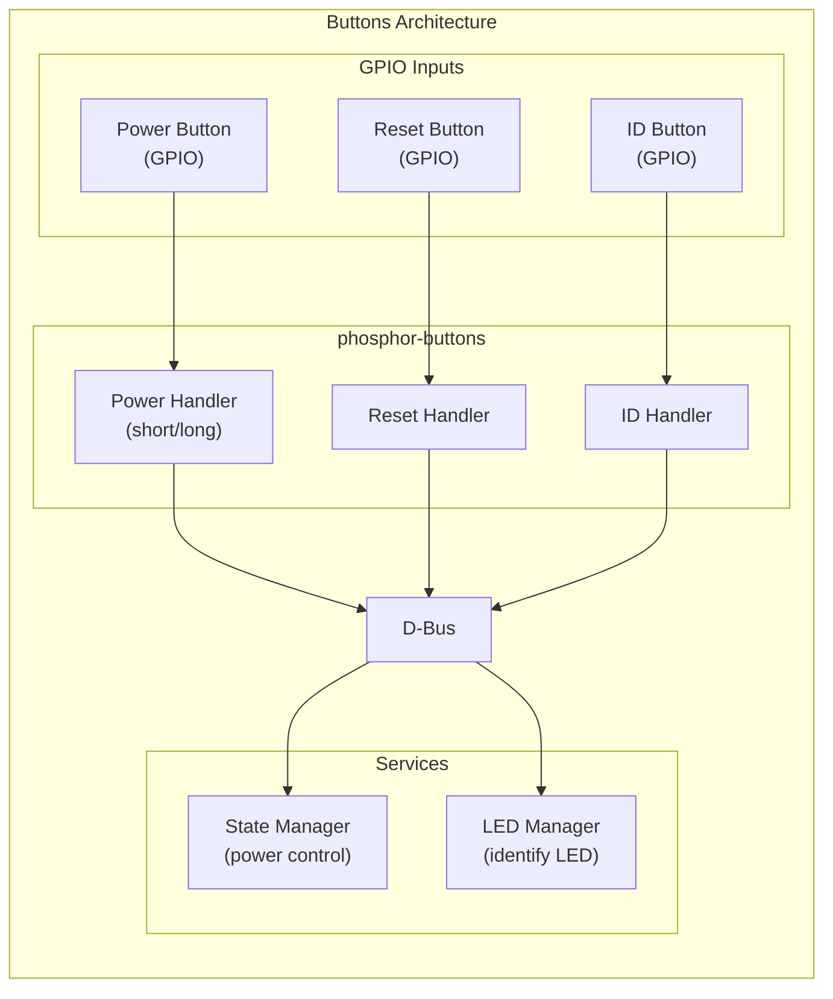

# Buttons Guide
{: .no_toc }

Configure power, reset, and ID buttons on OpenBMC.
{: .fs-6 .fw-300 }

## Table of Contents
{: .no_toc .text-delta }

1. TOC
{:toc}

---

## Overview

**phosphor-buttons** handles physical button inputs (power, reset, ID) and translates them to system actions.


---

## Setup & Configuration

### Build-Time Configuration

```bitbake
# Include buttons handler
IMAGE_INSTALL:append = " phosphor-buttons"
```

### Button Types

| Button | Function | Default Action |
|--------|----------|----------------|
| Power | Short press | Toggle power |
| Power | Long press (4s) | Force power off |
| Reset | Press | Hard reset |
| ID | Press | Toggle identify LED |

---

## GPIO Configuration

### Device Tree

```dts
gpio-keys {
    compatible = "gpio-keys";

    power-button {
        label = "power-button";
        gpios = <&gpio ASPEED_GPIO(B, 0) GPIO_ACTIVE_LOW>;
        linux,code = <116>;  /* KEY_POWER */
    };

    reset-button {
        label = "reset-button";
        gpios = <&gpio ASPEED_GPIO(B, 1) GPIO_ACTIVE_LOW>;
        linux,code = <0x198>;  /* KEY_RESTART */
    };

    id-button {
        label = "id-button";
        gpios = <&gpio ASPEED_GPIO(B, 2) GPIO_ACTIVE_LOW>;
        linux,code = <0x199>;
    };
};
```

### JSON Configuration

```json
{
    "gpio_definitions": [
        {
            "name": "POWER_BUTTON",
            "pin": "GPIOB0",
            "direction": "input"
        },
        {
            "name": "RESET_BUTTON",
            "pin": "GPIOB1",
            "direction": "input"
        },
        {
            "name": "ID_BUTTON",
            "pin": "GPIOB2",
            "direction": "input"
        }
    ]
}
```

---

## Button Behavior

### Power Button

```bash
# Short press (< 4 seconds)
# Action: Request power state toggle

# Long press (≥ 4 seconds)
# Action: Force power off
```

### Reset Button

```bash
# Press triggers hard reset
# Equivalent to: obmcutil hostreboot
```

### ID Button

```bash
# Press toggles identify LED
# Can be configured for latching or momentary
```

---

## D-Bus Interface

```bash
# Check button status
busctl tree xyz.openbmc_project.Chassis.Buttons

# Monitor button events
busctl monitor xyz.openbmc_project.Chassis.Buttons
```

---

## Disabling Buttons

### Mask Power Button

```bash
# Via D-Bus
busctl set-property xyz.openbmc_project.Chassis.Buttons \
    /xyz/openbmc_project/Chassis/Buttons/Power0 \
    xyz.openbmc_project.Chassis.Buttons \
    Enabled b false
```

---

## Troubleshooting

```bash
# Check GPIO input
cat /sys/class/gpio/gpio*/value

# Check button service
systemctl status phosphor-button-handler

# Monitor key events
evtest /dev/input/event0
```

---

## Deep Dive

This section provides detailed technical information for developers who want to understand button handling internals in OpenBMC.

### Button Event Processing Pipeline

```
┌─────────────────────────────────────────────────────────────────────────────┐
│                    Button Input Processing Architecture                     │
├─────────────────────────────────────────────────────────────────────────────┤
│                                                                             │
│  Hardware Layer                                                             │
│  ┌────────────────────────────────────────────────────────────────────────┐ │
│  │                                                                        │ │
│  │   Physical Button ────> GPIO Pin ────> GPIO Controller (ASPEED)        │ │
│  │        │                    │                   │                      │ │
│  │        │  Debounce         │  Edge detection   │  Interrupt to CPU     │ │
│  │        │  (hardware)       │  (rising/falling) │                       │ │
│  │        v                    v                   v                      │ │
│  │   ┌─────────────────────────────────────────────────────────────────┐  │ │
│  │   │              Kernel gpio-keys Driver                            │  │ │
│  │   │                                                                 │  │ │
│  │   │  Device Tree: gpio-keys { compatible = "gpio-keys"; ... }       │  │ │
│  │   │                                                                 │  │ │
│  │   │  Kernel Actions:                                                │  │ │
│  │   │  1. Request GPIO with GPIOF_IN                                  │  │ │
│  │   │  2. Configure IRQ (IRQF_TRIGGER_RISING | FALLING)               │  │ │
│  │   │  3. Software debounce (gpio_keys_irq_timer)                     │  │ │
│  │   │  4. Generate input_event (EV_KEY, linux_code, value)            │  │ │
│  │   │                                                                 │  │ │
│  │   └─────────────────────────────────────────────────────────────────┘  │ │
│  │                                     │                                  │ │
│  │                                     v                                  │ │
│  │   ┌─────────────────────────────────────────────────────────────────┐  │ │
│  │   │              /dev/input/event0 (Input Subsystem)                │  │ │
│  │   │                                                                 │  │ │
│  │   │  struct input_event {                                           │  │ │
│  │   │    struct timeval time;    // Timestamp                         │  │ │
│  │   │    __u16 type;             // EV_KEY (0x01)                     │  │ │
│  │   │    __u16 code;             // KEY_POWER (116), KEY_RESTART (408)│  │ │
│  │   │    __s32 value;            // 1=pressed, 0=released             │  │ │
│  │   │  };                                                             │  │ │
│  │   └─────────────────────────────────────────────────────────────────┘  │ │
│  │                                                                        │ │
│  └────────────────────────────────────────────────────────────────────────┘ │
│                                     │                                       │
│                                     v                                       │
│  Userspace Layer (phosphor-buttons)                                         │
│  ┌────────────────────────────────────────────────────────────────────────┐ │
│  │                                                                        │ │
│  │  ┌──────────────────────────────────────────────────────────────────┐  │ │
│  │  │                    Input Event Monitor                           │  │ │
│  │  │                                                                  │  │ │
│  │  │  sd_event_add_io(loop, &source, fd, EPOLLIN, handler, this);     │  │ │
│  │  │                                                                  │  │ │
│  │  │  On event:                                                       │  │ │
│  │  │  1. read(fd, &ev, sizeof(ev))                                    │  │ │
│  │  │  2. Dispatch to button-specific handler based on ev.code         │  │ │
│  │  └──────────────────────────────────────────────────────────────────┘  │ │
│  │                              │                                         │ │
│  │           ┌──────────────────┼──────────────────┐                      │ │
│  │           v                  v                  v                      │ │
│  │  ┌─────────────────┐ ┌─────────────────┐ ┌─────────────────┐           │ │
│  │  │  Power Button   │ │  Reset Button   │ │   ID Button     │           │ │
│  │  │    Handler      │ │    Handler      │ │    Handler      │           │ │
│  │  │                 │ │                 │ │                 │           │ │
│  │  │ Short press:    │ │ Press:          │ │ Press:          │           │ │
│  │  │ Toggle power    │ │ Host reboot     │ │ Toggle LED      │           │ │
│  │  │                 │ │                 │ │                 │           │ │
│  │  │ Long press(4s): │ │                 │ │                 │           │ │
│  │  │ Force off       │ │                 │ │                 │           │ │
│  │  └─────────────────┘ └─────────────────┘ └─────────────────┘           │ │
│  │           │                  │                  │                      │ │
│  └───────────│──────────────────│──────────────────│──────────────────────┘ │
│              │                  │                  │                        │
│              v                  v                  v                        │
│  ┌────────────────────────────────────────────────────────────────────────┐ │
│  │                           D-Bus Calls                                  │ │
│  │                                                                        │ │
│  │  Power: xyz.openbmc_project.State.Host.RequestedHostTransition         │ │
│  │  Reset: xyz.openbmc_project.State.Host.RequestedHostTransition=Reboot  │ │
│  │  ID: xyz.openbmc_project.Led.Physical.State                            │ │
│  │                                                                        │ │
│  └────────────────────────────────────────────────────────────────────────┘ │
│                                                                             │
└─────────────────────────────────────────────────────────────────────────────┘
```

### Power Button State Machine

```
┌─────────────────────────────────────────────────────────────────────────────┐
│                    Power Button Press Duration Handling                     │
├─────────────────────────────────────────────────────────────────────────────┤
│                                                                             │
│                          ┌─────────────────┐                                │
│                          │     IDLE        │                                │
│                          │ (waiting for    │                                │
│                          │  button press)  │                                │
│                          └────────┬────────┘                                │
│                                   │                                         │
│                          Button Pressed (EV_KEY, value=1)                   │
│                                   │                                         │
│                                   v                                         │
│                          ┌─────────────────┐                                │
│                          │   PRESSED       │                                │
│                          │ Start timer     │                                │
│                          │ t=0             │                                │
│                          └────────┬────────┘                                │
│                                   │                                         │
│                  ┌────────────────┼────────────────┐                        │
│                  │                │                │                        │
│          Released           Timer running    Timer >= 4s                    │
│          (value=0)          (t < 4s)         (LONG_PRESS_TIMEOUT)           │
│          before 4s                │                │                        │
│                  │                │                │                        │
│                  v                v                v                        │
│         ┌─────────────────┐      ...       ┌─────────────────┐              │
│         │  SHORT_PRESS    │                │  LONG_PRESS     │              │
│         │                 │                │                 │              │
│         │  Action:        │                │  Action:        │              │
│         │  Toggle power   │                │  Force power    │              │
│         │  state          │                │  off            │              │
│         │                 │                │                 │              │
│         │  If host is ON: │                │  Immediate      │              │
│         │    Request Off  │                │  chassis power  │              │
│         │  If host is OFF:│                │  off (ignores   │              │
│         │    Request On   │                │  host state)    │              │
│         └─────────────────┘                └─────────────────┘              │
│                  │                                │                         │
│                  v                                v                         │
│         ┌─────────────────────────────────────────────────────┐             │
│         │                     D-Bus Action                    │             │
│         │                                                     │             │
│         │  Short Press (graceful):                            │             │
│         │  busctl set-property                                │             │
│         │    xyz.openbmc_project.State.Host                   │             │
│         │    /xyz/openbmc_project/state/host0                 │             │
│         │    xyz.openbmc_project.State.Host                   │             │
│         │    RequestedHostTransition s                        │             │
│         │    "xyz.openbmc_project.State.Host.Transition.On"   │             │
│         │                                                     │             │
│         │  Long Press (force off):                            │             │
│         │  busctl set-property                                │             │
│         │    xyz.openbmc_project.State.Chassis                │             │
│         │    /xyz/openbmc_project/state/chassis0              │             │
│         │    xyz.openbmc_project.State.Chassis                │             │
│         │    RequestedPowerTransition s                       │             │
│         │    "xyz.openbmc_project.State.Chassis.Transition.Off"│             │
│         └─────────────────────────────────────────────────────┘             │
│                                                                             │
│  Timing Constants (default):                                                │
│  ┌────────────────────────────────────────────────────────────────────────┐ │
│  │  SHORT_PRESS_MAX_MS:  500    // Debounce threshold                     │ │
│  │  LONG_PRESS_MIN_MS:   4000   // Force power off threshold              │ │
│  │  DEBOUNCE_MS:         50     // Hardware debounce                      │ │
│  └────────────────────────────────────────────────────────────────────────┘ │
│                                                                             │
└─────────────────────────────────────────────────────────────────────────────┘
```

### GPIO-Keys Kernel Configuration

```
┌─────────────────────────────────────────────────────────────────────────────┐
│                    gpio-keys Device Tree Configuration                      │
├─────────────────────────────────────────────────────────────────────────────┤
│                                                                             │
│  Device Tree Node:                                                          │
│  ┌────────────────────────────────────────────────────────────────────────┐ │
│  │  gpio-keys {                                                           │ │
│  │      compatible = "gpio-keys";                                         │ │
│  │      #address-cells = <1>;                                             │ │
│  │      #size-cells = <0>;                                                │ │
│  │                                                                        │ │
│  │      power-button {                                                    │ │
│  │          label = "power-button";                                       │ │
│  │          linux,code = <KEY_POWER>;          // 116                     │ │
│  │          gpios = <&gpio0 ASPEED_GPIO(B, 0) GPIO_ACTIVE_LOW>;           │ │
│  │          debounce-interval = <50>;          // ms                      │ │
│  │          wakeup-source;                     // Can wake from suspend   │ │
│  │      };                                                                │ │
│  │                                                                        │ │
│  │      reset-button {                                                    │ │
│  │          label = "reset-button";                                       │ │
│  │          linux,code = <KEY_RESTART>;        // 0x198 = 408             │ │
│  │          gpios = <&gpio0 ASPEED_GPIO(B, 1) GPIO_ACTIVE_LOW>;           │ │
│  │          debounce-interval = <50>;                                     │ │
│  │      };                                                                │ │
│  │                                                                        │ │
│  │      id-button {                                                       │ │
│  │          label = "id-button";                                          │ │
│  │          linux,code = <KEY_SCROLLLOCK>;     // 70 (or custom)          │ │
│  │          gpios = <&gpio0 ASPEED_GPIO(B, 2) GPIO_ACTIVE_LOW>;           │ │
│  │          debounce-interval = <50>;                                     │ │
│  │      };                                                                │ │
│  │  };                                                                    │ │
│  └────────────────────────────────────────────────────────────────────────┘ │
│                                                                             │
│  Linux Input Key Codes (linux/input-event-codes.h):                         │
│  ┌────────────────────────────────────────────────────────────────────────┐ │
│  │  Code       │ Value  │ Typical Use                                     │ │
│  │  ───────────┼────────┼─────────────────────────────────────────────── │ │
│  │  KEY_POWER  │ 116    │ Power button (standard)                         │ │
│  │  KEY_RESTART│ 408    │ Reset/Restart button                            │ │
│  │  KEY_SLEEP  │ 142    │ Sleep button (alternative)                      │ │
│  │  KEY_SUSPEND│ 205    │ Suspend button                                  │ │
│  │  KEY_PROG1  │ 148    │ Programmable button 1 (ID button alternative)   │ │
│  │  KEY_PROG2  │ 149    │ Programmable button 2                           │ │
│  └────────────────────────────────────────────────────────────────────────┘ │
│                                                                             │
│  ASPEED GPIO Mapping:                                                       │
│  ┌────────────────────────────────────────────────────────────────────────┐ │
│  │  ASPEED_GPIO(group, pin)                                               │ │
│  │                                                                        │ │
│  │  Group A: GPIO  0-7    Group E: GPIO 32-39   Group I: GPIO 64-71       │ │
│  │  Group B: GPIO  8-15   Group F: GPIO 40-47   Group J: GPIO 72-79       │ │
│  │  Group C: GPIO 16-23   Group G: GPIO 48-55   Group K: GPIO 80-87       │ │
│  │  Group D: GPIO 24-31   Group H: GPIO 56-63   ...                       │ │
│  │                                                                        │ │
│  │  Example: ASPEED_GPIO(B, 0) = 8 + 0 = GPIO 8                           │ │
│  │                                                                        │ │
│  └────────────────────────────────────────────────────────────────────────┘ │
│                                                                             │
└─────────────────────────────────────────────────────────────────────────────┘
```

### Source Code References

| Component | Repository | Key Files |
|-----------|------------|-----------|
| phosphor-buttons | [openbmc/phosphor-buttons](https://github.com/openbmc/phosphor-buttons) | `src/main.cpp`, `src/power_button.cpp`, `src/id_button.cpp` |
| Button Handler | [openbmc/phosphor-buttons](https://github.com/openbmc/phosphor-buttons) | `src/button_handler.cpp` |
| gpio-keys driver | [linux/drivers/input](https://github.com/torvalds/linux) | `drivers/input/keyboard/gpio_keys.c` |
| Input subsystem | [linux/include/uapi/linux](https://github.com/torvalds/linux) | `include/uapi/linux/input-event-codes.h` |
| D-Bus interfaces | [openbmc/phosphor-dbus-interfaces](https://github.com/openbmc/phosphor-dbus-interfaces) | `yaml/xyz/openbmc_project/Chassis/Buttons.interface.yaml` |

---

## References

- [phosphor-buttons](https://github.com/openbmc/phosphor-buttons)
- [Linux gpio-keys](https://www.kernel.org/doc/html/latest/input/gpio-keys.html)

---

{: .note }
**Tested on**: OpenBMC master, requires hardware GPIO support
