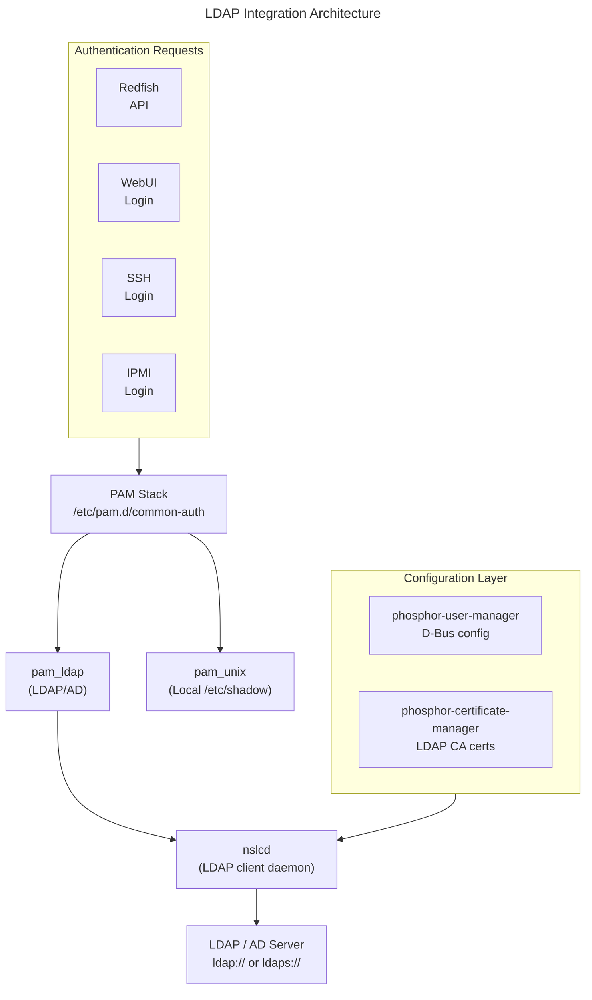

# LDAP Integration
{: .no_toc }

Authenticate BMC users against external LDAP or Active Directory servers and map directory groups to OpenBMC privilege roles.
{: .fs-6 .fw-300 }

## Table of Contents
{: .no_toc .text-delta }

1. TOC
{:toc}

---

## Overview

OpenBMC supports centralized user authentication through LDAP (Lightweight Directory Access Protocol). Instead of managing accounts locally on every BMC, you can point the BMC at an existing LDAP or Active Directory server so that users authenticate with their enterprise credentials.

**phosphor-user-manager** implements the LDAP client configuration, while **nslcd** (Name Service LDAP Connection Daemon) handles the actual LDAP communication. The Redfish `AccountService` resource exposes LDAP and Active Directory configuration, and D-Bus interfaces provide the underlying control layer.

**Key concepts covered:**
- Configuring LDAP and Active Directory authentication via Redfish and D-Bus
- Setting up LDAPS (LDAP over TLS) with trusted certificates
- Mapping LDAP groups to OpenBMC privilege roles (RoleMapping)
- Differences between OpenLDAP and Active Directory configurations
- Troubleshooting authentication failures with ldapsearch and debug logging

---

## Architecture



<details markdown="1">
<summary>ASCII-art version (for comparison)</summary>

```
┌─────────────────────────────────────────────────────────────────────────┐
│                    LDAP Integration Architecture                        │
├─────────────────────────────────────────────────────────────────────────┤
│                                                                         │
│   ┌──────────┐  ┌──────────┐  ┌──────────┐  ┌──────────┐               │
│   │ Redfish  │  │  WebUI   │  │   SSH    │  │   IPMI   │               │
│   │ API      │  │  Login   │  │  Login   │  │  Login   │               │
│   └────┬─────┘  └────┬─────┘  └────┬─────┘  └────┬─────┘               │
│        └──────────────┴──────┬──────┴──────────────┘                    │
│                              │                                          │
│                              ▼                                          │
│   ┌──────────────────────────────────────────────────────────────────┐  │
│   │                     PAM Stack                                    │  │
│   │              /etc/pam.d/common-auth                               │  │
│   └────────────────────┬───────────────────┬─────────────────────────┘  │
│                        │                   │                            │
│                        ▼                   ▼                            │
│              ┌──────────────┐     ┌──────────────┐                      │
│              │  pam_unix    │     │  pam_ldap    │                      │
│              │  (local)     │     │  (LDAP/AD)   │                      │
│              └──────────────┘     └──────┬───────┘                      │
│                                          │                              │
│                                          ▼                              │
│                                 ┌──────────────┐                        │
│                                 │    nslcd     │                        │
│                                 │ (LDAP client │                        │
│                                 │   daemon)    │                        │
│                                 └──────┬───────┘                        │
│                                        │                                │
│   ┌────────────────────────────────────┼─────────────────────────────┐  │
│   │  Configuration Layer               │                             │  │
│   │  ┌────────────────────┐  ┌────────┴───────────┐                 │  │
│   │  │ phosphor-user-mgr  │  │ phosphor-cert-mgr  │                 │  │
│   │  │ (D-Bus config)     │  │ (LDAP CA certs)    │                 │  │
│   │  └────────────────────┘  └────────────────────┘                 │  │
│   └──────────────────────────────────────────────────────────────────┘  │
│                                        │                                │
│                                        ▼                                │
│                              ┌──────────────────┐                       │
│                              │  LDAP / AD       │                       │
│                              │  Server          │                       │
│                              │  ldap:// ldaps://│                       │
│                              └──────────────────┘                       │
│                                                                         │
└─────────────────────────────────────────────────────────────────────────┘
```

</details>

### D-Bus Interfaces

| Interface | Object Path | Description |
|-----------|-------------|-------------|
| `xyz.openbmc_project.User.Ldap.Create` | `/xyz/openbmc_project/user/ldap` | Create LDAP configuration |
| `xyz.openbmc_project.User.Ldap.Config` | `/xyz/openbmc_project/user/ldap/config` | LDAP server settings |
| `xyz.openbmc_project.User.PrivilegeMapper.Create` | `/xyz/openbmc_project/user/ldap/config` | Create group-to-role mappings |
| `xyz.openbmc_project.User.PrivilegeMapperEntry` | `/xyz/openbmc_project/user/ldap/config/role_map/<id>` | Individual role mapping entry |

### Key Dependencies

- **phosphor-user-manager**: Manages LDAP configuration and group-to-role mapping on D-Bus
- **nss-pam-ldapd (nslcd)**: Performs actual LDAP queries and PAM authentication
- **phosphor-certificate-manager**: Manages LDAP CA certificates for LDAPS connections
- **bmcweb**: Exposes Redfish AccountService endpoints for LDAP/AD configuration

---

## Configuration

### Build-Time Configuration (Yocto)

```bitbake
# In your machine .conf or local.conf

# Include LDAP support packages
IMAGE_INSTALL:append = " \
    phosphor-user-manager \
    nss-pam-ldapd \
    pam-plugin-ldap \
    openldap-bin \
"

# Enable LDAP in phosphor-user-manager
EXTRA_OEMESON:pn-phosphor-user-manager = " \
    -Dldap=enabled \
"
```

{: .note }
The `openldap-bin` package provides the `ldapsearch` command-line tool, which is valuable for testing LDAP connectivity directly from the BMC.

### Configuration Files

| Config File | Path | Description |
|-------------|------|-------------|
| PAM auth config | `/etc/pam.d/common-auth` | Authentication module stack (includes pam_ldap) |
| LDAP client config | `/etc/nslcd.conf` | nslcd LDAP client settings (auto-generated) |
| NSS config | `/etc/nsswitch.conf` | Name service switch (adds ldap lookup) |
| LDAP persistence | `/var/lib/phosphor-user-manager/ldap.conf` | Persisted LDAP configuration |
| LDAP CA certs | `/etc/ssl/certs/ldap/` | Trusted CA certificates for LDAPS |

### Runtime Verification

```bash
# Verify LDAP-related services are running
systemctl status phosphor-user-manager
systemctl status nslcd

# View current LDAP configuration via D-Bus
busctl introspect xyz.openbmc_project.User.Manager \
    /xyz/openbmc_project/user/ldap

# Check nslcd configuration
cat /etc/nslcd.conf

# Check PAM is configured for LDAP
cat /etc/pam.d/common-auth
```

---

## LDAP Client Configuration

### Configure OpenLDAP via Redfish

```bash
# Enable OpenLDAP authentication
curl -k -u root:0penBmc -X PATCH \
    -H "Content-Type: application/json" \
    -d '{
        "LDAP": {
            "ServiceEnabled": true,
            "ServiceAddresses": ["ldap://ldap.example.com"],
            "Authentication": {
                "AuthenticationType": "UsernameAndPassword",
                "Username": "cn=readonly,dc=example,dc=com",
                "Password": "bindpassword"
            },
            "LDAPService": {
                "SearchSettings": {
                    "BaseDistinguishedNames": ["dc=example,dc=com"],
                    "UsernameAttribute": "uid",
                    "GroupsAttribute": "memberOf"
                }
            }
        }
    }' \
    https://localhost/redfish/v1/AccountService
```

### Configure OpenLDAP via D-Bus (busctl)

```bash
# Create LDAP configuration
busctl call xyz.openbmc_project.User.Manager \
    /xyz/openbmc_project/user/ldap \
    xyz.openbmc_project.User.Ldap.Create \
    Create sssssa{ss} \
    "ldap://ldap.example.com" \
    "cn=readonly,dc=example,dc=com" \
    "dc=example,dc=com" \
    "uid" \
    "OpenLDAP" \
    0

# Verify the configuration
busctl get-property xyz.openbmc_project.User.Manager \
    /xyz/openbmc_project/user/ldap/config \
    xyz.openbmc_project.User.Ldap.Config \
    LDAPServerURI

# Check if LDAP is enabled
busctl get-property xyz.openbmc_project.User.Manager \
    /xyz/openbmc_project/user/ldap/config \
    xyz.openbmc_project.User.Ldap.Config \
    LDAPEnabled
```

### View Current LDAP Configuration

```bash
# View full LDAP settings via Redfish
curl -k -u root:0penBmc \
    https://localhost/redfish/v1/AccountService | \
    python3 -m json.tool

# Check LDAP-specific properties
curl -k -u root:0penBmc \
    https://localhost/redfish/v1/AccountService | \
    python3 -c "
import sys, json
data = json.load(sys.stdin)
print(json.dumps(data.get('LDAP', {}), indent=2))
"
```

### Disable LDAP

```bash
# Disable via Redfish
curl -k -u root:0penBmc -X PATCH \
    -H "Content-Type: application/json" \
    -d '{"LDAP": {"ServiceEnabled": false}}' \
    https://localhost/redfish/v1/AccountService
```

---

## LDAPS Certificate Setup

{: .warning }
Using plain `ldap://` transmits credentials in cleartext. Always use `ldaps://` (LDAP over TLS) in production environments.

### Install the LDAP Server CA Certificate

The BMC must trust the CA that signed the LDAP server certificate. Upload the CA certificate through Redfish or the certificate manager.

```bash
# Upload LDAP CA certificate via Redfish
curl -k -u root:0penBmc -X POST \
    -H "Content-Type: application/json" \
    -d '{
        "CertificateType": "PEM",
        "CertificateString": "-----BEGIN CERTIFICATE-----\nMIIDrzCCApeg...\n-----END CERTIFICATE-----"
    }' \
    https://localhost/redfish/v1/AccountService/LDAP/Certificates
```

### Switch to LDAPS

After installing the CA certificate, update the service address to use `ldaps://`:

```bash
# Update LDAP URI to use TLS
curl -k -u root:0penBmc -X PATCH \
    -H "Content-Type: application/json" \
    -d '{
        "LDAP": {
            "ServiceAddresses": ["ldaps://ldap.example.com"]
        }
    }' \
    https://localhost/redfish/v1/AccountService
```

### Verify TLS Connection

```bash
# Test TLS handshake to the LDAP server
openssl s_client -connect ldap.example.com:636 \
    -CAfile /etc/ssl/certs/ldap/ca.pem

# Test LDAPS with ldapsearch
ldapsearch -x -H ldaps://ldap.example.com \
    -D "cn=readonly,dc=example,dc=com" \
    -w bindpassword \
    -b "dc=example,dc=com" \
    "(uid=testuser)"
```

{: .tip }
If the LDAP server uses a self-signed certificate, you must upload that specific certificate as the CA cert. For certificates signed by an internal CA, upload the root CA certificate (and any intermediates) that form the trust chain.

---

## Group-to-Privilege Mapping (RoleMapping)

LDAP group membership determines the OpenBMC privilege level. You create role mappings that associate an LDAP group distinguished name (DN) with a local role.

### Available Roles

| Local Role | Redfish RoleId | IPMI Privilege | Description |
|------------|----------------|----------------|-------------|
| priv-admin | Administrator | 4 (admin) | Full access, user management |
| priv-operator | Operator | 3 (operator) | Operations, no user management |
| priv-user | ReadOnly | 2 (user) | Read-only access |
| priv-callback | Callback | 1 (callback) | Limited callback access |

### Create Role Mappings via Redfish

```bash
# Map "bmc-admins" LDAP group to Administrator role
curl -k -u root:0penBmc -X POST \
    -H "Content-Type: application/json" \
    -d '{
        "RemoteGroup": "cn=bmc-admins,ou=groups,dc=example,dc=com",
        "LocalRole": "Administrator"
    }' \
    https://localhost/redfish/v1/AccountService/LDAP/RemoteRoleMapping

# Map "bmc-operators" LDAP group to Operator role
curl -k -u root:0penBmc -X POST \
    -H "Content-Type: application/json" \
    -d '{
        "RemoteGroup": "cn=bmc-operators,ou=groups,dc=example,dc=com",
        "LocalRole": "Operator"
    }' \
    https://localhost/redfish/v1/AccountService/LDAP/RemoteRoleMapping

# Map "bmc-readonly" LDAP group to ReadOnly role
curl -k -u root:0penBmc -X POST \
    -H "Content-Type: application/json" \
    -d '{
        "RemoteGroup": "cn=bmc-readonly,ou=groups,dc=example,dc=com",
        "LocalRole": "ReadOnly"
    }' \
    https://localhost/redfish/v1/AccountService/LDAP/RemoteRoleMapping
```

### Create Role Mappings via D-Bus

```bash
# Create a privilege mapping entry
busctl call xyz.openbmc_project.User.Manager \
    /xyz/openbmc_project/user/ldap/config \
    xyz.openbmc_project.User.PrivilegeMapper.Create \
    Create ss \
    "cn=bmc-admins,ou=groups,dc=example,dc=com" \
    "priv-admin"
```

### View Existing Mappings

```bash
# List role mappings via Redfish
curl -k -u root:0penBmc \
    https://localhost/redfish/v1/AccountService | \
    python3 -c "
import sys, json
data = json.load(sys.stdin)
ldap = data.get('LDAP', {})
for mapping in ldap.get('RemoteRoleMapping', []):
    print(f\"Group: {mapping['RemoteGroup']} -> Role: {mapping['LocalRole']}\")
"

# List mappings via D-Bus
busctl tree xyz.openbmc_project.User.Manager | grep role_map
```

### Delete a Role Mapping

```bash
# Delete via D-Bus (replace <id> with the mapping ID)
busctl call xyz.openbmc_project.User.Manager \
    /xyz/openbmc_project/user/ldap/config/role_map/<id> \
    xyz.openbmc_project.Object.Delete \
    Delete
```

---

## Active Directory vs OpenLDAP

OpenBMC supports both Active Directory and OpenLDAP. The Redfish AccountService provides separate configuration objects for each.

### Key Differences

| Attribute | OpenLDAP | Active Directory |
|-----------|----------|------------------|
| Redfish property | `LDAP` | `ActiveDirectory` |
| D-Bus server type | `OpenLDAP` | `ActiveDirectory` |
| Username attribute | `uid` | `sAMAccountName` |
| Groups attribute | `memberOf` | `memberOf` |
| Bind DN format | `cn=admin,dc=example,dc=com` | `admin@example.com` or `DOMAIN\admin` |
| Base DN format | `dc=example,dc=com` | `DC=example,DC=com` |
| Default port (TLS) | 636 | 636 |
| Default port (plain) | 389 | 389 |
| Group DN format | `cn=group,ou=groups,dc=example,dc=com` | `CN=group,OU=Groups,DC=example,DC=com` |

{: .note }
You can enable either LDAP or Active Directory, but not both simultaneously. Enabling one disables the other.

### Configure Active Directory via Redfish

```bash
# Configure Active Directory
curl -k -u root:0penBmc -X PATCH \
    -H "Content-Type: application/json" \
    -d '{
        "ActiveDirectory": {
            "ServiceEnabled": true,
            "ServiceAddresses": ["ldaps://ad.example.com"],
            "Authentication": {
                "AuthenticationType": "UsernameAndPassword",
                "Username": "svc-bmc@example.com",
                "Password": "ServiceAccountPassword"
            },
            "LDAPService": {
                "SearchSettings": {
                    "BaseDistinguishedNames": ["DC=example,DC=com"],
                    "UsernameAttribute": "sAMAccountName",
                    "GroupsAttribute": "memberOf"
                }
            }
        }
    }' \
    https://localhost/redfish/v1/AccountService
```

### Active Directory Role Mapping

```bash
# Map AD security group to Administrator
curl -k -u root:0penBmc -X POST \
    -H "Content-Type: application/json" \
    -d '{
        "RemoteGroup": "CN=BMC-Admins,OU=Security Groups,DC=example,DC=com",
        "LocalRole": "Administrator"
    }' \
    https://localhost/redfish/v1/AccountService/ActiveDirectory/RemoteRoleMapping
```

{: .tip }
When using Active Directory, the bind account (`Username`) should be a dedicated service account with read-only access to the directory. Use the UPN format (`user@domain.com`) for the bind DN, as it works across all AD forests.

---

## Porting Guide

Follow these steps to enable LDAP authentication on your platform.

### Step 1: Prerequisites

Ensure you have:
- [ ] A working OpenBMC build for your platform
- [ ] An accessible LDAP or Active Directory server
- [ ] A bind/service account with read permissions on the directory
- [ ] The CA certificate for the LDAP server (for LDAPS)

### Step 2: Add LDAP Packages to Your Image

```bitbake
# meta-myplatform/conf/machine/myplatform.conf (or local.conf)
IMAGE_INSTALL:append = " \
    phosphor-user-manager \
    nss-pam-ldapd \
    pam-plugin-ldap \
    openldap-bin \
"

EXTRA_OEMESON:pn-phosphor-user-manager = " \
    -Dldap=enabled \
"
```

### Step 3: Configure Default PAM Stack

Create a bbappend to deploy a PAM configuration that includes LDAP:

```bash
# meta-myplatform/recipes-phosphor/users/phosphor-user-manager/
# └── files/
# │   └── common-auth
# └── phosphor-user-manager_%.bbappend

cat > phosphor-user-manager_%.bbappend << 'EOF'
FILESEXTRAPATHS:prepend := "${THISDIR}/files:"
SRC_URI += "file://common-auth"

do_install:append() {
    install -d ${D}${sysconfdir}/pam.d
    install -m 0644 ${WORKDIR}/common-auth ${D}${sysconfdir}/pam.d/
}
EOF
```

Example `common-auth` with LDAP:

```
# /etc/pam.d/common-auth
auth sufficient pam_unix.so nullok try_first_pass
auth sufficient pam_ldap.so use_first_pass
auth required   pam_deny.so
```

### Step 4: Bake Default nslcd Configuration (Optional)

To include a factory-default LDAP configuration:

```bash
# meta-myplatform/recipes-phosphor/users/nss-pam-ldapd/
# └── files/
# │   └── nslcd.conf
# └── nss-pam-ldapd_%.bbappend

cat > nss-pam-ldapd_%.bbappend << 'EOF'
FILESEXTRAPATHS:prepend := "${THISDIR}/files:"
SRC_URI += "file://nslcd.conf"

do_install:append() {
    install -m 0600 ${WORKDIR}/nslcd.conf ${D}${sysconfdir}/
}
EOF
```

### Step 5: Build, Flash, and Verify

```bash
# Build the image
bitbake obmc-phosphor-image

# After flashing, verify services are running
systemctl status phosphor-user-manager
systemctl status nslcd

# Configure LDAP via Redfish (see Configuration section above)
# Then test authentication
curl -k -u ldapuser:ldappassword \
    https://localhost/redfish/v1/SessionService/Sessions
```

---

## Code Examples

### Example 1: LDAP Configuration Script

```bash
#!/bin/bash
# configure-ldap.sh - Configure LDAP authentication on OpenBMC
# Usage: ./configure-ldap.sh <bmc-host> <ldap-server> <bind-dn> <base-dn>

BMC_HOST="${1:-localhost}"
LDAP_SERVER="${2:-ldaps://ldap.example.com}"
BIND_DN="${3:-cn=readonly,dc=example,dc=com}"
BASE_DN="${4:-dc=example,dc=com}"
BMC_USER="root"
BMC_PASS="0penBmc"

echo "Configuring LDAP on ${BMC_HOST}..."

# Step 1: Enable LDAP
curl -k -u "${BMC_USER}:${BMC_PASS}" -X PATCH \
    -H "Content-Type: application/json" \
    -d "{
        \"LDAP\": {
            \"ServiceEnabled\": true,
            \"ServiceAddresses\": [\"${LDAP_SERVER}\"],
            \"Authentication\": {
                \"AuthenticationType\": \"UsernameAndPassword\",
                \"Username\": \"${BIND_DN}\",
                \"Password\": \"changeme\"
            },
            \"LDAPService\": {
                \"SearchSettings\": {
                    \"BaseDistinguishedNames\": [\"${BASE_DN}\"],
                    \"UsernameAttribute\": \"uid\",
                    \"GroupsAttribute\": \"memberOf\"
                }
            }
        }
    }" \
    "https://${BMC_HOST}/redfish/v1/AccountService"

# Step 2: Add role mappings
for role_pair in \
    "cn=bmc-admins,ou=groups,${BASE_DN}:Administrator" \
    "cn=bmc-operators,ou=groups,${BASE_DN}:Operator" \
    "cn=bmc-readonly,ou=groups,${BASE_DN}:ReadOnly"; do

    group="${role_pair%%:*}"
    role="${role_pair##*:}"

    echo "Mapping group '${group}' to role '${role}'..."
    curl -k -u "${BMC_USER}:${BMC_PASS}" -X POST \
        -H "Content-Type: application/json" \
        -d "{
            \"RemoteGroup\": \"${group}\",
            \"LocalRole\": \"${role}\"
        }" \
        "https://${BMC_HOST}/redfish/v1/AccountService/LDAP/RemoteRoleMapping"
done

echo "LDAP configuration complete."
```

### Example 2: LDAP Connection Test Script

```bash
#!/bin/bash
# test-ldap.sh - Test LDAP connectivity and authentication from BMC
# Usage: ./test-ldap.sh <ldap-server> <bind-dn> <base-dn> <test-user>

LDAP_SERVER="${1:-ldaps://ldap.example.com}"
BIND_DN="${2:-cn=readonly,dc=example,dc=com}"
BASE_DN="${3:-dc=example,dc=com}"
TEST_USER="${4:-testuser}"

echo "=== Testing LDAP connection ==="
echo "Server: ${LDAP_SERVER}"
echo "Bind DN: ${BIND_DN}"
echo "Base DN: ${BASE_DN}"
echo ""

# Test 1: Anonymous bind (if allowed)
echo "--- Test 1: Server reachability ---"
ldapsearch -x -H "${LDAP_SERVER}" \
    -b "" -s base "(objectClass=*)" namingContexts 2>&1
echo ""

# Test 2: Authenticated bind
echo "--- Test 2: Bind authentication ---"
read -s -p "Enter bind password: " BIND_PASS
echo ""
ldapsearch -x -H "${LDAP_SERVER}" \
    -D "${BIND_DN}" \
    -w "${BIND_PASS}" \
    -b "${BASE_DN}" \
    "(uid=${TEST_USER})" uid cn memberOf 2>&1
echo ""

# Test 3: Check group membership
echo "--- Test 3: Group membership ---"
ldapsearch -x -H "${LDAP_SERVER}" \
    -D "${BIND_DN}" \
    -w "${BIND_PASS}" \
    -b "${BASE_DN}" \
    "(uid=${TEST_USER})" memberOf 2>&1
```

See the complete examples at [examples/ldap/](https://github.com/MichaelTien8901/openbmc-guide-tutorial/tree/master/docs/examples/ldap/).

---

## Troubleshooting

### Issue: LDAP Authentication Fails

**Symptom**: Users cannot log in with LDAP credentials. Redfish returns 401 Unauthorized.

**Cause**: LDAP configuration may be incorrect, the bind account may lack permissions, or the server may be unreachable.

**Solution**:

1. Verify LDAP is enabled:
   ```bash
   curl -k -u root:0penBmc \
       https://localhost/redfish/v1/AccountService | \
       python3 -c "import sys,json; print(json.load(sys.stdin).get('LDAP',{}).get('ServiceEnabled'))"
   ```

2. Test LDAP connectivity from the BMC:
   ```bash
   ldapsearch -x -H ldap://ldap.example.com \
       -D "cn=readonly,dc=example,dc=com" \
       -w bindpassword \
       -b "dc=example,dc=com" \
       "(uid=testuser)"
   ```

3. Check nslcd logs:
   ```bash
   journalctl -u nslcd -f
   ```

### Issue: LDAPS Certificate Not Trusted

**Symptom**: LDAPS connections fail with "TLS handshake failure" or "certificate verify failed".

**Cause**: The BMC does not trust the CA that signed the LDAP server certificate.

**Solution**:

1. Verify the LDAP server certificate:
   ```bash
   openssl s_client -connect ldap.example.com:636 \
       -CAfile /etc/ssl/certs/ldap/ca.pem
   ```

2. Upload the CA certificate:
   ```bash
   curl -k -u root:0penBmc -X POST \
       -H "Content-Type: application/json" \
       -d '{
           "CertificateType": "PEM",
           "CertificateString": "-----BEGIN CERTIFICATE-----\n...\n-----END CERTIFICATE-----"
       }' \
       https://localhost/redfish/v1/AccountService/LDAP/Certificates
   ```

3. Restart nslcd after installing the certificate:
   ```bash
   systemctl restart nslcd
   ```

{: .warning }
If the LDAP server certificate has expired or uses an untrusted CA, authentication will fail silently. Always check certificate validity dates with `openssl x509 -in cert.pem -noout -dates`.

### Issue: Role Mapping Not Applied

**Symptom**: LDAP users authenticate successfully but receive no privileges or the wrong privilege level.

**Cause**: Group-to-role mappings are missing, or the LDAP group DN in the mapping does not match the group DN returned by the server.

**Solution**:

1. Verify the user's group membership on the LDAP server:
   ```bash
   ldapsearch -x -H ldap://ldap.example.com \
       -D "cn=readonly,dc=example,dc=com" \
       -w bindpassword \
       -b "dc=example,dc=com" \
       "(uid=testuser)" memberOf
   ```

2. Compare the returned group DN with your role mapping. The DN must match exactly (case-sensitive for OpenLDAP):
   ```bash
   curl -k -u root:0penBmc \
       https://localhost/redfish/v1/AccountService | \
       python3 -c "
   import sys, json
   data = json.load(sys.stdin)
   for m in data.get('LDAP',{}).get('RemoteRoleMapping',[]):
       print(f\"{m['RemoteGroup']} -> {m['LocalRole']}\")
   "
   ```

3. If the DNs do not match, delete the incorrect mapping and create a new one with the correct group DN.

### Issue: nslcd Service Not Running

**Symptom**: All LDAP authentication attempts fail. The `nslcd` service shows as inactive.

**Cause**: The nslcd service may have failed to start due to a bad configuration or missing dependencies.

**Solution**:

```bash
# Check nslcd status
systemctl status nslcd

# View startup logs
journalctl -u nslcd --no-pager

# Restart the service
systemctl restart nslcd

# Verify nslcd config is valid
cat /etc/nslcd.conf
```

### Debug Commands

```bash
# Enable debug logging for phosphor-user-manager
# (Requires recompile with debug flags or environment override)
journalctl -u phosphor-user-manager -f

# Check nslcd debug output
systemctl stop nslcd
nslcd -d  # Run in foreground with debug output

# Test PAM authentication directly
pamtester common-auth testuser authenticate

# Inspect D-Bus LDAP objects
busctl tree xyz.openbmc_project.User.Manager
busctl introspect xyz.openbmc_project.User.Manager \
    /xyz/openbmc_project/user/ldap/config

# List all role mapping entries
busctl tree xyz.openbmc_project.User.Manager | grep role_map
```

{: .tip }
Running `nslcd -d` in the foreground shows detailed LDAP communication traces, including bind attempts, search filters, and TLS negotiation. This is the single most useful debugging tool for LDAP issues.

---

## Deep Dive
{: .text-delta }

Advanced implementation details for LDAP integration developers.

### LDAP Authentication Flow

```
┌─────────────────────────────────────────────────────────────────────────┐
│                    LDAP Authentication Sequence                         │
├─────────────────────────────────────────────────────────────────────────┤
│                                                                         │
│   Client (Redfish/SSH)       BMC                    LDAP Server         │
│          │                    │                          │              │
│   1. Login request            │                          │              │
│   (user + password)           │                          │              │
│   ──────────────────────────▶ │                          │              │
│                               │                          │              │
│          PAM Stack            │                          │              │
│          ┌────────────────────┤                          │              │
│          │ pam_unix: check    │                          │              │
│          │ /etc/shadow        │                          │              │
│          │ -> NOT FOUND       │                          │              │
│          ├────────────────────┤                          │              │
│          │ pam_ldap: try LDAP │                          │              │
│          └────────────────────┤                          │              │
│                               │                          │              │
│                               │  2. Bind (service acct)  │              │
│                               │─────────────────────────▶│              │
│                               │◀─────────────────────────│ Bind OK     │
│                               │                          │              │
│                               │  3. Search (find user)   │              │
│                               │  filter: (uid=username)  │              │
│                               │─────────────────────────▶│              │
│                               │◀─────────────────────────│ User DN     │
│                               │                          │              │
│                               │  4. Bind (user DN + pw)  │              │
│                               │─────────────────────────▶│              │
│                               │◀─────────────────────────│ Auth OK     │
│                               │                          │              │
│                               │  5. Search (groups)      │              │
│                               │  filter: (member=userDN) │              │
│                               │─────────────────────────▶│              │
│                               │◀─────────────────────────│ Group list  │
│                               │                          │              │
│          6. Map groups to     │                          │              │
│             OpenBMC roles     │                          │              │
│          (role_map entries)   │                          │              │
│                               │                          │              │
│   7. Session created with     │                          │              │
│      mapped privilege level   │                          │              │
│   ◀────────────────────────── │                          │              │
│                                                                         │
└─────────────────────────────────────────────────────────────────────────┘
```

### LDAP Configuration Persistence

```
┌─────────────────────────────────────────────────────────────────────────┐
│                    Configuration Persistence Flow                       │
├─────────────────────────────────────────────────────────────────────────┤
│                                                                         │
│   Redfish PATCH /AccountService                                         │
│          │                                                              │
│          ▼                                                              │
│   ┌─────────────────────────────────────────────────────────────────┐   │
│   │  bmcweb                                                         │   │
│   │  Translates Redfish to D-Bus calls                              │   │
│   └────────────────────────────┬────────────────────────────────────┘   │
│                                │                                        │
│                                ▼                                        │
│   ┌─────────────────────────────────────────────────────────────────┐   │
│   │  phosphor-user-manager                                          │   │
│   │                                                                 │   │
│   │  1. Validate configuration parameters                           │   │
│   │  2. Persist to /var/lib/phosphor-user-manager/ldap.conf         │   │
│   │  3. Generate /etc/nslcd.conf from D-Bus properties              │   │
│   │  4. Restart nslcd service                                       │   │
│   │  5. Emit D-Bus PropertiesChanged signal                         │   │
│   └─────────────────────────────────────────────────────────────────┘   │
│                                                                         │
│   Persisted Files:                                                      │
│   ├── /var/lib/phosphor-user-manager/ldap.conf  (D-Bus state)          │
│   ├── /etc/nslcd.conf                           (runtime config)       │
│   └── /etc/ssl/certs/ldap/                      (CA certificates)      │
│                                                                         │
│   After BMC reboot:                                                     │
│   phosphor-user-manager reads /var/lib/.../ldap.conf                    │
│   and regenerates /etc/nslcd.conf                                       │
│                                                                         │
└─────────────────────────────────────────────────────────────────────────┘
```

### Source Code Reference

Key implementation files in [phosphor-user-manager](https://github.com/openbmc/phosphor-user-manager):

| File | Description |
|------|-------------|
| `user_mgr.cpp` | Main user manager, orchestrates local and LDAP users |
| `ldap_config.cpp` | LDAP configuration object (server URI, bind DN, base DN) |
| `ldap_config_mgr.cpp` | LDAP config manager, handles create/delete of LDAP configs |
| `ldap_mapper.cpp` | Group-to-privilege mapping (PrivilegeMapper interface) |
| `utils.cpp` | Utility functions for nslcd config generation |

Related bmcweb implementation:

| File | Description |
|------|-------------|
| `redfish-core/lib/account_service.hpp` | Redfish AccountService handlers for LDAP/AD config |

---

## References

### Official Resources
- [phosphor-user-manager](https://github.com/openbmc/phosphor-user-manager)
- [phosphor-certificate-manager](https://github.com/openbmc/phosphor-certificate-manager)
- [D-Bus Interface: User.Ldap](https://github.com/openbmc/phosphor-dbus-interfaces/tree/master/yaml/xyz/openbmc_project/User)
- [OpenBMC User Management Design](https://github.com/openbmc/docs/blob/master/architecture/user-management.md)

### Related Guides
- [User Manager Guide]()
- [Certificate Manager Guide]()
- [Network Guide]()

### External Documentation
- [Redfish AccountService Schema](https://redfish.dmtf.org/schemas/AccountService.v1_10_0.json)
- [nss-pam-ldapd (nslcd)](https://arthurdejong.org/nss-pam-ldapd/)
- [OpenLDAP Documentation](https://www.openldap.org/doc/)

---

{: .note }
**Tested on**: OpenBMC master, QEMU ast2600-evb
