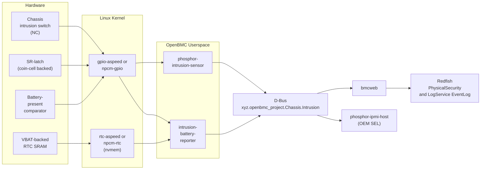
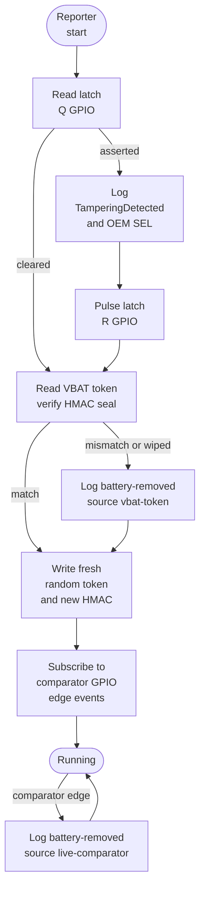
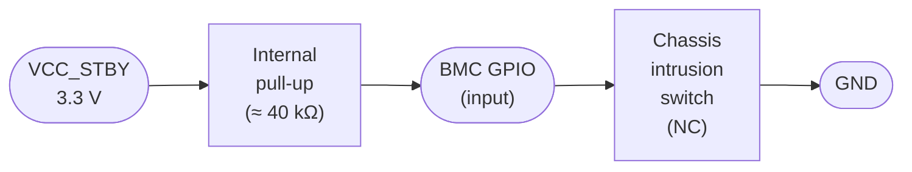
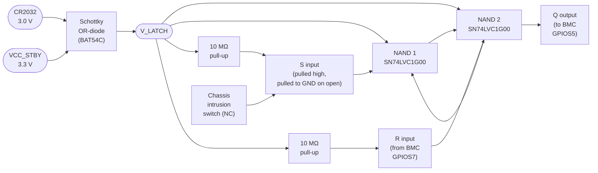
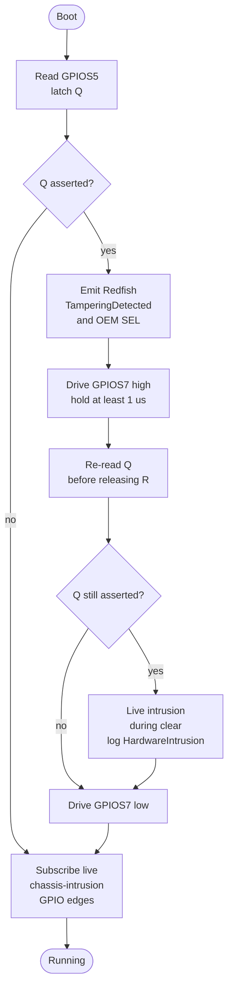
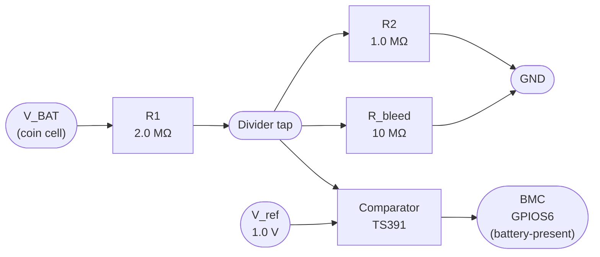

# Intrusion Detection Guide
{: .no_toc }

Wire, configure, and verify chassis intrusion, BMC tamper input, and battery-removal detection end-to-end on OpenBMC.
{: .fs-6 .fw-300 }

## Table of Contents
{: .no_toc .text-delta }

1. TOC
{:toc}

---

## Overview

Physical-security detection is a standard requirement on server-class hardware, but OpenBMC's upstream components only cover the live-switch case. This guide covers the full stack — hardware, kernel, D-Bus, Redfish, and IPMI — across three surfaces that a platform port needs to get right:

1. **Chassis intrusion switch** — the mechanical normally-closed switch on the chassis, wired to a BMC GPIO and monitored by `phosphor-intrusion-sensor`.
2. **BMC detection port** — the dedicated tamper/intrusion GPIOs on the BMC SoC, including pinmux, pull configuration, and line-name conventions. Covered for Aspeed AST2600 (primary, QEMU-verified) and with porting tables for AST2700 and Nuvoton NPCM7xx/NPCM8xx.
3. **Hardware with a backup battery** — a coin-cell-backed latch that captures intrusion even while the system is unpowered, plus two complementary battery-removal detectors covering both runtime and power-off threat windows.

**Key concepts covered:**

- NC / active-low GPIO wiring and why the failure mode matters
- `phosphor-intrusion-sensor` + Entity Manager configuration
- SR-latch read-and-clear boot sequence
- VBAT-backed SRAM token protocol (authoritative power-off detection)
- Redfish `PhysicalSecurity.IntrusionSensor` and OEM IPMI SEL mapping
- QEMU `gpio-mockup` verification of every event path

---

## Architecture

### Primary Data Flow



### Companion Reporter Event Paths

The companion reporter (`intrusion-battery-reporter`) is a small service this guide introduces to cover everything above the scope of upstream `phosphor-intrusion-sensor`:



### D-Bus Interfaces

| Interface | Object Path | Source | Description |
|-----------|-------------|--------|-------------|
| `xyz.openbmc_project.Chassis.Intrusion` | `/xyz/openbmc_project/Intrusion/Chassis_Intrusion` | **Upstream** (`dbus-sensors`) | Live chassis switch state |
| `xyz.openbmc_project.Chassis.Intrusion` | `/xyz/openbmc_project/Intrusion/Chassis_Latch` | **This guide** | Latched intrusion from previous power cycle |
| `xyz.openbmc_project.Chassis.Intrusion` | `/xyz/openbmc_project/Intrusion/Battery_Present` | **This guide** | Coin-cell presence (merged live + power-off) |
| `xyz.openbmc_project.Logging.Entry` | `/xyz/openbmc_project/logging/entry/*` | Upstream | Per-event Redfish log entries |

### Key Dependencies

- **`phosphor-intrusion-sensor`** (in [`dbus-sensors`](https://github.com/openbmc/dbus-sensors)): Upstream daemon that owns the live chassis intrusion D-Bus object.
- **`entity-manager`**: Declares the intrusion and battery-presence sensors to the daemon and the reporter.
- **`bmcweb`**: Maps `Chassis.Intrusion` to Redfish `PhysicalSecurity.IntrusionSensor`.
- **`rtc-aspeed` / Nuvoton RTC driver**: Exposes the SoC's VBAT-backed SRAM as an nvmem device under `/sys/bus/nvmem/devices/`.

---

## Chassis Intrusion Switch

### Wiring



**Convention:** the switch is normally-closed (NC) — closed when the chassis is intact, open when the chassis is opened. Because the BMC's internal pull-up is enabled, the GPIO reads **low** when the chassis is closed (switch shorts the input to ground) and **high** when the chassis is opened (switch releases and the pull-up drives the input high). This is the "active-low, invert-in-software" convention that `phosphor-intrusion-sensor` already handles via its `GpioInverted` flag.

### Failure Mode

The NC / active-low wiring was chosen deliberately. With this convention, any **open-circuit fault** (broken wire, corroded connector, cold solder) reads as *intrusion* — the safe failure mode for a security feature. A normally-open switch with an external pull-down would have the opposite failure mode: a broken wire would read as "chassis closed", silently hiding real intrusion events.

{: .warning }
**Do not wire the switch as normally-open with an external pull-down.** A broken wire or corroded contact will read as "chassis closed" and silently hide real intrusion events. Always use NC with the BMC's internal pull-up.

### Device Tree

Add the three intrusion-related GPIO line names and a pinmux stanza to your machine DTS. For AST2600:

```dts
&gpio0 {
    gpio-line-names =
        /* ... existing 208 entries ... */
        "chassis-intrusion",       /* GPIO bank/offset — see Section 4 */
        "intrusion-latch-q",
        "battery-present";
};

&pinctrl {
    pinctrl_intrusion_default: intrusion_default {
        pins = "GPIOS4", "GPIOS5", "GPIOS6";
        bias-pull-up;
        input-enable;
    };
};
```

### Entity Manager Configuration

Add an `Exposes` entry of the upstream `GpioIntrusionSensor` type. The minimum assertion window of 5 seconds matches the upstream default debounce behavior for chassis intrusion.

```json
{
    "Exposes": [
        {
            "Name": "Chassis_Intrusion",
            "Type": "GpioIntrusionSensor",
            "GpioInverted": true,
            "Polarity": "Low",
            "Pin": "chassis-intrusion",
            "MinAssertInterval": 5
        }
    ]
}
```

### Verify on D-Bus

```console
# busctl tree xyz.openbmc_project.IntrusionSensor
└─ /xyz
  └─ /xyz/openbmc_project
    └─ /xyz/openbmc_project/Intrusion
      └─ /xyz/openbmc_project/Intrusion/Chassis_Intrusion

# busctl introspect xyz.openbmc_project.IntrusionSensor \
    /xyz/openbmc_project/Intrusion/Chassis_Intrusion | grep Status
.Status                  property  s  "Normal" emits-change writable
```

---

## BMC Detection Port (AST2600 Primary)

AST2600 exposes ~200 GPIOs split across banks A through AC. For intrusion inputs, pick pins that:

- Are free of pinmux conflicts with your platform's LPC / eSPI / I²C / SGPIO usage
- Are on GPIO controllers that support `bias-pull-up` (all general-purpose banks do)
- Have direct 3.3 V tolerance (GPIOH/I and similar are 1.8 V — avoid these for chassis wiring)

### Example Triplet Used Throughout This Guide

| Signal | GPIO | Kernel line-name |
|--------|------|------------------|
| Chassis intrusion | `GPIOS4` | `chassis-intrusion` |
| Latch Q (read) | `GPIOS5` | `intrusion-latch-q` |
| Battery present (live comparator) | `GPIOS6` | `battery-present` |

A fourth GPIO drives the latch reset (**R**) line — this is an output from the BMC, not an input. The example uses `GPIOS7` / `intrusion-latch-r`.

### Full AST2600 DT Fragment

```dts
&pinctrl {
    pinctrl_intrusion_default: intrusion_default {
        pins = "GPIOS4", "GPIOS5", "GPIOS6", "GPIOS7";
        bias-pull-up;
    };
};

&gpio0 {
    pinctrl-names = "default";
    pinctrl-0 = <&pinctrl_intrusion_default>;

    gpio-line-names =
        /* GPIOS0..S3 = existing */
        "", "", "", "",
        "chassis-intrusion",
        "intrusion-latch-q",
        "battery-present",
        "intrusion-latch-r";
};

chosen-intrusion {
    compatible = "gpio-keys";
    chassis-intrusion {
        label = "chassis-intrusion";
        gpios = <&gpio0 ASPEED_GPIO(S, 4) GPIO_ACTIVE_LOW>;
        linux,code = <KEY_VENDOR>;
        linux,can-disable;
    };
};
```

### Verify on the Running Kernel

```console
# gpioinfo | grep -E "chassis-intrusion|intrusion-latch|battery-present"
    line  148: "chassis-intrusion"    input  active-low  [used]
    line  149: "intrusion-latch-q"    input  active-high [used]
    line  150: "battery-present"      input  active-high [used]
    line  151: "intrusion-latch-r"    output active-high [used]

# cat /sys/kernel/debug/gpio | grep intrusion
 gpio-148 (chassis-intrusion    |gpio-keys      ) in  hi IRQ
 gpio-149 (intrusion-latch-q    |reporter       ) in  hi IRQ
 gpio-150 (battery-present      |reporter       ) in  hi IRQ
 gpio-151 (intrusion-latch-r    |reporter       ) out lo
```

---

## Porting to AST2700 and Nuvoton NPCM

{: .note }
Only the AST2600 path is QEMU-verified by this guide. The device-tree fragments below are drawn from upstream Linux bindings but have not been run on hardware by the guide authors. Treat them as a porting starting point; validate against your SoC's pinmux reference.

The software stack above the GPIO layer (`phosphor-intrusion-sensor`, Entity Manager, `intrusion-battery-reporter`, Redfish mapping, OEM IPMI SEL) is SoC-agnostic and does **not** change across targets. Only the device tree — pinctrl driver name, pinmux group syntax, bias properties, GPIO numbering — changes.

### SoC Comparison

| Aspect | AST2600 | AST2700 | Nuvoton NPCM7xx (Poleg) | Nuvoton NPCM8xx (Arbel) |
|--------|---------|---------|-------------------------|--------------------------|
| Pinctrl driver | `pinctrl-aspeed-g6` | `pinctrl-aspeed-g7` | `pinctrl-npcm7xx` | `pinctrl-npcm8xx` |
| Pin naming | `GPIOS4` symbolic | `GPIOS4` symbolic | Numeric pin (e.g. `gpio32`) | Numeric pin (e.g. `gpio64`) |
| Bias property | `bias-pull-up` | `bias-pull-up` | `bias-pull-up` | `bias-pull-up` |
| GPIO controller node | `&gpio0` | `&gpio0` | `&gpio1` (GPIO bank 1) | `&gpio2` |
| Vendor pinmux doc | AST2600 datasheet §5 | AST2700 datasheet §5 | NPCM7xx pinmux app note | NPCM8xx pinmux app note |
| Upstream bindings | `Documentation/devicetree/bindings/pinctrl/aspeed,*.yaml` | same | `nuvoton,npcm7xx-pinctrl.txt` | `nuvoton,npcm845-pinctrl.yaml` |

### AST2700 Device Tree Fragment

```dts
&pinctrl0 {
    pinctrl_intrusion_default: intrusion_default {
        pins = "GPIOS4", "GPIOS5", "GPIOS6", "GPIOS7";
        bias-pull-up;
    };
};

&gpio0 {
    pinctrl-names = "default";
    pinctrl-0 = <&pinctrl_intrusion_default>;
    gpio-line-names =
        /* offset 148 onward */
        "chassis-intrusion", "intrusion-latch-q",
        "battery-present",   "intrusion-latch-r";
};
```

AST2700 reuses the symbolic `GPIOSx` naming scheme from AST2600 — port by changing only the `pinctrl-aspeed-g6` compatible to `pinctrl-aspeed-g7`.

### Nuvoton NPCM7xx (Poleg) Device Tree Fragment

```dts
&pinctrl {
    intrusion_pins: intrusion_pins {
        pins = "gpio32", "gpio33", "gpio34", "gpio35";
        bias-pull-up;
    };
};

&gpio1 {
    pinctrl-names = "default";
    pinctrl-0 = <&intrusion_pins>;
    gpio-line-names =
        "chassis-intrusion", "intrusion-latch-q",
        "battery-present",   "intrusion-latch-r";
};
```

NPCM7xx uses numeric pin identifiers and splits GPIOs across multiple controller nodes (`gpio0` through `gpio7`). Consult `nuvoton,npcm7xx-pinctrl.txt` in the kernel tree for the pin-to-controller mapping.

### Nuvoton NPCM8xx (Arbel) Device Tree Fragment

```dts
&pinctrl {
    intrusion_pins: intrusion_pins {
        pinmux = <NPCM845_PIN(64, 0) NPCM845_PIN(65, 0)
                  NPCM845_PIN(66, 0) NPCM845_PIN(67, 0)>;
        bias-pull-up;
    };
};

&gpio2 {
    pinctrl-names = "default";
    pinctrl-0 = <&intrusion_pins>;
    gpio-line-names =
        "chassis-intrusion", "intrusion-latch-q",
        "battery-present",   "intrusion-latch-r";
};
```

NPCM8xx uses the `NPCM845_PIN(pin, func)` macro for pinmux. See `nuvoton,npcm845-pinctrl.yaml`.

### What Stays the Same

{: .note }
Everything above the device-tree layer is unchanged when you port this guide to a different SoC: Entity Manager JSON, `phosphor-intrusion-sensor` build options, the companion reporter source, Redfish mapping, and the OEM IPMI SEL layout. Only the DT fragments and the SoC's nvmem device path change.

---

## Battery-Backed Intrusion Latch

A chassis intrusion that happens while the system is unpowered cannot be seen by a running daemon — there is no running daemon. The solution is a discrete SR-latch powered continuously from a coin cell, so that opening the chassis **sets** the latch and the BMC reads the latched state on the next boot.

### Reference Schematic



### Bill of Materials

| Qty | Part | Role | Target |
|-----|------|------|--------|
| 1   | `SN74LVC1G00` × 2 (or one dual-NAND) | Cross-coupled NAND SR-latch | I_cc typ ≤ 1 µA at 3 V |
| 2   | `BAT54C` Schottky (common-cathode) | OR coin-cell with VCC_STBY | V_f ≈ 0.3 V @ 1 µA |
| 2   | 10 MΩ 0402 resistor | S and R pull-ups | Keep quiescent drain minimal |
| 1   | 100 nF 0402 ceramic | Supply decoupling on V_LATCH | Noise immunity |
| 1   | CR2032 coin cell + holder | Latch backup power | 220 mAh nominal |

**Target quiescent current from the coin cell: < 5 µA.** At that draw, a nominal 220 mAh CR2032 provides ~5 years of shelf life before the latch becomes unreliable. The reporter MAY emit a `BatteryLow` advisory event when the VCC_STBY rail samples the coin cell below 2.5 V via the comparator of the next section.

{: .warning }
**Reference only.** The schematic above is pedagogical and has not been layout-verified. Validate ESD clamps on the switch line (the switch may see ±8 kV IEC 61000-4-2 discharge through the chassis), creepage between the cell holder and adjacent traces, and the coin-cell discharge profile under your part's leakage for your specific BOM before committing to silicon.

### Read-and-Clear Boot Sequence



**Race window.** There is a ~10 ms window during the R-pulse where a genuine live intrusion could arrive and be swallowed by the clear. The mitigation is the **re-read Q before releasing R** step: if an intrusion arrives during the pulse, it re-asserts S which re-asserts Q; the reporter sees Q still high after R has been held, and classifies that case as a live (not latched) intrusion.

---

## Battery-Removal Detection

Battery-removal needs two complementary detectors because they cover different threat windows. Either one alone has a blind spot.

| Threat window | Detector | Event source |
|---------------|----------|--------------|
| Battery removed while BMC is running | **Live comparator** (Section below) | Immediate D-Bus signal |
| Battery removed while BMC is powered off | **VBAT-SRAM token** (Section below) | Reported on next boot |
| Chassis opened in any power state | SR-latch (previous section) | Reported on next boot |

### Live Comparator (Runtime Only)

A resistor divider from VBAT to GND feeds a comparator referenced to a fixed ~1 V rail. When the coin cell is present (≥ ~1.5 V), the tap exceeds the reference and the comparator output is high. When the cell is removed, a 10 MΩ bleed resistor pulls the tap to 0 V and the comparator output goes low.



**Truth table:**

| V_BAT | Tap voltage | Comparator output | State |
|-------|-------------|-------------------|-------|
| 0 V (removed) | 0 V | **Low** | Removed |
| 2.0 V (low but present) | 0.67 V | Low — but... | See note |
| 2.5 V (typical end-of-life) | 0.83 V | Low | Low |
| 3.0 V (healthy) | 1.00 V → 1.0 V | High | Healthy |

Tune R1/R2 so that the reference equals the tap at the "low" cut-off voltage you want — the values above distinguish 0 V (removed) from ≥ 2.0 V (present) cleanly, but treat 2.0–3.0 V as "low" via a second reference if your platform needs a low-battery advisory.

**Why not an ADC?** An ADC gives you a continuous reading that blurs the removed/low boundary: 0 V and 0.05 V (shorted bleed or dirty divider) look the same, and the firmware must choose a threshold. A comparator's discrete output *is* the threshold, and the hardware makes the decision at microsecond latency.

{: .warning }
**The live comparator is powered by VCC_STBY** and is inert when the system is fully powered off. It cannot detect a battery removed during shipment, storage, or a power-off service window. The **VBAT-SRAM token** mechanism in the next section covers that threat window; implement both.

**Software debounce.** A slow VCC_STBY ramp at initial power-on can briefly drive the reference below the tap and produce a false "removed" edge. The reporter enforces a 250 ms debounce on the comparator GPIO.

### VBAT-SRAM Token (Across Power-Off)

The authoritative detector for a power-off removal is the BMC's own VBAT-backed SRAM — a small block of RAM powered from VBAT when main power is absent. When the battery is removed, that SRAM loses power and its contents decay to an uninitialized state. On the next boot the reporter reads back the SRAM, validates it against a filesystem-stored seal, and declares "battery removed across power-off" if the validation fails.

#### SoC nvmem Exposure

| SoC | Facility | Typical size | Linux path |
|-----|----------|-------------|------------|
| AST2600 | RTC scratchpad, VBAT-backed | ~32 bytes | `/sys/bus/nvmem/devices/rtc-aspeed*/nvmem` |
| AST2700 | Expanded RTC scratchpad, VBAT-backed | ≥ 32 bytes | same pattern via AST2700 RTC driver |
| Nuvoton NPCM7xx | RTC backup RAM | ~256 bytes | `/sys/bus/nvmem/devices/rtc-nuvoton*/nvmem` |
| Nuvoton NPCM8xx | RTC backup RAM | ~256 bytes+ | same pattern via NPCM8xx RTC driver |

The guide uses the first 20 bytes of the nvmem region: 16 bytes for the token, 4 bytes for its CRC-32.

#### Protocol

1. **On reporter startup:**
   - Read 20 bytes from nvmem at offset 0.
   - Recompute CRC-32 of the token and compare with the stored CRC.
   - If the CRC is invalid, or the token is all-zero / all-ones (post-power-loss patterns), declare **battery removed across power-off** and continue to step 3.
   - Otherwise, compute `HMAC-SHA256(K_boot, token)` and compare against the seal file `/var/lib/intrusion-battery-reporter/seal`.
   - If the HMAC does not match, declare **battery removed across power-off**.

2. **On successful validation**, rotate the token (step 3) so the value in VBAT cannot be replayed after a future removal.

3. **Write a fresh token:**
   - Generate 16 bytes from `/dev/urandom`.
   - Compute CRC-32 and write `[token || crc]` to nvmem at offset 0.
   - Compute `HMAC-SHA256(K_boot, token)` and atomically replace the seal file.

4. **On orderly shutdown** (`ExecStop=` in the systemd unit), repeat step 3 so the token is freshly rotated before the battery takes over.

5. **Periodically while running** (every 15 minutes), repeat step 3 to bound the token's freshness for replay-resistance.

#### Keys and Files

| Artifact | Location | Permissions | Note |
|----------|----------|-------------|------|
| `K_boot` | `/usr/share/intrusion-battery-reporter/k_boot` | `0400 root:root` on read-only NOR | Per-install key; burned at image creation time |
| Seal file | `/var/lib/intrusion-battery-reporter/seal` | `0600 root:root` on writable rootfs | 32-byte binary HMAC |
| VBAT token | nvmem offset 0, 16 bytes | kernel-controlled | Plain bytes, not secret |
| VBAT CRC-32 | nvmem offset 16, 4 bytes | kernel-controlled | Integrity-only, not cryptographic |

#### Expected Post-Power-Loss Patterns

| SoC | Post-power-loss SRAM state |
|-----|----------------------------|
| AST2600 / AST2700 | All-zero in practice (capacitor-coupled SRAM) |
| Nuvoton NPCM7xx / NPCM8xx | All-ones on some revisions, all-zero on others — treat both as "removed" |

The reporter treats all-zero, all-ones, and invalid-CRC as the same "removed" signal.

#### Replay Resistance

A naive magic constant (e.g., `0xDEADBEEF` repeated) would be trivial for an attacker to restore: they remove the battery, wait for wipe, replace the battery, and reboot — the BMC sees "correct magic" and declares all-well. The rotating-token-plus-filesystem-seal construction blocks this because:

- An attacker who snapshots VBAT contents before removal only has a stale token. After reboot, the seal file contains the HMAC of *that* stale token, but the reporter rotates immediately on success, so a second removal leaves the attacker's stale snapshot useless.
- An attacker who restores a stale token + the corresponding stale seal file succeeds — but only *once*, and only if they can also write to the rootfs (`/var/lib/...`). Putting the seal under a measured-boot root (dm-verity, etc.) closes that hole; see the [DICE Security Guide]().

{: .warning }
**Do not use a hard-coded magic value** (like `0xDEADBEEF`) instead of the rotating token. A constant magic can be trivially restored by an attacker after a battery swap. Only a rotating random token paired with a filesystem-sealed HMAC (ideally on a measured-boot rootfs) gives meaningful assurance.

**Threat-model limit:** an attacker who can both read the VBAT SRAM and compute `HMAC-SHA256(K_boot, ...)` defeats this mechanism. That is outside the scope of this guide; the DICE Security Guide discusses stronger platform-attestation constructions.

---

## Companion Reporter Service

The `intrusion-battery-reporter` service glues together the latch, the live comparator, and the VBAT-SRAM token into a single small daemon. Full source is in [`examples/intrusion-detection/src/intrusion-battery-reporter.cpp`]({{ site.baseurl }}/examples/intrusion-detection/src/intrusion-battery-reporter.cpp). A condensed view of the core loop:

```cpp
// intrusion-battery-reporter.cpp (excerpt — full source in examples/)
#include <sdbusplus/asio/connection.hpp>
#include <sdbusplus/asio/object_server.hpp>
#include <gpiod.hpp>
#include <fstream>
#include <openssl/hmac.h>
#include <random>
#include <zlib.h>  // crc32

namespace intrusion
{

constexpr auto kNvmemPath    = "/sys/bus/nvmem/devices/rtc-aspeed/nvmem";
constexpr auto kSealPath     = "/var/lib/intrusion-battery-reporter/seal";
constexpr auto kBootKeyPath  = "/usr/share/intrusion-battery-reporter/k_boot";
constexpr size_t kTokenLen   = 16;
constexpr size_t kNvmemLen   = 20;  // token + crc32
constexpr off_t  kNvmemOff   = 0;

bool verifyAndRotate(sdbusplus::asio::object_server& objs);
void readAndClearLatch(gpiod::line& q, gpiod::line& r,
                       sdbusplus::asio::object_server& objs);
void subscribeLiveComparator(gpiod::line& present,
                             sdbusplus::asio::object_server& objs);

}  // namespace intrusion

int main()
{
    auto io   = std::make_shared<boost::asio::io_context>();
    auto bus  = std::make_shared<sdbusplus::asio::connection>(*io);
    bus->request_name("xyz.openbmc_project.IntrusionBatteryReporter");
    auto objs = sdbusplus::asio::object_server(bus);

    gpiod::chip   chip("gpiochip0");
    auto latchQ   = chip.find_line("intrusion-latch-q");
    auto latchR   = chip.find_line("intrusion-latch-r");
    auto present  = chip.find_line("battery-present");

    intrusion::readAndClearLatch(latchQ, latchR, objs);
    intrusion::verifyAndRotate(objs);
    intrusion::subscribeLiveComparator(present, objs);

    io->run();
    return 0;
}
```

### Meson Build Fragment

```meson
# meson.build (in examples/intrusion-detection/src/)
project('intrusion-battery-reporter', 'cpp',
        version: '0.1',
        default_options: ['cpp_std=c++20'])

sdbusplus  = dependency('sdbusplus')
gpiodxx    = dependency('libgpiodcxx')
openssl    = dependency('openssl')
zlib       = dependency('zlib')

executable('intrusion-battery-reporter',
           'intrusion-battery-reporter.cpp',
           dependencies: [sdbusplus, gpiodxx, openssl, zlib],
           install: true,
           install_dir: get_option('bindir'))

install_data('intrusion-battery-reporter.service',
             install_dir: '/lib/systemd/system')
```

### Bitbake Recipe

```bitbake
# meta-phosphor/recipes-phosphor/intrusion/intrusion-battery-reporter_git.bb
SUMMARY = "OpenBMC intrusion and battery-removal reporter"
LICENSE = "Apache-2.0"
LIC_FILES_CHKSUM = "file://LICENSE;md5=<...>"

DEPENDS = "sdbusplus libgpiod openssl zlib"
RDEPENDS:${PN} = "phosphor-intrusion-sensor"

inherit meson systemd

SRC_URI = "git://github.com/example/intrusion-battery-reporter;branch=main;protocol=https"
SRCREV  = "${AUTOREV}"
S       = "${WORKDIR}/git"

SYSTEMD_SERVICE:${PN} = "intrusion-battery-reporter.service"

do_install:append() {
    install -d ${D}${localstatedir}/lib/intrusion-battery-reporter
    install -d ${D}${datadir}/intrusion-battery-reporter
    install -m 0400 ${WORKDIR}/k_boot \
        ${D}${datadir}/intrusion-battery-reporter/k_boot
}

FILES:${PN} += "${datadir}/intrusion-battery-reporter"
```

### Systemd Unit

```ini
# intrusion-battery-reporter.service
[Unit]
Description=OpenBMC intrusion and battery-removal reporter
After=phosphor-intrusion-sensor.service
Requires=phosphor-intrusion-sensor.service

[Service]
Type=dbus
BusName=xyz.openbmc_project.IntrusionBatteryReporter
ExecStart=/usr/bin/intrusion-battery-reporter
ExecStop=/usr/bin/intrusion-battery-reporter --rotate-on-shutdown
Restart=on-failure
ProtectSystem=strict
ReadWritePaths=/var/lib/intrusion-battery-reporter /sys/bus/nvmem/devices

[Install]
WantedBy=multi-user.target
```

### Entity Manager Schema — `BatteryPresenceSensor`

There is no upstream Entity Manager type for coin-cell presence, so this guide defines a project-local one.

```json
{
    "Exposes": [
        {
            "Name": "Coin_Cell_Present",
            "Type": "BatteryPresenceSensor",
            "GpioName": "battery-present",
            "Polarity": "High",
            "DebounceMs": 250,
            "NvmemDevice": "/sys/bus/nvmem/devices/rtc-aspeed/nvmem",
            "NvmemOffset": 0
        }
    ]
}
```

**Field reference:**

| Field | Type | Required | Description |
|-------|------|----------|-------------|
| `Name` | string | yes | Human-readable sensor name |
| `Type` | string | yes | Must be `"BatteryPresenceSensor"` |
| `GpioName` | string | yes | `gpio-line-names` entry for the comparator output |
| `Polarity` | string | yes | `"High"` = high-means-present, `"Low"` = inverted |
| `DebounceMs` | int | no (default 250) | Software debounce on comparator edges |
| `NvmemDevice` | string | yes | nvmem path for the VBAT SRAM token |
| `NvmemOffset` | int | no (default 0) | Byte offset within the nvmem region |

{: .warning }
**`BatteryPresenceSensor` is not an upstream Entity Manager type.** Vendor it in your meta-layer's entity-manager schema overrides. If upstream adopts this type later, migrate by changing only the `Type` string; the field layout is compatible.

---

## Redfish Mapping

### `PhysicalSecurity.IntrusionSensor`

The standard Redfish property has three values. This guide maps them as follows:

| Redfish value | Hardware condition | Trigger |
|---------------|--------------------|---------|
| `Normal` | Chassis closed, no latched event | Default steady state |
| `HardwareIntrusion` | Chassis switch open **right now** | Live GPIO edge on `chassis-intrusion` |
| `TamperingDetected` | SR-latch was set during the previous power-off window | Latch Q read as asserted at boot |

Example queries — the same endpoint returns different `IntrusionSensor` values depending on hardware state.

**State 1 — `Normal` (chassis closed, no latched event):**

```console
# curl -k -u root:0penBmc https://<bmc>/redfish/v1/Chassis/chassis \
     | jq .PhysicalSecurity
{
    "IntrusionSensor": "Normal",
    "IntrusionSensorNumber": 0,
    "IntrusionSensorReArm": "Manual"
}
```

**State 2 — `HardwareIntrusion` (chassis switch open right now):**

```console
# curl -k -u root:0penBmc https://<bmc>/redfish/v1/Chassis/chassis \
     | jq .PhysicalSecurity
{
    "IntrusionSensor": "HardwareIntrusion",
    "IntrusionSensorNumber": 0,
    "IntrusionSensorReArm": "Manual"
}
```

**State 3 — `TamperingDetected` (SR-latch was set during a previous power-off):**

```console
# curl -k -u root:0penBmc https://<bmc>/redfish/v1/Chassis/chassis \
     | jq .PhysicalSecurity
{
    "IntrusionSensor": "TamperingDetected",
    "IntrusionSensorNumber": 0,
    "IntrusionSensorReArm": "Manual"
}
```

### Battery-Removal → LogEntry

Redfish `PhysicalSecurity` has no standard field for battery removal. This guide emits a `LogEntry` under the system EventLog for each battery-removal event:

```console
# curl -k -u root:0penBmc \
     https://<bmc>/redfish/v1/Systems/system/LogServices/EventLog/Entries/17
{
    "@odata.id":  ".../LogServices/EventLog/Entries/17",
    "@odata.type": "#LogEntry.v1_13_0.LogEntry",
    "Id": "17",
    "EntryType": "Event",
    "Severity": "Critical",
    "Message": "Battery removal detected.",
    "MessageId": "OpenBMC.0.5.BatteryRemoved",
    "MessageArgs": ["live-comparator"],
    "AdditionalDataURI": null,
    "Oem": {
        "OpenBmc": {
            "DetectorSource": "live-comparator"
        }
    }
}
```

The `DetectorSource` value is either `live-comparator` (runtime detection) or `vbat-token` (power-off detection discovered at next boot). Monitoring tools use this field to distinguish a runtime tamper from one that happened during shipment or storage.

{: .warning }
**The battery-removal → LogEntry mapping is a project choice, not a Redfish standard.** The Redfish `PhysicalSecurity` schema defines no `BatteryRemoved` field. If a future Redfish release adds one, migrate by emitting the standard field in addition to (or instead of) the LogEntry. See the [Redfish Chassis schema](https://redfish.dmtf.org/schemas/v1/Chassis.json).

---

## IPMI OEM SEL

### OEM Sensor Type

Standard IPMI v2.0 Table 42-3 defines sensor type `0x05` (`Physical Security`) with event offsets for chassis intrusion. **That covers the live chassis switch.** For battery-removal there is no standard mapping, so this guide defines a non-standard OEM event.

**OEM definition:**

| Field | Value | Meaning |
|-------|-------|---------|
| Sensor type | `0xC0` | OEM reserved range (`C0h..FFh` per IPMI 2.0 §42.2) |
| Event/reading type | `0x6F` | Sensor-specific discrete |
| Event data 1 | Detector source | `0x10` = live-comparator, `0x11` = VBAT-token |
| Event data 2 | Transition | `0x01` = removed, `0x02` = restored |
| Event data 3 | Reserved | `0xFF` |

### Decoded View

```console
# ipmitool sel list
  17 | 04/23/2026 | 08:17:33 | OEM #0xC0 Battery Removal | Asserted
      | Source: live-comparator
  18 | 04/23/2026 | 10:02:06 | OEM #0xC0 Battery Removal | Deasserted
      | Source: live-comparator
  23 | 04/24/2026 | 00:04:11 | OEM #0xC0 Battery Removal | Asserted
      | Source: vbat-token
```

{: .warning }
**The OEM sensor type `0xC0` and event-data byte layout above are non-standard.** IPMI 2.0 reserves `C0h..FFh` for OEM use but does not define layouts within that range. Coordinate the specific OEM number with your platform's other OEM usage to avoid collisions. If you ship into multiple IPMI-consuming ecosystems (Dell OpenManage, HPE iLO, SuperDoctor, etc.), publish your OEM definitions so the consuming tools can decode them.

**Live chassis intrusion uses the standard type.** For the live chassis switch the guide uses the standard IPMI `0x05` `Physical Security (Chassis Intrusion)` sensor — no OEM extension is needed. See IPMI 2.0 specification, Table 42-3.

---

## QEMU Verification Walkthrough

This walkthrough is reproducible on the repo's standard QEMU setup (`scripts/run-qemu.sh ast2600-evb`) and uses `gpio-mockup` to simulate the four GPIOs.

### Kernel Config Check

```console
bmc# zcat /proc/config.gz | grep -E "GPIO_MOCKUP|NVMEM_SYSFS"
CONFIG_GPIO_MOCKUP=m
CONFIG_NVMEM_SYSFS=y
```

If `GPIO_MOCKUP` is missing from your QEMU kernel, either rebuild with it enabled or use the sysfs-GPIO fallback described at the end of this section.

### Setup

```bash
# Start QEMU
./scripts/run-qemu.sh ast2600-evb

# Log in: root / 0penBmc
# In the BMC shell:
bmc# modprobe gpio-mockup gpio_mockup_ranges=-1,4 gpio_mockup_named_lines
bmc# for idx in 148 149 150 151; do
  echo "gpiochip1 $((idx - 148)) $(seq ... names)" # sets line names
done
bmc# systemctl start intrusion-battery-reporter
```

### 1. Verify Live Intrusion

```bash
bmc# gpioset gpiochip1 0=1    # chassis-intrusion → open
bmc# journalctl -u intrusion-battery-reporter -n 5 | grep intrusion
... HardwareIntrusion asserted on Chassis_Intrusion
bmc# busctl get-property xyz.openbmc_project.IntrusionSensor \
    /xyz/openbmc_project/Intrusion/Chassis_Intrusion \
    xyz.openbmc_project.Chassis.Intrusion Status
s "HardwareIntrusion"
# From the host:
host$ curl -k -u root:0penBmc https://localhost:2443/redfish/v1/Chassis/chassis \
     | jq .PhysicalSecurity.IntrusionSensor
"HardwareIntrusion"
```

### 2. Verify Latched Intrusion

```bash
# Simulate: previous boot had chassis open; latch Q is asserted at boot
bmc# systemctl stop intrusion-battery-reporter
bmc# gpioset gpiochip1 1=1    # intrusion-latch-q = asserted
bmc# systemctl start intrusion-battery-reporter
bmc# journalctl -u intrusion-battery-reporter -n 10 | grep Tamper
... TamperingDetected emitted; latch reset pulse complete
bmc# busctl get-property xyz.openbmc_project.IntrusionSensor \
    /xyz/openbmc_project/Intrusion/Chassis_Latch \
    xyz.openbmc_project.Chassis.Intrusion Status
s "TamperingDetected"
```

### 3. Verify Live Battery Removal

```bash
bmc# gpioset gpiochip1 2=0    # battery-present drops to 0
bmc# sleep 1
bmc# ipmitool sel list | tail -2
  17 | ... | OEM #0xC0 Battery Removal | Asserted | Source: live-comparator
host$ curl -k -u root:0penBmc https://localhost:2443/redfish/v1/Systems/system/LogServices/EventLog/Entries \
     | jq '.Members[-1].Oem.OpenBmc.DetectorSource'
"live-comparator"
```

### 4. Verify Across-Power-Off Battery Removal

```bash
# Simulate the VBAT SRAM losing power by zeroing it between reporter runs
bmc# systemctl stop intrusion-battery-reporter
bmc# dd if=/dev/zero of=/sys/bus/nvmem/devices/rtc-aspeed/nvmem \
     bs=1 count=20 conv=notrunc
bmc# systemctl start intrusion-battery-reporter
bmc# ipmitool sel list | tail -1
  18 | ... | OEM #0xC0 Battery Removal | Asserted | Source: vbat-token
host$ curl -k -u root:0penBmc https://localhost:2443/redfish/v1/Systems/system/LogServices/EventLog/Entries \
     | jq '.Members[-1].Oem.OpenBmc.DetectorSource'
"vbat-token"
```

### 5. Verify Token Rotation

```bash
bmc# xxd /sys/bus/nvmem/devices/rtc-aspeed/nvmem | head -2 > /tmp/before
bmc# systemctl reload intrusion-battery-reporter    # triggers verify-and-rotate
bmc# xxd /sys/bus/nvmem/devices/rtc-aspeed/nvmem | head -2 > /tmp/after
bmc# diff /tmp/before /tmp/after
# (expect non-identical token bytes; CRC also changes)
bmc# stat -c %Y /var/lib/intrusion-battery-reporter/seal
# (expect mtime updated to now)
```

### `gpio-mockup` Fallback

On QEMU kernels without `CONFIG_GPIO_MOCKUP`, use sysfs GPIO directly:

```bash
bmc# for gpio in 148 149 150 151; do
    echo $gpio > /sys/class/gpio/export
    echo out > /sys/class/gpio/gpio$gpio/direction
done
bmc# echo 1 > /sys/class/gpio/gpio148/value   # chassis open
```

Most steps above work with `echo … > /sys/class/gpio/gpioN/value` in place of `gpioset`.

### Commit Hash Used for Verification

{: .note }
This walkthrough was verified against OpenBMC `<COMMIT_HASH_PENDING>`. Update the "Tested on" footer at the bottom of the guide with the actual commit hash recorded by `git rev-parse HEAD` at the time of verification.

---

## Troubleshooting

### 1. Chassis intrusion signal stuck asserted

**Symptom:** `PhysicalSecurity.IntrusionSensor` reads `HardwareIntrusion` with the chassis visibly closed.

**Solution:**
1. Check polarity in Entity Manager JSON — `GpioInverted: true` with NC switch.
2. Confirm pinmux applied: `cat /sys/kernel/debug/pinctrl/<ctrl>/pinmux-pins | grep <pin>`.
3. Verify the internal pull-up is active: `gpioinfo | grep chassis-intrusion` — should show `active-low [used]`.
4. Read the raw value to bypass polarity: `gpioget gpiochip0 <line>` — should be `0` (switch shorting to ground) with chassis closed.

### 2. Latched state not cleared across reboots

**Symptom:** `Chassis_Latch` reports `TamperingDetected` on every boot even without opening the chassis.

**Solution:**
1. Verify R GPIO direction is `output`: `gpioinfo | grep intrusion-latch-r`.
2. Measure the R-pulse width with a scope at the gate input; it must hold ≥ 1 µs (the SN74LVC1G00 minimum reset hold).
3. Check cross-coupling in the schematic — a swapped NAND connection leaves the latch permanently set.
4. If the latch IC runs on just VBAT (no VCC_STBY available) ensure the pulse swings to the full V_LATCH rail, not to 0 V through an unpowered output buffer.

### 3. Comparator false-positive on slow power ramps

**Symptom:** `Coin_Cell_Present` briefly reports `Removed` during boot-up or power-cycle, then returns to `Present`.

**Solution:**
1. The built-in 250 ms software debounce covers most cases. If your VCC_STBY ramp is slower than that, raise `DebounceMs` in the Entity Manager config to 500 ms.
2. Add a 10 nF cap from the comparator reference to ground so the reference tracks VCC_STBY during ramp.
3. Confirm the bleed resistor is truly 10 MΩ — a lower value (mis-populated 1 MΩ) slows the tap discharge and creates the same symptom.

### 4. `phosphor-intrusion-sensor` code drift from the example snippet

**Symptom:** The reporter source example in this guide no longer compiles against the upstream dbus-sensors headers, or the D-Bus schema has changed.

**Solution:**
1. Diff the reporter's GPIO-monitor usage against current upstream `dbus-sensors/src/intrusion/`:
   ```bash
   cd dbus-sensors && git log --oneline src/intrusion/ \
       -- path-at-tested-commit..HEAD
   ```
2. Pin your build to the commit listed in the "Tested on" footer, or update the reporter source to the new API.
3. File an issue in `openbmc-guide-tutorial` with the diff so the guide can be refreshed.

### 5. VBAT nvmem device not present under `/sys/bus/nvmem/`

**Symptom:** `ls /sys/bus/nvmem/devices/` has no `rtc-*` entry.

**Solution:**
1. Confirm the RTC driver loaded: `dmesg | grep -Ei "aspeed.*rtc|npcm.*rtc"`.
2. Verify the device tree exposes the nvmem child node: `ls /proc/device-tree/*/rtc*/nvmem-cells 2>/dev/null`.
3. Check kernel config: `zcat /proc/config.gz | grep -E "RTC_DRV_ASPEED|RTC_NUVOTON|NVMEM_SYSFS"` — all three should be `=y` or `=m`.
4. On older kernels, the Aspeed RTC may not expose nvmem until the backport lands; use `devmem` as a last resort (requires a small shim in the reporter).

### 6. Persistent false "battery removed"

**Symptom:** `DetectorSource: vbat-token` fires on every clean reboot even though the battery is fine.

**Solution:**
1. Confirm the seal file was written: `stat /var/lib/intrusion-battery-reporter/seal` — mtime should match the last reporter shutdown.
2. Confirm `ExecStop=` actually runs: `journalctl -u intrusion-battery-reporter | grep "rotate-on-shutdown"`. If systemd kills the unit before `ExecStop` finishes, bump `TimeoutStopSec=` to 10 s.
3. Confirm the nvmem region is writable: `dd if=/dev/urandom of=/sys/bus/nvmem/devices/rtc-aspeed/nvmem bs=1 count=1 conv=notrunc` — any EPERM indicates a driver bug or a read-only mapping.
4. Check the rootfs is writable: `mount | grep /var` — a read-only `/var` silently fails the seal update on some images.

### Debug Commands

```bash
# Service status and logs
systemctl status intrusion-battery-reporter
journalctl -u intrusion-battery-reporter -f

# GPIO state
gpioinfo | grep -E "chassis|intrusion|battery"
gpioget gpiochip0 chassis-intrusion intrusion-latch-q battery-present

# D-Bus introspection
busctl tree xyz.openbmc_project.IntrusionSensor
busctl tree xyz.openbmc_project.IntrusionBatteryReporter
busctl introspect xyz.openbmc_project.IntrusionSensor \
    /xyz/openbmc_project/Intrusion/Chassis_Intrusion

# VBAT nvmem inspection
xxd /sys/bus/nvmem/devices/rtc-aspeed/nvmem | head -2
stat /var/lib/intrusion-battery-reporter/seal

# Redfish
curl -sk -u root:0penBmc https://<bmc>/redfish/v1/Chassis/chassis \
    | jq .PhysicalSecurity
curl -sk -u root:0penBmc \
    https://<bmc>/redfish/v1/Systems/system/LogServices/EventLog/Entries \
    | jq '.Members[] | select(.MessageId == "OpenBMC.0.5.BatteryRemoved")'

# IPMI
ipmitool sel list | grep -i intrusion
ipmitool sel list | grep "OEM #0xC0"
```

---

## References

### Official Resources

- [`dbus-sensors` / `phosphor-intrusion-sensor`](https://github.com/openbmc/dbus-sensors/tree/master/src/intrusion)
- [`xyz.openbmc_project.Chassis.Intrusion` YAML](https://github.com/openbmc/phosphor-dbus-interfaces/blob/master/yaml/xyz/openbmc_project/Chassis/Intrusion.interface.yaml)
- [`bmcweb` chassis handler](https://github.com/openbmc/bmcweb/blob/master/redfish-core/lib/chassis.hpp)
- [Redfish `Chassis.PhysicalSecurity` schema](https://redfish.dmtf.org/schemas/v1/Chassis.json)
- [IPMI v2.0 specification — Table 42-3 (Sensor Types)](https://www.intel.com/content/www/us/en/products/docs/servers/ipmi/ipmi-second-gen-interface-spec-v2-rev1-1.html)

### Related Guides

- [GPIO Management]() — `phosphor-gpio-monitor`, line-names, pinmux
- [Buttons]() — similar GPIO-monitoring pattern for power/reset buttons
- [Redfish Events & Telemetry]() — event stream, EventLog service
- [DICE Security Guide]() — measured-boot attestation, where the VBAT-seal threat model hands off

### SoC References

- Aspeed AST2600 datasheet — pinmux Section 5, RTC scratchpad Section 18
- Aspeed AST2700 datasheet — pinmux Section 5
- Nuvoton NPCM7xx pinmux: `Documentation/devicetree/bindings/pinctrl/nuvoton,npcm7xx-pinctrl.txt`
- Nuvoton NPCM8xx pinmux: `Documentation/devicetree/bindings/pinctrl/nuvoton,npcm845-pinctrl.yaml`
- Aspeed pinctrl: `Documentation/devicetree/bindings/pinctrl/aspeed,*.yaml`

---

{: .note }
**Tested on**: QEMU ast2600-evb, OpenBMC commit `<COMMIT_HASH_PENDING>`
Last updated: 2026-04-23
