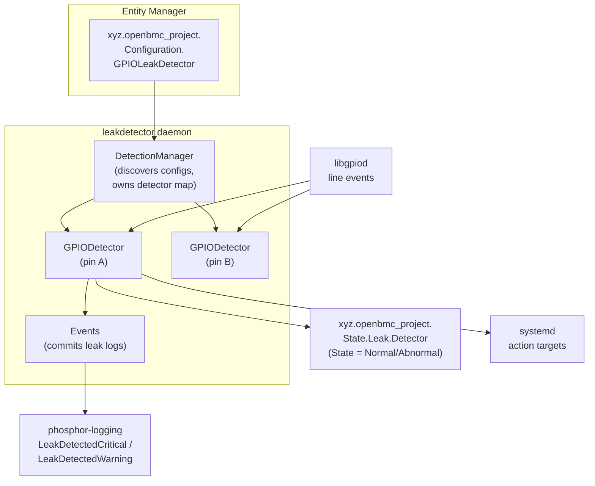
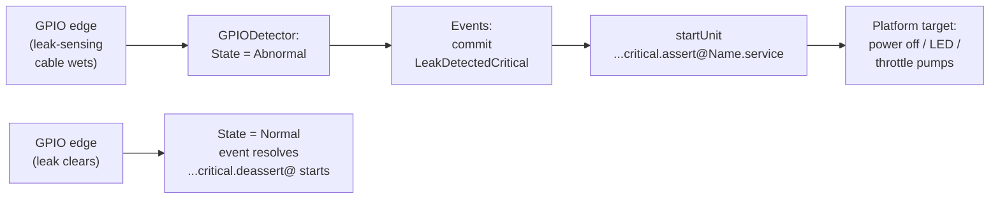

# Leak Detection
{: .no_toc }

Configure OpenBMC's `leakdetector` daemon to watch liquid-cooling leak sensors on GPIO pins and drive protective systemd actions when coolant is detected.
{: .fs-6 .fw-300 }

## Table of Contents
{: .no_toc .text-delta }

1. TOC
{:toc}

---

## Overview

Liquid-cooled server and rack designs route coolant through cold plates, manifolds, and quick-disconnect fittings that can leak. A leak near powered electronics is a hard-shutdown event, not an advisory, so the platform needs a detection path that is fast, hardware-driven, and able to reach the power subsystem without waiting on a host or an operator.

OpenBMC covers this with the **`leakdetector`** daemon in [`dbus-sensors`](https://github.com/openbmc/dbus-sensors). It watches leak-sensing cables and float switches wired to BMC GPIOs, publishes each detector's state on D-Bus, logs a phosphor-logging event when a leak asserts, and starts a platform-supplied systemd target so the machine can take a protective action — up to and including powering the chassis off.

You would use this guide when porting OpenBMC to a liquid-cooled platform, when wiring a new leak-sensing cable into an existing design, or when validating that a detected leak actually reaches your power-off logic. It builds on the [D-Bus Sensors]() guide — `leakdetector` is a sibling daemon in the same repository and shares its Entity Manager discovery model.

**Key concepts covered:**

- The `leakdetector` daemon and its `DetectionManager` / `GPIODetector` structure
- `DetectorState` (`Normal` / `Abnormal`) and how a GPIO edge maps to it
- Entity Manager discovery via the `xyz.openbmc_project.Configuration.GPIOLeakDetector` interface
- The `LeakDetectedCritical` / `LeakDetectedWarning` phosphor-logging events
- Templated systemd action targets (level x assert/deassert) and auto-resolution on clear
- Validating the target mapping before it can power your system off

---

## Architecture

`leakdetector` is a single `sdbusplus::async` daemon that owns the D-Bus service name `xyz.openbmc_project.leakdetector`. Internally it splits into three cooperating pieces.

### Component Diagram



### Discovery: `DetectionManager`

`DetectionManager` (in `src/leakdetector/LeakDetectionManager.cpp`) is the top-level object. It subscribes to Entity Manager inventory and reacts to configuration objects that expose the `xyz.openbmc_project.Configuration.GPIOLeakDetector` interface:

1. `processInventoryAdded()` fires when a matching inventory interface appears.
2. `processConfigAddedAsync()` reads the detector's properties from Entity Manager (`Name`, `Type`, `PinName`, `Polarity`, `Level`, `SubType`) and validates them against internal lookup tables.
3. A `GPIODetector` is constructed from the resulting `DetectorConfig` and stored in a `std::unordered_map` keyed by the inventory object path.

Because discovery is inventory-driven, detectors can come and go at runtime as FRUs (for example a hot-plug coolant manifold) are added or removed — no daemon restart is required.

### Per-pin monitoring: `GPIODetector`

Each `GPIODetector` (in `src/leakdetector/LeakGPIODetector.cpp`) owns exactly one GPIO line. It watches the line for edge events and maps the electrical state to a logical `DetectorState`:

```cpp
// LeakGPIODetector.cpp (upstream)
auto newState = gpioState ? DetectorIntf::DetectorState::Abnormal
                          : DetectorIntf::DetectorState::Normal;
```

The `Polarity` config key selects whether the "leak" condition is active-low or active-high, so `gpioState` already accounts for inversion. `DetectorState` is defined by the `xyz.openbmc_project.State.Leak.Detector` D-Bus interface and has three values: `Normal`, `Abnormal`, and `Unknown`. The detector publishes its current value in the `State` property, alongside `PrettyName` and a `Type` (`LeakSensingCable` for a leak-sensing cable). It also emits an `xyz.openbmc_project.Association.Definitions` association back to the parent inventory object so consumers can tie the detector to the FRU it protects.

### Event commit: `Events`

When a detector transitions, `GPIODetector` calls into the `Events` helper (`src/leakdetector/LeakEvents.cpp`), which commits a phosphor-logging event keyed to the detector's `Level`. This is the piece that produces the durable log entry and, in turn, the Redfish event.

### D-Bus Interfaces

| Interface | Role | Source |
|-----------|------|--------|
| `xyz.openbmc_project.Configuration.GPIOLeakDetector` | Per-detector configuration published by Entity Manager and consumed by `DetectionManager` | Entity Manager |
| `xyz.openbmc_project.State.Leak.Detector` | Detector runtime state (`State` = `Normal`/`Abnormal`/`Unknown`, plus `PrettyName`, `Type`) | `leakdetector` (service `xyz.openbmc_project.leakdetector`) |
| `xyz.openbmc_project.Association.Definitions` | Associates each detector with its parent inventory object | `leakdetector` |
| `xyz.openbmc_project.Logging.Entry` | Persistent `LeakDetectedCritical` / `LeakDetectedWarning` / resolved entries | phosphor-logging |

{: .note }
The exact object path for the detector state object lives under the `xyz.openbmc_project.leakdetector` service (convention: `/xyz/openbmc_project/state/leak/detector/<Name>`). Confirm the path on your build with `busctl tree xyz.openbmc_project.leakdetector` rather than hard-coding it.

### Key Dependencies

- **`entity-manager`**: Publishes the `GPIOLeakDetector` configuration objects the daemon discovers.
- **`libgpiod`**: Provides the GPIO line-event interface each `GPIODetector` waits on.
- **`phosphor-logging`**: Backs the `lg2::commit()` calls that turn a leak into a durable, Redfish-visible event.
- **`systemd`**: Runs the platform-supplied action targets the daemon starts on assert and deassert.
- **`phosphor-dbus-interfaces`**: Defines the `State.Leak.Detector` interface and the `GPIOLeakDetector` configuration schema.

---

## Configuration

### Build-time Option

`leakdetector` is gated behind a meson option in `dbus-sensors` and is off by default. Enable it in your machine's `dbus-sensors` recipe:

| Option | Default | Description |
|--------|---------|-------------|
| `leakdetector` | `disabled` | Builds and installs the `leakdetector` daemon |

```bitbake
# meta-<your-machine>/recipes-phosphor/sensors/dbus-sensors_%.bbappend
PACKAGECONFIG:append = " leakdetector"
```

(The daemon is only compiled when `get_option('leakdetector').allowed()` is true; otherwise `src/leakdetector/meson.build` calls `subdir_done()` and skips the build.)

### Entity Manager Configuration Interface

Each leak detector is one `Exposes` entry of type `GPIOLeakDetector`. Entity Manager publishes it as the `xyz.openbmc_project.Configuration.GPIOLeakDetector` D-Bus interface, which `DetectionManager` discovers.

| Key | Type | Required | Description | Accepted values |
|-----|------|----------|-------------|-----------------|
| `Name` | string | yes | Human-readable detector name; also used to build the systemd instance name | any |
| `Type` | string | yes | Selects this configuration type | `"GPIOLeakDetector"` |
| `SubType` | string | yes | Detector kind, mirrors the Redfish `LeakDetector` schema | e.g. `"Moisture"` |
| `PinName` | string | yes | `gpio-line-names` entry for the sensor's GPIO | any line name |
| `Polarity` | string | yes | Which electrical level means "leak" | `"Low"` (active-low) or `"High"` (active-high) |
| `Level` | string | yes | Severity, selects the event and the action target | `"Warning"` or `"Critical"` |

{: .note }
The daemon validates `Type`, `Polarity`, and `Level` against fixed tables (`LeakSensingCable`; `Low`/`High`; `Warning`/`Critical`). A value outside those tables is rejected and the detector is not created — check the daemon log if a configured detector never appears on D-Bus.

### Example Configuration

```json
{
    "Exposes": [
        {
            "Name": "Rack_Leak_Detector_0",
            "Type": "GPIOLeakDetector",
            "SubType": "Moisture",
            "PinName": "RACK_LEAK_DETECT_0",
            "Polarity": "Low",
            "Level": "Critical"
        }
    ]
}
```

This declares an active-low, critical-severity leak-sensing cable on the `RACK_LEAK_DETECT_0` GPIO line. When that line asserts, the daemon logs `LeakDetectedCritical` and starts the critical assert target for `Rack_Leak_Detector_0`.

---

## Leak Events and Systemd Actions

### Event Commit

On a `Normal -> Abnormal` transition the daemon commits a phosphor-logging event chosen by the detector's `Level`:

| `Level` | Event committed on leak | Event on clear |
|---------|-------------------------|----------------|
| `Critical` | `LeakDetectedCritical` | resolved / `LeakDetectedNormal` |
| `Warning` | `LeakDetectedWarning` | resolved / `LeakDetectedNormal` |

Both events carry the detector name and its object path. The commit produces a `xyz.openbmc_project.Logging.Entry`, which bmcweb surfaces to Redfish clients. When the GPIO returns to its non-leak state, the detector transitions back to `Normal` and the condition auto-resolves — you do not clear it manually.

### Systemd Action Targets

Committing the event is only half the response. The daemon also **starts a systemd unit** so the platform can act. The target name is built from the detector's level, the transition direction (assert on leak, deassert on clear), and the detector's `Name`:


```cpp
// LeakGPIODetector.cpp (upstream) — level x action -> unit prefix
static constexpr auto leakActionTargets = std::to_array<
    std::tuple<config::DetectorLevel, std::string_view, std::string_view>>(
    {{config::DetectorLevel::warning,  "assert",
      "xyz.openbmc_project.leakdetector.warning.assert@"},
     {config::DetectorLevel::warning,  "deassert",
      "xyz.openbmc_project.leakdetector.warning.deassert@"},
     {config::DetectorLevel::critical, "assert",
      "xyz.openbmc_project.leakdetector.critical.assert@"},
     {config::DetectorLevel::critical, "deassert",
      "xyz.openbmc_project.leakdetector.critical.deassert@"}});
// ...
auto target = std::string(serviceSuffix) + config.name + ".service";
co_await systemd::SystemdInterface::startUnit(ctx, target);
```


The `@` marks these as **systemd template units** — the daemon instantiates a template with the detector name. For the example above, the four possible units are:

| Transition | Unit started |
|------------|--------------|
| Critical leak asserts | `xyz.openbmc_project.leakdetector.critical.assert@Rack_Leak_Detector_0.service` |
| Critical leak clears | `xyz.openbmc_project.leakdetector.critical.deassert@Rack_Leak_Detector_0.service` |
| Warning leak asserts | `xyz.openbmc_project.leakdetector.warning.assert@<Name>.service` |
| Warning leak clears | `xyz.openbmc_project.leakdetector.warning.deassert@<Name>.service` |

Your platform ships the corresponding template units (`...assert@.service`, `...deassert@.service`). This is the seam where the generic daemon meets platform-specific policy: a critical assert target typically chains to chassis power-off, while a warning assert target might only light an LED or throttle pumps.

### End-to-End Flow



{: .warning }
**A leak action target can power your system off — validate the mapping before you trust it.** The critical assert target is platform-supplied, and the obvious protective action for a coolant leak is an immediate chassis power-off. That means a stuck sensor, a mis-wired active-low/active-high `Polarity`, or a template unit that points at the wrong `WantedBy`/`ExecStart` can take the machine down (or, worse, fail to). Before deploying: confirm each `...assert@<Name>.service` and `...deassert@<Name>.service` template exists, dry-run it with `systemctl start`, and verify the assert path reaches your power target and the deassert path is safe to run on a false clear. Test with the real GPIO, not just D-Bus, so polarity inversion is exercised end-to-end.

---

## Verify on the Running BMC

```console
# Confirm the daemon is up and owns its bus name
# systemctl status xyz.openbmc_project.leakdetector.service
# busctl tree xyz.openbmc_project.leakdetector

# Inspect a detector's state
# busctl introspect xyz.openbmc_project.leakdetector \
    /xyz/openbmc_project/state/leak/detector/Rack_Leak_Detector_0 \
    | grep -E "State|Type|PrettyName"
.PrettyName   property  s  "Rack_Leak_Detector_0"  emits-change
.State        property  s  "xyz.openbmc_project.State.Leak.Detector.DetectorState.Normal" ...
.Type         property  s  "...DetectorType.LeakSensingCable" ...

# Watch the action targets defined for your platform
# systemctl list-unit-files | grep leakdetector
```

To exercise the full path in QEMU (`scripts/run-qemu.sh ast2600-evb`), drive the configured GPIO line with `gpioset` (or `gpio-mockup`) and confirm the `State` property flips to `Abnormal`, a `LeakDetectedCritical` log entry appears (`journalctl -u xyz.openbmc_project.leakdetector`), and the expected `...critical.assert@<Name>.service` unit is started. Point the template at a harmless placeholder unit during testing so you do not power off your QEMU instance.

---

## Troubleshooting

### Issue: A configured detector never appears on D-Bus

**Symptom**: `busctl tree xyz.openbmc_project.leakdetector` shows no object for a detector you added to Entity Manager.

**Cause**: The configuration failed validation, or Entity Manager did not publish the `GPIOLeakDetector` interface.

**Solution**:
1. Confirm Entity Manager exposed the config: `busctl introspect xyz.openbmc_project.EntityManager <path> | grep GPIOLeakDetector`.
2. Check `Type`, `Polarity`, and `Level` are exactly `"GPIOLeakDetector"`, `"Low"`/`"High"`, and `"Warning"`/`"Critical"` — other values are rejected.
3. Review the daemon log: `journalctl -u xyz.openbmc_project.leakdetector`.

### Issue: `State` never leaves `Normal` when the sensor wets

**Symptom**: The leak-sensing cable is triggered but `State` stays `Normal`.

**Cause**: Wrong `PinName`, or the `Polarity` is inverted relative to the hardware.

**Solution**:
1. Confirm the line name resolves: `gpioinfo | grep <PinName>`.
2. Read the raw line while the sensor is wet: `gpioget <chip> <PinName>` and compare against the `Polarity` you configured (`Low` = leak drives the line low).
3. Flip `Polarity` between `"Low"` and `"High"` if the electrical sense is reversed.

### Issue: Leak logged but no protective action runs

**Symptom**: `LeakDetectedCritical` is logged but the system does not respond.

**Cause**: The platform's action template unit is missing or points nowhere useful.

**Solution**:
1. Check the exact unit name the daemon tried to start: `journalctl -u xyz.openbmc_project.leakdetector | grep -i startUnit` (or watch `systemctl list-jobs` during a test).
2. Confirm the template exists: `systemctl cat 'xyz.openbmc_project.leakdetector.critical.assert@.service'`.
3. Verify its `ExecStart`/`Wants` actually reach your power or mitigation logic, then re-test with the real GPIO.

### Debug Commands

```bash
# Service status and logs
systemctl status xyz.openbmc_project.leakdetector.service
journalctl -u xyz.openbmc_project.leakdetector -f

# Detector state
busctl tree xyz.openbmc_project.leakdetector
busctl introspect xyz.openbmc_project.leakdetector \
    /xyz/openbmc_project/state/leak/detector/<Name>

# Action targets
systemctl list-unit-files | grep leakdetector
systemctl cat 'xyz.openbmc_project.leakdetector.critical.assert@.service'

# Leak log entries via Redfish
curl -sk -u root:0penBmc \
    https://<bmc>/redfish/v1/Systems/system/LogServices/EventLog/Entries \
    | jq '.Members[] | select(.Message | test("[Ll]eak"))'
```

---

## References

### Official Resources

- [`dbus-sensors` — `leakdetector` source](https://github.com/openbmc/dbus-sensors/tree/master/src/leakdetector) (`LeakDetectionManager`, `LeakGPIODetector`, `LeakEvents`)
- [`dbus-sensors` repository](https://github.com/openbmc/dbus-sensors)
- [`xyz.openbmc_project.State.Leak.Detector` interface](https://github.com/openbmc/phosphor-dbus-interfaces/blob/master/yaml/xyz/openbmc_project/State/Leak/Detector.interface.yaml)
- [`xyz.openbmc_project.Configuration.GPIOLeakDetector` interface](https://github.com/openbmc/phosphor-dbus-interfaces/blob/master/yaml/xyz/openbmc_project/Configuration/GPIOLeakDetector.interface.yaml)
- [Redfish `LeakDetector` schema](https://redfish.dmtf.org/schemas/v1/LeakDetector.v1_2_0.json)

### Related Guides

- [D-Bus Sensors]() — the daemon family and Entity Manager discovery model `leakdetector` shares
- [Entity Manager]() — how `Exposes` configuration objects reach the daemon
- [GPIO Management]() — line-names and polarity conventions for the sensor pins
- [Power Management]() — the power targets a critical leak action typically chains to

---

{: .note }
**Verified against** upstream `openbmc/dbus-sensors` `src/leakdetector` and `openbmc/phosphor-dbus-interfaces`. Daemon, class, event, and configuration identifiers are confirmed against upstream; object paths and platform action-target contents vary by build — confirm on your image.
Last updated: 2026-07-15
