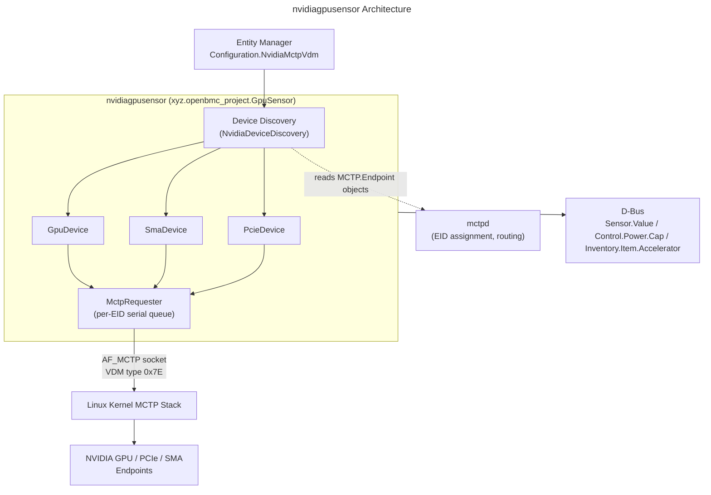
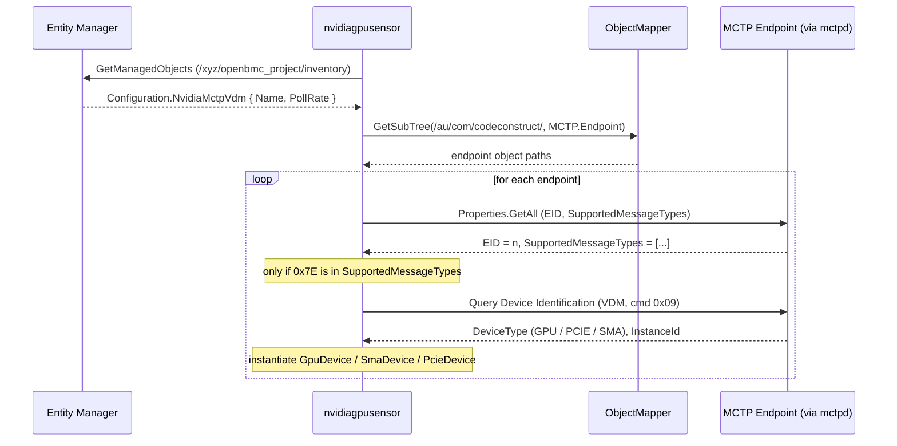

# NVIDIA GPU Management
{: .no_toc }

Discover and manage NVIDIA GPU, PCIe, and SMA devices over MCTP using the dbus-sensors `nvidiagpusensor` daemon.
{: .fs-6 .fw-300 }

## Table of Contents
{: .no_toc .text-delta }

1. TOC
{:toc}

---

## Overview

The **nvidiagpusensor** daemon (source: [`src/nvidia-gpu`](https://github.com/openbmc/dbus-sensors/tree/master/src/nvidia-gpu) in `openbmc/dbus-sensors`) manages NVIDIA accelerators — GPUs, PCIe switch/NIC devices, and SMA (System Management API) devices — out of band over MCTP. It speaks the **OCP accelerator-management protocol** carried in MCTP Vendor Defined Messages (VDM), reading telemetry, exposing inventory, and driving controls without any in-band driver on the host.

Unlike the sysfs/hwmon sensor daemons described in the , this daemon has no kernel driver behind it. Each reading is an MCTP round trip: the daemon encodes an OCP VDM request, sends it to the device's endpoint ID (EID), and decodes the response. It relies on `mctpd` to enumerate and route MCTP endpoints, but sends the accelerator-management VDM traffic itself through an `AF_MCTP` socket — it does **not** go through `pldmd`.

You would use this daemon on platforms built around NVIDIA accelerators (for example NVIDIA GB200/GB300 boards) where the BMC monitors GPU temperature, power, energy, voltage, and utilization; publishes GPU/DIMM inventory to Redfish; and enforces power caps and clock limits over the management fabric.

**Key concepts covered:**
- MCTP endpoint discovery and the OCP accelerator-management message type (`0x7E`)
- Device instantiation: `GpuDevice`, `SmaDevice`, `PcieDevice`
- The `MctpRequester` — per-EID request serialization, instance-id matching, timeouts, and retries
- Telemetry sensors, power-cap and clock-limit controls, inventory, and asynchronous events
- How this dbus-sensors MCTP path differs from the `pldm`/`mctpd` stack

---

## Architecture

### Component Diagram



<details markdown="1">
<summary>ASCII-art version (for comparison)</summary>

```
+-------------------------------------------------------------------------+
|   Entity Manager  --->  Configuration.NvidiaMctpVdm                      |
+---------------------------------|---------------------------------------+
                                  v
+-------------------------------------------------------------------------+
|            nvidiagpusensor  (xyz.openbmc_project.GpuSensor)              |
|                                                                         |
|   +-------------------+     reads MCTP.Endpoint      +---------------+   |
|   | Device Discovery  |----------------------------->|    mctpd      |   |
|   | (NvidiaDevice     |     objects from D-Bus       | (EID assign,  |   |
|   |  Discovery)       |                              |  routing)     |   |
|   +---------+---------+                              +---------------+   |
|             | instantiate                                               |
|   +---------+----------+---------------------+                          |
|   | GpuDevice | SmaDevice | PcieDevice        |                         |
|   +---------+----------+---------------------+                          |
|             | sendRecvMsg()                                             |
|   +---------v----------+                                                |
|   |   MctpRequester    |  per-EID serial queue, IID match, timeouts     |
|   +---------+----------+                                                |
+-------------|-----------------------------------------------------------+
              | AF_MCTP socket, VDM message type 0x7E
              v
      Linux Kernel MCTP Stack  --->  NVIDIA GPU / PCIe / SMA endpoints
```

</details>

### Discovery Over MCTP

Discovery is a two-stage process. The daemon first learns *which* platforms carry accelerators from Entity Manager, then learns *which endpoints* are actually present from `mctpd`.



Step by step:

1. **Configuration match.** `createSensors()` calls `GetManagedObjects` on Entity Manager and keeps every object exposing the `xyz.openbmc_project.Configuration.NvidiaMctpVdm` interface. Each yields a `SensorConfigs` record with `Name`, `PollRate` (default `1000` ms), and `NicNetworkPortCount` (default `0`).
2. **Endpoint enumeration.** For each configuration, `discoverDevices()` asks `xyz.openbmc_project.ObjectMapper` for a `GetSubTree` under `/au/com/codeconstruct/` restricted to the `xyz.openbmc_project.MCTP.Endpoint` interface. These endpoint objects are published by `mctpd` after it assigns EIDs and sets up routing.
3. **Message-type filter.** For each endpoint, `processEndpoint()` reads the `EID` and `SupportedMessageTypes` properties via `org.freedesktop.DBus.Properties.GetAll`. It proceeds only if `SupportedMessageTypes` contains the OCP accelerator-management message type `0x7E` (`ocp::accelerator_management::messageType`).
4. **Identification.** `queryDeviceIdentification()` encodes a **Query Device Identification** request (Device Capability Discovery command `0x09`) and sends it via `MctpRequester::sendRecvMsg`. The response carries a `DeviceIdentification` value.
5. **Instantiation.** Based on the returned device type, the daemon constructs the matching orchestrator and calls its `init()`:

| `DeviceIdentification` | Value | Class | D-Bus name pattern |
|------------------------|-------|-------|--------------------|
| `DEVICE_GPU` | `0` | `GpuDevice` | `Nvidia_GPU_<eid>` |
| `DEVICE_PCIE` | `2` | `PcieDevice` | `Nvidia_ConnectX_<eid>` |
| `DEVICE_SMA` | `5` | `SmaDevice` | `Nvidia_SMA_<eid>` |

When Entity Manager later removes the `NvidiaMctpVdm` configuration interface, `interfaceRemoved()` erases the corresponding device objects, so devices are torn down cleanly on reconfiguration.

### The MctpRequester

Every device object shares a single `mctp::MctpRequester`, which owns the transport and imposes ordering. Its public surface is a single method:

```cpp
// src/nvidia-gpu/MctpRequester.hpp
void sendRecvMsg(
    uint8_t eid, std::span<const uint8_t> reqMsg,
    std::move_only_function<void(const std::error_code&,
                                 std::span<const uint8_t>)> callback);
```

Internals that matter for correct behaviour and debugging:

- **AF_MCTP socket.** The requester holds a `boost::asio::generic::datagram_protocol::socket` bound to MCTP and uses `msgType = 0x7E`. There is no PLDM daemon in the path.
- **Per-EID serialization.** Each EID has its own `EidContext` holding a request queue (`devector<RequestContext>`), a rotating instance id, and a `steady_timer`. Requests to the same endpoint are issued one at a time; a busy device cannot be overrun.
- **Instance-id matching.** `getNextIid()` advances a 5-bit instance id (`instanceMin = 0` … `instanceMax = 31`) per EID. Responses are correlated to the outstanding request by instance id, so a late reply to a superseded request is not mistaken for the current one.
- **Timeouts and retries.** The per-EID timer bounds how long a request may wait for its response; on expiry the requester completes the callback with an error and moves the queue forward, and the OCP protocol layer (for example the inventory reader, below) re-issues where appropriate.

Because reads are asynchronous round trips rather than sysfs reads, each device drives a `steady_timer` poll loop at `PollRate` and issues its requests through this shared requester.

### D-Bus Interfaces

| Interface | Object Path | Description |
|-----------|-------------|-------------|
| `xyz.openbmc_project.Sensor.Value` | `/xyz/openbmc_project/sensors/{temperature,power,energy,voltage}/...` | Numeric telemetry readings |
| `xyz.openbmc_project.Common.PhysicalContext` | (on each sensor) | Physical context of the reading |
| `xyz.openbmc_project.Metric.Value` | `/xyz/openbmc_project/metric/...` | Utilization metrics (unit: Percent) |
| `xyz.openbmc_project.Control.Power.Cap` | `/xyz/openbmc_project/control/power/<name>` | GPU power-cap control |
| `xyz.openbmc_project.Control.OperatingClockSpeed` | `/xyz/openbmc_project/control/operatingclockspeed/<name>` | GPU clock-limit control |
| `xyz.openbmc_project.Inventory.Item.Accelerator` | `/xyz/openbmc_project/inventory/...` | GPU inventory item (`AcceleratorType.GPU`) |
| `xyz.openbmc_project.Inventory.Decorator.Asset` | (on inventory item) | Manufacturer, part number, serial number |
| `xyz.openbmc_project.Inventory.Decorator.Revision` | (on inventory item) | Firmware/version string |
| `xyz.openbmc_project.Common.UUID` | (on inventory item) | Device GUID/UUID |
| `xyz.openbmc_project.Inventory.Item.Dimm` | `/xyz/openbmc_project/inventory/...` | GPU on-package DRAM (`DeviceType.HBM`) |

The daemon owns the well-known name `xyz.openbmc_project.GpuSensor` and adds object managers for `/xyz/openbmc_project/sensors`, `/control`, `/inventory`, `/software`, and `/metric`.

### Key Dependencies

- **`mctpd`**: assigns EIDs, discovers endpoints, and publishes `xyz.openbmc_project.MCTP.Endpoint` objects the daemon consumes. Without it, no endpoints are discovered.
- **Kernel MCTP stack (`AF_MCTP`)**: carries the VDM traffic. Requires `CONFIG_MCTP` plus the relevant transport driver (for example I2C or PCIe VDM).
- **Entity Manager**: provides the `NvidiaMctpVdm` configuration that gates discovery per platform.

---

## Configuration

### Entity Manager Configuration

Expose an `NvidiaMctpVdm` record on a board that carries NVIDIA accelerators. The verified schema is `schemas/nvidia.json` in `openbmc/entity-manager`; `Name` and `Type` are required, `PollRate` is optional (milliseconds).

```json
{
    "Exposes": [
        {
            "Name": "NVIDIA GB200 GPU",
            "Type": "NvidiaMctpVdm"
        }
    ],
    "Name": "NVIDIA GB200",
    "Type": "Board"
}
```

| Property | Type | Required | Description |
|----------|------|----------|-------------|
| `Name` | string | yes | Recognisable device name |
| `Type` | string | yes | Must be `NvidiaMctpVdm` |
| `PollRate` | number | no | Poll interval in **milliseconds** (default `1000`) |
| `NicNetworkPortCount` | number | no | Network port count for NIC/PCIe discovery (default `0`; read by the daemon) |

{: .note }
`PollRate` here is in **milliseconds**, unlike the `PollRate` on the hwmon-based sensors in the , which is expressed in seconds. Double-check units when copying configuration between daemons.

### Build-Time Options

The daemon is gated by the `nvidia-gpu` meson feature (default `enabled`).

```bash
# Building dbus-sensors from source
meson setup build -Dnvidia-gpu=enabled
```

```bitbake
# In your machine .conf or image recipe
EXTRA_OEMESON:pn-dbus-sensors = " -Dnvidia-gpu=enabled "
```

| Option | Default | Description |
|--------|---------|-------------|
| `nvidia-gpu` | enabled | Build the `nvidiagpusensor` GPU/PCIe/SMA daemon |

The executable installs to `/usr/libexec/dbus-sensors/nvidiagpusensor` and ships with the `xyz.openbmc_project.nvidiagpusensor.service` unit, which requires and orders after `xyz.openbmc_project.EntityManager.service`.

---

## Telemetry & Control

All telemetry, control, inventory, and event traffic uses the OCP accelerator-management VDM. Numeric telemetry uses the **Platform Environmental** message type (`gpu::MessageType::PLATFORM_ENVIRONMENTAL = 3`); the command byte selects the reading.

### Telemetry Sensors

| Reading | Command | Code | Exposed as |
|---------|---------|------|------------|
| GPU temperature | `GET_TEMPERATURE_READING` (sensor id `0`) | `0x00` | `Sensor.Value` (temperature) |
| DRAM temperature | `GET_TEMPERATURE_READING` (sensor id `1`) | `0x00` | `Sensor.Value` (temperature) |
| T.Limit (thermal margin) | `READ_THERMAL_PARAMETERS` (sensor id `2`) | `0x02` | `Sensor.Value` + threshold |
| Power draw | `GET_CURRENT_POWER_DRAW` | `0x03` | `Sensor.Value` (power) |
| Peak observed power | `GET_MAX_OBSERVED_POWER` | `0x04` | `Sensor.Value` (power) |
| Energy counter | `GET_CURRENT_ENERGY_COUNTER` | `0x06` | `Sensor.Value` (energy) |
| Voltage | `GET_VOLTAGE` | `0x0F` | `Sensor.Value` (voltage) |
| Clock frequency | `GET_CURRENT_CLOCK_FREQUENCY` | `0x0B` | `Metric.Value` |
| Utilization (GPU + memory) | `GET_CURRENT_UTILIZATION` | `0x47` | `Metric.Value` (Percent) |
| Violation duration | `GET_VIOLATION_DURATION` | `0x45` | `Metric.Value` |

`GpuDevice` polls the temperature, T.Limit, DRAM temperature, power, peak power, energy, and voltage sensors on its poll loop; `SmaDevice` exposes an internal temperature sensor (sensor id `17`); `PcieDevice` enumerates PCIe/network ports and exposes their metrics. The temperature sensor is a standard `Sensor` subclass, so warning/critical thresholds and hysteresis work exactly as in the .

### Power-Cap Control

`NvidiaGpuPowerControl` backs `xyz.openbmc_project.Control.Power.Cap` at `/xyz/openbmc_project/control/power/<name>`:

- **Read** current limits with `GET_POWER_LIMITS` (`0x07`).
- **Write** a new cap with `SET_POWER_LIMITS` (`0x08`), selecting `SetPowerLimitsAction` (`NEW_LIMIT` / `DEFAULT_LIMIT`) and `SetPowerLimitsPersistence` (`ONE_SHOT` / `PERSISTENT`).
- A `PowerCap` and a `PowerCapEnable` write that arrive together (a single Redfish PATCH) are coalesced by a short debounce timer into **one** `SetPowerLimits` request, so the two properties apply atomically.
- The valid cap range comes from inventory (`MIN_DEVICE_POWER_LIMIT` / `MAX_DEVICE_POWER_LIMIT`).

```bash
# Read the current cap
busctl get-property xyz.openbmc_project.GpuSensor \
    /xyz/openbmc_project/control/power/Nvidia_GPU_<eid> \
    xyz.openbmc_project.Control.Power.Cap PowerCap

# Set a new cap (watts)
busctl set-property xyz.openbmc_project.GpuSensor \
    /xyz/openbmc_project/control/power/Nvidia_GPU_<eid> \
    xyz.openbmc_project.Control.Power.Cap PowerCap u 500
```

### Clock-Limit Control

`NvidiaGpuClockSpeedControl` backs `xyz.openbmc_project.Control.OperatingClockSpeed` at `/xyz/openbmc_project/control/operatingclockspeed/<name>`, reading present limits with `GET_CLOCK_LIMIT` (`0x11`). `ClockType` selects `GRAPHICS_CLOCK` or `MEMORY_CLOCK`.

### Inventory

The `Inventory` object reads static device identity with `GET_INVENTORY_INFORMATION` (`0x0C`), one `InventoryPropertyId` per request, and maps the results onto D-Bus decorators:

| Property | `InventoryPropertyId` | D-Bus interface / property |
|----------|-----------------------|----------------------------|
| Marketing name | `MARKETING_NAME` (`2`) | `Inventory.Item.Accelerator` / Asset model |
| Board part number | `BOARD_PART_NUMBER` (`0`) | `Inventory.Decorator.Asset` / PartNumber |
| Serial number | `SERIAL_NUMBER` (`1`) | `Inventory.Decorator.Asset` / SerialNumber |
| Firmware version | `FIRMWARE_VERSION` (`9`) | `Inventory.Decorator.Revision` |
| Device GUID | `DEVICE_GUID` (`10`) | `Common.UUID` / UUID |

Inventory reads are resilient: each property has a retry budget (`maxRetryAttempts = 3`, `retryDelay = 5s`) so transient MCTP errors during bring-up do not leave inventory permanently blank. The manufacturer is set to NVIDIA and the accelerator type to `AcceleratorType.GPU`.

### Asynchronous Events

`NvidiaEventReportingConfig::init()` arms device-pushed events in two steps:

1. **Subscribe.** `SET_EVENT_SUBSCRIPTION` (`0x06`) with `generationSetting = 2` (enable push) and the target BMC EID (default `8`) tells the device where to send events.
2. **Select sources.** For each accelerator message type, `SET_CURRENT_EVENT_SOURCES` (`0x05`) sends a per-type 64-bit mask of the event sources to enable.

Incoming events are dispatched by `NvidiaEventHandler::handleEvent`, keyed on the tuple `(eid, messageType, eventCode)`:

- **XID events** (`PlatformEnvironmentalEvent::XID = 0x01`) are handled by the GPU's XID event handler and surfaced as fault/log entries.
- **Long-running responses** (`DeviceCapabilityDiscoveryEvents::LONG_RUNNING_RESPONSE = 0x02`) let slow commands (for example utilization and violation-duration queries) complete asynchronously through a `SerialQueue` rather than blocking the poll loop.

---

## Relationship to the pldm / mctpd Stack

{: .note }
**This is not the PLDM path.** The  documents the `pldm` daemon and `pldmd`/`mctpd` stack, where the BMC discovers PDRs and reads sensors using **PLDM (MCTP message type `0x01`)** through `pldmd`. The `nvidiagpusensor` daemon described here is a **dbus-sensors** daemon that speaks the **OCP accelerator-management VDM (MCTP message type `0x7E`, NVIDIA PCI vendor id `0x10de`)** directly over an `AF_MCTP` socket via its own `MctpRequester`. Both stacks share `mctpd` and the kernel MCTP layer for endpoint enumeration and routing, but the accelerator-management traffic never traverses `pldmd`, uses no PDRs, and does not appear under `pldmtool`. Use `pldmtool` for PLDM endpoints; use `busctl` against `xyz.openbmc_project.GpuSensor` for these devices.

| Aspect | dbus-sensors `nvidiagpusensor` | `pldm` / `pldmd` |
|--------|-------------------------------|------------------|
| MCTP message type | `0x7E` (Vendor Defined, PCI) | `0x01` (PLDM) |
| Protocol | OCP accelerator management (NVIDIA VDM) | PLDM Types 0/2/4/5 |
| Discovery | Query Device Identification (cmd `0x09`) | GetPDR / terminus discovery |
| Requester | `mctp::MctpRequester` (`AF_MCTP`) | `pldmd` requester |
| D-Bus service | `xyz.openbmc_project.GpuSensor` | `xyz.openbmc_project.PLDM` |
| Shared layer | `mctpd` + kernel MCTP | `mctpd` + kernel MCTP |

---

## Reading Devices

### Via D-Bus

```bash
# The daemon's well-known name
busctl tree xyz.openbmc_project.GpuSensor

# Read a GPU temperature
busctl get-property xyz.openbmc_project.GpuSensor \
    /xyz/openbmc_project/sensors/temperature/Nvidia_GPU_<eid>_Temp \
    xyz.openbmc_project.Sensor.Value Value

# Read GPU inventory (UUID)
busctl get-property xyz.openbmc_project.GpuSensor \
    /xyz/openbmc_project/inventory/.../Nvidia_GPU_<eid> \
    xyz.openbmc_project.Common.UUID UUID
```

### Verify the MCTP Endpoint

```bash
# Confirm mctpd sees the endpoint and it advertises message type 0x7E
busctl tree xyz.openbmc_project.MCTP
busctl introspect xyz.openbmc_project.MCTP \
    /xyz/openbmc_project/mctp/<network>/<eid>
# Look for SupportedMessageTypes containing 126 (0x7E)
```

---

## Troubleshooting

### No GPU devices appear

**Symptom**: `busctl tree xyz.openbmc_project.GpuSensor` shows no sensor or inventory objects.

**Cause**: discovery stops before instantiation — either no matching Entity Manager configuration, no MCTP endpoint, or the endpoint does not advertise message type `0x7E`.

**Solution**:
1. Confirm the `NvidiaMctpVdm` configuration is present:
   ```bash
   busctl call xyz.openbmc_project.EntityManager \
       /xyz/openbmc_project/inventory \
       org.freedesktop.DBus.ObjectManager GetManagedObjects | grep -i NvidiaMctpVdm
   ```
2. Confirm `mctpd` published the endpoint and it lists `126` in `SupportedMessageTypes`:
   ```bash
   busctl tree xyz.openbmc_project.MCTP
   ```
3. Check the daemon log for the discovery messages ("Found OCP MCTP VDM Endpoint", "Found the GPU with EID ..."):
   ```bash
   journalctl -u xyz.openbmc_project.nvidiagpusensor -f
   ```

### Endpoint discovered but no readings

**Symptom**: the device object exists, but `Value` stays `NaN` or requests error out.

**Cause**: MCTP requests are timing out — bus contention, a slow endpoint, or a wrong EID/route.

**Solution**:
1. Watch the log for MCTP send/receive failures ("sending message over MCTP failed").
2. Verify the endpoint responds at the transport layer:
   ```bash
   mctp addr
   mctp route
   ```
3. Reduce polling pressure by raising `PollRate` (milliseconds) in the Entity Manager configuration.

### Power cap or clock limit write is rejected

**Symptom**: setting `PowerCap` has no effect or logs a `SetPowerLimits` error.

**Cause**: the requested cap is outside the device's `MIN_DEVICE_POWER_LIMIT` / `MAX_DEVICE_POWER_LIMIT`, or the device rejected the persistence/action.

**Solution**:
1. Read the advertised bounds from inventory and stay within them.
2. Set `PowerCapEnable` together with `PowerCap` so the debounced write applies as one `SetPowerLimits`.

### Debug Commands

```bash
# Service status and logs
systemctl status xyz.openbmc_project.nvidiagpusensor
journalctl -u xyz.openbmc_project.nvidiagpusensor -f

# Enumerate everything the daemon exposes
busctl tree xyz.openbmc_project.GpuSensor

# Cross-check the MCTP transport
busctl tree xyz.openbmc_project.MCTP
mctp link ; mctp addr ; mctp route
```

---

## References

### Official Resources
- [dbus-sensors — src/nvidia-gpu](https://github.com/openbmc/dbus-sensors/tree/master/src/nvidia-gpu) — the daemon source
- [entity-manager — schemas/nvidia.json](https://github.com/openbmc/entity-manager/blob/master/schemas/nvidia.json) — the `NvidiaMctpVdm` configuration schema
- [entity-manager — configurations/nvidia](https://github.com/openbmc/entity-manager/tree/master/configurations/nvidia) — example platform configurations (GB200, GB300, ...)
- [OpenBMC Documentation](https://github.com/openbmc/docs)

### Related Guides
- [D-Bus Sensors Guide]() — the sensor daemon family and the `Sensor.Value` interface
- [Entity Manager Guide]() — how configurations drive daemon discovery
- [MCTP & PLDM Guide]() — the parallel PLDM/`pldmd` stack this daemon deliberately bypasses

### External Documentation
- [OCP Hardware Management / accelerator management](https://www.opencompute.org/) — the accelerator-management message model carried in MCTP VDM
- [Linux MCTP Documentation](https://www.kernel.org/doc/html/latest/networking/mctp.html) — the `AF_MCTP` kernel stack

---

{: .note }
**Verified against**: `openbmc/dbus-sensors` `src/nvidia-gpu` (master) and `openbmc/entity-manager` `schemas/nvidia.json` (master). GPU/PCIe/SMA management requires MCTP-capable NVIDIA hardware and cannot be fully exercised on QEMU.
Last updated: 2026-07-15
