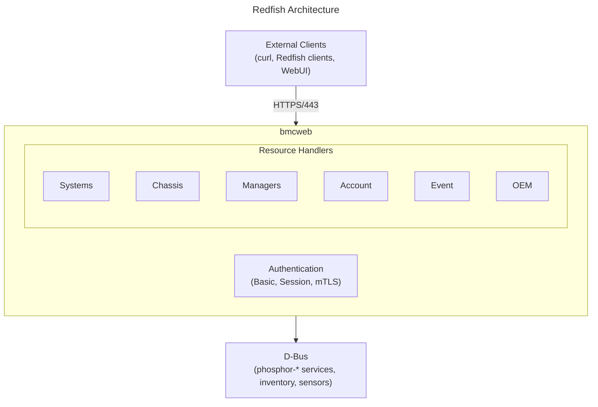

# Redfish Guide
{: .no_toc }

Configure and extend the Redfish API in OpenBMC.
{: .fs-6 .fw-300 }

## Table of Contents
{: .no_toc .text-delta }

1. TOC
{:toc}

---

## Overview

**Redfish** is a modern, RESTful API standard for server management, replacing IPMI for most use cases. OpenBMC implements Redfish through **bmcweb**, including support for **Redfish Aggregation** to manage multiple BMCs from a single endpoint.



<details markdown="1">
<summary>ASCII-art version (for comparison)</summary>

```
┌──────────────────────────────────────────────────────────────────┐
│                      Redfish Architecture                        │
├──────────────────────────────────────────────────────────────────┤
│                                                                  │
│  ┌──────────────────────────────────────────────────────────────┐│
│  │                    External Clients                          ││
│  │            (curl, Redfish clients, WebUI)                    ││
│  └──────────────────────────┬───────────────────────────────────┘│
│                             │                                    │
│                         HTTPS/443                                │
│                             │                                    │
│  ┌──────────────────────────┴───────────────────────────────────┐│
│  │                        bmcweb                                ││
│  │                                                              ││
│  │   ┌──────────────────────────────────────────────────────┐   ││
│  │   │              Resource Handlers                       │   ││
│  │   │                                                      │   ││
│  │   │ Systems │ Chassis │ Managers │ Account │ Event │ OEM │   ││
│  │   └──────────────────────────────────────────────────────┘   ││
│  │                                                              ││
│  │   ┌──────────────────────────────────────────────────────┐   ││
│  │   │              Authentication                          │   ││
│  │   │         (Basic, Session, mTLS)                       │   ││
│  │   └──────────────────────────────────────────────────────┘   ││
│  └──────────────────────────┬───────────────────────────────────┘│
│                             │                                    │
│  ┌──────────────────────────┴───────────────────────────────────┐│
│  │                         D-Bus                                ││
│  │           (phosphor-* services, inventory, sensors)          ││
│  └──────────────────────────────────────────────────────────────┘│
└──────────────────────────────────────────────────────────────────┘
```

</details>

---

## Setup & Configuration

### Build-Time Configuration (Yocto)

Configure bmcweb features in your build:

```bitbake
# In your machine .conf or local.conf

# Enable/disable bmcweb features
EXTRA_OEMESON:pn-bmcweb = " \
    -Dredfish-dbus-log=enabled \
    -Dredfish-bmc-journal=enabled \
    -Dredfish-cpu-log=enabled \
    -Dredfish-host-logger=enabled \
    -Dinsecure-tftp-update=disabled \
    -Dinsecure-push-style-notification=disabled \
    -Dkvm=enabled \
    -Dvm-websocket=enabled \
    -Dvm-nbdproxy=enabled \
    -Dmutual-tls-auth=enabled \
    -Dhttp-body-limit=65 \
"
```

### Meson Build Options Reference

| Option | Default | Description |
|--------|---------|-------------|
| **Core Features** | | |
| `redfish` | enabled | Core Redfish support |
| `redfish-aggregation` | disabled | Aggregation support |
| `rest` | disabled | Legacy REST API (deprecated) |
| **Logging** | | |
| `redfish-dbus-log` | enabled | D-Bus logging |
| `redfish-bmc-journal` | enabled | BMC journal logs |
| `redfish-cpu-log` | disabled | CPU crash logs |
| `redfish-host-logger` | enabled | Host console logging |
| **Remote Access** | | |
| `kvm` | enabled | KVM WebSocket |
| `vm-websocket` | enabled | Virtual Media WebSocket |
| `vm-nbdproxy` | enabled | NBD proxy for virtual media |
| **Security** | | |
| `mutual-tls-auth` | enabled | mTLS support |
| `insecure-tftp-update` | disabled | Allow TFTP updates |
| `insecure-push-style-notification` | disabled | Push notifications |
| **Limits** | | |
| `http-body-limit` | 30 | Max request body (MB) |

### Runtime Enable/Disable

```bash
# Check bmcweb status
systemctl status bmcweb

# Restart bmcweb
systemctl restart bmcweb

# Stop bmcweb (disables all Redfish/web access)
systemctl stop bmcweb
systemctl disable bmcweb

# View logs
journalctl -u bmcweb -f
```

### HTTPS Certificate Configuration

```bash
# View current certificate
curl -k https://localhost/redfish/v1/CertificateService/CertificateLocations

# Generate self-signed certificate (on BMC)
openssl req -x509 -newkey rsa:2048 -keyout /etc/ssl/private/server.pem \
    -out /etc/ssl/certs/server.pem -days 365 -nodes \
    -subj "/CN=openbmc"

# Replace via Redfish
curl -k -u root:0penBmc -X POST \
    -H "Content-Type: application/json" \
    -d '{
        "CertificateType": "PEM",
        "CertificateString": "<PEM-ENCODED-CERT>"
    }' \
    https://localhost/redfish/v1/Managers/bmc/NetworkProtocol/HTTPS/Certificates
```

### Network Protocol Settings

```bash
# Get network protocol settings
curl -k -u root:0penBmc \
    https://localhost/redfish/v1/Managers/bmc/NetworkProtocol

# Enable/disable protocols via Redfish
curl -k -u root:0penBmc -X PATCH \
    -H "Content-Type: application/json" \
    -d '{
        "HTTPS": {"ProtocolEnabled": true, "Port": 443},
        "SSH": {"ProtocolEnabled": true, "Port": 22},
        "IPMI": {"ProtocolEnabled": true, "Port": 623},
        "NTP": {"ProtocolEnabled": true}
    }' \
    https://localhost/redfish/v1/Managers/bmc/NetworkProtocol
```

### Session Configuration

```bash
# Get session service settings
curl -k -u root:0penBmc \
    https://localhost/redfish/v1/SessionService

# Configure session timeout (seconds)
curl -k -u root:0penBmc -X PATCH \
    -H "Content-Type: application/json" \
    -d '{"SessionTimeout": 3600}' \
    https://localhost/redfish/v1/SessionService
```

### Account Service Configuration

```bash
# Get account policy
curl -k -u root:0penBmc \
    https://localhost/redfish/v1/AccountService

# Configure account lockout
curl -k -u root:0penBmc -X PATCH \
    -H "Content-Type: application/json" \
    -d '{
        "AccountLockoutThreshold": 5,
        "AccountLockoutDuration": 300,
        "MinPasswordLength": 8
    }' \
    https://localhost/redfish/v1/AccountService
```

### Event Service Configuration

```bash
# Get event service settings
curl -k -u root:0penBmc \
    https://localhost/redfish/v1/EventService

# Enable/disable event service
curl -k -u root:0penBmc -X PATCH \
    -H "Content-Type: application/json" \
    -d '{
        "ServiceEnabled": true,
        "DeliveryRetryAttempts": 3,
        "DeliveryRetryIntervalSeconds": 60
    }' \
    https://localhost/redfish/v1/EventService
```

### Telemetry Configuration

```bash
# Get telemetry service
curl -k -u root:0penBmc \
    https://localhost/redfish/v1/TelemetryService

# Create metric report
curl -k -u root:0penBmc -X POST \
    -H "Content-Type: application/json" \
    -d '{
        "Id": "PowerMetrics",
        "Name": "Power Consumption Report",
        "MetricReportDefinitionType": "Periodic",
        "ReportUpdates": "Overwrite",
        "Schedule": {
            "RecurrenceInterval": "PT60S"
        },
        "Metrics": [
            {
                "MetricId": "TotalPower",
                "MetricProperties": ["/redfish/v1/Chassis/chassis/Power#/PowerControl/0/PowerConsumedWatts"]
            }
        ]
    }' \
    https://localhost/redfish/v1/TelemetryService/MetricReportDefinitions
```

---

## Redfish Basics

### API Structure

```
/redfish/v1/                        # Service Root
├── Systems/                        # Computer systems
│   └── system/                     # This system
│       ├── Processors/             # CPUs
│       ├── Memory/                 # DIMMs
│       ├── Storage/                # Storage devices
│       └── LogServices/            # System logs
├── Chassis/                        # Physical enclosures
│   └── chassis/                    # This chassis
│       ├── Power/                  # Power info
│       ├── Thermal/                # Thermal info
│       └── Sensors/                # All sensors
├── Managers/                       # BMC managers
│   └── bmc/                        # This BMC
│       ├── NetworkProtocol/        # Network services
│       ├── EthernetInterfaces/     # Network ports
│       └── LogServices/            # BMC logs
├── AccountService/                 # User management
│   ├── Accounts/                   # User accounts
│   └── Roles/                      # Privilege roles
├── SessionService/                 # Session management
├── EventService/                   # Event subscriptions
├── UpdateService/                  # Firmware updates
└── TelemetryService/               # Telemetry data
```

### Common Operations

```bash
# Set up alias for convenience
alias bmcurl='curl -k -u root:0penBmc'

# Get service root
bmcurl https://localhost/redfish/v1/

# Get system info
bmcurl https://localhost/redfish/v1/Systems/system

# Get chassis info
bmcurl https://localhost/redfish/v1/Chassis/chassis

# Get BMC info
bmcurl https://localhost/redfish/v1/Managers/bmc
```

---

## Authentication

### Basic Authentication

```bash
curl -k -u root:0penBmc https://localhost/redfish/v1/Systems/system
```

### Session Authentication

```bash
# Create session
curl -k -X POST \
    -H "Content-Type: application/json" \
    -d '{"UserName":"root","Password":"0penBmc"}' \
    https://localhost/redfish/v1/SessionService/Sessions

# Response includes X-Auth-Token header
# Use token for subsequent requests
curl -k -H "X-Auth-Token: <token>" \
    https://localhost/redfish/v1/Systems/system

# Delete session
curl -k -X DELETE \
    -H "X-Auth-Token: <token>" \
    https://localhost/redfish/v1/SessionService/Sessions/<session-id>
```

### mTLS Authentication

Configure client certificates for mutual TLS authentication.

---

## Power Operations

### Get Power State

```bash
bmcurl https://localhost/redfish/v1/Systems/system | jq '.PowerState'
```

### Power On/Off

```bash
# Power on
bmcurl -X POST \
    -H "Content-Type: application/json" \
    -d '{"ResetType":"On"}' \
    https://localhost/redfish/v1/Systems/system/Actions/ComputerSystem.Reset

# Graceful shutdown
bmcurl -X POST \
    -H "Content-Type: application/json" \
    -d '{"ResetType":"GracefulShutdown"}' \
    https://localhost/redfish/v1/Systems/system/Actions/ComputerSystem.Reset

# Force off
bmcurl -X POST \
    -H "Content-Type: application/json" \
    -d '{"ResetType":"ForceOff"}' \
    https://localhost/redfish/v1/Systems/system/Actions/ComputerSystem.Reset

# Reboot
bmcurl -X POST \
    -H "Content-Type: application/json" \
    -d '{"ResetType":"ForceRestart"}' \
    https://localhost/redfish/v1/Systems/system/Actions/ComputerSystem.Reset
```

### Reset Types

| Type | Description |
|------|-------------|
| `On` | Power on |
| `ForceOff` | Immediate power off |
| `GracefulShutdown` | Graceful OS shutdown |
| `GracefulRestart` | Graceful reboot |
| `ForceRestart` | Immediate reboot |
| `Nmi` | Non-maskable interrupt |

---

## Sensors

### List All Sensors

```bash
bmcurl https://localhost/redfish/v1/Chassis/chassis/Sensors | jq '.Members'
```

### Get Sensor Details

```bash
bmcurl https://localhost/redfish/v1/Chassis/chassis/Sensors/CPU_Temp | jq
```

### Sensor Properties

```json
{
    "@odata.id": "/redfish/v1/Chassis/chassis/Sensors/CPU_Temp",
    "Name": "CPU Temp",
    "Reading": 45.0,
    "ReadingUnits": "Cel",
    "Status": {
        "State": "Enabled",
        "Health": "OK"
    },
    "Thresholds": {
        "UpperCritical": {"Reading": 95},
        "UpperCaution": {"Reading": 85},
        "LowerCritical": {"Reading": 0},
        "LowerCaution": {"Reading": 5}
    }
}
```

---

## Thermal Management

### Get Thermal Info

```bash
bmcurl https://localhost/redfish/v1/Chassis/chassis/Thermal | jq
```

### Response Structure

```json
{
    "Temperatures": [
        {
            "Name": "CPU Temp",
            "ReadingCelsius": 45,
            "Status": {"State": "Enabled", "Health": "OK"}
        }
    ],
    "Fans": [
        {
            "Name": "Fan0",
            "Reading": 5000,
            "ReadingUnits": "RPM",
            "Status": {"State": "Enabled", "Health": "OK"}
        }
    ]
}
```

---

## User Management

### List Users

```bash
bmcurl https://localhost/redfish/v1/AccountService/Accounts | jq '.Members'
```

### Create User

```bash
bmcurl -X POST \
    -H "Content-Type: application/json" \
    -d '{
        "UserName": "newuser",
        "Password": "Password123!",
        "RoleId": "Operator",
        "Enabled": true
    }' \
    https://localhost/redfish/v1/AccountService/Accounts
```

### Modify User

```bash
bmcurl -X PATCH \
    -H "Content-Type: application/json" \
    -d '{"Password": "NewPassword123!"}' \
    https://localhost/redfish/v1/AccountService/Accounts/newuser
```

### Delete User

```bash
bmcurl -X DELETE \
    https://localhost/redfish/v1/AccountService/Accounts/newuser
```

### Roles

| Role | Description |
|------|-------------|
| `Administrator` | Full access |
| `Operator` | Manage operations, no user management |
| `ReadOnly` | Read-only access |

---

## Event Service

### List Subscriptions

```bash
bmcurl https://localhost/redfish/v1/EventService/Subscriptions
```

### Create Subscription

```bash
bmcurl -X POST \
    -H "Content-Type: application/json" \
    -d '{
        "Destination": "https://my-server:8080/events",
        "Protocol": "Redfish",
        "EventTypes": ["Alert", "StatusChange"],
        "Context": "MySubscription"
    }' \
    https://localhost/redfish/v1/EventService/Subscriptions
```

### Delete Subscription

```bash
bmcurl -X DELETE \
    https://localhost/redfish/v1/EventService/Subscriptions/<id>
```

---

## Firmware Update

### Check Current Version

```bash
bmcurl https://localhost/redfish/v1/UpdateService/FirmwareInventory | jq
```

### Upload and Apply Firmware

```bash
# Upload firmware image
curl -k -u root:0penBmc \
    -X POST \
    -H "Content-Type: application/octet-stream" \
    --data-binary @firmware.tar \
    https://localhost/redfish/v1/UpdateService

# Or use SimpleUpdate action
bmcurl -X POST \
    -H "Content-Type: application/json" \
    -d '{
        "TransferProtocol": "TFTP",
        "ImageURI": "tftp://192.168.1.100/firmware.tar"
    }' \
    https://localhost/redfish/v1/UpdateService/Actions/UpdateService.SimpleUpdate
```

---

## Redfish Aggregation

Redfish Aggregation allows a single BMC (the "Aggregator") to present resources from multiple downstream BMCs through a unified API. This is useful for multi-node systems, disaggregated infrastructure, or centralized datacenter management.

### Architecture

```
┌─────────────────────────────────────────────────────────────────────────┐
│                        Aggregation Architecture                         │
├─────────────────────────────────────────────────────────────────────────┤
│                                                                         │
│                    ┌──────────────────────────────┐                     │
│                    │     Management Client        │                     │
│                    │  (Single Entry Point)        │                     │
│                    └──────────────┬───────────────┘                     │
│                                   │                                     │
│                              HTTPS/443                                  │
│                                   │                                     │
│                    ┌──────────────┴────────────────┐                    │
│                    │      Aggregating BMC          │                    │
│                    │   (bmcweb with aggregation)   │                    │
│                    │                               │                    │
│                    │  /redfish/v1/                 │                    │
│                    │  ├── AggregationService/      │                    │
│                    │  ├── Systems/                 │◄─── Aggregated     │
│                    │  ├── Chassis/                 │     from all       │
│                    │  └── Managers/                │     satellites     │
│                    └──────────────┬────────────────┘                    │
│                                   │                                     │
│              ┌────────────────────┼────────────────────┐                │
│              │                    │                    │                │
│         HTTPS/443            HTTPS/443            HTTPS/443             │
│              │                    │                    │                │
│   ┌──────────┴─────┐   ┌─────────┴──────┐   ┌────────┴───────┐          │
│   │  Satellite 1   │   │  Satellite 2   │   │  Satellite 3   │          │
│   │  (Node BMC)    │   │  (Node BMC)    │   │  (Node BMC)    │          │
│   │  192.168.1.10  │   │  192.168.1.11  │   │  192.168.1.12  │          │
│   └────────────────┘   └────────────────┘   └────────────────┘          │
│                                                                         │
└─────────────────────────────────────────────────────────────────────────┘
```

### Enable Aggregation

Enable the aggregation feature at build time:

```bitbake
# In your machine .conf or local.conf
EXTRA_OEMESON:pn-bmcweb = " \
    -Dredfish-aggregation=enabled \
"
```

### Aggregation Service API

Once enabled, the AggregationService endpoint becomes available:

```bash
# Get aggregation service
bmcurl https://localhost/redfish/v1/AggregationService

# Response
{
    "@odata.id": "/redfish/v1/AggregationService",
    "@odata.type": "#AggregationService.v1_0_1.AggregationService",
    "Id": "AggregationService",
    "Name": "Aggregation Service",
    "Description": "Aggregation Service",
    "ServiceEnabled": true,
    "AggregationSources": {
        "@odata.id": "/redfish/v1/AggregationService/AggregationSources"
    },
    "ConnectionMethods": {
        "@odata.id": "/redfish/v1/AggregationService/ConnectionMethods"
    }
}
```

### Managing Aggregation Sources

Aggregation sources define the downstream BMCs to aggregate:

```bash
# List configured aggregation sources
bmcurl https://localhost/redfish/v1/AggregationService/AggregationSources

# Add a new aggregation source (satellite BMC)
bmcurl -X POST \
    -H "Content-Type: application/json" \
    -d '{
        "HostName": "192.168.1.10",
        "UserName": "admin",
        "Password": "password",
        "Links": {
            "ConnectionMethod": {
                "@odata.id": "/redfish/v1/AggregationService/ConnectionMethods/Redfish"
            }
        }
    }' \
    https://localhost/redfish/v1/AggregationService/AggregationSources

# Get details of an aggregation source
bmcurl https://localhost/redfish/v1/AggregationService/AggregationSources/1

# Remove an aggregation source
bmcurl -X DELETE \
    https://localhost/redfish/v1/AggregationService/AggregationSources/1
```

### Aggregation Source Properties

| Property | Type | Description |
|----------|------|-------------|
| `HostName` | string | IP address or hostname of satellite BMC |
| `UserName` | string | Authentication username |
| `Password` | string | Authentication password (write-only) |
| `SNMP` | object | SNMP community settings (optional) |
| `Links.ConnectionMethod` | link | Connection method to use |
| `Links.ResourcesAccessed` | array | Resources aggregated from this source |

### Connection Methods

Connection methods define how the aggregator connects to satellites:

```bash
# List available connection methods
bmcurl https://localhost/redfish/v1/AggregationService/ConnectionMethods

# Get connection method details
bmcurl https://localhost/redfish/v1/AggregationService/ConnectionMethods/Redfish

# Response
{
    "@odata.id": "/redfish/v1/AggregationService/ConnectionMethods/Redfish",
    "@odata.type": "#ConnectionMethod.v1_0_0.ConnectionMethod",
    "Id": "Redfish",
    "Name": "Redfish Connection Method",
    "ConnectionMethodType": "Redfish",
    "ConnectionMethodVariant": "Redfish"
}
```

### Accessing Aggregated Resources

Aggregated resources appear with prefixed IDs to identify their source:

```bash
# List all systems (local + aggregated)
bmcurl https://localhost/redfish/v1/Systems

# Response includes aggregated systems
{
    "Members": [
        {"@odata.id": "/redfish/v1/Systems/system"},           # Local
        {"@odata.id": "/redfish/v1/Systems/agg1_system"},      # Satellite 1
        {"@odata.id": "/redfish/v1/Systems/agg2_system"}       # Satellite 2
    ]
}

# Access aggregated system
bmcurl https://localhost/redfish/v1/Systems/agg1_system

# The request is proxied to the satellite BMC
```

### Resource Prefixing

Aggregated resources use prefixes to avoid ID collisions:

| Local Resource | Aggregated Resource (Source 1) |
|----------------|-------------------------------|
| `/Systems/system` | `/Systems/agg1_system` |
| `/Chassis/chassis` | `/Chassis/agg1_chassis` |
| `/Managers/bmc` | `/Managers/agg1_bmc` |
| `/Sensors/CPU_Temp` | `/Sensors/agg1_CPU_Temp` |

### Aggregation Use Cases

#### Multi-Node Server Management

```bash
# Power on all aggregated systems
for sys in system agg1_system agg2_system agg3_system; do
    bmcurl -X POST \
        -H "Content-Type: application/json" \
        -d '{"ResetType":"On"}' \
        "https://localhost/redfish/v1/Systems/${sys}/Actions/ComputerSystem.Reset"
done
```

#### Unified Sensor Monitoring

```bash
# Get all temperature sensors across all nodes
bmcurl https://localhost/redfish/v1/Chassis | jq -r '.Members[]."@odata.id"' | \
while read chassis; do
    echo "=== ${chassis} ==="
    bmcurl "${chassis}/Thermal" | jq '.Temperatures[] | {Name, ReadingCelsius}'
done
```

#### Centralized Log Collection

```bash
# Collect event logs from all systems
bmcurl https://localhost/redfish/v1/Systems | jq -r '.Members[]."@odata.id"' | \
while read system; do
    echo "=== ${system} ==="
    bmcurl "${system}/LogServices/EventLog/Entries" | jq '.Members[:5]'
done
```

### Aggregation Configuration

#### Trust Store for Satellite Certificates

Configure trusted certificates for satellite BMC connections:

```bash
# Add satellite certificate to trust store
bmcurl -X POST \
    -H "Content-Type: application/json" \
    -d '{
        "CertificateType": "PEM",
        "CertificateString": "<PEM-ENCODED-CERT>"
    }' \
    https://localhost/redfish/v1/Managers/bmc/Truststore/Certificates
```

#### Aggregation with mTLS

For mutual TLS authentication with satellites:

```bash
# Configure client certificate for satellite authentication
bmcurl -X POST \
    -H "Content-Type: application/json" \
    -d '{
        "HostName": "192.168.1.10",
        "Links": {
            "ConnectionMethod": {
                "@odata.id": "/redfish/v1/AggregationService/ConnectionMethods/Redfish"
            }
        }
    }' \
    https://localhost/redfish/v1/AggregationService/AggregationSources
```

### Troubleshooting Aggregation

#### Check Aggregation Source Status

```bash
# Get aggregation source status
bmcurl https://localhost/redfish/v1/AggregationService/AggregationSources/1 | jq '.Status'

# Response
{
    "State": "Enabled",
    "Health": "OK"
}
```

#### Common Issues

| Issue | Cause | Solution |
|-------|-------|----------|
| Source unreachable | Network/firewall issue | Check connectivity to satellite |
| Authentication failed | Wrong credentials | Verify username/password |
| Certificate error | Untrusted satellite cert | Add to trust store or disable verification |
| Resources not appearing | Service not ready | Wait for satellite to fully boot |
| Timeout errors | Slow satellite response | Increase timeout settings |

#### Debug Logging

```bash
# Enable verbose bmcweb logging
# Edit /lib/systemd/system/bmcweb.service to add:
# Environment="BMCWEB_LOG_LEVEL=DEBUG"

systemctl daemon-reload
systemctl restart bmcweb
journalctl -u bmcweb -f | grep -i aggregat
```

---

## Logs

### Get Event Log

```bash
bmcurl https://localhost/redfish/v1/Systems/system/LogServices/EventLog/Entries | jq '.Members'
```

### Clear Log

```bash
bmcurl -X POST \
    https://localhost/redfish/v1/Systems/system/LogServices/EventLog/Actions/LogService.ClearLog
```

---

## OEM Extensions

### OEM Resource Locations

OEM extensions appear under `Oem` properties:

```json
{
    "@odata.id": "/redfish/v1/Systems/system",
    "Oem": {
        "OpenBMC": {
            "@odata.type": "#OemComputerSystem.v1_0_0.OpenBMC",
            "FirmwareProvisioning": {
                "ProvisioningStatus": "NotProvisioned"
            }
        }
    }
}
```

### Implementing OEM Extensions

Add OEM properties in bmcweb handlers:

```cpp
// In systems.hpp
nlohmann::json& oem = asyncResp->res.jsonValue["Oem"]["OpenBMC"];
oem["@odata.type"] = "#OemComputerSystem.v1_0_0.OpenBMC";
oem["MyCustomProperty"] = "value";
```

---

## bmcweb Configuration

### Build Options

```bitbake
# In your machine config or local.conf
EXTRA_OEMESON:pn-bmcweb = " \
    -Dredfish-dbus-log=enabled \
    -Dhttp-body-limit=65 \
    -Dinsecure-tftp-update=disabled \
    "
```

### Common Options

| Option | Description |
|--------|-------------|
| `redfish-dbus-log` | Enable D-Bus based logging |
| `insecure-tftp-update` | Allow TFTP firmware updates |
| `http-body-limit` | Max request body size (MB) |
| `mutual-tls-auth` | Enable mTLS |
| `kvm` | Enable KVM support |
| `vm-websocket` | Enable Virtual Media WebSocket |

---

## Adding Custom Routes

### Basic Route Handler

{: .note }
> **Source Reference**: Pattern based on [bmcweb](https://github.com/openbmc/bmcweb)
> - Route patterns: [redfish-core/lib/managers.hpp](https://github.com/openbmc/bmcweb/blob/master/redfish-core/lib/managers.hpp)
> - Privilege definitions: [registries/privilege_registry.hpp](https://github.com/openbmc/bmcweb/blob/master/redfish-core/include/registries/privilege_registry.hpp)

```cpp
// In a new file under redfish-core/lib/
#include <app.hpp>
#include <registries/privilege_registry.hpp>

namespace redfish
{

inline void requestRoutesMyOem(App& app)
{
    BMCWEB_ROUTE(app, "/redfish/v1/Oem/MyVendor/MyResource")
        .privileges(redfish::privileges::getManager)
        .methods(boost::beast::http::verb::get)(
            [](const crow::Request&,
               const std::shared_ptr<bmcweb::AsyncResp>& asyncResp) {
                asyncResp->res.jsonValue["@odata.type"] =
                    "#MyResource.v1_0_0.MyResource";
                asyncResp->res.jsonValue["@odata.id"] =
                    "/redfish/v1/Oem/MyVendor/MyResource";
                asyncResp->res.jsonValue["Name"] = "My Custom Resource";
                asyncResp->res.jsonValue["Status"]["State"] = "Enabled";
            });
}

} // namespace redfish
```

### Register in bmcweb

```cpp
// In src/webserver_main.cpp or appropriate location
#include "myoem.hpp"

// In main():
redfish::requestRoutesMyOem(app);
```

---

## Troubleshooting

### Service Not Responding

```bash
# Check bmcweb status
systemctl status bmcweb

# View logs
journalctl -u bmcweb -f
```

### Authentication Failures

```bash
# Check session service
bmcurl https://localhost/redfish/v1/SessionService

# Verify account exists
bmcurl https://localhost/redfish/v1/AccountService/Accounts
```

### Missing Resources

```bash
# Check if D-Bus service is running
busctl tree xyz.openbmc_project.ObjectMapper

# Query object mapper for resource
busctl call xyz.openbmc_project.ObjectMapper \
    /xyz/openbmc_project/object_mapper \
    xyz.openbmc_project.ObjectMapper \
    GetObject sas "/xyz/openbmc_project/inventory/system" 0
```

---

## Deep Dive
{: .text-delta }

Advanced implementation details for Redfish developers.

### Request Routing Architecture

bmcweb uses a route registration pattern for handling HTTP requests:

```
┌─────────────────────────────────────────────────────────────────────────┐
│                    bmcweb Request Routing                               │
├─────────────────────────────────────────────────────────────────────────┤
│                                                                         │
│   HTTP Request: GET /redfish/v1/Chassis/chassis0/Thermal                │
│                                   │                                     │
│                                   ▼                                     │
│   ┌─────────────────────────────────────────────────────────────────┐   │
│   │                    Crow HTTP Server                             │   │
│   │   (Boost.Beast HTTP, Boost.Asio I/O)                            │   │
│   └────────────────────────────┬────────────────────────────────────┘   │
│                                │                                        │
│                                ▼                                        │
│   ┌─────────────────────────────────────────────────────────────────┐   │
│   │                    Route Matching                               │   │
│   │   Routes registered at startup via BMCWEB_ROUTE macro           │   │
│   │                                                                 │   │
│   │   Pattern: "/redfish/v1/Chassis/<str>/Thermal"                  │   │
│   │   Matches: chassis0 → extracted as parameter                    │   │
│   └────────────────────────────┬────────────────────────────────────┘   │
│                                │                                        │
│                                ▼                                        │
│   ┌─────────────────────────────────────────────────────────────────┐   │
│   │                    Authentication Check                         │   │
│   │   ├── Session token validation                                  │   │
│   │   ├── Basic auth (if enabled)                                   │   │
│   │   └── mTLS certificate (if enabled)                             │   │
│   └────────────────────────────┬────────────────────────────────────┘   │
│                                │                                        │
│                                ▼                                        │
│   ┌─────────────────────────────────────────────────────────────────┐   │
│   │                    Handler Function                             │   │
│   │   thermal.cpp::handleThermalGet()                               │   │
│   │   ├── Query D-Bus for sensor data                               │   │
│   │   ├── Build JSON response                                       │   │
│   │   └── Send response via asyncResp                               │   │
│   └─────────────────────────────────────────────────────────────────┘   │
│                                                                         │
└─────────────────────────────────────────────────────────────────────────┘
```

**Route registration pattern:**

```cpp
// In redfish-core/lib/thermal.hpp
inline void requestRoutesThermal(App& app)
{
    BMCWEB_ROUTE(app, "/redfish/v1/Chassis/<str>/Thermal/")
        .privileges(redfish::privileges::getThermal)
        .methods(boost::beast::http::verb::get)(
            std::bind_front(handleThermalGet, std::ref(app)));
}
```

**Source reference**: [redfish-core/lib/](https://github.com/openbmc/bmcweb/tree/master/redfish-core/lib)

### Async D-Bus Query Pattern

bmcweb uses async callbacks to avoid blocking the event loop:

```
┌─────────────────────────────────────────────────────────────────────────┐
│                    Async D-Bus Query Pattern                            │
├─────────────────────────────────────────────────────────────────────────┤
│                                                                         │
│   Handler receives asyncResp (shared_ptr to response object)            │
│   ┌─────────────────────────────────────────────────────────────────┐   │
│   │ void handleChassisGet(                                          │   │
│   │     App& app,                                                   │   │
│   │     const crow::Request& req,                                   │   │
│   │     const std::shared_ptr<bmcweb::AsyncResp>& asyncResp,        │   │
│   │     const std::string& chassisId)                               │   │
│   │ {                                                               │   │
│   │     // asyncResp->res.jsonValue populated over multiple calls   │   │
│   │     // Response sent when asyncResp refcount reaches zero       │   │
│   └─────────────────────────────────────────────────────────────────┘   │
│                                                                         │
│   Multiple async queries in flight:                                     │
│   ┌────────────────────────────────────────────────────────────────┐    │
│   │ asyncResp │───▶ Query 1: Get Chassis info ──────┐              │    │
│   │           │───▶ Query 2: Get Power state ───────┤ All complete │    │
│   │           │───▶ Query 3: Get Thermal data ──────┤     │        │    │
│   │           │───▶ Query 4: Get LED state ─────────┘     ▼        │    │
│   │           │                              Response sent         │    │
│   └────────────────────────────────────────────────────────────────┘    │
│                                                                         │
│   Pattern for D-Bus async call:                                         │
│   ┌─────────────────────────────────────────────────────────────────┐   │
│   │ crow::connections::systemBus->async_method_call(                │   │
│   │     [asyncResp](const boost::system::error_code& ec,            │   │
│   │                 const PropertiesType& props) {                  │   │
│   │         if (ec) {                                               │   │
│   │             messages::internalError(asyncResp->res);            │   │
│   │             return;                                             │   │
│   │         }                                                       │   │
│   │         // Populate asyncResp->res.jsonValue                    │   │
│   │     },                                                          │   │
│   │     service, objectPath, "org.freedesktop.DBus.Properties",     │   │
│   │     "GetAll", interface);                                       │   │
│   └─────────────────────────────────────────────────────────────────┘   │
│                                                                         │
└─────────────────────────────────────────────────────────────────────────┘
```

### Event Service (SSE) Implementation

```
┌─────────────────────────────────────────────────────────────────────────┐
│                    Redfish Event Service                                │
├─────────────────────────────────────────────────────────────────────────┤
│                                                                         │
│   Event Flow:                                                           │
│   ┌────────────────┐     ┌────────────────┐     ┌────────────────┐      │
│   │ D-Bus Signal   │────▶│ Event Filter   │────▶│ SSE Stream /   │      │
│   │ (phosphor-*)   │     │ (subscription  │     │ Push Webhook   │      │
│   │                │     │  match rules)  │     │                │      │
│   └────────────────┘     └────────────────┘     └────────────────┘      │
│                                                                         │
│   Subscription Types:                                                   │
│   ├── SSE (Server-Sent Events) - persistent HTTP connection             │
│   │   GET /redfish/v1/EventService/SSE                                  │
│   │   Response: text/event-stream                                       │
│   │                                                                     │
│   └── Push Style (Webhook) - HTTP POST to destination                   │
│       POST to subscriber's Destination URL                              │
│                                                                         │
│   Event Types:                                                          │
│   ├── Alert - hardware alerts (thresholds, failures)                    │
│   ├── ResourceAdded - new resource created                              │
│   ├── ResourceRemoved - resource deleted                                │
│   ├── ResourceUpdated - resource property changed                       │
│   └── MetricReport - telemetry data                                     │
│                                                                         │
│   D-Bus Signal to Redfish Event Mapping:                                │
│   ┌──────────────────────────────────────────────────────────────────┐  │
│   │ D-Bus: PropertiesChanged on Sensor.Value                         │  │
│   │   └─▶ Redfish: Alert with MessageId "Threshold exceeded"         │  │
│   │                                                                  │  │
│   │ D-Bus: InterfacesAdded on Inventory path                         │  │
│   │   └─▶ Redfish: ResourceAdded for new inventory item              │  │
│   └──────────────────────────────────────────────────────────────────┘  │
│                                                                         │
└─────────────────────────────────────────────────────────────────────────┘
```

### OEM Extension Pattern

```cpp
// Example: Adding OEM data to an existing resource
// In redfish-core/lib/chassis.cpp

inline void handleChassisGet(...)
{
    // Standard Redfish properties
    asyncResp->res.jsonValue["@odata.type"] = "#Chassis.v1_16_0.Chassis";
    asyncResp->res.jsonValue["Id"] = chassisId;

    // Add OEM section
    nlohmann::json& oem = asyncResp->res.jsonValue["Oem"]["OpenBMC"];
    oem["@odata.type"] = "#OpenBMCChassis.v1_0_0.Chassis";

    // Query OEM-specific D-Bus properties
    crow::connections::systemBus->async_method_call(
        [asyncResp](const boost::system::error_code& ec,
                    const std::string& customProp) {
            if (!ec) {
                asyncResp->res.jsonValue["Oem"]["OpenBMC"]
                    ["CustomProperty"] = customProp;
            }
        },
        "xyz.openbmc_project.OEM.Service",
        objectPath,
        "org.freedesktop.DBus.Properties",
        "Get",
        "xyz.openbmc_project.OEM.CustomInterface",
        "CustomProperty");
}
```

### Source Code Reference

Key implementation files in [bmcweb](https://github.com/openbmc/bmcweb):

| File | Description |
|------|-------------|
| `src/webserver_main.cpp` | Server startup, route registration |
| `include/sessions.hpp` | Session management |
| `redfish-core/lib/systems.cpp` | /Systems resource |
| `redfish-core/lib/chassis.cpp` | /Chassis resource |
| `redfish-core/lib/sensors.cpp` | Sensor reading helpers |
| `redfish-core/lib/log_services.cpp` | SEL/Event log |
| `redfish-core/include/privileges.hpp` | Authorization |
| `redfish-core/include/utils/dbus_utils.hpp` | D-Bus helpers |

---

## Examples

Working examples are available in the [examples/redfish](https://github.com/MichaelTien8901/openbmc-guide-tutorial/tree/master/docs/examples/redfish) directory:

- `oem_resource.hpp` - Custom OEM resource implementation
- `oem-schema.json` - OEM schema definition
- `test_oem_resource.sh` - OEM resource test script

---

## References

- [bmcweb](https://github.com/openbmc/bmcweb)
- [DMTF Redfish Specification](https://www.dmtf.org/standards/redfish)
- [Redfish Schema Index](https://redfish.dmtf.org/schemas/)
- [Redfish Aggregation White Paper](https://www.dmtf.org/sites/default/files/standards/documents/DSP2065_1.0.0.pdf)
- [OpenBMC Redfish Design](https://github.com/openbmc/docs/tree/master/designs)

---

{: .note }
**Tested on**: OpenBMC master, QEMU romulus
