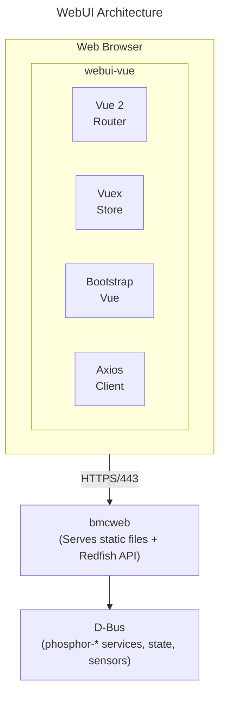

# WebUI Guide
{: .no_toc }

Configure and customize the OpenBMC web interface.
{: .fs-6 .fw-300 }

## Table of Contents
{: .no_toc .text-delta }

1. TOC
{:toc}

---

## Overview

**webui-vue** is the modern, Vue.js-based web interface for OpenBMC. It provides a browser-based management console that communicates with the BMC through the Redfish API.



<details>
<summary>ASCII-art version (for comparison)</summary>

```
┌─────────────────────────────────────────────────────────────────┐
│                       WebUI Architecture                        │
├─────────────────────────────────────────────────────────────────┤
│                                                                 │
│  ┌─────────────────────────────────────────────────────────────┐│
│  │                      Web Browser                            ││
│  │                                                             ││
│  │   ┌──────────────────────────────────────────────────────┐  ││
│  │   │                   webui-vue                          │  ││
│  │   │                                                      │  ││
│  │   │  ┌─────────┐  ┌─────────┐  ┌─────────┐  ┌─────────┐  │  ││
│  │   │  │  Vue 2  │  │ Vuex    │  │Bootstrap│  │ Axios   │  │  ││
│  │   │  │ Router  │  │ Store   │  │   Vue   │  │ Client  │  │  ││
│  │   │  └─────────┘  └─────────┘  └─────────┘  └─────────┘  │  ││
│  │   └──────────────────────────────────────────────────────┘  ││
│  └──────────────────────────┬──────────────────────────────────┘│
│                             │                                   │
│                         HTTPS/443                               │
│                             │                                   │
│  ┌──────────────────────────┴──────────────────────────────────┐│
│  │                        bmcweb                               ││
│  │           (Serves static files + Redfish API)               ││
│  └──────────────────────────┬──────────────────────────────────┘│
│                             │                                   │
│  ┌──────────────────────────┴──────────────────────────────────┐│
│  │                         D-Bus                               ││
│  │            (phosphor-* services, state, sensors)            ││
│  └─────────────────────────────────────────────────────────────┘│
└─────────────────────────────────────────────────────────────────┘
```

</details>

---

## Setup & Configuration

### Build-Time Configuration (Yocto)

Include webui-vue in your image:

```bitbake
# In your machine .conf or local.conf

# Include web interface
IMAGE_INSTALL:append = " webui-vue"

# Configure features via environment options
EXTRA_OEMAKE:pn-webui-vue = "VUE_APP_COMPANY_NAME='MyCompany'"
```

### Build Configuration Options

Configure webui-vue at build time using environment variables:

| Variable | Default | Description |
|----------|---------|-------------|
| `VUE_APP_COMPANY_NAME` | OpenBMC | Company name in header |
| `VUE_APP_PRODUCT_NAME` | OpenBMC | Product name |
| `VUE_APP_SERVER_ROOT` | | Prefix for all API requests |
| `VUE_APP_THEME` | default | Theme name |
| `VUE_APP_INTERNAL_LINKS` | | Custom navigation links (JSON) |
| `VUE_APP_ROUTER_BASE` | / | Router base path |

### Runtime Configuration

The WebUI runs as static files served by bmcweb:

```bash
# Check bmcweb status (serves WebUI)
systemctl status bmcweb

# WebUI files location
ls /usr/share/www/

# Restart to pick up WebUI changes
systemctl restart bmcweb
```

### Access the WebUI

```bash
# Default URL
https://<bmc-ip>/

# Default credentials
Username: root
Password: 0penBmc
```

---

## WebUI Features

### Dashboard

The dashboard provides an at-a-glance view of system status:

- **System Health**: Overall health indicators
- **Power Status**: Current power state and controls
- **Quick Actions**: Common operations (reboot, power cycle)
- **Sensor Summary**: Critical sensor readings

### Operations Pages

| Page | Description |
|------|-------------|
| **Server power operations** | Power on/off, restart, one-time boot |
| **KVM & Console** | Remote keyboard/video/mouse, serial console |
| **Virtual Media** | Mount ISO images remotely |
| **Firmware** | Update BMC and BIOS firmware |
| **SOL Console** | Serial over LAN terminal |

### Hardware Pages

| Page | Description |
|------|-------------|
| **Inventory** | FRU data, serial numbers, hardware info |
| **Sensors** | All sensors with readings and thresholds |
| **System Info** | CPU, memory, storage details |
| **Event Logs** | System event history |

### Settings Pages

| Page | Description |
|------|-------------|
| **Network** | IP configuration, VLAN, DNS |
| **Date & Time** | NTP, timezone, manual time |
| **User Management** | Add/modify/delete users |
| **Certificates** | HTTPS certificates management |
| **Policies** | Power restore, boot options |

---

## Customization

### Custom Branding

Create a custom theme by modifying or overriding files:

```
webui-vue/
├── src/
│   ├── assets/
│   │   ├── images/
│   │   │   ├── logo-header.svg    # Header logo (40px height)
│   │   │   ├── logo-login.svg     # Login page logo
│   │   │   └── favicon.ico        # Browser favicon
│   │   └── styles/
│   │       └── _colors.scss       # Color definitions
│   ├── env/
│   │   └── components/
│   │       └── AppHeader/         # Custom header component
│   └── views/
│       └── Login/
│           └── Login.vue          # Custom login page
```

### Replacing the Logo

1. Create your logo (SVG recommended, ~40px height for header)
2. Replace files in your meta layer:

```bitbake
# In your recipe .bbappend
FILESEXTRAPATHS:prepend := "${THISDIR}/files:"

SRC_URI += " \
    file://logo-header.svg \
    file://logo-login.svg \
    file://favicon.ico \
"

do_install:append() {
    install -m 0644 ${WORKDIR}/logo-header.svg \
        ${D}${datadir}/www/assets/images/
    install -m 0644 ${WORKDIR}/logo-login.svg \
        ${D}${datadir}/www/assets/images/
    install -m 0644 ${WORKDIR}/favicon.ico \
        ${D}${datadir}/www/
}
```

### Custom Colors

Override SCSS color variables in your theme:

```scss
// _colors.scss
$primary: #0a3d6c;        // Primary brand color
$secondary: #6c757d;      // Secondary color
$success: #28a745;        // Success states
$danger: #dc3545;         // Error states
$warning: #ffc107;        // Warning states
$info: #17a2b8;           // Info states

// Header colors
$navbar-bg: #1a1a1a;
$navbar-color: #ffffff;

// Sidebar colors
$sidebar-bg: #2c3e50;
$sidebar-active: #3498db;
```

### Build Custom Theme

```bash
# Clone webui-vue
git clone https://github.com/openbmc/webui-vue.git
cd webui-vue

# Install dependencies
npm install

# Set environment variables
export VUE_APP_COMPANY_NAME="My Company"
export VUE_APP_PRODUCT_NAME="Server Manager"

# Build for production
npm run build

# Output in dist/ directory
```

---

## Adding Custom Pages

### Create a New View

1. Create the Vue component:

```vue
<!-- src/views/Custom/MyPage.vue -->
<template>
  <b-container fluid="xl">
    <page-title :description="$t('pageMyPage.description')" />

    <b-row>
      <b-col>
        <b-card>
          <b-card-header>
            <h5>My Custom Page</h5>
          </b-card-header>
          <b-card-body>
            <p>Custom content here</p>
            <b-button variant="primary" @click="performAction">
              Do Something
            </b-button>
          </b-card-body>
        </b-card>
      </b-col>
    </b-row>
  </b-container>
</template>

<script>
import PageTitle from '@/components/Global/PageTitle';

export default {
  name: 'MyPage',
  components: { PageTitle },
  data() {
    return {
      loading: false,
    };
  },
  methods: {
    performAction() {
      // Call Redfish API via Vuex store
      this.$store
        .dispatch('myCustomStore/performAction')
        .then(() => {
          this.$bvToast.toast('Action completed', {
            title: 'Success',
            variant: 'success',
          });
        })
        .catch((error) => {
          console.error(error);
        });
    },
  },
};
</script>
```

2. Add the route:

```javascript
// src/router/routes.js
{
  path: '/custom/my-page',
  name: 'my-page',
  component: () => import('@/views/Custom/MyPage'),
  meta: {
    title: 'My Page',
    requiresAuth: true,
  },
},
```

3. Add navigation entry:

```javascript
// src/store/modules/GlobalStore.js
// Add to sidebar navigation items
{
  id: 'my-page',
  label: 'My Page',
  route: '/custom/my-page',
  icon: 'iconCustom',
},
```

### Create a Vuex Store Module

```javascript
// src/store/modules/MyCustomStore.js
import api from '@/store/api';

const MyCustomStore = {
  namespaced: true,
  state: {
    data: null,
  },
  getters: {
    getData: (state) => state.data,
  },
  mutations: {
    setData: (state, data) => (state.data = data),
  },
  actions: {
    async fetchData({ commit }) {
      return await api
        .get('/redfish/v1/Oem/MyVendor/MyResource')
        .then(({ data }) => {
          commit('setData', data);
          return data;
        })
        .catch((error) => {
          console.error(error);
          throw error;
        });
    },
    async performAction({ dispatch }) {
      return await api
        .post('/redfish/v1/Oem/MyVendor/MyResource/Actions/MyAction')
        .then(() => dispatch('fetchData'))
        .catch((error) => {
          console.error(error);
          throw error;
        });
    },
  },
};

export default MyCustomStore;
```

---

## Internationalization (i18n)

### Adding Translations

WebUI uses vue-i18n for internationalization:

```javascript
// src/locales/en-US.json
{
  "pageMyPage": {
    "description": "Description of my custom page",
    "title": "My Page Title",
    "actionButton": "Perform Action"
  }
}
```

### Using Translations

```vue
<template>
  <h1>{{ $t('pageMyPage.title') }}</h1>
  <p>{{ $t('pageMyPage.description') }}</p>
  <b-button>{{ $t('pageMyPage.actionButton') }}</b-button>
</template>
```

### Adding New Language

1. Create locale file: `src/locales/de-DE.json`
2. Add to locale configuration:

```javascript
// src/main.js
import deDE from './locales/de-DE.json';

const i18n = new VueI18n({
  locale: 'en-US',
  messages: {
    'en-US': enUS,
    'de-DE': deDE,
  },
});
```

---

## Configuration Options

### Build Environment Variables

Set these in your build environment or `.env` file:

```bash
# .env.production
VUE_APP_COMPANY_NAME=MyCompany
VUE_APP_PRODUCT_NAME=Server Manager
VUE_APP_THEME=custom
VUE_APP_SERVER_ROOT=
VUE_APP_ROUTER_BASE=/
```

### Feature Flags

Enable/disable features at build time:

```javascript
// vue.config.js
module.exports = {
  // Enable/disable features
  pluginOptions: {
    features: {
      // Show/hide features
      kvm: true,
      virtualMedia: true,
      solConsole: true,
      firmware: true,
      network: true,
      security: true,
    },
  },
};
```

### Custom Navigation

Add custom external links:

```bash
# Environment variable (JSON format)
VUE_APP_INTERNAL_LINKS='[
  {"label":"Support","url":"https://support.mycompany.com"},
  {"label":"Documentation","url":"https://docs.mycompany.com"}
]'
```

---

## Security Configuration

### Session Management

WebUI uses Redfish sessions:

```javascript
// Login flow
1. User enters credentials
2. POST to /redfish/v1/SessionService/Sessions
3. Store X-Auth-Token in Vuex
4. Include token in all API requests
5. Token stored in memory (lost on refresh)
```

### HTTPS Requirements

bmcweb enforces HTTPS for WebUI:

```bash
# Certificate location
/etc/ssl/certs/https/server.pem

# Generate new certificate
openssl req -x509 -newkey rsa:2048 \
    -keyout /etc/ssl/private/server.pem \
    -out /etc/ssl/certs/server.pem \
    -days 365 -nodes \
    -subj "/CN=openbmc"
```

### Content Security Policy

bmcweb sets CSP headers:

```
Content-Security-Policy:
  default-src 'self';
  script-src 'self';
  style-src 'self' 'unsafe-inline';
  img-src 'self' data:;
```

---

## Development Workflow

### Local Development

```bash
# Clone repository
git clone https://github.com/openbmc/webui-vue.git
cd webui-vue

# Install dependencies
npm install

# Run development server with proxy to BMC
# Create vue.config.js:
module.exports = {
  devServer: {
    proxy: {
      '/redfish': {
        target: 'https://192.168.1.100',
        secure: false,
        changeOrigin: true,
      },
    },
  },
};

# Start dev server
npm run serve

# Access at http://localhost:8080
```

### Building for Production

```bash
# Production build
npm run build

# Output in dist/
ls dist/

# Deploy to BMC
scp -r dist/* root@bmc-ip:/usr/share/www/
```

### Running Tests

```bash
# Unit tests
npm run test:unit

# Linting
npm run lint

# Fix linting issues
npm run lint:fix
```

---

## Troubleshooting

### Login Failures

```bash
# Check bmcweb is running
systemctl status bmcweb

# Verify credentials via API
curl -k -u root:0penBmc https://localhost/redfish/v1/

# Check session service
curl -k -u root:0penBmc \
    https://localhost/redfish/v1/SessionService
```

### Page Not Loading

```bash
# Check WebUI files exist
ls -la /usr/share/www/

# Check bmcweb logs
journalctl -u bmcweb -f

# Verify static file serving
curl -k https://localhost/index.html
```

### API Errors in Console

```bash
# Check Redfish endpoint
curl -k -u root:0penBmc \
    https://localhost/redfish/v1/Systems/system

# Verify D-Bus services
busctl tree xyz.openbmc_project.ObjectMapper
```

### Browser Console Debug

Open browser Developer Tools (F12):

```javascript
// Check Vuex store state
$store.state

// Check authentication
$store.state.authentication.authToken

// Manually call API
fetch('/redfish/v1/Systems/system', {
  headers: {'X-Auth-Token': $store.state.authentication.authToken}
}).then(r => r.json()).then(console.log)
```

---

## Enabling/Disabling WebUI

### Remove from Image

```bitbake
# Remove WebUI from build
IMAGE_INSTALL:remove = "webui-vue"

# Or create a minimal bmcweb without WebUI serving
EXTRA_OEMESON:pn-bmcweb = " \
    -Dstatic-hosting=disabled \
"
```

### Disable at Runtime

```bash
# WebUI is served by bmcweb, so stopping bmcweb disables both
# WebUI and Redfish API

# To keep Redfish but remove WebUI files:
rm -rf /usr/share/www/*

# Restart bmcweb
systemctl restart bmcweb
```

---

## References

- [webui-vue Repository](https://github.com/openbmc/webui-vue)
- [Vue.js Documentation](https://vuejs.org/)
- [Bootstrap-Vue](https://bootstrap-vue.org/)
- [OpenBMC Web UI Design](https://github.com/openbmc/webui-vue/blob/master/CONTRIBUTING.md)

---

## Deep Dive

This section provides detailed technical information for developers who want to understand the WebUI architecture and internals.

### WebUI Request Flow

```
┌─────────────────────────────────────────────────────────────────────────────┐
│                        WebUI Request Flow Architecture                      │
├─────────────────────────────────────────────────────────────────────────────┤
│                                                                             │
│  Browser (webui-vue SPA)                                                    │
│  ┌────────────────────────────────────────────────────────────────────────┐ │
│  │                                                                        │ │
│  │  1. User Action (e.g., click "Power On")                               │ │
│  │         │                                                              │ │
│  │         v                                                              │ │
│  │  Vue Component: PowerOperations.vue                                    │ │
│  │    methods: { powerOn() { this.$store.dispatch('controls/hostPowerOn') }} │
│  │         │                                                              │ │
│  │         v                                                              │ │
│  │  Vuex Store: ControlStore.js                                           │ │
│  │    async hostPowerOn({ dispatch }) {                                   │ │
│  │      return api.post('/redfish/v1/Systems/system/Actions/...');        │ │
│  │    }                                                                   │ │
│  │         │                                                              │ │
│  │         v                                                              │ │
│  │  Axios API Client: store/api.js                                        │ │
│  │    - Add X-Auth-Token header                                           │ │
│  │    - Handle response/errors                                            │ │
│  │    - CSRF token handling                                               │ │
│  │                                                                        │ │
│  └────────────────────────────────────────────────────────────────────────┘ │
│            │                                                                │
│            │  HTTPS POST /redfish/v1/Systems/system/Actions/...             │
│            │  Headers: X-Auth-Token: <session-token>                        │
│            │  Body: {"ResetType": "On"}                                     │
│            v                                                                │
│  ┌────────────────────────────────────────────────────────────────────────┐ │
│  │                           bmcweb                                       │ │
│  │                                                                        │ │
│  │  1. TLS Termination (Boost.Beast SSL context)                          │ │
│  │         │                                                              │ │
│  │         v                                                              │ │
│  │  2. Session Validation                                                 │ │
│  │     - Check X-Auth-Token in SessionStore                               │ │
│  │     - Verify session not expired                                       │ │
│  │     - Get user privileges                                              │ │
│  │         │                                                              │ │
│  │         v                                                              │ │
│  │  3. Route Dispatch                                                     │ │
│  │     App::routing -> ComputerSystemReset handler                        │ │
│  │         │                                                              │ │
│  │         v                                                              │ │
│  │  4. Privilege Check                                                    │ │
│  │     Requires: ConfigureComponents privilege                            │ │
│  │         │                                                              │ │
│  │         v                                                              │ │
│  │  5. D-Bus Call                                                         │ │
│  │     crow::connections::systemBus->async_method_call(                   │ │
│  │       "xyz.openbmc_project.State.Host",                                │ │
│  │       "/xyz/openbmc_project/state/host0",                              │ │
│  │       "org.freedesktop.DBus.Properties", "Set",                        │ │
│  │       "xyz.openbmc_project.State.Host",                                │ │
│  │       "RequestedHostTransition",                                       │ │
│  │       variant("xyz.openbmc_project.State.Host.Transition.On")          │ │
│  │     );                                                                 │ │
│  │                                                                        │ │
│  └────────────────────────────────────────────────────────────────────────┘ │
│            │                                                                │
│            v                                                                │
│  ┌────────────────────────────────────────────────────────────────────────┐ │
│  │                 phosphor-state-manager                                 │ │
│  │                                                                        │ │
│  │  Property Set Handler:                                                 │ │
│  │    - Validate transition request                                       │ │
│  │    - Trigger GPIO power sequence                                       │ │
│  │    - Update CurrentHostState asynchronously                            │ │
│  │                                                                        │ │
│  └────────────────────────────────────────────────────────────────────────┘ │
│                                                                             │
└─────────────────────────────────────────────────────────────────────────────┘
```

### Vuex State Management Architecture

```
┌─────────────────────────────────────────────────────────────────────────────┐
│                      Vuex Store Architecture                                │
├─────────────────────────────────────────────────────────────────────────────┤
│                                                                             │
│  ┌────────────────────────────────────────────────────────────────────────┐ │
│  │                        Root Store (store/index.js)                     │ │
│  │                                                                        │ │
│  │  state: {                                                              │ │
│  │    // Global state only                                                │ │
│  │  }                                                                     │ │
│  │                                                                        │ │
│  │  modules: {                                                            │ │
│  │    ┌─────────────────────┐  ┌─────────────────────┐                    │ │
│  │    │ authentication      │  │ global              │                    │ │
│  │    │ ├─ authToken        │  │ ├─ serverStatus    │                    │ │
│  │    │ ├─ isAuthenticated  │  │ ├─ languagePrefs   │                    │ │
│  │    │ └─ sessionUri       │  │ └─ themeSettings   │                    │ │
│  │    └─────────────────────┘  └─────────────────────┘                    │ │
│  │                                                                        │ │
│  │    ┌─────────────────────┐  ┌─────────────────────┐                    │ │
│  │    │ sensors             │  │ controls            │                    │ │
│  │    │ ├─ allSensors[]     │  │ ├─ hostState       │                    │ │
│  │    │ ├─ selectedSensor   │  │ ├─ chassisState    │                    │ │
│  │    │ └─ sensorHistory[]  │  │ └─ bootSettings    │                    │ │
│  │    └─────────────────────┘  └─────────────────────┘                    │ │
│  │                                                                        │ │
│  │    ┌─────────────────────┐  ┌─────────────────────┐                    │ │
│  │    │ eventLog            │  │ serverLed           │                    │ │
│  │    │ ├─ allEvents[]      │  │ ├─ indicatorLed    │                    │ │
│  │    │ ├─ filteredEvents[] │  │ └─ locationLed     │                    │ │
│  │    │ └─ eventCount       │  └─────────────────────┘                    │ │
│  │    └─────────────────────┘                                             │ │
│  │                                                                        │ │
│  │    ... additional modules for firmware, network, users, etc.           │ │
│  │  }                                                                     │ │
│  │                                                                        │ │
│  └────────────────────────────────────────────────────────────────────────┘ │
│                                                                             │
│  Data Flow Pattern:                                                         │
│  ┌────────────────────────────────────────────────────────────────────────┐ │
│  │                                                                        │ │
│  │  Component ──dispatch──> Actions ──commit──> Mutations ──> State       │ │
│  │      │                      │                                │         │ │
│  │      │                      │ (async API calls)              │         │ │
│  │      │                      v                                │         │ │
│  │      │               api.get/post()                          │         │ │
│  │      │                      │                                │         │ │
│  │      │                      v                                │         │ │
│  │      │               Redfish Response                        │         │ │
│  │      │                      │                                │         │ │
│  │      │              commit('setData', response)              │         │ │
│  │      │                                                       │         │ │
│  │      <────────mapGetters/mapState────────────────────────────┘         │ │
│  │      (reactive updates via Vue reactivity system)                      │ │
│  │                                                                        │ │
│  └────────────────────────────────────────────────────────────────────────┘ │
│                                                                             │
└─────────────────────────────────────────────────────────────────────────────┘
```

### Session Authentication Flow

```
┌─────────────────────────────────────────────────────────────────────────────┐
│                       Redfish Session Authentication                        │
├─────────────────────────────────────────────────────────────────────────────┤
│                                                                             │
│  Login Flow:                                                                │
│  ┌────────────────────────────────────────────────────────────────────────┐ │
│  │                                                                        │ │
│  │  1. User submits credentials via Login.vue                             │ │
│  │     ┌──────────────────────────────────────────────────────────────┐   │ │
│  │     │  POST /redfish/v1/SessionService/Sessions                   │   │ │
│  │     │  Content-Type: application/json                             │   │ │
│  │     │  Body: { "UserName": "root", "Password": "0penBmc" }        │   │ │
│  │     └──────────────────────────────────────────────────────────────┘   │ │
│  │                              │                                         │ │
│  │                              v                                         │ │
│  │  2. bmcweb validates credentials via PAM                               │ │
│  │     ┌──────────────────────────────────────────────────────────────┐   │ │
│  │     │  pamAuthenticateUser(username, password)                    │   │ │
│  │     │    -> pam_unix.so checks /etc/shadow                        │   │ │
│  │     │    -> Returns PAM_SUCCESS or PAM_AUTH_ERR                   │   │ │
│  │     └──────────────────────────────────────────────────────────────┘   │ │
│  │                              │                                         │ │
│  │                              v                                         │ │
│  │  3. bmcweb creates session and returns token                           │ │
│  │     ┌──────────────────────────────────────────────────────────────┐   │ │
│  │     │  HTTP 201 Created                                           │   │ │
│  │     │  Location: /redfish/v1/SessionService/Sessions/abc123       │   │ │
│  │     │  X-Auth-Token: <64-char-random-token>                       │   │ │
│  │     │                                                             │   │ │
│  │     │  Body: {                                                    │   │ │
│  │     │    "@odata.id": "/redfish/v1/SessionService/Sessions/abc123",│   │ │
│  │     │    "UserName": "root"                                       │   │ │
│  │     │  }                                                          │   │ │
│  │     └──────────────────────────────────────────────────────────────┘   │ │
│  │                              │                                         │ │
│  │                              v                                         │ │
│  │  4. WebUI stores token in Vuex (memory only - not localStorage)        │ │
│  │     ┌──────────────────────────────────────────────────────────────┐   │ │
│  │     │  commit('setAuthToken', response.headers['x-auth-token']);  │   │ │
│  │     │  commit('setSessionUri', response.headers['location']);     │   │ │
│  │     └──────────────────────────────────────────────────────────────┘   │ │
│  │                                                                        │ │
│  └────────────────────────────────────────────────────────────────────────┘ │
│                                                                             │
│  Session Storage in bmcweb:                                                 │
│  ┌────────────────────────────────────────────────────────────────────────┐ │
│  │  SessionStore (in-memory map):                                         │ │
│  │                                                                        │ │
│  │  sessions_["abc123"] = {                                               │ │
│  │    uniqueId: "abc123",                                                 │ │
│  │    sessionToken: "<64-char-token>",                                    │ │
│  │    username: "root",                                                   │ │
│  │    csrfToken: "<csrf-token>",                                          │ │
│  │    clientIp: "192.168.1.100",                                          │ │
│  │    createdTime: <timestamp>,                                           │ │
│  │    lastUpdatedTime: <timestamp>,                                       │ │
│  │    userRole: "Administrator"                                           │ │
│  │  }                                                                     │ │
│  │                                                                        │ │
│  │  Session Timeout: 30 minutes (configurable)                            │ │
│  │  Max Sessions: 10 per user (configurable)                              │ │
│  │                                                                        │ │
│  └────────────────────────────────────────────────────────────────────────┘ │
│                                                                             │
│  Authenticated Request:                                                     │
│  ┌────────────────────────────────────────────────────────────────────────┐ │
│  │  GET /redfish/v1/Systems/system                                        │ │
│  │  X-Auth-Token: <session-token>                                         │ │
│  │                                                                        │ │
│  │  bmcweb validation:                                                    │ │
│  │  1. Extract token from X-Auth-Token header                             │ │
│  │  2. Look up session by token in SessionStore                           │ │
│  │  3. Check session not expired                                          │ │
│  │  4. Update lastUpdatedTime (session keep-alive)                        │ │
│  │  5. Attach user privileges to request context                          │ │
│  │  6. Process request with user's RBAC privileges                        │ │
│  │                                                                        │ │
│  └────────────────────────────────────────────────────────────────────────┘ │
│                                                                             │
└─────────────────────────────────────────────────────────────────────────────┘
```

### WebSocket Event Streaming

```
┌─────────────────────────────────────────────────────────────────────────────┐
│                     Server-Sent Events (SSE) Architecture                   │
├─────────────────────────────────────────────────────────────────────────────┤
│                                                                             │
│  WebUI uses SSE for real-time updates (sensors, logs, state changes):      │
│                                                                             │
│  ┌────────────────────────────────────────────────────────────────────────┐ │
│  │  Browser                              bmcweb                            │ │
│  │                                                                        │ │
│  │  EventSource('/redfish/v1/SSE')  ──> SSE Handler                       │ │
│  │        │                                   │                           │ │
│  │        │ HTTP/1.1 200 OK                   │                           │ │
│  │        │ Content-Type: text/event-stream   │                           │ │
│  │        │ Cache-Control: no-cache           │                           │ │
│  │        │ Connection: keep-alive            │                           │ │
│  │        │                                   │                           │ │
│  │        │<────── Keep connection open ──────│                           │ │
│  │        │                                   │                           │ │
│  │        │                            ┌──────┴──────┐                    │ │
│  │        │                            │ D-Bus Match │                    │ │
│  │        │                            │ Subscriptions│                    │ │
│  │        │                            └──────┬──────┘                    │ │
│  │        │                                   │                           │ │
│  │        │                            PropertiesChanged signal           │ │
│  │        │                                   │                           │ │
│  │        │<──── data: {"...sensor update..."}                            │ │
│  │        │                                   │                           │ │
│  │        v                                   │                           │ │
│  │  onmessage(event) {                        │                           │ │
│  │    const data = JSON.parse(event.data);    │                           │ │
│  │    store.commit('sensors/update', data);   │                           │ │
│  │  }                                         │                           │ │
│  │                                                                        │ │
│  └────────────────────────────────────────────────────────────────────────┘ │
│                                                                             │
│  SSE Message Format:                                                        │
│  ┌────────────────────────────────────────────────────────────────────────┐ │
│  │  event: ResourceChanged                                                │ │
│  │  id: 12345                                                             │ │
│  │  data: {                                                               │ │
│  │    "@odata.type": "#Event.v1_0_0.Event",                               │ │
│  │    "Events": [{                                                        │ │
│  │      "EventType": "ResourceChanged",                                   │ │
│  │      "MessageId": "ResourceEvent.1.0.ResourceChanged",                 │ │
│  │      "OriginOfCondition": {                                            │ │
│  │        "@odata.id": "/redfish/v1/Chassis/chassis/Sensors/CPU_Temp"     │ │
│  │      },                                                                │ │
│  │      "Message": "Sensor reading changed"                               │ │
│  │    }]                                                                  │ │
│  │  }                                                                     │ │
│  │                                                                        │ │
│  └────────────────────────────────────────────────────────────────────────┘ │
│                                                                             │
└─────────────────────────────────────────────────────────────────────────────┘
```

### Build and Bundle Process

```
┌─────────────────────────────────────────────────────────────────────────────┐
│                      WebUI Build Pipeline                                   │
├─────────────────────────────────────────────────────────────────────────────┤
│                                                                             │
│  Source Files                                                               │
│  ┌────────────────────────────────────────────────────────────────────────┐ │
│  │  webui-vue/                                                            │ │
│  │  ├── src/                                                              │ │
│  │  │   ├── views/           # Page components (*.vue)                    │ │
│  │  │   ├── components/      # Shared components                          │ │
│  │  │   ├── store/           # Vuex modules                               │ │
│  │  │   │   ├── api.js       # Axios configuration                        │ │
│  │  │   │   ├── index.js     # Store root                                 │ │
│  │  │   │   └── modules/     # Feature stores                             │ │
│  │  │   ├── router/          # Vue Router config                          │ │
│  │  │   ├── locales/         # i18n translations                          │ │
│  │  │   ├── assets/          # Images, styles                             │ │
│  │  │   └── main.js          # App entry point                            │ │
│  │  └── vue.config.js        # Build configuration                        │ │
│  └────────────────────────────────────────────────────────────────────────┘ │
│                              │                                              │
│                              v                                              │
│  ┌────────────────────────────────────────────────────────────────────────┐ │
│  │                     Vue CLI / Webpack Build                            │ │
│  │                                                                        │ │
│  │  npm run build                                                         │ │
│  │    │                                                                   │ │
│  │    ├── Compile .vue SFC (Single File Components)                       │ │
│  │    │   - Extract template -> render function                           │ │
│  │    │   - Extract script -> JS module                                   │ │
│  │    │   - Extract style -> CSS                                          │ │
│  │    │                                                                   │ │
│  │    ├── Process SCSS -> CSS                                             │ │
│  │    │                                                                   │ │
│  │    ├── Tree-shake unused code                                          │ │
│  │    │                                                                   │ │
│  │    ├── Minify JS/CSS                                                   │ │
│  │    │                                                                   │ │
│  │    └── Generate dist/                                                  │ │
│  │                                                                        │ │
│  └────────────────────────────────────────────────────────────────────────┘ │
│                              │                                              │
│                              v                                              │
│  ┌────────────────────────────────────────────────────────────────────────┐ │
│  │  dist/                              Deployed to BMC:                   │ │
│  │  ├── index.html                     /usr/share/www/                    │ │
│  │  ├── favicon.ico                    ├── index.html                     │ │
│  │  └── js/                            ├── favicon.ico                    │ │
│  │      ├── app.[hash].js    (~200KB)  └── js/                            │ │
│  │      ├── chunk-vendors.[hash].js    (Vue, Bootstrap, Axios)            │ │
│  │      └── [route-chunk].[hash].js    (Code-split per route)             │ │
│  └────────────────────────────────────────────────────────────────────────┘ │
│                                                                             │
│  Yocto Integration:                                                         │
│  ┌────────────────────────────────────────────────────────────────────────┐ │
│  │  # meta-phosphor/recipes-phosphor/webui/webui-vue_git.bb               │ │
│  │                                                                        │ │
│  │  do_compile() {                                                        │ │
│  │    npm install                                                         │ │
│  │    npm run build                                                       │ │
│  │  }                                                                     │ │
│  │                                                                        │ │
│  │  do_install() {                                                        │ │
│  │    install -d ${D}${datadir}/www                                       │ │
│  │    cp -r ${S}/dist/* ${D}${datadir}/www/                               │ │
│  │  }                                                                     │ │
│  │                                                                        │ │
│  │  # bmcweb serves files from /usr/share/www/                            │ │
│  └────────────────────────────────────────────────────────────────────────┘ │
│                                                                             │
└─────────────────────────────────────────────────────────────────────────────┘
```

### Source Code References

| Component | Repository | Key Files |
|-----------|------------|-----------|
| WebUI Application | [openbmc/webui-vue](https://github.com/openbmc/webui-vue) | `src/main.js`, `src/App.vue` |
| Vuex Stores | [openbmc/webui-vue](https://github.com/openbmc/webui-vue) | `src/store/modules/` |
| API Client | [openbmc/webui-vue](https://github.com/openbmc/webui-vue) | `src/store/api.js` |
| Router Configuration | [openbmc/webui-vue](https://github.com/openbmc/webui-vue) | `src/router/index.js`, `src/router/routes.js` |
| bmcweb Static Hosting | [openbmc/bmcweb](https://github.com/openbmc/bmcweb) | `http/http_server.hpp`, `include/webassets.hpp` |
| Session Management | [openbmc/bmcweb](https://github.com/openbmc/bmcweb) | `include/sessions.hpp`, `redfish-core/lib/redfish_sessions.hpp` |
| SSE Implementation | [openbmc/bmcweb](https://github.com/openbmc/bmcweb) | `include/server_sent_events.hpp` |

---

{: .note }
**Tested on**: OpenBMC master, QEMU romulus
