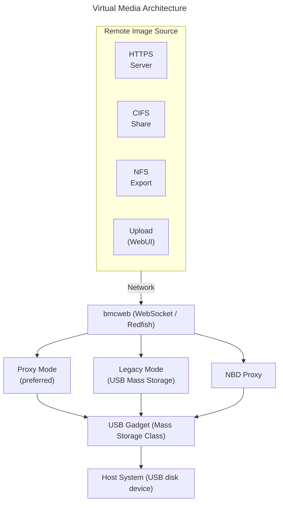
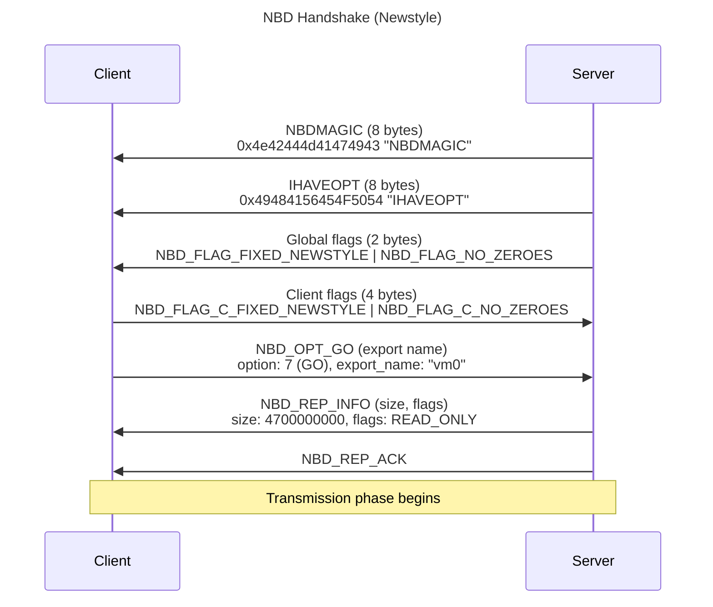
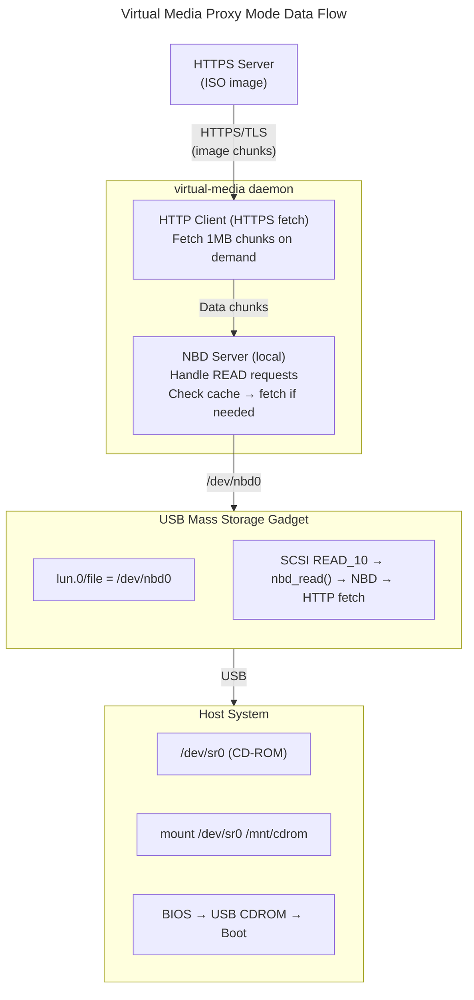

# Virtual Media Guide
{: .no_toc }

Configure remote ISO and image mounting on OpenBMC.
{: .fs-6 .fw-300 }

## Table of Contents
{: .no_toc .text-delta }

1. TOC
{:toc}

---

## Overview

**Virtual Media** allows mounting remote disk images (ISO, IMG) to the host system over the network, appearing as local USB storage devices. This enables remote OS installation and recovery without physical media.



<details>
<summary>ASCII-art version (click to expand)</summary>

```
┌─────────────────────────────────────────────────────────────────┐
│                   Virtual Media Architecture                    │
├─────────────────────────────────────────────────────────────────┤
│                                                                 │
│  ┌─────────────────────────────────────────────────────────────┐│
│  │                   Remote Image Source                       ││
│  │                                                             ││
│  │   ┌──────────┐  ┌──────────┐  ┌──────────┐  ┌──────────┐    ││
│  │   │  HTTPS   │  │  CIFS    │  │   NFS    │  │  Upload  │    ││
│  │   │  Server  │  │  Share   │  │  Export  │  │ (WebUI)  │    ││
│  │   └────┬─────┘  └────┬─────┘  └────┬─────┘  └────┬─────┘    ││
│  └────────┼─────────────┼─────────────┼─────────────┼──────────┘│
│           └─────────────┴─────────────┴─────────────┘           │
│                                   │                             │
│                              Network                            │
│                                   │                             │
│  ┌────────────────────────────────┴────────────────────────────┐│
│  │                          bmcweb                             ││
│  │                   (WebSocket / Redfish)                     ││
│  └────────────────────────────────┬────────────────────────────┘│
│                                   │                             │
│           ┌───────────────────────┼──────────────────────┐      │
│           │                       │                      │      │
│  ┌────────┴────────┐    ┌─────────┴─────────┐   ┌────────┴────┐ │
│  │   Proxy Mode    │    │   Legacy Mode     │   │  NBD Proxy  │ │
│  │ (preferred)     │    │ (USB Mass Storage)│   │             │ │
│  └────────┬────────┘    └─────────┬─────────┘   └───────┬─────┘ │
│           │                       │                     │       │
│  ┌────────┴───────────────────────┴─────────────────────┴──────┐│
│  │                      USB Gadget                             ││
│  │                  (Mass Storage Class)                       ││
│  └────────────────────────────┬────────────────────────────────┘│
│                               │                                 │
│  ┌────────────────────────────┴────────────────────────────────┐│
│  │                      Host System                            ││
│  │                  (USB disk device)                          ││
│  └─────────────────────────────────────────────────────────────┘│
└─────────────────────────────────────────────────────────────────┘
```

</details>

---

## Modes of Operation

### Proxy Mode (Recommended)

- Image streams from remote server through BMC
- No local storage required on BMC
- Supports HTTPS, NFS, CIFS sources
- Lower latency for network-accessible images

### Legacy Mode

- Image stored locally on BMC filesystem
- Presented via USB mass storage
- Works offline once mounted
- Limited by BMC storage capacity

### NBD Proxy

- Network Block Device protocol
- Efficient streaming protocol
- Used with WebSocket connections

---

## Hardware Requirements

Virtual Media requires USB device controller:

| BMC SoC | USB Controller | Mass Storage |
|---------|----------------|--------------|
| ASPEED AST2500/2600 | USB 2.0 device | Supported |
| Nuvoton NPCM7xx | USB 2.0 device | Supported |

---

## Setup & Configuration

### Build-Time Configuration (Yocto)

```bitbake
# In your machine .conf or local.conf

# Include virtual media support
IMAGE_INSTALL:append = " virtual-media"

# Enable in bmcweb
EXTRA_OEMESON:pn-bmcweb = " \
    -Dvm-websocket=enabled \
    -Dvm-nbdproxy=enabled \
"

# Include NBD client (for proxy mode)
IMAGE_INSTALL:append = " nbd-client"
```

### bmcweb Virtual Media Options

| Option | Default | Description |
|--------|---------|-------------|
| `vm-websocket` | enabled | Virtual Media WebSocket support |
| `vm-nbdproxy` | enabled | NBD proxy for streaming |
| `insecure-vm-auth` | disabled | Unauthenticated VM (testing) |

### Runtime Configuration

```bash
# Check virtual media service
systemctl status virtual-media

# View logs
journalctl -u virtual-media -f

# Check USB gadget configuration
ls /sys/kernel/config/usb_gadget/
```

---

## Mounting Images

### Via WebUI

1. Login to WebUI at `https://<bmc-ip>/`
2. Navigate to **Operations** → **Virtual Media**
3. Select device type: **CD/DVD** or **USB**
4. Choose mount method:
   - **From URL**: Enter HTTP/HTTPS/NFS/CIFS path
   - **Upload**: Upload local file
5. Click **Mount**

### Via Redfish API

#### List Virtual Media Devices

```bash
curl -k -u root:0penBmc \
    https://localhost/redfish/v1/Managers/bmc/VirtualMedia
```

#### Mount from URL

```bash
# Mount ISO from HTTPS server
curl -k -u root:0penBmc -X PATCH \
    -H "Content-Type: application/json" \
    -d '{
        "Image": "https://example.com/images/ubuntu-22.04.iso",
        "TransferProtocolType": "HTTPS",
        "UserName": "",
        "Password": "",
        "WriteProtected": true,
        "Inserted": true
    }' \
    https://localhost/redfish/v1/Managers/bmc/VirtualMedia/Slot_0

# Mount from NFS
curl -k -u root:0penBmc -X PATCH \
    -H "Content-Type: application/json" \
    -d '{
        "Image": "nfs://192.168.1.100/exports/images/boot.iso",
        "Inserted": true
    }' \
    https://localhost/redfish/v1/Managers/bmc/VirtualMedia/Slot_0

# Mount from CIFS/SMB
curl -k -u root:0penBmc -X PATCH \
    -H "Content-Type: application/json" \
    -d '{
        "Image": "smb://192.168.1.100/share/images/install.iso",
        "UserName": "user",
        "Password": "password",
        "Inserted": true
    }' \
    https://localhost/redfish/v1/Managers/bmc/VirtualMedia/Slot_0
```

#### Check Mount Status

```bash
curl -k -u root:0penBmc \
    https://localhost/redfish/v1/Managers/bmc/VirtualMedia/Slot_0
```

Response:
```json
{
    "@odata.id": "/redfish/v1/Managers/bmc/VirtualMedia/Slot_0",
    "Id": "Slot_0",
    "Name": "VirtualMedia",
    "MediaTypes": ["CD", "DVD"],
    "Image": "https://example.com/images/ubuntu.iso",
    "ImageName": "ubuntu.iso",
    "Inserted": true,
    "WriteProtected": true,
    "ConnectedVia": "URI",
    "TransferProtocolType": "HTTPS"
}
```

#### Unmount Image

```bash
curl -k -u root:0penBmc -X PATCH \
    -H "Content-Type: application/json" \
    -d '{"Inserted": false}' \
    https://localhost/redfish/v1/Managers/bmc/VirtualMedia/Slot_0
```

#### Eject Action

```bash
curl -k -u root:0penBmc -X POST \
    https://localhost/redfish/v1/Managers/bmc/VirtualMedia/Slot_0/Actions/VirtualMedia.EjectMedia
```

---

## Configuration Options

### Virtual Media Slots

```bash
# Default slots (varies by implementation)
Slot_0  - CD/DVD (read-only)
Slot_1  - USB storage (read-write)

# Check available slots
curl -k -u root:0penBmc \
    https://localhost/redfish/v1/Managers/bmc/VirtualMedia | jq '.Members'
```

### Transfer Protocol Support

| Protocol | Port | Use Case |
|----------|------|----------|
| HTTPS | 443 | Secure download, most common |
| HTTP | 80 | Testing only |
| NFS | 2049 | Network file system |
| CIFS/SMB | 445 | Windows shares |

### USB Gadget Configuration

```bash
# USB mass storage gadget setup
# Typically auto-configured by virtual-media service

# View gadget configuration
cat /sys/kernel/config/usb_gadget/virtual_media/UDC

# Check backing file
ls -l /sys/kernel/config/usb_gadget/virtual_media/functions/mass_storage.usb0/lun.0/
```

---

## Boot from Virtual Media

### Configure Boot Order

```bash
# Set boot source override to CD
curl -k -u root:0penBmc -X PATCH \
    -H "Content-Type: application/json" \
    -d '{
        "Boot": {
            "BootSourceOverrideTarget": "Cd",
            "BootSourceOverrideEnabled": "Once"
        }
    }' \
    https://localhost/redfish/v1/Systems/system
```

### One-Time Boot Sequence

1. Mount installation ISO
2. Set boot override to CD
3. Reset/power on system
4. System boots from virtual CD

```bash
# Complete workflow
# 1. Mount ISO
curl -k -u root:0penBmc -X PATCH \
    -H "Content-Type: application/json" \
    -d '{"Image": "https://server/ubuntu.iso", "Inserted": true}' \
    https://localhost/redfish/v1/Managers/bmc/VirtualMedia/Slot_0

# 2. Set boot source
curl -k -u root:0penBmc -X PATCH \
    -H "Content-Type: application/json" \
    -d '{"Boot": {"BootSourceOverrideTarget": "Cd", "BootSourceOverrideEnabled": "Once"}}' \
    https://localhost/redfish/v1/Systems/system

# 3. Power cycle
curl -k -u root:0penBmc -X POST \
    -H "Content-Type: application/json" \
    -d '{"ResetType": "ForceRestart"}' \
    https://localhost/redfish/v1/Systems/system/Actions/ComputerSystem.Reset
```

---

## WebSocket Mode

### Connecting via WebSocket

For direct file streaming:

```javascript
// JavaScript example
const ws = new WebSocket('wss://bmc-ip/nbd/0');

// Handle binary data streaming
ws.binaryType = 'arraybuffer';

ws.onmessage = function(event) {
    // Handle NBD protocol messages
};
```

### NBD Protocol

Network Block Device protocol for efficient streaming:

```bash
# Check NBD devices
ls /dev/nbd*

# NBD proxy handles protocol translation
# WebSocket → NBD → USB mass storage
```

---

## Troubleshooting

### Image Not Mounting

```bash
# Check virtual media service
systemctl status virtual-media
journalctl -u virtual-media -f

# Verify URL is accessible from BMC
curl -k https://example.com/image.iso -o /dev/null

# Check USB gadget
ls /sys/kernel/config/usb_gadget/
```

### Host Not Seeing USB Device

```bash
# Check USB connection
lsusb -t   # On host if possible

# Verify USB gadget is bound
cat /sys/kernel/config/usb_gadget/*/UDC

# Check USB device controller
ls /sys/class/udc/

# Rebind gadget
echo "" > /sys/kernel/config/usb_gadget/virtual_media/UDC
echo "1e6a0000.usb-vhub:p1" > /sys/kernel/config/usb_gadget/virtual_media/UDC
```

### Slow Transfer Speed

```bash
# Check network connection
iftop -i eth0

# Monitor image streaming
journalctl -u virtual-media -f

# For large images, consider:
# - Local caching
# - Faster network link
# - Proximity of image server
```

### Boot Fails

```bash
# Verify boot order in BIOS
# USB boot may need to be enabled

# Check image integrity
curl https://server/image.iso | sha256sum

# Verify image is bootable
# May need to test image locally first
```

### Authentication Errors

```bash
# For CIFS/SMB shares
# Verify credentials
smbclient //server/share -U username

# For HTTPS with client cert
# Check certificate configuration
```

---

## Security Considerations

### Image Source Authentication

```bash
# Prefer HTTPS for image sources
# Verify SSL certificates

# For self-signed certs, may need:
EXTRA_OEMESON:pn-bmcweb = " \
    -Dinsecure-ignore-cert-errors=enabled \
"
# NOT recommended for production
```

### Access Control

```bash
# Virtual media access requires authentication
# Recommended: Operator role or higher

# Check role permissions
curl -k -u root:0penBmc \
    https://localhost/redfish/v1/AccountService/Roles
```

### Write Protection

```bash
# Always mount OS images as write-protected
curl -k -u root:0penBmc -X PATCH \
    -H "Content-Type: application/json" \
    -d '{
        "Image": "https://server/image.iso",
        "WriteProtected": true,
        "Inserted": true
    }' \
    https://localhost/redfish/v1/Managers/bmc/VirtualMedia/Slot_0
```

---

## Enabling/Disabling Virtual Media

### Build-Time Disable

```bitbake
# Disable virtual media
EXTRA_OEMESON:pn-bmcweb = " \
    -Dvm-websocket=disabled \
    -Dvm-nbdproxy=disabled \
"
IMAGE_INSTALL:remove = "virtual-media"
```

### Runtime Disable

```bash
# Stop virtual media service
systemctl stop virtual-media
systemctl disable virtual-media

# Unmount any mounted images first
curl -k -u root:0penBmc -X POST \
    https://localhost/redfish/v1/Managers/bmc/VirtualMedia/Slot_0/Actions/VirtualMedia.EjectMedia
```

---

## Deep Dive
{: .text-delta }

Advanced implementation details for virtual media developers.

### NBD (Network Block Device) Protocol



**NBD Request Format (28 bytes):**

| Field | Size | Description |
|-------|------|-------------|
| Magic | 4 bytes | 0x25609513 |
| Flags | 2 bytes | 0x0000 |
| Type | 2 bytes | NBD_CMD_* |
| Handle | 8 bytes | request_id |
| Offset | 8 bytes | byte_offset |
| Length | 4 bytes | bytes_to_read |

**NBD Commands:**
- `NBD_CMD_READ` (0) - Read data from export
- `NBD_CMD_WRITE` (1) - Write data to export
- `NBD_CMD_DISC` (2) - Disconnect gracefully
- `NBD_CMD_FLUSH` (3) - Flush writes to storage
- `NBD_CMD_TRIM` (4) - Discard blocks (sparse)

**NBD Reply Format (16 bytes + data):**

| Field | Size | Description |
|-------|------|-------------|
| Magic | 4 bytes | 0x67446698 |
| Error | 4 bytes | 0 (OK) |
| Handle | 8 bytes | request_id (matches request) |

Data payload follows for READ responses.

<details>
<summary>ASCII-art version (click to expand)</summary>

```
┌────────────────────────────────────────────────────────────────────────────┐
│                          NBD Protocol Overview                             │
├────────────────────────────────────────────────────────────────────────────┤
│                                                                            │
│  NBD HANDSHAKE (Newstyle)                                                  │
│  ────────────────────────                                                  │
│                                                                            │
│  Client                                        Server                      │
│     │                                             │                        │
│     │              NBDMAGIC (8 bytes)             │                        │
│     │<────────────────────────────────────────────│                        │
│     │  0x4e42444d41474943 "NBDMAGIC"              │                        │
│     │                                             │                        │
│     │              IHAVEOPT (8 bytes)             │                        │
│     │<────────────────────────────────────────────│                        │
│     │  0x49484156454F5054 "IHAVEOPT"              │                        │
│     │                                             │                        │
│     │           Global flags (2 bytes)            │                        │
│     │<────────────────────────────────────────────│                        │
│     │  NBD_FLAG_FIXED_NEWSTYLE | NBD_FLAG_NO_ZEROES                        │
│     │                                             │                        │
│     │           Client flags (4 bytes)            │                        │
│     │────────────────────────────────────────────>│                        │
│     │  NBD_FLAG_C_FIXED_NEWSTYLE | NBD_FLAG_C_NO_ZEROES                    │
│     │                                             │                        │
│     │           NBD_OPT_GO (export name)          │                        │
│     │────────────────────────────────────────────>│                        │
│     │  option: 7 (GO)                             │                        │
│     │  length: strlen(export_name)                │                        │
│     │  export_name: "vm0"                         │                        │
│     │                                             │                        │
│     │           NBD_REP_INFO (size, flags)        │                        │
│     │<────────────────────────────────────────────│                        │
│     │  info_type: NBD_INFO_EXPORT                 │                        │
│     │  size: 4700000000 (ISO size)                │                        │
│     │  flags: NBD_FLAG_READ_ONLY                  │                        │
│     │                                             │                        │
│     │           NBD_REP_ACK                       │                        │
│     │<────────────────────────────────────────────│                        │
│     │                                             │                        │
│     │  [Transmission phase begins]                │                        │
│                                                                            │
│  NBD REQUEST FORMAT (28 bytes):                                            │
│  ──────────────────────────────                                            │
│                                                                            │
│  ┌─────────────┬────────────┬────────────┬────────────┬────────────────┐   │
│  │  Magic      │   Flags    │   Type     │   Handle   │    Offset      │   │
│  │  (4 bytes)  │  (2 bytes) │  (2 bytes) │  (8 bytes) │   (8 bytes)    │   │
│  ├─────────────┼────────────┼────────────┼────────────┼────────────────┤   │
│  │ 0x25609513  │   0x0000   │ NBD_CMD_*  │ request_id │  byte_offset   │   │
│  └─────────────┴────────────┴────────────┴────────────┴────────────────┘   │
│  ┌─────────────────────────────────────────────────────────────────────┐   │
│  │  Length (4 bytes)                                                   │   │
│  ├─────────────────────────────────────────────────────────────────────┤   │
│  │  bytes_to_read                                                      │   │
│  └─────────────────────────────────────────────────────────────────────┘   │
│                                                                            │
│  NBD COMMANDS:                                                             │
│    NBD_CMD_READ  (0) - Read data from export                               │
│    NBD_CMD_WRITE (1) - Write data to export                                │
│    NBD_CMD_DISC  (2) - Disconnect gracefully                               │
│    NBD_CMD_FLUSH (3) - Flush writes to storage                             │
│    NBD_CMD_TRIM  (4) - Discard blocks (sparse)                             │
│                                                                            │
│  NBD REPLY FORMAT (16 bytes + data):                                       │
│  ─────────────────────────────────                                         │
│                                                                            │
│  ┌─────────────┬────────────┬────────────────────────────────────────┐     │
│  │  Magic      │   Error    │   Handle                               │     │
│  │  (4 bytes)  │  (4 bytes) │   (8 bytes)                            │     │
│  ├─────────────┼────────────┼────────────────────────────────────────┤     │
│  │ 0x67446698  │  0 (OK)    │  request_id (matches request)          │     │
│  └─────────────┴────────────┴────────────────────────────────────────┘     │
│  [Data payload follows for READ responses]                                 │
│                                                                            │
└────────────────────────────────────────────────────────────────────────────┘
```

</details>

### USB Mass Storage Gadget Architecture

**ConfigFS Gadget Setup:**

```
/sys/kernel/config/usb_gadget/virtual_media/
├── idVendor           # 0x1d6b (Linux Foundation)
├── idProduct          # 0x0104 (Composite Gadget)
├── bcdDevice          # 0x0100
├── bcdUSB             # 0x0200 (USB 2.0)
├── strings/0x409/
│   ├── manufacturer   # "OpenBMC"
│   ├── product        # "Virtual Media"
│   └── serialnumber   # BMC serial
├── configs/c.1/
│   ├── MaxPower       # 500 mA
│   └── mass_storage.0 -> ../../functions/mass_storage.0
└── functions/
    └── mass_storage.0/
        └── lun.0/
            ├── cdrom        # 1 (CD-ROM mode for ISO)
            ├── ro           # 1 (read-only)
            ├── removable    # 1 (removable media)
            ├── nofua        # 0 (respect FUA bit)
            └── file         # /dev/nbd0 or /path/to/image.iso
```

**Command Block Wrapper (CBW) - 31 bytes:**

| Field | Value | Size |
|-------|-------|------|
| dCBWSignature | 0x43425355 "USBC" | 4 bytes |
| dCBWTag | Transaction identifier | 4 bytes |
| dCBWDataLength | Expected data transfer length | 4 bytes |
| bmCBWFlags | Direction (0x80=IN, 0x00=OUT) | 1 byte |
| bCBWLUN | Logical Unit Number (0) | 1 byte |
| bCBWCBLength | SCSI command length (6-16) | 1 byte |
| CBWCB[16] | SCSI command block | 16 bytes |

**Common SCSI Commands for CD-ROM:**
- `INQUIRY` (0x12) - Device identification
- `TEST_UNIT_READY` (0x00) - Check if media present
- `READ_CAPACITY` (0x25) - Get media size
- `READ_10` (0x28) - Read data blocks
- `MODE_SENSE_10` (0x5A) - Get device parameters
- `GET_CONFIGURATION` (0x46) - Get multimedia features

**Command Status Wrapper (CSW) - 13 bytes:**

| Field | Value | Size |
|-------|-------|------|
| dCSWSignature | 0x53425355 "USBS" | 4 bytes |
| dCSWTag | Matches CBW tag | 4 bytes |
| dCSWDataResidue | Bytes not transferred | 4 bytes |
| bCSWStatus | 0=OK, 1=Failed, 2=Phase Error | 1 byte |

### Proxy Mode Data Flow



**Caching Strategy:**

- **Read-ahead caching**: When block N is requested, prefetch blocks N+1 to N+K. Reduces latency for sequential reads (common during boot).
- **LRU cache eviction**: Limited BMC memory (e.g., 64MB cache). Evict least recently used chunks when full.
- **Sparse image support**: Only fetch blocks actually read by host. Zero-fill unread blocks (improves mount speed).

<details>
<summary>ASCII-art version (click to expand)</summary>

```
┌────────────────────────────────────────────────────────────────────────────┐
│                     Virtual Media Proxy Mode Data Flow                     │
├────────────────────────────────────────────────────────────────────────────┤
│                                                                            │
│  IMAGE SOURCE                BMCPROXY                              HOST    │
│  ────────────                ────────                              ────    │
│                                                                            │
│  ┌──────────────┐                                                          │
│  │ HTTPS Server │                                                          │
│  │ (ISO image)  │                                                          │
│  └──────┬───────┘                                                          │
│         │                                                                  │
│         │ HTTPS/TLS (image chunks)                                         │
│         v                                                                  │
│  ┌─────────────────────────────────────────────────────────────────────┐   │
│  │                      virtual-media daemon                           │   │
│  │                                                                     │   │
│  │  ┌───────────────────────────────────────────────────────────────┐  │   │
│  │  │  HTTP Client (HTTPS fetch)                                    │  │   │
│  │  │                                                               │  │   │
│  │  │  curl_easy_setopt(curl, CURLOPT_URL, image_url);              │  │   │
│  │  │  curl_easy_setopt(curl, CURLOPT_RANGE, "0-1048575");          │  │   │
│  │  │  // Fetch 1MB chunks on demand                                │  │   │
│  │  └───────────────────────────────────────────────────────────────┘  │   │
│  │                          │                                          │   │
│  │                          │ Data chunks                              │   │
│  │                          v                                          │   │
│  │  ┌───────────────────────────────────────────────────────────────┐  │   │
│  │  │  NBD Server (local)                                           │  │   │
│  │  │                                                               │  │   │
│  │  │  // Handle READ requests from USB gadget                      │  │   │
│  │  │  void handleRead(uint64_t offset, uint32_t length) {          │  │   │
│  │  │      // Check cache                                           │  │   │
│  │  │      if (!cache.contains(offset, length)) {                   │  │   │
│  │  │          // Fetch from remote                                 │  │   │
│  │  │          fetchChunk(offset, length);                          │  │   │
│  │  │      }                                                        │  │   │
│  │  │      sendNbdReply(cache.get(offset, length));                 │  │   │
│  │  │  }                                                            │  │   │
│  │  └──────────────────────────┬────────────────────────────────────┘  │   │
│  │                             │                                       │   │
│  └─────────────────────────────┼───────────────────────────────────────┘   │
│                                │ /dev/nbd0                                 │
│                                v                                           │
│  ┌─────────────────────────────────────────────────────────────────────┐   │
│  │  USB Mass Storage Gadget                                            │   │
│  │                                                                     │   │
│  │  functions/mass_storage.0/lun.0/file = "/dev/nbd0"                  │   │
│  │                                                                     │   │
│  │  SCSI READ_10 → nbd_read() → NBD protocol → HTTP fetch → data       │   │
│  └──────────────────────────┬──────────────────────────────────────────┘   │
│                             │ USB                                          │
│                             v                                              │
│  ┌─────────────────────────────────────────────────────────────────────┐   │
│  │  Host System                                                        │   │
│  │                                                                     │   │
│  │  /dev/sr0 (CD-ROM device)                                           │   │
│  │  Mount: mount /dev/sr0 /mnt/cdrom                                   │   │
│  │  Boot:  BIOS boot menu → USB CDROM → Boot from ISO                  │   │
│  └─────────────────────────────────────────────────────────────────────┘   │
│                                                                            │
│  CACHING STRATEGY:                                                         │
│  ─────────────────                                                         │
│                                                                            │
│  ┌──────────────────────────────────────────────────────────────────────┐  │
│  │  Read-ahead caching:                                                 │  │
│  │    - When block N is requested, prefetch blocks N+1 to N+K           │  │
│  │    - Reduces latency for sequential reads (common during boot)       │  │
│  │                                                                      │  │
│  │  LRU cache eviction:                                                 │  │
│  │    - Limited BMC memory (e.g., 64MB cache)                           │  │
│  │    - Evict least recently used chunks when full                      │  │
│  │                                                                      │  │
│  │  Sparse image support:                                               │  │
│  │    - Only fetch blocks actually read by host                         │  │
│  │    - Zero-fill unread blocks (improves mount speed)                  │  │
│  └──────────────────────────────────────────────────────────────────────┘  │
│                                                                            │
└────────────────────────────────────────────────────────────────────────────┘
```

</details>

### Source Code Reference

Key implementation files in [virtual-media](https://github.com/openbmc/virtual-media):

| File | Description |
|------|-------------|
| `src/main.cpp` | Service entry point and D-Bus object creation |
| `src/state_machine.cpp` | Mount/unmount state machine |
| `src/smb.cpp` | CIFS/SMB network share handling |
| `src/https.cpp` | HTTPS image fetching with curl |
| `src/nbd_proxy.cpp` | NBD protocol client/server implementation |
| `src/usb_gadget.cpp` | USB mass storage gadget configuration |

---

## References

- [OpenBMC Virtual Media](https://github.com/openbmc/virtual-media)
- [Redfish VirtualMedia Schema](https://redfish.dmtf.org/schemas/VirtualMedia.v1_6_0.json)
- [NBD Protocol](https://nbd.sourceforge.io/)
- [USB Mass Storage Class](https://www.usb.org/document-library/mass-storage-class-specification-overview-14)

---

{: .note }
**Tested on**: OpenBMC master, requires hardware with USB device controller
