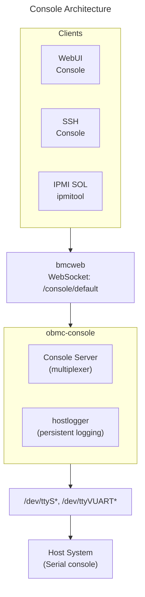

# Console Guide
{: .no_toc }

Configure serial console access and host logging on OpenBMC.
{: .fs-6 .fw-300 }

## Table of Contents
{: .no_toc .text-delta }

1. TOC
{:toc}

---

## Overview

**Serial Console** provides text-mode access to the host system through the BMC, enabling boot monitoring, BIOS configuration, and command-line access when graphical interfaces are unavailable.



<details>
<summary>ASCII-art version (for comparison)</summary>

```
┌─────────────────────────────────────────────────────────────────┐
│                    Console Architecture                         │
├─────────────────────────────────────────────────────────────────┤
│                                                                 │
│  ┌─────────────────────────────────────────────────────────────┐│
│  │                      Clients                                ││
│  │                                                             ││
│  │   ┌────────────┐  ┌────────────┐  ┌────────────┐            ││
│  │   │  WebUI     │  │  SSH       │  │  IPMI SOL  │            ││
│  │   │  Console   │  │  Console   │  │  ipmitool  │            ││
│  │   └─────┬──────┘  └─────┬──────┘  └─────┬──────┘            ││
│  └─────────┼───────────────┼───────────────┼───────────────────┘│
│            │               │               │                    │
│  ┌─────────┴───────────────┴───────────────┴───────────────────┐│
│  │                        bmcweb                               ││
│  │              WebSocket: /console/default                    ││
│  └─────────────────────────┬───────────────────────────────────┘│
│                            │                                    │
│  ┌─────────────────────────┴───────────────────────────────────┐│
│  │                     obmc-console                            ││
│  │                                                             ││
│  │   ┌─────────────────┐  ┌─────────────────────────────────┐  ││
│  │   │  Console Server │  │  hostlogger                     │  ││
│  │   │  (multiplexer)  │  │  (persistent logging)           │  ││
│  │   └────────┬────────┘  └─────────────────────────────────┘  ││
│  └────────────┼────────────────────────────────────────────────┘│
│               │                                                 │
│  ┌────────────┴────────────────────────────────────────────────┐│
│  │                   Serial Port Interface                     ││
│  │             (/dev/ttyS*, /dev/ttyVUART*)                    ││
│  └────────────────────────┬────────────────────────────────────┘│
│                           │                                     │
│  ┌────────────────────────┴────────────────────────────────────┐│
│  │                      Host System                            ││
│  │                   (Serial console)                          ││
│  └─────────────────────────────────────────────────────────────┘│
└─────────────────────────────────────────────────────────────────┘
```

</details>

---

## Components

### obmc-console-server

- Multiplexes serial port to multiple clients
- Provides Unix socket interface
- Handles console access control

### obmc-console-client

- Command-line console access
- Connects to console-server socket

### hostlogger

- Captures console output persistently
- Stores in rotating log files
- Available via Redfish API

---

## Hardware Configuration

### Serial Port Types

| Type | Description | Device Path |
|------|-------------|-------------|
| Physical UART | Hardware serial port | /dev/ttyS0, /dev/ttyS1 |
| Virtual UART | LPC/VUART interface | /dev/ttyVUART0 |
| PTY | Pseudo-terminal (testing) | /dev/pts/* |

### ASPEED VUART

ASPEED BMCs use Virtual UART for LPC-based console:

```dts
// Device tree configuration
&vuart {
    status = "okay";
};
```

### Nuvoton Serial

```dts
// Device tree for serial ports
&serial1 {
    status = "okay";
};
```

---

## Setup & Configuration

### Build-Time Configuration (Yocto)

```bitbake
# In your machine .conf or local.conf

# Include console packages
IMAGE_INSTALL:append = " \
    obmc-console \
    phosphor-hostlogger \
"

# Configure console device in machine config
OBMC_CONSOLE_HOST_TTY ?= "ttyVUART0"

# For physical serial port:
# OBMC_CONSOLE_HOST_TTY ?= "ttyS2"
```

### Console Server Configuration

Configuration file: `/etc/obmc-console/server.ttyVUART0.conf`

```ini
# Console server configuration

# Socket directory
socket-id = default

# Console device
console-id = default

# Baud rate
baud = 115200

# Local echo (for testing)
#local-echo = true

# Logfile (if not using hostlogger)
#logfile = /var/log/obmc-console.log
```

### Multiple Console Support

```ini
# /etc/obmc-console/server.ttyS0.conf
socket-id = host0
console-id = host0
baud = 115200

# /etc/obmc-console/server.ttyS1.conf
socket-id = host1
console-id = host1
baud = 115200
```

### Runtime Configuration

```bash
# Check console service status
systemctl status obmc-console-server@ttyVUART0

# View console logs
journalctl -u obmc-console-server@ttyVUART0 -f

# Restart console service
systemctl restart obmc-console-server@ttyVUART0
```

---

## Accessing the Console

### Via WebUI

1. Login to WebUI at `https://<bmc-ip>/`
2. Navigate to **Operations** → **Serial over LAN Console**
3. Terminal opens in browser window
4. Type commands to interact with host

### Via SSH

```bash
# Direct console access via SSH
ssh -t root@bmc-ip /usr/bin/obmc-console-client

# With specific console ID
ssh -t root@bmc-ip /usr/bin/obmc-console-client -i host0
```

### Via IPMI SOL

```bash
# Activate SOL session
ipmitool -I lanplus -H bmc-ip -U root -P 0penBmc sol activate

# Deactivate SOL session
ipmitool -I lanplus -H bmc-ip -U root -P 0penBmc sol deactivate

# SOL configuration
ipmitool -I lanplus -H bmc-ip -U root -P 0penBmc sol info
```

### Via Redfish

```bash
# Get console URL
curl -k -u root:0penBmc \
    https://localhost/redfish/v1/Managers/bmc

# Look for SerialConsole property
# WebSocket endpoint: wss://bmc-ip/console/default
```

### Via obmc-console-client

```bash
# On the BMC directly
obmc-console-client

# Specify console ID
obmc-console-client -i default

# Exit: Ctrl+] or ~.
```

---

## SOL Configuration

### IPMI SOL Settings

```bash
# Get SOL configuration
ipmitool -I lanplus -H bmc-ip -U root -P 0penBmc sol info

# Set SOL parameters
# Enable SOL
ipmitool -I lanplus -H bmc-ip -U root -P 0penBmc sol set enabled true

# Set baud rate
ipmitool -I lanplus -H bmc-ip -U root -P 0penBmc sol set volatile-bit-rate 115.2

# Set non-volatile baud rate
ipmitool -I lanplus -H bmc-ip -U root -P 0penBmc sol set non-volatile-bit-rate 115.2

# Set privilege level
ipmitool -I lanplus -H bmc-ip -U root -P 0penBmc sol set privilege-level operator
```

### SOL Baud Rates

| Value | Rate |
|-------|------|
| 6 | 9600 |
| 7 | 19200 |
| 8 | 38400 |
| 9 | 57600 |
| 10 | 115200 |

### Redfish SOL Configuration

```bash
# Get network protocol settings
curl -k -u root:0penBmc \
    https://localhost/redfish/v1/Managers/bmc/NetworkProtocol

# Note: SOL is typically configured via IPMI
# Redfish Serial Console is different from IPMI SOL
```

---

## Host Logger Configuration

### Enable Host Logger

```bitbake
# In Yocto build
IMAGE_INSTALL:append = " phosphor-hostlogger"
```

### Configure Host Logger

```bash
# Configuration file
cat /etc/hostlogger.conf

# Common settings:
# - Buffer size
# - Log rotation
# - Flush interval
```

### systemd Service

```ini
# /lib/systemd/system/phosphor-hostlogger@.service
[Unit]
Description=Host Console Logger for %i
After=obmc-console-server@%i.service

[Service]
ExecStart=/usr/bin/hostlogger -i %i
Restart=always

[Install]
WantedBy=multi-user.target
```

### View Host Logs

```bash
# Via Redfish
curl -k -u root:0penBmc \
    https://localhost/redfish/v1/Systems/system/LogServices/HostLogger/Entries

# Local files (if configured)
ls /var/log/host*

# Via journal
journalctl -u phosphor-hostlogger@ttyVUART0
```

---

## Console Escape Sequences

### obmc-console-client

| Sequence | Action |
|----------|--------|
| `~.` | Disconnect |
| `~?` | Show help |
| `~^Z` | Suspend |
| `~~` | Send literal ~ |

### SSH Session

| Sequence | Action |
|----------|--------|
| `~.` | Disconnect (SSH + console) |
| `Enter ~.` | Disconnect properly |

### IPMI SOL

| Sequence | Action |
|----------|--------|
| `~.` | Deactivate SOL |
| `~^Z` | Suspend SOL |
| `~B` | Send break |

---

## Multiple Host Consoles

For systems with multiple hosts:

```bash
# Configuration for each host
# /etc/obmc-console/server.host0.conf
socket-id = host0
console-id = host0

# /etc/obmc-console/server.host1.conf
socket-id = host1
console-id = host1
```

### Access Each Console

```bash
# Via WebUI - select from dropdown
# Via SSH
ssh -t root@bmc-ip /usr/bin/obmc-console-client -i host0
ssh -t root@bmc-ip /usr/bin/obmc-console-client -i host1

# Via IPMI - use channel parameter
ipmitool -I lanplus -H bmc-ip -U root -P 0penBmc -c 1 sol activate
```

---

## Troubleshooting

### No Console Output

```bash
# Check if console server is running
systemctl status obmc-console-server@ttyVUART0

# Check device exists
ls -la /dev/ttyVUART0

# Check permissions
stat /dev/ttyVUART0

# Check serial port configuration
stty -F /dev/ttyVUART0 -a

# Verify baud rate matches host
stty -F /dev/ttyVUART0 115200
```

### Console Frozen

```bash
# Restart console server
systemctl restart obmc-console-server@ttyVUART0

# Kill stuck clients
pkill obmc-console-client

# Check for hardware issues
dmesg | grep -i uart
```

### Garbled Text

```bash
# Baud rate mismatch - verify settings match
# Host BIOS/OS must use same baud rate as BMC

# Common baud rates to try:
stty -F /dev/ttyVUART0 9600
stty -F /dev/ttyVUART0 19200
stty -F /dev/ttyVUART0 38400
stty -F /dev/ttyVUART0 57600
stty -F /dev/ttyVUART0 115200
```

### SOL Connection Failed

```bash
# Check IPMI service
systemctl status phosphor-ipmi-net

# Verify SOL is enabled
ipmitool -I lanplus -H bmc-ip -U root -P 0penBmc sol info

# Check for active sessions
ipmitool -I lanplus -H bmc-ip -U root -P 0penBmc session info all

# Force deactivate stale session
ipmitool -I lanplus -H bmc-ip -U root -P 0penBmc sol deactivate
```

### Permission Denied

```bash
# Check user permissions
# User needs Operator or Administrator role

# Verify via Redfish
curl -k -u user:password \
    https://localhost/redfish/v1/AccountService/Accounts/user
```

---

## Security Considerations

### Access Control

```bash
# Console access requires authentication
# Recommended role: Operator or Administrator

# View user roles
curl -k -u root:0penBmc \
    https://localhost/redfish/v1/AccountService/Accounts
```

### SOL Encryption

IPMI SOL uses RMCP+ encryption:

```bash
# Check cipher suite
ipmitool -I lanplus -H bmc-ip -U root -P 0penBmc -C 17 sol activate

# Cipher 17 = AES-CBC-128 + HMAC-SHA256 (recommended)
```

### Console Logging Security

```bash
# Console logs may contain sensitive data
# Configure retention policy
# Restrict access to log files

# File permissions
chmod 600 /var/log/hostlogger/*
```

---

## Enabling/Disabling Console

### Build-Time Disable

```bitbake
# Remove console packages
IMAGE_INSTALL:remove = "obmc-console phosphor-hostlogger"
```

### Runtime Disable

```bash
# Stop console service
systemctl stop obmc-console-server@ttyVUART0
systemctl disable obmc-console-server@ttyVUART0

# Stop hostlogger
systemctl stop phosphor-hostlogger@ttyVUART0
systemctl disable phosphor-hostlogger@ttyVUART0
```

### Disable SOL via IPMI

```bash
ipmitool -I lanplus -H bmc-ip -U root -P 0penBmc sol set enabled false
```

---

## Deep Dive
{: .text-delta }

Advanced implementation details for console developers.

### Console Server Multiplexing Architecture

```
┌────────────────────────────────────────────────────────────────────────────┐
│                   obmc-console Multiplexer Architecture                    │
├────────────────────────────────────────────────────────────────────────────┤
│                                                                            │
│  SERIAL DEVICE                                                             │
│  ─────────────                                                             │
│  /dev/ttyVUART0 (or /dev/ttyS*)                                            │
│        │                                                                   │
│        │ termios settings: 115200 8N1                                      │
│        v                                                                   │
│  ┌─────────────────────────────────────────────────────────────────────┐   │
│  │                    obmc-console-server                              │   │
│  │                                                                     │   │
│  │  ┌───────────────────────────────────────────────────────────────┐  │   │
│  │  │  TTY Handler                                                  │  │   │
│  │  │                                                               │  │   │
│  │  │  // Open serial port with correct settings                    │  │   │
│  │  │  fd = open("/dev/ttyVUART0", O_RDWR | O_NOCTTY);              │  │   │
│  │  │  tcgetattr(fd, &termios);                                     │  │   │
│  │  │  cfsetispeed(&termios, B115200);                              │  │   │
│  │  │  cfsetospeed(&termios, B115200);                              │  │   │
│  │  │  termios.c_cflag = CS8 | CREAD | CLOCAL;  // 8N1              │  │   │
│  │  │  tcsetattr(fd, TCSANOW, &termios);                            │  │   │
│  │  └───────────────────────────────────────────────────────────────┘  │   │
│  │                          │                                          │   │
│  │                          │ epoll multiplexing                       │   │
│  │                          v                                          │   │
│  │  ┌───────────────────────────────────────────────────────────────┐  │   │
│  │  │  Event Loop (main.c)                                          │  │   │
│  │  │                                                               │  │   │
│  │  │  epoll_fd = epoll_create1(0);                                 │  │   │
│  │  │  epoll_ctl(epoll_fd, EPOLL_CTL_ADD, tty_fd, &ev_tty);         │  │   │
│  │  │  epoll_ctl(epoll_fd, EPOLL_CTL_ADD, socket_fd, &ev_sock);     │  │   │
│  │  │                                                               │  │   │
│  │  │  while (running) {                                            │  │   │
│  │  │      n = epoll_wait(epoll_fd, events, MAX_EVENTS, -1);        │  │   │
│  │  │      for (i = 0; i < n; i++) {                                │  │   │
│  │  │          if (events[i].data.fd == tty_fd) {                   │  │   │
│  │  │              // Data from host → broadcast to all clients     │  │   │
│  │  │              handle_tty_data();                               │  │   │
│  │  │          } else if (events[i].data.fd == socket_fd) {         │  │   │
│  │  │              // New client connection                         │  │   │
│  │  │              accept_client();                                 │  │   │
│  │  │          } else {                                             │  │   │
│  │  │              // Data from client → write to tty               │  │   │
│  │  │              handle_client_data(events[i].data.fd);           │  │   │
│  │  │          }                                                    │  │   │
│  │  │      }                                                        │  │   │
│  │  │  }                                                            │  │   │
│  │  └───────────────────────────────────────────────────────────────┘  │   │
│  │                          │                                          │   │
│  │            ┌─────────────┼─────────────┐                            │   │
│  │            │             │             │                            │   │
│  │            v             v             v                            │   │
│  │  ┌──────────────┐ ┌──────────────┐ ┌──────────────┐                 │   │
│  │  │ Unix Socket  │ │ Unix Socket  │ │ Unix Socket  │                 │   │
│  │  │ Client 1     │ │ Client 2     │ │ Client 3     │                 │   │
│  │  │ (SSH)        │ │ (WebUI)      │ │ (hostlogger) │                 │   │
│  │  └──────────────┘ └──────────────┘ └──────────────┘                 │   │
│  │                                                                     │   │
│  └─────────────────────────────────────────────────────────────────────┘   │
│                                                                            │
│  UNIX SOCKET: /var/run/obmc-console.sock (or /run/obmc-console/ttyVUART0)  │
│                                                                            │
└────────────────────────────────────────────────────────────────────────────┘
```

### IPMI SOL Protocol Details

```
┌────────────────────────────────────────────────────────────────────────────┐
│                          IPMI SOL Packet Format                            │
├────────────────────────────────────────────────────────────────────────────┤
│                                                                            │
│  SOL PAYLOAD FORMAT (within RMCP+ session)                                 │
│  ─────────────────────────────────────────                                 │
│                                                                            │
│  ┌────────────────────────────────────────────────────────────────────┐    │
│  │  RMCP+ Session Header                                              │    │
│  │  ┌─────────────┬─────────────┬─────────────┬────────────────────┐  │    │
│  │  │ Auth Type   │ Payload Type│ Session ID  │ Sequence Number    │  │    │
│  │  │ (1 byte)    │ (1 byte)    │ (4 bytes)   │ (4 bytes)          │  │    │
│  │  │ 0x06 (RMCP+)│ 0x01 (SOL)  │             │                    │  │    │
│  │  └─────────────┴─────────────┴─────────────┴────────────────────┘  │    │
│  └────────────────────────────────────────────────────────────────────┘    │
│                                                                            │
│  ┌────────────────────────────────────────────────────────────────────┐    │
│  │  SOL Payload Header (4 bytes)                                      │    │
│  │                                                                    │    │
│  │  ┌─────────────────────────────────────────────────────────────┐   │    │
│  │  │ Byte 0: Packet Sequence Number (4 bits ack, 4 bits send)    │   │    │
│  │  │         ┌───┬───┬───┬───┬───┬───┬───┬───┐                   │   │    │
│  │  │         │ 7 │ 6 │ 5 │ 4 │ 3 │ 2 │ 1 │ 0 │                   │   │    │
│  │  │         ├───┴───┴───┴───┼───┴───┴───┴───┤                   │   │    │
│  │  │         │  Ack Seq Num  │ Packet Seq Num│                   │   │    │
│  │  │         └───────────────┴───────────────┘                   │   │    │
│  │  │                                                             │   │    │
│  │  │ Byte 1: Accepted Character Count                            │   │    │
│  │  │         Number of characters accepted from last packet      │   │    │
│  │  │                                                             │   │    │
│  │  │ Byte 2: Operation/Status                                    │   │    │
│  │  │         ┌───┬───┬───┬───┬───┬───┬───┬───┐                   │   │    │
│  │  │         │ 7 │ 6 │ 5 │ 4 │ 3 │ 2 │ 1 │ 0 │                   │   │    │
│  │  │         └───┴───┴───┴───┴───┴───┴───┴───┘                   │   │    │
│  │  │         Bit 0: Nack packet                                  │   │    │
│  │  │         Bit 1: Ring WOR (Wake on Ring)                      │   │    │
│  │  │         Bit 2: Break detected                               │   │    │
│  │  │         Bit 3: Transmit overrun                             │   │    │
│  │  │         Bit 4: SOL deactivating                             │   │    │
│  │  │         Bit 5: Character transfer unavail                   │   │    │
│  │  │         Bit 6: SOL deactivating                             │   │    │
│  │  │         Bit 7: Reserved                                     │   │    │
│  │  │                                                             │   │    │
│  │  │ Byte 3: Reserved                                            │   │    │
│  │  └─────────────────────────────────────────────────────────────┘   │    │
│  └────────────────────────────────────────────────────────────────────┘    │
│                                                                            │
│  ┌────────────────────────────────────────────────────────────────────┐    │
│  │  SOL Character Data (variable length, max ~255 bytes)              │    │
│  │                                                                    │    │
│  │  Serial console data (text from/to host)                           │    │
│  └────────────────────────────────────────────────────────────────────┘    │
│                                                                            │
│  SOL FLOW CONTROL:                                                         │
│  ─────────────────                                                         │
│                                                                            │
│  Client                                       BMC                          │
│     │                                          │                           │
│     │  Activate SOL (payload type 0x01)        │                           │
│     │  ──────────────────────────────────────> │                           │
│     │                                          │                           │
│     │  SOL Data (seq=1, console output)        │                           │
│     │  <────────────────────────────────────── │                           │
│     │                                          │                           │
│     │  SOL Ack (ack_seq=1, accepted=N)         │                           │
│     │  ──────────────────────────────────────> │                           │
│     │                                          │                           │
│     │  SOL Data (seq=1, keyboard input)        │                           │
│     │  ──────────────────────────────────────> │                           │
│     │                                          │                           │
│     │  SOL Ack (ack_seq=1)                     │                           │
│     │  <────────────────────────────────────── │                           │
│     │                                          │                           │
│                                                                            │
└────────────────────────────────────────────────────────────────────────────┘
```

### Escape Sequence Processing

```
┌────────────────────────────────────────────────────────────────────────────┐
│                      Console Escape Sequence Handling                      │
├────────────────────────────────────────────────────────────────────────────┤
│                                                                            │
│  ESCAPE SEQUENCE STATE MACHINE                                             │
│  ─────────────────────────────                                             │
│                                                                            │
│  ┌──────────────┐       '~'        ┌──────────────┐                        │
│  │              │─────────────────>│              │                        │
│  │    NORMAL    │                  │ ESCAPE_START │                        │
│  │              │<─────────────────│              │                        │
│  └──────┬───────┘    other char    └──────┬───────┘                        │
│         │                                 │                                │
│         │ all other                       │ '.'                            │
│         │ characters                      v                                │
│         │                          ┌──────────────┐                        │
│         │                          │  DISCONNECT  │                        │
│         │                          │              │                        │
│         │                          │  Close conn  │                        │
│         v                          └──────────────┘                        │
│  ┌──────────────┐                                                          │
│  │   FORWARD    │                  ┌──────────────┐                        │
│  │  TO SERIAL   │                  │    BREAK     │<─── '~' then 'B'       │
│  └──────────────┘                  │              │                        │
│                                    │  Send break  │                        │
│                                    │  to serial   │                        │
│                                    └──────────────┘                        │
│                                                                            │
│  ESCAPE SEQUENCES (obmc-console-client):                                   │
│  ──────────────────────────────────────                                    │
│                                                                            │
│  │ Sequence │ Action                                      │                │
│  │──────────│─────────────────────────────────────────────│                │
│  │ ~.       │ Disconnect from console                     │                │
│  │ ~B       │ Send serial break signal                    │                │
│  │ ~?       │ Show help message                           │                │
│  │ ~~       │ Send literal '~' character                  │                │
│  │ ~^Z      │ Suspend client (if in terminal)             │                │
│                                                                            │
│  IMPLEMENTATION (console-client.c):                                        │
│  ─────────────────────────────────                                         │
│                                                                            │
│  enum escape_state { ESC_NONE, ESC_TILDE };                                │
│                                                                            │
│  void process_input(char *buf, size_t len) {                               │
│      for (i = 0; i < len; i++) {                                           │
│          char c = buf[i];                                                  │
│                                                                            │
│          if (escape_state == ESC_NONE) {                                   │
│              if (c == '~' && last_was_newline) {                           │
│                  escape_state = ESC_TILDE;                                 │
│                  continue;                                                 │
│              }                                                             │
│          } else if (escape_state == ESC_TILDE) {                           │
│              escape_state = ESC_NONE;                                      │
│              switch (c) {                                                  │
│                  case '.':                                                 │
│                      disconnect();                                         │
│                      return;                                               │
│                  case 'B':                                                 │
│                      send_break();                                         │
│                      continue;                                             │
│                  case '~':                                                 │
│                      // Forward literal ~                                  │
│                      break;                                                │
│                  default:                                                  │
│                      // Not escape, forward ~ and char                     │
│                      forward_char('~');                                    │
│                      break;                                                │
│              }                                                             │
│          }                                                                 │
│          forward_char(c);                                                  │
│          last_was_newline = (c == '\n' || c == '\r');                      │
│      }                                                                     │
│  }                                                                         │
│                                                                            │
└────────────────────────────────────────────────────────────────────────────┘
```

### Host Logger Ring Buffer

```
┌────────────────────────────────────────────────────────────────────────────┐
│                    phosphor-hostlogger Implementation                      │
├────────────────────────────────────────────────────────────────────────────┤
│                                                                            │
│  RING BUFFER ARCHITECTURE                                                  │
│  ───────────────────────                                                   │
│                                                                            │
│  ┌─────────────────────────────────────────────────────────────────────┐   │
│  │  Console Data Stream                                                │   │
│  │                                                                     │   │
│  │  obmc-console-server → Unix socket → hostlogger                     │   │
│  └────────────────────────────────┬────────────────────────────────────┘   │
│                                   │                                        │
│                                   v                                        │
│  ┌─────────────────────────────────────────────────────────────────────┐   │
│  │  Ring Buffer (in memory)                                            │   │
│  │                                                                     │   │
│  │  struct RingBuffer {                                                │   │
│  │      char data[BUFFER_SIZE];    // e.g., 64KB                       │   │
│  │      size_t write_pos;          // Next write position              │   │
│  │      size_t read_pos;           // Current read position            │   │
│  │      size_t total_written;      // Total bytes ever written         │   │
│  │  };                                                                 │   │
│  │                                                                     │   │
│  │  ┌───────────────────────────────────────────────────────────────┐  │   │
│  │  │ ... old data ... │ write_pos │ ... space ... │ read_pos ...   │  │   │
│  │  └───────────────────────────────────────────────────────────────┘  │   │
│  │                         ↑                            │              │   │
│  │                         │                            │              │   │
│  │                    New data appended            Oldest data         │   │
│  │                    (wraps around)               (overwritten)       │   │
│  └─────────────────────────────────────────────────────────────────────┘   │
│                                   │                                        │
│                                   │ Periodic flush / rotation              │
│                                   v                                        │
│  ┌─────────────────────────────────────────────────────────────────────┐   │
│  │  Persistent Log Files                                               │   │
│  │                                                                     │   │
│  │  /var/log/hostlogger/                                               │   │
│  │  ├── host_console.log        (current, up to 100KB)                 │   │
│  │  ├── host_console.log.1      (rotated)                              │   │
│  │  ├── host_console.log.2      (rotated)                              │   │
│  │  └── host_console.log.3      (oldest, deleted when 4 created)       │   │
│  │                                                                     │   │
│  │  Rotation policy:                                                   │   │
│  │    - Max file size: 100KB (configurable)                            │   │
│  │    - Max files: 4 (configurable)                                    │   │
│  │    - Rotate on size limit reached                                   │   │
│  └─────────────────────────────────────────────────────────────────────┘   │
│                                                                            │
│  REDFISH LOG ENTRIES                                                       │
│  ───────────────────                                                       │
│                                                                            │
│  GET /redfish/v1/Systems/system/LogServices/HostLogger/Entries             │
│                                                                            │
│  {                                                                         │
│      "@odata.id": ".../Entries/1",                                         │
│      "EntryType": "Oem",                                                   │
│      "OemRecordFormat": "Host Logger Entry",                               │
│      "Message": "Linux version 5.10.0 (gcc version 10.2.0)...",            │
│      "Created": "2024-01-15T10:30:00+00:00",                               │
│      "Severity": "OK"                                                      │
│  }                                                                         │
│                                                                            │
│  Line parsing:                                                             │
│    - Split on newline                                                      │
│    - Each line becomes one Redfish entry                                   │
│    - Timestamp from when line was received                                 │
│    - Severity: OK for normal, Warning for errors                           │
│                                                                            │
└────────────────────────────────────────────────────────────────────────────┘
```

### Source Code Reference

Key implementation files in [obmc-console](https://github.com/openbmc/obmc-console) and [phosphor-hostlogger](https://github.com/openbmc/phosphor-hostlogger):

| File | Description |
|------|-------------|
| `obmc-console/console-server.c` | Main multiplexer and TTY handler |
| `obmc-console/console-socket.c` | Unix socket client management |
| `obmc-console/console-client.c` | Client with escape sequence handling |
| `obmc-console/config.c` | Configuration file parsing |
| `phosphor-hostlogger/src/host_logger.cpp` | Ring buffer and log rotation |
| `phosphor-hostlogger/src/dbus_loop.cpp` | D-Bus integration for Redfish |

---

## References

- [obmc-console](https://github.com/openbmc/obmc-console)
- [phosphor-hostlogger](https://github.com/openbmc/phosphor-hostlogger)
- [IPMI SOL Specification](https://www.intel.com/content/dam/www/public/us/en/documents/product-briefs/ipmi-second-gen-interface-spec-v2-rev1-1.pdf)
- [OpenBMC Console Design](https://github.com/openbmc/docs/blob/master/console.md)

---

{: .note }
**Tested on**: OpenBMC master, QEMU romulus
