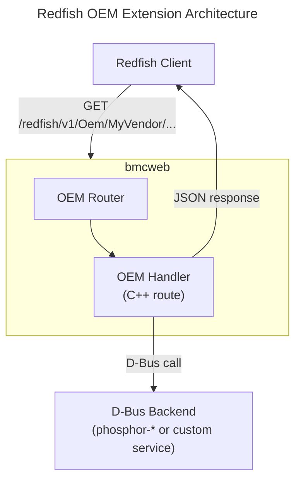

# Redfish OEM Extensions
{: .no_toc }

Design, implement, and validate vendor-specific Redfish OEM extensions in OpenBMC bmcweb.
{: .fs-6 .fw-300 }

## Table of Contents
{: .no_toc .text-delta }

1. TOC
{:toc}

---

## Overview

The Redfish standard provides a well-defined mechanism for vendors to expose platform-specific functionality through **OEM extensions**. In OpenBMC, OEM extensions are implemented in **bmcweb** and follow the `/Oem/<Vendor>` namespace pattern defined by the DMTF Redfish specification.

This guide covers the complete lifecycle: designing the namespace, creating schemas, implementing C++ route handlers with D-Bus backends, and validating with the Redfish Service Validator.



<details markdown="1">
<summary>ASCII-art version (for comparison)</summary>

```
+---------------------------------------------------------------------+
|                 Redfish OEM Extension Architecture                    |
+---------------------------------------------------------------------+
|   +-----------------+                                                 |
|   | Redfish Client  |                                                 |
|   +--------+--------+                                                 |
|            | GET /redfish/v1/Oem/MyVendor/...                         |
|            v                                                          |
|   +--------+------------------------------------------+               |
|   |                     bmcweb                         |               |
|   |   +--------------+       +--------------------+    |               |
|   |   |  OEM Router  | ----> |  OEM Handler       |    |               |
|   |   +--------------+       +---------+----------+    |               |
|   +------------------------------------+---------------+               |
|                                        | D-Bus call                   |
|   +------------------------------------v---------------+               |
|   |              D-Bus Backend                          |               |
|   |     (phosphor-* services or custom daemon)          |               |
|   +----------------------------------------------------+               |
+---------------------------------------------------------------------+
```

</details>

---

## OEM Namespace Design

### The /Oem/<Vendor> Pattern

Redfish uses a structured namespace to prevent collisions between vendor extensions. OEM extensions live either under the `Oem` property of a standard resource or under a dedicated `/redfish/v1/Oem/<Vendor>/` top-level route.

{: .note }
> The DMTF requires that vendors use a unique identifier (typically your company name) as the `<Vendor>` portion. This prevents conflicts between different vendors' extensions on the same BMC.

**Approach 1: Embedded OEM properties** -- Add vendor-specific properties to an existing resource:

```json
{
    "@odata.id": "/redfish/v1/Systems/system",
    "Oem": {
        "MyVendor": {
            "@odata.type": "#OemComputerSystem.v1_0_0.MyVendor",
            "FirmwareProvisioning": { "ProvisioningStatus": "Provisioned" }
        }
    }
}
```

**Approach 2: Standalone OEM resources** -- Create new resource trees:

```
/redfish/v1/Oem/MyVendor/
    BoardInfo                              # Hardware details
    DiagnosticService/                     # Diagnostics
        Actions/
            DiagnosticService.RunTest      # Run a test (POST)
```

### bmcweb OEM Router

bmcweb uses the `BMCWEB_ROUTE` macro to register HTTP routes. The routing flow for an OEM request:

```
GET /redfish/v1/Oem/MyVendor/BoardInfo
  --> Route match: "/redfish/v1/Oem/<str>/BoardInfo"
  --> Privilege check: privileges::getManager
  --> Vendor validation: reject if vendorName != oemVendorName
  --> D-Bus queries (async) --> JSON response
```

{: .warning }
> Always validate the vendor name in your handler. The route pattern `/redfish/v1/Oem/<str>/...` matches any string, so your handler must reject unknown vendor namespaces with a 404 response.

### Namespace Design Guidelines

| Guideline | Reason |
|-----------|--------|
| Use your company name as `<Vendor>` | Avoids collisions with other vendors |
| Version your schema types (e.g., `v1_0_0`) | Enables backward-compatible evolution |
| Group related resources logically | Improves discoverability |
| Follow Redfish naming conventions | `PascalCase` for properties |
| Define actions under standard `Actions` property | Consistent with Redfish patterns |

---

## CSDL and OpenAPI Schema Creation

OEM schemas document your extensions and enable automated validation.

### JSON Schema

{: .note }
> **Source Reference**: The example schema follows the pattern from the [examples/redfish/oem-schema.json](https://github.com/MichaelTien8901/openbmc-guide-tutorial/tree/master/docs/examples/redfish) file in this repository.

```json
{
    "$schema": "http://json-schema.org/draft-07/schema#",
    "$id": "http://myvendor.com/schemas/v1/OemBoardInfo.v1_0_0.json",
    "title": "#OemBoardInfo.v1_0_0.BoardInfo",
    "description": "MyVendor OEM Board Information Resource",
    "type": "object",
    "properties": {
        "@odata.type": { "type": "string", "const": "#OemBoardInfo.v1_0_0.BoardInfo" },
        "@odata.id": { "type": "string", "format": "uri" },
        "Id": { "type": "string" },
        "Name": { "type": "string" },
        "BoardType": { "type": "string", "enum": ["Server", "Workstation", "Storage", "Network"] },
        "BoardRevision": { "type": "string" },
        "MaxPowerWatts": { "type": "integer", "minimum": 0 },
        "Status": { "$ref": "http://redfish.dmtf.org/schemas/v1/Resource.json#/definitions/Status" }
    },
    "required": ["@odata.type", "@odata.id", "Id", "Name"]
}
```

### CSDL Schema

CSDL (Common Schema Definition Language) is the XML format used by the DMTF. The Redfish Service Validator uses CSDL to validate OEM resources.

```xml
<?xml version="1.0" encoding="UTF-8"?>
<edmx:Edmx xmlns:edmx="http://docs.oasis-open.org/odata/ns/edmx" Version="4.0">
  <edmx:Reference Uri="http://redfish.dmtf.org/schemas/v1/Resource_v1.xml">
    <edmx:Include Namespace="Resource"/>
    <edmx:Include Namespace="Resource.v1_0_0"/>
  </edmx:Reference>
  <edmx:DataServices>
    <Schema xmlns="http://docs.oasis-open.org/odata/ns/edm" Namespace="OemBoardInfo">
      <EntityType Name="BoardInfo" BaseType="Resource.v1_0_0.Resource" Abstract="true">
        <Annotation Term="OData.Description" String="MyVendor board information resource."/>
      </EntityType>
    </Schema>
    <Schema xmlns="http://docs.oasis-open.org/odata/ns/edm" Namespace="OemBoardInfo.v1_0_0">
      <EntityType Name="BoardInfo" BaseType="OemBoardInfo.BoardInfo">
        <Property Name="BoardType" Type="OemBoardInfo.v1_0_0.BoardType"/>
        <Property Name="BoardRevision" Type="Edm.String"/>
        <Property Name="MaxPowerWatts" Type="Edm.Int64"/>
      </EntityType>
      <EnumType Name="BoardType">
        <Member Name="Server"/><Member Name="Workstation"/>
        <Member Name="Storage"/><Member Name="Network"/>
      </EnumType>
    </Schema>
  </edmx:DataServices>
</edmx:Edmx>
```

### Hosting Schemas in bmcweb

Place schema files in the bmcweb source tree so clients can discover them:

```
bmcweb/
  static/redfish/v1/schema/
    OemBoardInfo_v1.xml          # CSDL schema
  static/redfish/v1/JsonSchemas/
    OemBoardInfo.v1_0_0.json     # JSON schema
```

{: .tip }
> You can host schemas externally if you prefer not to embed them in the BMC image. Set the `@odata.type` to reference your external schema URL instead.

---

## OEM Route Implementation

### C++ Handler Structure

OEM handlers in bmcweb follow the same async pattern as standard Redfish routes. Each handler receives a request, queries D-Bus for data, and populates a JSON response.

{: .note }
> **Source Reference**: Pattern based on [bmcweb](https://github.com/openbmc/bmcweb)
> - Route patterns: [redfish-core/lib/managers.hpp](https://github.com/openbmc/bmcweb/blob/master/redfish-core/lib/managers.hpp)
> - Privilege definitions: [registries/privilege_registry.hpp](https://github.com/openbmc/bmcweb/blob/master/redfish-core/include/registries/privilege_registry.hpp)

#### Step 1: Create the OEM Header File

Create `redfish-core/lib/oem_myvendor.hpp`:

```cpp
#pragma once
#include "app.hpp"
#include "dbus_utility.hpp"
#include "query.hpp"
#include "registries/privilege_registry.hpp"
#include "utils/dbus_utils.hpp"
#include <nlohmann/json.hpp>
#include <sdbusplus/asio/property.hpp>

namespace redfish
{
constexpr const char* oemVendorName = "MyVendor";

// OEM Root: GET /redfish/v1/Oem/MyVendor/
inline void requestRoutesOemRoot(App& app)
{
    BMCWEB_ROUTE(app, "/redfish/v1/Oem/<str>/")
        .privileges(redfish::privileges::getManager)
        .methods(boost::beast::http::verb::get)(
            [](const crow::Request&,
               const std::shared_ptr<bmcweb::AsyncResp>& asyncResp,
               const std::string& vendorName) {
                if (vendorName != oemVendorName)
                {
                    messages::resourceNotFound(asyncResp->res,
                                               "OemRoot", vendorName);
                    return;
                }
                asyncResp->res.jsonValue["@odata.type"] =
                    "#OemServiceRoot.v1_0_0.OemServiceRoot";
                asyncResp->res.jsonValue["@odata.id"] =
                    "/redfish/v1/Oem/MyVendor";
                asyncResp->res.jsonValue["Id"] = "MyVendor";
                asyncResp->res.jsonValue["Name"] =
                    "MyVendor OEM Extensions";
                asyncResp->res.jsonValue["BoardInfo"]["@odata.id"] =
                    "/redfish/v1/Oem/MyVendor/BoardInfo";
            });
}
} // namespace redfish
```

#### Step 2: Implement a Resource with D-Bus Backend

Read properties from a D-Bus service and map them to JSON:

```cpp
// Board Info: GET /redfish/v1/Oem/MyVendor/BoardInfo
inline void requestRoutesBoardInfo(App& app)
{
    BMCWEB_ROUTE(app, "/redfish/v1/Oem/<str>/BoardInfo")
        .privileges(redfish::privileges::getManager)
        .methods(boost::beast::http::verb::get)(
            [](const crow::Request&,
               const std::shared_ptr<bmcweb::AsyncResp>& asyncResp,
               const std::string& vendorName) {
                if (vendorName != oemVendorName)
                {
                    messages::resourceNotFound(asyncResp->res,
                                               "BoardInfo", vendorName);
                    return;
                }
                asyncResp->res.jsonValue["@odata.type"] =
                    "#OemBoardInfo.v1_0_0.BoardInfo";
                asyncResp->res.jsonValue["@odata.id"] =
                    "/redfish/v1/Oem/MyVendor/BoardInfo";
                asyncResp->res.jsonValue["Id"] = "BoardInfo";
                asyncResp->res.jsonValue["Name"] = "Board Information";

                // Async D-Bus query for manufacturer
                sdbusplus::asio::getProperty<std::string>(
                    *crow::connections::systemBus,
                    "xyz.openbmc_project.Inventory.Manager",
                    "/xyz/openbmc_project/inventory/system/board",
                    "xyz.openbmc_project.Inventory.Decorator.Asset",
                    "Manufacturer",
                    [asyncResp](const boost::system::error_code& ec,
                                const std::string& manufacturer) {
                        if (ec)
                        {
                            asyncResp->res.jsonValue["Manufacturer"] = "Unknown";
                            return;
                        }
                        asyncResp->res.jsonValue["Manufacturer"] = manufacturer;
                    });

                asyncResp->res.jsonValue["BoardType"] = "Server";
                asyncResp->res.jsonValue["Status"]["State"] = "Enabled";
                asyncResp->res.jsonValue["Status"]["Health"] = "OK";
            });
}
```

#### Step 3: Implement a POST Action

Actions allow clients to trigger operations on the BMC:

```cpp
// POST /redfish/v1/Oem/MyVendor/DiagnosticService/Actions/DiagnosticService.RunTest
inline void requestRoutesRunTest(App& app)
{
    BMCWEB_ROUTE(app,
        "/redfish/v1/Oem/<str>/DiagnosticService/Actions/"
        "DiagnosticService.RunTest")
        .privileges(redfish::privileges::postManager)
        .methods(boost::beast::http::verb::post)(
            [](const crow::Request& req,
               const std::shared_ptr<bmcweb::AsyncResp>& asyncResp,
               const std::string& vendorName) {
                if (vendorName != oemVendorName)
                {
                    messages::resourceNotFound(asyncResp->res, "Action", "RunTest");
                    return;
                }
                std::optional<uint32_t> testId;
                if (!json_util::readJsonAction(req, asyncResp->res, "TestId", testId))
                {
                    return;
                }
                if (!testId || *testId < 1 || *testId > 3)
                {
                    messages::actionParameterValueError(asyncResp->res,
                        testId ? std::to_string(*testId) : "null",
                        "TestId", "DiagnosticService.RunTest");
                    return;
                }
                crow::connections::systemBus->async_method_call(
                    [asyncResp](const boost::system::error_code& ec) {
                        if (ec)
                        {
                            messages::internalError(asyncResp->res);
                            return;
                        }
                        asyncResp->res.result(boost::beast::http::status::accepted);
                        asyncResp->res.jsonValue["TaskState"] = "Running";
                    },
                    "xyz.openbmc_project.OEM.DiagService",
                    "/xyz/openbmc_project/oem/diag",
                    "xyz.openbmc_project.OEM.DiagService",
                    "RunTest", *testId);
            });
}
```

### Register Routes in bmcweb

```cpp
// In src/webserver_main.cpp
#include "oem_myvendor.hpp"

// In the route registration section:
redfish::requestRoutesOemRoot(app);
redfish::requestRoutesBoardInfo(app);
redfish::requestRoutesRunTest(app);
```

### D-Bus Backend

Your OEM handler reads from or writes to a D-Bus service. You can use an existing phosphor-* service or create a custom daemon:

```
bmcweb OEM Handler  <-- D-Bus -->  Backend Service (xyz.openbmc_project.OEM.MyService)
  sdbusplus::asio::getProperty()                    |
  async_method_call()                               v
                                            Hardware / sysfs / devmem
```

{: .tip }
> For simple OEM properties that map to existing inventory or sensor D-Bus objects, you do not need a custom D-Bus service. Use `xyz.openbmc_project.Inventory.Manager` or sensor services directly.

### JSON Response Best Practices

| Property | Requirement | Example |
|----------|-------------|---------|
| `@odata.type` | Required. Versioned type. | `#OemBoardInfo.v1_0_0.BoardInfo` |
| `@odata.id` | Required. Full URI. | `/redfish/v1/Oem/MyVendor/BoardInfo` |
| `Id` | Required. Short identifier. | `BoardInfo` |
| `Name` | Required. Human-readable. | `Board Information` |
| `Status` | Recommended. Standard Redfish. | `{"State":"Enabled","Health":"OK"}` |
| `Actions` | If applicable. | `{"#MyAction.Do":{"target":"..."}}` |

---

## Building and Deploying

### Yocto Integration

Create a bbappend to include your OEM handler in the bmcweb build:

```bitbake
# recipes-phosphor/bmcweb/bmcweb_%.bbappend
FILESEXTRAPATHS:prepend := "${THISDIR}/files:"

SRC_URI += " \
    file://oem_myvendor.hpp \
    file://0001-Add-MyVendor-OEM-routes.patch \
"

do_configure:prepend() {
    cp ${WORKDIR}/oem_myvendor.hpp ${S}/redfish-core/lib/oem_myvendor.hpp
}
```

The patch file registers your routes in `webserver_main.cpp`.

### Build and Test

```bash
# Build bmcweb with OEM changes
bitbake bmcweb -c cleansstate && bitbake bmcweb

# Full image build for QEMU
bitbake obmc-phosphor-image

# Or copy binary directly for quick testing
scp build/tmp/work/*/bmcweb/*/build/bmcweb root@<bmc-ip>:/usr/bin/
ssh root@<bmc-ip> systemctl restart bmcweb
```

---

## Redfish Service Validator Testing

The DMTF Redfish Service Validator verifies that your Redfish implementation conforms to the specification.

### Install and Run

```bash
git clone https://github.com/DMTF/Redfish-Service-Validator.git
cd Redfish-Service-Validator
pip3 install -r requirements.txt

# Validate the entire service
python3 RedfishServiceValidator.py \
    --ip https://<bmc-ip> --authtype Basic \
    --username root --password 0penBmc --nochkcert

# Validate a specific OEM resource
python3 RedfishServiceValidator.py \
    --ip https://<bmc-ip> --authtype Basic \
    --username root --password 0penBmc --nochkcert \
    --uri /redfish/v1/Oem/MyVendor/BoardInfo
```

### Validating with Custom OEM Schemas

Provide a local schema directory to validate OEM resources against your custom schemas:

```bash
mkdir -p oem-schemas/
cp OemBoardInfo_v1.xml oem-schemas/

python3 RedfishServiceValidator.py \
    --ip https://<bmc-ip> --authtype Basic \
    --username root --password 0penBmc --nochkcert \
    --schemadir ./oem-schemas/ --logdir ./validation-results/
```

{: .warning }
> The validator reports OEM resources as "unknown type" if you do not provide custom schemas. This is expected. Supply your CSDL schemas via `--schemadir` to get full property validation.

### Interpreting Results

| Check | What It Validates |
|-------|-------------------|
| `@odata.type` present | Every resource must declare its type |
| `@odata.id` matches URI | The `@odata.id` value must match the request URI |
| Required properties | All `required` properties in the schema are present |
| Property types | Values match declared types (string, integer, etc.) |
| Enum values | Enum properties contain only allowed values |
| Links resolve | Navigation properties return valid resources |

### Manual Curl Validation

```bash
alias bmcurl='curl -k -s -u root:0penBmc'

# Test OEM root
bmcurl https://localhost/redfish/v1/Oem/MyVendor/ | jq .

# Test a specific resource
bmcurl https://localhost/redfish/v1/Oem/MyVendor/BoardInfo | jq .

# Test an action
bmcurl -X POST -H "Content-Type: application/json" \
    -d '{"TestId": 1}' \
    https://localhost/redfish/v1/Oem/MyVendor/DiagnosticService/Actions/DiagnosticService.RunTest | jq .
```

### Automated Test Script

```bash
cd docs/examples/redfish/
./test_oem_resource.sh <bmc-ip> root 0penBmc
```

---

## Extending Existing Resources with OEM Properties

You can add OEM properties to existing standard Redfish resources by patching the handler:

```cpp
// In redfish-core/lib/systems.cpp (or via bbappend patch)
// Inside handleSystemsGet, after standard properties:

nlohmann::json& oem = asyncResp->res.jsonValue["Oem"]["MyVendor"];
oem["@odata.type"] = "#OemComputerSystem.v1_0_0.MyVendor";

sdbusplus::asio::getProperty<std::string>(
    *crow::connections::systemBus,
    "xyz.openbmc_project.OEM.MyService",
    "/xyz/openbmc_project/oem/system",
    "xyz.openbmc_project.OEM.SystemInfo", "ProvisioningStatus",
    [asyncResp](const boost::system::error_code& ec,
                const std::string& status) {
        if (!ec)
            asyncResp->res.jsonValue["Oem"]["MyVendor"]
                ["FirmwareProvisioning"]["ProvisioningStatus"] = status;
    });
```

---

## Troubleshooting

### Route Not Found (404)

```bash
systemctl status bmcweb
journalctl -u bmcweb | grep -i "route\|oem"
bmcurl https://localhost/redfish/v1/Oem/MyVendor/    # trailing slash matters
```

### D-Bus Errors

```bash
busctl list | grep -i oem
busctl tree xyz.openbmc_project.OEM.MyService
busctl get-property xyz.openbmc_project.Inventory.Manager \
    /xyz/openbmc_project/inventory/system/board \
    xyz.openbmc_project.Inventory.Decorator.Asset Manufacturer
```

### Debug Logging

```bash
# Edit /lib/systemd/system/bmcweb.service, add:
# Environment="BMCWEB_LOG_LEVEL=DEBUG"
systemctl daemon-reload && systemctl restart bmcweb
journalctl -u bmcweb -f
```

### Common Mistakes

| Issue | Cause | Solution |
|-------|-------|----------|
| 404 on OEM route | Route not registered | Add registration in `webserver_main.cpp` |
| Empty JSON response | Handler returns before async callbacks | Use `asyncResp` shared_ptr pattern |
| 500 Internal Server Error | D-Bus service not running | Verify with `busctl` |
| Missing `@odata.type` | Forgot to set type in handler | Always set `@odata.type` first |
| Validator warns "unknown type" | No custom schema provided | Supply CSDL via `--schemadir` |

---

## Examples

Working examples are available in the [examples/redfish](https://github.com/MichaelTien8901/openbmc-guide-tutorial/tree/master/docs/examples/redfish) directory:

- `oem_resource.hpp` -- Complete OEM handler with root, BoardInfo, DiagnosticService, and RunTest action
- `oem-schema.json` -- JSON Schema for the OEM BoardInfo resource
- `test_oem_resource.sh` -- Automated test script for validating OEM endpoints

{: .tip }
> Use the example files as a starting point. Copy `oem_resource.hpp`, replace `MyVendor` with your vendor name, and modify the resource properties and D-Bus paths to match your hardware platform.

---

## References

- [bmcweb](https://github.com/openbmc/bmcweb) -- OpenBMC Redfish/Web server
- [DMTF Redfish Specification](https://www.dmtf.org/standards/redfish) -- Official specification
- [Redfish Schema Index](https://redfish.dmtf.org/schemas/) -- All standard Redfish schemas
- [Redfish Service Validator](https://github.com/DMTF/Redfish-Service-Validator) -- DMTF validation tool
- [Redfish Resource and Schema Guide](https://www.dmtf.org/sites/default/files/standards/documents/DSP2046_2022.3.pdf) -- OEM extension guidance
- [OpenBMC Redfish Design](https://github.com/openbmc/docs/tree/master/designs) -- Design documents

---

{: .note }
**Tested on**: OpenBMC master, QEMU ast2600-evb
