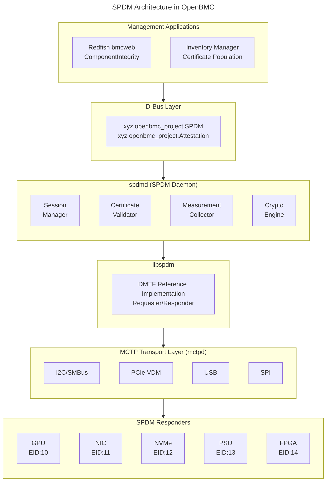

# SPDM Guide
{: .no_toc }

Configure SPDM device attestation and authentication on OpenBMC.
{: .fs-6 .fw-300 }

## Table of Contents
{: .no_toc .text-delta }

1. TOC
{:toc}

---

## Overview

**SPDM (Security Protocol and Data Model)** is a DMTF standard (DSP0274) that provides device identity verification and firmware attestation through certificate-based authentication and cryptographic measurements. It enables the BMC to verify that platform components (GPUs, NICs, storage devices, power supplies) are authentic and running trusted firmware.

### Why SPDM?

Modern data centers face supply chain security threats including:
- Counterfeit components
- Firmware tampering
- Hardware implants
- Unauthorized firmware modifications

SPDM addresses these by providing:
- **Device Identity**: X.509 certificate chains prove device authenticity
- **Firmware Attestation**: Cryptographic measurements verify firmware integrity
- **Secure Communication**: Encrypted sessions protect management traffic
- **Mutual Authentication**: Both BMC and device can verify each other

### SPDM Versions

| Version | DSP0274 | Key Features |
|---------|---------|--------------|
| 1.0 | 2019 | Base attestation, challenge-response |
| 1.1 | 2020 | Mutual authentication, key exchange |
| 1.2 | 2022 | Chunking, multi-key, extended algorithms |
| 1.3 | 2024 | Event notifications, measurement extensions |

---

## Architecture



<details>
<summary>ASCII-art version (for comparison)</summary>

```
+-------------------------------------------------------------------------+
|                       SPDM Architecture in OpenBMC                      |
+-------------------------------------------------------------------------+
|                                                                         |
|   +-------------------------------------------------------------------+ |
|   |                      Management Applications                      | |
|   |                                                                   | |
|   |   +------------------------+    +-----------------------------+   | |
|   |   | Redfish bmcweb         |    | Inventory Manager           |   | |
|   |   | ComponentIntegrity     |    | Certificate Population      |   | |
|   |   +----------+-------------+    +--------------+--------------+   | |
|   +--------------|------------------------------|---------------------+ |
|                  |                              |                       |
|   +--------------+------------------------------+---------------------+ |
|   |                          D-Bus                                    | |
|   |   xyz.openbmc_project.SPDM    xyz.openbmc_project.Attestation     | |
|   +---------------------------------+---------------------------------+ |
|                                     |                                   |
|   +---------------------------------+---------------------------------+ |
|   |                          spdmd                                    | |
|   |                    (SPDM Daemon)                                  | |
|   |                                                                   | |
|   |   +-------------+  +--------------+  +-------------+  +---------+ | |
|   |   | Session     |  | Certificate  |  | Measurement |  | Crypto  | | |
|   |   | Manager     |  | Validator    |  | Collector   |  | Engine  | | |
|   |   +-------------+  +--------------+  +-------------+  +---------+ | |
|   |                                                                   | |
|   |   +-----------------------------------------------------------+   | |
|   |   |                      libspdm                              |   | |
|   |   |   (DMTF Reference Implementation - Requester/Responder)   |   | |
|   |   +-----------------------------------------------------------+   | |
|   +-----------------------------------+-------------------------------+ |
|                                       |                                 |
|   +-----------------------------------+-------------------------------+ |
|   |                     MCTP Transport Layer                          | |
|   |                          (mctpd)                                  | |
|   |                                                                   | |
|   |   +-----------+  +-----------+  +-----------+  +-----------+      | |
|   |   | I2C/SMBus |  | PCIe VDM  |  | USB       |  | SPI       |      | |
|   |   +-----------+  +-----------+  +-----------+  +-----------+      | |
|   +-------------------------------------------------------------------+ |
|                                       |                                 |
|   +-----------------------------------+-------------------------------+ |
|   |                       SPDM Responders                             | |
|   |                                                                   | |
|   |   +--------+  +--------+  +--------+  +--------+  +--------+      | |
|   |   |  GPU   |  |  NIC   |  | NVMe   |  |  PSU   |  | FPGA   |      | |
|   |   | EID:10 |  | EID:11 |  | EID:12 |  | EID:13 |  | EID:14 |      | |
|   |   +--------+  +--------+  +--------+  +--------+  +--------+      | |
|   +-------------------------------------------------------------------+ |
+-------------------------------------------------------------------------+
```

</details>

### Component Roles

| Component | Role |
|-----------|------|
| **Requester** | Initiates SPDM exchanges (BMC is typically the requester) |
| **Responder** | Responds to SPDM requests (devices being attested) |
| **spdmd** | OpenBMC daemon managing SPDM sessions and attestation |
| **libspdm** | DMTF reference implementation library |
| **mctpd** | MCTP transport daemon providing message delivery |

---

## SPDM Protocol Deep Dive

### Message Format

Every SPDM message follows a common header structure:

```
+-------+-------+-------+-------+-------+-------+-------+-------+
|  Byte 0       |  Byte 1       |  Byte 2       |  Byte 3       |
+-------+-------+-------+-------+-------+-------+-------+-------+
| SPDMVersion   | RequestResCode|   Param1      |   Param2      |
+---------------+---------------+---------------+---------------+
|                    Payload (variable length)                  |
+---------------------------------------------------------------+
```

| Field | Size | Description |
|-------|------|-------------|
| `SPDMVersion` | 1 byte | Major.Minor version (e.g., 0x12 = v1.2) |
| `RequestResponseCode` | 1 byte | Message type identifier |
| `Param1` | 1 byte | Message-specific parameter |
| `Param2` | 1 byte | Message-specific parameter |
| `Payload` | Variable | Message-specific data |

### Request/Response Codes

#### Base Commands (0x01-0x0F)

| Code | Request | Response | Description |
|------|---------|----------|-------------|
| 0x04 | GET_VERSION | VERSION (0x04) | Query supported SPDM versions |
| 0x61 | GET_CAPABILITIES | CAPABILITIES (0x61) | Query device capabilities |
| 0x63 | NEGOTIATE_ALGORITHMS | ALGORITHMS (0x63) | Negotiate crypto algorithms |
| 0x01 | GET_DIGESTS | DIGESTS (0x01) | Get certificate chain digests |
| 0x02 | GET_CERTIFICATE | CERTIFICATE (0x02) | Retrieve certificate chain |
| 0x03 | CHALLENGE | CHALLENGE_AUTH (0x03) | Challenge-response auth |

#### Measurement Commands (0x60-0x6F)

| Code | Request | Response | Description |
|------|---------|----------|-------------|
| 0x60 | GET_MEASUREMENTS | MEASUREMENTS (0x60) | Retrieve firmware measurements |

#### Session Commands (0xE0-0xEF)

| Code | Request | Response | Description |
|------|---------|----------|-------------|
| 0xE4 | KEY_EXCHANGE | KEY_EXCHANGE_RSP (0xE4) | Establish session key |
| 0xE5 | FINISH | FINISH_RSP (0xE5) | Complete session establishment |
| 0xE6 | PSK_EXCHANGE | PSK_EXCHANGE_RSP (0xE6) | Pre-shared key exchange |
| 0xE7 | PSK_FINISH | PSK_FINISH_RSP (0xE7) | Complete PSK session |
| 0xEC | END_SESSION | END_SESSION_ACK (0xEC) | Terminate session |
| 0xEE | HEARTBEAT | HEARTBEAT_ACK (0xEE) | Keep session alive |
| 0xEF | KEY_UPDATE | KEY_UPDATE_ACK (0xEF) | Rotate session keys |

#### Error Response (0x7F)

| Error Code | Name | Description |
|------------|------|-------------|
| 0x01 | InvalidRequest | Request format invalid |
| 0x02 | Busy | Device temporarily unavailable |
| 0x03 | UnexpectedRequest | Request out of sequence |
| 0x04 | Unspecified | Generic error |
| 0x05 | DecryptError | Session decryption failed |
| 0x06 | UnsupportedRequest | Request not supported |
| 0x07 | RequestInFlight | Previous request pending |
| 0x41 | InvalidSession | Session ID invalid |
| 0x42 | SessionLimitExceeded | Too many active sessions |

---

## Protocol Flow

### Discovery and Capability Negotiation

```
BMC (Requester)                              Device (Responder)
      |                                              |
      |  1. GET_VERSION                              |
      |--------------------------------------------->|
      |  Version = 0x10 (request v1.0 base)          |
      |                                              |
      |  VERSION                                     |
      |<---------------------------------------------|
      |  VersionNumberEntryCount = 3                 |
      |  Entries: [0x10, 0x11, 0x12]  (v1.0-1.2)     |
      |                                              |
      |  2. GET_CAPABILITIES                         |
      |--------------------------------------------->|
      |  CTExponent = 12 (timeout = 2^12 µs)         |
      |  Flags = CERT_CAP | CHAL_CAP | MEAS_CAP      |
      |                                              |
      |  CAPABILITIES                                |
      |<---------------------------------------------|
      |  CTExponent = 14                             |
      |  Flags = CERT_CAP | CHAL_CAP | MEAS_CAP |    |
      |          KEY_EX_CAP | ENCRYPT_CAP            |
      |                                              |
      |  3. NEGOTIATE_ALGORITHMS                     |
      |--------------------------------------------->|
      |  MeasurementSpec = DMTF                      |
      |  BaseAsymSel = RSASSA_3072, ECDSA_P384       |
      |  BaseHashSel = SHA2_384, SHA2_256            |
      |                                              |
      |  ALGORITHMS                                  |
      |<---------------------------------------------|
      |  MeasurementHashAlgo = SHA2_384              |
      |  BaseAsymAlgo = ECDSA_P384                   |
      |  BaseHashAlgo = SHA2_384                     |
      |                                              |
```

### Capability Flags

| Flag | Bit | Description |
|------|-----|-------------|
| `CACHE_CAP` | 0 | Supports caching of negotiated state |
| `CERT_CAP` | 1 | Has certificate chain(s) |
| `CHAL_CAP` | 2 | Supports challenge authentication |
| `MEAS_CAP` | 3-4 | Measurement capability (0=none, 1=no sig, 2=with sig) |
| `MEAS_FRESH_CAP` | 5 | Generates fresh measurements on request |
| `ENCRYPT_CAP` | 6 | Supports encrypted messages |
| `MAC_CAP` | 7 | Supports message authentication codes |
| `MUT_AUTH_CAP` | 8 | Supports mutual authentication |
| `KEY_EX_CAP` | 9 | Supports key exchange |
| `PSK_CAP` | 10-11 | Pre-shared key capability |
| `ENCAP_CAP` | 12 | Supports encapsulated requests |
| `HBEAT_CAP` | 13 | Supports heartbeat |
| `KEY_UPD_CAP` | 14 | Supports key update |
| `HANDSHAKE_ITC_CAP` | 15 | Handshake in-the-clear support |
| `PUB_KEY_ID_CAP` | 16 | Public key ID instead of certificate |
| `CHUNK_CAP` | 17 | Supports message chunking |
| `ALIAS_CERT_CAP` | 18 | Has alias certificate model |

---

## Certificate Chain Structure

### Chain Format

SPDM uses DER-encoded X.509 certificate chains:

```
+---------------------------------------------------------------+
|                    Certificate Chain                          |
+---------------------------------------------------------------+
|  Length (2 bytes)     |  Reserved (2 bytes)                   |
+-----------------------+---------------------------------------+
|  Root Hash (0 or HashSize bytes)                              |
|  - Only present if RootHash is non-zero                       |
+---------------------------------------------------------------+
|  Certificate[0] - Root CA or Intermediate (DER)               |
|  +-----------------------------------------------------------+|
|  |  TBSCertificate                                           ||
|  |    - Version, Serial, Signature Algorithm                 ||
|  |    - Issuer, Validity, Subject                            ||
|  |    - SubjectPublicKeyInfo                                 ||
|  |    - Extensions (Key Usage, Basic Constraints, etc.)      ||
|  +-----------------------------------------------------------+|
|  |  SignatureAlgorithm                                       ||
|  +-----------------------------------------------------------+|
|  |  SignatureValue                                           ||
|  +-----------------------------------------------------------+|
+---------------------------------------------------------------+
|  Certificate[1] - Intermediate CA (DER) - if present          |
+---------------------------------------------------------------+
|  Certificate[N] - Device/Leaf Certificate (DER)               |
|  +-----------------------------------------------------------+|
|  |  Subject: CN=DeviceSerial, O=Vendor                       ||
|  |  Key Usage: Digital Signature                             ||
|  |  Extended Key Usage: id-kp-cmcRA (SPDM signing)           ||
|  +-----------------------------------------------------------+|
+---------------------------------------------------------------+
```

### Certificate Slot Model

SPDM supports up to 8 certificate slots (0-7):

| Slot | Typical Use |
|------|-------------|
| 0 | Device identity certificate (required) |
| 1-7 | Alternative certificates (optional) |

```bash
# Get certificate digests for all slots
spdmtool getcert -m 10 --digests

# Get certificate from specific slot
spdmtool getcert -m 10 -s 0  # Slot 0
spdmtool getcert -m 10 -s 1  # Slot 1
```

### Certificate Requirements

For SPDM device certificates:

| Requirement | Description |
|-------------|-------------|
| Key Usage | digitalSignature must be set |
| Key Size | RSA ≥ 2048, ECDSA P-256/P-384/P-521 |
| Hash Algorithm | SHA-256 or stronger |
| Chain Depth | Typically 2-4 certificates |
| OID Extensions | May include SPDM-specific OIDs |

---

## Measurements

### Measurement Concept

Measurements are cryptographic digests of device firmware, configuration, and state. They allow the requester to verify device integrity.

### Measurement Block Format

```
+---------------------------------------------------------------+
|                     Measurement Block                         |
+---------------------------------------------------------------+
| Index (1 byte) | MeasurementSpec (1 byte) | Size (2 bytes)    |
+----------------+------------------------+--------------------+
|                    Measurement Data                           |
+---------------------------------------------------------------+

Measurement Data (DMTF format):
+---------------------------------------------------------------+
| DMTFSpecMeasurementValueType (1 byte) | Size (2 bytes)        |
+---------------------------------------+-----------------------+
|                    Measurement Value                          |
+---------------------------------------------------------------+
```

### Measurement Types (DMTF)

| Type | Value | Description |
|------|-------|-------------|
| `ImmutableROM` | 0x00 | Boot ROM, immutable code |
| `MutableFirmware` | 0x01 | Updateable firmware |
| `HardwareConfig` | 0x02 | Hardware configuration |
| `FirmwareConfig` | 0x03 | Firmware configuration |
| `MeasurementManifest` | 0x04 | Measurement manifest |
| `DebugMode` | 0x05 | Debug/manufacturing mode indication |
| `MutableFirmwareVersion` | 0x06 | Firmware version string |
| `MutableFirmwareSecurityVersion` | 0x07 | Security version number |
| `HashExtendMeasurement` | 0x08-0x7F | Extended hash measurements |
| `InformationalMeasurement` | 0x80-0xEF | Informational data |
| `Vendor` | 0xF0-0xFF | Vendor-defined |

### Measurement Operations

```bash
# Get all measurements (unsigned)
spdmtool measurements -m 10

# Get measurements with signature
spdmtool measurements -m 10 --signed

# Get specific measurement index
spdmtool measurements -m 10 -i 1

# Get raw measurement data
spdmtool measurements -m 10 -i 1 --raw -o measurement_1.bin

# Example output:
# Index 1: Type=MutableFirmware, Size=48, Hash=SHA384:abc123...
# Index 2: Type=FirmwareConfig, Size=48, Hash=SHA384:def456...
# Index 3: Type=HardwareConfig, Size=48, Hash=SHA384:789abc...
```

### Measurement Response Attributes

| Attribute | Description |
|-----------|-------------|
| `NUMBER_OF_BLOCKS` | Number of measurement blocks |
| `MEASUREMENT_RECORD_LENGTH` | Total length of measurement data |
| `NONCE` | 32-byte random value (when signed) |
| `OPAQUE_DATA` | Optional vendor-specific data |
| `SIGNATURE` | Response signature (when signed) |

---

## Challenge-Response Authentication

### Challenge Flow

```
BMC (Requester)                              Device (Responder)
      |                                              |
      |  CHALLENGE                                   |
      |--------------------------------------------->|
      |  Param1 = SlotID (0-7)                       |
      |  Param2 = MeasurementSummaryHashType         |
      |  Nonce = 32 random bytes                     |
      |                                              |
      |  CHALLENGE_AUTH                              |
      |<---------------------------------------------|
      |  CertChainHash = SHA384(CertificateChain)    |
      |  Nonce = 32 random bytes (responder)         |
      |  MeasurementSummaryHash = SHA384(all meas)   |
      |  OpaqueDataLength + OpaqueData               |
      |  Signature = Sign(Transcript)                |
      |                                              |
```

### Transcript Hash

The signature covers a transcript of the entire exchange:

```
TranscriptHash = Hash(
    GET_VERSION || VERSION ||
    GET_CAPABILITIES || CAPABILITIES ||
    NEGOTIATE_ALGORITHMS || ALGORITHMS ||
    GET_DIGESTS || DIGESTS ||
    GET_CERTIFICATE[0..N] || CERTIFICATE[0..N] ||
    CHALLENGE || CHALLENGE_AUTH (without signature)
)

Signature = Sign(PrivateKey, TranscriptHash)
```

---

## Secure Session Establishment

### Key Exchange Flow

```
BMC (Requester)                              Device (Responder)
      |                                              |
      | [After authentication via CHALLENGE]         |
      |                                              |
      |  KEY_EXCHANGE                                |
      |--------------------------------------------->|
      |  Param1 = MeasurementSummaryHashType         |
      |  Param2 = SlotID                             |
      |  ReqSessionID = random 16-bit                |
      |  DHE_Pub_Key = Requester's ECDH public key   |
      |  RequesterVerifyData (optional)              |
      |                                              |
      |  KEY_EXCHANGE_RSP                            |
      |<---------------------------------------------|
      |  RspSessionID = random 16-bit                |
      |  MutAuthRequested = flags                    |
      |  DHE_Pub_Key = Responder's ECDH public key   |
      |  MeasurementSummaryHash                      |
      |  OpaqueData                                  |
      |  Signature = Sign(Transcript)                |
      |  ResponderVerifyData = HMAC(HandshakeSecret) |
      |                                              |
      |  [Derive session keys from shared secret]    |
      |                                              |
      |  FINISH                                      |
      |--------------------------------------------->|
      |  Signature = Sign(Transcript) [if mut auth]  |
      |  RequesterVerifyData = HMAC(HandshakeSecret) |
      |                                              |
      |  FINISH_RSP                                  |
      |<---------------------------------------------|
      |  ResponderVerifyData = HMAC(HandshakeSecret) |
      |                                              |
      | [Session established - encrypted messages]   |
```

### Session Key Derivation

Keys are derived using HKDF:

```
SharedSecret = ECDH(RequesterPrivKey, ResponderPubKey)

HandshakeSecret = HKDF-Extract(Salt=0, IKM=SharedSecret)

RequesterHandshakeKey = HKDF-Expand(HandshakeSecret, "req hs key", KeyLen)
ResponderHandshakeKey = HKDF-Expand(HandshakeSecret, "rsp hs key", KeyLen)

MasterSecret = HKDF-Extract(HandshakeSecret, 0)

RequesterDataKey = HKDF-Expand(MasterSecret, "req data key", KeyLen)
ResponderDataKey = HKDF-Expand(MasterSecret, "rsp data key", KeyLen)
```

### Encrypted Message Format

Within a secure session, messages use AEAD encryption:

```
+---------------------------------------------------------------+
|                    Secured Message                            |
+---------------------------------------------------------------+
| SessionID (4 bytes) | SeqNum (2-8 bytes)                      |
+-----------------------+---------------------------------------+
|                                                               |
|  AEAD Encrypted Payload:                                      |
|  +----------------------------------------------------------+ |
|  |  Application Data Length (2 bytes)                       | |
|  +----------------------------------------------------------+ |
|  |  Application Data (SPDM message)                         | |
|  +----------------------------------------------------------+ |
|  |  Random Padding (variable)                               | |
|  +----------------------------------------------------------+ |
|                                                               |
+---------------------------------------------------------------+
| MAC/Tag (16 bytes for AES-GCM, ChaCha20-Poly1305)             |
+---------------------------------------------------------------+
```

---

## Cryptographic Algorithms

### Supported Algorithms

#### Asymmetric Signature

| Algorithm | OID | Key Size |
|-----------|-----|----------|
| `RSASSA_2048` | 1.2.840.113549.1.1.11 | 2048 bits |
| `RSASSA_3072` | 1.2.840.113549.1.1.11 | 3072 bits |
| `RSASSA_4096` | 1.2.840.113549.1.1.11 | 4096 bits |
| `RSAPSS_2048` | 1.2.840.113549.1.1.10 | 2048 bits |
| `RSAPSS_3072` | 1.2.840.113549.1.1.10 | 3072 bits |
| `RSAPSS_4096` | 1.2.840.113549.1.1.10 | 4096 bits |
| `ECDSA_P256` | 1.2.840.10045.4.3.2 | 256 bits |
| `ECDSA_P384` | 1.2.840.10045.4.3.3 | 384 bits |
| `ECDSA_P521` | 1.2.840.10045.4.3.4 | 521 bits |
| `EDDSA_25519` | 1.3.101.112 | 255 bits |
| `EDDSA_448` | 1.3.101.113 | 448 bits |

#### Hash Algorithms

| Algorithm | Digest Size |
|-----------|-------------|
| `SHA2_256` | 32 bytes |
| `SHA2_384` | 48 bytes |
| `SHA2_512` | 64 bytes |
| `SHA3_256` | 32 bytes |
| `SHA3_384` | 48 bytes |
| `SHA3_512` | 64 bytes |

#### DHE (Diffie-Hellman Ephemeral)

| Named Group | Key Size |
|-------------|----------|
| `FFDHE_2048` | 2048 bits |
| `FFDHE_3072` | 3072 bits |
| `FFDHE_4096` | 4096 bits |
| `SECP_256_R1` | 256 bits |
| `SECP_384_R1` | 384 bits |
| `SECP_521_R1` | 521 bits |
| `X25519` | 255 bits |
| `X448` | 448 bits |

#### AEAD (Session Encryption)

| Algorithm | Key Size | Tag Size |
|-----------|----------|----------|
| `AES_128_GCM` | 128 bits | 128 bits |
| `AES_256_GCM` | 256 bits | 128 bits |
| `CHACHA20_POLY1305` | 256 bits | 128 bits |

---

## Setup & Configuration

### Build-Time Configuration (Yocto)

```bitbake
# In your machine .conf or local.conf

# Include SPDM support
IMAGE_INSTALL:append = " \
    libspdm \
    spdm-emu \
    phosphor-spdm \
"

# Enable SPDM in relevant components
EXTRA_OEMESON:pn-bmcweb = " \
    -Dredfish-component-integrity=enabled \
"

# libspdm build configuration
EXTRA_OECMAKE:pn-libspdm = " \
    -DLIBSPDM_ENABLE_CAPABILITY_CERT_CAP=ON \
    -DLIBSPDM_ENABLE_CAPABILITY_CHAL_CAP=ON \
    -DLIBSPDM_ENABLE_CAPABILITY_MEAS_CAP=ON \
    -DLIBSPDM_ENABLE_CAPABILITY_KEY_EX_CAP=ON \
    -DLIBSPDM_ENABLE_CAPABILITY_PSK_EX_CAP=OFF \
    -DLIBSPDM_ENABLE_CAPABILITY_HBEAT_CAP=ON \
    -DLIBSPDM_ENABLE_CAPABILITY_MUT_AUTH_CAP=ON \
    -DLIBSPDM_ENABLE_CAPABILITY_CHUNK_CAP=ON \
"
```

### libspdm Build Options

| Option | Default | Description |
|--------|---------|-------------|
| `LIBSPDM_ENABLE_CAPABILITY_CERT_CAP` | ON | Certificate capability |
| `LIBSPDM_ENABLE_CAPABILITY_CHAL_CAP` | ON | Challenge capability |
| `LIBSPDM_ENABLE_CAPABILITY_MEAS_CAP` | ON | Measurement capability |
| `LIBSPDM_ENABLE_CAPABILITY_KEY_EX_CAP` | ON | Key exchange (sessions) |
| `LIBSPDM_ENABLE_CAPABILITY_PSK_EX_CAP` | OFF | Pre-shared key exchange |
| `LIBSPDM_ENABLE_CAPABILITY_HBEAT_CAP` | ON | Session heartbeat |
| `LIBSPDM_ENABLE_CAPABILITY_MUT_AUTH_CAP` | ON | Mutual authentication |
| `LIBSPDM_ENABLE_CAPABILITY_CHUNK_CAP` | ON | Large message chunking |
| `LIBSPDM_ENABLE_CAPABILITY_ENCAP_CAP` | OFF | Encapsulated requests |
| `LIBSPDM_RECORD_TRANSCRIPT_DATA_SUPPORT` | ON | Transcript for debugging |

### Runtime Configuration

```bash
# Check SPDM daemon status
systemctl status spdmd

# View SPDM logs
journalctl -u spdmd -f

# Configuration file location
cat /etc/spdm/spdm.conf
```

### Algorithm Configuration

```json
// /etc/spdm/algorithms.json
{
    "version": "1.2",
    "baseAsymAlgo": [
        "ECDSA_P384",
        "ECDSA_P256",
        "RSASSA_3072"
    ],
    "baseHashAlgo": [
        "SHA2_384",
        "SHA2_256"
    ],
    "measurementHashAlgo": [
        "SHA2_384",
        "SHA2_256"
    ],
    "dheNamedGroup": [
        "SECP_384_R1",
        "SECP_256_R1"
    ],
    "aead": [
        "AES_256_GCM",
        "CHACHA20_POLY1305"
    ],
    "keySchedule": "SPDM"
}
```

---

## Certificate Management

### Certificate Chain

SPDM uses X.509 certificate chains for device authentication:

```
Root CA (Self-signed, Trusted by BMC)
   │
   └── Intermediate CA (Optional)
          │
          └── Device Certificate (Leaf)
                - Contains device public key
                - Signed by Intermediate/Root CA
                - Used for challenge signature
```

### Provisioning Trust Anchors

```bash
# Root CA certificates location
/etc/spdm/certs/trust/

# Add trusted root CA
cp vendor_root_ca.pem /etc/spdm/certs/trust/

# Convert DER to PEM if needed
openssl x509 -inform DER -in vendor_root_ca.der -out vendor_root_ca.pem

# Verify certificate
openssl x509 -in vendor_root_ca.pem -text -noout

# Restart SPDM daemon to load new trust anchors
systemctl restart spdmd
```

### BMC Certificate (for Mutual Auth)

```bash
# BMC certificate location
/etc/spdm/certs/bmc/

# Generate BMC keypair (ECDSA P-384 recommended)
openssl ecparam -name secp384r1 -genkey -noout -out /etc/spdm/certs/bmc/key.pem

# Generate CSR
openssl req -new -key /etc/spdm/certs/bmc/key.pem \
    -out /etc/spdm/certs/bmc/csr.pem \
    -subj "/CN=BMC-$(hostname)/O=MyOrg/OU=OpenBMC"

# Install signed certificate (after CA signs the CSR)
cp signed_bmc_cert.pem /etc/spdm/certs/bmc/cert.pem

# Set proper permissions
chmod 600 /etc/spdm/certs/bmc/key.pem
chmod 644 /etc/spdm/certs/bmc/cert.pem
```

### Certificate Verification

```bash
# Verify certificate chain
openssl verify -CAfile root_ca.pem \
    -untrusted intermediate.pem device_cert.pem

# Check certificate validity period
openssl x509 -in device_cert.pem -noout -dates

# Check certificate key usage
openssl x509 -in device_cert.pem -noout -text | grep -A1 "Key Usage"

# Check certificate subject
openssl x509 -in device_cert.pem -noout -subject
```

---

## SPDM Operations

### Device Discovery

```bash
# List SPDM-capable endpoints
spdmtool discover

# Get SPDM version from device
spdmtool version -m 10

# Example output:
# SPDM Version: 1.2.0
# Supported Versions: 1.0.0, 1.1.0, 1.2.0

# Get device capabilities
spdmtool capabilities -m 10

# Example output:
# Capabilities:
#   CERT_CAP: Yes
#   CHAL_CAP: Yes
#   MEAS_CAP: Signature
#   KEY_EX_CAP: Yes
#   MUT_AUTH_CAP: Yes
#   ENCRYPT_CAP: Yes
```

### Get Device Certificate

```bash
# Get certificate chain digest
spdmtool getdigest -m 10

# Get certificate chain
spdmtool getcert -m 10 -s 0

# Save certificate chain to file
spdmtool getcert -m 10 -s 0 -o device_chain.pem

# Extract individual certificates
openssl storeutl -certs device_chain.pem
```

### Challenge Authentication

```bash
# Send challenge to verify device
spdmtool challenge -m 10 -s 0

# Challenge with measurement summary
spdmtool challenge -m 10 -s 0 --meas-summary all

# Example output:
# Challenge Response:
#   Certificate Hash: SHA384:abc123...
#   Nonce: 0x1234...
#   Measurement Summary Hash: SHA384:def456...
#   Signature: ECDSA_P384:789...
#   Verification: SUCCESS
```

### Get Measurements

```bash
# Get all measurements
spdmtool measurements -m 10

# Get signed measurements
spdmtool measurements -m 10 --signed

# Get specific measurement index
spdmtool measurements -m 10 -i 1

# Save measurements to JSON
spdmtool measurements -m 10 -o measurements.json

# Example output:
# Measurement Record:
#   Index 1: Type=MutableFirmware
#            Hash=SHA384:abc123def456...
#   Index 2: Type=FirmwareConfig
#            Hash=SHA384:789abc012def...
#   Index 3: Type=MutableFirmwareVersion
#            Value="v2.1.0-rc3"
```

---

## Redfish ComponentIntegrity

### Enable in bmcweb

```bitbake
EXTRA_OEMESON:pn-bmcweb = " \
    -Dredfish-component-integrity=enabled \
"
```

### Query Component Integrity

```bash
# Get ComponentIntegrity collection
curl -k -u root:0penBmc \
    https://localhost/redfish/v1/ComponentIntegrity

# Get specific component
curl -k -u root:0penBmc \
    https://localhost/redfish/v1/ComponentIntegrity/GPU_0
```

### ComponentIntegrity Response

```json
{
    "@odata.id": "/redfish/v1/ComponentIntegrity/GPU_0",
    "@odata.type": "#ComponentIntegrity.v1_2_0.ComponentIntegrity",
    "Id": "GPU_0",
    "Name": "GPU 0 Integrity",
    "ComponentIntegrityType": "SPDM",
    "ComponentIntegrityTypeVersion": "1.2.0",
    "TargetComponentURI": "/redfish/v1/Systems/system/Processors/GPU_0",
    "LastUpdated": "2024-01-15T10:30:00Z",
    "SPDM": {
        "Requester": {
            "IdentityAuthentication": "Success",
            "HardwareIntrusion": "Normal"
        },
        "IdentityAuthentication": {
            "ResponderAuthentication": "Success",
            "VerificationStatus": "Success",
            "ComponentCertificate": {
                "@odata.id": "/redfish/v1/ComponentIntegrity/GPU_0/Certificates/0"
            }
        },
        "MeasurementSet": {
            "MeasurementSpecification": "DMTF",
            "MeasurementHashAlgorithm": "SHA384",
            "Measurements": [
                {
                    "MeasurementIndex": 1,
                    "Measurement": "abc123def456...",
                    "MeasurementType": "MutableFirmware",
                    "LastUpdated": "2024-01-15T10:30:00Z",
                    "SecurityVersionNumber": "1",
                    "VerificationStatus": "Success"
                },
                {
                    "MeasurementIndex": 2,
                    "Measurement": "789abc012def...",
                    "MeasurementType": "FirmwareConfiguration",
                    "LastUpdated": "2024-01-15T10:30:00Z",
                    "VerificationStatus": "Success"
                }
            ]
        }
    },
    "Actions": {
        "#ComponentIntegrity.SPDMGetSignedMeasurements": {
            "target": "/redfish/v1/ComponentIntegrity/GPU_0/Actions/ComponentIntegrity.SPDMGetSignedMeasurements"
        }
    }
}
```

### Trigger New Attestation

```bash
# Force re-attestation via action
curl -k -u root:0penBmc -X POST \
    -H "Content-Type: application/json" \
    -d '{"Nonce": "abc123", "MeasurementIndices": [1, 2, 3]}' \
    https://localhost/redfish/v1/ComponentIntegrity/GPU_0/Actions/ComponentIntegrity.SPDMGetSignedMeasurements

# Get certificate from component
curl -k -u root:0penBmc \
    https://localhost/redfish/v1/ComponentIntegrity/GPU_0/Certificates/0
```

---

## Secure Session Operations

### Key Exchange

```bash
# Establish secure session
spdmtool keyexchange -m 10

# Session provides:
# - Encrypted communication
# - Authenticated channel
# - Replay protection

# Session with mutual authentication
spdmtool keyexchange -m 10 --mutual-auth

# Example output:
# Session Established:
#   Session ID: 0xABCD1234
#   Algorithm: AES_256_GCM
#   DHE: SECP_384_R1
```

### Session Management

```bash
# Send message over secure session
spdmtool secured-message -m 10 -s 0xABCD1234 --data "..."

# Heartbeat to keep session alive
spdmtool heartbeat -m 10 -s 0xABCD1234

# Update session keys
spdmtool keyupdate -m 10 -s 0xABCD1234

# End session
spdmtool endsession -m 10 -s 0xABCD1234
```

### Session Types

| Type | Description | Use Case |
|------|-------------|----------|
| `KEY_EXCHANGE` | Asymmetric key exchange | Standard sessions |
| `PSK_EXCHANGE` | Pre-shared key | Devices without certificates |
| `PSK_FINISH` | PSK with challenge | Enhanced PSK security |

---

## Measurement Policy

### Expected Measurements Configuration

```json
// /etc/spdm/policy/gpu_expected.json
{
    "deviceType": "GPU",
    "vendorId": "0x10DE",
    "measurements": {
        "1": {
            "type": "MutableFirmware",
            "expectedHash": "sha384:abc123def456789...",
            "description": "GPU firmware v2.1.0"
        },
        "2": {
            "type": "FirmwareConfig",
            "expectedHash": "sha384:789abc012def345...",
            "description": "Factory configuration"
        },
        "3": {
            "type": "MutableFirmwareVersion",
            "expectedValue": "v2.1.0",
            "description": "Firmware version string"
        }
    },
    "policy": {
        "requireAllMeasurements": true,
        "actionOnMismatch": "log_and_alert",
        "allowFirmwareUpdate": true
    }
}
```

### Policy Actions

| Action | Description |
|--------|-------------|
| `log` | Log mismatch, continue operation |
| `alert` | Generate Redfish alert event |
| `log_and_alert` | Both log and alert |
| `reject` | Block device from operation |
| `quarantine` | Isolate device, require manual action |

---

## D-Bus Integration

### SPDM D-Bus Interface

```bash
# List SPDM service
busctl tree xyz.openbmc_project.SPDM

# Object structure:
# /xyz/openbmc_project/spdm
#   /endpoint/<eid>
#     - xyz.openbmc_project.SPDM.Endpoint
#     - xyz.openbmc_project.SPDM.Certificate
#     - xyz.openbmc_project.SPDM.Measurement

# Get endpoint properties
busctl introspect xyz.openbmc_project.SPDM \
    /xyz/openbmc_project/spdm/endpoint/10

# Get measurements via D-Bus
busctl call xyz.openbmc_project.SPDM \
    /xyz/openbmc_project/spdm/endpoint/10 \
    xyz.openbmc_project.SPDM.Measurement \
    GetMeasurements u 0xFF
```

### Attestation Events

```bash
# Monitor SPDM events
busctl monitor xyz.openbmc_project.SPDM

# Events include:
# - EndpointDiscovered
# - AuthenticationSuccess/Failure
# - MeasurementMismatch
# - SessionEstablished/Terminated
```

---

## Troubleshooting

### Discovery Failures

```bash
# Verify MCTP connectivity first
mctp endpoint

# Check SPDM version compatibility
spdmtool version -m 10

# Enable debug logging
echo "SPDM_DEBUG=1" >> /etc/default/spdmd
systemctl restart spdmd

# View detailed logs
journalctl -u spdmd -f --no-pager
```

### Certificate Verification Failed

```bash
# Check trust anchor is installed
ls -la /etc/spdm/certs/trust/

# Get device certificate chain
spdmtool getcert -m 10 -s 0 -o /tmp/device_chain.pem

# Verify certificate chain manually
openssl verify -CAfile /etc/spdm/certs/trust/root.pem \
    /tmp/device_chain.pem

# Check certificate validity
openssl x509 -in /tmp/device_chain.pem -checkend 0

# Check certificate details
openssl x509 -in /tmp/device_chain.pem -text -noout | head -30
```

### Measurement Mismatch

```bash
# Get actual measurements
spdmtool measurements -m 10 -o /tmp/actual_meas.json

# Compare with expected
diff /tmp/actual_meas.json /etc/spdm/policy/expected.json

# Check if firmware was updated
# Measurements change with firmware updates

# Verify measurement type
spdmtool measurements -m 10 -i 1 --verbose
```

### Session Failures

```bash
# Check algorithm compatibility
spdmtool capabilities -m 10

# Verify key exchange support
spdmtool algorithms -m 10

# Check session logs
journalctl -u spdmd | grep -i session

# Verify DHE is supported
spdmtool capabilities -m 10 | grep KEY_EX
```

### Common Error Codes

| Error | Cause | Solution |
|-------|-------|----------|
| `InvalidRequest` | Malformed message | Check message format |
| `Busy` | Device processing | Retry with backoff |
| `UnexpectedRequest` | Wrong state machine | Reset and restart |
| `DecryptError` | Session key mismatch | Re-establish session |
| `UnsupportedRequest` | Feature not supported | Check capabilities |
| `InvalidSession` | Session expired/invalid | Create new session |

---

## Security Best Practices

### Certificate Management

1. **Use strong keys**: RSA ≥ 3072 or ECDSA P-384
2. **Rotate certificates**: Before expiration, plan rotation
3. **Secure storage**: Protect private keys with HSM or secure enclave
4. **Monitor expiration**: Alert before certificate expires
5. **Revocation checking**: Implement CRL or OCSP if available

### Measurement Verification

1. **Store expected values securely**: Protect measurement database
2. **Update with firmware**: Expected values must match deployed firmware
3. **Alert on changes**: Any measurement change should trigger investigation
4. **Log all events**: Maintain audit trail of attestation attempts
5. **Regular re-attestation**: Periodically verify device integrity

### Access Control

```bash
# Limit SPDM administration access
chmod 600 /etc/spdm/spdm.conf
chmod 600 /etc/spdm/policy/*.json

# Use D-Bus policy for access control
# /etc/dbus-1/system.d/spdm.conf
```

### Production Recommendations

| Recommendation | Description |
|----------------|-------------|
| Enable mutual auth | Both BMC and device authenticate |
| Use secure sessions | Encrypt SPDM traffic |
| Require signed measurements | Don't accept unsigned |
| Implement alerting | Notify on failures |
| Regular audits | Review attestation logs |
| Update policies | Keep expected measurements current |

---

## Enabling/Disabling SPDM

### Build-Time Disable

```bitbake
# Remove SPDM packages
IMAGE_INSTALL:remove = "libspdm phosphor-spdm"

# Disable in bmcweb
EXTRA_OEMESON:pn-bmcweb = " \
    -Dredfish-component-integrity=disabled \
"
```

### Runtime Disable

```bash
# Stop SPDM daemon
systemctl stop spdmd
systemctl disable spdmd

# SPDM attestation will not be available
# Existing sessions will close
```

---

## References

- [DMTF DSP0274 - SPDM Specification](https://www.dmtf.org/dsp/DSP0274) - Official SPDM protocol specification
- [DMTF DSP0277 - Secured Messages](https://www.dmtf.org/dsp/DSP0277) - SPDM secured message specification
- [libspdm (GitHub)](https://github.com/DMTF/libspdm) - DMTF reference implementation
- [spdm-emu (GitHub)](https://github.com/DMTF/spdm-emu) - SPDM emulator for testing
- [Redfish ComponentIntegrity Schema](https://redfish.dmtf.org/schemas/ComponentIntegrity.v1_2_0.json) - Redfish SPDM interface
- [OpenBMC Redfish SPDM Attestation Design](https://github.com/openbmc/docs/blob/master/designs/redfish-spdm-attestation.md) - OpenBMC integration design
- [OpenBMC SPDM Daemon](https://github.com/openbmc/spdm) - OpenBMC SPDM implementation
- [TCG DICE Attestation Architecture](https://trustedcomputinggroup.org/resource/dice-attestation-architecture/) - Related attestation architecture

---

{: .note }
**Tested on**: OpenBMC master, requires hardware with SPDM-capable devices (GPU, NIC, NVMe, etc.)
