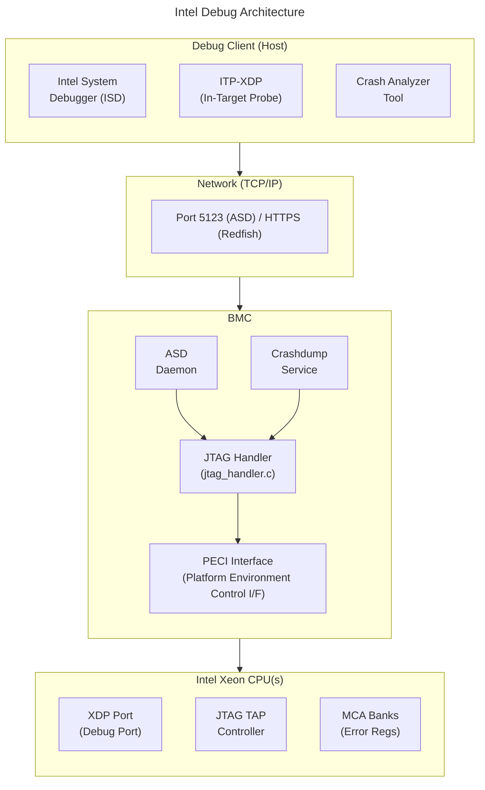
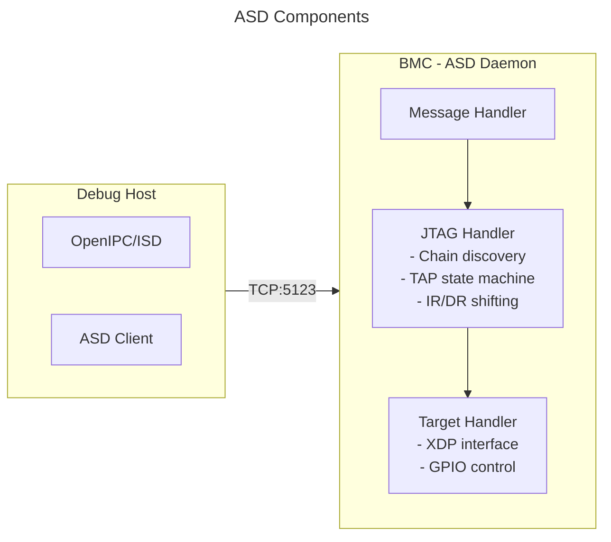
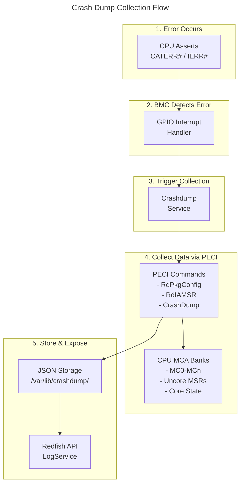

# Intel ASD/ACD Guide
{: .no_toc }

Configure Intel At-Scale Debug and Autonomous Crash Dump on OpenBMC.
{: .fs-6 .fw-300 }

## Table of Contents
{: .no_toc .text-delta }

1. TOC
{:toc}

---

## Overview

**ASD (At-Scale Debug)** and **ACD (Autonomous Crash Dump)** are Intel technologies for remote CPU debugging and crash analysis on Intel Xeon server platforms.



<details markdown="1">
<summary>ASCII-art version (for comparison)</summary>

```
+------------------------------------------------------------------------+
|                    Intel Debug Architecture                            |
+------------------------------------------------------------------------+
|                                                                        |
|  +-------------------------------------------------------------------+ |
|  |                      Debug Client (Host)                          | |
|  |                                                                   | |
|  |   +------------------+  +------------------+  +----------------+  | |
|  |   | Intel System     |  | ITP-XDP          |  | Crash Analyzer |  | |
|  |   | Debugger (ISD)   |  | (In-Target Probe)|  | Tool           |  | |
|  |   +--------+---------+  +--------+---------+  +-------+--------+  | |
|  +------------|---------------------|--------------------|-----------+ |
|               |                     |                    |             |
|               v                     v                    v             |
|  +-------------------------------------------------------------------+ |
|  |                         Network (TCP/IP)                          | |
|  |                    Port 5123 (ASD) / HTTPS (Redfish)              | |
|  +----------------------------+--------------------------------------+ |
|                               |                                        |
|  +----------------------------v--------------------------------------+ |
|  |                            BMC                                    | |
|  |                                                                   | |
|  |   +------------------+     +------------------+                   | |
|  |   |       ASD        |     |    Crashdump     |                   | |
|  |   |     Daemon       |     |     Service      |                   | |
|  |   +--------+---------+     +--------+---------+                   | |
|  |            |                        |                             | |
|  |   +--------v------------------------v---------+                   | |
|  |   |              JTAG Handler                 |                   | |
|  |   |         (jtag_handler.c)                  |                   | |
|  |   +--------+----------------------------------+                   | |
|  |            |                                                      | |
|  |   +--------v----------------------------------+                   | |
|  |   |           PECI Interface                  |                   | |
|  |   |    (Platform Environment Control I/F)     |                   | |
|  |   +--------+----------------------------------+                   | |
|  +------------|----------------------------------------------------- + |
|               |                                                        |
|  +------------v------------------------------------------------------+ |
|  |                     Intel Xeon CPU(s)                             | |
|  |                                                                   | |
|  |   +------------------+  +------------------+  +----------------+  | |
|  |   |   XDP Port       |  |  JTAG TAP        |  |  MCA Banks     |  | |
|  |   | (Debug Port)     |  |  Controller      |  |  (Error Regs)  |  | |
|  |   +------------------+  +------------------+  +----------------+  | |
|  +-------------------------------------------------------------------+ |
+------------------------------------------------------------------------+
```

</details>

---

## ASD (At-Scale Debug)

### What is ASD?

At-Scale Debug provides remote JTAG-like access to Intel CPUs through the BMC, enabling:

- **Remote debugging** without physical access to the server
- **JTAG chain access** to CPU cores, uncore, and PCH
- **Run control** (halt, step, breakpoints)
- **Register access** (MSRs, GPRs, control registers)
- **Memory access** through the CPU debug interface

### ASD Architecture



<details markdown="1">
<summary>ASCII-art version (for comparison)</summary>

```
+-------------------------------------------------------------------+
|                        ASD Components                             |
+-------------------------------------------------------------------+
|                                                                   |
|  Debug Host                           BMC                         |
|  +----------------+                   +------------------------+  |
|  | OpenIPC/ISD    |                   |        ASD Daemon      |  |
|  |                |    TCP:5123       |                        |  |
|  | +------------+ |  +------------>   | +--------------------+ |  |
|  | | ASD Client | |                   | | Message Handler    | |  |
|  | +------------+ |                   | +--------------------+ |  |
|  |                |                   |          |             |  |
|  +----------------+                   | +--------v-----------+ |  |
|                                       | | JTAG Handler       | |  |
|                                       | | - Chain discovery  | |  |
|                                       | | - TAP state machine| |  |
|                                       | | - IR/DR shifting   | |  |
|                                       | +--------------------+ |  |
|                                       |          |             |  |
|                                       | +--------v-----------+ |  |
|                                       | | Target Handler     | |  |
|                                       | | - XDP interface    | |  |
|                                       | | - GPIO control     | |  |
|                                       | +--------------------+ |  |
|                                       +------------------------+  |
+-------------------------------------------------------------------+
```

</details>

### Build Configuration

```bitbake
# recipes-phosphor/debug/asd.bb or local.conf

# Include ASD daemon
IMAGE_INSTALL:append = " asd"

# ASD build options
EXTRA_OEMESON:pn-asd = " \
    -Djtag-legacy-driver=disabled \
    -Dsafe-mode=enabled \
"
```

### Meson Build Options

| Option | Default | Description |
|--------|---------|-------------|
| `jtag-legacy-driver` | disabled | Use legacy JTAG driver |
| `safe-mode` | enabled | Enable safe mode protections |
| `i2c-debug` | disabled | Enable I2C debug messages |
| `i3c-debug` | disabled | Enable I3C debug messages |

### GPIO Configuration

ASD requires specific GPIO pins for JTAG and control signals:

```json
// /usr/share/asd/pin_config.json
{
    "Name": "MyPlatform",
    "Platform": {
        "jtag": {
            "tck": {"pin": "GPIOA0", "type": "gpio"},
            "tdi": {"pin": "GPIOA1", "type": "gpio"},
            "tdo": {"pin": "GPIOA2", "type": "gpio"},
            "tms": {"pin": "GPIOA3", "type": "gpio"}
        },
        "target": {
            "xdp_present": {"pin": "GPIOB0", "type": "gpio"},
            "debug_enable": {"pin": "GPIOB1", "type": "gpio"},
            "preq": {"pin": "GPIOB2", "type": "gpio"},
            "prdy": {"pin": "GPIOB3", "type": "gpio"},
            "reset": {"pin": "GPIOB4", "type": "gpio"}
        }
    }
}
```

### JTAG Chain Configuration

```json
// /usr/share/asd/jtag_config.json
{
    "JTAGChain": {
        "devices": [
            {
                "name": "CPU0",
                "idcode": "0x0A046101",
                "ir_length": 11,
                "type": "processor"
            },
            {
                "name": "PCH",
                "idcode": "0x1B0A0101",
                "ir_length": 8,
                "type": "pch"
            }
        ]
    }
}
```

### Service Management

```bash
# Check ASD service status
systemctl status asd

# Start ASD daemon
systemctl start asd

# Enable at boot
systemctl enable asd

# View logs
journalctl -u asd -f

# Check listening port
ss -tlnp | grep 5123
```

### ASD Protocol Messages

| Message Type | Description |
|--------------|-------------|
| `AGENT_CONTROL` | Control commands (reset, init) |
| `JTAG_CHAIN` | JTAG chain operations |
| `I2C_MSG` | I2C master transactions |
| `GPIO_MSG` | GPIO read/write |
| `REMOTE_DEBUG` | Remote debug enable/disable |

### Connecting with Debug Tools

```bash
# On debug host, using OpenIPC/ISD:
# 1. Configure target connection
#    - IP: <BMC_IP>
#    - Port: 5123
#    - Auth: BMC credentials

# 2. Connect and discover JTAG chain
# 3. Select target device (CPU core)
# 4. Begin debugging session
```

### XDP (eXtended Debug Port) Interface

XDP provides enhanced debug access:

```
XDP Signals:
+----------+----------------------------------+
| Signal   | Description                      |
+----------+----------------------------------+
| PREQ#    | Probe Request (BMC -> CPU)       |
| PRDY#    | Probe Ready (CPU -> BMC)         |
| RESET#   | Platform Reset control           |
| TCK      | JTAG Test Clock                  |
| TMS      | JTAG Test Mode Select            |
| TDI      | JTAG Test Data In                |
| TDO      | JTAG Test Data Out               |
| TRST#    | JTAG Test Reset                  |
+----------+----------------------------------+
```

### ASD D-Bus Interface

```bash
# ASD exposes configuration via D-Bus
busctl tree xyz.openbmc_project.ASD

# Get ASD status
busctl get-property xyz.openbmc_project.ASD \
    /xyz/openbmc_project/asd \
    xyz.openbmc_project.ASD.Server \
    Status

# Enable/disable remote debug
busctl set-property xyz.openbmc_project.ASD \
    /xyz/openbmc_project/asd \
    xyz.openbmc_project.ASD.Server \
    RemoteDebugEnabled b true
```

---

## ACD (Autonomous Crash Dump)

### What is ACD?

Autonomous Crash Dump automatically collects CPU diagnostic data when critical errors occur:

- **Machine Check Exceptions (MCE)** capture
- **CPU register state** preservation
- **Memory controller errors** logging
- **PCIe errors** collection
- **Uncore state** dump

### Crash Dump Architecture



<details markdown="1">
<summary>ASCII-art version (for comparison)</summary>

```
+-------------------------------------------------------------------+
|                   Crash Dump Collection Flow                      |
+-------------------------------------------------------------------+
|                                                                   |
|  1. Error Occurs                                                  |
|     +------------------+                                          |
|     | CPU Asserts      |                                          |
|     | CATERR# / IERR#  |                                          |
|     +--------+---------+                                          |
|              |                                                    |
|  2. BMC Detects Error                                             |
|     +--------v---------+                                          |
|     | GPIO Interrupt   |                                          |
|     | Handler          |                                          |
|     +--------+---------+                                          |
|              |                                                    |
|  3. Trigger Collection                                            |
|     +--------v---------+                                          |
|     | Crashdump        |                                          |
|     | Service          |                                          |
|     +--------+---------+                                          |
|              |                                                    |
|  4. Collect Data via PECI                                         |
|     +--------v---------+     +------------------+                 |
|     | PECI Commands    |---->| CPU MCA Banks    |                 |
|     | - RdPkgConfig    |     | - MC0-MCn        |                 |
|     | - RdIAMSR        |     | - Uncore MSRs    |                 |
|     | - CrashDump      |     | - Core State     |                 |
|     +--------+---------+     +------------------+                 |
|              |                                                    |
|  5. Store & Expose                                                |
|     +--------v---------+                                          |
|     | JSON Storage     |                                          |
|     | /var/lib/        |                                          |
|     | crashdump/       |                                          |
|     +--------+---------+                                          |
|              |                                                    |
|     +--------v---------+                                          |
|     | Redfish API      |                                          |
|     | LogService       |                                          |
|     +------------------+                                          |
+-------------------------------------------------------------------+
```

</details>

### Build Configuration

```bitbake
# Include crashdump service
IMAGE_INSTALL:append = " crashdump"

# Crashdump build options
EXTRA_OEMESON:pn-crashdump = " \
    -Dtests=disabled \
    -Dcrashdump-x86=enabled \
"
```

### Crash Dump Triggers

| Trigger | Signal | Description |
|---------|--------|-------------|
| CATERR# | GPIO | Catastrophic Error |
| IERR# | GPIO | Internal Error |
| MCERR# | GPIO | Machine Check Error |
| ERR2# | GPIO | Error Signal 2 |
| Manual | Redfish/IPMI | User-initiated collection |

### GPIO Configuration for Error Detection

```json
// Entity Manager configuration
{
    "Name": "CrashDump Triggers",
    "Type": "GPIO",
    "Exposes": [
        {
            "Name": "CATERR",
            "Type": "gpio",
            "Index": 45,
            "Polarity": "Low",
            "Direction": "Input"
        },
        {
            "Name": "ERR2",
            "Type": "gpio",
            "Index": 46,
            "Polarity": "Low",
            "Direction": "Input"
        }
    ]
}
```

### PECI Interface

PECI (Platform Environment Control Interface) is used to collect crash data:

```bash
# PECI commands used by crashdump:

# Read Package Config
peci_cmds RdPkgConfig <address> <index> <parameter>

# Read IA MSR
peci_cmds RdIAMSR <address> <thread> <msr_address>

# Crashdump command
peci_cmds Crashdump <address> <command> <param>
```

### Crash Dump Data Sections

| Section | Content |
|---------|---------|
| `metadata` | Timestamp, trigger, platform info |
| `MCA` | Machine Check Architecture banks |
| `uncore` | Uncore MSRs and registers |
| `TOR` | Transaction Outstanding Registers |
| `PM_Info` | Power management state |
| `address_map` | Memory address mapping |
| `big_core` | CPU core registers |
| `crashlog` | Hardware crash log |

### Manual Crash Dump Collection

#### Via Redfish

```bash
# Trigger crash dump collection
curl -k -u root:0penBmc -X POST \
    -H "Content-Type: application/json" \
    -d '{"DiagnosticDataType": "OEM", "OEMDiagnosticDataType": "OnDemand"}' \
    https://localhost/redfish/v1/Systems/system/LogServices/Crashdump/Actions/LogService.CollectDiagnosticData

# List collected dumps
curl -k -u root:0penBmc \
    https://localhost/redfish/v1/Systems/system/LogServices/Crashdump/Entries

# Get specific dump
curl -k -u root:0penBmc \
    https://localhost/redfish/v1/Systems/system/LogServices/Crashdump/Entries/1

# Download raw dump data
curl -k -u root:0penBmc -o crashdump.json \
    "https://localhost/redfish/v1/Systems/system/LogServices/Crashdump/Entries/1/attachment"
```

#### Via IPMI

```bash
# Trigger crash dump (Intel OEM command)
ipmitool -I lanplus -H <bmc-ip> -U root -P 0penBmc \
    raw 0x30 0x74  # Intel OEM crashdump trigger

# Get crash dump status
ipmitool -I lanplus -H <bmc-ip> -U root -P 0penBmc \
    raw 0x30 0x75  # Intel OEM crashdump status
```

### Crash Dump JSON Format

```json
{
    "crash_data": {
        "METADATA": {
            "timestamp": "2024-01-15T10:30:45Z",
            "trigger_type": "CATERR",
            "platform": "Intel Xeon 4th Gen",
            "cpu_count": 2
        },
        "CPU0": {
            "MCA": {
                "MC0_CTL": "0x0000000000000001",
                "MC0_STATUS": "0xBE00000000800400",
                "MC0_ADDR": "0x000000007F400000",
                "MC0_MISC": "0x0000000000000000",
                "MC0_CTL2": "0x0000000000000001"
            },
            "uncore": {
                "UNCORE_MC0_STATUS": "0x0000000000000000",
                "UNCORE_CHA0_STATUS": "0x0000000000000000"
            },
            "TOR": {
                "TOR_0_SAD": "0x0000000000000000",
                "TOR_0_TAD": "0x0000000000000000"
            }
        },
        "CPU1": {
            "MCA": {
                "...": "..."
            }
        }
    }
}
```

### Analyzing Crash Dumps

```bash
# Use Intel Crash Analyzer Tool (proprietary)
# Or parse JSON manually:

# Extract MCA status
cat crashdump.json | jq '.crash_data.CPU0.MCA.MC0_STATUS'

# Check for valid error
# Bit 63 (VAL) = 1 indicates valid error
# Bit 61 (UC) = 1 indicates uncorrected error
# Bit 60 (EN) = 1 indicates error reporting enabled

# Decode MCACOD (bits 15:0) for error type
cat crashdump.json | jq -r '.crash_data.CPU0.MCA | to_entries[] |
    select(.key | endswith("_STATUS")) |
    "\(.key): \(.value)"'
```

### Storage Location

```bash
# Crash dumps stored at:
ls /var/lib/crashdump/

# Format: crashdump_<timestamp>.json
# Example: crashdump_20240115_103045.json

# Check available space
df -h /var/lib/crashdump/

# Cleanup old dumps
# Managed by crashdump service based on retention policy
```

### D-Bus Interface

```bash
# Crashdump D-Bus service
busctl tree xyz.openbmc_project.CrashDump

# Get last crash dump status
busctl get-property xyz.openbmc_project.CrashDump \
    /xyz/openbmc_project/crashdump \
    xyz.openbmc_project.CrashDump.Manager \
    LastCrashDumpTime

# Trigger collection via D-Bus
busctl call xyz.openbmc_project.CrashDump \
    /xyz/openbmc_project/crashdump \
    xyz.openbmc_project.CrashDump.Manager \
    GenerateCrashDump s "OnDemand"
```

---

## Integration with Intel Tools

### Intel System Debugger (ISD)

```
Prerequisites:
- Intel System Studio or standalone ISD
- Network connectivity to BMC
- BMC credentials with debug privileges

Connection Steps:
1. Launch Intel System Debugger
2. Create new target connection:
   - Type: At-Scale Debug
   - Host: <BMC_IP>
   - Port: 5123
3. Authenticate with BMC credentials
4. Discover JTAG chain
5. Connect to CPU target
```

### OpenIPC Configuration

```
# OpenIPC is part of Intel System Studio
# Configuration file: openipc.cfg

[connection]
type = asd
host = 192.168.1.100
port = 5123
username = root
password = 0penBmc

[target]
cpu_type = SPR  # Sapphire Rapids
num_cpus = 2

[debug]
log_level = info
```

---

## Security Considerations

{: .warning }
ASD provides deep system access equivalent to physical JTAG. Implement strict security controls.

### Access Control

```bash
# Restrict ASD access to specific users
# Configure via Redfish AccountService

# Create debug-only user
curl -k -u root:0penBmc -X POST \
    -H "Content-Type: application/json" \
    -d '{
        "UserName": "debuguser",
        "Password": "SecureDebugPass123!",
        "RoleId": "Administrator"
    }' \
    https://localhost/redfish/v1/AccountService/Accounts
```

### Network Security

```bash
# Restrict ASD port access via firewall
iptables -A INPUT -p tcp --dport 5123 -s 10.0.0.0/8 -j ACCEPT
iptables -A INPUT -p tcp --dport 5123 -j DROP

# Use VPN or isolated management network for debug access
```

### Audit Logging

```bash
# Enable debug access logging
# All ASD connections logged to journal

# View ASD access logs
journalctl -u asd | grep -i "connection\|auth"

# Integrate with SEL
# ASD events appear in System Event Log
ipmitool sel list | grep -i debug
```

### Production Recommendations

| Setting | Development | Production |
|---------|-------------|------------|
| ASD Enabled | Yes | No (disable) |
| Debug Port | Open | Blocked |
| Crashdump | Enabled | Enabled |
| Auto-collection | Enabled | Enabled |
| Retention | 30 days | 7 days |

### Disabling ASD in Production

```bash
# Stop and disable ASD service
systemctl stop asd
systemctl disable asd

# Or remove from build
# IMAGE_INSTALL:remove = "asd"

# Verify disabled
systemctl status asd
ss -tlnp | grep 5123  # Should show nothing
```

---

## Troubleshooting

### ASD Connection Issues

```bash
# Check ASD daemon is running
systemctl status asd

# Verify port is listening
ss -tlnp | grep 5123

# Check authentication
journalctl -u asd | grep -i "auth\|fail"

# Verify GPIO configuration
cat /sys/kernel/debug/gpio | grep -i jtag

# Test JTAG chain manually
jtag_test --scan
```

### JTAG Chain Not Detected

```bash
# Check XDP present signal
gpioget gpiochip0 <xdp_present_pin>

# Verify CPU is powered
obmcutil state

# Check JTAG signals
cat /sys/kernel/debug/pinctrl/*/pins | grep -i jtag

# Reset JTAG state machine
jtag_test --reset
```

### Crash Dump Collection Fails

```bash
# Check crashdump service
systemctl status crashdump

# View crash dump logs
journalctl -u crashdump -f

# Verify PECI connectivity
peci_cmds Ping 0x30  # CPU0 address

# Check GPIO error signals
gpioget gpiochip0 <caterr_pin>
gpioget gpiochip0 <err2_pin>

# Manual PECI test
peci_cmds RdPkgConfig 0x30 0 0
```

### Incomplete Crash Dump

```bash
# Check storage space
df -h /var/lib/crashdump/

# Verify PECI timeout
journalctl -u crashdump | grep -i "timeout\|peci"

# Check CPU accessibility
peci_cmds Ping 0x30
peci_cmds Ping 0x31  # CPU1 if present

# Retry collection
curl -k -u root:0penBmc -X POST \
    -d '{"DiagnosticDataType": "OEM", "OEMDiagnosticDataType": "OnDemand"}' \
    https://localhost/redfish/v1/Systems/system/LogServices/Crashdump/Actions/LogService.CollectDiagnosticData
```

### Performance Issues

```bash
# ASD operations are slow - check JTAG clock
# Default TCK is often conservative

# Crashdump takes too long
# Large dumps may take several minutes
# Monitor progress in journal
journalctl -u crashdump -f
```

---

## Platform-Specific Notes

### Intel Xeon Scalable (Ice Lake, Sapphire Rapids)

```
- Supports enhanced crashdump features
- Multiple MCA banks per CPU
- Extended TOR dump capability
- Hardware crashlog support
```

### Intel Xeon D

```
- Reduced feature set
- Single-socket configuration typical
- Integrated PCH
```

### Supported Platforms

| Platform | ASD | ACD | Notes |
|----------|-----|-----|-------|
| Ice Lake-SP | Yes | Yes | Full support |
| Sapphire Rapids | Yes | Yes | Enhanced crashlog |
| Xeon D | Yes | Limited | Reduced MCA banks |
| Older Xeon | Limited | Limited | Legacy JTAG only |

---

## References

- [Intel At-Scale Debug (ASD)](https://github.com/Intel-BMC/asd) - Intel BMC debug access solution
- [Intel-BMC OpenBMC](https://github.com/Intel-BMC/openbmc) - Intel OpenBMC fork with crashdump support
- [bmcweb Crashdump Endpoints](https://github.com/openbmc/bmcweb/blob/master/redfish-core/lib/log_services.hpp) - Redfish crashdump implementation
- [Intel IPMI OEM](https://github.com/openbmc/intel-ipmi-oem) - Intel-specific IPMI commands
- [PECI Specification](https://www.intel.com/content/www/us/en/developer/articles/technical/intel-power-thermal-technologies.html) - Platform Environment Control Interface

{: .note }
OpenIPC (Open In-band Processor Communication) is part of Intel System Studio and is not publicly available on GitHub. Contact Intel for access.

---

## Error Injection

Error injection enables RAS (Reliability, Availability, Serviceability) validation by deliberately triggering hardware errors to verify detection and recovery mechanisms.

### Error Injection via ASD/ITP

When connected to a CPU via ASD, you can inject errors through the debug interface to test MCA handling:

```bash
# Prerequisites:
# - ASD daemon running and connected
# - Intel System Debugger (ISD) or OpenIPC connected
# - Host powered on and running OS

# Via ISD scripting interface (Python):
# Connect to target
target = debugger.connect("asd://bmc-ip:5123")

# Inject correctable memory error (CE)
# Write to IA32_MCi_STATUS to simulate error
target.write_msr(thread=0, msr=0x401,
    value=0x8C00004000010150)  # Correctable ECC error

# Inject uncorrectable error (UCE)
target.write_msr(thread=0, msr=0x401,
    value=0xBE00000000800400)  # Uncorrected, PCC set

# Trigger machine check via APIC
target.write_msr(thread=0, msr=0x79,  # MCG_STATUS
    value=0x05)  # MCIP + RIPV
```

{: .warning }
Error injection through ASD bypasses normal error reporting paths. Use only in isolated test environments with expendable hardware. Injecting UCE with PCC (Processor Context Corrupt) will crash the host.

### ACPI EINJ Interface

The ACPI Error INJection (EINJ) table provides a firmware-standard method to inject errors without requiring ASD debug access. This is the preferred method for production-like RAS testing.

#### EINJ Overview

```
┌──────────────────────────────────────────────────────────────┐
│                    EINJ Error Injection Flow                  │
├──────────────────────────────────────────────────────────────┤
│                                                              │
│  BMC / Test Host                        Platform BIOS/UEFI  │
│  ┌──────────────────────┐               ┌──────────────────┐ │
│  │ Redfish / ipmitool   │               │ ACPI EINJ Table  │ │
│  │ or Linux einj driver │──── IPMI ────>│ Error Action     │ │
│  └──────────────────────┘               │ Table entries    │ │
│                                         └────────┬─────────┘ │
│                                                  │           │
│                                         ┌────────v─────────┐ │
│  Host OS (Linux)                        │ Platform HW      │ │
│  ┌──────────────────────┐               │ Error injection  │ │
│  │ /sys/kernel/debug/   │ ─── MMIO ───>│ registers        │ │
│  │   apei/einj/         │               └──────────────────┘ │
│  └──────────────────────┘                                    │
│                                                              │
└──────────────────────────────────────────────────────────────┘
```

#### Using EINJ from the Host OS

```bash
# On the host Linux OS (not the BMC):

# Load EINJ support module
modprobe einj

# Check available error types
cat /sys/kernel/debug/apei/einj/available_error_type
# Typical output:
# 0x00000001  Processor Correctable
# 0x00000002  Processor Uncorrectable non-fatal
# 0x00000004  Processor Uncorrectable fatal
# 0x00000008  Memory Correctable
# 0x00000010  Memory Uncorrectable non-fatal
# 0x00000020  Memory Uncorrectable fatal
# 0x00000040  PCIe Correctable
# 0x00000080  PCIe Uncorrectable non-fatal
# 0x00000100  PCIe Uncorrectable fatal

# Inject correctable memory error
echo 0x00000008 > /sys/kernel/debug/apei/einj/error_type
echo 0x0 > /sys/kernel/debug/apei/einj/error_inject

# Inject PCIe correctable error
echo 0x00000040 > /sys/kernel/debug/apei/einj/error_type
echo 0x0 > /sys/kernel/debug/apei/einj/error_inject

# Inject memory UCE at specific address
echo 0x00000010 > /sys/kernel/debug/apei/einj/error_type
echo 0x7F400000 > /sys/kernel/debug/apei/einj/param1  # Physical address
echo 0xFFFFFFFFFFFFF000 > /sys/kernel/debug/apei/einj/param2  # Address mask
echo 0x0 > /sys/kernel/debug/apei/einj/error_inject
```

#### Monitoring Injected Errors from BMC

After injecting errors on the host, verify the BMC captures them:

```bash
# On the BMC:

# Check for new crash dumps (for fatal errors)
curl -k -u root:0penBmc \
    https://localhost/redfish/v1/Systems/system/LogServices/Crashdump/Entries

# Check System Event Log for error records
curl -k -u root:0penBmc \
    https://localhost/redfish/v1/Systems/system/LogServices/EventLog/Entries

# Monitor PECI for MCA errors in real-time
journalctl -u crashdump -f

# Check if CATERR was asserted (for fatal errors)
gpioget gpiochip0 <caterr_pin>
```

### RAS Validation Workflow

A structured approach to validating RAS features on an Intel platform with OpenBMC:

#### Step 1: Pre-Test Setup

```bash
# Verify BMC services are running
systemctl status crashdump
systemctl status phosphor-host-state-manager

# Clear existing logs
curl -k -u root:0penBmc -X POST \
    https://localhost/redfish/v1/Systems/system/LogServices/Crashdump/Actions/LogService.ClearLog

# Verify PECI connectivity to all CPUs
peci_cmds Ping 0x30  # CPU0
peci_cmds Ping 0x31  # CPU1 (if dual-socket)

# Record baseline MCA state
for bank in 0 1 2 3 4 5; do
    msr=$((0x401 + bank * 4))
    peci_cmds RdIAMSR 0x30 0 $(printf "0x%x" $msr)
done
```

#### Step 2: Execute Test Matrix

| Test Case | Error Type | Injection Method | Expected BMC Response |
|-----------|-----------|-----------------|----------------------|
| CE-MEM-01 | Memory correctable | EINJ 0x08 | SEL entry, no crash dump |
| CE-PCIE-01 | PCIe correctable | EINJ 0x40 | SEL entry, AER log |
| UCE-MEM-01 | Memory uncorrectable | EINJ 0x10 | SEL + crash dump collected |
| UCE-FATAL-01 | Fatal processor | EINJ 0x04 | CATERR, full crash dump, host reset |
| MCA-ITP-01 | MCA via ASD | ISD MSR write | Crash dump if PCC set |

#### Step 3: Verify Collection

```bash
# After each injection, verify BMC response:

# 1. Check crash dump was collected (for UCE/fatal)
ENTRIES=$(curl -sk -u root:0penBmc \
    https://localhost/redfish/v1/Systems/system/LogServices/Crashdump/Entries \
    | python3 -c "import sys,json; print(json.load(sys.stdin)['Members@odata.count'])")
echo "Crash dump entries: $ENTRIES"

# 2. Download and validate crash dump content
curl -sk -u root:0penBmc -o crashdump.json \
    "https://localhost/redfish/v1/Systems/system/LogServices/Crashdump/Entries/1/attachment"

# 3. Verify MCA banks contain expected error signature
python3 -c "
import json
with open('crashdump.json') as f:
    data = json.load(f)
for cpu in ['CPU0', 'CPU1']:
    if cpu in data.get('crash_data', {}):
        mca = data['crash_data'][cpu].get('MCA', {})
        for bank, val in mca.items():
            if bank.endswith('_STATUS') and int(val, 16) & (1 << 63):
                uc = 'UC' if int(val, 16) & (1 << 61) else 'CE'
                print(f'{cpu} {bank}: {val} [{uc}]')
"

# 4. Verify host recovery (for non-fatal errors)
obmcutil state  # Should show Running for non-fatal
```

#### Step 4: Report Generation

```bash
# Collect all test artifacts
mkdir -p /tmp/ras-validation-$(date +%Y%m%d)
cd /tmp/ras-validation-$(date +%Y%m%d)

# Export crash dumps
for i in $(seq 1 $ENTRIES); do
    curl -sk -u root:0penBmc -o "crashdump_${i}.json" \
        "https://localhost/redfish/v1/Systems/system/LogServices/Crashdump/Entries/${i}/attachment"
done

# Export event log
curl -sk -u root:0penBmc -o event_log.json \
    https://localhost/redfish/v1/Systems/system/LogServices/EventLog/Entries

# Export BMC journal
journalctl -u crashdump --since "today" > crashdump_journal.log
journalctl -u phosphor-host-state-manager --since "today" > state_manager.log
```

{: .tip }
For automated RAS validation, see the example scripts in `docs/examples/error-injection/` which automate the inject-verify-report cycle.

---

## Deep Dive

This section provides detailed technical information for developers who want to understand Intel ASD and crash dump internals.

### ASD Protocol Message Format

```
┌─────────────────────────────────────────────────────────────────────────────┐
│                      ASD Network Protocol Format                            │
├─────────────────────────────────────────────────────────────────────────────┤
│                                                                             │
│  TCP Connection (Port 5123):                                                │
│  ┌────────────────────────────────────────────────────────────────────────┐ │
│  │  1. Client connects to BMC:5123                                        │ │
│  │  2. TLS handshake (optional, depends on config)                        │ │
│  │  3. Authentication (BMC credentials via custom protocol)               │ │
│  │  4. Message exchange begins                                            │ │
│  └────────────────────────────────────────────────────────────────────────┘ │
│                                                                             │
│  ASD Message Header:                                                        │
│  ┌────────────────────────────────────────────────────────────────────────┐ │
│  │  Offset │ Size │ Field        │ Description                            │ │
│  │  ───────┼──────┼──────────────┼─────────────────────────────────────── │ │
│  │  0x00   │ 1    │ cmd_stat     │ Command/Status byte                    │ │
│  │  0x01   │ 1    │ cmd_type     │ Message type                           │ │
│  │  0x02   │ 2    │ size_lsb     │ Payload size (little-endian)           │ │
│  │  0x04   │ 2    │ size_msb     │                                        │ │
│  │  0x06   │ 1    │ tag          │ Sequence tag for request matching      │ │
│  │  0x07   │ 1    │ origin       │ Message origin ID                      │ │
│  │  0x08   │ N    │ payload      │ Variable-length payload                │ │
│  └────────────────────────────────────────────────────────────────────────┘ │
│                                                                             │
│  Message Types (cmd_type):                                                  │
│  ┌────────────────────────────────────────────────────────────────────────┐ │
│  │  Type   │ Name              │ Description                              │ │
│  │  ───────┼───────────────────┼──────────────────────────────────────────│ │
│  │  0x01   │ AGENT_CONTROL     │ Init, reset, status queries              │ │
│  │  0x02   │ JTAG_CHAIN        │ JTAG operations (scan, shift)            │ │
│  │  0x03   │ I2C_MSG           │ I2C read/write transactions              │ │
│  │  0x04   │ GPIO_MSG          │ GPIO control (XDP signals)               │ │
│  │  0x05   │ REMOTE_DEBUG      │ Enable/disable debug mode                │ │
│  │  0x06   │ HW_DEBUG          │ Hardware debug operations                │ │
│  │  0x07   │ I3C_MSG           │ I3C transactions (newer CPUs)            │ │
│  └────────────────────────────────────────────────────────────────────────┘ │
│                                                                             │
│  JTAG Message Payload:                                                      │
│  ┌────────────────────────────────────────────────────────────────────────┐ │
│  │  JTAG_CHAIN message structure:                                         │ │
│  │                                                                        │ │
│  │  ┌──────────┬──────────┬────────────────────────────────────────────┐  │ │
│  │  │ JTAG Cmd │ Bit Count│ TDI/TMS Data                               │  │ │
│  │  │ (1 byte) │ (2 bytes)│ (N bytes, packed bits)                     │  │ │
│  │  └──────────┴──────────┴────────────────────────────────────────────┘  │ │
│  │                                                                        │ │
│  │  JTAG Commands:                                                        │ │
│  │  0x00 - SET_TAP_STATE  (navigate TAP state machine)                    │ │
│  │  0x01 - WAIT_CYCLES    (idle cycles)                                   │ │
│  │  0x02 - SHIFT_TDI      (shift data into chain)                         │ │
│  │  0x03 - SHIFT_TDO      (shift data out of chain)                       │ │
│  │  0x04 - SHIFT_TDI_TDO  (bidirectional shift)                           │ │
│  │  0x05 - SCAN_CHAIN     (auto-discover JTAG chain)                      │ │
│  │                                                                        │ │
│  └────────────────────────────────────────────────────────────────────────┘ │
│                                                                             │
└─────────────────────────────────────────────────────────────────────────────┘
```

### JTAG TAP State Machine

```
┌─────────────────────────────────────────────────────────────────────────────┐
│                        JTAG TAP State Machine                               │
├─────────────────────────────────────────────────────────────────────────────┤
│                                                                             │
│                        ┌──────────────────┐                                 │
│                        │   Test-Logic-    │<──── TMS=1 (5+ clocks to reset) │
│              ┌────────>│     Reset        │                                 │
│              │         └────────┬─────────┘                                 │
│              │                  │ TMS=0                                     │
│              │                  v                                           │
│              │         ┌──────────────────┐                                 │
│              │         │   Run-Test/Idle  │<────────────────┐               │
│              │         └────────┬─────────┘                 │               │
│              │                  │ TMS=1                     │ TMS=0         │
│              │                  v                           │               │
│              │         ┌──────────────────┐                 │               │
│              │         │   Select-DR-Scan │─── TMS=1 ───────┼──┐            │
│              │         └────────┬─────────┘                 │  │            │
│              │                  │ TMS=0                     │  │            │
│              │                  v                           │  │            │
│              │         ┌──────────────────┐                 │  │            │
│              │         │    Capture-DR    │                 │  │            │
│              │         └────────┬─────────┘                 │  │            │
│              │                  │ TMS=0                     │  │            │
│              │                  v                           │  │            │
│              │         ┌──────────────────┐                 │  │            │
│    TMS=1     │   ┌────>│     Shift-DR     │───┐ TMS=0       │  │            │
│     │        │   │     └────────┬─────────┘   │ (loop)      │  │            │
│     │        │   │              │ TMS=1       │             │  │            │
│     │        │   │              v             │             │  │            │
│     │        │   │     ┌──────────────────┐   │             │  │            │
│     │        │   │     │     Exit1-DR     │<──┘             │  │            │
│     │        │   │     └────────┬─────────┘                 │  │            │
│     │        │   │ TMS=0        │ TMS=1                     │  │            │
│     │        │   │              v                           │  │            │
│     │        │   │     ┌──────────────────┐                 │  │            │
│     │        │   └─────│     Pause-DR     │                 │  │            │
│     │        │         └────────┬─────────┘                 │  │            │
│     │        │                  │ TMS=1                     │  │            │
│     │        │                  v                           │  │            │
│     │        │         ┌──────────────────┐                 │  │            │
│     │        │         │     Exit2-DR     │                 │  │            │
│     │        │         └────────┬─────────┘                 │  │            │
│     │        │                  │ TMS=1                     │  │            │
│     │        │                  v                           │  │            │
│     │        │         ┌──────────────────┐                 │  │            │
│     │        └─────────│    Update-DR     │─────────────────┘  │            │
│     │                  └──────────────────┘                    │            │
│     │                                                          │            │
│     │                  ┌──────────────────┐                    │            │
│     └──────────────────│  Select-IR-Scan  │<───────────────────┘            │
│                        └────────┬─────────┘                                 │
│                                 │                                           │
│                       (IR path mirrors DR path)                             │
│                                                                             │
│  Key States:                                                                │
│  ┌────────────────────────────────────────────────────────────────────────┐ │
│  │  State       │ Purpose                                                 │ │
│  │  ────────────┼──────────────────────────────────────────────────────── │ │
│  │  Shift-DR    │ Shift data through Data Register (target registers)     │ │
│  │  Shift-IR    │ Shift instruction to select which DR to access          │ │
│  │  Update-DR   │ Latch shifted data into target register                 │ │
│  │  Capture-DR  │ Capture current register value for readout              │ │
│  │  Run-Test    │ Execute loaded instruction (run test, BIST, etc.)       │ │
│  └────────────────────────────────────────────────────────────────────────┘ │
│                                                                             │
└─────────────────────────────────────────────────────────────────────────────┘
```

### PECI Crash Dump Command Flow

```
┌─────────────────────────────────────────────────────────────────────────────┐
│                    PECI Crash Dump Collection Sequence                      │
├─────────────────────────────────────────────────────────────────────────────┤
│                                                                             │
│  BMC (crashdump service)                    Intel CPU                       │
│  ┌──────────────────────────────┐           ┌──────────────────────────┐    │
│  │                              │           │                          │    │
│  │  1. Detect CATERR# GPIO      │           │  Error condition         │    │
│  │     (falling edge interrupt) │<──────────│  asserts CATERR#         │    │
│  │                              │           │                          │    │
│  │  2. PECI Ping (verify CPU)   │           │                          │    │
│  │     ┌────────────────────────┴───────────┴────────────────────────┐ │    │
│  │     │  Command: Ping                                              │ │    │
│  │     │  Address: 0x30 (CPU0) or 0x31 (CPU1)                        │ │    │
│  │     │  Response: Completion code 0x40 = success                   │ │    │
│  │     └─────────────────────────────────────────────────────────────┘ │    │
│  │                              │           │                          │    │
│  │  3. Read CPU ID              │           │                          │    │
│  │     ┌────────────────────────┴───────────┴────────────────────────┐ │    │
│  │     │  Command: RdPkgConfig                                       │ │    │
│  │     │  Index: 0x00 (CPU_ID)                                       │ │    │
│  │     │  Response: Family/Model/Stepping                            │ │    │
│  │     └─────────────────────────────────────────────────────────────┘ │    │
│  │                              │           │                          │    │
│  │  4. Read MCA Banks           │           │                          │    │
│  │     ┌────────────────────────┴───────────┴────────────────────────┐ │    │
│  │     │  For each MCA bank (0 to N):                                │ │    │
│  │     │    Command: RdIAMSR                                         │ │    │
│  │     │    Thread: 0 (or iterate all threads)                       │ │    │
│  │     │    MSR: IA32_MCi_STATUS (0x401, 0x405, 0x409, ...)          │ │    │
│  │     │    MSR: IA32_MCi_ADDR (0x402, 0x406, 0x40A, ...)            │ │    │
│  │     │    MSR: IA32_MCi_MISC (0x403, 0x407, 0x40B, ...)            │ │    │
│  │     └─────────────────────────────────────────────────────────────┘ │    │
│  │                              │           │                          │    │
│  │  5. Crashdump Discovery      │           │                          │    │
│  │     ┌────────────────────────┴───────────┴────────────────────────┐ │    │
│  │     │  Command: CrashDump Discovery                               │ │    │
│  │     │  Returns: Available crashdump sections and sizes            │ │    │
│  │     │  Sections: TOR, PM_Info, Address_Map, etc.                  │ │    │
│  │     └─────────────────────────────────────────────────────────────┘ │    │
│  │                              │           │                          │    │
│  │  6. Read Crashdump Data      │           │                          │    │
│  │     ┌────────────────────────┴───────────┴────────────────────────┐ │    │
│  │     │  Command: CrashDump GetFrame                                │ │    │
│  │     │  Section: (TOR, PM_Info, etc.)                              │ │    │
│  │     │  Frame: 0, 1, 2, ... (paginate through data)                │ │    │
│  │     │  Response: 64-byte frame of crash data                      │ │    │
│  │     └─────────────────────────────────────────────────────────────┘ │    │
│  │                              │           │                          │    │
│  │  7. Store JSON output        │           │                          │    │
│  │     /var/lib/crashdump/      │           │                          │    │
│  │                              │           │                          │    │
│  └──────────────────────────────┘           └──────────────────────────┘    │
│                                                                             │
│  PECI Wire Protocol:                                                        │
│  ┌────────────────────────────────────────────────────────────────────────┐ │
│  │  Single-wire, half-duplex bus (OD with pull-up)                        │ │
│  │  Clock: 1 MHz typical (variable negotiated)                            │ │
│  │                                                                        │ │
│  │  Frame Format:                                                         │ │
│  │  ┌────────┬────────┬────────┬────────┬────────┬──────────┐             │ │
│  │  │  AWF   │ Target │ Write  │ Read   │ Cmd/   │  FCS     │             │ │
│  │  │(preamble)│ Addr │  Len   │  Len   │ Data   │(checksum)│             │ │
│  │  └────────┴────────┴────────┴────────┴────────┴──────────┘             │ │
│  │                                                                        │ │
│  └────────────────────────────────────────────────────────────────────────┘ │
│                                                                             │
└─────────────────────────────────────────────────────────────────────────────┘
```

### MCA Bank Status Register Format

```
┌─────────────────────────────────────────────────────────────────────────────┐
│                    IA32_MCi_STATUS Register (MSR)                           │
├─────────────────────────────────────────────────────────────────────────────┤
│                                                                             │
│  64-bit Machine Check Architecture Status Register:                         │
│                                                                             │
│  ┌────────────────────────────────────────────────────────────────────────┐ │
│  │  Bit  │ Name    │ Description                                          │ │
│  │  ─────┼─────────┼──────────────────────────────────────────────────────│ │
│  │  63   │ VAL     │ Valid - Error recorded in this bank                  │ │
│  │  62   │ OVER    │ Overflow - Multiple errors, some lost                │ │
│  │  61   │ UC      │ Uncorrected - Error not corrected                    │ │
│  │  60   │ EN      │ Enabled - Error reporting was enabled                │ │
│  │  59   │ MISCV   │ MISC Valid - MCi_MISC contains valid info            │ │
│  │  58   │ ADDRV   │ ADDR Valid - MCi_ADDR contains fault address         │ │
│  │  57   │ PCC     │ Processor Context Corrupt - restart required         │ │
│  │  56   │ S       │ Signaled - Error was signaled to software            │ │
│  │  55   │ AR      │ Action Required - Immediate action needed            │ │
│  │  54-53│ LSB     │ Corrected error local significance                   │ │
│  │  52-38│ Other   │ Model-specific error information                     │ │
│  │  37   │ FW      │ Firmware-corrected error                             │ │
│  │  36-32│ MSCOD   │ Model-specific error code                            │ │
│  │  31-16│ MCACOD  │ MCA error code (architecture-defined)                │ │
│  │  15-0 │ Reserved│ (varies by generation)                               │ │
│  └────────────────────────────────────────────────────────────────────────┘ │
│                                                                             │
│  MCACOD (bits 15:0) Error Type Examples:                                    │
│  ┌────────────────────────────────────────────────────────────────────────┐ │
│  │  Code   │ Meaning                                                      │ │
│  │  ───────┼──────────────────────────────────────────────────────────────│ │
│  │  0x0001 │ Unclassified error                                           │ │
│  │  0x0005 │ Internal parity error                                        │ │
│  │  0x000A │ Generic I/O error                                            │ │
│  │  0x010A │ Memory controller error (channel A)                          │ │
│  │  0x010C │ Memory controller error (channel C)                          │ │
│  │  0x0150 │ Memory ECC error                                             │ │
│  │  0x0400 │ Watchdog timer (internal)                                    │ │
│  │  0x0800 │ Internal timer error                                         │ │
│  └────────────────────────────────────────────────────────────────────────┘ │
│                                                                             │
│  Decoding Example:                                                          │
│  ┌────────────────────────────────────────────────────────────────────────┐ │
│  │  MC0_STATUS = 0xBE00000000800400                                       │ │
│  │                                                                        │ │
│  │  Bit 63 (VAL) = 1   -> Error is valid                                  │ │
│  │  Bit 62 (OVER) = 0  -> No overflow                                     │ │
│  │  Bit 61 (UC) = 1    -> Uncorrected error                               │ │
│  │  Bit 60 (EN) = 1    -> Error reporting enabled                         │ │
│  │  Bit 59 (MISCV) = 1 -> MCi_MISC is valid                               │ │
│  │  Bit 58 (ADDRV) = 1 -> MCi_ADDR is valid                               │ │
│  │  Bit 57 (PCC) = 1   -> Processor context corrupt                       │ │
│  │  MCACOD = 0x0400    -> Watchdog timer error                            │ │
│  │                                                                        │ │
│  │  Interpretation: Uncorrected watchdog error, context corrupt,          │ │
│  │                 system restart required                                │ │
│  └────────────────────────────────────────────────────────────────────────┘ │
│                                                                             │
└─────────────────────────────────────────────────────────────────────────────┘
```

### Source Code References

| Component | Repository | Key Files |
|-----------|------------|-----------|
| ASD Daemon | [Intel-BMC/asd](https://github.com/Intel-BMC/asd) | `server/asd_main.c`, `server/jtag_handler.c`, `server/target_handler.c` |
| Crashdump Service | [openbmc/crashdump](https://github.com/openbmc/crashdump) | `crashdump.cpp`, `peci.cpp`, `mca.cpp` |
| PECI Library | [openbmc/libpeci](https://github.com/openbmc/libpeci) | `peci.c`, `peci_cmds.c` |
| bmcweb Crashdump API | [openbmc/bmcweb](https://github.com/openbmc/bmcweb) | `redfish-core/lib/log_services.hpp` |
| Intel IPMI OEM | [openbmc/intel-ipmi-oem](https://github.com/openbmc/intel-ipmi-oem) | `src/oemcommands.cpp` |

---

{: .note }
**Platform**: Intel Xeon platforms only. Features vary by CPU generation.
