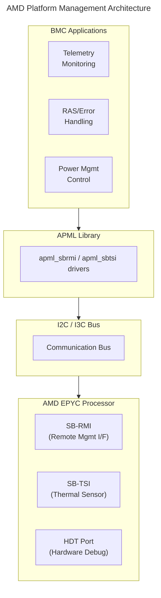

# AMD Debug & Management Guide
{: .no_toc }

Configure AMD EPYC system management and debug capabilities on OpenBMC.
{: .fs-6 .fw-300 }

## Table of Contents
{: .no_toc .text-delta }

1. TOC
{:toc}

---

## Overview

AMD EPYC platforms provide system management and debug capabilities through **APML (Advanced Platform Management Link)** and **HDT (Hardware Debug Tool)**. This guide covers the BMC integration for AMD server platforms.



<details markdown="1">
<summary>ASCII-art version (for comparison)</summary>

```
+----------------------------------------------------------------------+
|                  AMD Platform Management Architecture                |
+----------------------------------------------------------------------+
|                                                                      |
|  +-----------------------------------------------------------------+ |
|  |                       BMC Applications                          | |
|  |                                                                 | |
|  |   +-------------+  +-------------+  +-------------+             | |
|  |   | Telemetry   |  | RAS/Error   |  | Power Mgmt  |             | |
|  |   | Monitoring  |  | Handling    |  | Control     |             | |
|  |   +------+------+  +------+------+  +------+------+             | |
|  +---------+-----------------+----------------+--------------------+ |
|            |                 |                |                      |
|  +---------+-----------------+----------------+--------------------+ |
|  |                      APML Library                               | |
|  |            (apml_sbrmi / apml_sbtsi drivers)                    | |
|  +---------+-----------------+----------------+--------------------+ |
|            |                 |                |                      |
|  +---------+-----------------+----------------+--------------------+ |
|  |                    I2C / I3C Bus                                | |
|  +-----------------------------------------------------------------+ |
|            |                                                         |
|  +---------+-------------------------------------------------------+ |
|  |                    AMD EPYC Processor                           | |
|  |                                                                 | |
|  |   +-------------+  +-------------+  +-------------+             | |
|  |   | SB-RMI      |  | SB-TSI      |  | HDT Port    |             | |
|  |   | (Remote     |  | (Thermal    |  | (Hardware   |             | |
|  |   |  Mgmt I/F)  |  |  Sensor)    |  |  Debug)     |             | |
|  |   +-------------+  +-------------+  +-------------+             | |
|  +-----------------------------------------------------------------+ |
+----------------------------------------------------------------------+
```

</details>

---

## AMD Management Interfaces

### SB-RMI (Sideband Remote Management Interface)

Provides system management commands:

| Function | Description |
|----------|-------------|
| Power Management | RAPL power limits, throttling |
| RAS | Machine check, error reporting |
| Mailbox Commands | CPU configuration, CPUID |
| Performance | Core boost, C-states |

### SB-TSI (Sideband Thermal Sensor Interface)

Provides thermal monitoring:

| Function | Description |
|----------|-------------|
| CPU Temperature | Die temperature reading |
| Thermal Alerts | High/low temperature thresholds |
| Thermal Throttling | PROCHOT status |

### HDT (Hardware Debug Tool)

Low-level debug access (requires special hardware/NDA):

| Function | Description |
|----------|-------------|
| JTAG Access | CPU debug via JTAG chain |
| Run Control | Halt, step, breakpoints |
| Register Access | MSR, GPR access |
| Trace | Instruction trace |

---

## APML Setup

### Build-Time Configuration (Yocto)

```bitbake
# In your machine .conf or local.conf

# Include APML support
IMAGE_INSTALL:append = " \
    apml-modules \
    apml-library \
    esmi-oob-library \
"

# Kernel configuration
KERNEL_MODULE_AUTOLOAD:append = " apml_sbrmi apml_sbtsi"
```

### Kernel Modules

```bash
# Load APML modules
modprobe apml_sbrmi
modprobe apml_sbtsi

# Verify modules loaded
lsmod | grep apml

# Check I2C devices
i2cdetect -l
i2cdetect -y <bus>  # Find SB-RMI/SB-TSI addresses
```

### Device Tree Configuration

```dts
&i2c3 {
    status = "okay";

    /* SB-TSI - Thermal sensor */
    sbtsi@4c {
        compatible = "amd,sbtsi";
        reg = <0x4c>;
    };

    /* SB-RMI - Remote management */
    sbrmi@3c {
        compatible = "amd,sbrmi";
        reg = <0x3c>;
    };
};
```

---

## APML Library Usage

### Installation

```bash
# Check APML library
ls /usr/lib/libapml*

# Check APML tools
which esmi_oob_tool
```

### Reading CPU Temperature

```bash
# Via hwmon (SB-TSI driver)
cat /sys/class/hwmon/hwmon*/temp1_input

# Via APML library tool
esmi_oob_tool -s 0 --showtemprange
```

### Power Management

```bash
# Read current power
esmi_oob_tool -s 0 --showpower

# Read power limit
esmi_oob_tool -s 0 --showpowerlimit

# Set power limit (in milliwatts)
esmi_oob_tool -s 0 --setpowerlimit 200000

# Read TDP
esmi_oob_tool -s 0 --showtdp
```

### RAS (Reliability, Availability, Serviceability)

```bash
# Read MCA (Machine Check Architecture) status
esmi_oob_tool -s 0 --showmcastatus

# Read DIMM temperature
esmi_oob_tool -s 0 --showdimmtemp

# Read DIMM power
esmi_oob_tool -s 0 --showdimmpower

# Read DIMM thermal sensor
esmi_oob_tool -s 0 --showdimmthermal
```

### Mailbox Commands

```bash
# Read CPUID
esmi_oob_tool -s 0 --showcpuid

# Read processor info
esmi_oob_tool -s 0 --showprocinfo

# Read boost limit
esmi_oob_tool -s 0 --showboostlimit

# Set boost limit per core
esmi_oob_tool -s 0 --setboostlimit <core> <limit>
```

---

## D-Bus Integration

### Sensor Integration

APML sensors integrate with OpenBMC's sensor framework:

```bash
# Temperature sensors from SB-TSI appear in D-Bus
busctl tree xyz.openbmc_project.HwmonTempSensor

# Example: CPU temperature
busctl get-property xyz.openbmc_project.HwmonTempSensor \
    /xyz/openbmc_project/sensors/temperature/CPU0_Temp \
    xyz.openbmc_project.Sensor.Value Value
```

### Power Monitoring

```bash
# Power sensors via APML
busctl tree xyz.openbmc_project.Sensor

# Socket power reading
busctl get-property xyz.openbmc_project.Sensor \
    /xyz/openbmc_project/sensors/power/CPU0_Power \
    xyz.openbmc_project.Sensor.Value Value
```

---

## AMD OpenBMC Platform

### AMDESE OpenBMC

AMD maintains an OpenBMC distribution for EPYC platforms:

```bash
# Clone AMD's OpenBMC
git clone https://github.com/AMDESE/OpenBMC.git

# Build for Genoa platform
cd OpenBMC
. setup onyx  # or other platform
bitbake obmc-phosphor-image
```

### Supported Platforms

| Platform | Codename | Socket |
|----------|----------|--------|
| Onyx | Genoa | SP5 |
| Quartz | Genoa | SP5 |
| Ruby | Turin | SP5 |
| Chalupa | Genoa | SP5 |

---

## HDT Debug Access

{: .warning }
HDT provides deep hardware access. Full documentation requires AMD NDA. Use only in controlled debug environments.

### HDT Overview

HDT (Hardware Debug Tool) is AMD's JTAG-based debug interface:

- Accessed via dedicated debug header or BMC mux
- Requires specialized debug tools (AMD HDT software or third-party)
- Provides run-control (halt, step, breakpoints)
- Full register and memory access

### BMC JTAG Mux

Some platforms support JTAG muxing through BMC:

```bash
# Check for JTAG mux support
cat /sys/kernel/debug/gpio | grep -i jtag

# JTAG mux control (platform-specific)
gpioset gpiochip0 <jtag_mux_gpio>=1  # Route JTAG to BMC
```

### Commercial Solutions

For at-scale debug, commercial tools provide BMC-embedded debug:

- ASSET InterTech ScanWorks Embedded Diagnostics (SED)
- Lauterbach TRACE32 with remote access
- AMD HDT software (under NDA)

---

## Crash Dump Collection

### RAS Error Logging

```bash
# Machine Check errors are logged to SEL
ipmitool sel list | grep -i "Machine Check"

# View via Redfish
curl -k -u root:0penBmc \
    https://localhost/redfish/v1/Systems/system/LogServices/EventLog/Entries
```

### BERT (Boot Error Record Table)

```bash
# BERT records are available via ACPI
cat /sys/firmware/acpi/tables/BERT

# Decoded in system logs
dmesg | grep -i "BERT"
journalctl | grep -i "hardware error"
```

### Collecting Debug Data

```bash
# Collect system state dump
dreport -d /tmp/debug -n amd_debug -t user

# Include APML data
esmi_oob_tool -s 0 --showallinfo > /tmp/apml_state.txt

# Read MCA banks
esmi_oob_tool -s 0 --showmcastatus > /tmp/mca_status.txt
```

---

## Troubleshooting

### APML Not Working

```bash
# Check I2C bus connectivity
i2cdetect -y 3  # Replace with correct bus

# Verify kernel modules
lsmod | grep apml

# Check dmesg for errors
dmesg | grep -i "sbrmi\|sbtsi\|apml"

# Verify device nodes
ls -la /dev/sbrmi* /dev/sbtsi*
```

### Temperature Reading Fails

```bash
# Check hwmon path
ls /sys/class/hwmon/

# Find correct hwmon device
for h in /sys/class/hwmon/hwmon*; do
    name=$(cat $h/name 2>/dev/null)
    echo "$h: $name"
done

# Read directly
cat /sys/class/hwmon/hwmon<N>/temp1_input
```

### Command Timeouts

```bash
# APML commands may timeout under heavy load
# Increase timeout in library calls

# Check SMBus errors
dmesg | grep -i "i2c\|smbus"

# Retry with delay
sleep 1 && esmi_oob_tool -s 0 --showpower
```

### Permission Issues

```bash
# APML requires root or proper group membership
ls -la /dev/sbrmi0 /dev/sbtsi0

# Add user to appropriate group
usermod -aG i2c <username>
```

---

## Security Considerations

### Access Control

```bash
# Restrict APML access to administrators only
chmod 600 /dev/sbrmi* /dev/sbtsi*

# Use D-Bus policy for access control
# /etc/dbus-1/system.d/apml.conf
```

### Audit Logging

```bash
# Log APML access
# Integrate with phosphor-logging for audit trail
```

### Production Recommendations

- Disable HDT access in production (via fuses or GPIO)
- Restrict APML to essential operations
- Monitor for anomalous power/thermal changes
- Log all RAS events

---

## References

- [AMD APML Modules (GitHub)](https://github.com/amd/apml_modules) - Kernel drivers for SB-RMI/SB-TSI
- [AMD E-SMI In-Band Library (GitHub)](https://github.com/amd/esmi_ib_library) - In-band system management
- [AMD E-SMS APML Library](https://www.amd.com/en/developer/e-sms/apml-library.html) - Out-of-band APML library
- [AMDESE OpenBMC (GitHub)](https://github.com/AMDESE/OpenBMC) - AMD's OpenBMC distribution for EPYC
- [AMD E-SMS Developer Resources](https://www.amd.com/en/developer/e-sms.html) - EPYC System Management Software
- [AMD Technical Documentation Portal](https://www.amd.com/en/search/documentation/hub.html) - Official AMD documentation

---

## Deep Dive

This section provides detailed technical information for developers who want to understand AMD APML internals and SB-RMI/SB-TSI protocols.

### APML Communication Architecture

```
┌─────────────────────────────────────────────────────────────────────────────┐
│                      APML Sideband Interface Architecture                   │
├─────────────────────────────────────────────────────────────────────────────┤
│                                                                             │
│  BMC                                        AMD EPYC Processor              │
│  ┌────────────────────────────┐             ┌────────────────────────────┐  │
│  │                            │             │                            │  │
│  │  ┌──────────────────────┐  │  I2C/I3C   │  ┌──────────────────────┐  │  │
│  │  │  APML Library        │  │  ──────────│──│  System Management   │  │  │
│  │  │  (esmi_oob_library)  │  │  Bus       │  │  Unit (SMU)          │  │  │
│  │  └──────────┬───────────┘  │             │  └──────────────────────┘  │  │
│  │             │              │             │             │              │  │
│  │  ┌──────────┴───────────┐  │             │  ┌──────────┴───────────┐  │  │
│  │  │  Kernel Driver       │  │             │  │  Sideband Interfaces │  │  │
│  │  │  ┌─────────────────┐ │  │             │  │                      │  │  │
│  │  │  │  apml_sbrmi.ko  │ │  │   I2C      │  │  SB-RMI (0x3C)       │  │  │
│  │  │  │  /dev/sbrmi0    │─│──│───────────>│──│  Remote Management   │  │  │
│  │  │  └─────────────────┘ │  │             │  │  Interface           │  │  │
│  │  │  ┌─────────────────┐ │  │             │  │                      │  │  │
│  │  │  │  apml_sbtsi.ko  │ │  │   I2C      │  │  SB-TSI (0x4C)       │  │  │
│  │  │  │  /dev/sbtsi0    │─│──│───────────>│──│  Thermal Sensor      │  │  │
│  │  │  └─────────────────┘ │  │             │  │  Interface           │  │  │
│  │  └──────────────────────┘  │             │  └──────────────────────┘  │  │
│  │                            │             │                            │  │
│  └────────────────────────────┘             └────────────────────────────┘  │
│                                                                             │
│  I2C Bus Configuration:                                                     │
│  ┌────────────────────────────────────────────────────────────────────────┐ │
│  │  Address  │ Interface │ Function                                       │ │
│  │  ─────────┼───────────┼─────────────────────────────────────────────── │ │
│  │  0x3C     │ SB-RMI    │ Remote management, mailbox commands             │ │
│  │  0x4C     │ SB-TSI    │ Thermal sensor, temperature alerts              │ │
│  │  0x3D     │ SB-RMI    │ Secondary socket (Socket 1)                     │ │
│  │  0x4D     │ SB-TSI    │ Secondary socket (Socket 1)                     │ │
│  └────────────────────────────────────────────────────────────────────────┘ │
│                                                                             │
│  I2C Speed: Standard mode (100 kHz) or Fast mode (400 kHz)                  │
│  Pull-up: 2.2kΩ to 3.3V                                                     │
│                                                                             │
└─────────────────────────────────────────────────────────────────────────────┘
```

### SB-RMI Mailbox Protocol

```
┌─────────────────────────────────────────────────────────────────────────────┐
│                    SB-RMI Mailbox Command Sequence                          │
├─────────────────────────────────────────────────────────────────────────────┤
│                                                                             │
│  Mailbox Architecture:                                                      │
│  ┌────────────────────────────────────────────────────────────────────────┐ │
│  │  SMU (System Management Unit) processes mailbox commands               │ │
│  │  BMC writes command/data, waits for SMU to process, reads response     │ │
│  └────────────────────────────────────────────────────────────────────────┘ │
│                                                                             │
│  Mailbox Transaction Flow:                                                  │
│  ┌────────────────────────────────────────────────────────────────────────┐ │
│  │                                                                        │ │
│  │  Step 1: Check mailbox not busy                                        │ │
│  │  ┌──────────────────────────────────────────────────────────────────┐  │ │
│  │  │  Read SB_RMI_STATUS (0x02)                                       │  │ │
│  │  │  Wait for SwAlertSts bit to clear                                │  │ │
│  │  └──────────────────────────────────────────────────────────────────┘  │ │
│  │                              │                                         │ │
│  │                              v                                         │ │
│  │  Step 2: Write input arguments (if any)                                │ │
│  │  ┌──────────────────────────────────────────────────────────────────┐  │ │
│  │  │  Write to InBndMsg registers (0x50-0x5F)                         │  │ │
│  │  │  Up to 16 bytes of input data                                    │  │ │
│  │  └──────────────────────────────────────────────────────────────────┘  │ │
│  │                              │                                         │ │
│  │                              v                                         │ │
│  │  Step 3: Write command                                                 │ │
│  │  ┌──────────────────────────────────────────────────────────────────┐  │ │
│  │  │  Write command ID to SB_RMI_SW_MAILBOX_CMD (0x3B)                │  │ │
│  │  │  This triggers SMU to process the command                        │  │ │
│  │  └──────────────────────────────────────────────────────────────────┘  │ │
│  │                              │                                         │ │
│  │                              v                                         │ │
│  │  Step 4: Wait for completion                                           │ │
│  │  ┌──────────────────────────────────────────────────────────────────┐  │ │
│  │  │  Poll SB_RMI_STATUS for SwAlertSts bit                           │  │ │
│  │  │  Timeout after ~100ms                                            │  │ │
│  │  └──────────────────────────────────────────────────────────────────┘  │ │
│  │                              │                                         │ │
│  │                              v                                         │ │
│  │  Step 5: Read response                                                 │ │
│  │  ┌──────────────────────────────────────────────────────────────────┐  │ │
│  │  │  Read OutBndMsg registers (0x60-0x6F)                            │  │ │
│  │  │  Read SB_RMI_SW_MAILBOX_STATUS (0x3F) for result code            │  │ │
│  │  └──────────────────────────────────────────────────────────────────┘  │ │
│  │                                                                        │ │
│  └────────────────────────────────────────────────────────────────────────┘ │
│                                                                             │
│  Common SB-RMI Mailbox Commands:                                            │
│  ┌────────────────────────────────────────────────────────────────────────┐ │
│  │  Command ID │ Name               │ Description                         │ │
│  │  ───────────┼────────────────────┼───────────────────────────────────── │ │
│  │  0x01       │ ReadPkgPowerLimit  │ Read socket power limit (TDP cap)   │ │
│  │  0x02       │ WritePkgPowerLimit │ Set socket power limit              │ │
│  │  0x03       │ ReadPkgPowerConsumption │ Read current power draw        │ │
│  │  0x04       │ ReadDDRBandwidth   │ Read memory bandwidth usage         │ │
│  │  0x05       │ ReadBoostLimit     │ Read boost frequency limit          │ │
│  │  0x06       │ WriteBoostLimit    │ Set boost frequency limit           │ │
│  │  0x10       │ ReadMcaData        │ Read Machine Check registers        │ │
│  │  0x11       │ ReadDimmTemp       │ Read DIMM temperature               │ │
│  │  0x12       │ ReadDimmPower      │ Read DIMM power consumption         │ │
│  │  0x20       │ ReadCpuId          │ Read CPU family/model/stepping      │ │
│  └────────────────────────────────────────────────────────────────────────┘ │
│                                                                             │
└─────────────────────────────────────────────────────────────────────────────┘
```

### SB-TSI Temperature Sensing

```
┌─────────────────────────────────────────────────────────────────────────────┐
│                    SB-TSI Thermal Interface Protocol                        │
├─────────────────────────────────────────────────────────────────────────────┤
│                                                                             │
│  Register Map:                                                              │
│  ┌────────────────────────────────────────────────────────────────────────┐ │
│  │  Offset │ Register          │ Access │ Description                     │ │
│  │  ───────┼───────────────────┼────────┼──────────────────────────────── │ │
│  │  0x00   │ CPU_TEMP_INT      │ R      │ CPU temp integer part (°C)      │ │
│  │  0x01   │ STATUS            │ R      │ Status and alert flags          │ │
│  │  0x02   │ CONFIG            │ R/W    │ Configuration register          │ │
│  │  0x03   │ UPDATE_RATE       │ R/W    │ Temperature update rate         │ │
│  │  0x04   │ HI_TEMP_INT       │ R/W    │ High temp threshold integer     │ │
│  │  0x05   │ LO_TEMP_INT       │ R/W    │ Low temp threshold integer      │ │
│  │  0x10   │ CPU_TEMP_DEC      │ R      │ CPU temp decimal part           │ │
│  │  0x11   │ CPU_TEMP_OFFSET_INT │ R/W  │ Temperature offset integer      │ │
│  │  0x13   │ HI_TEMP_DEC       │ R/W    │ High temp threshold decimal     │ │
│  │  0x14   │ LO_TEMP_DEC       │ R/W    │ Low temp threshold decimal      │ │
│  │  0x19   │ TIMEOUT_CONFIG    │ R/W    │ Alert timeout configuration     │ │
│  │  0xFE   │ VENDOR_ID         │ R      │ Vendor ID (0x00 = AMD)          │ │
│  │  0xFF   │ DEVICE_ID         │ R      │ Device ID                       │ │
│  └────────────────────────────────────────────────────────────────────────┘ │
│                                                                             │
│  Temperature Reading:                                                       │
│  ┌────────────────────────────────────────────────────────────────────────┐ │
│  │  Temperature = CPU_TEMP_INT + (CPU_TEMP_DEC × 0.125)                   │ │
│  │                                                                        │ │
│  │  CPU_TEMP_DEC bits[7:5] represent 0.125°C increments:                  │ │
│  │    000 = 0.000°C                                                       │ │
│  │    001 = 0.125°C                                                       │ │
│  │    010 = 0.250°C                                                       │ │
│  │    011 = 0.375°C                                                       │ │
│  │    100 = 0.500°C                                                       │ │
│  │    101 = 0.625°C                                                       │ │
│  │    110 = 0.750°C                                                       │ │
│  │    111 = 0.875°C                                                       │ │
│  │                                                                        │ │
│  │  Example: INT=55, DEC=0x40 (010 in bits[7:5])                          │ │
│  │           Temperature = 55 + 0.250 = 55.25°C                           │ │
│  │                                                                        │ │
│  └────────────────────────────────────────────────────────────────────────┘ │
│                                                                             │
│  Threshold Alert Mechanism:                                                 │
│  ┌────────────────────────────────────────────────────────────────────────┐ │
│  │                                                                        │ │
│  │  Temperature                                                           │ │
│  │       ^                                                                │ │
│  │       │    ┌─── High Threshold (HI_TEMP_INT + HI_TEMP_DEC)             │ │
│  │       │    │    ALERT_H bit set when temp >= threshold                 │ │
│  │  100°C├────┼───────────────────────────────────────────                │ │
│  │       │    │                                                           │ │
│  │       │    │   ~~~~ Actual Temperature ~~~~                            │ │
│  │   75°C├────┤                                                           │ │
│  │       │    │                                                           │ │
│  │       │    └─── Low Threshold (LO_TEMP_INT + LO_TEMP_DEC)              │ │
│  │       │         ALERT_L bit set when temp <= threshold                 │ │
│  │   50°C├─────────────────────────────────────────────────               │ │
│  │       │                                                                │ │
│  │       └──────────────────────────────────────────────> Time            │ │
│  │                                                                        │ │
│  │  STATUS Register (0x01) flags:                                         │ │
│  │    Bit 0: ALERT_L - Temperature at or below low threshold              │ │
│  │    Bit 1: ALERT_H - Temperature at or above high threshold             │ │
│  │    Bit 7: Busy - Temperature conversion in progress                    │ │
│  │                                                                        │ │
│  └────────────────────────────────────────────────────────────────────────┘ │
│                                                                             │
└─────────────────────────────────────────────────────────────────────────────┘
```

### AMD MCA (Machine Check Architecture) Error Handling

```
┌─────────────────────────────────────────────────────────────────────────────┐
│                    AMD MCA Error Collection via APML                        │
├─────────────────────────────────────────────────────────────────────────────┤
│                                                                             │
│  MCA Bank Layout (AMD Zen Architecture):                                    │
│  ┌────────────────────────────────────────────────────────────────────────┐ │
│  │  Bank │ Description                    │ Error Types                   │ │
│  │  ─────┼────────────────────────────────┼─────────────────────────────── │ │
│  │  0    │ Load-Store Unit                │ Cache/TLB errors              │ │
│  │  1    │ Instruction Fetch Unit         │ IC/IT errors                  │ │
│  │  2    │ L2 Cache Unit                  │ L2 tag/data errors            │ │
│  │  3    │ Decode Unit                    │ Microcode/instruction errors  │ │
│  │  4    │ Reserved                       │                               │ │
│  │  5    │ Execution Unit                 │ FP/INT execution errors       │ │
│  │  6    │ Floating Point Unit            │ FP register file errors       │ │
│  │  7-15 │ Core-specific banks            │ Varies by generation          │ │
│  │  16+  │ Uncore banks (UMC, DF, etc.)  │ Memory, fabric errors         │ │
│  └────────────────────────────────────────────────────────────────────────┘ │
│                                                                             │
│  Reading MCA via APML Mailbox:                                              │
│  ┌────────────────────────────────────────────────────────────────────────┐ │
│  │  Command: ReadMcaData (0x10)                                           │ │
│  │                                                                        │ │
│  │  Input:                                                                │ │
│  │    InBndMsg[0]: Core/Thread ID                                         │ │
│  │    InBndMsg[1]: MCA Bank number                                        │ │
│  │    InBndMsg[2]: Register offset (0=STATUS, 1=ADDR, 2=MISC, etc.)       │ │
│  │                                                                        │ │
│  │  Output:                                                               │ │
│  │    OutBndMsg[0-7]: 64-bit register value                               │ │
│  │                                                                        │ │
│  │  Example reading MC0_STATUS:                                           │ │
│  │    esmi_oob_tool -s 0 --readmsr --core 0 --bank 0 --offset 0           │ │
│  │                                                                        │ │
│  └────────────────────────────────────────────────────────────────────────┘ │
│                                                                             │
│  MCA_STATUS Register Format (AMD Zen):                                      │
│  ┌────────────────────────────────────────────────────────────────────────┐ │
│  │  Bit   │ Field    │ Description                                        │ │
│  │  ──────┼──────────┼─────────────────────────────────────────────────── │ │
│  │  63    │ Val      │ Error information valid                            │ │
│  │  62    │ Overflow │ Multiple errors, information may be lost           │ │
│  │  61    │ UC       │ Uncorrected error                                  │ │
│  │  60    │ En       │ Error reporting enabled                            │ │
│  │  59    │ MiscV    │ MCA_MISC register valid                            │ │
│  │  58    │ AddrV    │ MCA_ADDR register valid                            │ │
│  │  57    │ PCC      │ Processor context corrupt                          │ │
│  │  56    │ TCC      │ Task context corrupt                               │ │
│  │  55    │ Poison   │ Poisoned data consumed                             │ │
│  │  54    │ Deferred │ Deferred error (reported later)                    │ │
│  │  47:32 │ ExtErrCode │ Extended error code                              │ │
│  │  31:16 │ ModelErrCode │ Model-specific error code                      │ │
│  │  15:0  │ ErrCode  │ Error code type                                    │ │
│  └────────────────────────────────────────────────────────────────────────┘ │
│                                                                             │
│  Error Types (ErrCode bits 15:0):                                           │ │
│  ┌────────────────────────────────────────────────────────────────────────┐ │
│  │  Pattern     │ Type              │ Description                         │ │
│  │  ────────────┼───────────────────┼──────────────────────────────────── │ │
│  │  0000 0000   │ No error          │                                     │ │
│  │  0000 0001   │ Unclassified      │ Internal parity/protocol error      │ │
│  │  0000 0101   │ Internal parity   │ Core internal error                 │ │
│  │  000x xxxx   │ TLB errors        │ TLB parity/multimatch               │ │
│  │  001x xxxx   │ Memory errors     │ Cache hierarchy errors              │ │
│  │  010x xxxx   │ Bus/Interconnect  │ Data fabric/IF errors               │ │
│  │  1xxx xxxx   │ Memory controller │ DRAM/UMC errors                     │ │
│  └────────────────────────────────────────────────────────────────────────┘ │
│                                                                             │
└─────────────────────────────────────────────────────────────────────────────┘
```

### Source Code References

| Component | Repository | Key Files |
|-----------|------------|-----------|
| APML Kernel Modules | [amd/apml_modules](https://github.com/amd/apml_modules) | `sbrmi/apml_sbrmi.c`, `sbtsi/apml_sbtsi.c` |
| E-SMI OOB Library | [amd/esmi_oob_library](https://github.com/amd/esmi_oob_library) | `src/esmi_oob.c`, `src/apml.c` |
| E-SMI In-Band Library | [amd/esmi_ib_library](https://github.com/amd/esmi_ib_library) | `src/e_smi.c` |
| AMDESE OpenBMC | [AMDESE/OpenBMC](https://github.com/AMDESE/OpenBMC) | `meta-amd/` |
| hwmon sbtsi driver | [linux/drivers/hwmon](https://github.com/torvalds/linux) | `drivers/hwmon/sbtsi_temp.c` |

---

{: .note }
**Platform**: AMD EPYC 7002 (Rome), 7003 (Milan), 9004 (Genoa), and newer platforms. APML requires Family 17h (Zen) or later processors.
