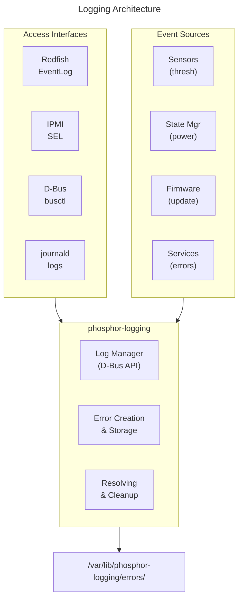
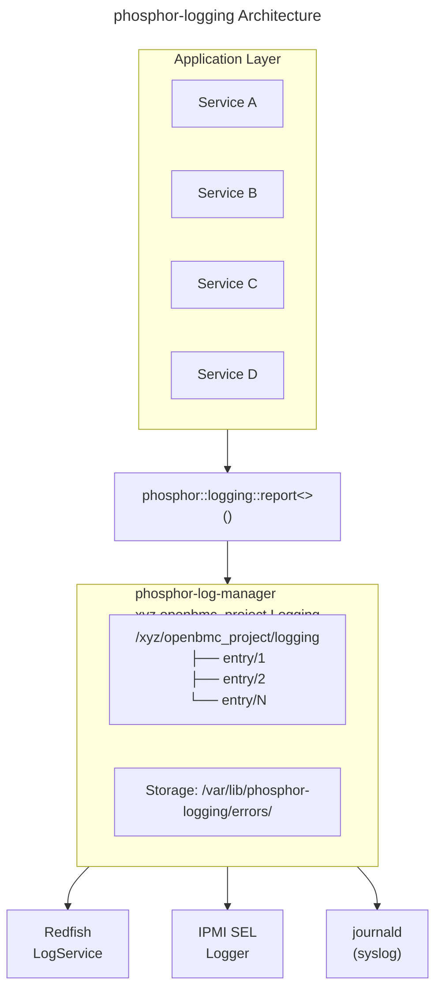

# Logging Guide
{: .no_toc }

Configure and use event logging in OpenBMC.
{: .fs-6 .fw-300 }

## Table of Contents
{: .no_toc .text-delta }

1. TOC
{:toc}

---

## Overview

OpenBMC provides comprehensive logging capabilities through **phosphor-logging** and related services. Logs are accessible via D-Bus, IPMI SEL, and Redfish APIs.



<details>
<summary>ASCII-art version (for comparison)</summary>

```
┌─────────────────────────────────────────────────────────────────┐
│                    Logging Architecture                         │
├─────────────────────────────────────────────────────────────────┤
│                                                                 │
│  ┌─────────────────────────────────────────────────────────────┐│
│  │                    Access Interfaces                        ││
│  │                                                             ││
│  │   ┌──────────┐  ┌──────────┐  ┌──────────┐  ┌──────────┐    ││
│  │   │ Redfish  │  │  IPMI    │  │  D-Bus   │  │ journald │    ││
│  │   │EventLog  │  │   SEL    │  │ busctl   │  │  logs    │    ││
│  │   └────┬─────┘  └────┬─────┘  └────┬─────┘  └────┬─────┘    ││
│  └────────┼─────────────┼─────────────┼─────────────┼──────────┘│
│           └─────────────┴──────┬──────┴─────────────┘           │
│                                │                                │
│  ┌─────────────────────────────┴───────────────────────────────┐│
│  │                   phosphor-logging                          ││
│  │                                                             ││
│  │   ┌────────────────┐  ┌────────────────┐  ┌──────────────┐  ││
│  │   │  Log Manager   │  │ Error Creation │  │  Resolving   │  ││
│  │   │  (D-Bus API)   │  │   & Storage    │  │  & Cleanup   │  ││
│  │   └────────────────┘  └────────────────┘  └──────────────┘  ││
│  └──────────────────────────┬──────────────────────────────────┘│
│                             │                                   │
│  ┌──────────────────────────┴──────────────────────────────────┐│
│  │                     Log Storage                             ││
│  │           /var/lib/phosphor-logging/errors/                 ││
│  └─────────────────────────────────────────────────────────────┘│
│                                                                 │
│  ┌─────────────────────────────────────────────────────────────┐│
│  │                    Event Sources                            ││
│  │                                                             ││
│  │   ┌──────────┐ ┌──────────┐ ┌──────────┐ ┌──────────┐       ││
│  │   │ Sensors  │ │ State Mgr│ │ Firmware │ │ Services │       ││
│  │   │ (thresh) │ │ (power)  │ │ (update) │ │ (errors) │       ││
│  │   └──────────┘ └──────────┘ └──────────┘ └──────────┘       ││
│  └─────────────────────────────────────────────────────────────┘│
└─────────────────────────────────────────────────────────────────┘
```

</details>

---

## Setup & Configuration

### Build-Time Configuration (Yocto)

```bitbake
# In your machine .conf or local.conf

# Include logging packages
IMAGE_INSTALL:append = " \
    phosphor-logging \
    phosphor-sel-logger \
    phosphor-log-manager \
"

# Configure logging options
EXTRA_OEMESON:pn-phosphor-logging = " \
    -Dpersistence=enabled \
    -Dremote-host-config=enabled \
"
```

### Meson Build Options

| Option | Default | Description |
|--------|---------|-------------|
| `persistence` | enabled | Persist logs across reboots |
| `remote-host-config` | disabled | Remote syslog support |
| `openpower-pel` | disabled | IBM PEL format logs |

### Runtime Configuration

```bash
# Check logging service
systemctl status phosphor-log-manager

# View service logs
journalctl -u phosphor-log-manager -f

# Log storage location
ls /var/lib/phosphor-logging/errors/
```

---

## Creating Event Logs

### Via D-Bus API

```bash
# Create an informational log
busctl call xyz.openbmc_project.Logging \
    /xyz/openbmc_project/logging \
    xyz.openbmc_project.Logging.Create \
    Create ssas \
    "xyz.openbmc_project.Common.Error.InternalFailure" \
    "xyz.openbmc_project.Logging.Entry.Level.Informational" \
    2 \
    "COMPONENT=MyService" \
    "REASON=Test log entry"
```

### Log Severity Levels

| Level | Description | Use Case |
|-------|-------------|----------|
| Emergency | System unusable | Critical failures |
| Alert | Immediate action needed | Security events |
| Critical | Critical conditions | Hardware failures |
| Error | Error conditions | Service errors |
| Warning | Warning conditions | Threshold warnings |
| Notice | Normal but significant | State changes |
| Informational | Informational | Status updates |
| Debug | Debug messages | Development |

### From Application Code

{: .note }
> **Source Reference**: [phosphor-logging](https://github.com/openbmc/phosphor-logging)
> - Logging API: [phosphor-logging/log.hpp](https://github.com/openbmc/phosphor-logging/blob/master/lib/include/phosphor-logging/log.hpp)
> - Error definitions: [phosphor-logging/elog.hpp](https://github.com/openbmc/phosphor-logging/blob/master/lib/include/phosphor-logging/elog.hpp)

```cpp
#include <phosphor-logging/log.hpp>
#include <phosphor-logging/elog.hpp>
#include <phosphor-logging/elog-errors.hpp>

using namespace phosphor::logging;

// Log an error
log<level::ERR>("Sensor read failed",
    entry("SENSOR=%s", "CPU_Temp"),
    entry("ERROR=%d", errno));

// Log an informational message
log<level::INFO>("Service started",
    entry("VERSION=%s", "1.0.0"));
```

### Using elog for Structured Errors

```cpp
#include <xyz/openbmc_project/Common/error.hpp>

using namespace sdbusplus::xyz::openbmc_project::Common::Error;

// Report a structured error
try {
    // Some operation
    if (error_condition) {
        report<InternalFailure>();
    }
} catch (const std::exception& e) {
    log<level::ERR>("Exception caught", entry("WHAT=%s", e.what()));
}
```

---

## Viewing Event Logs

### Via D-Bus

```bash
# List all log entries
busctl tree xyz.openbmc_project.Logging

# Get log entry details
busctl introspect xyz.openbmc_project.Logging \
    /xyz/openbmc_project/logging/entry/1

# Get log message
busctl get-property xyz.openbmc_project.Logging \
    /xyz/openbmc_project/logging/entry/1 \
    xyz.openbmc_project.Logging.Entry \
    Message
```

### Via Redfish

```bash
# Get event log entries
curl -k -u root:0penBmc \
    https://localhost/redfish/v1/Systems/system/LogServices/EventLog/Entries

# Get specific entry
curl -k -u root:0penBmc \
    https://localhost/redfish/v1/Systems/system/LogServices/EventLog/Entries/1
```

### Via IPMI SEL

```bash
# Get SEL entries
ipmitool -I lanplus -H bmc-ip -U root -P 0penBmc sel list

# Get SEL info
ipmitool -I lanplus -H bmc-ip -U root -P 0penBmc sel info
```

---

## Managing Logs

### Delete Single Log

```bash
# Via D-Bus
busctl call xyz.openbmc_project.Logging \
    /xyz/openbmc_project/logging/entry/1 \
    xyz.openbmc_project.Object.Delete \
    Delete

# Via Redfish
curl -k -u root:0penBmc -X DELETE \
    https://localhost/redfish/v1/Systems/system/LogServices/EventLog/Entries/1
```

### Clear All Logs

```bash
# Via Redfish
curl -k -u root:0penBmc -X POST \
    https://localhost/redfish/v1/Systems/system/LogServices/EventLog/Actions/LogService.ClearLog

# Via IPMI
ipmitool -I lanplus -H bmc-ip -U root -P 0penBmc sel clear
```

### Log Rotation

```bash
# Log capacity configuration
# Default: 200 entries maximum

# Configure via D-Bus property
busctl set-property xyz.openbmc_project.Logging \
    /xyz/openbmc_project/logging \
    xyz.openbmc_project.Logging.Settings \
    QuiesceOnHwError b false
```

---

## SEL Logger

The SEL Logger creates IPMI-compatible SEL entries from sensor events.

### Configuration

```bash
# Check SEL logger service
systemctl status phosphor-sel-logger

# SEL logger monitors threshold events
# and creates SEL entries automatically
```

### SEL Record Types

| Type | Description |
|------|-------------|
| System Event | Standard SEL entry |
| OEM Timestamped | Vendor-specific with timestamp |
| OEM Non-timestamped | Vendor-specific without timestamp |

### IPMI SEL Commands

```bash
# Get SEL information
ipmitool sel info

# Get SEL entries
ipmitool sel list

# Get extended info
ipmitool sel elist

# Clear SEL
ipmitool sel clear

# Get specific record
ipmitool sel get 1
```

---

## SDR (Sensor Data Record)

SDR describes sensors and their properties for IPMI.

### SDR Types

| Type | Description |
|------|-------------|
| Full Sensor | Complete sensor definition |
| Compact Sensor | Abbreviated sensor record |
| Event-Only | Event generation info |
| FRU Device | FRU information |
| MC Device | Management controller |

### View SDR

```bash
# List all SDR records
ipmitool sdr list

# Get detailed SDR info
ipmitool sdr info

# Get specific sensor type
ipmitool sdr type Temperature
```

### Dynamic SDR Generation

OpenBMC generates SDR dynamically from D-Bus sensor objects:

```bash
# SDR is generated from:
# - xyz.openbmc_project.Sensor.* interfaces
# - threshold definitions
# - sensor metadata
```

---

## POST Codes

POST (Power-On Self-Test) codes capture boot progress.

### Setup

```bitbake
# Include POST code manager
IMAGE_INSTALL:append = " phosphor-post-code-manager"
```

### View POST Codes

```bash
# Via D-Bus
busctl tree xyz.openbmc_project.State.Boot.Raw

# Get current POST code
busctl get-property xyz.openbmc_project.State.Boot.Raw \
    /xyz/openbmc_project/state/boot/raw0 \
    xyz.openbmc_project.State.Boot.Raw \
    Value

# Via Redfish
curl -k -u root:0penBmc \
    https://localhost/redfish/v1/Systems/system/LogServices/PostCodes/Entries
```

### POST Code History

```bash
# Get POST code history
busctl call xyz.openbmc_project.State.Boot.Raw \
    /xyz/openbmc_project/state/boot/raw0 \
    xyz.openbmc_project.State.Boot.Raw \
    GetPostCodes q 0  # Boot cycle 0 (current)
```

---

## Debug Collector (dreport)

Collect diagnostic information for debugging.

### Create Debug Report

```bash
# Generate report
dreport -d /tmp/debug -n myreport -t user

# Report types:
# user     - User-initiated dump
# core     - Core dump
# elog     - Error log dump
# pel      - PEL dump (OpenPOWER)
```

### Via Redfish

```bash
# Create dump
curl -k -u root:0penBmc -X POST \
    -H "Content-Type: application/json" \
    -d '{"DiagnosticDataType": "Manager"}' \
    https://localhost/redfish/v1/Managers/bmc/LogServices/Dump/Actions/LogService.CollectDiagnosticData

# List dumps
curl -k -u root:0penBmc \
    https://localhost/redfish/v1/Managers/bmc/LogServices/Dump/Entries

# Download dump
curl -k -u root:0penBmc -o dump.tar.xz \
    https://localhost/redfish/v1/Managers/bmc/LogServices/Dump/Entries/1/attachment
```

### Dump Contents

```bash
# Extract and examine
tar -xf dump.tar.xz

# Contents typically include:
# - Journal logs
# - D-Bus state
# - System configuration
# - Core files (if applicable)
```

---

## Remote Logging

### Syslog Configuration

```bash
# Configure remote syslog
# /etc/rsyslog.d/remote.conf
*.* @@remote-server:514
```

### Redfish Event Forwarding

```bash
# Create event subscription
curl -k -u root:0penBmc -X POST \
    -H "Content-Type: application/json" \
    -d '{
        "Destination": "https://log-server:8080/events",
        "Protocol": "Redfish",
        "EventTypes": ["Alert", "StatusChange"]
    }' \
    https://localhost/redfish/v1/EventService/Subscriptions
```

---

## Troubleshooting

### No Logs Appearing

```bash
# Check logging service
systemctl status phosphor-log-manager

# Check permissions
ls -la /var/lib/phosphor-logging/

# Verify D-Bus service
busctl status xyz.openbmc_project.Logging
```

### SEL Not Updating

```bash
# Check SEL logger service
systemctl status phosphor-sel-logger

# Verify threshold events are configured
busctl introspect xyz.openbmc_project.Sensors.* \
    /xyz/openbmc_project/sensors/*/*
```

### Logs Fill Up

```bash
# Check log count
busctl tree xyz.openbmc_project.Logging | wc -l

# Clear old logs
curl -k -u root:0penBmc -X POST \
    https://localhost/redfish/v1/Systems/system/LogServices/EventLog/Actions/LogService.ClearLog
```

---

## Custom Event Log Example

### Define Error Type

```yaml
# xyz/openbmc_project/MyService/MyError.errors.yaml
- name: ConfigurationError
  description: Configuration file is invalid
  metadata:
    - name: FILE
      type: string
    - name: LINE
      type: int32
```

### Generate Code

```bash
# In meson.build
error_yaml = files('xyz/openbmc_project/MyService/MyError.errors.yaml')
error_hpp = phosphor_logging_gen.process(
    error_yaml,
    preserve_path_from: meson.current_source_dir())
```

### Use Error

```cpp
#include <xyz/openbmc_project/MyService/error.hpp>

using MyConfigError = sdbusplus::xyz::openbmc_project::MyService::Error::ConfigurationError;

// Report the error
report<MyConfigError>(
    xyz::openbmc_project::MyService::ConfigurationError::FILE("config.json"),
    xyz::openbmc_project::MyService::ConfigurationError::LINE(42)
);
```

---

## Deep Dive
{: .text-delta }

Advanced implementation details for logging developers.

### phosphor-logging Architecture



<details>
<summary>ASCII-art version (for comparison)</summary>

```
┌─────────────────────────────────────────────────────────────────────────┐
│                    Logging Architecture                                 │
├─────────────────────────────────────────────────────────────────────────┤
│                                                                         │
│   Application Layer                                                     │
│   ┌─────────────────────────────────────────────────────────────────┐   │
│   │  Service A     Service B     Service C     Service D            │   │
│   │     │              │             │             │                │   │
│   │     └──────────────┴─────────────┴─────────────┘                │   │
│   │                          │                                      │   │
│   │                          ▼                                      │   │
│   │              phosphor::logging::report<>()                      │   │
│   └────────────────────────────┬────────────────────────────────────┘   │
│                                │                                        │
│                                ▼                                        │
│   ┌─────────────────────────────────────────────────────────────────┐   │
│   │                    phosphor-log-manager                         │   │
│   │   xyz.openbmc_project.Logging                                   │   │
│   │                                                                 │   │
│   │   ├── /xyz/openbmc_project/logging                              │   │
│   │   │   ├── entry/1  (Error log entry)                            │   │
│   │   │   ├── entry/2                                               │   │
│   │   │   └── entry/N                                               │   │
│   │   │                                                             │   │
│   │   └── Internal Storage: /var/lib/phosphor-logging/errors/       │   │
│   └────────────────────────────┬────────────────────────────────────┘   │
│                                │                                        │
│          ┌─────────────────────┼─────────────────────┐                  │
│          ▼                     ▼                     ▼                  │
│   ┌────────────┐        ┌────────────┐        ┌────────────┐            │
│   │ Redfish    │        │  IPMI SEL  │        │  journald  │            │
│   │ LogService │        │  Logger    │        │  (syslog)  │            │
│   └────────────┘        └────────────┘        └────────────┘            │
│                                                                         │
└─────────────────────────────────────────────────────────────────────────┘
```

</details>

### Error Entry Structure

**D-Bus Object:** `/xyz/openbmc_project/logging/entry/N`

**Interfaces and Properties:**

| Interface | Property | Description |
|-----------|----------|-------------|
| `xyz.openbmc_project.Logging.Entry` | `Id` (uint32) | Entry identifier |
| | `Severity` | Informational/Warning/Critical |
| | `Message` (string) | Error message (MessageId) |
| | `Resolved` (bool) | Has error been acknowledged |
| | `Timestamp` (uint64) | Unix timestamp in milliseconds |
| | `AdditionalData` | Array of "KEY=VALUE" strings |
| `xyz.openbmc_project.Association.Definitions` | `Associations` | Links to related objects |
| `xyz.openbmc_project.Object.Delete` | `Delete()` | Method to delete entry |

**AdditionalData Example:**
```json
[
  "SENSOR_PATH=/xyz/openbmc_project/sensors/temp/CPU0",
  "THRESHOLD_VALUE=95.0",
  "READING=98.5",
  "_PID=1234",
  "CALLOUT_INVENTORY_PATH=/xyz/.../cpu0"
]
```

<details>
<summary>ASCII-art version (for comparison)</summary>

```
┌─────────────────────────────────────────────────────────────────────────┐
│                    Error Log Entry                                      │
├─────────────────────────────────────────────────────────────────────────┤
│                                                                         │
│   D-Bus Object: /xyz/openbmc_project/logging/entry/N                    │
│                                                                         │
│   Interfaces and Properties:                                            │
│   ┌─────────────────────────────────────────────────────────────────┐   │
│   │ xyz.openbmc_project.Logging.Entry                               │   │
│   │ ├── Id (uint32)        - Entry identifier                       │   │
│   │ ├── Severity           - Informational/Warning/Critical         │   │
│   │ ├── Message (string)   - Error message (MessageId)              │   │
│   │ ├── Resolved (bool)    - Has error been acknowledged            │   │
│   │ ├── Timestamp (uint64) - Unix timestamp in milliseconds         │   │
│   │ └── AdditionalData     - Array of "KEY=VALUE" strings           │   │
│   │                                                                 │   │
│   │ xyz.openbmc_project.Association.Definitions                     │   │
│   │ └── Associations       - Links to related objects               │   │
│   │                                                                 │   │
│   │ xyz.openbmc_project.Object.Delete                               │   │
│   │ └── Delete()           - Method to delete entry                 │   │
│   └─────────────────────────────────────────────────────────────────┘   │
│                                                                         │
│   AdditionalData Example:                                               │
│   ┌─────────────────────────────────────────────────────────────────┐   │
│   │ [                                                               │   │
│   │   "SENSOR_PATH=/xyz/openbmc_project/sensors/temp/CPU0",         │   │
│   │   "THRESHOLD_VALUE=95.0",                                       │   │
│   │   "READING=98.5",                                               │   │
│   │   "_PID=1234",                                                  │   │
│   │   "CALLOUT_INVENTORY_PATH=/xyz/.../cpu0"                        │   │
│   │ ]                                                               │   │
│   └─────────────────────────────────────────────────────────────────┘   │
│                                                                         │
└─────────────────────────────────────────────────────────────────────────┘
```

</details>

### Error Reporting API

```
┌─────────────────────────────────────────────────────────────────────────┐
│                    Error Reporting Patterns                             │
├─────────────────────────────────────────────────────────────────────────┤
│                                                                         │
│   1. Simple Error (no metadata):                                        │
│   ┌─────────────────────────────────────────────────────────────────┐   │
│   │ #include <phosphor-logging/elog.hpp>                            │   │
│   │ #include <xyz/openbmc_project/Common/error.hpp>                 │   │
│   │                                                                 │   │
│   │ using InternalFailure =                                         │   │
│   │     sdbusplus::xyz::openbmc_project::Common::Error::            │   │
│   │     InternalFailure;                                            │   │
│   │                                                                 │   │
│   │ phosphor::logging::report<InternalFailure>();                   │   │
│   └─────────────────────────────────────────────────────────────────┘   │
│                                                                         │
│   2. Error with Metadata:                                               │
│   ┌─────────────────────────────────────────────────────────────────┐   │
│   │ using namespace phosphor::logging;                              │   │
│   │ using TempError = xyz::openbmc_project::Sensor::Error::         │   │
│   │                   OverTemperature;                              │   │
│   │ using Metadata = xyz::openbmc_project::Sensor::OverTemperature; │   │
│   │                                                                 │   │
│   │ report<TempError>(                                              │   │
│   │     Metadata::SENSOR_PATH(sensorPath.c_str()),                  │   │
│   │     Metadata::READING(98.5),                                    │   │
│   │     Metadata::THRESHOLD(95.0)                                   │   │
│   │ );                                                              │   │
│   └─────────────────────────────────────────────────────────────────┘   │
│                                                                         │
│   3. D-Bus Method Call (from script):                                   │
│   ┌─────────────────────────────────────────────────────────────────┐   │
│   │ busctl call xyz.openbmc_project.Logging \                       │   │
│   │     /xyz/openbmc_project/logging \                              │   │
│   │     xyz.openbmc_project.Logging.Create Create \                 │   │
│   │     ssa{ss} \                                                   │   │
│   │     "xyz.openbmc_project.Common.Error.InternalFailure" \        │   │
│   │     "xyz.openbmc_project.Logging.Entry.Level.Error" \           │   │
│   │     2 "KEY1" "value1" "KEY2" "value2"                           │   │
│   └─────────────────────────────────────────────────────────────────┘   │
│                                                                         │
└─────────────────────────────────────────────────────────────────────────┘
```

### IPMI SEL Integration

```
┌─────────────────────────────────────────────────────────────────────────┐
│                    SEL (System Event Log) Integration                   │
├─────────────────────────────────────────────────────────────────────────┤
│                                                                         │
│   phosphor-sel-logger monitors D-Bus for loggable events:               │
│                                                                         │
│   Event Sources:                                                        │
│   ├── Threshold crossing (Sensor.Value PropertiesChanged)               │
│   ├── Discrete sensor state change                                      │
│   ├── phosphor-logging new entry (InterfacesAdded)                      │
│   └── Watchdog timeout                                                  │
│                                                                         │
│   SEL Record Format (IPMI 2.0, Type 02h):                               │
│   ┌────────┬────────┬───────────────────────────────────────────────┐   │
│   │ Offset │ Size   │ Description                                   │   │
│   ├────────┼────────┼───────────────────────────────────────────────┤   │
│   │ 0-1    │ 2      │ Record ID                                     │   │
│   │ 2      │ 1      │ Record Type (0x02 = System Event)             │   │
│   │ 3-6    │ 4      │ Timestamp                                     │   │
│   │ 7-8    │ 2      │ Generator ID                                  │   │
│   │ 9      │ 1      │ EvM Rev                                       │   │
│   │ 10     │ 1      │ Sensor Type                                   │   │
│   │ 11     │ 1      │ Sensor Number                                 │   │
│   │ 12     │ 1      │ Event Type/Dir                                │   │
│   │ 13-15  │ 3      │ Event Data 1-3                                │   │
│   └────────┴────────┴───────────────────────────────────────────────┘   │
│                                                                         │
│   Sensor Type to SEL Mapping:                                           │
│   ┌─────────────────────────────────────────────────────────────────┐   │
│   │ D-Bus Sensor Type           │ IPMI Sensor Type                  │   │
│   ├─────────────────────────────┼───────────────────────────────────┤   │
│   │ sensors/temperature/*       │ 0x01 (Temperature)                │   │
│   │ sensors/voltage/*           │ 0x02 (Voltage)                    │   │
│   │ sensors/current/*           │ 0x03 (Current)                    │   │
│   │ sensors/fan_tach/*          │ 0x04 (Fan)                        │   │
│   │ sensors/power/*             │ 0x08 (Power Supply)               │   │
│   └─────────────────────────────────────────────────────────────────┘   │
│                                                                         │
└─────────────────────────────────────────────────────────────────────────┘
```

### Log Rotation and Persistence

```
┌─────────────────────────────────────────────────────────────────────────┐
│                    Log Management                                       │
├─────────────────────────────────────────────────────────────────────────┤
│                                                                         │
│   Storage Location:                                                     │
│   /var/lib/phosphor-logging/errors/                                     │
│   ├── 1        # Serialized error entry                                 │
│   ├── 2                                                                 │
│   └── ...                                                               │
│                                                                         │
│   Configuration:                                                        │
│   ┌─────────────────────────────────────────────────────────────────┐   │
│   │ ERROR_CAP = 200           # Maximum number of error entries     │   │
│   │ ERROR_INFO_CAP = 10       # Max informational entries           │   │
│   │ ERROR_PERSIST_PATH = /var/lib/phosphor-logging/errors/          │   │
│   └─────────────────────────────────────────────────────────────────┘   │
│                                                                         │
│   Rotation Behavior:                                                    │
│   ┌─────────────────────────────────────────────────────────────────┐   │
│   │ When ERROR_CAP reached:                                         │   │
│   │ 1. Find oldest Informational entry → delete                     │   │
│   │ 2. If no Informational, find oldest Warning → delete            │   │
│   │ 3. If no Warning, find oldest Error → delete                    │   │
│   │ 4. Critical entries protected from rotation                     │   │
│   │ 5. Resolved entries deleted before unresolved                   │   │
│   └─────────────────────────────────────────────────────────────────┘   │
│                                                                         │
│   Persistence across BMC reboot:                                        │
│   ├── Entries serialized to filesystem using cereal                     │
│   ├── Entry IDs are persistent                                          │
│   └── On startup, entries loaded from /var/lib/phosphor-logging/        │
│                                                                         │
└─────────────────────────────────────────────────────────────────────────┘
```

### Source Code Reference

Key implementation files in [phosphor-logging](https://github.com/openbmc/phosphor-logging):

| File | Description |
|------|-------------|
| `log_manager.cpp` | Main logging manager |
| `elog_entry.cpp` | Error log entry object |
| `elog_serialize.cpp` | Entry persistence |
| `extensions.cpp` | Extension point for plugins |
| `lib/elog.cpp` | Client-side reporting API |

---

## Examples

Working examples are available in the [examples/logging](https://github.com/MichaelTien8901/openbmc-guide-tutorial/tree/master/examples/logging) directory:

- `create-event.sh` - Create SEL/Event log entries
- `query-logs.sh` - Query and filter log entries
- `custom-error.yaml` - Custom error definition example

---

## References

- [phosphor-logging](https://github.com/openbmc/phosphor-logging)
- [phosphor-sel-logger](https://github.com/openbmc/phosphor-sel-logger)
- [Redfish Log Services](https://redfish.dmtf.org/schemas/LogService.v1_3_0.json)
- [IPMI SEL Specification](https://www.intel.com/content/dam/www/public/us/en/documents/product-briefs/ipmi-second-gen-interface-spec-v2-rev1-1.pdf)

---

{: .note }
**Tested on**: OpenBMC master, QEMU romulus
