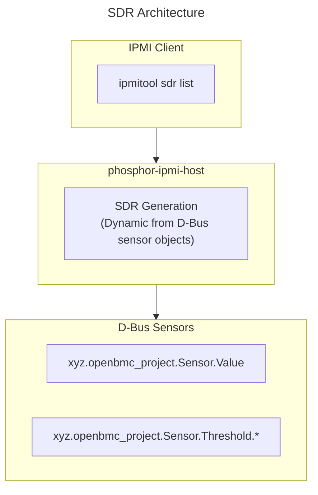

# SDR Guide
{: .no_toc }

Configure Sensor Data Records (SDR) for IPMI sensor management.
{: .fs-6 .fw-300 }

## Table of Contents
{: .no_toc .text-delta }

1. TOC
{:toc}

---

## Overview

**Sensor Data Records (SDR)** describe sensors and their properties for IPMI clients. OpenBMC dynamically generates SDR from D-Bus sensor objects.



<details>
<summary>ASCII-art version (for comparison)</summary>

```
┌─────────────────────────────────────────────────────────────────┐
│                      SDR Architecture                           │
├─────────────────────────────────────────────────────────────────┤
│                                                                 │
│  ┌─────────────────────────────────────────────────────────────┐│
│  │                    IPMI Client                              ││
│  │               (ipmitool sdr list)                           ││
│  └──────────────────────────┬──────────────────────────────────┘│
│                             │                                   │
│  ┌──────────────────────────┴──────────────────────────────────┐│
│  │                   phosphor-ipmi-host                        ││
│  │                                                             ││
│  │   ┌────────────────────────────────────────────────────┐    ││
│  │   │              SDR Generation                        │    ││
│  │   │     (Dynamic from D-Bus sensor objects)            │    ││
│  │   └────────────────────────────────────────────────────┘    ││
│  └──────────────────────────┬──────────────────────────────────┘│
│                             │                                   │
│  ┌──────────────────────────┴──────────────────────────────────┐│
│  │                    D-Bus Sensors                            ││
│  │   xyz.openbmc_project.Sensor.Value                          ││
│  │   xyz.openbmc_project.Sensor.Threshold.*                    ││
│  └─────────────────────────────────────────────────────────────┘│
└─────────────────────────────────────────────────────────────────┘
```

</details>

---

## SDR Record Types

### Type 01h - Full Sensor Record

Complete sensor definition with thresholds and scaling.

| Field | Description |
|-------|-------------|
| Sensor Number | Unique sensor ID |
| Sensor Type | Temperature, Voltage, Fan, etc. |
| Unit Type | Celsius, Volts, RPM, etc. |
| M, B, Exp | Linear conversion factors |
| Thresholds | Upper/Lower critical/non-critical |

### Type 02h - Compact Sensor Record

Abbreviated sensor record for simple sensors.

### Type 11h - FRU Device Locator

Points to FRU data storage.

### Type 12h - Management Controller Locator

Describes management controllers.

---

## Viewing SDR

### ipmitool Commands

```bash
# List all SDR records
ipmitool sdr list

# Get full SDR output
ipmitool sdr list full

# Get SDR by type
ipmitool sdr type Temperature
ipmitool sdr type Voltage
ipmitool sdr type Fan

# Get SDR info
ipmitool sdr info

# Get SDR repository info
ipmitool sdr elist
```

### Example Output

```
CPU_Temp         | 45 degrees C      | ok
Board_Temp       | 32 degrees C      | ok
Fan0             | 5000 RPM          | ok
P12V             | 12.10 Volts       | ok
PSU1_Status      | 0x00              | ok
```

---

## SDR Generation

### Dynamic Generation

OpenBMC generates SDR dynamically from D-Bus:

```cpp
// phosphor-ipmi-host generates SDR from:
// 1. xyz.openbmc_project.Sensor.Value - sensor readings
// 2. xyz.openbmc_project.Sensor.Threshold.* - thresholds
// 3. xyz.openbmc_project.Association.Definitions - relationships
```

### Sensor to SDR Mapping

| D-Bus Property | SDR Field |
|----------------|-----------|
| Value | Current reading |
| Unit | Sensor unit type |
| Scale | M, B, Exp factors |
| MaxValue | Sensor max |
| MinValue | Sensor min |
| CriticalHigh | Upper critical |
| WarningHigh | Upper non-critical |
| CriticalLow | Lower critical |
| WarningLow | Lower non-critical |

---

## Sensor Types

### Common Sensor Types

| Type | Hex | Description |
|------|-----|-------------|
| Temperature | 0x01 | Temperature sensors |
| Voltage | 0x02 | Voltage sensors |
| Current | 0x03 | Current sensors |
| Fan | 0x04 | Fan speed sensors |
| Physical Security | 0x05 | Intrusion sensors |
| Platform Security | 0x06 | Security sensors |
| Processor | 0x07 | CPU sensors |
| Power Supply | 0x08 | PSU sensors |
| Power Unit | 0x09 | Power unit sensors |
| Memory | 0x0C | Memory sensors |
| System Event | 0x12 | System events |
| OEM | 0xC0+ | Vendor-specific |

---

## Configuration

### Entity Manager Sensor Configuration

```json
{
    "Name": "CPU_Temp",
    "Type": "TMP75",
    "Bus": 0,
    "Address": "0x48",
    "Thresholds": [
        {
            "Direction": "greater than",
            "Name": "upper critical",
            "Severity": 1,
            "Value": 95
        },
        {
            "Direction": "greater than",
            "Name": "upper non critical",
            "Severity": 0,
            "Value": 85
        }
    ]
}
```

### IPMI Sensor Configuration

```yaml
# phosphor-ipmi-host sensor configuration
# /usr/share/ipmi-providers/sensor-defs.yaml

0x01:
  sensorType: 0x01
  sensorName: CPU_Temp
  sensorReadingType: 0x01
  entityId: 0x03
  entityInstance: 0x01
```

---

## Threshold Events

### SDR Threshold Support

```
┌─────────────────────────────────────────┐
│              Threshold Events           │
├─────────────────────────────────────────┤
│                                         │
│  Upper Critical  ─────  Deassert/Assert │
│  Upper Non-Crit  ─────  Deassert/Assert │
│  Lower Non-Crit  ─────  Deassert/Assert │
│  Lower Critical  ─────  Deassert/Assert │
│                                         │
└─────────────────────────────────────────┘
```

### Monitor Threshold Events

```bash
# Watch SEL for threshold events
ipmitool sel list

# Example threshold event:
# Sensor CPU_Temp | Upper Critical going high | Asserted
```

---

## Reading Values

### Raw to Display Conversion

```
Display Value = (M × raw + B × 10^Bexp) × 10^Rexp

Where:
  M = Multiplier
  B = Additive offset
  Bexp = B exponent
  Rexp = Result exponent
```

### Example

```
Temperature sensor:
  raw value = 0x2D (45)
  M = 1, B = 0, Bexp = 0, Rexp = 0
  Display = (1 × 45 + 0) × 1 = 45°C
```

---

## Troubleshooting

### SDR Not Showing

```bash
# Check sensor exists in D-Bus
busctl tree xyz.openbmc_project.Sensor

# Check IPMI host daemon
systemctl status phosphor-ipmi-host
journalctl -u phosphor-ipmi-host

# Check sensor has required interfaces
busctl introspect xyz.openbmc_project.HwmonTempSensor \
    /xyz/openbmc_project/sensors/temperature/CPU_Temp
```

### Wrong Readings

```bash
# Compare D-Bus value with IPMI
busctl get-property xyz.openbmc_project.HwmonTempSensor \
    /xyz/openbmc_project/sensors/temperature/CPU_Temp \
    xyz.openbmc_project.Sensor.Value Value

# vs
ipmitool sensor get CPU_Temp

# Check M, B, Exp values match sensor scaling
```

### Missing Thresholds

```bash
# Verify thresholds in D-Bus
busctl introspect xyz.openbmc_project.HwmonTempSensor \
    /xyz/openbmc_project/sensors/temperature/CPU_Temp | grep Threshold

# Check Entity Manager configuration
cat /usr/share/entity-manager/configurations/*.json | jq '.Exposes[] | select(.Name=="CPU_Temp")'
```

---

## D-Bus to SDR

### Query Sensors via D-Bus

```bash
# List all sensors
busctl tree xyz.openbmc_project.Sensor

# Get sensor reading
busctl get-property xyz.openbmc_project.HwmonTempSensor \
    /xyz/openbmc_project/sensors/temperature/CPU_Temp \
    xyz.openbmc_project.Sensor.Value Value

# Get thresholds
busctl get-property xyz.openbmc_project.HwmonTempSensor \
    /xyz/openbmc_project/sensors/temperature/CPU_Temp \
    xyz.openbmc_project.Sensor.Threshold.Critical CriticalHigh
```

---

## Deep Dive
{: .text-delta }

Advanced implementation details for SDR developers.

### SDR Record Type 01h Format (Full Sensor Record)

```
┌────────────────────────────────────────────────────────────────────────────┐
│                    SDR Type 01h - Full Sensor Record                       │
├────────────────────────────────────────────────────────────────────────────┤
│                                                                            │
│  RECORD HEADER (5 bytes)                                                   │
│  ┌─────────────┬─────────────┬─────────────┬─────────────┬─────────────┐   │
│  │ Record ID   │ Record ID   │ SDR Version │ Record Type │Record Length│   │
│  │ LSB         │ MSB         │ (0x51)      │ (0x01)      │ (varies)    │   │
│  └─────────────┴─────────────┴─────────────┴─────────────┴─────────────┘   │
│                                                                            │
│  RECORD KEY BYTES (3 bytes)                                                │
│  ┌─────────────────────────────────────────────────────────────────────┐   │
│  │ Byte 5: Sensor Owner ID (I2C slave addr or software ID)             │   │
│  │ Byte 6: Sensor Owner LUN (bits 1:0), Channel (bits 7:4)             │   │
│  │ Byte 7: Sensor Number (unique within owner)                         │   │
│  └─────────────────────────────────────────────────────────────────────┘   │
│                                                                            │
│  RECORD BODY - Entity & Sensor Information                                 │
│  ┌─────────────────────────────────────────────────────────────────────┐   │
│  │ Byte 8:  Entity ID (processor=0x03, memory=0x20, etc.)              │   │
│  │ Byte 9:  Entity Instance (0x60-0x7F = device-relative)              │   │
│  │ Byte 10: Sensor Initialization                                      │   │
│  │          [7] Sensor Init Scanning enabled                           │   │
│  │          [6] Sensor Init Event generation enabled                   │   │
│  │          [5] Sensor Init Thresholds accessible                      │   │
│  │          [4] Sensor Init Hysteresis accessible                      │   │
│  │          [3] Sensor Init Type accessible                            │   │
│  │          [2] Sensor Init Event msg ctrl accessible                  │   │
│  │          [1] Sensor Init Settle time required                       │   │
│  │ Byte 11: Sensor Capabilities                                        │   │
│  │          [7:6] Event message control support                        │   │
│  │          [5:4] Threshold access support                             │   │
│  │          [3:2] Hysteresis support                                   │   │
│  │          [1] Auto re-arm support                                    │   │
│  │          [0] Ignore sensor if entity not present                    │   │
│  └─────────────────────────────────────────────────────────────────────┘   │
│                                                                            │
│  SENSOR TYPE & READING TYPE                                                │
│  ┌─────────────────────────────────────────────────────────────────────┐   │
│  │ Byte 12: Sensor Type (Temperature=0x01, Voltage=0x02, etc.)         │   │
│  │ Byte 13: Event/Reading Type Code                                    │   │
│  │          0x01 = Threshold-based                                     │   │
│  │          0x6F = Sensor-specific discrete                            │   │
│  └─────────────────────────────────────────────────────────────────────┘   │
│                                                                            │
│  READING FACTORS & LINEARIZATION (for threshold sensors)                   │
│  ┌─────────────────────────────────────────────────────────────────────┐   │
│  │ Byte 21: M (LSB of multiplier)                                      │   │
│  │ Byte 22: M (MSB 2 bits) + Tolerance (6 bits)                        │   │
│  │ Byte 23: B (LSB of offset)                                          │   │
│  │ Byte 24: B (MSB 2 bits) + Accuracy (6 bits LSB)                     │   │
│  │ Byte 25: Accuracy (4 bits MSB) + Accuracy Exp (2 bits)              │   │
│  │ Byte 26: R Exp (4 bits) + B Exp (4 bits) - signed                   │   │
│  │                                                                     │   │
│  │ Formula: y = (M × raw + B × 10^Bexp) × 10^Rexp                      │   │
│  │                                                                     │   │
│  │ Example: Temperature sensor, raw=0x50 (80)                          │   │
│  │   M=1, B=0, Bexp=0, Rexp=0                                          │   │
│  │   y = (1 × 80 + 0) × 1 = 80°C                                       │   │
│  │                                                                     │   │
│  │ Example: Voltage sensor 12V rail, raw=0x78 (120)                    │   │
│  │   M=100, B=0, Bexp=0, Rexp=-3                                       │   │
│  │   y = (100 × 120 + 0) × 0.001 = 12.0V                               │   │
│  └─────────────────────────────────────────────────────────────────────┘   │
│                                                                            │
│  THRESHOLDS                                                                │
│  ┌─────────────────────────────────────────────────────────────────────┐   │
│  │ Byte 36: Upper Non-Recoverable threshold (raw value)                │   │
│  │ Byte 37: Upper Critical threshold                                   │   │
│  │ Byte 38: Upper Non-Critical threshold                               │   │
│  │ Byte 39: Lower Non-Recoverable threshold                            │   │
│  │ Byte 40: Lower Critical threshold                                   │   │
│  │ Byte 41: Lower Non-Critical threshold                               │   │
│  │ Byte 42: Positive-going Threshold Hysteresis                        │   │
│  │ Byte 43: Negative-going Threshold Hysteresis                        │   │
│  └─────────────────────────────────────────────────────────────────────┘   │
│                                                                            │
│  SENSOR ID STRING (variable length)                                        │
│  ┌─────────────────────────────────────────────────────────────────────┐   │
│  │ Byte 47: ID String Type/Length                                      │   │
│  │          [7:6] = 11 binary (8-bit ASCII + Latin 1)                  │   │
│  │          [4:0] = length (0-31 characters)                           │   │
│  │ Bytes 48+: ID String data (e.g., "CPU_Temp")                        │   │
│  └─────────────────────────────────────────────────────────────────────┘   │
│                                                                            │
└────────────────────────────────────────────────────────────────────────────┘
```

### D-Bus to SDR Mapping

```
┌────────────────────────────────────────────────────────────────────────────┐
│                     D-Bus Sensor to SDR Translation                        │
├────────────────────────────────────────────────────────────────────────────┤
│                                                                            │
│  D-BUS SENSOR OBJECT                                                       │
│  ───────────────────                                                       │
│                                                                            │
│  Path: /xyz/openbmc_project/sensors/temperature/CPU_Temp                   │
│                                                                            │
│  Interfaces:                                                               │
│  ┌─────────────────────────────────────────────────────────────────────┐   │
│  │ xyz.openbmc_project.Sensor.Value                                    │   │
│  │   ├── Value: 45.0 (double)              → SDR raw reading           │   │
│  │   ├── Unit: "xyz...Unit.DegreesC"       → SDR unit type             │   │
│  │   ├── Scale: 0 (int64)                  → SDR R exponent            │   │
│  │   ├── MaxValue: 127.0                   → SDR nominal max           │   │
│  │   └── MinValue: -40.0                   → SDR nominal min           │   │
│  │                                                                     │   │
│  │ xyz.openbmc_project.Sensor.Threshold.Critical                       │   │
│  │   ├── CriticalHigh: 95.0                → SDR Upper Critical        │   │
│  │   ├── CriticalLow: -20.0                → SDR Lower Critical        │   │
│  │   ├── CriticalAlarmHigh: false          → Threshold event state     │   │
│  │   └── CriticalAlarmLow: false           → Threshold event state     │   │
│  │                                                                     │   │
│  │ xyz.openbmc_project.Sensor.Threshold.Warning                        │   │
│  │   ├── WarningHigh: 85.0                 → SDR Upper Non-Critical    │   │
│  │   ├── WarningLow: 0.0                   → SDR Lower Non-Critical    │   │
│  │   ├── WarningAlarmHigh: false           → Threshold event state     │   │
│  │   └── WarningAlarmLow: false            → Threshold event state     │   │
│  └─────────────────────────────────────────────────────────────────────┘   │
│                                                                            │
│  SDR GENERATION ALGORITHM (phosphor-ipmi-host):                            │
│  ──────────────────────────────────────────────                            │
│                                                                            │
│  1. ENUMERATE D-BUS SENSORS                                                │
│     ┌─────────────────────────────────────────────────────────────────┐    │
│     │ // Query ObjectMapper for all sensors                           │    │
│     │ busctl call xyz.openbmc_project.ObjectMapper                    │    │
│     │   /xyz/openbmc_project/object_mapper                            │    │
│     │   xyz.openbmc_project.ObjectMapper GetSubTree                   │    │
│     │   sias "/xyz/openbmc_project/sensors" 0 1                       │    │
│     │   "xyz.openbmc_project.Sensor.Value"                            │    │
│     └─────────────────────────────────────────────────────────────────┘    │
│                                                                            │
│  2. CALCULATE M, B, R_EXP FOR EACH SENSOR                                  │
│     ┌─────────────────────────────────────────────────────────────────┐    │
│     │ // Determine scaling from MinValue to MaxValue                  │    │
│     │ // Raw values 0-255 must map to display range                   │    │
│     │                                                                 │    │
│     │ double range = maxValue - minValue;  // e.g., 127 - (-40) = 167 │    │
│     │ double M = range / 255.0;            // e.g., 0.655             │    │
│     │ double B = minValue;                 // e.g., -40               │    │
│     │                                                                 │    │
│     │ // Quantize M and B to SDR format (10-bit signed)               │    │
│     │ int16_t M_sdr = (int16_t)(M * scaleFactor);                     │    │
│     │ int16_t B_sdr = (int16_t)(B * scaleFactor);                     │    │
│     │ int8_t R_exp = calculateExponent(range);                        │    │
│     │ int8_t B_exp = calculateExponent(B);                            │    │
│     └─────────────────────────────────────────────────────────────────┘    │
│                                                                            │
│  3. CONVERT THRESHOLDS TO RAW VALUES                                       │
│     ┌─────────────────────────────────────────────────────────────────┐    │
│     │ // Reverse the display→raw formula                              │    │
│     │ // raw = (display - B × 10^Bexp) / (M × 10^Rexp)                │    │
│     │                                                                 │    │
│     │ uint8_t upperCritRaw = (uint8_t)((criticalHigh - B) / M);       │    │
│     │ uint8_t upperWarnRaw = (uint8_t)((warningHigh - B) / M);        │    │
│     │ // etc.                                                         │    │
│     └─────────────────────────────────────────────────────────────────┘    │
│                                                                            │
│  4. ASSIGN SENSOR NUMBER                                                   │
│     ┌─────────────────────────────────────────────────────────────────┐    │
│     │ // Sensor numbers assigned sequentially or from config          │    │
│     │ // Must be unique per sensor owner                              │    │
│     │                                                                 │    │
│     │ static uint8_t nextSensorNum = 0x01;                            │    │
│     │ sdrRecord.sensorNumber = nextSensorNum++;                       │    │
│     │                                                                 │    │
│     │ // Or lookup from YAML/JSON configuration                       │    │
│     │ sdrRecord.sensorNumber = sensorConfig[sensorName].number;       │    │
│     └─────────────────────────────────────────────────────────────────┘    │
│                                                                            │
│  5. BUILD SDR RECORD                                                       │
│     ┌─────────────────────────────────────────────────────────────────┐    │
│     │ FullSensorRecord sdr = {};                                      │    │
│     │ sdr.recordType = 0x01;                                          │    │
│     │ sdr.sensorNumber = sensorNum;                                   │    │
│     │ sdr.entityId = getEntityId(sensorPath);  // 0x03 for CPU        │    │
│     │ sdr.sensorType = getSensorType(unit);    // 0x01 for temp       │    │
│     │ sdr.eventReadingType = 0x01;             // Threshold           │    │
│     │ sdr.M = M_sdr;                                                  │    │
│     │ sdr.B = B_sdr;                                                  │    │
│     │ sdr.Rexp = R_exp;                                               │    │
│     │ sdr.Bexp = B_exp;                                               │    │
│     │ sdr.upperCritical = upperCritRaw;                               │    │
│     │ sdr.upperNonCritical = upperWarnRaw;                            │    │
│     │ // ... set other fields                                         │    │
│     │ strncpy(sdr.idString, sensorName, 16);                          │    │
│     └─────────────────────────────────────────────────────────────────┘    │
│                                                                            │
└────────────────────────────────────────────────────────────────────────────┘
```

### SDR Repository Commands

```
┌────────────────────────────────────────────────────────────────────────────┐
│                        SDR Repository IPMI Commands                        │
├────────────────────────────────────────────────────────────────────────────┤
│                                                                            │
│  GET SDR REPOSITORY INFO (0x20)                                            │
│  ──────────────────────────────                                            │
│                                                                            │
│  Response:                                                                 │
│  ┌─────────────┬──────────────────────────────────────────────────────┐    │
│  │ Byte        │ Description                                          │    │
│  ├─────────────┼──────────────────────────────────────────────────────┤    │
│  │ 1           │ Completion code                                      │    │
│  │ 2           │ SDR version (0x51 = IPMI 2.0)                        │    │
│  │ 3-4         │ Record count (LSB first)                             │    │
│  │ 5-6         │ Free space (0xFFFF = unspecified)                    │    │
│  │ 7-10        │ Most recent addition timestamp                       │    │
│  │ 11-14       │ Most recent erase timestamp                          │    │
│  │ 15          │ Operation support                                    │    │
│  │             │   [7] Overflow flag                                  │    │
│  │             │   [5] Modal SDR update support                       │    │
│  │             │   [4] Non-modal SDR update support                   │    │
│  │             │   [3] Delete SDR command supported                   │    │
│  │             │   [2] Partial Add SDR command supported              │    │
│  │             │   [1] Reserve SDR Repository supported               │    │
│  │             │   [0] Get SDR Allocation Info supported              │    │
│  └─────────────┴──────────────────────────────────────────────────────┘    │
│                                                                            │
│  RESERVE SDR REPOSITORY (0x22)                                             │
│  ─────────────────────────────                                             │
│                                                                            │
│  Request: (empty)                                                          │
│  Response: 2-byte reservation ID (used for subsequent Get SDR)             │
│                                                                            │
│  GET SDR (0x23)                                                            │
│  ──────────────                                                            │
│                                                                            │
│  Request:                                                                  │
│  ┌─────────────┬──────────────────────────────────────────────────────┐    │
│  │ Byte 1-2    │ Reservation ID (from Reserve SDR Repository)         │    │
│  │ Byte 3-4    │ Record ID (0x0000 = first, 0xFFFF = last)            │    │
│  │ Byte 5      │ Offset into record                                   │    │
│  │ Byte 6      │ Bytes to read (0xFF = entire record)                 │    │
│  └─────────────┴──────────────────────────────────────────────────────┘    │
│                                                                            │
│  Response:                                                                 │
│  ┌─────────────┬──────────────────────────────────────────────────────┐    │
│  │ Byte 1      │ Completion code                                      │    │
│  │ Byte 2-3    │ Next Record ID (0xFFFF = end of repository)          │    │
│  │ Byte 4+     │ SDR record data                                      │    │
│  └─────────────┴──────────────────────────────────────────────────────┘    │
│                                                                            │
│  ITERATION EXAMPLE (ipmitool sdr list):                                    │
│  ─────────────────────────────────────                                     │
│                                                                            │
│  1. Reserve SDR Repository → get reservation ID 0x1234                     │
│  2. Get SDR (res=0x1234, rec=0x0000, offset=0, len=0xFF)                   │
│     → Record data, Next ID = 0x0001                                        │
│  3. Get SDR (res=0x1234, rec=0x0001, offset=0, len=0xFF)                   │
│     → Record data, Next ID = 0x0002                                        │
│  4. ... repeat until Next ID = 0xFFFF ...                                  │
│                                                                            │
└────────────────────────────────────────────────────────────────────────────┘
```

### Source Code Reference

Key implementation files in [phosphor-host-ipmid](https://github.com/openbmc/phosphor-host-ipmid):

| File | Description |
|------|-------------|
| `sensorhandler.cpp` | Sensor reading command handlers (Get Sensor Reading, etc.) |
| `sensorcommands.cpp` | SDR-related commands (Get SDR, Reserve SDR Repository) |
| `sensordatahandler.cpp` | D-Bus to SDR data translation |
| `types.hpp` | SDR structure definitions |
| `scripts/sensor-gen.py` | Static SDR generation from YAML configuration |

---

## References

- [IPMI Specification](https://www.intel.com/content/dam/www/public/us/en/documents/product-briefs/ipmi-second-gen-interface-spec-v2-rev1-1.pdf)
- [phosphor-host-ipmid](https://github.com/openbmc/phosphor-host-ipmid) - D-Bus based IPMI daemon for host commands
- [phosphor-net-ipmid](https://github.com/openbmc/phosphor-net-ipmid) - Network IPMI server

---

{: .note }
**Tested on**: OpenBMC master, QEMU romulus
