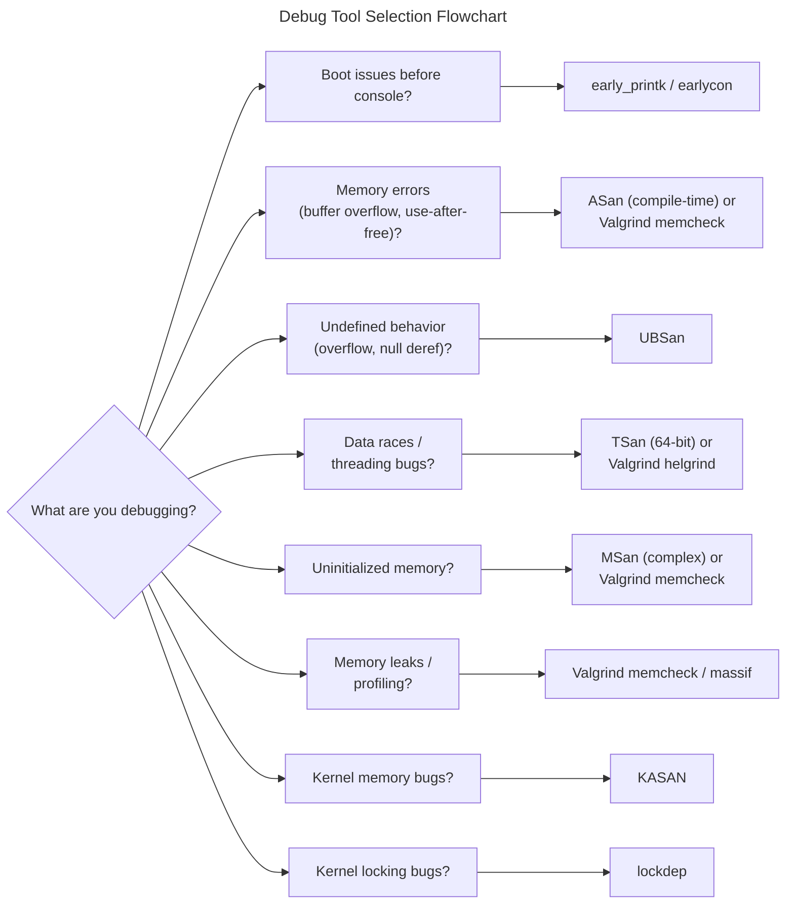

# Linux Debug Tools Guide
{: .no_toc }

Configure and use Linux kernel and application debugging tools for OpenBMC development.
{: .fs-6 .fw-300 }

## Table of Contents
{: .no_toc .text-delta }

1. TOC
{:toc}

---

## Overview

OpenBMC development requires debugging at multiple levels—from early kernel boot to application runtime. This guide covers essential Linux debugging tools including sanitizers, Valgrind, and kernel debug options.

### Tool Selection Guide



<details markdown="1">
<summary>ASCII-art version (for comparison)</summary>

```
+-------------------------------------------------------------------------+
|                    Debug Tool Selection Flowchart                       |
+-------------------------------------------------------------------------+
|                                                                         |
|   What are you debugging?                                               |
|         |                                                               |
|         +---> Boot issues before console?                               |
|         |         |                                                     |
|         |         +--> early_printk / earlycon                          |
|         |                                                               |
|         +---> Memory errors (buffer overflow, use-after-free)?          |
|         |         |                                                     |
|         |         +--> ASan (compile-time) or Valgrind memcheck         |
|         |                                                               |
|         +---> Undefined behavior (overflow, null deref)?                |
|         |         |                                                     |
|         |         +--> UBSan                                            |
|         |                                                               |
|         +---> Data races / threading bugs?                              |
|         |         |                                                     |
|         |         +--> TSan (64-bit) or Valgrind helgrind               |
|         |                                                               |
|         +---> Uninitialized memory?                                     |
|         |         |                                                     |
|         |         +--> MSan (complex) or Valgrind memcheck              |
|         |                                                               |
|         +---> Memory leaks / profiling?                                 |
|         |         |                                                     |
|         |         +--> Valgrind memcheck / massif                       |
|         |                                                               |
|         +---> Kernel memory bugs?                                       |
|         |         |                                                     |
|         |         +--> KASAN                                            |
|         |                                                               |
|         +---> Kernel locking bugs?                                      |
|                   |                                                     |
|                   +--> lockdep                                          |
+-------------------------------------------------------------------------+
```

</details>

### Tool Comparison

| Tool | Detects | Overhead | Compatibility |
|------|---------|----------|---------------|
| **ASan** | Memory errors | 2x slowdown, 2-3x memory | Incompatible with TSan, MSan |
| **UBSan** | Undefined behavior | 1.2x slowdown | Compatible with ASan |
| **TSan** | Data races | 5-15x slowdown | 64-bit only, incompatible with ASan |
| **MSan** | Uninitialized memory | 3x slowdown | Requires full instrumentation |
| **Valgrind** | Memory, threads, cache | 10-50x slowdown | No recompilation needed |
| **KASAN** | Kernel memory errors | 1.5-3x slowdown | Kernel only |
| **KCSAN** | Kernel data races | 2-5x slowdown | Kernel only |

---

## Early Boot Debugging

When the BMC fails to boot before the normal console is available, `early_printk` and `earlycon` provide debug output directly to the serial port.

### Kernel Configuration

```kconfig
# Enable early printk support
CONFIG_EARLY_PRINTK=y

# ARM-specific low-level debug
CONFIG_DEBUG_LL=y
CONFIG_DEBUG_LL_UART_NONE=n

# For ASPEED BMC (AST2500/AST2600)
CONFIG_DEBUG_UART_PHYS=0x1e784000
CONFIG_DEBUG_UART_VIRT=0xf8784000
CONFIG_DEBUG_UART_8250_SHIFT=2
```

### Command Line Options

#### ARM (ASPEED BMC)

```bash
# AST2500/AST2600 UART5 (typical BMC debug port)
earlycon=uart8250,mmio32,0x1e784000,115200n8

# With explicit flow control disabled
earlycon=uart8250,mmio32,0x1e784000,115200n8 console=ttyS4,115200
```

#### x86 (QEMU)

```bash
# Standard COM1
earlycon=uart8250,io,0x3f8,115200n8

# Memory-mapped UART
earlycon=uart,mmio32,0xfe034000,115200n8
```

### Yocto Configuration

```bitbake
# In your machine .conf file

# Add earlycon to kernel command line
KERNEL_EXTRA_ARGS:append = " earlycon=uart8250,mmio32,0x1e784000,115200n8"

# Or in APPEND for QEMU machines
APPEND += "earlycon=uart8250,io,0x3f8"
```

### Kernel Config Fragment

Create a kernel config fragment for debug builds:

```bash
# meta-mylayer/recipes-kernel/linux/files/debug.cfg
CONFIG_EARLY_PRINTK=y
CONFIG_DEBUG_LL=y
CONFIG_DEBUG_INFO=y
CONFIG_PRINTK_TIME=y
CONFIG_DYNAMIC_DEBUG=y
```

```bitbake
# In linux-aspeed_%.bbappend
SRC_URI += "file://debug.cfg"
```

### Troubleshooting Early Boot

```bash
# If earlycon output stops, check:
# 1. UART address matches your SoC
# 2. Baud rate matches your terminal
# 3. Console= parameter takes over after earlycon

# Enable kernel messages timing
printk.time=1

# Increase kernel log verbosity
loglevel=8 debug
```

---

## AddressSanitizer (ASan)

ASan detects memory errors at runtime with relatively low overhead. It's the recommended first tool for debugging memory corruption.

### What ASan Detects

| Bug Type | Example |
|----------|---------|
| Heap buffer overflow | Reading/writing past malloc'd buffer |
| Stack buffer overflow | Array out-of-bounds on stack |
| Global buffer overflow | Out-of-bounds on global arrays |
| Use-after-free | Accessing freed memory |
| Use-after-return | Accessing stack memory after return |
| Use-after-scope | Accessing out-of-scope stack variable |
| Double-free | Freeing already freed memory |
| Memory leaks | Unreachable allocated memory (via LeakSanitizer) |

### Yocto Build Configuration

#### Global ASan Build

```bitbake
# In local.conf - enable ASan for all packages (not recommended for production)
CFLAGS:append = " -fsanitize=address -fno-omit-frame-pointer -g"
CXXFLAGS:append = " -fsanitize=address -fno-omit-frame-pointer -g"
LDFLAGS:append = " -fsanitize=address"
```

#### Per-Recipe ASan (Recommended)

```bitbake
# In a .bbappend file for the target recipe
# e.g., phosphor-logging_%.bbappend

CFLAGS:append = " -fsanitize=address -fno-omit-frame-pointer"
CXXFLAGS:append = " -fsanitize=address -fno-omit-frame-pointer"
LDFLAGS:append = " -fsanitize=address"

# Ensure debug symbols
DEBUG_BUILD = "1"
```

#### Meson-Based Recipes

```bitbake
# For meson-based recipes (bmcweb, phosphor-dbus-interfaces, etc.)
EXTRA_OEMESON:append:pn-bmcweb = " -Db_sanitize=address"
EXTRA_OEMESON:append:pn-phosphor-logging = " -Db_sanitize=address"
```

#### CMake-Based Recipes

```bitbake
# For CMake-based recipes
EXTRA_OECMAKE:append:pn-sdbusplus = " \
    -DCMAKE_C_FLAGS='-fsanitize=address -fno-omit-frame-pointer' \
    -DCMAKE_CXX_FLAGS='-fsanitize=address -fno-omit-frame-pointer' \
"
```

### Runtime Configuration

```bash
# Basic ASan options
export ASAN_OPTIONS="detect_leaks=1:halt_on_error=0:log_path=/tmp/asan"

# Full options for debugging
export ASAN_OPTIONS="\
detect_leaks=1:\
halt_on_error=0:\
log_path=/tmp/asan:\
symbolize=1:\
print_stats=1:\
check_initialization_order=1:\
detect_stack_use_after_return=1:\
strict_string_checks=1:\
detect_invalid_pointer_pairs=2"

# For better stack traces
export ASAN_OPTIONS="$ASAN_OPTIONS:fast_unwind_on_malloc=0"

# Use suppressions file
export ASAN_OPTIONS="$ASAN_OPTIONS:suppressions=/etc/asan.supp"
```

### systemd Service Configuration

```ini
# /etc/systemd/system/phosphor-logging.service.d/asan.conf
[Service]
Environment="ASAN_OPTIONS=detect_leaks=1:halt_on_error=0:log_path=/tmp/asan-logging"
```

### Interpreting ASan Reports

```
==12345==ERROR: AddressSanitizer: heap-buffer-overflow on address 0x602000000014
READ of size 4 at 0x602000000014 thread T0
    #0 0x4c3b5f in process_buffer /src/handler.cpp:45
    #1 0x4c2a12 in handle_request /src/handler.cpp:123
    #2 0x4c1234 in main /src/main.cpp:67
    #3 0x7f... in __libc_start_main

0x602000000014 is located 0 bytes to the right of 20-byte region [0x602000000000,0x602000000014)
allocated by thread T0 here:
    #0 0x493d2f in malloc
    #1 0x4c3a11 in allocate_buffer /src/handler.cpp:30
    #2 0x4c29f3 in handle_request /src/handler.cpp:120

SUMMARY: AddressSanitizer: heap-buffer-overflow /src/handler.cpp:45 in process_buffer
```

**Reading the report:**
1. **Error type**: `heap-buffer-overflow`
2. **Access type**: `READ of size 4`
3. **Location**: Stack trace shows `process_buffer` at line 45
4. **Memory info**: Accessing byte 20 of a 20-byte allocation (off by one)
5. **Allocation**: Shows where the buffer was allocated

### Common ASan Issues

```bash
# Issue: ASan not finding symbols
# Solution: Ensure debug symbols and symbolizer
export ASAN_SYMBOLIZER_PATH=/usr/bin/llvm-symbolizer

# Issue: False positives with system libraries
# Solution: Use suppressions
echo "leak:libglib" >> /etc/asan.supp

# Issue: Out of memory with ASan
# Solution: Increase virtual memory or reduce shadow scale
export ASAN_OPTIONS="quarantine_size_mb=64:malloc_context_size=10"
```

---

## UndefinedBehaviorSanitizer (UBSan)

UBSan detects undefined behavior that can cause subtle, hard-to-reproduce bugs.

### What UBSan Detects

| Check | Flag | Description |
|-------|------|-------------|
| Alignment | `-fsanitize=alignment` | Misaligned pointer dereference |
| Bool | `-fsanitize=bool` | Loading invalid bool value |
| Bounds | `-fsanitize=bounds` | Array index out of bounds |
| Enum | `-fsanitize=enum` | Invalid enum value |
| Float-cast-overflow | `-fsanitize=float-cast-overflow` | Float to int overflow |
| Float-divide-by-zero | `-fsanitize=float-divide-by-zero` | Floating-point division by zero |
| Integer-divide-by-zero | `-fsanitize=integer-divide-by-zero` | Integer division by zero |
| Null | `-fsanitize=null` | Null pointer dereference |
| Object-size | `-fsanitize=object-size` | Memory access exceeds object size |
| Pointer-overflow | `-fsanitize=pointer-overflow` | Pointer arithmetic overflow |
| Return | `-fsanitize=return` | Missing return in non-void function |
| Shift | `-fsanitize=shift` | Shift by negative or too large amount |
| Signed-integer-overflow | `-fsanitize=signed-integer-overflow` | Signed integer overflow |
| Unreachable | `-fsanitize=unreachable` | Reaching __builtin_unreachable() |
| VLA-bound | `-fsanitize=vla-bound` | Negative VLA size |
| Vptr | `-fsanitize=vptr` | Invalid virtual function call |

### Yocto Configuration

```bitbake
# Enable all UBSan checks
CFLAGS:append:pn-target = " -fsanitize=undefined -fno-sanitize-recover=all"
CXXFLAGS:append:pn-target = " -fsanitize=undefined -fno-sanitize-recover=all"

# Meson-based recipes
EXTRA_OEMESON:append:pn-target = " -Db_sanitize=undefined"

# Combined ASan + UBSan (recommended)
EXTRA_OEMESON:append:pn-bmcweb = " -Db_sanitize=address,undefined"
```

### Selective Checks

```bitbake
# Enable only specific checks (faster, less noise)
CFLAGS:append = " -fsanitize=signed-integer-overflow,null,bounds"

# Disable specific checks
CFLAGS:append = " -fsanitize=undefined -fno-sanitize=vptr"
```

### Runtime Options

```bash
# Print stack traces for UBSan errors
export UBSAN_OPTIONS="print_stacktrace=1"

# Halt on first error (useful for debugging)
export UBSAN_OPTIONS="print_stacktrace=1:halt_on_error=1"

# Log to file
export UBSAN_OPTIONS="print_stacktrace=1:log_path=/tmp/ubsan"

# Use suppressions
export UBSAN_OPTIONS="suppressions=/etc/ubsan.supp"
```

### Example UBSan Report

```
/src/calculation.cpp:42:15: runtime error: signed integer overflow:
2147483647 + 1 cannot be represented in type 'int'
    #0 0x4a2b3f in calculate /src/calculation.cpp:42
    #1 0x4a1234 in process /src/process.cpp:88
    #2 0x4a0567 in main /src/main.cpp:23

SUMMARY: UndefinedBehaviorSanitizer: signed-integer-overflow /src/calculation.cpp:42
```

---

## ThreadSanitizer (TSan)

TSan detects data races and other threading bugs. It requires 64-bit builds and is incompatible with ASan.

### Requirements

- **64-bit architecture only** (x86_64, aarch64)
- **Incompatible with ASan/MSan** - use one at a time
- **Higher overhead** than ASan (5-15x slowdown, 5-10x memory)

### What TSan Detects

| Bug Type | Description |
|----------|-------------|
| Data races | Concurrent unsynchronized access to shared memory |
| Lock order violations | Potential deadlocks from inconsistent lock ordering |
| Thread leaks | Threads not joined before program exit |
| Destroying locked mutex | Mutex destroyed while still held |
| Use of invalid mutex | Operations on uninitialized/destroyed mutex |
| Signal-unsafe functions | Calling non-async-signal-safe functions in handlers |

### Yocto Configuration

```bitbake
# TSan requires 64-bit build
MACHINE = "qemux86-64"

# Per-recipe TSan
CFLAGS:append:pn-target = " -fsanitize=thread -fPIE"
CXXFLAGS:append:pn-target = " -fsanitize=thread -fPIE"
LDFLAGS:append:pn-target = " -fsanitize=thread -pie"

# Meson-based
EXTRA_OEMESON:append:pn-target = " -Db_sanitize=thread"
```

### Runtime Options

```bash
# Basic TSan options
export TSAN_OPTIONS="history_size=7:second_deadlock_stack=1"

# Detailed output
export TSAN_OPTIONS="\
history_size=7:\
second_deadlock_stack=1:\
print_suppressions=1:\
report_bugs=1:\
log_path=/tmp/tsan"

# Suppressions
export TSAN_OPTIONS="suppressions=/etc/tsan.supp"
```

### Suppression File Format

```
# /etc/tsan.supp

# Suppress races in third-party library
race:libthirdparty.so

# Suppress specific function
race:known_benign_race_function

# Suppress by source file
race:legacy_module.cpp

# Suppress deadlock warnings for intentional lock order
deadlock:custom_lock_hierarchy

# Suppress thread leak for daemon threads
thread:background_worker_thread
```

### Example TSan Report

```
==================
WARNING: ThreadSanitizer: data race (pid=12345)
  Write of size 4 at 0x7f8b12345678 by thread T2:
    #0 increment_counter /src/counter.cpp:15
    #1 worker_thread /src/worker.cpp:45

  Previous read of size 4 at 0x7f8b12345678 by thread T1:
    #0 get_counter /src/counter.cpp:20
    #1 monitor_thread /src/monitor.cpp:30

  Location is global 'g_counter' of size 4 at 0x7f8b12345678

  Thread T2 (tid=12347, running) created by main thread at:
    #0 pthread_create
    #1 start_worker /src/main.cpp:50

  Thread T1 (tid=12346, running) created by main thread at:
    #0 pthread_create
    #1 start_monitor /src/main.cpp:48

SUMMARY: ThreadSanitizer: data race /src/counter.cpp:15 in increment_counter
==================
```

---

## MemorySanitizer (MSan)

MSan detects use of uninitialized memory. It's powerful but requires special build setup.

### What MSan Detects

- Reading uninitialized stack memory
- Reading uninitialized heap memory
- Passing uninitialized values to functions
- Using uninitialized values in conditionals
- Copying uninitialized memory

### Limitations

{: .warning }
MSan requires **all code** including libraries to be MSan-instrumented. This makes it impractical for full OpenBMC builds but useful for isolated component testing.

| Limitation | Impact |
|------------|--------|
| Full instrumentation required | All libraries must be rebuilt with MSan |
| Incompatible with ASan/TSan | Cannot combine with other sanitizers |
| High complexity | Requires custom toolchain setup |
| False positives | Uninstrumented code causes false reports |

### Basic Configuration

```bitbake
# Only practical for specific isolated testing
CFLAGS:append:pn-target = " -fsanitize=memory -fPIE -fno-omit-frame-pointer"
CXXFLAGS:append:pn-target = " -fsanitize=memory -fPIE -fno-omit-frame-pointer"
LDFLAGS:append:pn-target = " -fsanitize=memory -pie"
```

### When to Use MSan

- Testing isolated components with no external dependencies
- Debugging specific uninitialized memory bugs
- Running in controlled test environments with MSan-instrumented libc

### Alternative: Valgrind

For detecting uninitialized memory in real OpenBMC environments, use **Valgrind memcheck** with `--track-origins=yes` instead of MSan.

---

## Valgrind

Valgrind is a runtime instrumentation framework that doesn't require recompilation. It's slower but works with any binary.

### Tool Suite

| Tool | Purpose | Use Case |
|------|---------|----------|
| **memcheck** | Memory error detection | Leaks, invalid access, uninitialized |
| **cachegrind** | Cache profiling | Performance optimization |
| **callgrind** | Call graph profiling | Hotspot analysis |
| **helgrind** | POSIX thread errors | Data races without TSan |
| **drd** | Thread error detection | Alternative to helgrind |
| **massif** | Heap profiler | Memory usage analysis |

### Yocto Configuration

```bitbake
# Add Valgrind to image
IMAGE_INSTALL:append = " valgrind"

# Enable debug symbols for better output
DEBUG_BUILD = "1"
EXTRA_IMAGE_FEATURES += "dbg-pkgs"

# Include debug info packages
IMAGE_INSTALL:append = " valgrind-dbg"
```

### Memcheck (Memory Errors)

```bash
# Basic memory check
valgrind --tool=memcheck /usr/bin/phosphor-logging

# Full leak check with origins
valgrind --tool=memcheck \
    --leak-check=full \
    --show-leak-kinds=all \
    --track-origins=yes \
    --log-file=/tmp/valgrind-memcheck.log \
    /usr/bin/phosphor-logging

# Check child processes too
valgrind --tool=memcheck \
    --trace-children=yes \
    --leak-check=full \
    /usr/bin/entity-manager

# Generate suppressions for known issues
valgrind --tool=memcheck \
    --gen-suppressions=all \
    --log-file=/tmp/valgrind-supp.log \
    /usr/bin/bmcweb
```

### Memcheck Output

```
==12345== Memcheck, a memory error detector
==12345== Invalid read of size 4
==12345==    at 0x4C2B1A: process_data (handler.cpp:42)
==12345==    by 0x4C1234: main (main.cpp:15)
==12345==  Address 0x5204044 is 0 bytes after a block of size 20 alloc'd
==12345==    at 0x4A2B6CD: malloc (vg_replace_malloc.c:381)
==12345==    by 0x4C2A11: allocate_buffer (handler.cpp:30)

==12345== LEAK SUMMARY:
==12345==    definitely lost: 48 bytes in 2 blocks
==12345==    indirectly lost: 0 bytes in 0 blocks
==12345==      possibly lost: 120 bytes in 4 blocks
==12345==    still reachable: 1,024 bytes in 10 blocks
==12345==         suppressed: 0 bytes in 0 blocks
```

### Cachegrind (Cache Profiling)

```bash
# Profile cache behavior
valgrind --tool=cachegrind \
    --cachegrind-out-file=/tmp/cachegrind.out \
    /usr/bin/bmcweb &

# Let it run, then stop and analyze
cg_annotate /tmp/cachegrind.out

# Compare two runs
cg_diff /tmp/cachegrind.out.1 /tmp/cachegrind.out.2
```

### Callgrind (Call Graph)

```bash
# Generate call graph data
valgrind --tool=callgrind \
    --callgrind-out-file=/tmp/callgrind.out \
    /usr/bin/ipmid &

# Run for a while, then analyze
callgrind_annotate /tmp/callgrind.out

# Visualize with KCachegrind (on host)
# Copy callgrind.out to host and open with kcachegrind
```

### Helgrind (Thread Errors)

```bash
# Check for data races and lock issues
valgrind --tool=helgrind \
    --log-file=/tmp/helgrind.log \
    /usr/bin/phosphor-state-manager

# Include lock order information
valgrind --tool=helgrind \
    --track-lockorders=yes \
    --history-level=full \
    /usr/bin/phosphor-state-manager
```

### DRD (Data Race Detector)

```bash
# Alternative to helgrind
valgrind --tool=drd \
    --log-file=/tmp/drd.log \
    /usr/bin/phosphor-state-manager

# With specific options
valgrind --tool=drd \
    --check-stack-var=yes \
    --trace-barrier=yes \
    /usr/bin/phosphor-state-manager
```

### Massif (Heap Profiler)

```bash
# Profile heap usage over time
valgrind --tool=massif \
    --massif-out-file=/tmp/massif.out \
    --time-unit=B \
    /usr/bin/entity-manager &

# Analyze results
ms_print /tmp/massif.out
```

### Suppression File

```
# /etc/valgrind.supp

# Suppress known leaks in glib
{
   glib_type_init_leak
   Memcheck:Leak
   match-leak-kinds: possible
   fun:calloc
   ...
   fun:g_type_init*
}

# Suppress false positive in dbus
{
   dbus_connection_leak
   Memcheck:Leak
   match-leak-kinds: reachable
   fun:malloc
   ...
   fun:dbus_connection_open*
}

# Suppress systemd internal allocations
{
   systemd_internal
   Memcheck:Leak
   match-leak-kinds: reachable
   ...
   obj:/lib/libsystemd.so*
}
```

```bash
# Use suppression file
valgrind --suppressions=/etc/valgrind.supp \
    --tool=memcheck \
    /usr/bin/bmcweb
```

### Running OpenBMC Services

```bash
# Stop service, run under Valgrind, then restart normally
systemctl stop phosphor-logging

valgrind --tool=memcheck \
    --leak-check=full \
    --log-file=/tmp/valgrind-logging.log \
    /usr/bin/phosphor-log-manager &

# Test the service
busctl tree xyz.openbmc_project.Logging

# Stop Valgrind version and restart normal service
kill %1
systemctl start phosphor-logging
```

---

## Kernel Debug Options

For debugging kernel-level issues, Linux provides kernel-integrated sanitizers.

### KASAN (Kernel AddressSanitizer)

```kconfig
# Enable KASAN
CONFIG_KASAN=y

# Choose implementation
CONFIG_KASAN_GENERIC=y      # Software, works everywhere
# CONFIG_KASAN_SW_TAGS=y    # ARM64 with TBI
# CONFIG_KASAN_HW_TAGS=y    # ARM64 with MTE hardware

# Additional options
CONFIG_KASAN_INLINE=y       # Faster but larger kernel
CONFIG_KASAN_VMALLOC=y      # Check vmalloc allocations
CONFIG_KASAN_STACK=y        # Check stack variables
CONFIG_STACKTRACE=y         # Better stack traces
```

#### Yocto Kernel Config

```bitbake
# In linux-aspeed_%.bbappend
SRC_URI += "file://kasan.cfg"

# kasan.cfg contents:
# CONFIG_KASAN=y
# CONFIG_KASAN_GENERIC=y
# CONFIG_KASAN_INLINE=y
# CONFIG_STACKTRACE=y
```

#### KASAN Output

```
BUG: KASAN: slab-out-of-bounds in driver_function+0x1234/0x5678
Write of size 4 at addr ffff888012345678 by task kworker/0:1/123

CPU: 0 PID: 123 Comm: kworker/0:1 Not tainted 5.15.0 #1
Hardware name: ASPEED AST2600 EVB
Call Trace:
 dump_stack+0x12/0x34
 print_address_description+0x56/0x78
 kasan_report+0x9a/0xbc
 driver_function+0x1234/0x5678
 ...

Allocated by task 100:
 kasan_save_stack+0x12/0x34
 kmem_cache_alloc+0x56/0x78
 allocator_function+0x9a/0xbc
 ...
```

### Kernel UBSan

```kconfig
# Enable kernel UBSan
CONFIG_UBSAN=y
CONFIG_UBSAN_SANITIZE_ALL=y

# Specific checks
CONFIG_UBSAN_BOUNDS=y          # Array bounds
CONFIG_UBSAN_SHIFT=y           # Shift overflow
CONFIG_UBSAN_DIV_ZERO=y        # Division by zero
CONFIG_UBSAN_UNREACHABLE=y     # Unreachable code
CONFIG_UBSAN_ALIGNMENT=y       # Alignment issues (may be noisy on ARM)
```

### KCSAN (Kernel Concurrency Sanitizer)

```kconfig
# Enable KCSAN for data race detection
CONFIG_KCSAN=y
CONFIG_KCSAN_STRICT=y           # Stricter checking
CONFIG_KCSAN_WEAK_MEMORY=y      # Detect weak memory ordering bugs
CONFIG_KCSAN_REPORT_ONCE_IN_MS=1000  # Rate limit reports

# Additional options
CONFIG_KCSAN_REPORT_VALUE_CHANGE_ONLY=n  # Report all races
CONFIG_KCSAN_ASSUME_PLAIN_WRITES_ATOMIC=n  # Stricter plain access checking
```

### KMSAN (Kernel MemorySanitizer)

```kconfig
# Enable KMSAN (requires Linux 6.1+)
CONFIG_KMSAN=y

# Note: KMSAN has significant overhead and is
# primarily for kernel development/testing
```

### Lockdep (Lock Validator)

```kconfig
# Enable lock debugging
CONFIG_PROVE_LOCKING=y          # Prove lock correctness
CONFIG_LOCK_STAT=y              # Lock statistics
CONFIG_DEBUG_LOCK_ALLOC=y       # Debug lock allocation
CONFIG_DEBUG_ATOMIC_SLEEP=y     # Detect sleeping in atomic
CONFIG_DEBUG_MUTEXES=y          # Debug mutex operations
CONFIG_DEBUG_SPINLOCK=y         # Debug spinlock operations
CONFIG_DEBUG_RT_MUTEXES=y       # Debug RT mutexes
```

#### Lockdep Output

```
======================================================
WARNING: possible circular locking dependency detected
------------------------------------------------------
kworker/0:1/123 is trying to acquire lock:
ffff888012345678 (&dev->mutex){+.+.}-{3:3}, at: device_operation+0x12/0x34

but task is already holding lock:
ffff888087654321 (&subsys->lock){+.+.}-{3:3}, at: subsys_function+0x56/0x78

which lock already depends on the new lock.

the existing dependency chain (in reverse order) is:
-> #1 (&subsys->lock){+.+.}-{3:3}:
       lock_acquire+0x12/0x34
       mutex_lock+0x56/0x78
       device_callback+0x9a/0xbc

-> #0 (&dev->mutex){+.+.}-{3:3}:
       lock_acquire+0x12/0x34
       mutex_lock+0x56/0x78
       device_operation+0x12/0x34
```

### Combined Kernel Debug Config

```kconfig
# meta-mylayer/recipes-kernel/linux/files/kernel-debug.cfg

# Basic debug
CONFIG_DEBUG_KERNEL=y
CONFIG_DEBUG_INFO=y
CONFIG_DEBUG_INFO_DWARF4=y
CONFIG_FRAME_POINTER=y
CONFIG_STACKTRACE=y

# Memory debugging
CONFIG_KASAN=y
CONFIG_KASAN_GENERIC=y
CONFIG_KASAN_INLINE=y
CONFIG_DEBUG_PAGEALLOC=y
CONFIG_DEBUG_SLAB=y
CONFIG_SLUB_DEBUG=y

# Undefined behavior
CONFIG_UBSAN=y
CONFIG_UBSAN_SANITIZE_ALL=y

# Lock debugging
CONFIG_PROVE_LOCKING=y
CONFIG_DEBUG_LOCK_ALLOC=y
CONFIG_DEBUG_ATOMIC_SLEEP=y
CONFIG_DEBUG_MUTEXES=y
CONFIG_DEBUG_SPINLOCK=y

# Dynamic debug
CONFIG_DYNAMIC_DEBUG=y
CONFIG_PRINTK_TIME=y

# Fault injection (for testing)
CONFIG_FAULT_INJECTION=y
CONFIG_FAILSLAB=y
CONFIG_FAIL_PAGE_ALLOC=y
```

---

## Performance Considerations

### Overhead Comparison

| Tool | CPU Overhead | Memory Overhead | Notes |
|------|--------------|-----------------|-------|
| ASan | 2x | 2-3x | Acceptable for development |
| UBSan | 1.2x | Minimal | Low overhead, use widely |
| TSan | 5-15x | 5-10x | 64-bit only |
| MSan | 3x | 2x | Requires full instrumentation |
| Valgrind memcheck | 10-50x | 2x | No recompilation |
| KASAN | 1.5-3x | 1.5-2x | Kernel only |
| KCSAN | 2-5x | Moderate | Kernel only |
| lockdep | 1.5-2x | Moderate | Kernel only |

### Recommendations by Environment

| Environment | Recommended Tools |
|-------------|-------------------|
| Development | ASan + UBSan, Valgrind as needed |
| CI/Testing | ASan + UBSan for all builds |
| Performance testing | Clean builds (no sanitizers) |
| Race debugging | TSan (64-bit) or Helgrind |
| Kernel debugging | KASAN + lockdep |
| Production | None (debug builds should not ship) |

### Resource Requirements

```bash
# ASan increases memory usage ~2-3x
# Ensure BMC has sufficient RAM or use QEMU with more memory

# QEMU with increased memory for sanitizer testing
qemu-system-arm -m 1024 ...  # Instead of default 512MB

# Valgrind typically needs 2x memory
# May need to increase /tmp size for logs
mount -o remount,size=100M /tmp
```

---

## Troubleshooting

### ASan: No Symbols in Stack Trace

```bash
# Ensure debug symbols are built
DEBUG_BUILD = "1"
EXTRA_IMAGE_FEATURES += "dbg-pkgs"

# Set symbolizer path
export ASAN_SYMBOLIZER_PATH=/usr/bin/llvm-symbolizer

# Or use addr2line
ASAN_OPTIONS="symbolize=0" ./program 2>&1 | asan_symbolize.py
```

### ASan: Out of Memory

```bash
# Reduce quarantine size
export ASAN_OPTIONS="quarantine_size_mb=32"

# Reduce redzone size
export ASAN_OPTIONS="redzone=32"

# Reduce malloc context
export ASAN_OPTIONS="malloc_context_size=5"
```

### TSan: False Positives

```bash
# Create suppression file for known benign races
cat > /etc/tsan.supp << 'EOF'
race:benign_counter_function
race:third_party_lib.so
EOF

export TSAN_OPTIONS="suppressions=/etc/tsan.supp"
```

### Valgrind: Slow Startup

```bash
# Use --trace-children=no if not needed
valgrind --trace-children=no ...

# Reduce history for helgrind
valgrind --tool=helgrind --history-level=none ...
```

### Valgrind: Too Many Errors

```bash
# Stop after N errors
valgrind --error-limit=yes --errors-for-leak-kinds=definite ...

# Use suppressions
valgrind --suppressions=/etc/valgrind.supp ...

# Focus on definite leaks only
valgrind --show-leak-kinds=definite ...
```

### Kernel: KASAN Flooding Logs

```bash
# Rate limit KASAN reports
echo 1 > /sys/module/kasan/parameters/report_threshold

# Or in kernel command line
kasan.report_threshold=1
```

---

## Quick Reference

### Enable ASan for a Recipe

```bitbake
# recipe_%.bbappend
CFLAGS:append = " -fsanitize=address -fno-omit-frame-pointer"
CXXFLAGS:append = " -fsanitize=address -fno-omit-frame-pointer"
LDFLAGS:append = " -fsanitize=address"
```

### Enable ASan + UBSan (Meson)

```bitbake
EXTRA_OEMESON:append:pn-recipe = " -Db_sanitize=address,undefined"
```

### Run with Valgrind

```bash
valgrind --leak-check=full --track-origins=yes /usr/bin/program
```

### Enable KASAN

```kconfig
CONFIG_KASAN=y
CONFIG_KASAN_GENERIC=y
```

---

## Deep Dive

This section provides detailed technical information for developers who want to understand how sanitizers and debugging tools work internally.

### AddressSanitizer Memory Layout

```
┌─────────────────────────────────────────────────────────────────────────────┐
│                    ASan Shadow Memory Architecture                          │
├─────────────────────────────────────────────────────────────────────────────┤
│                                                                             │
│  Virtual Address Space Mapping (64-bit):                                    │
│  ┌────────────────────────────────────────────────────────────────────────┐ │
│  │                                                                        │ │
│  │  Application Memory         Shadow Memory                              │ │
│  │  (8 bytes)          ───►    (1 byte)                                   │ │
│  │                                                                        │ │
│  │  Shadow = (Addr >> 3) + ShadowOffset                                   │ │
│  │  ShadowOffset = 0x7fff8000 (typical 64-bit)                            │ │
│  │                                                                        │ │
│  │  ┌──────────────────────────────────────────────────────────────────┐  │ │
│  │  │  Address Space Layout:                                           │  │ │
│  │  │                                                                  │  │ │
│  │  │  0x10007fff8000 ┌────────────────┐                               │  │ │
│  │  │                 │  High Shadow   │ (for high memory)             │  │ │
│  │  │  0x02008fff7fff ├────────────────┤                               │  │ │
│  │  │                 │  High Memory   │ (mmap, stack)                 │  │ │
│  │  │  0x00008fff7fff ├────────────────┤                               │  │ │
│  │  │                 │  Shadow Gap    │ (unmapped - fault on access)  │  │ │
│  │  │  0x00007fff8000 ├────────────────┤                               │  │ │
│  │  │                 │  Low Shadow    │ (for low memory)              │  │ │
│  │  │  0x000000000000 ├────────────────┤                               │  │ │
│  │  │                 │  Low Memory    │ (heap, globals)               │  │ │
│  │  │                 └────────────────┘                               │  │ │
│  │  └──────────────────────────────────────────────────────────────────┘  │ │
│  │                                                                        │ │
│  └────────────────────────────────────────────────────────────────────────┘ │
│                                                                             │
│  Shadow Byte Encoding:                                                      │
│  ┌────────────────────────────────────────────────────────────────────────┐ │
│  │  Value │ Meaning                                                       │ │
│  │  ──────┼─────────────────────────────────────────────────────────────  │ │
│  │  0x00  │ All 8 bytes addressable (valid memory)                        │ │
│  │  0x01-7│ First N bytes addressable, rest poisoned (partial)            │ │
│  │  0xfa  │ Stack left redzone                                            │ │
│  │  0xfb  │ Stack mid redzone                                             │ │
│  │  0xfc  │ Stack right redzone                                           │ │
│  │  0xfd  │ Stack after return (use-after-return)                         │ │
│  │  0xf1  │ Stack left redzone (aligned)                                  │ │
│  │  0xf2  │ Stack mid redzone (aligned)                                   │ │
│  │  0xf3  │ Stack right redzone (aligned)                                 │ │
│  │  0xf5  │ Stack use after scope                                         │ │
│  │  0xf8  │ Stack use after scope (32-bit)                                │ │
│  │  0xfe  │ Heap left redzone                                             │ │
│  │  0xfa  │ Heap freed memory (quarantine)                                │ │
│  │  0xf9  │ Global redzone                                                │ │
│  └────────────────────────────────────────────────────────────────────────┘ │
│                                                                             │
│  Instrumented Memory Access:                                                │
│  ┌────────────────────────────────────────────────────────────────────────┐ │
│  │  Original Code:                                                        │ │
│  │    *ptr = value;                                                       │ │
│  │                                                                        │ │
│  │  Instrumented Code (pseudo-assembly):                                  │ │
│  │    shadow_addr = (ptr >> 3) + SHADOW_OFFSET;                           │ │
│  │    shadow_value = *shadow_addr;                                        │ │
│  │    if (shadow_value != 0) {                                            │ │
│  │      // Check if access is partially valid                             │ │
│  │      if ((ptr & 7) + access_size > shadow_value) {                     │ │
│  │        __asan_report_store(ptr, access_size);  // Report error         │ │
│  │      }                                                                 │ │
│  │    }                                                                   │ │
│  │    *ptr = value;  // Original store                                    │ │
│  │                                                                        │ │
│  └────────────────────────────────────────────────────────────────────────┘ │
│                                                                             │
└─────────────────────────────────────────────────────────────────────────────┘
```

### Valgrind Binary Translation

```
┌─────────────────────────────────────────────────────────────────────────────┐
│                    Valgrind Instrumentation Pipeline                        │
├─────────────────────────────────────────────────────────────────────────────┤
│                                                                             │
│  Program Execution Under Valgrind:                                          │
│  ┌────────────────────────────────────────────────────────────────────────┐ │
│  │                                                                        │ │
│  │  Original Binary         Valgrind Core          Instrumented Code      │ │
│  │  ┌──────────────┐       ┌──────────────┐       ┌──────────────┐        │ │
│  │  │              │       │              │       │              │        │ │
│  │  │  Machine     │       │  Disassemble │       │  IR with     │        │ │
│  │  │  Code        │ ────► │  to IR       │ ────► │  Tool        │        │ │
│  │  │  (x86/ARM)   │       │  (VEX lib)   │       │  Callbacks   │        │ │
│  │  │              │       │              │       │              │        │ │
│  │  └──────────────┘       └──────────────┘       └──────┬───────┘        │ │
│  │                                                       │                │ │
│  │                                                       v                │ │
│  │                                                ┌──────────────┐        │ │
│  │                                                │  Reassemble  │        │ │
│  │                                                │  to Native   │        │ │
│  │                                                │  Code        │        │ │
│  │                                                └──────┬───────┘        │ │
│  │                                                       │                │ │
│  │                                                       v                │ │
│  │                                                ┌──────────────┐        │ │
│  │                                                │  Execute in  │        │ │
│  │                                                │  Code Cache  │        │ │
│  │                                                └──────────────┘        │ │
│  │                                                                        │ │
│  └────────────────────────────────────────────────────────────────────────┘ │
│                                                                             │
│  VEX Intermediate Representation:                                           │
│  ┌────────────────────────────────────────────────────────────────────────┐ │
│  │  Example: x86 instruction translation                                  │ │
│  │                                                                        │ │
│  │  Original x86:                                                         │ │
│  │    mov eax, [ebx+4]     ; Load from memory                             │ │
│  │                                                                        │ │
│  │  VEX IR:                                                               │ │
│  │    t1 = GET:I32(ebx)             ; Get ebx register                    │ │
│  │    t2 = Add32(t1, 4)             ; Calculate address                   │ │
│  │    t3 = LDle:I32(t2)             ; Load from memory                    │ │
│  │    PUT(eax) = t3                 ; Store to eax                        │ │
│  │                                                                        │ │
│  │  Memcheck Instrumented IR:                                             │ │
│  │    t1 = GET:I32(ebx)                                                   │ │
│  │    t1_shadow = GET:I32(ebx_shadow)  ; Get shadow bits                  │ │
│  │    t2 = Add32(t1, 4)                                                   │ │
│  │    CHECK_DEFINED(t1_shadow)         ; Check ebx is defined             │ │
│  │    CHECK_ADDRESSABLE(t2, 4)         ; Check 4 bytes addressable        │ │
│  │    t3 = LDle:I32(t2)                                                   │ │
│  │    t3_shadow = LDle:I32(shadow(t2)) ; Load shadow bits                 │ │
│  │    PUT(eax) = t3                                                       │ │
│  │    PUT(eax_shadow) = t3_shadow      ; Propagate definedness            │ │
│  │                                                                        │ │
│  └────────────────────────────────────────────────────────────────────────┘ │
│                                                                             │
│  Memcheck Shadow Memory (V-bits):                                           │
│  ┌────────────────────────────────────────────────────────────────────────┐ │
│  │  Every byte of application memory has a shadow "V-bit":                │ │
│  │                                                                        │ │
│  │  V-bit = 0: Byte is defined (initialized)                              │ │
│  │  V-bit = 1: Byte is undefined (uninitialized)                          │ │
│  │                                                                        │ │
│  │  Additionally, A-bits track addressability:                            │ │
│  │  A-bit = 0: Address is not valid (unmapped/freed)                      │ │
│  │  A-bit = 1: Address is valid (allocated)                               │ │
│  │                                                                        │ │
│  │  Memory operations:                                                    │ │
│  │  - malloc(): Set A-bits=1, V-bits=1 (addressable but undefined)        │ │
│  │  - write: Set V-bits=0 for written bytes                               │ │
│  │  - free(): Set A-bits=0 (no longer addressable)                        │ │
│  │  - read: Check A-bits=1 and report if V-bits=1                         │ │
│  │                                                                        │ │
│  └────────────────────────────────────────────────────────────────────────┘ │
│                                                                             │
└─────────────────────────────────────────────────────────────────────────────┘
```

### KASAN Kernel Implementation

```
┌─────────────────────────────────────────────────────────────────────────────┐
│                    Kernel AddressSanitizer Internals                        │
├─────────────────────────────────────────────────────────────────────────────┤
│                                                                             │
│  KASAN Shadow Memory Layout (ARM64):                                        │
│  ┌────────────────────────────────────────────────────────────────────────┐ │
│  │                                                                        │ │
│  │  Kernel Virtual Address Space (48-bit):                                │ │
│  │                                                                        │ │
│  │  0xffff_ffff_ffff_ffff ┌────────────────────┐                          │ │
│  │                        │  Kernel            │                          │ │
│  │                        │  (vmlinux, vmalloc)│                          │ │
│  │  0xffff_0000_0000_0000 ├────────────────────┤                          │ │
│  │                        │  KASAN Shadow      │                          │ │
│  │                        │  1:8 mapping       │                          │ │
│  │  0xdfff_0000_0000_0000 ├────────────────────┤                          │ │
│  │                        │  Direct Map        │                          │ │
│  │                        │  (linear mapping)  │                          │ │
│  │                        ├────────────────────┤                          │ │
│  │                        │  ...               │                          │ │
│  │  0x0000_0000_0000_0000 └────────────────────┘                          │ │
│  │                                                                        │ │
│  │  Shadow Address Calculation:                                           │ │
│  │    shadow = (addr >> KASAN_SHADOW_SCALE_SHIFT) + KASAN_SHADOW_OFFSET   │ │
│  │    KASAN_SHADOW_SCALE_SHIFT = 3 (1:8 ratio)                            │ │
│  │                                                                        │ │
│  └────────────────────────────────────────────────────────────────────────┘ │
│                                                                             │
│  KASAN Hook Points:                                                         │
│  ┌────────────────────────────────────────────────────────────────────────┐ │
│  │                                                                        │ │
│  │  Memory Allocator Hooks:                                               │ │
│  │  ┌──────────────────────────────────────────────────────────────────┐  │ │
│  │  │  SLAB/SLUB Allocator:                                            │  │ │
│  │  │    kmalloc() ──► kasan_kmalloc() ──► poison redzones             │  │ │
│  │  │    kfree()   ──► kasan_slab_free() ──► poison entire object      │  │ │
│  │  │                                                                  │  │ │
│  │  │  Page Allocator:                                                 │  │ │
│  │  │    alloc_pages() ──► kasan_alloc_pages() ──► unpoison range      │  │ │
│  │  │    free_pages()  ──► kasan_free_pages()  ──► poison range        │  │ │
│  │  │                                                                  │  │ │
│  │  │  vmalloc:                                                        │  │ │
│  │  │    vmalloc()    ──► kasan_unpoison_vmalloc()                     │  │ │
│  │  │    vfree()      ──► kasan_poison_vmalloc()                       │  │ │
│  │  └──────────────────────────────────────────────────────────────────┘  │ │
│  │                                                                        │ │
│  │  Compiler Instrumentation (GCC/Clang):                                 │ │
│  │  ┌──────────────────────────────────────────────────────────────────┐  │ │
│  │  │  Every memory access instrumented with check:                    │  │ │
│  │  │                                                                  │  │ │
│  │  │  // Generated for: *ptr = val;                                   │  │ │
│  │  │  __asan_store4(ptr);    // Check 4-byte store is valid           │  │ │
│  │  │  *ptr = val;            // Original store                        │  │ │
│  │  │                                                                  │  │ │
│  │  │  // Generated for: val = *ptr;                                   │  │ │
│  │  │  __asan_load4(ptr);     // Check 4-byte load is valid            │  │ │
│  │  │  val = *ptr;            // Original load                         │  │ │
│  │  │                                                                  │  │ │
│  │  │  Check implementation (simplified):                              │  │ │
│  │  │  void __asan_load4(void *addr) {                                 │  │ │
│  │  │    u8 shadow = *(u8*)((addr >> 3) + KASAN_SHADOW_OFFSET);        │  │ │
│  │  │    if (unlikely(shadow && shadow < ((addr & 7) + 4))) {          │  │ │
│  │  │      kasan_report(addr, 4, false);  // Report invalid read       │  │ │
│  │  │    }                                                             │  │ │
│  │  │  }                                                               │  │ │
│  │  └──────────────────────────────────────────────────────────────────┘  │ │
│  │                                                                        │ │
│  └────────────────────────────────────────────────────────────────────────┘ │
│                                                                             │
│  Quarantine (Use-After-Free Detection):                                     │
│  ┌────────────────────────────────────────────────────────────────────────┐ │
│  │                                                                        │ │
│  │  Instead of immediately freeing memory, KASAN quarantines it:          │ │
│  │                                                                        │ │
│  │  kfree(ptr):                                                           │ │
│  │    1. Poison the memory (set shadow to 0xFB)                           │ │
│  │    2. Add to quarantine queue                                          │ │
│  │    3. When quarantine full, actually free oldest entries               │ │
│  │                                                                        │ │
│  │  Quarantine Queue:                                                     │ │
│  │  ┌────┬────┬────┬────┬────┬────┬────┬────┐                             │ │
│  │  │ A  │ B  │ C  │ D  │ E  │ F  │ G  │ H  │  ◄── Newest freed           │ │
│  │  └────┴────┴────┴────┴────┴────┴────┴────┘                             │ │
│  │    │                                                                   │ │
│  │    └── Oldest freed (will be actually freed when quarantine full)      │ │
│  │                                                                        │ │
│  │  CONFIG_KASAN_QUARANTINE_SIZE = 8MB (default)                          │ │
│  │                                                                        │ │
│  └────────────────────────────────────────────────────────────────────────┘ │
│                                                                             │
└─────────────────────────────────────────────────────────────────────────────┘
```

### Source Code References

| Component | Repository | Key Files |
|-----------|------------|-----------|
| LLVM ASan Runtime | [llvm/compiler-rt](https://github.com/llvm/llvm-project) | `compiler-rt/lib/asan/` |
| GCC ASan Runtime | [gcc/libsanitizer](https://github.com/gcc-mirror/gcc) | `libsanitizer/asan/` |
| Valgrind Core | [valgrind/valgrind](https://sourceware.org/git/?p=valgrind.git) | `coregrind/`, `VEX/` |
| Valgrind Memcheck | [valgrind/valgrind](https://sourceware.org/git/?p=valgrind.git) | `memcheck/mc_main.c`, `memcheck/mc_translate.c` |
| Linux KASAN | [torvalds/linux](https://github.com/torvalds/linux) | `mm/kasan/`, `include/linux/kasan.h` |
| Linux KCSAN | [torvalds/linux](https://github.com/torvalds/linux) | `kernel/kcsan/`, `include/linux/kcsan.h` |
| Linux Lockdep | [torvalds/linux](https://github.com/torvalds/linux) | `kernel/locking/lockdep.c` |

---

## Examples

Working examples are available in the [examples/debug](https://github.com/MichaelTien8901/openbmc-guide-tutorial/tree/master/examples/debug) directory:

- `asan-local.conf` - AddressSanitizer local.conf configuration
- `kernel-debug.cfg` - Kernel debug options configuration
- `tsan.supp` - ThreadSanitizer suppression file
- `valgrind.supp` - Valgrind suppression file

---

## References

- [AddressSanitizer Documentation](https://clang.llvm.org/docs/AddressSanitizer.html) - Clang ASan reference
- [UndefinedBehaviorSanitizer](https://clang.llvm.org/docs/UndefinedBehaviorSanitizer.html) - Clang UBSan reference
- [ThreadSanitizer](https://clang.llvm.org/docs/ThreadSanitizer.html) - Clang TSan reference
- [MemorySanitizer](https://clang.llvm.org/docs/MemorySanitizer.html) - Clang MSan reference
- [Valgrind Documentation](https://valgrind.org/docs/manual/manual.html) - Complete Valgrind manual
- [KASAN Documentation](https://www.kernel.org/doc/html/latest/dev-tools/kasan.html) - Kernel ASan
- [KCSAN Documentation](https://www.kernel.org/doc/html/latest/dev-tools/kcsan.html) - Kernel Concurrency Sanitizer
- [Lockdep Design](https://www.kernel.org/doc/html/latest/locking/lockdep-design.html) - Lock validator design
- [GCC Sanitizer Options](https://gcc.gnu.org/onlinedocs/gcc/Instrumentation-Options.html) - GCC sanitizer flags

---

{: .note }
**Tested on**: OpenBMC master with QEMU romulus/witherspoon. Kernel options tested on Linux 5.15+. Valgrind tested on ARM (limited feature support) and x86_64.
