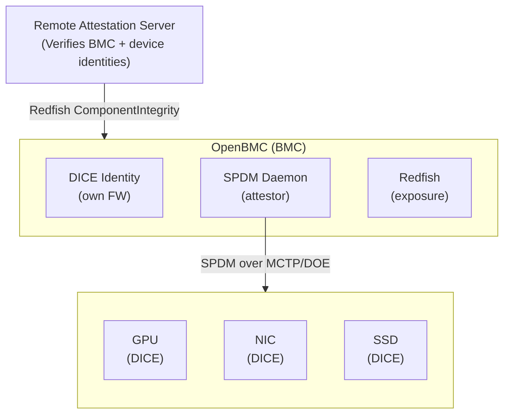
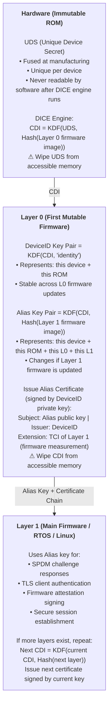
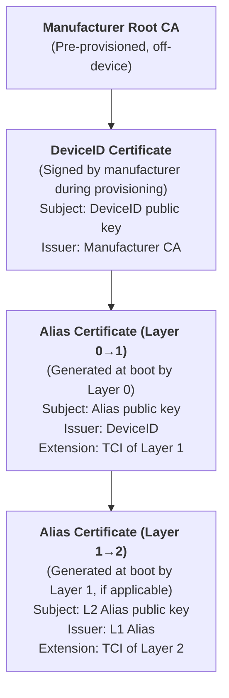
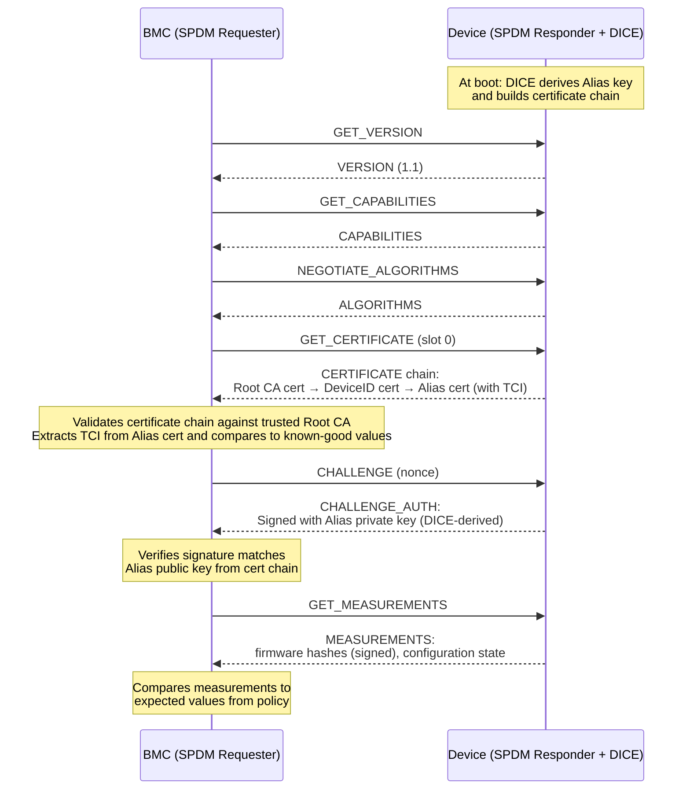
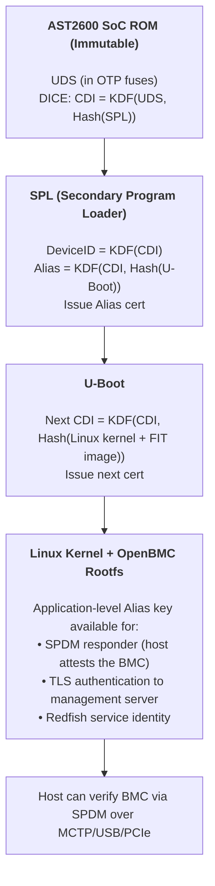
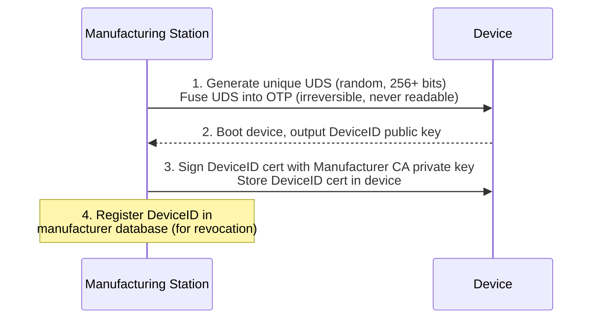
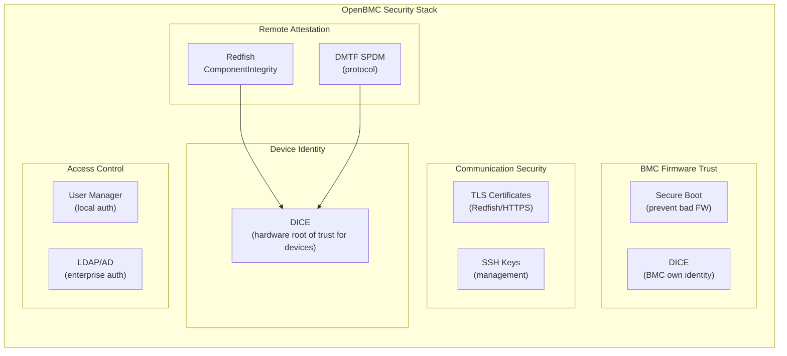

# DICE Security Guide
{: .no_toc }

Understand the Device Identifier Composition Engine (DICE) — a hardware root-of-trust standard for device identity and firmware attestation, and how it integrates with OpenBMC's SPDM attestation infrastructure.
{: .fs-6 .fw-300 }

## Table of Contents
{: .no_toc .text-delta }

1. TOC
{:toc}

---

## Overview

**DICE (Device Identifier Composition Engine)** is a TCG (Trusted Computing Group) standard that provides hardware-rooted cryptographic device identity and firmware attestation. It is designed for components where a full TPM is impractical — SSDs, NICs, GPUs, power supplies, BMCs themselves, and other embedded controllers.

DICE creates **unique cryptographic identities that are bound to the device's firmware**. If firmware changes, the identity changes. This property makes DICE ideal for supply chain security and runtime firmware attestation.

### Why DICE Matters for OpenBMC

OpenBMC operates in two DICE-related roles:

| Role | Description |
|------|-------------|
| **Verifier** | The BMC attests DICE-enabled platform components (GPUs, NICs, SSDs) via SPDM, where those devices use DICE to generate their SPDM keys |
| **Attester** | The BMC itself can use DICE for its own firmware identity, allowing the host or a remote verifier to attest the BMC |



### DICE vs. TPM

| | DICE | TPM |
|---|------|-----|
| **Hardware cost** | Minimal — ROM + fuse | Separate chip or firmware TPM |
| **Suitable for** | SSDs, NICs, GPUs, MCUs, BMCs | PCs, servers, laptops |
| **Identity** | Firmware-coupled (changes with FW update) | Stable (Endorsement Key persists) |
| **Measurement** | Built into boot chain — each layer measures next | Explicit PCR extend operations |
| **Attestation** | Certificate chain from boot layers | TPM quote over PCR values |
| **Sealing** | CDI-derived sealing keys | TPM seal/unseal with PCR policy |
| **Standard** | TCG DICE specs | TCG TPM 2.0 spec |

---

## DICE Architecture

### Core Concepts

DICE relies on three foundational elements:

| Term | What It Is |
|------|-----------|
| **UDS** (Unique Device Secret) | Per-device random secret fused in hardware at manufacturing. Never accessible to software — only the DICE ROM engine uses it. |
| **CDI** (Compound Device Identifier) | Derived from UDS + measurement of the first mutable firmware. Unique to this device AND this firmware version. |
| **TCI** (TCB Component Identifier) | The measurement (hash) of a firmware layer — its code, configuration, and security-relevant state. |

### The DICE Derivation Chain

The fundamental operation: each boot layer **measures the next** and derives a unique secret for it. If any firmware changes, all downstream secrets change.



### The Certificate Chain

Each DICE layer produces a certificate that chains to the previous layer:



A verifier (the BMC via SPDM, or a remote server via Redfish) validates the entire chain:
1. **Root CA** is trusted (pre-configured)
2. **DeviceID cert** chains to root CA
3. **Alias cert** chains to DeviceID
4. **TCI values** in certificate extensions match expected firmware hashes

### The Critical Security Property

Each layer **wipes its secrets** before passing control to the next:

- Hardware wipes UDS after computing CDI
- Layer 0 wipes CDI after computing DeviceID and Alias keys
- Layer 0 wipes DeviceID private key after issuing Alias cert

If Layer 1 (main firmware) is compromised, the attacker gets the Alias key for **this firmware version only**. They cannot:
- Forge an Alias key for a different firmware version
- Recover the DeviceID private key
- Recover the UDS

Updating firmware automatically rotates the Alias identity, invalidating any compromised keys.

---

## DICE and SPDM Integration

DICE provides the **key material and certificates**; SPDM provides the **protocol** to present them to a verifier. This is how the BMC verifies DICE-enabled devices:

### Authentication Flow



### What the BMC Learns

| SPDM Response | DICE-Provided Content | What It Proves |
|---------------|----------------------|----------------|
| `GET_CERTIFICATE` | Alias cert chain (DeviceID → Alias) | Device is genuine, manufactured by trusted vendor |
| `CHALLENGE_AUTH` | Signature from DICE-derived Alias key | Device holds the private key for this firmware version |
| `GET_MEASUREMENTS` | Firmware hashes from DICE layers | Firmware has not been tampered with |
| TCI in Alias cert extension | Hash of measured firmware | Firmware identity is cryptographically bound to the device key |

### OpenBMC SPDM Daemon Integration

The OpenBMC SPDM daemon (`spdmd`) handles the SPDM protocol. For DICE-enabled devices, the daemon:

1. Discovers SPDM-capable devices via MCTP or PCIe DOE
2. Runs the SPDM authentication flow (above)
3. Validates the DICE certificate chain against configured trusted CAs
4. Extracts TCI measurements from certificate extensions
5. Compares measurements against expected values (policy)
6. Exposes results via D-Bus and Redfish `ComponentIntegrity`

```bash
# Check SPDM attestation status for a DICE-enabled device
busctl get-property xyz.openbmc_project.SPDM \
    /xyz/openbmc_project/spdm/device/gpu0 \
    xyz.openbmc_project.SPDM.Device \
    AuthenticationStatus

# Query via Redfish
curl -k -u admin:password \
    https://${BMC_IP}/redfish/v1/ComponentIntegrity/gpu0
```

Example Redfish `ComponentIntegrity` response for a DICE-attested device:

```json
{
    "@odata.id": "/redfish/v1/ComponentIntegrity/gpu0",
    "ComponentIntegrityType": "SPDM",
    "ComponentIntegrityTypeVersion": "1.1.0",
    "SPDMIdentity": {
        "RequesterAuthentication": {
            "VerificationStatus": "Success"
        },
        "ResponderAuthentication": {
            "ComponentCertificate": {
                "@odata.id": "/redfish/v1/Managers/bmc/Certificates/SPDM_gpu0"
            },
            "VerificationStatus": "Success"
        }
    },
    "ComponentIntegrityEnabled": true,
    "TargetComponentURI": "/redfish/v1/Systems/system/Processors/gpu0",
    "Status": {
        "State": "Enabled",
        "Health": "OK"
    }
}
```

---

## BMC as a DICE Attester

The BMC itself can use DICE to establish its own firmware identity. This enables the host or a remote management server to verify the BMC firmware hasn't been tampered with.

### BMC DICE Boot Chain

On an AST2600-based OpenBMC system:



### Relationship to AST2600 Secure Boot

DICE and [Secure Boot]() are complementary:

| Feature | Secure Boot | DICE |
|---------|-------------|------|
| **Purpose** | Prevent unauthorized firmware from running | Prove which firmware IS running |
| **Mechanism** | Signature verification at each boot stage | Measurement and key derivation at each boot stage |
| **Failure mode** | Refuses to boot (hard stop) | Boots but with wrong identity (attestation fails remotely) |
| **What it guarantees** | Only signed firmware executes | Firmware identity is cryptographically verifiable |
| **OTP keys** | Verification keys (public) | UDS (secret) |

Best practice: **use both together**. Secure boot prevents unauthorized code from executing. DICE proves to remote verifiers exactly which authorized code is running.

---

## DICE Provisioning

### Manufacturing-Time Setup

DICE requires one-time provisioning at the factory:



### Certificate Authority Setup

For an OpenBMC deployment verifying DICE devices, configure the trusted CA certificates:

```bash
# Install manufacturer root CA for each device vendor
# The BMC uses these to validate DICE certificate chains

# GPU vendor root CA
busctl call xyz.openbmc_project.Certs.Manager.Authority.SPDM \
    /xyz/openbmc_project/certs/authority/spdm \
    xyz.openbmc_project.Certs.Install \
    Install s "/tmp/gpu_vendor_root_ca.pem"

# NIC vendor root CA
busctl call xyz.openbmc_project.Certs.Manager.Authority.SPDM \
    /xyz/openbmc_project/certs/authority/spdm \
    xyz.openbmc_project.Certs.Install \
    Install s "/tmp/nic_vendor_root_ca.pem"

# SSD vendor root CA
busctl call xyz.openbmc_project.Certs.Manager.Authority.SPDM \
    /xyz/openbmc_project/certs/authority/spdm \
    xyz.openbmc_project.Certs.Install \
    Install s "/tmp/ssd_vendor_root_ca.pem"
```

Or via Redfish:

```bash
# Install trusted CA certificate
curl -k -u admin:password \
    -X POST \
    -H "Content-Type: application/json" \
    -d '{"CertificateString": "<PEM-encoded-cert>", "CertificateType": "PEM"}' \
    https://${BMC_IP}/redfish/v1/Managers/bmc/Truststore/Certificates
```

---

## Attestation Policy

### Defining Expected Measurements

The BMC needs to know what firmware measurements to expect for each DICE-enabled device. This is typically a JSON policy file:

```json
{
    "devices": {
        "gpu0": {
            "vendor": "NVIDIA",
            "expected_measurements": {
                "firmware_version": "535.129.03",
                "tci_layer0": "sha256:a1b2c3d4e5f6....",
                "tci_layer1": "sha256:f6e5d4c3b2a1...."
            },
            "trusted_ca": "/etc/spdm/certs/nvidia_root_ca.pem",
            "policy": "enforce"
        },
        "nic0": {
            "vendor": "Broadcom",
            "expected_measurements": {
                "firmware_version": "230.0.148.0",
                "tci_layer0": "sha256:1a2b3c4d5e6f...."
            },
            "trusted_ca": "/etc/spdm/certs/broadcom_root_ca.pem",
            "policy": "log_only"
        }
    }
}
```

### Policy Actions

| Policy | On Attestation Success | On Attestation Failure |
|--------|----------------------|----------------------|
| **enforce** | Device operational, Health=OK | Device isolated, Redfish alert, Health=Critical |
| **log_only** | Device operational, Health=OK | Device operational, event logged, Health=Warning |
| **disabled** | No attestation performed | No attestation performed |

### Firmware Update and DICE

When a device firmware is updated, the DICE Alias key **automatically changes** (because the firmware measurement changes). The attestation policy must be updated with the new expected TCI values:

```
1. Vendor releases new firmware + new expected TCI hash
2. Admin updates policy file with new TCI
3. Device firmware is updated (via PLDM FW Update or vendor tool)
4. Device reboots — DICE derives new Alias key
5. BMC re-attests — new Alias cert has new TCI
6. BMC verifies new TCI matches updated policy
7. Attestation passes with new firmware identity
```

{: .warning }
> If the policy is not updated before firmware update, attestation will **fail** because the TCI will not match. Plan policy updates as part of your firmware update workflow.

---

## DICE Profiles

### Open DICE Profile (Google)

The [Open Profile for DICE](https://pigweed.googlesource.com/open-dice/+/HEAD/docs/specification.md) is a concrete implementation specification by Google. It standardizes:

- **CDI derivation**: HKDF-SHA256/SHA384/SHA512
- **Key types**: Ed25519, P-256, P-384
- **Certificate format**: X.509 v3 with DICE-specific extensions, or CBOR (for constrained devices)
- **Measurement format**: Standardized TCI structure

Used by Android (for hardware key attestation) and Pigweed (for embedded MCUs).

### TCG DICE Attestation Architecture

The TCG's [DICE Attestation Architecture](https://trustedcomputinggroup.org/resource/dice-attestation-architecture/) (also called "Implicit Identity Based Device Attestation") defines:

- How DICE identities map to SPDM certificate slots
- Measurement reporting formats
- Certificate extension OIDs for TCI values
- Interaction with platform TPMs (hybrid DICE + TPM scenarios)

### Android DICE

[Android DICE](https://source.android.com/docs/security/features/dice) extends the DICE chain through the full Android boot:

```
ROM → Bootloader → ABL → Kernel → microdroid → App
```

Each layer has its own CDI and certificate. Android uses this for hardware-backed key attestation (KeyMint/Keymaster) to prove to remote services which OS version and security patch level is running.

---

## Relationship to Other OpenBMC Security Features



| Feature | Guide | Relationship to DICE |
|---------|-------|---------------------|
| **SPDM** | [SPDM Guide]() | Transport protocol for DICE attestation — carries certificates and measurements |
| **Secure Boot** | [Secure Boot Guide]() | Complementary — Secure Boot prevents bad FW; DICE proves which FW is running |
| **Certificate Manager** | [Certificate Manager Guide]() | Manages trusted CA certs used to validate DICE chains |
| **MCTP/PLDM** | [MCTP/PLDM Guide]() | Physical transport for SPDM messages to DICE-enabled devices |
| **Firmware Update** | [Firmware Update Guide]() | FW updates change DICE identity — policy must be coordinated |

---

## Summary

| Concept | Description |
|---------|-------------|
| **UDS** | Per-device hardware secret, fused at manufacturing, never software-accessible |
| **CDI** | Derived from UDS + firmware measurement, unique to device + firmware version |
| **DeviceID** | Stable device identity key, derived from CDI |
| **Alias Key** | Firmware-version-specific key, used for SPDM responses |
| **Certificate Chain** | Root CA → DeviceID → Alias, validates with standard X.509 |
| **TCI** | Firmware measurement hash, embedded in certificate extensions |
| **Key rotation** | Automatic on firmware update — new FW = new Alias key |
| **BMC role (verifier)** | Uses SPDM to validate DICE chains from platform devices |
| **BMC role (attester)** | Uses DICE for its own identity, allowing host/remote verification |

---

## References

- [TCG DICE Overview](https://trustedcomputinggroup.org/what-is-a-device-identifier-composition-engine-dice/) - What is DICE
- [TCG DICE Hardware Requirements](https://trustedcomputinggroup.org/wp-content/uploads/Hardware-Requirements-for-Device-Identifier-Composition-Engine-r78_For-Publication.pdf) - Hardware specification
- [TCG DICE Layering Architecture](https://trustedcomputinggroup.org/wp-content/uploads/DICE-Layering-Architecture-r19_pub.pdf) - Multi-layer derivation
- [TCG DICE Attestation Architecture](https://trustedcomputinggroup.org/resource/dice-attestation-architecture/) - Implicit identity based attestation
- [Open Profile for DICE (Google)](https://pigweed.googlesource.com/open-dice/+/HEAD/docs/specification.md) - Concrete implementation spec
- [Android DICE](https://source.android.com/docs/security/features/dice) - Android's DICE implementation
- [DICE - Microsoft Research](https://www.microsoft.com/en-us/research/project/dice-device-identifier-composition-engine/) - Microsoft's DICE research
- [DMTF SPDM Specification](https://www.dmtf.org/dsp/DSP0274) - Protocol for transporting DICE attestation
- [OpenBMC Redfish SPDM Attestation Design](https://github.com/openbmc/docs/blob/master/designs/redfish-spdm-attestation.md) - OpenBMC integration
- [ARM TF-M DICE Protection Environment](https://trustedfirmware-m.readthedocs.io/projects/tf-m-extras/en/tf-mv2.1.0/partitions/dice_protection_environment.html) - ARM Cortex-M DICE implementation

---

{: .note }
> **DICE is a device firmware standard.** OpenBMC developers primarily interact with DICE through the SPDM attestation flow — the BMC validates DICE certificate chains from devices. Implementing DICE itself is a device firmware task. For the SPDM protocol details, see the [SPDM Guide]().
