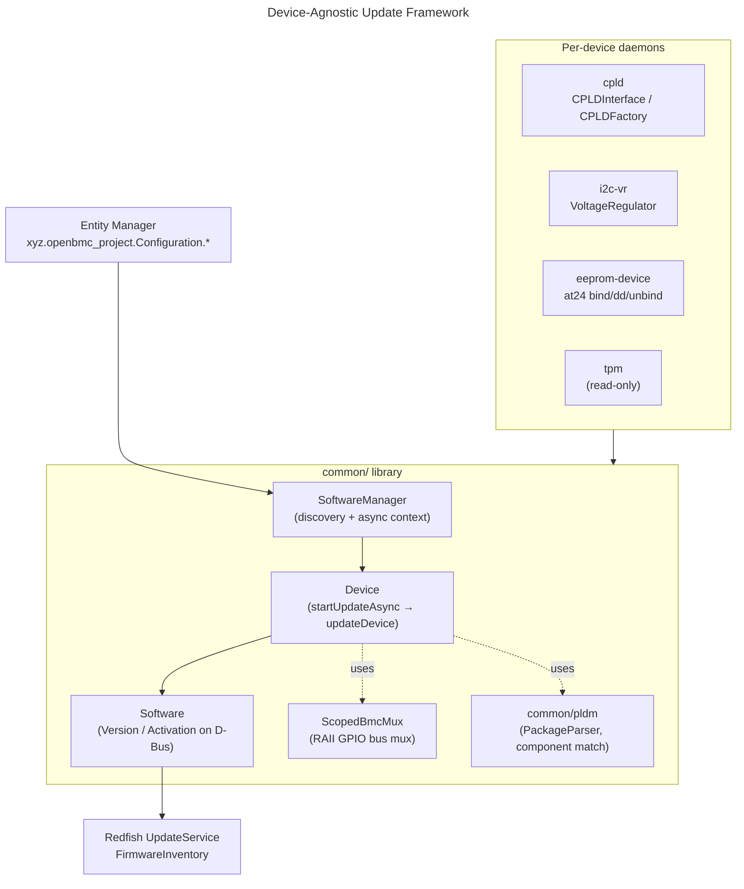

# Device Firmware Update
{: .no_toc }

Use the modern, device-agnostic firmware-update framework in phosphor-bmc-code-mgmt to update CPLDs, voltage regulators, EEPROM-backed devices, and to inventory TPMs - all driven by Entity Manager configuration.
{: .fs-6 .fw-300 }

## Table of Contents
{: .no_toc .text-delta }

1. TOC
{:toc}

---

## Overview

The [Firmware Update Guide]() covers the classic BMC/host image path (`ItemUpdater`, `ImageManager`, `Activation`) built around A/B flash images. Alongside that, `phosphor-bmc-code-mgmt` has grown a second, newer subsystem: a **device-agnostic update framework** whose job is to update the many small programmable devices that hang off the BMC - complex programmable logic devices (CPLDs), I2C voltage regulators, EEPROM-backed retimers, and similar parts.

Instead of one daemon per board, this framework provides a shared C++ **common library** of base classes, and a family of small per-device-class daemons (one for CPLDs, one for I2C voltage regulators, one for EEPROM devices, one for TPMs). Each daemon discovers its devices from **Entity Manager** configuration at runtime, exposes them on D-Bus using the standard `xyz.openbmc_project.Software.*` interfaces, and drives the flash using `sdbusplus::async` coroutines. Because the D-Bus surface is the same as the BMC updater, the same Redfish `UpdateService` and `busctl` workflows apply to every device.

You would use this framework when you are bringing up a new platform that carries programmable satellite devices and you want each one to appear in the Redfish firmware inventory and be updatable through the same pipeline as the BMC - without writing a bespoke updater for every chip.

**Key concepts covered:**
- The `common/` library base classes: `Device`, `Software`, `SoftwareManager`
- `sdbusplus::async` coroutines and the `ScopedBmcMux` RAII bus-mux helper
- PLDM component matching by compatible string and vendor IANA
- Per-device daemons: `cpld`, `i2c-vr`, `eeprom-device`, and the read-only `tpm`

{: .note }
This framework is under active upstream development. Class names, the set of supported chip families, and the exact D-Bus surface evolve quickly - always confirm against the current [openbmc/phosphor-bmc-code-mgmt](https://github.com/openbmc/phosphor-bmc-code-mgmt) tree for your build.

---

## Architecture

Every device daemon is a thin wrapper around three shared base classes that live in `common/` (`common/include/` for headers, `common/src/` for implementations):

| Base class | File | Responsibility |
|------------|------|----------------|
| `SoftwareManager` | `common/src/software_manager.cpp` | Discovers devices from Entity Manager, owns the `sdbusplus::async::context`, and instantiates one `Device` per matching config |
| `Device` | `common/src/device.cpp` | Represents one updatable device; drives the update state machine (`startUpdateAsync`) and defers the actual flash to a device-specific `updateDevice()` override |
| `Software` | `common/src/software.cpp` | Represents one firmware image/version on D-Bus (`xyz.openbmc_project.Software.*`) |

### Component Diagram



<details markdown="1">
<summary>ASCII-art version (for comparison)</summary>

```
        ┌─────────────────────────────────────────────┐
        │  Entity Manager                             │
        │  xyz.openbmc_project.Configuration.*        │
        └───────────────────────┬─────────────────────┘
                                │ InterfacesAdded
                                ▼
   ┌──────────────────────────────────────────────────────┐
   │                  common/ library                     │
   │                                                      │
   │   SoftwareManager ──▶ Device ──▶ Software            │
   │   (discovery)      (update FSM)  (D-Bus Version)     │
   │        │                │                            │
   │        │                ├─▶ ScopedBmcMux (GPIO RAII) │
   │        │                └─▶ common/pldm (matching)   │
   └────────┼─────────────────────────────────────────────┘
            │
   ┌────────┴───────────┬────────────┬──────────────┐
   ▼                    ▼            ▼              ▼
 cpld              i2c-vr      eeprom-device       tpm
 CPLDInterface   VoltageReg.   at24 bind/dd      (read-only)
 CPLDFactory                   /unbind
            │
            ▼
   Redfish UpdateService / FirmwareInventory
```

</details>

### Discovery and configuration flow

`SoftwareManager` takes an `sdbusplus::async::context& ctx` in its constructor and watches Entity Manager for `InterfacesAdded`/`InterfacesRemoved` on the inventory tree (service `xyz.openbmc_project.EntityManager`, path root `/xyz/openbmc_project/inventory`). When a matching configuration appears, it reads the device's `<config>.FirmwareInfo` sub-interface:

| Property | Type | Purpose |
|----------|------|---------|
| `VendorIANA` | `uint64` | Vendor IANA Enterprise Number used for PLDM component matching |
| `CompatibleHardware` | `string` | Compatible string (dotted, e.g. `com.meta.Hardware...`) used for PLDM component matching |
| `Type` | `string` | Selects the device-specific implementation (chip family) |
| `Name` | `string` | Human-readable name |

These are packaged into a `SoftwareConfig` and handed to a new `Device`.

### Coroutine-based update state machine

The framework is asynchronous end to end. `Device::startUpdateAsync` is a coroutine:

```cpp
// common/src/device.cpp (signature, upstream master)
sdbusplus::async::task<bool> Device::startUpdateAsync(
    sdbusplus::message::unix_fd image,
    RequestedApplyTimes applyTime,
    std::unique_ptr<Software> softwarePendingIn);
```

Inside, it `co_await`s each step - parsing the incoming PLDM package, selecting the matching component image, then calling the device-specific `updateDevice(image, size)` override, and finally publishing the new `Software` version. Daemons spawn work with `ctx.spawn(...)` and never block the event loop.

### ScopedBmcMux (RAII bus mux)

Many satellite devices sit behind a mux or a bus that is normally owned by the host. Flashing them safely means routing the bus to the BMC for the duration of the write and handing it back afterward - even if the update fails partway. The framework provides a RAII helper in `common/include/gpio_controller.hpp`:

```cpp
// A RAII wrapper: mux GPIO lines to BMC on construction,
// back to device on destruction.
class ScopedBmcMux
{
  public:
    explicit ScopedBmcMux(GPIOGroup& group);   // muxToBMC()
    ~ScopedBmcMux();                            // muxToDevice()
};
```

`GPIOGroup` provides the underlying `muxToBMC()`, `muxToDevice()`, and `releaseAll()` operations. A `Device` implementation constructs a `ScopedBmcMux` on the stack at the start of a flash; when the object leaves scope (success or exception), the destructor restores the bus to the device automatically.

{: .tip }
This RAII pattern is why the update path is exception-safe: you never have to remember to un-mux the bus in an error branch. Prefer stack-scoped `ScopedBmcMux` over calling `muxToBMC()`/`muxToDevice()` by hand.

### PLDM component matching

Incoming images are PLDM firmware update packages. `common/pldm` contains a `PackageParser` (supporting PLDM firmware package revision up to 1.0.0) that walks the package's component image set. A component is applied to a device only when **both** identifiers agree:

- the device's `CompatibleHardware` string matches the component's descriptor, and
- the device's `VendorIANA` matches the component's vendor.

This is what lets a single uploaded package carry firmware for several different satellite devices and land each component on the correct part.

### D-Bus Interfaces

| Interface | Object Path | Description |
|-----------|-------------|-------------|
| `xyz.openbmc_project.Software.Version` | `/xyz/openbmc_project/software/<id>` | Reports the device firmware version |
| `xyz.openbmc_project.Software.Activation` | `/xyz/openbmc_project/software/<id>` | Activation state during/after update |
| `xyz.openbmc_project.Software.Update` | `/xyz/openbmc_project/software/<id>` | `StartUpdate` entry point (takes an image FD + apply time) |

---

## CPLD Firmware Update

The `cpld/` daemon (`xyz.openbmc_project.Software.CPLD.service`) updates complex programmable logic devices over I2C. Its core files are `cpld.cpp`, `cpld_interface.cpp`, and `cpld_software_manager.cpp`.

### Interface and factory

Vendor support is organized around two types in `cpld_interface.hpp`:

- **`CPLDInterface`** - the abstract base each vendor implements (erase/program/verify for that silicon).
- **`CPLDFactory`** - a registry that maps a chip-type string to a constructor. Vendor back-ends register themselves with `registerCPLD(chipType, creator)`, and the daemon calls `create(chipType, ...)` to obtain the right implementation. Internally it is a `std::unordered_map<std::string, Creator>`.

### Supported vendors

| Vendor | Family | Implementation files |
|--------|--------|----------------------|
| Altera (Intel) | **MAX10** | `cpld/altera/max10_base_cpld.*`, `max10_standard_cpld.*`, `max10_cpld_factory.*` |
| Lattice | **XO3** (e.g. LCMXO3LF-4300C) | `cpld/lattice/lattice_xo3_cpld.*`, `lattice_base_cpld.*`, `lattice_cpld_factory.*` |
| Lattice | **XO5** (base / standard / T-series) | `cpld/lattice/lattice_xo5_base_cpld.*`, `lattice_xo5_standard_cpld.*`, `lattice_xo5_tseries_cpld.*` |

{: .note }
The upstream tree ships Altera MAX10 and Lattice XO3/XO5 back-ends today. Other families referenced informally (for example Lattice XO2) are not present as dedicated implementations at the time of writing - verify against the `cpld/altera/` and `cpld/lattice/` directories for your build.

### Configuration

Entity Manager describes the CPLD with a `Type` that selects the factory back-end and a `FirmwareInfo` block for PLDM matching:

```json
{
    "Name": "Harma_MB_CPLD",
    "Type": "LatticeLCMXO3LF_4300CFirmware",
    "Bus": 5,
    "Address": "0x40",
    "FirmwareInfo": {
        "VendorIANA": 40981,
        "CompatibleHardware": "com.meta.Hardware.Harma.CPLD.LCMXO3LF_4300C_mb"
    }
}
```

This surfaces on D-Bus as `xyz.openbmc_project.Configuration.LatticeLCMXO3LF_4300CFirmware` (the interface name is the configuration `Type`).

---

## I2C Voltage Regulator Firmware Update

The `i2c-vr/` daemon (`xyz.openbmc_project.Software.I2CVR.service`) programs voltage regulators / PMBus controllers. Core files: `i2cvr_device.cpp`, `i2cvr_software_manager.cpp`, and the `vr.cpp` / `vr.hpp` base.

### VoltageRegulator base and factory

`vr.hpp` defines the abstract **`VoltageRegulator`** base and a `VRType` enum enumerating the supported controllers. Instances are created through a factory:

```cpp
// i2c-vr/vr.hpp (upstream master)
std::unique_ptr<VoltageRegulator> create(
    sdbusplus::async::context& ctx, enum VRType vrType,
    uint16_t bus, uint16_t address);

bool stringToEnum(std::string& vrStr, VRType& vrType);
```

### Supported families

The `VRType` enum and the per-vendor subdirectories (`xdpe1x2xx/`, `xdp71x/`, `tda38640a/`, `isl69269/`, `mps/`, `tps25990/`) cover:

| Vendor | Controllers (VRType) |
|--------|----------------------|
| Infineon | `XDPE1X2XX`, `XDP71X`, `TDA38640A` |
| Renesas / Intersil | `ISL69269`, `RAA22XGen2`, `RAA22XGen3p5` |
| MPS (Monolithic Power) | `MP2X6XX`, `MP292X`, `MP297X`, `MP5998`, `MP994X`, `MPQ87XX` |
| Texas Instruments | `TPS25990` |
| Richtek | `RS31390` |

{: .warning }
**Voltage-regulator configuration memory has a limited number of write cycles.** Most of these controllers store their configuration in OTP (one-time programmable) or MTP (multi-time programmable) memory with a small, finite endurance - often only a handful of reprogramming cycles. A failed or repeated update can permanently exhaust the part, and a corrupt VR image can leave a rail unable to power on. Update VRs only with a vendor-validated image, confirm the power state is safe first, and never loop the update in test scripts.

### Configuration

```json
{
    "Name": "vr_p0_vddcr",
    "Type": "XDPE1X2XXFirmware",
    "Bus": 3,
    "Address": "0x76",
    "FirmwareInfo": {
        "VendorIANA": 40981,
        "CompatibleHardware": "com.example.Hardware.Vr.XDPE192C4"
    }
}
```

---

## EEPROM Device Update

The `eeprom-device/` daemon (`xyz.openbmc_project.Software.EEPROMDevice.service`) updates devices whose firmware lives in an attached I2C EEPROM - PCIe retimers being the canonical case. Core files: `eeprom_device.cpp`, `eeprom_device_software_manager.cpp`, `eeprom_device_version.cpp`.

### Update mechanism: at24 bind → dd → unbind

Rather than bit-banging PMBus, this daemon reuses the kernel's `at24` EEPROM driver and the `dd` tool:

1. **Bind** the `at24` driver to the device so a sysfs `eeprom` file appears:
   ```cpp
   // eeprom_device.cpp (upstream master)
   auto bindPath = driverPath + "/bind";        // /sys/bus/i2c/drivers/at24/bind
   std::ofstream ofbind(bindPath, std::ofstream::out);
   ofbind << i2cDeviceId;                        // e.g. "3-0050"
   ```
2. **Write** the image to the resulting EEPROM node:
   ```cpp
   std::string cmd = "dd if=" + path +
                     " of=" + eepromPath + " bs=1k";   // of=/sys/bus/i2c/devices/{bus}-{addr}/eeprom
   auto success = co_await asyncSystem(ctx, cmd);
   ```
3. **Unbind** the driver so the device returns to normal operation:
   ```cpp
   auto unbindPath = driverPath + "/unbind";     // /sys/bus/i2c/drivers/at24/unbind
   std::ofstream ofunbind(unbindPath, std::ofstream::out);
   ofunbind << i2cDeviceId;
   ```

The image is staged to a temporary file under `/tmp/` first, then `dd`'d onto the EEPROM node.

### DeviceVersion providers

Reading back the *running* firmware version usually cannot be done from the raw EEPROM - it requires talking to the device itself. `eeprom_device_version.hpp` defines a **`DeviceVersion`** base with a factory:

```cpp
// eeprom-device/eeprom_device_version.hpp (upstream master)
class DeviceVersion
{
  public:
    virtual std::string getVersion() = 0;
    virtual std::optional<HostPowerInf::HostState>
        getHostStateToQueryVersion() = 0;
};

std::unique_ptr<DeviceVersion> getVersionProvider(
    const std::string& chipModel, uint16_t bus, uint8_t address);
```

`getHostStateToQueryVersion()` lets a provider declare that the version can only be read in a particular host power state. The Astera Labs **PT5161L** retimer ships as one such provider.

### Configuration

```json
{
    "Name": "Harma_Retimer0",
    "Type": "PT5161LFirmware",
    "Bus": 1,
    "Address": "0x24",
    "FirmwareInfo": {
        "VendorIANA": 40981,
        "CompatibleHardware": "com.meta.Hardware.Harma.pt5161l.Retimer"
    }
}
```

This surfaces as `xyz.openbmc_project.Configuration.EEPROMDevice`.

---

## TPM Device Management

The `tpm/` daemon (`xyz.openbmc_project.Software.TPM.service`) participates in the same framework, but with an important limitation.

{: .warning }
**TPM firmware update is NOT implemented today.** The concrete TPM implementation in `tpm/tpm2/tpm2.hpp` declares `isUpdateSupported()` to `return false`, and `TPM2Interface::updateFirmware()` immediately logs `"TPM2 firmware update is not supported"` and returns failure. The daemon exists to **report** TPM firmware version and manufacturer - not to flash the TPM.

The relevant upstream code is unambiguous:

```cpp
// tpm/tpm2/tpm2.hpp
bool isUpdateSupported() const final
{
    // Currently, we do not support TPM2 firmware updates
    return false;
}
```

```cpp
// tpm/tpm2/tpm2.cpp
sdbusplus::async::task<bool> TPM2Interface::updateFirmware(
    const uint8_t* image, size_t image_size)
{
    (void)image;
    (void)image_size;
    error("TPM2 firmware update is not supported");
    co_return false;
}
```

### What it actually does

The daemon reads TPM properties by shelling out to `tpm2_getcap` against the TPM resource manager, then publishes the version on D-Bus:

```bash
/usr/bin/tpm2_getcap properties-fixed --tcti device:/dev/tpmrm0 | grep -A1 <property>
```

It validates the manufacturer against a known set and formats the firmware version:

| Manufacturer | ID (`TPM2_PT_MANUFACTURER`) | Version property |
|--------------|----------------------------|------------------|
| Infineon (IFX) | `0x49465800` | `TPM2_PT_FIRMWARE_VERSION_1` |
| Nuvoton | `0x4E544300` | `TPM2_PT_FIRMWARE_VERSION_1` (+ `_VERSION_2`) |

The version is composed by bit-shifting the raw value (`fwVer >> 16` for major, `fwVer & 0xFFFF` for minor).

### Configuration

TPMs are described with the `xyz.openbmc_project.Configuration.TPM2Firmware` interface (note the distinct name from the other devices), including a `VendorIANA`:

```json
{
    "Name": "System_TPM",
    "Type": "TPM2Firmware",
    "VendorIANA": 40981,
    "CompatibleHardware": "com.example.Hardware.Tpm"
}
```

{: .note }
Because `isUpdateSupported()` is `false`, `SoftwareManager` still surfaces the TPM's version in the firmware inventory, but any attempt to start an update is rejected. Treat the TPM entry as read-only until upstream adds an updater back-end.

---

## Troubleshooting

### Issue: Device never appears in the firmware inventory

**Symptom**: The daemon is running but `busctl tree xyz.openbmc_project.Software.<Device>` shows no object for your part.

**Cause**: Entity Manager did not publish a matching `xyz.openbmc_project.Configuration.<Type>` interface, or the `Type` string does not match a registered factory back-end.

**Solution**:
1. Confirm the config is on D-Bus:
   ```bash
   busctl call xyz.openbmc_project.ObjectMapper /xyz/openbmc_project/object_mapper \
     xyz.openbmc_project.ObjectMapper GetSubTree sias "/xyz/openbmc_project/inventory" 0 1 \
     "xyz.openbmc_project.Configuration.EEPROMDevice"
   ```
2. Verify the `Type` string exactly matches a factory registration (`CPLDFactory` / `VRType` / provider name).
3. Check the daemon log: `journalctl -u xyz.openbmc_project.Software.CPLD -f`.

### Issue: Update starts but fails immediately

**Symptom**: `StartUpdate` returns, but `Activation` goes to `Failed`.

**Cause**: PLDM component matching found no component for this device (mismatched `CompatibleHardware` or `VendorIANA`), or the bus could not be muxed to the BMC.

**Solution**:
1. Confirm the package actually contains a component whose descriptor matches the device's `CompatibleHardware` string and `VendorIANA`.
2. Check for GPIO/mux errors in the log - a failed `ScopedBmcMux` construction aborts the flash.
3. For EEPROM devices, verify the `at24` driver bound: `ls /sys/bus/i2c/devices/<bus>-<addr>/eeprom`.

### Issue: TPM update request is rejected

**Symptom**: Attempting to update the TPM returns an error / "not supported".

**Cause**: This is expected. `isUpdateSupported()` returns `false`; the TPM daemon is read-only.

**Solution**: None required - use the entry to read the TPM version only. Track upstream for a future updater back-end.

### Debug Commands

```bash
# List all device-update daemons
systemctl list-units 'xyz.openbmc_project.Software.*'

# Follow a specific daemon
journalctl -u xyz.openbmc_project.Software.I2CVR -f

# Inspect a discovered device's version
busctl introspect xyz.openbmc_project.Software.CPLD \
    /xyz/openbmc_project/software/<id> \
    xyz.openbmc_project.Software.Version

# Read TPM version (read-only device)
tpm2_getcap properties-fixed --tcti device:/dev/tpmrm0
```

---

## References

### Official Resources
- [phosphor-bmc-code-mgmt Repository](https://github.com/openbmc/phosphor-bmc-code-mgmt)
- [common/ firmware library](https://github.com/openbmc/phosphor-bmc-code-mgmt/tree/master/common)
- [cpld/ daemon](https://github.com/openbmc/phosphor-bmc-code-mgmt/tree/master/cpld) ·
  [i2c-vr/ daemon](https://github.com/openbmc/phosphor-bmc-code-mgmt/tree/master/i2c-vr) ·
  [eeprom-device/ daemon](https://github.com/openbmc/phosphor-bmc-code-mgmt/tree/master/eeprom-device) ·
  [tpm/ daemon](https://github.com/openbmc/phosphor-bmc-code-mgmt/tree/master/tpm)
- [Software D-Bus interfaces](https://github.com/openbmc/phosphor-dbus-interfaces/tree/master/yaml/xyz/openbmc_project/Software)

### Related Guides
- [Firmware Update Guide]()
- [BIOS Firmware Management]()
- [PLDM Firmware Update Guide]()
- [MCTP & PLDM Guide]()

### External Documentation
- [PLDM Firmware Update Specification (DMTF DSP0267)](https://www.dmtf.org/dmtf-redfish-publications)
- [Entity Manager](https://github.com/openbmc/entity-manager)

---

{: .note }
**Verified against**: `openbmc/phosphor-bmc-code-mgmt` master branch (2026-07). Class names and supported-chip lists change frequently upstream - reconfirm against the current tree before relying on them.
Last updated: 2026-07-15
