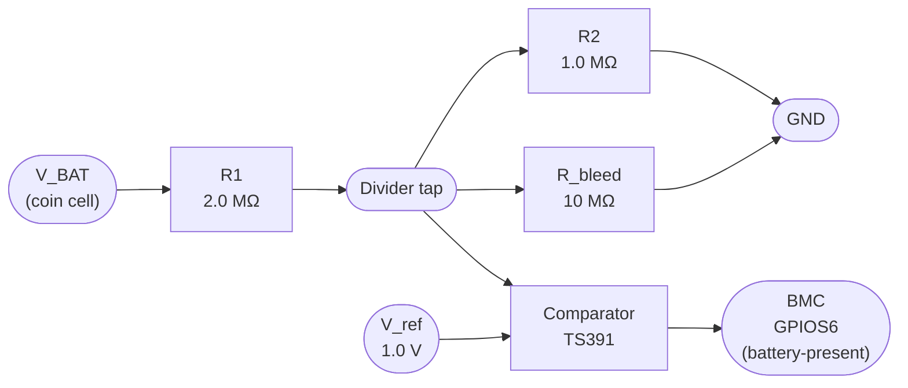

# Battery-Present Comparator — Reference Schematic

**Purpose.** Provide a runtime (live) battery-removal detector. Complements the VBAT-SRAM token mechanism; covers the threat window when the coin cell is pulled while the BMC is running.

**Scope limitation.** This detector is powered by `VCC_STBY`. When the system is fully powered off, it is inert and cannot see a removal event. The VBAT-SRAM token mechanism in the reporter covers that window instead. **Both detectors are needed for full coverage.**

## Block Diagram



## Reference Values

```
U1  TS391IL  (or LM393 for lower-voltage platforms)
    V_supply: 2.7 .. 5.5 V (tie to VCC_STBY)
    I_quiescent: ≤ 150 µA (does not count against coin-cell budget — U1 is on VCC_STBY)
    Output: open-drain; pull-up to VCC_STBY via 10 kΩ
    pin 2 = VIN+ = tap
    pin 3 = VIN- = V_ref
    pin 4 = GND
    pin 7 = output to BMC GPIOS6
    pin 8 = VCC_STBY

R1  2.0 MΩ ±1% 0402  (V_BAT to tap)
R2  1.0 MΩ ±1% 0402  (tap to GND)
    Divider ratio: 1/3
    Threshold at tap = V_ref = 1.0 V  →  V_BAT threshold = 3.0 V
    (adjust R1/R2 to set V_BAT threshold for your desired "healthy" cut-off)

R_bleed  10 MΩ ±5% 0402  (tap to GND)
    Forces tap to 0 V when coin cell is removed (no more charge path)
    Steady-state current draw from V_BAT: ≈ 0.3 µA at 3 V

C1       10 nF 0402 X7R  (tap to GND)
    Smooths VCC_STBY ramp artifacts seen by the comparator

V_ref    1.0 V reference
    Options:
      (a) LM4040-1.0 shunt reference (simplest, ≈ 50 µA draw from VCC_STBY)
      (b) TL431 set to 1.0 V (cheap, 1 % accuracy)
      (c) Resistor divider from VCC_STBY (acceptable if VCC_STBY is well-regulated)

R_pullup 10 kΩ 0402  (comparator output to VCC_STBY)
```

## Truth Table

| V_BAT  | Tap (V) | vs V_ref (1.0 V) | Comparator output | BMC sees    |
|--------|---------|-------------------|-------------------|-------------|
| 0.0 V (removed)       | 0.00 | below | **Low**  | battery-present = 0 |
| 2.0 V (very low)      | 0.67 | below | Low      | battery-present = 0 |
| 2.5 V (end-of-life)   | 0.83 | below | Low      | battery-present = 0 |
| 2.8 V (near threshold)| 0.93 | below | Low      | battery-present = 0 |
| 3.0 V (fresh / nominal)| 1.00 | equal | transitioning | (hysteresis needed) |
| 3.2 V (freshly inserted)| 1.07 | above | **High** | battery-present = 1 |

Set the threshold at the "present enough to be trusted as a supply" voltage, not at "any voltage". The CR2032 discharge curve drops quickly below 2.5 V under load; treat anything below 2.5 V as "effectively removed" even if the cell is physically present.

## Current Budget

| Item                  | From       | Current |
|-----------------------|------------|---------|
| Divider R1+R2 = 3 MΩ  | V_BAT      | 1.0 µA at 3.0 V |
| Bleed resistor 10 MΩ  | V_BAT      | 0.3 µA at 3.0 V |
| Comparator input bias | V_BAT (via R1) | ≤ 50 nA |
| **Total V_BAT draw**  |            | **≈ 1.35 µA** |
| Comparator supply     | VCC_STBY   | 150 µA (not on coin-cell budget) |
| Reference             | VCC_STBY   | 50 µA |
| Output pull-up 10 kΩ  | VCC_STBY   | 330 µA (only when output high) |

At 1.35 µA from V_BAT, a 220 mAh CR2032 sustains the detector for far longer than its own shelf life — the detector is essentially free from the coin-cell's perspective.

## Hysteresis

The comparator has no hysteresis as shown, so a V_BAT sitting right at the 3.0 V threshold can dither. Add a 10 MΩ positive-feedback resistor from comparator output to VIN+ for ~50 mV of hysteresis, or use a comparator with built-in hysteresis (e.g., `TLV3201`).

## Why Not an ADC

An ADC gives a continuous reading of V_BAT, which is informative but pushes the threshold decision into software. That has two disadvantages:

1. **Blurred removed/low boundary.** 0 V (removed) and 0.05 V (dirty divider, leaky bleed resistor) look similar on an ADC. A comparator's discrete output *is* the threshold — the analog noise is collapsed at hardware.
2. **Latency.** An ADC read is typically ≥ 1 ms end-to-end, and the ADC is shared with other sensors. A comparator signals in microseconds and does not contend for a shared peripheral.

Use an ADC **in addition to** the comparator if you also want to report `BatteryLow` advisories (e.g., at ≤ 2.7 V), but keep the comparator as the "present/removed" primitive.
