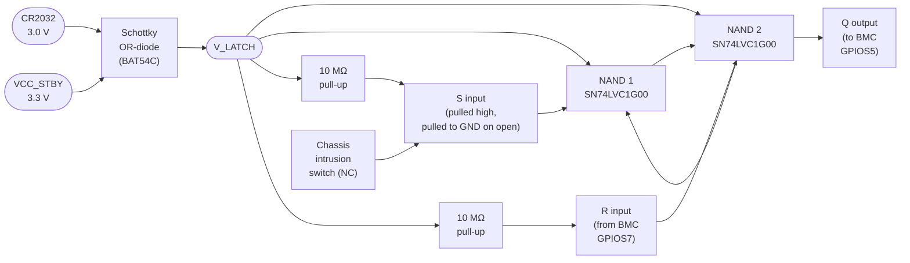

# Coin-Cell-Backed Intrusion Latch — Reference Schematic

**Purpose.** Capture chassis intrusion while the system is fully powered off, so the BMC can log a `TamperingDetected` event on its next boot.

## Block Diagram



## Pin-Exact Reference Values

```
U1  SN74LVC1G00  (or SN74AUP1G00 for lower I_cc)
    pin 1 = A (S input, active-low-set)
    pin 2 = B (tied to V_LATCH)
    pin 3 = GND
    pin 4 = Y (to NAND2 B-input)
    pin 5 = VCC = V_LATCH
    decoupling: 100 nF to GND, 0402 ceramic, placed < 5 mm from VCC pin

U2  SN74LVC1G00
    pin 1 = A (R input from BMC GPIOS7)
    pin 2 = B (Q feedback from U1.Y)
    pin 3 = GND
    pin 4 = Y = Q (to BMC GPIOS5)
    pin 5 = VCC = V_LATCH
    decoupling: 100 nF to GND, 0402 ceramic

D1,D2  BAT54C (common-cathode dual Schottky)
    V_f ≤ 0.3 V @ I = 1 µA, I_R ≤ 2 µA @ 3 V
    anode1 = CR2032 positive, anode2 = VCC_STBY, cathode = V_LATCH

R1, R2  10 MΩ ±5%  0402
    pull-up on S (U1.A) to V_LATCH
    pull-up on R (U2.A) to V_LATCH
    (10 MΩ keeps I_cc below 0.5 µA per rail at 3 V)

C1  100 nF 0402 X7R, V_LATCH to GND
    (supply decoupling; place adjacent to U1 / U2 VCC pins)

BT1  CR2032 3.0 V coin cell + vertical holder
    typical 220 mAh, I_discharge target < 5 µA
    expected shelf life at target discharge: ≥ 5 years
```

## Signal Directions

| Net     | BMC pin | Direction | Purpose                                    |
|---------|---------|-----------|--------------------------------------------|
| `S`     | —       | latch input (from chassis switch) | Low when chassis open |
| `Q`     | GPIOS5  | BMC input | High = latched (intrusion happened)        |
| `R`     | GPIOS7  | BMC output | Pulse high ≥ 1 µs to clear Q              |
| `V_LATCH` | —     | rail      | OR of CR2032 and VCC_STBY; powers U1/U2    |

## Design Caveats

**Reference only.** Before committing silicon, validate:

- **ESD protection** on the `S` line — the chassis switch is exposed to ±8 kV IEC 61000-4-2 discharge. Add a TVS diode (e.g., PESD3V3L1BA) close to the connector.
- **Creepage and clearance** between the CR2032 holder pins and adjacent traces. Per IPC-2221, for 30 V or less, minimum 0.13 mm creepage on uncoated inner layers.
- **Reverse-insertion protection** on the CR2032 holder — a series Schottky in the positive path prevents a reverse-inserted cell from damaging the latch IC.
- **Coin-cell discharge model** under your actual quiescent current — the 5-year estimate assumes 5 µA at 25 °C; halve it at 70 °C.
- **V_LATCH voltage range** — SN74LVC1G00 is specified for 1.65–5.5 V; the cross-over between CR2032 depletion and VCC_STBY absence must stay above 1.65 V. If your VCC_STBY is not always present, consider SN74AUP1G00 (rated down to 0.8 V).
